# SDWN (Software-Defined Wireless Networking)

## 강의 교안 사이트

[https://sites.google.com/kookmin.ac.kr/mclab/class?authuser=0](https://sites.google.com/kookmin.ac.kr/mclab/class?authuser=0) 

• [Mininet](https://mininet.org/)  

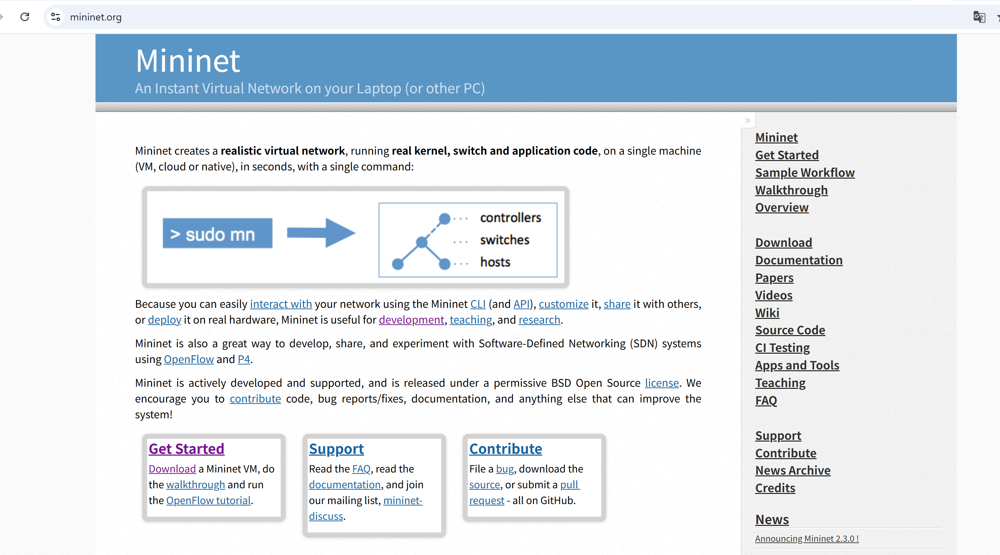

• [Ryu Controller 한글 Book](https://drive.google.com/file/d/1hD58Ot_jQT7iq0weWZ--v8FhnVZum2tE/view?usp=sharing)

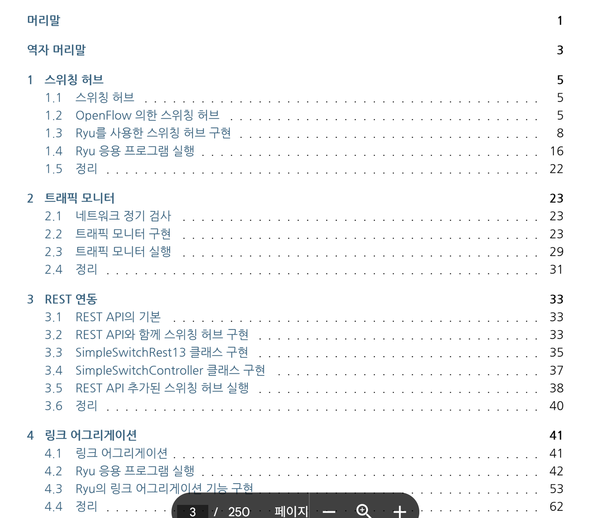

• [Mininet-WiFi Manual](https://drive.google.com/file/d/1oG8tK9eENOTZEo3AdMY1MuAWoOp-7teF/view?usp=drive_link)

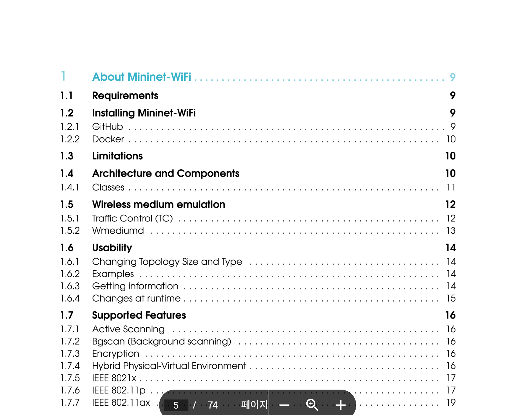

## Wireless Networking (무선 네트워킹) — Path Loss (경로 손실)

- Path Loss는 **무선 신호가 전파되는 동안 세기가 감소하는 현상**
    - 주요 원인은 **거리 증가**, **장애물**, **환경 요인**
    - 무선 통신(Wireless Communications)의 기본 중 하나인 **경로 손실(Path Loss)** 세부 현상
        - 감쇄, 장기 페이딩, 단기 페이딩

---

### 1. **Attenuation (신호 감쇄)**

- 송신자와 수신자 사이의 **거리 증가**로 인해 전파 세기가 점점 약해짐.
    - 송신자(신호원) 근처에서 **수신자(Target)가 거리 변화에 따라 움직일 때** 발생.
    - 거리가 멀어질수록 신호 세기가 감소함.
    - 신호 감쇄는 환경(벽, 공기, 장애물 등)에 따라 달라짐.
    - 일반적으로 전파 세기는 거리의 제곱에 반비례하여 감소.
- 거리 (d)에 따라 신호 세기 (P_r)는 대략적으로

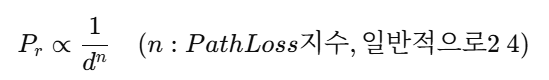

- n: Path Loss 지수, 일반적으로 2~4로 감소

---

### 2. **Long-Term Fading (장기 페이딩)**

- **장시간 동안** 평균적인 무선 신호 변화.
    - 신호 경로에 **obstruction(방해물)** 이 생기면 발생.
    - 건물, 나무, 산 등 큰 구조물에 의해 신호 세기가 변함.
    - 평균적인 신호 세기 변화로 간주되며, **slow fading**이라고도 부름.
    - **시간적으로 평균적인 신호 감쇠**를 의미.
        - 건물, 지형 등의 **큰 장애물에 의한 신호 차단 또는 반사**가 주요 원인.
        - 예: 도시 빌딩 사이 골목에서 Wi-Fi 세기가 약한 현상.

---

### 3. **Short-Term Fading (단기 페이딩)**

- **단시간 동안** 신호가 급격하게 변하는 현상.
    - 환경 내 반사, 산란, 회절에 의해 발생.
    - 수신기가 미세하게 움직이거나 주변 환경이 조금만 변해도 신호 세기가 크게 달라짐.
    - **fast fading**이라고도 함.
    - 짧은 시간 또는 작은 거리 이동에서도 생기는 **신호 세기 변동**.
        - 주로 다중 경로(Multipath) 전파로 인한 간섭 때문에 발생.

---

## Short-Term Fading (단기 페이딩)의 세부 물리 현상

### 1. Reflection (반사)

- 신호가 매끄러운 표면(건물, 벽 등)을 만나 반사됨.
- 입사각 = 반사각 ( **스넬의 법칙** 적용)
- 반사로 인해 다중 경로 신호(multipath)가 발생하여 간섭이 생길 수 있음.

### 2. Scattering (산란)

- 표면이 거칠거나 물체 크기가 **파장과 비슷할 때** 신호가 여러 방향으로 흩어짐
- 약한 신호들이 여러 경로로 수신기에 도달.

### 3. Diffraction (회절)

- 신호가 **장애물의 모서리**를 돌아 전달되는 현상.
- 전파가 투과 불가능한 물체를 만나도 일정 부분은 휘어져서 뒤쪽으로 전달됨.

---

| 구분 | 주요 원인 | 시간/공간 특성 | 대표 현상 |
| --- | --- | --- | --- |
| 감쇄 (Attenuation) | 거리 증가 | 거리 의존 | 신호 세기 감소 |
| 장기 페이딩 (Long-Term) | 큰 장애물, 지형 | 느린 변화 | 평균 신호 약화 |
| 단기 페이딩 (Short-Term) | 다중 경로, 반사/산란 | 빠른 변화 | 순간적 세기 변화 |

---

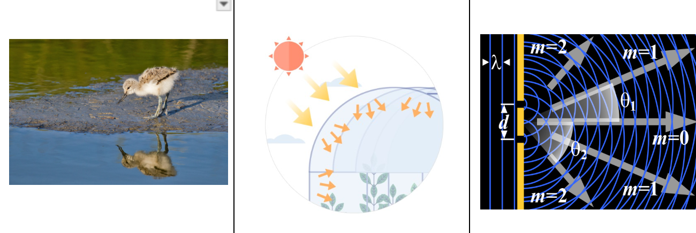

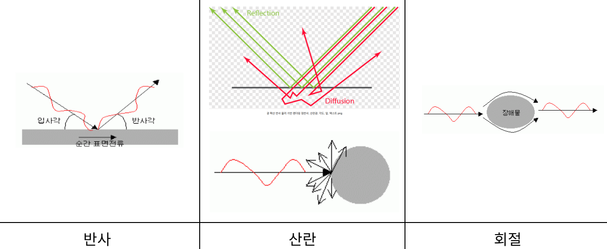

---

## **dBm** 정의

- `dBm`은 전력 단위를 **데시벨 밀리와트(decibel-milliwatt)** 로 표현한 것
    - **dBm** = 데시벨 단위로 표시한 **milliwatt(1/1000 W)** 기준 전력

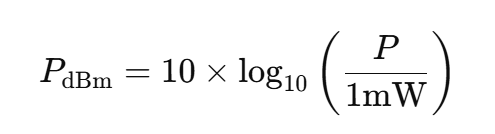

---

| 실제 전력 (W) | 전력 (mW) | 변환된 dBm |
| --- | --- | --- |
| 1 W | 1000 mW | 10 × log₁₀(1000) = **30 dBm** |
| 0.1 W | 100 mW | 10 × log₁₀(100) = **20 dBm** |
| 1 mW | 1 mW | 10 × log₁₀(1) = **0 dBm** |
| 0.001 mW | 10⁻³ mW | 10 × log₁₀(10⁻³) = **–30 dBm** |

---

## 역변환

- dBm 값을 실제 전력으로 바꾸려면:
    - 10 dBm → 10^(10/10) = 10 mW
    - –20 dBm → 10^(–20/10) = 0.01 mW

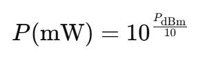

---

- **무선 통신**, **RF 시스템**, **네트워크 측정**에서 신호 세기 표현에 많이 사용
- 송신기 출력, 안테나 입력, 수신 감도 등을 나타낼 때 편리
    - Wi-Fi 신호 세기: –30 dBm (매우 강함) ~ –90 dBm (약함)
    - 스마트폰 수신 감도: 보통 –100 dBm 이하로 떨어지면 통신 불량
        - dBm은 1 mW를 기준으로 전력 크기를 로그 스케일로 표현한 단위이며, 0 dBm = 1 mW, 10 dBm = 10 mW, 30 dBm = 1 W, –30 dBm = 1 µW

---

## 무선 통신 시스템 개발

- 전 세계적으로 무선 통신의 수요가 급격히 증가함에 따라, 이러한 요구를 충족하기 위한 **새로운 무선 기술과 전파 모델**이 지속적으로 등장
- 어떤 무선 시스템이든 개발 과정에서는 **전파 전파(Propagation)** 와 관련된 **물리적 현상**에 대한 깊은 이해가 필수

---

## 경로 손실 (Path Loss)

- **경로 손실(path loss)** 이란 송신기에서 수신기로 전파가 전달될 때 **거리 증가에 따라 신호 세기가 감소하는 현상**
    - 일반적으로 수신 전력은 **RSSI (Received Signal Strength Indicator)** 값으로 나타내며, 단위는 **dBm**
    - 아래 그림은 기지국(Base Station)과 무선 단말(Wireless Station) 사이의 거리에 따라 RSSI가 어떻게 변하는지를 보여줌
        
        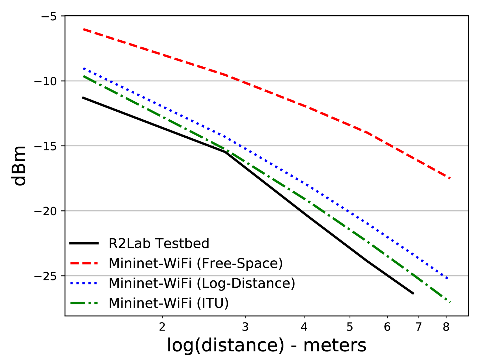
        
    - 이때 여러 가지 **전파 모델(Propagation Model)** 들 — 즉 **Free-Space**, **Log-Distance**, **ITU 모델** — 의 예측값과 실제 실험 데이터(R2Lab 테스트베드에서 측정한 값)를 비교

---

### 주요 전파 모델

| 모델 | 설명 | 특징 |
| --- | --- | --- |
| **Free-Space (자유공간 모델)** | 장애물이 전혀 없는 이상적인 공간에서 전파 감쇠를 계산하는 모델 | 단순하고 이론적, 실제보다 감쇠가 적게 나옴 |
| **Log-Distance (로그 거리 모델)** | 환경에 따라 감쇠 지수 *n*을 적용하여 현실적인 손실을 표현 | 실내·실외 모두 적용 가능 |
| **ITU 모델** | ITU(국제전기통신연합)에서 제안한 경험적(실험 기반) 모델로, 주파수와 벽체 손실 등을 반영 | 실내 환경에 특히 적합 |
- 이 모델들은 **Mininet-WiFi** 에뮬레이터에 기본적으로 내장되어 있으며, 실제 환경(R2Lab 측정치)과 비교함으로써 모델의 정확도를 검증

---

## 페이딩 (Fading)

- 경로 손실 외에도, 무선 신호는 시간에 따라 불규칙하게 변동
- 이런 변동 현상을 **페이딩(fading)** 이라고 하며, 일반적으로 두 가지 형태로 구분

| 구분 | 설명 | 원인 | 시간 규모 |
| --- | --- | --- | --- |
| **장기 페이딩 (Long-term fading / Shadowing)** | 신호가 벽, 건물 등 큰 장애물에 의해 서서히 약해지는 현상 | 장애물에 의한 차폐(Shadowing) | 수 초 ~ 수 분 |
| **단기 페이딩 (Short-term fading / Multipath)** | 반사, 회절, 산란된 다중 경로 신호들이 서로 간섭하면서 빠르게 세기가 변하는 현상 | 다중경로(Multipath) 간섭 | 수 밀리초 수준 |
- 두 번째 그림은 이러한 장기·단기 페이딩 현상을 시간축에서 보여줌.
- 즉, 장기 페이딩은 RSSI가 천천히 변화하는 곡선 형태로, 단기 페이딩은 미세하게 빠른 진동 형태로 표현

---

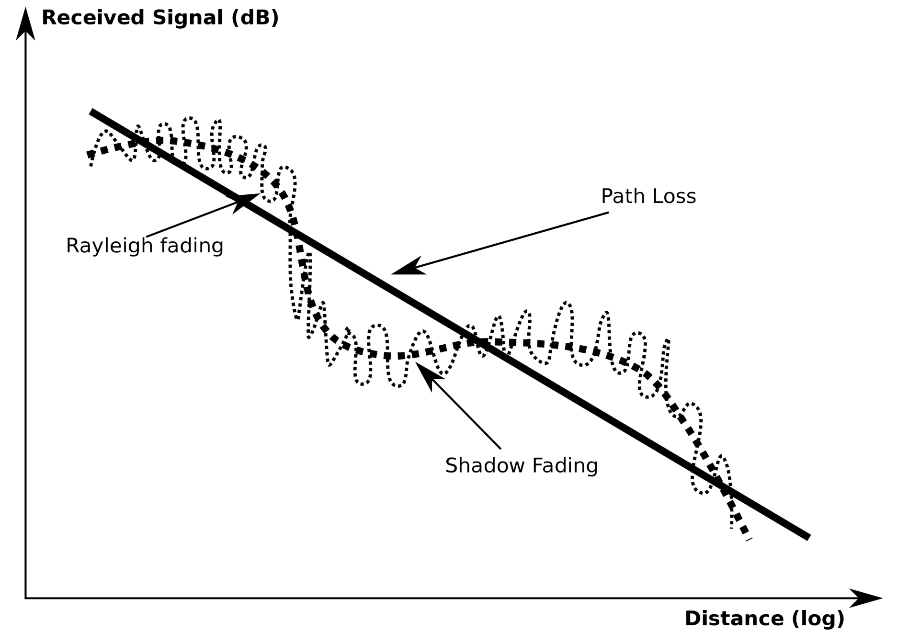

## R2Lab과 Mininet-WiFi의 역할

- **R2Lab**은 프랑스 INRIA 연구소에 위치한 **무반향(anechoic) 챔버 기반 테스트베드**로, 외부 간섭 없이 실제 무선 환경에서 신호 세기를 정밀하게 측정할 수 있음
- **Mininet-WiFi**는 가상 환경에서 동일한 전파 모델을 시뮬레이션할 수 있는 **네트워크 에뮬레이터**
- 따라서 두 환경을 비교함으로써 “시뮬레이션 결과가 실제 환경(R2Lab)의 측정치와 얼마나 일치하는가” 를 평가할 수 있고, 이를 통해 모델을 보정하거나 시스템 성능을 예측하는 연구를 수행.

---

- 무선 시스템의 설계와 검증에는 전파 손실, 그림자 효과(Shadowing), 그리고 페이딩과 같은 전파 현상에 대한 이해가 필수
    - Mininet-WiFi에서 제공하는 **전파 모델(Free-Space, Log-Distance, ITU)** 과 **R2Lab 테스트베드에서 측정된 실제 RSSI 데이터**를 비교함으로써 시뮬레이션의 현실성을 검증
    - 또한, 장기·단기 페이딩 그래프를 통해 무선 신호의 시간적 변동 특성을 확인

---

## R2lab


- R2lab : 프랑스 INRIA Sophia-Antipolis 캠퍼스에 위치한 무선 통신 실험용 테스트베드
    - [r2lab.inria.fr](https://r2lab.inria.fr/overview.md?utm_source=chatgpt.com)
    - 약 90 m² 크기의 무반향(anechoic) 챔버 안에 설치되어 있으며, WiFi, 4G/5G 네트워크 등을 재현하고 반복 가능한 연구를 위해 설계됨
        - 37개의 무선 디바이스 노드
        - USRP(소프트웨어 정의 라디오 SDR) 보드
        - 상업용 LTE/4G 폰 등이 탑재
        - 
- **원격 실험 제어**
    - 사용자는 웹 포털을 통해 계정을 만들고 시간 슬롯을 예약한 뒤, ssh 등을 통해 노드에 접속하여 OS 이미지부터 실험 소프트웨어까지 직접 구성
- **다양한 기기 지원**
    - 일반 무선 기기뿐 아니라 USRP, LimeSDR 등 SDR 장비가 있어 무선 스펙트럼 분석, 프로토콜 개발, 5G-레이크 실험 등이 가능
- **실험 반복성**:
    - 무반향 챔버라는 물리적 환경 덕분에 외부 신호 간섭이 적고, 동일한 조건에서 여러 차례 실험하여 재현성을 확보
- **개방형 연구 인프라**
    - 학계, 산업 연구자 모두 접근 가능하며, 프레임워크 및 라이브러리도 공개

### 사용

- 새로운 WiFi/6/6E 프로토콜 테스트
- 5G 또는 4G 상용 폰을 이용한 실제 네트워크 인터페이스 실험
- SDR을 이용해 사용자 정의 무선 신호 송수신 및 분석
- 복잡한 무선 환경(멀티 노드, 간섭, MIMO 등) 시뮬레이션
- 연구 논문 작성용 실험 결과 수집 및 재현 가능성 확보

## **무반향 챔버 (Anechoic Chamber)**

- 전자파나 음파가 **벽면에서 반사되지 않도록 설계된 특수한 실험실**
- R2Lab 같은 무선 네트워크 테스트베드
- **무반향(an-echoic)** = 메아리가 없다(no echo)라는 뜻
    - 즉전자파(또는 소리)가 벽·천장·바닥에 부딪혀 반사되는 것을 최소화하여 실험 대상에서 발생하는 **순수한 신호**만 측정할 수 있도록 한 공간

---

---

1. **흡수체(Absorber)**
    - 벽면 전체를 삼각뿔 모양의 전파 흡수재로 덮음
    - 일반적으로 **탄소 함유 폴리우레탄 폼** 또는 **페라이트 타일**을 사용
    - 전자파가 벽에 닿으면 반사되지 않고 내부에서 흡수되어 열로 변환
2. **전파 차폐(Shielding)**
    - 외부 신호(Wi-Fi, LTE 등)가 내부에 들어오지 않도록 챔버 전체를 금속으로 감싸 **파라데이 케이지(Faraday cage)** 구조로 만듦.
3. **무반사 바닥/천장**
    - 바닥과 천장에도 흡수체를 설치하거나, 특정 실험(예: 차량용 안테나 테스트)에서는 반사 특성을 제어할 수 있도록 설계

---

## 장점

| 항목 | 설명 |
| --- | --- |
| **외부 간섭 차단** | LTE, Wi-Fi, 5G 신호 등 외부 전파가 실험에 영향을 주지 않음 |
| **반사 제거** | 다중경로(Multipath)로 인한 신호 간섭 없이 순수한 채널 측정 가능 |
| **실험 재현성** | 동일한 환경을 반복할 수 있어 논문 실험에 적합 |
| **정확한 측정** | 안테나 이득, 송수신 세기, BER 등 정밀 측정 가능 |

---

- **R2Lab**
    - 37개의 노드와 SDR 장비가 무반향 챔버 안에 배치되어 Wi-Fi, LTE, 5G 실험을 외부 간섭 없이 수행.
- **안테나 설계 연구소**
    - 안테나 방사 패턴(Radiation Pattern) 측정 및 보정 실험.
- **자동차·항공기 전자기 적합성(EMC) 시험**
    - 차량 ECU나 항공 전자장비가 전파 간섭에 얼마나 강한지 시험.

---

## Mininet-WiFi에서 Path Loss 모델 실험하기

```python
sudo mn --wifi --topo=single,3 --propagation_model logDistance,exp=3.5

```

- `-propagation_model logDistance,exp=3.5`
    - 로그 거리 모델 기반 신호 감쇠 적용
    - `exp`는 Path Loss 지수 (실내 2~3, 실외 3~5 정도)

---

## IEEE 802.11

- **IEEE 802.11**은 국제전기전자공학회(IEEE, Institute of Electrical and Electronics Engineers)에서 제정한 **무선 근거리 통신망(WLAN, Wireless Local Area Network)** 표준
- 이 표준은 우리가 흔히 사용하는 **Wi-Fi 기술**의 기반이 됨

---

## IEEE 802.11 주요 규격 (Wi-Fi 세대별)

| 규격 | 상용 명칭 | 주요 특징 | 최대 속도(이론) |
| --- | --- | --- | --- |
| 802.11b | Wi-Fi 1 | 2.4GHz DSSS | 11 Mbps |
| 802.11a | Wi-Fi 2 | 5GHz OFDM | 54 Mbps |
| 802.11g | Wi-Fi 3 | 2.4GHz OFDM | 54 Mbps |
| 802.11n | Wi-Fi 4 | MIMO, 2.4/5GHz 지원 | 600 Mbps |
| 802.11ac | Wi-Fi 5 | MU-MIMO, 5GHz | 6.9 Gbps |
| 802.11ax | Wi-Fi 6 / 6E | OFDMA, 2.4/5/6GHz | 9.6 Gbps |
- MIMO는 여러 안테나를 통해 동시에 신호를 주고받는 기술, *OFDMA*는 주파수를 효율적으로 나누어 여러 사용자가 동시에 전송할 수 있게 하는 기술입니다.

---

## IEEE 802.11

1. **가격 대비 성능 우수 (Cost-Performance Ratio)**
    - 저렴한 장비로도 빠른 데이터 전송 가능.
2. **하위 호환성 유지**
    - 새로운 규격이 나와도 이전 장치와 연결 가능.
3. **비면허 주파수 사용**
    - 2.4GHz, 5GHz, 6GHz 대역은 별도 주파수 허가 없이 사용 가능.
4. **글로벌 인증 체계**
    - Wi-Fi Alliance 인증을 통해 전 세계 제품 간 호환 보장.

## IEEE 802.11 표준의 종류와 주파수 대역

- **IEEE 802.11** 표준은 여러 세부 버전(규격)으로 발전해 왔으며, 각각의 버전은 데이터 속도, 변조 방식, 주파수 대역이 다름
    - **초기 버전:**
        - **802.11b**, **802.11a**, **802.11g**
    - **신규 버전:**
        - **802.11n**, **802.11ac**, **802.11p**, **802.11ax(Wi-Fi 6)** 등

---

## 주요 주파수 대역

- 802.11 표준은 일반적으로 **두 가지 주요 주파수 대역**을 사용

| 대역 | 특징 |
| --- | --- |
| **2.4 GHz 대역** | 전파 도달 거리가 길고 장애물 통과가 용이하지만, 혼잡(간섭) 발생이 많음. |
| **5 GHz 대역** | 채널 수가 많고 속도가 빠르지만, 전파 도달 거리가 짧고 벽 통과에 약함. |

---

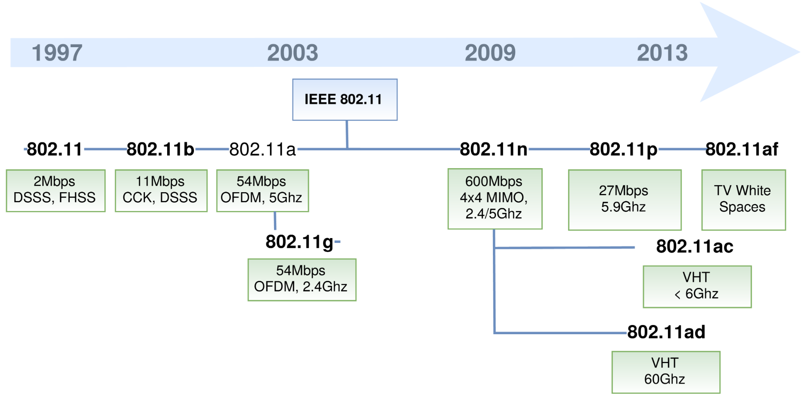

## 802.11b — 2.4GHz 대역의 채널 구조

- 802.11b 표준은 2.4GHz 주파수 대역(2.4~2.4835 GHz)을 사용
    - 이 대역 내에서 **총 13개 채널**이 정의되어 있으며, 각 채널은 **22MHz의 대역폭**을 차지하고 **5MHz 간격**으로 배치
- 중심 주파수 예시
    - 하지만 각 채널이 **22MHz**로 넓게 겹치기 때문에, 인접 채널 간 **대역 중첩(Overlap)** 이 발생합니다.
    - 채널 1 → 2.412 GHz
    - 채널 2 → 2.417 GHz
    - 채널 3 → 2.422 GHz
    - …
    - 채널 13 → 2.472 GHz

## 비중첩(Non-Overlapping) 채널

- 이 문제를 피하기 위해 **2.4GHz 대역에서는 다음 세 채널만 독립적으로 사용**할
    - 채널 1, 채널 6, 채널 11
    - 이 세 채널은 서로 **대역이 겹치지 않아** 간섭 없이 동시에 사용
        - 여러 AP(Access Point)가 같은 공간에 있을 때, 1·6·11 채널을 나누어 설정하는 것이 표준

---

| 항목 | 내용 |
| --- | --- |
| 표준  | 802.11b / a / g / n / ac / p 등 |
| 주요 주파수 | 2.4GHz, 5GHz |
| 802.11b 채널 수 | 13개 (2.412 ~ 2.472 GHz) |
| 채널 폭 | 22 MHz |
| 채널 간격 | 5 MHz |
| 비중첩 채널 | 1, 6, 11 |

---

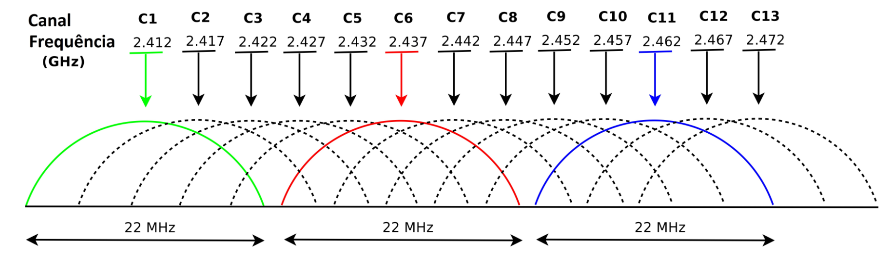

---

## IEEE 802.11 네트워크 아키텍처

1. **BSS (Basic Service Set)** 
    1. 인프라스트럭처(Infra) 모드
2. **IBSS (Independent Basic Service Set)** 
    1. 애드혹(Ad-hoc) 모드

---

### Basic Service Set (BSS, 인프라 모드)

- **구성 요소**
    - **AP (Access Point, 무선 접속장치)**
    - **여러 개의 무선 스테이션 (STA, Client 장치)**
- **특징**
    - 모든 데이터 통신은 반드시 **AP를 통해 중계**
        - 즉, STA ↔ AP ↔ STA 형태로 패킷이 오고 감
    - AP는 유선 LAN 또는 다른 네트워크(인터넷 등)과 연결되어 있어 **브리지 역할**
        - 우리가 집, 회사, 학교에서 사용하는 **일반 Wi-Fi 네트워크**가 바로 BSS 구조임

---

### Independent Basic Service Set (IBSS, Ad-hoc 모드)

- **구성**
    - **AP 없이** 여러 개의 무선 스테이션만 존재
    - 각 STA(노트북, 스마트폰 등)가 **직접 서로 연결**됨
- **특징**
    - 중앙 제어 장치(AP)가 없고, 각 기기가 서로 직접 데이터를 송수신 (**peer-to-peer**)
    - 설정이 간단하지만, 네트워크 관리나 보안, 확장성은 떨어짐
        - 두 대의 노트북이 Wi-Fi Direct로 직접 파일을 주고받는 경우
        - 임시 네트워크(회의실, 현장 등에서 빠른 연결용)

---

## MAC 주소와 802.11 프레임 전송

- 모든 802.11 무선 장치(스테이션, AP)는 **6바이트(48비트)의 고유한 MAC 주소**를 가짐.
    - 이 MAC 주소는 네트워크 인터페이스 카드(NIC)에 저장되어 있으며, 무선 통신 시 **프레임의 송신자와 수신자 식별자**로 사용됨
- 통신 흐름
    1. STA(클라이언트)가 AP에 **연결(Association)** 요청
    2. 인증 절차 후 연결이 설정됨
    3. 데이터 프레임이 MAC 주소를 기반으로 송수신됨
- 802.11 프레임 구조는 이더넷(Ethernet)과 유사하지만, **무선 전송 특성**에 맞게 **3개의 주소 필드(송신자, 수신자, BSSID)** 를 포함

---

| 구분 | BSS (인프라 모드) | IBSS (애드혹 모드) |
| --- | --- | --- |
| 중앙 장치(AP) | 있음 | 없음 |
| 통신 방식 | STA ↔ AP ↔ STA | STA ↔ STA |
| 확장성 | 높음 | 낮음 |
| 예시 | 일반 Wi-Fi 네트워크 | Wi-Fi Direct, P2P 연결 |
| 네트워크 제어 | AP가 담당 | 분산 제어 |
| MAC 주소 사용 | AP/STA 모두 고유 주소 | 각 STA가 자체 주소로 직접 통신 |

---

- **BSS (Infrastructure Mode)**
    
    ```
    [STA1]     [STA2]
        \        /
          [Access Point] —— Internet
        /        \
    [STA3]     [STA4]
    
    ```
    
    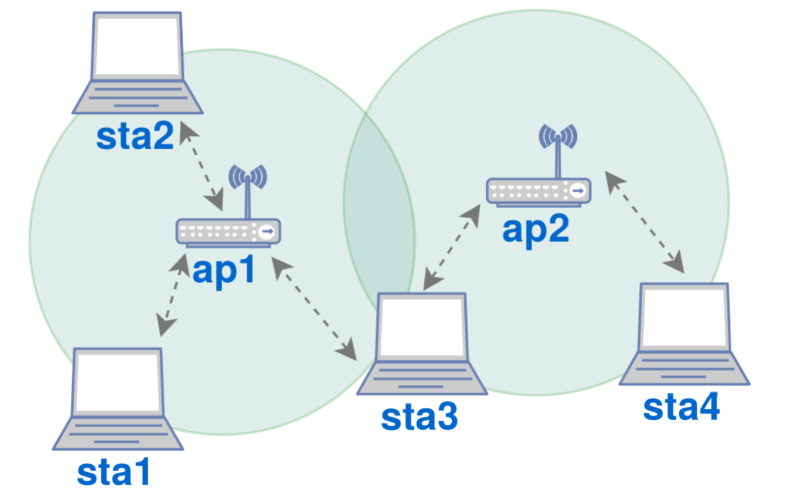
    

- **IBSS (Ad-hoc Mode)**
    
    ```
    [STA1] ↔ [STA2] ↔ [STA3] ↔ [STA4]
    (모두 직접 연결)
    
    ```
    

---

---

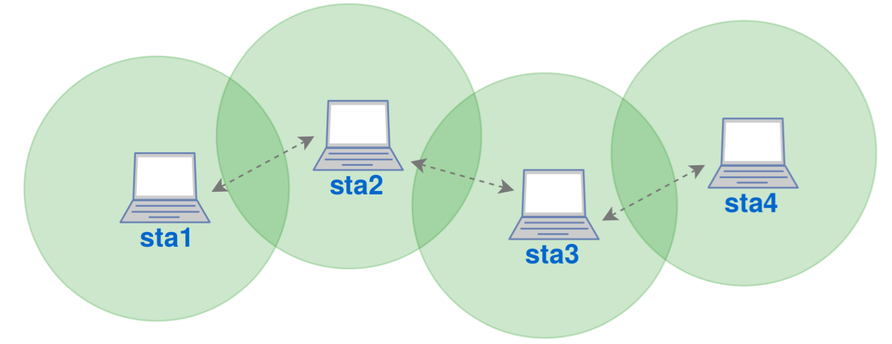

- 연구 내용

[https://github.com/a9khan/trafficclassifier/blob/master/NetSoft_project.ipynb](https://github.com/a9khan/trafficclassifier/blob/master/NetSoft_project.ipynb)

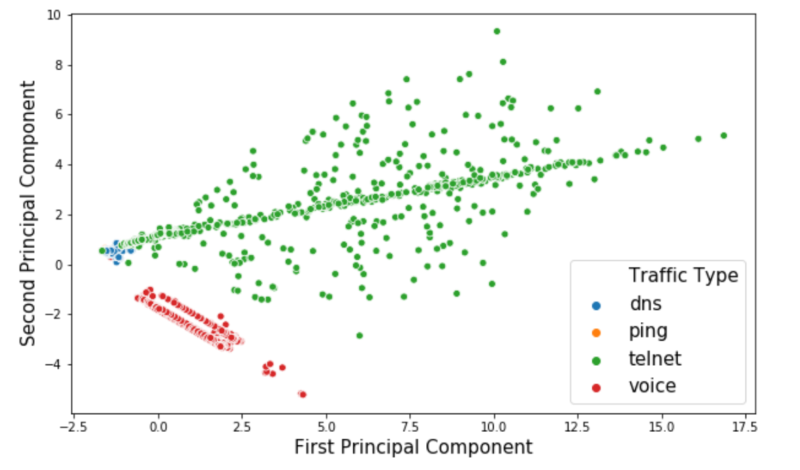

## SDWN (Software-Defined Wireless Networking)

- **소프트웨어 정의 무선 네트워킹(SDWN)**
- 무선 네트워크(Wi-Fi 등)를 **중앙의 소프트웨어 컨트롤러**에서 제어할 수 있게 하는 새로운 네트워크 설계 방식
- 각 **무선 액세스 포인트(AP)** 가 독립적으로 동작하는 대신, 중앙의 **컨트롤러(Controller)** 가 전체 무선망의 동작 규칙을 **논리적으로 정의하고, 동적으로 제어**

---

## 제어부(Control Plane)와 데이터부(Data Plane)의 분리

- SDWN에서는 이 두 부분을 **물리적으로 분리**하여  중앙 제어부가 네트워크 전체를 논리적으로 관리
- 이 개념은 유선 기반의 **SDN (Software Defined Networking)** 과 동일한 원리

| 구분 | 역할 |
| --- | --- |
| **Control Plane (제어부)** | 네트워크 정책, 트래픽 경로, QoS, 보안 정책 등을 결정하는 **두뇌(Controller)** |
| **Data Plane (데이터부)** | 실제 데이터 패킷을 전송하는 **AP, 스위치, 라우터 등 물리 장치** |

---

## SDWN의 구조

```
 ┌──────────────────────────────┐
 │       Application Layer       │
 │  (관리 앱, 정책 설정, GUI 등) │
 └──────────────┬───────────────┘
                │
 ┌──────────────┴───────────────┐
 │        Control Plane          │
 │    (SDWN Controller – 중앙 제어)│
 └──────────────┬───────────────┘
                │ Southbound Interface
 ┌──────────────┴───────────────┐
 │          Data Plane           │
 │ (AP, 무선 스위치, 클라이언트 등) │
 └──────────────────────────────┘

```

---

## 동작

1. **컨트롤러(Controller)** 가 중앙에서 네트워크 정책을 정의 (예: QoS, 트래픽 우선순위, 사용자 인증 등)
2. **각 무선 AP나 스위치(Data Plane)** 는 컨트롤러의 명령에 따라 동작
3. **관리자는 GUI나 API를 통해 네트워크 전체를 논리적으로 제어**
    1. 특정 SSID 트래픽 제한, 특정 사용자 대역폭 우선

---

## Southbound Interface (남향 인터페이스)

- 컨트롤러가 **하위 장치(AP, 스위치)** 와 통신하기 위해 사용하는 표준 인터페이스
    - 가장 유명한 것은 **OpenFlow**

| 프로토콜 | 특징 |
| --- | --- |
| **OpenFlow** | SDN/SDWN의 대표 프로토콜. 컨트롤러가 장치의 플로우 테이블을 직접 제어 |
| **CAPWAP (Control And Provisioning of Wireless Access Points)** | 무선 AP를 중앙에서 관리하는 데 사용되는 IETF 표준 |
| **FORCES (Forwarding and Control Element Separation)** | 제어부와 포워딩부 분리 위한 구조 표준 |
| **NETCONF (Network Configuration Protocol)** | XML 기반의 장치 설정 프로토콜 (주로 네트워크 자동화에서 사용) |

| 구분 | SDN | SDWN |
| --- | --- | --- |
| 적용 영역 | 유선 네트워크 (스위치, 라우터 등) | 무선 네트워크 (AP, Wi-Fi, 5G 등) |
| 핵심 원리 | 제어부와 데이터부 분리 | 제어부와 데이터부 분리 |
| 주요 프로토콜 | OpenFlow | OpenFlow, CAPWAP, FORCES, NETCONF |
| 제어 방식 | 중앙 컨트롤러에서 트래픽 제어 | 중앙 컨트롤러에서 무선망 제어 |
| 관리 포인트 | 유선 링크, 트래픽 라우팅 | 무선 채널, 전송 전력, 사용자 연결, 핸드오버 등 |

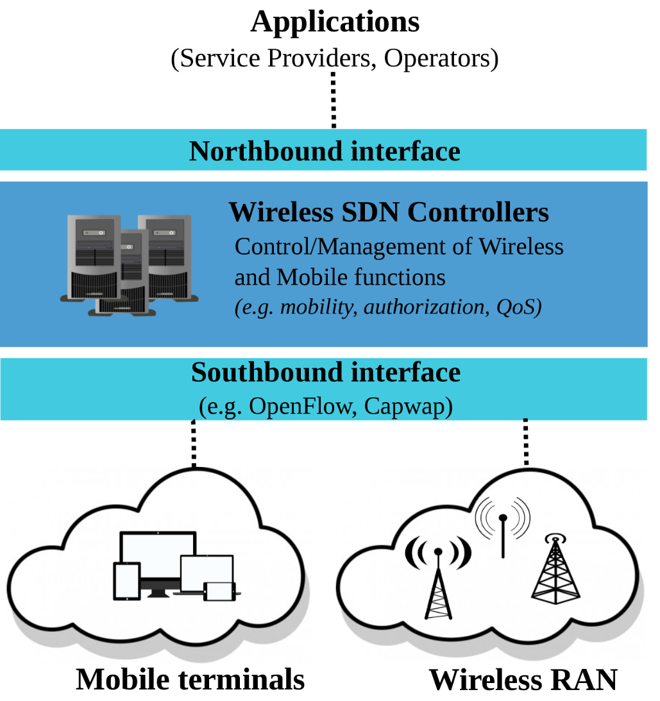

# SDN : **소프트웨어 정의 네트워크**

- **소프트웨어로 네트워크를 중앙에서 제어하고 관리할 수 있게 하는 네트워크 아키텍처**
    - 전통적인 네트워크에서는 스위치나 라우터 같은 장비들이 각자 독립적으로 동작했지만, SDN은 이 제어 기능을 중앙 집중화하여 유연성과 자동화를 제공

---

1. **Control Plane (제어 계층)**
    - 네트워크 트래픽을 *어떻게 흐르게 할지 결정하는* 부분
    - SDN에서는 이 제어 기능이 개별 장비에서 분리되어 **중앙 컨트롤러(Controller)** 가 담당
2. **Data Plane (데이터 계층)**
    - 실제로 *패킷을 전달하는* 부분
    - 스위치나 라우터는 컨트롤러의 명령에 따라 단순히 데이터만 전달
3. **SDN Controller (컨트롤러)**
    - SDN의 두뇌역할
    - 네트워크 전반을 통제하고, 각 장비에게 어떤 경로로 트래픽을 전달할지 지시
        - OpenDaylight, ONOS, Cisco APIC 등.
4. **Southbound API**
    - 컨트롤러와 네트워크 장비 간의 통신을 위한 인터페이스
    - 대표적으로 **OpenFlow** 프로토콜
5. **Northbound API**
    - 컨트롤러와 상위 애플리케이션(보안, 로드밸런싱, 모니터링 등) 간의 인터페이스
    - 이를 통해 프로그래머가 네트워크 정책을 소프트웨어로 정의

---

### **SDN 장점**

- **중앙 집중 관리**
    - 네트워크 전체를 하나의 중앙 시스템에서 제어 가능
- **유연성 향상**
    - 네트워크 정책을 소프트웨어 코드로 쉽게 변경
- **자동화**
    - 트래픽 제어나 경로 변경을 자동화 가능
- **비용 절감**
    - 하드웨어 의존도를 낮춰 범용 장비로 구성 가능
- **보안 강화**
    - 정책 기반 제어를 통해 일관된 보안 적용 가능

---

### **활용 사례**

- **데이터센터 네트워크 자동화**
- **클라우드 인프라 관리**
    - **OpenStack Neutron**
- **네트워크 가상화 : NFV와 함께 사용**
- **트래픽 엔지니어링 및 QoS 관리**

---

### **구조**

```
+----------------------+
|  Application Layer   | ← 네트워크 정책/서비스 정의
+----------------------+
          ↓ Northbound API
+----------------------+
|  SDN Controller      | ← 네트워크 중앙 제어
+----------------------+
          ↓ Southbound API
+----------------------+
|  Network Devices     | ← 스위치, 라우터, 방화벽 등
+----------------------+

```

---

## **SDN vs 전통적 네트워크**

| 구분 | 전통적인 네트워크 | SDN (Software Defined Networking) |
| --- | --- | --- |
| **제어 방식** | 각 장비(스위치, 라우터)가 자체적으로 경로를 결정 | 중앙 컨트롤러가 모든 장비를 통합 제어 |
| **구성 요소** | 하드웨어 중심 (Cisco, Juniper 등) | 소프트웨어 중심 (컨트롤러 + 범용 스위치) |
| **유연성** | 정책 변경 시 장비마다 수동 설정 필요 | 중앙에서 정책을 한 번에 변경 가능 |
| **확장성** | 네트워크 확장이 복잡하고 느림 | 자동화된 확장이 가능 |
| **관리 방식** | CLI(Command Line Interface)로 개별 설정 | API를 통한 중앙 집중형 관리 |
| **자동화 수준** | 거의 없음 (수동 설정 중심) | 높음 (스크립트/자동화 툴 활용 가능) |
| **비용 구조** | 고가의 전용 하드웨어 필요 | 저비용의 범용 하드웨어 가능 |
| **보안 정책** | 장비별로 별도 적용 | 중앙에서 일관성 있게 적용 가능 |
| **트래픽 제어** | 사전 정의된 경로 고정 | 실시간 트래픽 변화에 따라 동적 경로 설정 가능 |

---

## **OpenFlow 동작 원리**

- **OpenFlow**는 SDN의 핵심 프로토콜로, 컨트롤러와 네트워크 장비(스위치) 간의 **소통 언어** 역할

---

### **구조**

- OpenFlow 스위치는 Flow Table(흐름 테이블)을 가지고 있음
    - 각 엔트리는 이런 패킷이 오면 이렇게 처리하라는 규칙을 정의
    - 규칙

| 조건 (Match) | 동작 (Action) |
| --- | --- |
| 출발지 IP = 10.0.0.1 | 포트 3으로 전송 |
| 목적지 MAC = AA:BB:CC | 드롭(drop) |
| TCP Port = 80 | QoS 우선순위 높게 설정 |

### **작동**

1. **패킷 수신**
    - 스위치가 새 패킷을 받으면 Flow Table을 조회.
2. **일치하는 규칙 확인**
    - 규칙이 있으면
        - 해당 규칙에 따라 바로 처리.
    - 규칙이 없으면
        - 컨트롤러에 “이 패킷은 어떻게 처리할까요?”라고 요청(Packet-In).
3. **컨트롤러 응답**
    - 컨트롤러는 이런 조건이면 이렇게 처리하라는 새 규칙(Flow Entry)을 스위치에 내려보냄
4. **스위치 업데이트**
    - 스위치는 받은 규칙을 Flow Table에 추가하고, 이후 같은 패킷이 오면 자동으로 처리

---

- **컨트롤러 :** 뇌 역할
- **스위치 :** 손발 역할
    - 스위치는 단순히 명령을 수행하고, 컨트롤러가 전체적인 전략을 세움

---

| 개념 | 역할 |
| --- | --- |
| **SDN** | 네트워크를 중앙에서 소프트웨어적으로 제어하는 구조 |
| **OpenFlow** | 컨트롤러 ↔ 스위치 간 통신 프로토콜 |
| **Controller** | 네트워크의 두뇌 (정책 결정, 경로 관리 등) |
| **Flow Table** | 스위치의 행동 규칙 테이블 |
| **Southbound API** | OpenFlow와 같은 하위 통신 인터페이스 |

---

## **SDN 실제 활용 사례**

- **클라우드**, **데이터센터**, **5G**, **캠퍼스 네트워크**, **보안 분야** 등에서 폭넓게 적용

---

## **1. 클라우드 환경에서의 SDN 활용**

### **문제점 (기존 방식)**

- 클라우드 서비스 제공자는 **수많은 가상 머신(VM)**과 테넌트(고객)를 관리해야 함.
- **네트워크 정책 변경**이나 트래픽 제어를 일일이 장비별로 설정하기 어려움.

### **SDN 적용 효과**

- 중앙 컨트롤러를 통해 **가상 네트워크 자동 생성 및 삭제** 가능
- 사용자별 **논리적 네트워크 분리 (Isolation)** 지원 → 보안성 향상
- **트래픽 최적화** 및 **로드 밸런싱 자동화**

### **예시**

- **OpenStack + Neutron + SDN Controller(ONOS, OpenDaylight)**
    - 클라우드 환경에서 가상 네트워크를 유연하게 관리
- **AWS, Azure, Google Cloud** 등도 내부적으로 SDN 개념을 기반으로 트래픽을 제어함.

---

## **2. 데이터센터 네트워크 (DCN) 자동화**

### **문제점 (기존 데이터센터)**

- 서버 수가 수천~수만 대에 달함.
- 수동 설정으로는 트래픽 경로 변경이나 장애 복구가 느림.

### **SDN 적용 효과**

- **트래픽 경로를 실시간 최적화 (Traffic Engineering)**
- **장애 발생 시 자동으로 우회 경로 설정 (Self-Healing)**
- **서버 증설 시 자동으로 네트워크 정책 반영 (Auto Provisioning)**

### **예시**

- **Google’s B4 프로젝트**
    - 구글이 데이터센터 간 백본망을 SDN으로 제어해 **대역폭 사용률을 70% → 95%로 향상**
- **Facebook의 Fabric Network**
    - SDN 기반 네트워크로 대규모 스케일아웃과 자동화 지원

---

## **3. 5G 및 통신망에서의 SDN**

### **문제점**

- 5G 네트워크는 초저지연, 초고속, 대규모 연결을 동시에 지원해야 함.
- 이를 위해 기존의 하드웨어 중심 망 구조로는 유연성이 부족.

### **SDN 적용 효과**

- **네트워크 슬라이싱(Network Slicing)**
    - 하나의 물리적 네트워크를 용도별(예: 자율주행, IoT, 스트리밍 등)로 논리적으로 분리
- NFV(네트워크 기능 가상화)와 연계되어 **가상 방화벽, 가상 라우터** 등을 신속히 배포 가능
- **QoS(품질보장)** 정책을 실시간으로 조정 가능

### **예시**

- **SK텔레콤, Verizon, AT&T 등**이 SDN/NFV 기반 5G 코어망을 구축
- **3GPP**와 ONF(Open Networking Foundation)에서 표준화 추진

---

## **4. 캠퍼스 / 엔터프라이즈 네트워크**

### **SDN 적용 효과**

- 여러 빌딩, 부서, 사용자 그룹을 **정책 기반으로 자동 제어**
- 보안 정책이나 VLAN 변경 시 **컨트롤러에서 일괄 관리**
- BYOD(Bring Your Own Device) 환경에서도 사용자 인증 및 접근 제어 자동화 가능

### **예시**

- Cisco SD-Access, Aruba SDN Solution 등
    - 기업 캠퍼스 네트워크에서 유연한 사용자별 정책 적용

---

## **5. 보안 및 트래픽 모니터링**

### **SDN의 장점 활용**

- 컨트롤러가 네트워크 전체 트래픽을 한눈에 보기 때문에 **침입 탐지(IDS)나 DDoS 공격 차단**을 실시간으로 수행 가능
- 특정 패킷이 탐지되면 즉시 경로를 차단하거나 격리 가능

### **예시**

- SDN 기반 **DDoS 대응 시스템**
- Micro-Segmentation(미세분할)을 통한 내부 트래픽 보호 (VMware NSX 등)

---

| 분야 | SDN 적용 효과 |
| --- | --- |
| **클라우드** | 가상 네트워크 자동 관리, 테넌트별 격리 |
| **데이터센터** | 트래픽 최적화, 자동화, 장애 복구 |
| **5G 통신망** | 네트워크 슬라이싱, NFV 통합 |
| **엔터프라이즈/캠퍼스** | 정책 기반 접근 제어, 중앙 관리 |
| **보안** | 실시간 침입 탐지, 네트워크 분리 |

---

## **OpenFlow 개념**

- OpenFlow는 SDN에서 **컨트롤러와 스위치 간 통신을 담당하는 핵심 프로토콜**
- OpenFlow는 네트워크 장비(예: 스위치)가 패킷을 어떻게 처리할지를 결정하는 Flow Table(흐름 테이블)을 사용

| 항목 | 설명 |
| --- | --- |
| **Match Field** | 어떤 패킷에 규칙을 적용할지 조건(IP, MAC, Port 등) |
| **Action** | 조건이 일치할 때 수행할 동작 (포트 전송, 폐기 등) |
| **Priority** | 여러 규칙이 일치할 경우 우선순위 |
| **Counter** | 해당 규칙으로 처리된 패킷 수, 바이트 수 등 |

---

## **Packet Flow Process 동작 과정**

### **1단계 : 패킷 수신**

- OpenFlow 스위치는 외부에서 들어오는 패킷(packet)을 받음
- 스위치는 **Flow Table**을 확인하여 해당 패킷과 일치하는 규칙이 있는지 검사

---

### **2단계 : 규칙 확인 (Flow Match)**

- **일치하는 규칙이 있을 때** → 스위치는 즉시 지정된 **Action**을 수행
    - 특정 포트로 전달, 패킷 드롭 등
- **일치하는 규칙이 없을 때** → 스위치는 **Packet-In 메시지**를 생성해 **컨트롤러로 전송**

---

### **3단계 : 컨트롤러의 처리 (Packet-In → Flow-Mod)**

- 컨트롤러는 Packet-In 메시지를 분석하여 이 패킷의 처리를 결정
- 컨트롤러는 다음 중 하나의 명령을 스위치로 보냄
    - **Packet-Out**: 현재 패킷을 특정 포트로 전송하도록 지시
    - **Flow-Mod**: 앞으로 유사한 패킷을 자동으로 처리하도록 **새 규칙 추가**
        - 즉, 처음 한 번은 컨트롤러가 “이런 패킷은 이렇게 처리해!”라고 알려주고, 그 다음부터는 스위치가 알아서 처리

---

### **4단계 : Flow Table 업데이트**

- 스위치는 컨트롤러로부터 받은 **Flow-Mod 메시지**에 따라 테이블을 갱신
- 이후 동일한 조건의 패킷이 들어오면 컨트롤러에 문의하지 않고 **즉시 처리**

---

### **5단계 : 상태 및 통계 보고**

- 스위치는 주기적으로 **Flow Stats, Port Stats** 등의 메시지를 통해 패킷 수, 대역폭 사용량, 포트 상태 등을 **컨트롤러에 보고**
- 컨트롤러는 이를 통해 네트워크 상태를 모니터링하고 정책을 최적화

---

## **OpenFlow 통신 구조 요약**

```
+-------------------+
|   SDN Controller  |
|  (OpenDaylight,   |
|   ONOS 등)        |
+---------▲---------+
          │
   OpenFlow Protocol
          │
+---------▼---------+
|   OpenFlow Switch |
| (Flow Table 관리) |
+---------▲---------+
          │
     Network Devices
 (서버, PC, IoT 등)

```

---

## **OpenFlow 주요 메시지 종류**

| 메시지 유형 | 방향 | 설명 |
| --- | --- | --- |
| **Packet-In** | 스위치 → 컨트롤러 | 규칙 없는 패킷을 컨트롤러로 전달 |
| **Packet-Out** | 컨트롤러 → 스위치 | 컨트롤러가 지정한 포트로 패킷 전송 |
| **Flow-Mod** | 컨트롤러 → 스위치 | 새 흐름 규칙 추가 또는 수정 |
| **Flow-Removed** | 스위치 → 컨트롤러 | 만료된 규칙 삭제 통보 |
| **Stats Request/Reply** | 양방향 | 트래픽 통계 요청 및 응답 |
| **Hello** | 양방향 | 연결 초기 설정 시 교환 |

---

## **시나리오**

- 10.0.0.1 → 10.0.0.2 로 **처음 패킷 전송**
    - 10.0.0.1이 **스위치로 패킷 전송**
    - **스위치가 Flow Table을 확인**
        - **규칙 없음 → 컨트롤러로 Packet-In 전송**
    - **컨트롤러**가 “10.0.0.2로 가는 건 포트 3으로 보내라”
        - **Flow-Mod 전달함**
    - **스위치는 해당 규칙 저장 후 즉시 전송**
    - **다음부터 같은 패킷은 바로 포트 3으로 보냄** (컨트롤러 개입 없음)

---

| 단계 | 설명 |
| --- | --- |
| 1. 패킷 수신 | 스위치가 패킷 수신 |
| 2. 규칙 검사 | Flow Table에 일치 여부 확인 |
| 3. 컨트롤러 문의 | 규칙이 없으면 Packet-In 전송 |
| 4. 규칙 추가 | 컨트롤러가 Flow-Mod로 규칙 추가 |
| 5. 자동 처리 | 동일한 패킷은 규칙 기반으로 즉시 처리 |

---

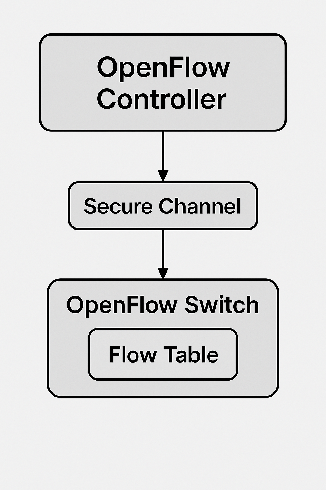

## **Mininet + Ryu(OpenFlow 1.3**

- SDN의 핵심 : 패킷-인, 플로우-모드, 패킷-아웃

---

# 준비

- Ubuntu 기준(WSL2도 가능):

```bash
sudo apt-get update
sudo apt-get install -y mininet openvswitch-switch python3-ryu

```

---

# 토폴로지: Mininet (h1, h2, h3 — s1 하나)

- 간단히 기본 topo

```bash
# Ryu 컨트롤러가 OpenFlow 1.3 사용하므로 스위치도 동일 프로토콜 지정
sudo mn --topo single,3 \
  --controller=remote,ip=127.0.0.1,port=6633 \
  --switch ovsk,protocols=OpenFlow13

```

- 나중에 pingall, iperf, xterm h1 같은 Mininet 명령으로 테스트

---

# 러닝 스위치 (학습형 L2 스위칭)

- 아래를 `simple_switch.py`로 저장

```python
# simple_switch.py
# OpenFlow 1.3 러닝 스위치: MAC 학습 후 일치 규칙을 FlowMod로 설치
from ryu.base import app_manager
from ryu.controller import ofp_event
from ryu.controller.handler import CONFIG_DISPATCHER, MAIN_DISPATCHER
from ryu.controller.handler import set_ev_cls
from ryu.ofproto import ofproto_v1_3
from ryu.lib.packet import packet, ethernet

class SimpleSwitch13(app_manager.RyuApp):
    OFP_VERSIONS = [ofproto_v1_3.OFP_VERSION]

    def __init__(self, *args, **kwargs):
        super(SimpleSwitch13, self).__init__(*args, **kwargs)
        # { datapath_id: { mac_addr: in_port } }
        self.mac_to_port = {}

    @set_ev_cls(ofp_event.EventOFPSwitchFeatures, CONFIG_DISPATCHER)
    def switch_features_handler(self, ev):
        # 스위치 연결 시, 미매칭 패킷을 컨트롤러로 보내도록 테이블-미스 엔트리 설치
        datapath = ev.msg.datapath
        ofproto = datapath.ofproto
        parser = datapath.ofproto_parser

        match = parser.OFPMatch()  # any
        actions = [parser.OFPActionOutput(ofproto.OFPP_CONTROLLER,
                                          ofproto.OFPCML_NO_BUFFER)]
        inst = [parser.OFPInstructionActions(ofproto.OFPIT_APPLY_ACTIONS, actions)]
        mod = parser.OFPFlowMod(datapath=datapath, priority=0,
                                match=match, instructions=inst)
        datapath.send_msg(mod)

    @set_ev_cls(ofp_event.EventOFPPacketIn, MAIN_DISPATCHER)
    def _packet_in_handler(self, ev):
        msg = ev.msg
        datapath = msg.datapath
        ofproto = datapath.ofproto
        parser = datapath.ofproto_parser
        in_port = msg.match['in_port']

        # 패킷 파싱
        pkt = packet.Packet(msg.data)
        eth = pkt.get_protocols(ethernet.ethernet)[0]
        dst = eth.dst
        src = eth.src

        dpid = datapath.id
        self.mac_to_port.setdefault(dpid, {})

        # 1) src MAC 학습
        self.mac_to_port[dpid][src] = in_port

        # 2) dst MAC이 학습돼 있으면 해당 포트로 포워딩, 아니면 flood
        if dst in self.mac_to_port[dpid]:
            out_port = self.mac_to_port[dpid][dst]
        else:
            out_port = ofproto.OFPP_FLOOD

        actions = [parser.OFPActionOutput(out_port)]

        # 3) 학습된 dst일 경우, 동일 트래픽에 대한 정적 플로우 설치(FlowMod)
        if out_port != ofproto.OFPP_FLOOD:
            match = parser.OFPMatch(in_port=in_port, eth_dst=dst, eth_src=src)
            inst = [parser.OFPInstructionActions(ofproto.OFPIT_APPLY_ACTIONS, actions)]
            # 버퍼링된 패킷이 있으면 buffer_id 사용, 없으면 데이터도 같이 보냄
            if msg.buffer_id != ofproto.OFP_NO_BUFFER:
                mod = parser.OFPFlowMod(datapath=datapath, buffer_id=msg.buffer_id,
                                        priority=1, match=match, instructions=inst,
                                        idle_timeout=60, hard_timeout=0)
                datapath.send_msg(mod)
                return
            else:
                mod = parser.OFPFlowMod(datapath=datapath, priority=1,
                                        match=match, instructions=inst,
                                        idle_timeout=60, hard_timeout=0)
                datapath.send_msg(mod)

        # 4) 현재 패킷은 즉시 PacketOut으로 전송
        out = parser.OFPPacketOut(datapath=datapath, buffer_id=msg.buffer_id,
                                  in_port=in_port, actions=actions, data=msg.data
                                  if msg.buffer_id == ofproto.OFP_NO_BUFFER else None)
        datapath.send_msg(out)

```

- 실행

```bash
# 터미널 1
ryu-manager simple_switch.py

# 터미널 2 (혹은 먼저 실행해둔 Mininet 콘솔)
sudo mn --topo single,3 --controller=remote,ip=127.0.0.1,port=6633 --switch ovsk,protocols=OpenFlow13
mininet> pingall
mininet> h1 ping -c 1 h2
mininet> sh ovs-ofctl -O OpenFlow13 dump-flows s1   # 설치된 플로우 확인

```

- 처음 트래픽은 규칙이 없어 스위치→컨트롤러로 **Packet-In**.
- 컨트롤러가 **FlowMod**로 규칙을 내려 설치.
- 이후 동일 플로우는 스위치가 자체 처리(컨트롤러 개입 없음).
- 현재 패킷은 **Packet-Out**으로 즉시 전송.

---

- **Packet-In**: 규칙이 없을 때 스위치→컨트롤러 문의
- **Flow-Mod**: 컨트롤러가 “이렇게 처리해” 하고 규칙 설치(전달/드롭/리라이트 등)
- **Packet-Out**: 현재 패킷 즉시 출력
- 컨트롤러 코드는 사실상 **네트워크 정책을 코드로 표현**한 것

# **러닝 스위치**와 **네트워크 상황**

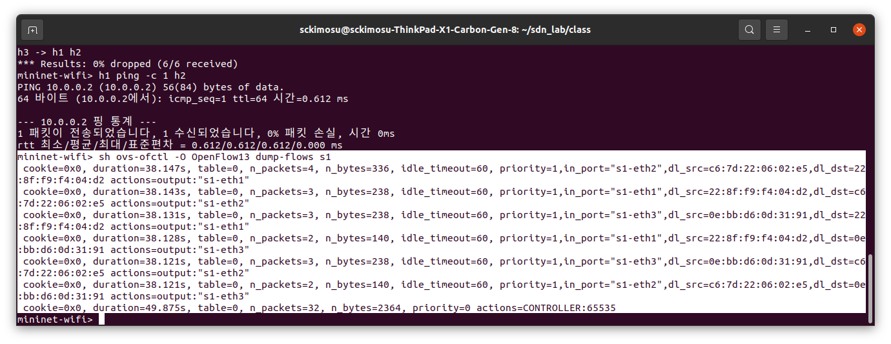

---

- 스위치: `s1` (테이블 0)
- 컨트롤러: 러닝 스위치 계열(제가 준 예제처럼)로 보임
- 결과
    - **세 호스트 간(eth1–eth2, eth1–eth3, eth2–eth3) MAC 학습**
    - 각 방향별로 **우선순위 1의 포워딩 플로우**가 깔렸고, **테이블-미스**는 `priority=0, actions=CONTROLLER` 로 유지

---

각 규칙의 공통 필드

- `cookie=0x0`
    - 식별자(정책 구분용). 여기선 기본값.
- `duration=38.xxxs`
    - **이 플로우가 설치된 뒤 흐른 시간.**
- `table=0`
    - **매칭된 테이블 번호.**
- `n_packets`, `n_bytes`
    - **이 규칙이 지금까지 처리한 패킷/바이트 카운터.**
- `idle_timeout=60`
    - **60초 동안 매칭이 없으면** **플로우가 삭제(러닝 스위치의 학습 엔트리 특성).**
- `priority=1`
    - **포워딩 규칙의 우선순위(테이블-미스 보다 높음).**
- `match` : `in_port`, `dl_src`, `dl_ds`
    - **“이 포트로 들어온, 이런 SRC→DST MAC” 트래픽**
- `actions=output:"s1-ethX"`
    - **지정 포트로 전송.**

## 라인 의미

- `in_port="s1-eth2", dl_src=c6:7d:22:06:02:e5, dl_dst=22:8f:f9:f4:04:d2 → output:"s1-eth1"`(1)
    - **eth2에서 들어온** `c6:7d:22:06:02:e5` → `22:8f:f9:f4:04:d2` 프레임을 **eth1으로 포워딩**.
- `in_port="s1-eth1", dl_src=22:8f:f9:f4:04:d2, dl_dst=c6:7d:22:06:02:e5 → output:"s1-eth2"`
    - 위(1)의 반대 방향
    - **eth1↔eth2**가 서로 학습되어 **양방향** 규칙이 생김.
- `in_port="s1-eth3", dl_src=0e:bb:d6:0d:31:91, dl_dst=22:8f:f9:f4:04:d2 → output:"s1-eth1"`(2)
    - **eth3에서 들어온** `0e:bb:d6:0d:31:91` → `22:8f:f9:f4:04:d2` 는 **eth1**으로 **포워딩**.
- `in_port="s1-eth1", dl_src=22:8f:f9:f4:04:d2, dl_dst=0e:bb:d6:0d:31:91 → output:"s1-eth3"`
    - 위의(2) 반대 방향
    - **eth1↔eth3**도 양방향 학습.
- `in_port="s1-eth3", dl_src=0e:bb:d6:0d:31:91, dl_dst=c6:7d:22:06:02:e5 → output:"s1-eth2"`(3)
    - **eth3**에서 들어온 `0e:bb…` → `c6:7d…` 는 **eth2**로 **포워딩**.
- `in_port="s1-eth2", dl_src=c6:7d:22:06:02:e5, dl_dst=0e:bb:d6:0d:31:91 → output:"s1-eth3"`
    - 위 (3)의 반대 방향
    - **eth2↔eth3**도 양방향 학습.

- 세 MAC 쌍이 모두 서로 통신했고, 그때마다 컨트롤러가 Packet-In을 받고 FlowMod로
    
    방향별 규칙을 설치. 그래서 6개 엔트리
    
- `priority=0 actions=CONTROLLER:65535`
    - **테이블-미스 엔트리**
    - 상위 규칙과 매칭 안 되면 **컨트롤러로 Packet-In**.
    - 러닝 스위치/데모 컨트롤러가 **처음 트래픽 학습**을 위해 설치하는 기본 규칙

---

# 상황

- `n_packets`, `n_bytes`가 각 쌍에서 비슷하게 증가
    - **실제로 통신 발생**(핑/ARP 등).
- `idle_timeout=60`
    - **60초 동안 해당 트래픽이 멈추면 자동 삭제**, 다시 첫 패킷은 컨트롤러로 Packet-In.
- `duration≈38s`
    - 대략 38초 전 첫 통신이 있었고 그때 규칙이 설치됨을 의미.

---

# 포트/호스트

- `s1-eth1/2/3`가 각각 어떤 호스트(h1/h2/h3)에 연결됐는지는 환경마다 다름.
    - 출력된 MAC을 위 규칙의 `dl_src/dl_dst`와 매칭하면 **어느 MAC이 어느 호스트인지** 알 수있음

```bash
# 포트-번호/이름/피어 확인
mininet> sh ovs-ofctl -O OpenFlow13 show s1

# 각 호스트 MAC 확인
mininet> h1 ip link | grep ether
mininet> h2 ip link | grep ether
mininet> h3 ip link | grep ether

```

---

- **플로우 초기화(재학습 시키기)**

```bash
sudo ovs-ofctl -O OpenFlow13 del-flows s1

```

- **현재 플로우 다시 보기**

```bash
sudo ovs-ofctl -O OpenFlow13 dump-flows s1

```

---

- `s1`
    - **러닝 스위치가 설치한, MAC-기반의 양방향 포워딩 플로우 6개**
    - **테이블-미스(컨트롤러로 전송) 1개**가 있고, **60초 비활성 시 자동 만료**되는 상태
- 화면


---

| 항목 | 설명 |
| --- | --- |
| **중앙 집중 제어** | 컨트롤러에서 전체 무선망을 일괄 관리 가능 |
| **유연한 정책 적용** | QoS, 인증, 우선순위 변경 등 실시간 제어 |
| **자동화 및 프로그래밍 가능성** | 스크립트나 API로 무선망 동작 제어 |
| **운영 효율성 향상** | 장비별 수동 설정 감소, 네트워크 장애 대응 속도 향상 |
| **SDN과의 통합 용이** | 유선망(SDN)과 무선망(SDWN)을 하나의 정책으로 통합 가능 |

---

---
