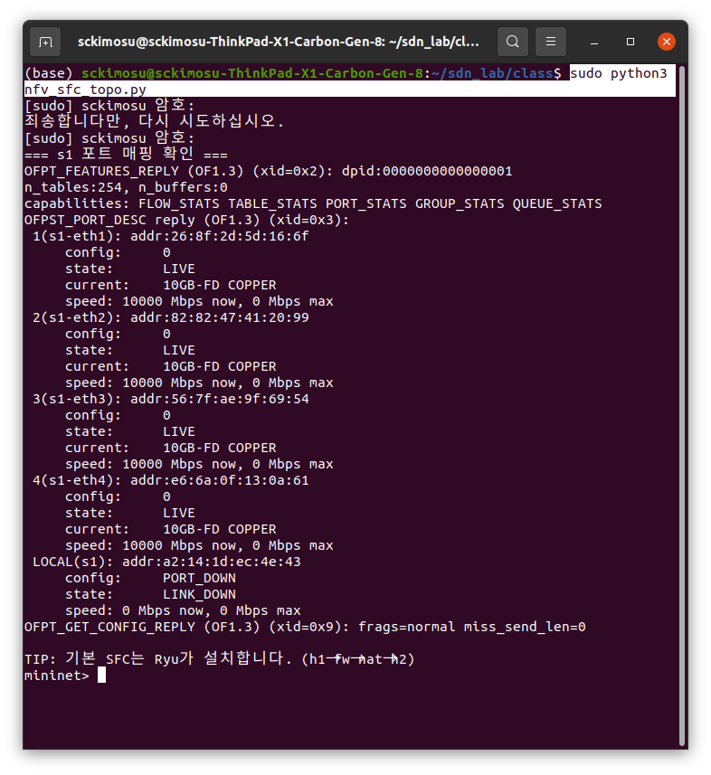
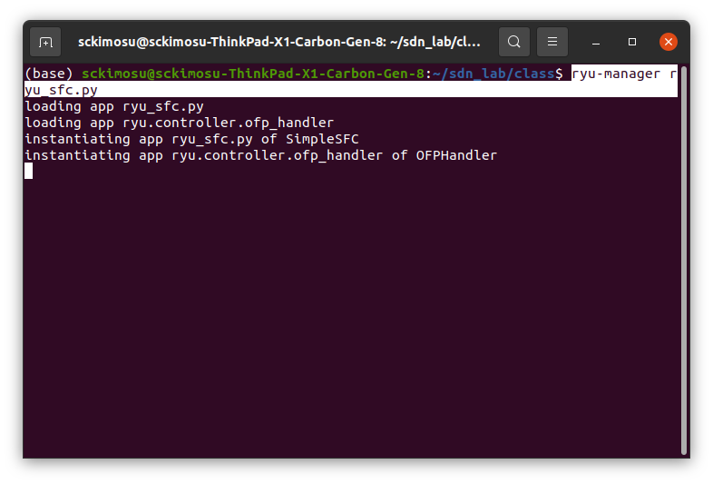

# 오픈플로우(OF) 스위치와 SDN(Software Defined Networking)

---

# [1] SDN과 NFV

- 현대 네트워크 기술의 핵심 축
    - 두 개념은 **서로 다른 문제를 해결하지만, 서로 보완적인 관계**

| 구분 | SDN (소프트웨어 정의 네트워킹) | NFV (네트워크 기능 가상화) |
| --- | --- | --- |
| 핵심 아이디어 | 네트워크의 제어(Control)를 중앙에서 **소프트웨어로 관리** | 네트워크의 기능(Function)을 **가상화(Virtualization)** |
| 주요 구성 요소 | Controller, Switch, OpenFlow 등 | VNF(Virtual Network Function), NFVI, MANO 등 |
| 초점 | **네트워크 제어의 분리와 자동화** | **네트워크 장비의 기능을 가상화하여 유연하게 배포** |
| 예시 | SDN Controller가 OpenFlow 스위치를 제어 | 방화벽, 라우터, DPI, NAT 등의 기능을 가상머신(VM)으로 실행 |

---

## SDN과 NFV의 관계 (상호보완 구조)

- **SDN**
    - **네트워크를 어떻게 제어할 것인가**
    - **두뇌(제어)** 역할
- **NFV**
    - **그 네트워크 기능을 어디서, 어떻게 실행할 것인가**
    - **NFV는 근육(기능 수행)** 역할

---

### 상호작용

```
+-------------------------------------------------------+
|                 NFV Orchestrator (MANO)               |
|    └─ SDN Controller와 연동 (경로 설정, 트래픽 제어)     |
+-------------------------------------------------------+
|        Virtual Network Functions (VNF)                |
|    └─ 방화벽, NAT, IDS 등 가상화된 네트워크 기능        |
+-------------------------------------------------------+
|        SDN Data Plane (OpenFlow Switch 등)            |
|    └─ 트래픽을 VNF로 라우팅 / 포워딩                  |
+-------------------------------------------------------+

```

---

## 실제 활용 사례

| 분야 | SDN 역할 | NFV 역할 |
| --- | --- | --- |
| **5G Core Network** | 슬라이스 관리, 트래픽 경로 제어 | 가상화된 EPC(Core) 기능 (MME, SGW, PGW 등) |
| **클라우드 데이터센터** | OpenFlow로 스위치 제어 | 방화벽, 로드밸런서, IDS 등을 VNF로 배치 |
| **ISP / 통신사 망** | 중앙 집중식 제어기 (ONOS, OpenDaylight 등) | vRouter, vFirewall로 장비 가상화 |
| **Edge Computing** | Edge 노드 간 트래픽 제어 | 가상화된 Network Service 배포 |

---

## SDN + NFV 통합

| 구분 | 효과 |
| --- | --- |
| **자동화** | 컨트롤러가 NFV 오케스트레이터와 통신해 서비스 자동 배포 |
| **유연성** | 필요 시 가상 네트워크 기능을 동적으로 추가/삭제 |
| **비용 절감** | 전용 하드웨어 대신 범용 서버 사용 |
| **빠른 서비스 전개** | 신규 네트워크 서비스의 신속한 프로비저닝 가능 |

---

| 요소 | SDN | NFV |
| --- | --- | --- |
| 역할 | 두뇌 (Control) | 근육 (Function) |
| 초점 | 트래픽의 경로 제어 | 트래픽의 기능 수행 |
| 결과 | 네트워크 제어 자동화 | 네트워크 서비스 가상화 |

## **SDN + NFV** 코드

- **NFV(VNF)**
    - 간단 방화벽(`fw` = iptables) + NAT(`nat`)를 **가상 호스트**로 구동
- **SDN**
    - Ryu 컨트롤러가 **서비스 체인(SFC)** 경로를 스위치에 설치
    - `h1 → fw → nat → h2`, 반대 방향도 동일

---

# 네트워크 토폴로지 (구성도) :  Mininet — `nfv_sfc_topo.py`

```python
# nfv_sfc_topo.py
# h1 --- s1 --- fw --- s1 --- nat --- s1 --- h2
# 각 VNF는 리눅스 호스트(네임스페이스)에서 iptables로 기능 수행

from mininet.net import Mininet
from mininet.node import RemoteController, OVSBridge
from mininet.cli import CLI
from mininet.link import TCLink

def run():
    net = Mininet(controller=None, switch=OVSBridge, link=TCLink, build=False)

    # 스위치 / 컨트롤러
    s1 = net.addSwitch('s1')
    c0 = net.addController('c0', controller=RemoteController, ip='127.0.0.1', port=6633)

    # 호스트 & VNF
    h1  = net.addHost('h1',  ip='10.0.0.1/24')
    fw  = net.addHost('fw',  ip='10.0.0.253/24')   # VNF1: 방화벽
    nat = net.addHost('nat', ip='10.0.0.254/24')   # VNF2: NAT
    h2  = net.addHost('h2',  ip='10.0.0.2/24')

    # 링크(추가 순서 = s1 포트 번호에 영향)
    net.addLink(h1,  s1)   # 예상 s1-eth1
    net.addLink(fw,  s1)   # 예상 s1-eth2
    net.addLink(nat, s1)   # 예상 s1-eth3
    net.addLink(h2,  s1)   # 예상 s1-eth4

    net.build(); c0.start(); s1.start([])

    # 기본 라우팅/ARP 편의 설정
    for h in (h1, fw, nat, h2):
        h.cmd('ip route add default dev %s-eth0' % h.name)

    # ----- VNF1: 방화벽 (예: h1->h2로 가는 TCP/80 드롭, icmp는 허용) -----
    fw.cmd('iptables -F; iptables -t nat -F')
    fw.cmd('iptables -A FORWARD -p tcp --dport 80 -s 10.0.0.1 -d 10.0.0.2 -j DROP')
    fw.cmd('sysctl -w net.ipv4.ip_forward=1 >/dev/null')

    # ----- VNF2: NAT (SNAT로 src를 10.0.0.254로 변경) -----
    nat.cmd('iptables -F; iptables -t nat -F')
    nat.cmd('sysctl -w net.ipv4.ip_forward=1 >/dev/null')
    nat.cmd('iptables -t nat -A POSTROUTING -j SNAT --to-source 10.0.0.254')

    print('=== s1 포트 매핑 확인 ===')
    print(s1.cmd('ovs-ofctl -O OpenFlow13 show s1'))

    print('TIP: 기본 SFC는 Ryu가 설치합니다. (h1→fw→nat→h2)')
    CLI(net)
    net.stop()

if __name__ == '__main__':
    run()

```

---

---

### 네트워크 토폴로지(구성도) : `h1 -- s1 -- fw -- s1 -- nat -- s1 -- h2`

- **h1, h2**
    - 호스트 : 컴퓨터나 서버
- **s1**
    - 스위치(Switch) : 네트워크 장비들을 연결하는 허브 역할
- **fw**
    - 방화벽(Firewall) : 트래픽을 검사하고 허용/차단하는 장비
- **nat**
    - **NAT(Network Address Translation)** 장비
    - 사설 IP와 공인 IP를 변환

---

### 데이터 흐름

```
h1 → s1 → fw → s1 → nat → s1 → h2

```

- **h1 → s1**
    - 호스트 1이 스위치를 통해 데이터를 보냄
- **s1 → fw (firewall)**
    - 스위치가 트래픽을 방화벽**(firewall)**으로 전달
- **fw → s1**
    - 방화벽이 허용된 패킷을 다시 스위치로 전달
- **s1 → nat**
    - 스위치가 패킷을 NAT 장비로 전달
- **nat → s1**
    - NAT이 주소를 변환한 뒤 다시 스위치로 전달
- **s1 → h2**
    - 스위치가 변환된 트래픽을 h2로 전달

---

### Mininet 스크립트

- **Mininet**  가상 네트워크 시뮬레이터에서 구현

```python
from mininet.net import Mininet
from mininet.node import Controller
from mininet.log import setLogLevel

def myTopology():
    net = Mininet(controller=Controller)

    # 노드 생성
    h1 = net.addHost('h1')
    h2 = net.addHost('h2')
    s1 = net.addSwitch('s1')
    fw = net.addHost('fw')
    nat = net.addHost('nat')

    # 링크 연결
    net.addLink(h1, s1)
    net.addLink(s1, fw)
    net.addLink(fw, s1)
    net.addLink(s1, nat)
    net.addLink(nat, s1)
    net.addLink(s1, h2)

    # 네트워크 실행
    net.start()
    net.pingAll()
    net.stop()

if __name__ == '__main__':
    setLogLevel('info')
    myTopology()

```

---

# **[2] NAT (Network Address Translation)**

- 내부(사설) 네트워크의 IP 주소를 외부(인터넷, 공인망)에서 사용할 수 있는 **공인 IP 주소로 변환**
    - 집 안의 여러 기기(사설 IP)가 하나의 인터넷 회선(공인 IP)을 공유해 사용하는 기술

---

## 사설 IP vs 공인 IP

| 구분 | 사설 IP (Private IP) | 공인 IP (Public IP) |
| --- | --- | --- |
| 사용 범위 | 내부 네트워크 (집, 회사 LAN 등) | 인터넷 전체에서 유효 |
| 예시 | **192.168.x.x / 10.x.x.x / 172.16~31.x.x** | **8.8.8.8 / 203.252.1.10** |
| 할당 주체 | 임의 사용 가능 (라우터 자동 할당) | ISP(통신사) 또는 기관이 부여 |
| 목적 | 내부 통신 | 외부 인터넷 통신 |

---

## NAT 동작 방식

---

## 내부 → 외부 통신 과정

1. **패킷 생성 (내부 클라이언트 → 외부 서버)**
    - `h1`의 IP: `192.168.0.10`
    - 목적지: `8.8.8.8`
    - 출발지 포트 예시: `12345`
    - 목적지 포트 예시: `80`
    
    ```
    Src IP: 192.168.0.10:12345
    Dst IP: 8.8.8.8:80
    
    ```
    
2. **공유기(NAT 장비)에서 변환 수행**
    - NAT 장비는 내부 사설 IP를 자신의 공인 IP로 바꾸며, 동시에 **포트 번호를 매핑**.
    
    ```
    192.168.0.10:12345 → 203.0.113.5:50001
    
    ```
    
    - 이 매핑 정보를 NAT 테이블에 저장
    
    | 내부 주소 | 외부 변환 주소 |
    | --- | --- |
    | **192.168.0.10**:12345 | **203.0.113.5**:50001 |
3. **서버로 전달**
    - 인터넷 서버(8.8.8.8)는 요청이 `203.0.113.5`에서 온 것으로 인식
    
    ```
    Src IP: 203.0.113.5:50001
    Dst IP: 8.8.8.8:80
    
    ```
    

---

## 외부 → 내부 응답 과정

1. **서버의 응답 패킷**
    
    ```
    Src IP: 8.8.8.8:80
    Dst IP: 203.0.113.5:50001
    
    ```
    
2. **공유기의 NAT 테이블 참조**
    - NAT 장비는 이 패킷의 목적지 포트 `50001`을 보고, 테이블에서 대응되는 내부 주소를 찾아냄
    
    ```
    203.0.113.5:50001 → 192.168.0.10:12345
    
    ```
    
3. **패킷 주소 재작성 후 내부로 전달**
    
    ```
    Src IP: 8.8.8.8:80
    Dst IP: 192.168.0.10:12345
    
    ```
    
    - 이제 `h1`이 정상적으로 응답을 받을 수 있음

---

| 구분 | 내부 주소 | 외부 변환 주소 | 설명 |
| --- | --- | --- | --- |
| 요청(Request) | 192.168.0.10:12345 | 203.0.113.5:50001 | NAT가 출발지 IP/포트를 변환 |
| 응답(Response) | 203.0.113.5:50001 | 192.168.0.10:12345 | NAT 테이블 기반으로 되돌림 |

```
[h1:192.168.0.10]  →  [NAT:203.0.113.5]  →  [인터넷 서버:8.8.8.8]
       사설 IP                 공인 IP

```

## NAT 종류

| NAT 유형 | 설명 |
| --- | --- |
| **Static NAT (정적 NAT)** | 하나의 사설 IP ↔ 하나의 공인 IP를 고정 매핑 |
| **Dynamic NAT (동적 NAT)** | 여러 사설 IP가 공인 IP 풀(pool) 중 하나를 동적으로 할당받음 |
| **PAT / Overloading (포트 주소 변환)** | 여러 사설 IP가 하나의 공인 IP를 포트 번호로 구분해 공유 (가정용 공유기에서 흔함) |

---

## 리눅스에서 iptables

- 리눅스에서 NAT을 구성할 때는 보통 `iptables` 명령어를 사용
    - `t nat`: NAT 테이블 사용
    - `POSTROUTING`: 패킷이 나가기 직전 단계
    - `MASQUERADE`: 출발지 IP를 공인 IP로 자동 변환

```bash
# **eth0: 외부(인터넷) 인터페이스**
# eth1: 내부 네트워크 인터페이스
iptables -t nat -A POSTROUTING -o **eth0** -j MASQUERADE

```

## `iptables` 명령

- eth0 인터페이스를 통해 나가는 모든 패킷의 출발지 주소를 eth0의 공인 IP로 바꿔서 인터넷이 가능하게 만들어라.

```bash
iptables -t nat -A POSTROUTING -o eth0 -j MASQUERADE

```

| 옵션 | 의미 |
| --- | --- |
| `-t nat` | NAT 테이블을 사용 (패킷 주소 변환 관련) |
| `-A POSTROUTING` | 라우팅이 끝난 후, **패킷이 실제로 나가기 직전(Postrouting)** 단계에서 규칙 추가 |
| `-o eth0` | 외부로 나가는 네트워크 인터페이스 (공인망) 지정 |
| `-j MASQUERADE` | NAT 동작 중 “출발지 주소를 인터페이스의 IP로 바꿔라”는 뜻 (동적 SNAT) |

---

- 내부 클라이언트(`192.168.0.x`)가 인터넷으로 나가는 패킷을 보냄
- `iptables`는 이 패킷이 외부망(`eth0`)으로 나가는 것을 감지
- **MASQUERADE 규칙**에 따라 패킷의 출발지 IP를 `eth0`의 공인 IP (예: `203.0.113.5`)로 변환.
- 응답 패킷이 돌아올 때는 **conntrack**(연결 추적 테이블)을 이용해 원래 내부 IP로 되돌림.

---

| 구분 | Before (내부 → 외부 전송 전) | After (NAT 적용 후) |
| --- | --- | --- |
| Src IP | 192.168.0.10 | 203.0.113.5 (eth0의 공인 IP) |
| Dst IP | 8.8.8.8 | 8.8.8.8 |
| 인터페이스 | eth1 (LAN) | eth0 (WAN) |
- 서버(8.8.8.8) 입장에서는 요청이 `203.0.113.5`에서 온 것처럼 보이게 됨

---

## MASQUERADE vs SNAT 차이점

| 항목 | MASQUERADE | SNAT |
| --- | --- | --- |
| IP 주소 | **동적 IP** (DHCP 등 변할 수 있음) | **고정 IP** |
| 설정 방법 | `-j MASQUERADE` | `-j SNAT --to-source 203.0.113.5` |
| 동작 방식 | 나가는 인터페이스의 IP를 자동 사용 | 명시된 IP로 변경 |
| 사용 예시 | 개인 인터넷 공유기, DHCP 환경 | 서버/고정 공인 IP 환경 |
- **가정용 공유기**처럼 ISP에서 IP가 바뀌는 환경에서는 `MASQUERADE` 사용
- **고정 IP 서버**에서는 `SNAT` 사용이 효율적입니다.
- MASQUERADE
    - 가면을 쓰다라는 뜻처럼, 내부 사설 IP 주소(예: 192.168.x.x)**가 외부 인터넷에 나갈 때 공유기의 공인 IP(예: 203.0.113.5)를 “가면처럼 써서” 나가게 만드는 동작

```
MASQUERADE
```

- 화면

```jsx
sudo python3 nfv_sfc_topo.py

```



---

# [3] **OpenFlow 스위치(`s1`) 포트 정보**

- **OpenFlow 스위치(`s1`)의 포트 매핑 정보**를 보여주는 `OFPT_FEATURES_REPLY` 및 `OFPST_PORT_DESC reply` .
- **`ovs-ofctl show s1`** 명령 실행

## 스위치 기본 정보

```
**OFPT_FEATURES_REPLY** (OF1.3): dpid:0000000000000001
n_tables:254, n_buffers:0
capabilities: FLOW_STATS TABLE_STATS PORT_STATS GROUP_STATS QUEUE_STATS

```

- **DPID (Datapath ID)**: `0000000000000001`
    - 컨트롤러가 식별하는 스위치의 고유 ID
- **OpenFlow 버전**
    - 1.3
- **테이블 수(n_tables)**
    - 254 :  최대 254개의 플로우 테이블 사용 가능
- **지원 기능(capabilities)**:
    - `FLOW_STATS`, `TABLE_STATS`
        - 플로우 및 테이블 통계 지원
    - `PORT_STATS`
        - 포트별 트래픽 통계 지원
    - `GROUP_STATS`
        - 그룹 테이블 지원
    - `QUEUE_STATS`:
        - 큐(대역폭 제어) 통계 지원

---

## 포트 매핑 (s1-ethX)

- 각 포트의 상태를 보면 모두 “LIVE” 상태이며, 10Gbps 링크로 연결
- `LIVE`: 연결 활성
- `LINK_DOWN`: 연결 비활성 (보통 LOCAL 포트는 외부 인터페이스가 아님)

| 포트 번호 | 이름 | MAC 주소 | 상태 | 속도 |
| --- | --- | --- | --- | --- |
| 1 | s1-eth1 | 26:8f:2d:5d:16:6f | LIVE | 10 Gbps |
| 2 | s1-eth2 | 82:82:47:41:20:99 | LIVE | 10 Gbps |
| 3 | s1-eth3 | 56:7f:ae:9f:69:54 | LIVE | 10 Gbps |
| 4 | s1-eth4 | e6:6a:0f:13:0a:61 | LIVE | 10 Gbps |
| LOCAL | s1 내부 포트 | a2:14:1d:ec:4e:43 | LINK_DOWN | 0 Mbps |

---

## 포트별 역할

- 토폴로지

```
h1 --- s1 --- fw --- s1 --- nat --- s1 --- h2

```

- 토폴로지와 스위치의 포트 매핑
    - **Mininet**에서 `net.addLink()` 순서나, `ovs-vsctl show` 명령으로도 확인 가능

| 포트 | 연결 대상 | 설명 |
| --- | --- | --- |
| s1-eth1 | h1 | 내부 호스트 1 |
| s1-eth2 | fw | 방화벽 장비 |
| s1-eth3 | nat | NAT 장비 |
| s1-eth4 | h2 | 내부 호스트 2 |

---

## 스위치 설정 확인

```
OFPT_GET_CONFIG_REPLY (OF1.3): frags=normal miss_send_len=0

```

- **frags=normal**
    - 패킷 단편화(fragmentation) 기본 처리
- **miss_send_len=0**
    - 매칭되지 않는 패킷은 컨트롤러로 안 보냄 (필요시 65535로 변경 가능)
    
    ```bash
    ovs-vsctl set Bridge s1 protocols=OpenFlow13 other-config:datapath-id=0000000000000001
    ovs-vsctl set-controller s1 tcp:127.0.0.1:6653
    ovs-vsctl set bridge s1 other-config:datapath-id=0000000000000001
    ovs-ofctl set-config s1 miss_send_len=65535
    
    ```
    

---

## MAC 주소의 주체: 스위치 포트

- `26:8f:2d:5d:16:6f`는 **스위치 `s1`의 1번 포트(s1-eth1)** 인터페이스에 할당된 **MAC 주소**
    - 이 주소는 **포트(인터페이스)** 단위로 존재하며, 연결된 **호스트(h1)** 의 MAC 주소는 아님

```
1(s1-eth1): addr:26:8f:2d:5d:16:6f

```

---

## 포트 MAC 주소의 역할

- 각 스위치 포트는 자체 MAC 주소를 가지고 있어야
    - 프레임 전송 시 출발지 MAC으로 식별 가능하고,
    - LLDP(Link Layer Discovery Protocol) 등의 프로토콜 통신,
    - OpenFlow 메시지에서 포트 식별용으로 사용

---

## 연결된 장치의 MAC 주소는 다름

- `h1`의 인터페이스 `h1-eth0`
    - MAC: `00:00:00:00:00:01`
- `s1`의 포트 `s1-eth1`
    - MAC: `26:8f:2d:5d:16:6f`
- 이 두 MAC 주소는 **서로 다름**
    - 링크의 양 끝이 각각 자신의 NIC(네트워크 인터페이스)에 고유한 MAC을 갖고 있기 때문

```
h1 --- s1-eth1

```

---

## LOCAL 포트의 MAC 주소

- 출력의 마지막에 보면 있음
    - `LOCAL` 포트는 **스위치 자체를 대표하는 내부 인터페이스**
    - MAC은 **스위치의 내부 관리용 MAC 주소**로, 외부로 트래픽이 직접 나가지는 않음.
        - 보통 컨트롤러나 OVS 관리 프로세스가 내부 통신할 때 사용

```
LOCAL(s1): addr:a2:14:1d:ec:4e:43
config: PORT_DOWN
state: LINK_DOWN

```

---

---

- `OFPST_PORT_DESC reply`에 나오는 MAC 주소는 스위치의 각 포트가 가진 MAC 주소이지, 연결된 **호스트나 다른 장치의 MAC**은 아님

---

| 항목 | 의미 |
| --- | --- |
| `addr:` | 스위치 **해당 포트의 MAC 주소** |
| `state:` | 포트의 연결 상태 (LIVE / LINK_DOWN 등) |
| `h1` 등의 호스트 MAC | 전혀 별도의 주소 (포트 반대쪽 장치의 MAC) |
| `LOCAL` | 스위치 내부 관리용 MAC |

# [4]  **스위치의 MAC과** 라우터의 IP 사용

- **L2 스위치**는 **프레임을 전송할 때 MAC 주소**로만 결정
- IP를 보고 경로를 정하는 건 라우터(또는 L3 스위치)의 역할
    - 스위치에 **관리용 IP**가 있을 수 있지만, 이는 **관리 접속**용일 뿐 데이터 전달에 쓰이지 않음
- **같은 서브넷/같은 VLAN** 안에서는
    - 호스트가 ARP로 상대의 **MAC**을 알아내고, 스위치는 목적지 **MAC**을 기준으로 포워딩함
- **다른 서브넷**으로 나갈 때는
    - 호스트가 **게이트웨이의 MAC**으로 프레임을 보냄
    - 스위치는 그 MAC 기준으로 게이트웨이에 전달
    - **라우터/방화벽/NAT**이 **IP**(그리고 필요하면 포트)로 라우팅/NAT 처리 후 외부로 보냄

```
[Host A 192.168.1.10] --(dst MAC=GW)--> [L2 Switch] --(dst MAC=GW)--> [Router/NAT]
      ^ ARP로 GW MAC 학습                                   ^ 여기서 IP 라우팅/NAT

```

- **L3 스위치(멀티레이어 스위치)**
    - VLAN 간 라우팅을 스위치가 수행하므로 **IP 필드**를 매칭/라우팅
- **Open vSwitch + OpenFlow**
    - 정책에 따라 IP/TCP 필드로 매치해 체이닝 가능하지만, 순수 L2 포워딩은 여전히 MAC 기반
- **데이터 전달 관점**에선 **스위치는 MAC**, **네트워크 간 이동은 라우터가 IP**를 사용

# **[5] 컨트롤러 ↔ 스위치 사이의 제어 메시지(Control Messages)**

- **OpenFlow (OF) 프로토콜 (PT)** 의 핵심
    - OpenFlow 네트워크에서 컨트롤러가 스위치를 원격으로 **제어·관리**하기 위해 주고받는 메시지

---

## 제어 채널 (Control Channel)

- **역할**
    - 컨트롤러와 스위치 사이의 **논리적 연결 통로 (TCP or TLS 기반)**
- **포트**
    - 기본적으로 `6653` (과거엔 `6633`) 사용
- **특징**
    - 스위치는 **OpenFlow 프로토콜 메시지**만 이 채널에서 송수신
    - 컨트롤러는 스위치의 **플로우 테이블, 그룹, 포트** 등을 제어

---

## 제어 메시지 종류

- OpenFlow 메시지는 기능별로 크게 **6가지 유형**으로 나눔

| 구분 | 메시지 종류 | 방향 | 설명 |
| --- | --- | --- | --- |
| **핸드셰이크(Handshake)** | `OFPT_HELLO`, `OFPT_ERROR`, `OFPT_ECHO_REQUEST/REPLY`, `OFPT_FEATURES_REQUEST/REPLY` | 양방향 | 컨트롤러와 스위치 연결 수립, 버전 협상, 상태 확인 |
| **구성(Configuration)** | `OFPT_GET_CONFIG_REQUEST/REPLY`, `OFPT_SET_CONFIG` | 양방향 | 스위치 동작 설정 (예: miss_send_len 등) |
| **플로우(Flow) 제어** | `OFPT_FLOW_MOD` | 컨트롤러 → 스위치 | 플로우 테이블 추가/삭제/수정 |
| **통계(Statistics)** | `OFPT_MULTIPART_REQUEST/REPLY` (ex. PORT_DESC, FLOW_STATS 등) | 양방향 | 스위치 상태, 포트, 큐, 플로우 등 정보 요청/응답 |
| **패킷 송수신(Packet Handling)** | `OFPT_PACKET_IN`, `OFPT_PACKET_OUT`, `OFPT_FLOW_REMOVED` | 양방향 | 매칭되지 않은 패킷 전달, 컨트롤러의 직접 전송 지시 |
| **그룹/테이블 관리** | `OFPT_GROUP_MOD`, `OFPT_TABLE_MOD` | 컨트롤러 → 스위치 | 그룹, 테이블의 추가/삭제/변경 |

---

## 통신 순서

- 컨트롤러가 스위치와 처음 연결될 때의 **제어 메시지 교환 순서**
- 컨트롤러는 **스위치가 어떤 기능을 지원하는지** 확인한 후 그 위에 정책(플로우)을 설치하는 구조

```
1. HELLO                ←→ 버전 협상
2. FEATURES_REQUEST      → 컨트롤러가 스위치 기능 요청
3. FEATURES_REPLY        ← 스위치가 자신 기능 응답
4. SET_CONFIG            → 스위치 설정
5. GET_CONFIG_REPLY      ← 설정 확인
6. PORT_DESC, FLOW_STATS → 상태/통계 요청 및 응답
7. 이후 PACKET_IN / FLOW_MOD 등 주고받음

```

---

## 주요 제어 메시지 요약표

| 메시지 이름 | 방향 | 설명 |
| --- | --- | --- |
| `OFPT_HELLO` | 양방향 | 버전 협상 및 연결 확인 |
| `OFPT_FEATURES_REQUEST/REPLY` | 컨트롤러 ↔ 스위치 | 기능 정보 교환 |
| `OFPT_SET_CONFIG` | 컨트롤러 → 스위치 | 기본 설정 변경 |
| `OFPT_PACKET_IN` | 스위치 → 컨트롤러 | 매칭 안 된 패킷 전달 |
| `OFPT_PACKET_OUT` | 컨트롤러 → 스위치 | 특정 패킷 직접 전송 지시 |
| `OFPT_FLOW_MOD` | 컨트롤러 → 스위치 | 플로우 추가/삭제/변경 |
| `OFPT_MULTIPART_REQUEST/REPLY` | 양방향 | 통계 정보 요청/응답 |
| `OFPT_ECHO_REQUEST/REPLY` | 양방향 | 연결 상태 확인(heartbeat) |

---

## Wireshark에서 볼 수 있는 순서

- **컨트롤러–스위치 간의 실시간 제어 대화(프로토콜)** 이며, 모든 OpenFlow 기반 SDN 제어의 언어

```
1. OFPT_HELLO
2. OFPT_FEATURES_REQUEST
3. OFPT_FEATURES_REPLY
4. OFPT_SET_CONFIG
5. OFPT_PACKET_IN
6. OFPT_FLOW_MOD
7. OFPT_PACKET_OUT
...

```

---

# [6] 컨트롤러 vs 스위치의 역할 구분

- 방화벽(FW) NFV 기능 자체는 스위치(또는 별도의 가상 네트워크 기능 노드)에서 수행하고, 컨트롤러는 그것을 **제어·오케스트레이션(지휘)**
    - 컨트롤러 : 지능(뇌) 역할
    - 스위치나 NFV 노드 :  실행(손) 역할
- 컨트롤러는 무엇을 해야 할지 결정하고, 스위치(NFV 노드)는 그대로 실행.

| 구분 | 컨트롤러 | 스위치 / NFV 노드 |
| --- | --- | --- |
| 역할 | 중앙 제어 (Control Plane) | 데이터 처리 (Data Plane) |
| 기능 | 정책 결정, 경로 계산, 플로우 설치 | **실제 패킷 전달 / 방화벽 / NAT 수행** |
| 위치 | 중앙 (논리적 컨트롤) | 네트워크 엣지 혹은 노드 |
| 예시 | ONOS, Ryu, OpenDaylight | OVS(Open vSwitch), DPDK, SR-IOV VM 등 |

## FW NFV (방화벽 가상화)

### NFV 기본 개념

- 기존의 물리 방화벽(하드웨어)을 **소프트웨어 기능(VNF)** 으로 가상화함
- VNF(Firewall, NAT, IDS 등)는 보통 **서버나 VM, 혹은 컨테이너**에서 동작

```
[Controller] → (OpenFlow rule)
       ↓
[Switch] → 패킷을 FW VNF 로 포워딩
       ↓
[FW NFV VM] → 방화벽 정책 적용

```

---

### 실제 트래픽 흐름

- `fw`
    - **NFV 노드 : 방화벽 기능이 가상화된 호스트**
- `s1`
    - Open vSwitch로서 **컨트롤러 지시에 따라 트래픽을 FW, NAT로 전달**
- **컨트롤러**
    - **직접 FW 동작을 하지 않음**, 단지 플로우를 설치함

```
h1 --- s1 --- fw --- s1 --- nat --- s1 --- h2

```

---

## 실제 제어

- 컨트롤러가 하는 일
    1. `h1 → h2` 트래픽이 들어오면
    2. **s1**에 다음 플로우를 설치
        - `in_port=1 → output=2` (fw로)
        - `in_port=2 → output=3` (nat으로)
        - `in_port=3 → output=4` (h2로)
    3. FW나 NAT는 **로컬 CPU(서버)** 에서 실제 패킷 검사 수행
- 컨트롤러
    - 이 트래픽은 FW로 보내라, 그다음 NAT로 보내라는 **경로 결정만 함**
- 스위치
    - 지시대로 해당 포트로 패킷을 보냄

---

## FW를 컨트롤러에 직접 넣지 않는 이유

| 이유 | 설명 |
| --- | --- |
| **부하 분산** | 컨트롤러가 직접 패킷을 처리하면 병목이 생김 (컨트롤러는 수천 스위치를 관리함) |
| **지연 최소화** | FW/NAT 기능은 트래픽 경로 상에 있는 노드가 처리해야 속도가 빠름 |
| **역할 분리** | 컨트롤러는 정책·오케스트레이션, 스위치는 실제 데이터 처리 |
| **유연성 확보** | 필요 시 FW, IDS, NAT 등을 다른 노드로 교체 가능 (NFV의 장점) |

---

```
        (제어 평면)
     ┌────────────────────┐
     │  SDN Controller    │  ← 정책/경로 지시
     └────────────────────┘
              ↓
        (데이터 평면)
 ┌──────────────────────────────────────────┐
 │     s1(Open vSwitch)                     │
 │   ├─────────────┬─────────────┬────────┤
 │   │   FW (NFV)  │   NAT (NFV) │  h2    │
 │   └─────────────┴─────────────┴────────┘
 └──────────────────────────────────────────┘

```

---

---

# [7] **기존 물리 방화벽(하드웨어)**

- **물리 방화벽**(Hardware Firewall)은 전용 네트워크 보안 장비로서, 네트워크 트래픽을 **하드웨어 기반으로 필터링·제어**하여 내부 네트워크를 외부 공격으로부터 보호하기 위한 장비
- 전용 하드웨어 + 고성능 패킷 처리 시스템 + 보안 정책 엔진

## **기능**

| 기능 | 설명 |
| --- | --- |
| 패킷 필터링 | IP/포트 기반 트래픽 허용·차단 |
| 상태 기반 필터링 (Stateful Inspection) | 연결 상태에 따른 보안 검사 |
| NAT | 내부 IP 은닉 및 주소 변환 |
| VPN | 보안 터널(암호화 통신) 지원 |
| IDS/IPS | 침입 탐지 및 차단 기능 |
| 트래픽 로깅·모니터링 | 보안 이벤트 기록 및 분석 |

---

## **구성**

| 구성 요소 | 설명 |
| --- | --- |
| **전용 ASIC/FPGA** | 고속 패킷 처리 전용 칩 |
| CPU / 메모리 | 방화벽 소프트웨어 및 정책 엔진 운영 |
| 네트워크 포트 | WAN/LAN/DMZ 연결 |
| OS | 보안 전용 운영 체제 (종속형 OS) |
| 관리 인터페이스 | CLI / Web / SNMP 관리 |

---

| 장점 | 설명 |
| --- | --- |
| 고성능 | ASIC 등 전용 HW 기반 고속 처리 |
| 높은 안정성 | 보안 전용 설계로 안정적 운영 |
| 일관된 보안 | 벤더 최적화된 보안 기능 |

---

| 단점 | 설명 |
| --- | --- |
| 비용 | 장비당 비용 및 유지보수 비용 매우 큼 |
| 확장성 제한 | 물리 장비 증설 필요 |
| 유연성 부족 | 정책 변화·배포 속도 느림 |
| 수동 관리 비중 | 하드웨어 중심 관리 부담 |

---

## **제품**

| 제조사 | 제품군 |
| --- | --- |
| Cisco | ASA, Firepower |
| Palo Alto Networks | PA Series |
| Fortinet | FortiGate |
| Check Point | Quantum Appliance |
| Juniper | SRX Series |

---

## **물리 방화벽 배치**

```
[Internet]
    │
[Physical Firewall]
    │
[Internal Network]

```

---

## **NFV(가상 방화벽)과의 비교**

| 항목 | 물리 방화벽 | 가상 방화벽(NFV) |
| --- | --- | --- |
| 형태 | 장비(박스) | 소프트웨어(VM/컨테이너) |
| 처리 | ASIC 기반 초고속 | CPU 기반 (DPDK 등 튜닝 가능) |
| 확장 | 스케일-업 중심 | 스케일-아웃 용이 |
| 구축 | HW 설치 필요 | 소프트웨어 설치 |
| SDN 연동 | 제한적 | SDN과 완전 통합 가능 |

---

- 기존 물리 방화벽
    - 보안 기능을 전용 하드웨어에 탑재하여 고속·고안정성으로 네트워크를 보호하는 장비
- NFV 환경
    - **가상화된 소프트웨어(VNF)** 로 구현하여 더 빠르고 유연한 배포·확장을 가능

---

# [8] Ryu SFC 컨트롤러 — `ryu_sfc.py`

```python
# ryu_sfc.py  (OpenFlow 1.3)
# s1에서 트래픽을 서비스 체인으로 우회시키는 간단 SFC 예제
from ryu.base import app_manager
from ryu.controller import ofp_event
from ryu.controller.handler import CONFIG_DISPATCHER, set_ev_cls
from ryu.ofproto import ofproto_v1_3

class SimpleSFC(app_manager.RyuApp):
    OFP_VERSIONS = [ofproto_v1_3.OFP_VERSION]

    # 포트 번호는 nfv_sfc_topo.py에서 링크 추가 순서대로 부여(보통 1:h1,2:fw,3:nat,4:h2)
    P_H1  = 1
    P_FW  = 2
    P_NAT = 3
    P_H2  = 4

    @set_ev_cls(ofp_event.EventOFPSwitchFeatures, CONFIG_DISPATCHER)
    def switch_features_handler(self, ev):
        dp = ev.msg.datapath; ofp = dp.ofproto; p = dp.ofproto_parser

        # 0) 테이블 미스 → 컨트롤러로 (디버그용)
        miss = p.OFPFlowMod(datapath=dp, priority=0, match=p.OFPMatch(),
                            instructions=[p.OFPInstructionActions(
                                ofp.OFPIT_APPLY_ACTIONS,
                                [p.OFPActionOutput(ofp.OFPP_CONTROLLER, ofp.OFPCML_NO_BUFFER)]
                            )])
        dp.send_msg(miss)

        # === SFC: h1 → fw → nat → h2 (정방향) ===
        # h1에서 들어오면 fw로
        dp.send_msg(p.OFPFlowMod(
            datapath=dp, priority=100,
            match=p.OFPMatch(in_port=self.P_H1),
            instructions=[p.OFPInstructionActions(ofp.OFPIT_APPLY_ACTIONS,
                                                  [p.OFPActionOutput(self.P_FW)])]
        ))
        # fw에서 들어오면 nat로
        dp.send_msg(p.OFPFlowMod(
            datapath=dp, priority=100,
            match=p.OFPMatch(in_port=self.P_FW),
            instructions=[p.OFPInstructionActions(ofp.OFPIT_APPLY_ACTIONS,
                                                  [p.OFPActionOutput(self.P_NAT)])]
        ))
        # nat에서 들어오면 h2로
        dp.send_msg(p.OFPFlowMod(
            datapath=dp, priority=100,
            match=p.OFPMatch(in_port=self.P_NAT),
            instructions=[p.OFPInstructionActions(ofp.OFPIT_APPLY_ACTIONS,
                                                  [p.OFPActionOutput(self.P_H2)])]
        ))

        # === 역방향: h2 → nat → fw → h1 (대칭 경로) ===
        dp.send_msg(p.OFPFlowMod(
            datapath=dp, priority=100,
            match=p.OFPMatch(in_port=self.P_H2),
            instructions=[p.OFPInstructionActions(ofp.OFPIT_APPLY_ACTIONS,
                                                  [p.OFPActionOutput(self.P_NAT)])]
        ))
        dp.send_msg(p.OFPFlowMod(
            datapath=dp, priority=100,
            match=p.OFPMatch(in_port=self.P_NAT),
            instructions=[p.OFPInstructionActions(ofp.OFPIT_APPLY_ACTIONS,
                                                  [p.OFPActionOutput(self.P_FW)])]
        ))
        dp.send_msg(p.OFPFlowMod(
            datapath=dp, priority=100,
            match=p.OFPMatch(in_port=self.P_FW),
            instructions=[p.OFPInstructionActions(ofp.OFPIT_APPLY_ACTIONS,
                                                  [p.OFPActionOutput(self.P_H1)])]
        ))

```

---

# 실행

- **터미널 A (Ryu)**

```bash
ryu-manager ryu_sfc.py

```

- 화면



- **터미널 B (Mininet)**

```bash
sudo python3 nfv_sfc_topo.py

```

- 화면


- **Mininet CLI에서 테스트**

```bash
# SFC 경로로 흘러가므로 icmp는 통과, TCP/80은 fw에서 드롭
mininet-wifi> h1 ping -c 2 h2
mininet-wifi> h1 wget -O- --timeout=2 http://10.0.0.2:80 || echo "blocked (fw)"

# NAT 효과 확인(패킷 소스가 10.0.0.254로 변환)
mininet-wifi> h2 tcpdump -i h2-eth0 -n -c 3 &
mininet-wifi> h1 ping -c 1 10.0.0.2
# tcpdump 출력에 src 10.0.0.254 보이면 OK

# 플로우 테이블 보기
mininet-wifi> sh ovs-ofctl -O OpenFlow13 dump-flows s1

```

- 스위치 포트 번호가 환경에 따라 달라질 수 있음
    - `sudo ovs-ofctl -O OpenFlow13 show s1` 로 실제 번호를 확인한 뒤, `ryu_sfc.py`의 `P_H1/P_FW/P_NAT/P_H2` 값을 맞춤

```bash
h1 wget -O- --timeout=2 http://10.0.0.2:80 || echo "blocked (fw)"
```

-  h1: Mininet에서 호스트 1 (h1)에서 명령 실행

- wget -O-: HTTP 응답을 표준 출력(stdout)으로 표시

- --timeout=2: 2초 안에 응답이 없으면 실패 처리

- || echo "blocked (fw)": 실패 시 "blocked (fw)" 문구 출력

- h1 → fw → nat → h2 경로를 통해 h2(IP 10.0.0.2)의 80번 포트로 접속을 시도
    - 2초 이내에 응답이 없으면 “blocked (fw)”를 표시


## **서비스 기능 체인 (SFC, Service Function Chaining)**

- **Ryu SDN 컨트롤러**(OpenFlow 1.3 기반)를 사용해서 **단일 스위치(s1)** 에서 트래픽을 **서비스 체인(SFC, Service Function Chaining)** 경로로 강제 우회시키는 코드
- 호스트 h1 → 방화벽(fw) → NAT → h2로 가는 경로를 만들고, 반대 방향도 대칭으로 설정

---

- **OpenFlow 버전**
    - 1.3
- **스위치**
    - s1
- **포트 구성**
    - 포트 번호들은 `nfv_sfc_topo.py` (토폴로지 스크립트)에서 정의된 링크 순서에 따라 부여
    
    | 포트 | 목적지 |
    | --- | --- |
    | 1 | h1 |
    | 2 | fw (방화벽) |
    | 3 | nat |
    | 4 | h2 |

---

### RyuApp 초기화

- `RyuApp`을 상속받아 SDN 컨트롤러 앱을 정의
- OpenFlow 1.3 프로토콜을 사용하도록 지정

```python
class SimpleSFC(app_manager.RyuApp):
    OFP_VERSIONS = [ofproto_v1_3.OFP_VERSION]

```

---

### Switch Features Event 핸들러 등록

- 스위치가 컨트롤러에 처음 연결될 때 발생하는 이벤트(`EventOFPSwitchFeatures`)를 처리.
- 이 시점에 **Flow Entry**(플로우 규칙)를 스위치에 설치

```python
@set_ev_cls(ofp_event.EventOFPSwitchFeatures, CONFIG_DISPATCHER)
def switch_features_handler(self, ev):

```

---

## **이벤트 기반 핸들러 등록** **데코레이터**

- `@set_ev_cls(ofp_event.EventOFPSwitchFeatures, CONFIG_DISPATCHER)`
    - “스위치가 컨트롤러에 연결되어 초기 설정 단계(CONFIG_DISPATCHER)에 들어오면,
        
        `switch_features_handler()` 함수를 실행시켜라”
        

---

## `@set_ev_cls`

- **Ryu 이벤트 시스템의 데코레이터**로, 특정 이벤트가 발생했을 때 어떤 함수가 실행될지를 지정
- 이 이벤트가 오면 이 함수를 실행해라"를 설정

```python
@set_ev_cls(ofp_event.EventOFPSwitchFeatures, CONFIG_DISPATCHER)
def switch_features_handler(self, ev):
    ...

```

---

## `ofp_event.EventOFPSwitchFeatures`

- 이 이벤트는 **스위치가 처음 컨트롤러에 연결될 때** 발생
- OpenFlow의 **Features Reply**메시지가 도착할 때 트리거됨
    - 스위치가 “나 이런 포트와 기능을 가지고 있어요”라고 컨트롤러에 보고할 때 발생하는 이벤트
    - **하는 일 :** 스위치의 초기 플로우 엔트리(기본 규칙)를 설치
        - 미스 패킷을 컨트롤러로 보내기
        - SFC 경로 설정 등.

---

## `CONFIG_DISPATCHER`

- Ryu에서 스위치의 상태를 표현하는 **Dispatcher 단계** 중 하나

| Dispatcher 단계 | 설명 |
| --- | --- |
| `HANDSHAKE_DISPATCHER` | 연결 직후, 핸드셰이크 중 |
| `CONFIG_DISPATCHER` | 스위치가 Features Reply를 보낸 후 설정 가능한 상태 |
| `MAIN_DISPATCHER` | 플로우 메시지, 패킷인 이벤트 등 일반 상태 |
| `DEAD_DISPATCHER` | 연결이 끊긴 상태 |
- `CONFIG_DISPATCHER`는 **스위치가 막 연결되어 초기 설정이 가능한 상태**를 의미
    - 이 단계에서 **FlowMod**(플로우 추가) 명령을 보내는 것

---

| 요소 | 의미 |
| --- | --- |
| `@set_ev_cls` | 이벤트 핸들러 등록 데코레이터 |
| `ofp_event.EventOFPSwitchFeatures` | 스위치가 컨트롤러에 연결될 때 발생하는 이벤트 |
| `CONFIG_DISPATCHER` | 스위치가 설정 가능한 초기 상태 |
| 함수(`switch_features_handler`) | 스위치 연결 시 초기 플로우를 설정하는 함수 |

---

### 기본 테이블 미스 (디버깅용)

- 매칭되지 않은 패킷(테이블 미스)은 컨트롤러로 보냄
- 주로 디버깅이나 초기 테스트용.

```python
miss = p.OFPFlowMod(datapath=dp, priority=0, match=p.OFPMatch(),
    instructions=[p.OFPInstructionActions(
        ofp.OFPIT_APPLY_ACTIONS,
        [p.OFPActionOutput(ofp.OFPP_CONTROLLER, ofp.OFPCML_NO_BUFFER)]
    )])
dp.send_msg(miss)

```

---

### 서비스 체인 경로 (정방향: h1 → fw → nat → h2)

- 각 포트의 입력에 따라 출력 포트를 지정하여 체인 순서를 강제합니다.

| 입력 포트 | 출력 포트 | 설명 |
| --- | --- | --- |
| h1(1) | fw(2) | h1의 트래픽을 fw로 보냄 |
| fw(2) | nat(3) | fw 통과 후 nat로 전달 |
| nat(3) | h2(4) | nat 통과 후 최종 목적지 h2로 |

```python
# h1 -> fw
match = p.OFPMatch(in_port=self.P_H1)
actions = [p.OFPActionOutput(self.P_FW)]
# fw -> nat
match = p.OFPMatch(in_port=self.P_FW)
actions = [p.OFPActionOutput(self.P_NAT)]
# nat -> h2
match = p.OFPMatch(in_port=self.P_NAT)
actions = [p.OFPActionOutput(self.P_H2)]

```

---

### 역방향 경로 (h2 → nat → fw → h1)

- 대칭 경로를 위해 반대 방향 규칙도 추가

| 입력 포트 | 출력 포트 | 설명 |
| --- | --- | --- |
| h2(4) | nat(3) | h2에서 오는 트래픽을 nat로 |
| nat(3) | fw(2) | nat에서 fw로 |
| fw(2) | h1(1) | fw에서 h1로 |

---

- **정적 플로우 엔트리 설치**를 통해 단일 스위치 상에서 **서비스 체인(SFC)** 경로를 강제로 지정
    - 트래픽이 반드시 중간 NF(Function) 노드들을 거치게 됨

```
정방향: h1 → fw → nat → h2
역방향: h2 → nat → fw → h1

```

---

---

# 주요 이벤트

- Ryu(OpenFlow 1.3)에서 자주 쓰는 이벤트들
    - **언제 발생하는지 / 무엇에 쓰는지**

| 이벤트 | 언제 발생? | 대표 용도 | 디스패처 단계 |
| --- | --- | --- | --- |
| `EventOFPPacketIn` | 위치가 매치 실패/`send_to_controller`로 패킷을 올릴 때 | 러닝/프록시/ARP 처리, 학습 스위칭 | `MAIN_DISPATCHER` |
| `EventOFPPortStatus` | 포트 UP/DOWN/ADD/DEL 등 상태 변화 | 링크 감지, 재라우팅 | `MAIN_DISPATCHER` |
| `EventOFPFlowRemoved` | 플로우 타임아웃/삭제 + `SEND_FLOW_REM` 설정 시 | 계측(히트수/바이트), 동적 재설치 | `MAIN_DISPATCHER` |
| `EventOFPErrorMsg` | 스위치가 에러 리플라이를 보낼 때 | 디버깅, 재시도/롤백 | `MAIN_DISPATCHER` |
| `EventOFPSwitchFeatures` | 스위치 초기 연결(Features Reply) | 초기 플로우 설치 | `CONFIG_DISPATCHER` |
| `EventOFPBarrierReply` | Barrier 요청 응답 | 일괄 설치 완료 확인 | `MAIN_DISPATCHER` |
| `EventOFPPortDescStatsReply` | 포트 설명(stats) 요청 응답 | 포트 목록/속성 조회 | `MAIN_DISPATCHER` |

---

# 핸들러

```python
from ryu.base import app_manager
from ryu.controller import ofp_event
from ryu.controller.handler import MAIN_DISPATCHER, CONFIG_DISPATCHER, set_ev_cls
from ryu.ofproto import ofproto_v1_3
from ryu.lib.packet import packet, ethernet, arp

class EventExamples(app_manager.RyuApp):
    OFP_VERSIONS = [ofproto_v1_3.OFP_VERSION]

    # 1) 스위치 연결 직후: 초기 플로우 설치
    @set_ev_cls(ofp_event.EventOFPSwitchFeatures, CONFIG_DISPATCHER)
    def on_switch_features(self, ev):
        dp, ofp, p = ev.msg.datapath, ev.msg.datapath.ofproto, ev.msg.datapath.ofproto_parser

        # (a) 테이블 미스 -> 컨트롤러(PacketIn 유도)
        dp.send_msg(p.OFPFlowMod(
            datapath=dp, priority=0, match=p.OFPMatch(),
            instructions=[p.OFPInstructionActions(ofp.OFPIT_APPLY_ACTIONS, [
                p.OFPActionOutput(ofp.OFPP_CONTROLLER, ofp.OFPCML_NO_BUFFER)
            ])]
        ))

        # (b) 예시: ARP는 컨트롤러로, IPv4는 flooding 방지 위해 우선 드롭
        dp.send_msg(p.OFPFlowMod(
            datapath=dp, priority=10, match=p.OFPMatch(eth_type=0x0806),
            instructions=[p.OFPInstructionActions(ofp.OFPIT_APPLY_ACTIONS, [
                p.OFPActionOutput(ofp.OFPP_CONTROLLER, ofp.OFPCML_NO_BUFFER)
            ])]
        ))
        dp.send_msg(p.OFPFlowMod(
            datapath=dp, priority=1, match=p.OFPMatch(eth_type=0x0800),
            instructions=[]  # 드롭
        ))

        # (c) FlowRemoved를 받으려면 플로우 설치 시 flag 설정 필요
        dp.send_msg(p.OFPFlowMod(
            datapath=dp, priority=5, match=p.OFPMatch(),  # 예시용
            flags=ofp.OFPFF_SEND_FLOW_REM,                # ★ 중요
            instructions=[]
        ))

    # 2) PacketIn: 미스/정책상 컨트롤러로 올라온 패킷 처리
    @set_ev_cls(ofp_event.EventOFPPacketIn, MAIN_DISPATCHER)
    def on_packet_in(self, ev):
        msg, dp = ev.msg, ev.msg.datapath
        ofp, p = dp.ofproto, dp.ofproto_parser
        in_port = msg.match.get('in_port')

        # 패킷 파싱(필요 시)
        pkt = packet.Packet(msg.data)
        eth = pkt.get_protocol(ethernet.ethernet)
        if eth and eth.ethertype == 0x0806:  # ARP 예시
            arp_pkt = pkt.get_protocol(arp.arp)
            # 간단 브로드캐스트 포워딩(실전에서는 학습 스위칭/프록시 등)
            actions = [p.OFPActionOutput(ofp.OFPP_FLOOD)]
        else:
            # 기본은 드롭 또는 정책 포워딩
            actions = []

        # 즉시 내보내기(패킷아웃)
        out = p.OFPPacketOut(
            datapath=dp, buffer_id=msg.buffer_id, in_port=in_port,
            actions=actions, data=None if msg.buffer_id != ofp.OFP_NO_BUFFER else msg.data
        )
        dp.send_msg(out)

    # 3) PortStatus: 포트 상태 변화 감지
    @set_ev_cls(ofp_event.EventOFPPortStatus, MAIN_DISPATCHER)
    def on_port_status(self, ev):
        msg, reason = ev.msg, ev.msg.reason
        ofp = msg.datapath.ofproto
        if reason == ofp.OFPPR_ADD:
            typ = "ADD"
        elif reason == ofp.OFPPR_DELETE:
            typ = "DELETE"
        elif reason == ofp.OFPPR_MODIFY:
            typ = "MODIFY"
        else:
            typ = "UNKNOWN"
        port_no = msg.desc.port_no
        self.logger.info(f"PortStatus: {typ} port={port_no}")

        # 예: 다운되면 해당 포트를 향한 플로우 제거/대체 경로 재계산 등

    # 4) FlowRemoved: 플로우 만료/삭제 통지(플래그 설정된 플로우만)
    @set_ev_cls(ofp_event.EventOFPFlowRemoved, MAIN_DISPATCHER)
    def on_flow_removed(self, ev):
        m = ev.msg
        match = m.match
        self.logger.info(
            f"FlowRemoved: match={match} reason={m.reason} "
            f"duration={m.duration_sec}s packets={m.packet_count} bytes={m.byte_count}"
        )
        # 예: 일정 트래픽 임계치 넘으면 새 체인 설치, 또는 통계 기록

    # 5) ErrorMsg: 스위치 측 에러 핸들링
    @set_ev_cls(ofp_event.EventOFPErrorMsg, MAIN_DISPATCHER)
    def on_error(self, ev):
        msg = ev.msg
        self.logger.error(f"OFPError: type={msg.type} code={msg.code} data_len={len(msg.data)}")
        # 예: 재시도/롤백 판단

    # 6) BarrierReply: 일괄 명령 적용 완료 확인
    @set_ev_cls(ofp_event.EventOFPBarrierReply, MAIN_DISPATCHER)
    def on_barrier(self, ev):
        self.logger.info("BarrierReply: previous FlowMods are now applied.")

    # 7) 포트 설명(stats) 응답 예시
    @set_ev_cls(ofp_event.EventOFPPortDescStatsReply, MAIN_DISPATCHER)
    def on_portdesc_reply(self, ev):
        for d in ev.msg.body:
            self.logger.info(f"PortDesc: no={d.port_no} name={d.name} hw_addr={d.hw_addr}")

```

---

- **`PacketIn` 유도**
    - 테이블 미스/특정 매치에서 `OUTPUT:CONTROLLER` 액션을 넣어야 `PacketIn`이 옴
- **`FlowRemoved` 받기**
    - 해당 플로우를 설치할 때 반드시 `flags=OFPFF_SEND_FLOW_REM` 혹은 `idle_timeout/hard_timeout`을 지정
- **디스패처 단계**
    - `CONFIG_DISPATCHER`는 **초기 플로우 설치**에 최적
    - 운영 중 이벤트(포트/에러/플로우 제거)는 **`MAIN_DISPATCHER`** 로 옴
- **버퍼 처리**
    - `PacketOut` 시 `msg.buffer_id` 가 `OFP_NO_BUFFER`가 아니면 `data=None`로 남김
- **장애/링크 변화**
    - `PortStatus`에서 링크 다운 감지 → 관련 플로우 제거/우회 경로(SFC 재지정) 설치가 정석 패턴.

---

---

## 테이블 미스 플로우 생성

- **Ryu 컨트롤러에서 테이블 미스(table miss)시 패킷을 컨트롤러로 보내도록 설정**

---

### 기본 구조

```python
dp = ev.msg.datapath
ofp = dp.ofproto
p = dp.ofproto_parser

```

- `ev.msg.datapath`
    - 현재 연결된 **스위치 객체(datapath)** 를 나타냄
    - 이 객체를 통해 스위치로 OpenFlow 메시지를 보낼냄
- `dp.ofproto`
    - OpenFlow 프로토콜의 상수(예: 포트 번호, 명령 코드 등)를 담고 있음
- `dp.ofproto_parser`
    - 실제 메시지를 생성할 수 있는 **파서(parser)** 객체
    - `p.OFPFlowMod()`, `p.OFPMatch()`, `p.OFPActionOutput()` 등을 생성

---

### 테이블 미스 플로우 생성

- **기본(default) 플로우 엔트리**를 스위치에 설치

```python
miss = p.OFPFlowMod(
    datapath=dp, priority=0, match=p.OFPMatch(),
    instructions=[p.OFPInstructionActions(
        ofp.OFPIT_APPLY_ACTIONS,
        [p.OFPActionOutput(ofp.OFPP_CONTROLLER, ofp.OFPCML_NO_BUFFER)]
    )]
)
dp.send_msg(miss)

```

| 항목 | 설명 |
| --- | --- |
| `priority=0` | **가장 낮은 우선순위** → 어떤 규칙에도 매칭되지 않는 테이블 미스일 때만 실행 |
| `match=p.OFPMatch()` | 매칭 조건이 없음 = 모든 패킷에 해당. (우선순위 0이므로 사실상 미스용) |
| `OFPInstructionActions` | 패킷 처리 시 수행할 동작(action) 정의 |
| `ofp.OFPIT_APPLY_ACTIONS` | 바로 지정된 액션을 수행하라는 명령 타입. |
| `OFPActionOutput(ofp.OFPP_CONTROLLER, ofp.OFPCML_NO_BUFFER)` | 매칭된 패킷을 **컨트롤러로 전송**하라는 의미 |
| `OFPCML_NO_BUFFER` | 스위치가 패킷을 버퍼링하지 않고 **전체 패킷 데이터**를 컨트롤러로 보냄. (디버깅이나 분석 시 유용) |

---

- 플로우 작동
    - 스위치가 들어온 패킷을 테이블에서 찾지 못하면 → 컨트롤러(Ryu 앱)로 **패킷을 PacketIn 이벤트 형태로 전송**.
    - 컨트롤러가 수행하는 일
        - 패킷 분석 (ARP, IPv4, TCP 등)
        - 학습 스위칭 (L2 learning switch)
        - 서비스 체인 분기 결정 등

---

---

---

## ARP 패킷 처리 코드

- Ryu 앱이 스위치에게 ARP 패킷은 컨트롤러로 보내라는 규칙을 추가하는 코드
    - 스위치가 ARP 요청/응답을 처리할 때 컨트롤러가 직접 개입하도록 설정하는 예시

```python
# (b) 예시: ARP는 컨트롤러로, IPv4는 flooding 방지 위해 우선 드롭
dp.send_msg(p.OFPFlowMod(
    datapath=dp, priority=10,
    match=p.OFPMatch(eth_type=0x0806), #  **0x0806 = ARP 패킷**
    instructions=[p.OFPInstructionActions(
        ofp.OFPIT_APPLY_ACTIONS,
        [p.OFPActionOutput(ofp.OFPP_CONTROLLER, ofp.OFPCML_NO_BUFFER)]
    )]
))

```

---

| 구문 | 설명 |
| --- | --- |
| `p.OFPFlowMod(...)` | OpenFlow 스위치에 새로운 **Flow Entry(규칙)** 를 설치하라는 메시지 |
| `priority=10` | 우선순위 10. (기본 테이블 미스(priority 0)보다 높음 → ARP만 따로 잡아줌) |
| `match=p.OFPMatch(eth_type=0x0806)` | **이더넷 타입이 0x0806 = ARP 패킷**에만 매칭 |
| `OFPInstructionActions(...)` | 매칭된 패킷에 대해 어떤 액션을 수행할지 정의 |
| `OFPActionOutput(ofp.OFPP_CONTROLLER, ofp.OFPCML_NO_BUFFER)` | 매칭된 ARP 패킷을 **컨트롤러로 전송**. 버퍼링 없이 전체 패킷 데이터 포함 (`NO_BUFFER`) |

---

## 작동

- 스위치 입장에서 보면
    - 패킷이 들어옴
    - 테이블을 탐색 → `eth_type == 0x0806`(ARP)이면 매칭됨
    - 지정된 동작(`Output: CONTROLLER`) 수행
        - 즉, **ARP 패킷 전체를 컨트롤러로 전송 (PacketIn 이벤트 발생)**
        - Ryu 앱이 `EventOFPPacketIn` 핸들러에서 해당 ARP를 직접 처리 가능

---

- OpenFlow 스위치는 기본적으로 **브로드캐스트 패킷(ARP 요청 등)을 자동으로 flooding**
    - 하지만 이렇게 하면 **제어 불가능한 브로드캐스트 폭풍**이 발생
    - 스위치에게 ARP는 **컨트롤러로 보내도록** (컨트롤러가 직접 응답하거나 flood 제어)
    - IPv4 등 나머지 트래픽은 **명시적으로 Drop** 하여 무분별한 flooding을 막음
- ARP는 컨트롤러가 직접 처리(ARP Proxy나 학습용), 나머지 IPv4는 아직 정책이 없으므로 Drop

---

## 실제 동작

- 이 코드는 ARP 패킷은 컨트롤러로 보내고, **그 외 트래픽은 기본적으로 Drop해서 flooding을 방지**하라는 초기 플로우 설정
- 이렇게 하면 컨트롤러가 ARP를 중앙에서 제어(예: ARP Proxy)할 수 있고, 나머지 패킷이 제어되지 않은 채 네트워크 전체로 흘러가는 것을 막음

| 상황 | 스위치 행동 | 결과 |
| --- | --- | --- |
| h1이 `h2`의 MAC을 모르고 ARP Request 보냄 | 스위치가 `eth_type=0x0806` 규칙에 매칭됨 | 컨트롤러(Ryu)에게 PacketIn 이벤트 발생 |
| 컨트롤러(Ryu 앱) | `handle_arp()` 같은 함수에서 ARP를 직접 응답하거나 flood 제어 | 네트워크가 중앙 제어로 ARP 처리 |
| IPv4 패킷 (eth_type=0x0800) | 별도 규칙이 없으면 Drop | 불필요한 flooding 방지 |


# [9] SDN + NFV

- **NFV**
    - `fw`, `nat` 같은 **네트워크 기능을 범용 서버(호스트)에서 실행**
- **SDN**
    - Ryu가 **서비스 체인 경로**를 **동적으로 설치/변경**
    - 체인에 IDS를 추가하려면 스위치 플로우만 갱신

---

## **NFV 시나리오**

- `ping`은 **정상 통과**, `wget`은 **"blocked (fw)"** 로 막힘
- `ping`은 **정상 통과**, `wget`은 **"blocked (fw)"** 로 막힘
- **정상적으로 동작 중인 NFV 시나리오**

---

## 네트워크

| 구간 | 설명 |
| --- | --- |
| `h1 → h2` ping 성공 | **Ryu SDN Controller**가 설정한 SFC(서비스 체인) 경로를 따라, `fw → nat`을 거쳐 ICMP 패킷 전달됨 |
| `h1 → h2` HTTP(포트 80) 실패 | `fw` 호스트(VNF)의 **iptables 룰**이 `tcp dport 80` 트래픽을 드롭시켜 **방화벽 정책이 동작함** |
| 출력 `blocked (fw)` | 스크립트에서 의도한 차단 메시지 ( |

---

## 구성

```
h1 --> [SDN Switch s1] --> [VNF: fw] --> [VNF: nat] --> [h2]

```

| 구성 요소 | 역할 | 기술 |
| --- | --- | --- |
| **Ryu 컨트롤러 (ryu_sfc.py)** | SDN 제어 평면 | 트래픽을 `fw → nat` 경로로 우회 |
| **fw (VNF 1)** | 방화벽 기능 수행 | iptables로 TCP/80 차단 |
| **nat (VNF 2)** | NAT 기능 수행 | iptables SNAT |
| **Mininet + OVS** | 데이터 평면 | 패킷 포워딩 및 가상 링크 |

---

1. **fw의 방화벽 정책 확인**
    - TCP/80 DROP 룰이 존재
    
    ```bash
    mininet> fw iptables -L -n --line-numbers
    
    ```
    
2. **nat의 SNAT 기능 검증**
    - 캡처된 패킷의 **src IP = 10.0.0.254**이면 NAT 작동 중입니다.
    
    ```bash
    mininet> h2 tcpdump -i h2-eth0 -n -c 3 &
    mininet> h1 ping -c 1 10.0.0.2
    
    ```
    
3. **Ryu의 플로우 테이블 보기**
    - `in_port=1 actions=output:2` → `in_port=2 actions=output:3` → `in_port=3 actions=output:4` 순서 확인.
  
    ```bash
    mininet> sh ovs-ofctl -O OpenFlow13 dump-flows s1
    
    ```

