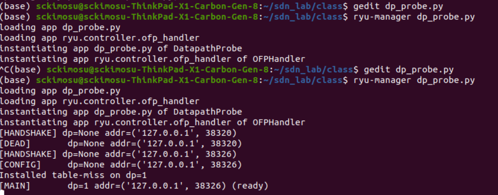
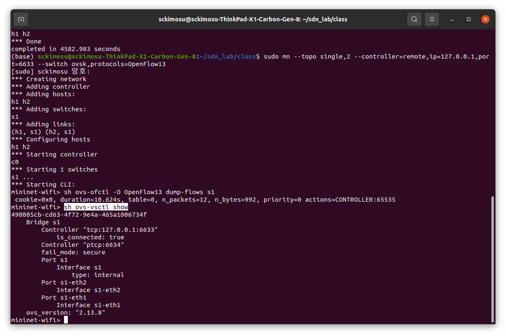
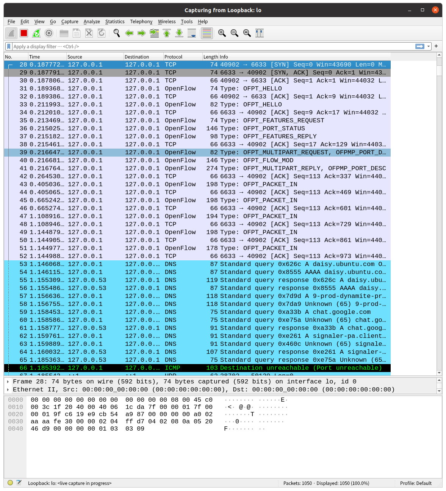

# Ryu Controller와 스위치 : 서버와 클라이언트 관계

## **[1] Mininet과** 컨트롤러

---

- Mininet은 **가상의 네트워크(호스트, 스위치, 링크)**를 만드는 시뮬레이터
    - 스위치는 단독으로는 패킷을 어떻게 처리해야 하는지 모름
    - 스위치는 뇌역할을 하는 **SDN 컨트롤러**에 연결해서 지시를 받아야 함
- Mininet 안의 가상 스위치가 외부(또는 내부)의 SDN 컨트롤러와 TCP 연결을 맺고 OpenFlow 프로토콜로 제어를 받음

---

## 구조

- 스위치(`s1`)는 **OpenFlow 프로토콜**을 사용해서 컨트롤러(`Ryu`)와 통신
- 컨트롤러는 스위치로부터 **Packet-In**을 받고, 필요한 경우 **Flow-Mod (플로우 룰)**을 내려줌

```
┌──────────────────────────────────────────────┐
│                  컨트롤러                   │
│     (예: Ryu, ONOS, Floodlight, POX)        │
│        └ listens on TCP port 6633/6653       │
└──────────────────────────────────────────────┘
                 ▲         ▲
                 │ OpenFlow│
                 ▼         ▼
┌──────────────────────────────────────────────┐
│                Mininet                       │
│ ┌──────┐     ┌──────┐      ┌──────┐          │
│ │ h1   │────▶│ s1   │──────│ h2   │          │
│ └──────┘     └──────┘      └──────┘          │
│                │                             │
│                └── TCP → 127.0.0.1:6633 → 컨트롤러 │
└──────────────────────────────────────────────┘

```

---

## 동작

- **컨트롤러(Ryu) 실행**
    - 127.0.0.1:6633 포트에서 OpenFlow 메시지 대기
    
    ```bash
    ryu-manager ryu.app.simple_switch_13
    
    ```
    
- **Mininet 실행 시 컨트롤러 지정**
    - `-controller=remote`
        - 외부 컨트롤러와 연결
    - `ip=127.0.0.1`
        - 같은 PC에 있는 Ryu로 연결
    - `port=6633`
        - 컨트롤러가 리슨하는 OpenFlow 포트
    
    ```bash
    sudo mn --topo single,2 \
             --controller=remote,ip=127.0.0.1,port=6633 \
             --switch ovsk,protocols=OpenFlow13
    
    ```
    
- **스위치 → 컨트롤러 연결 과정**
    - Mininet이 OVS(Open vSwitch)를 띄움
    - OVS가 TCP 세션을 `127.0.0.1:6633`에 오픈함
    - Ryu의 Controller Core(`ryu.controller.controller`)가 연결을 수락
    - `Datapath` 객체 생성 (`dpid` 할당)
    - 스위치가 `Features Request/Reply` 메시지 교환
    - 이후 Ryu가 `FlowMod`로 룰 설치

---

## 로그 확인

- Ryu 콘솔

```
connected [datapath_id=1, addr=127.0.0.1:45932]
switch_features_handler called
Installed table-miss flow

```

- Mininet 콘솔

```
*** Adding controller
*** Adding hosts
*** Adding switches
*** Configuring hosts
*** Starting network

```

- 이때 스위치가 실제로 컨트롤러와 통신 중임을 확인

```bash
sudo ovs-vsctl show

```

- 출력
    - **스위치가 컨트롤러에 연결되었다(connected)**는 뜻

```
Controller "tcp:127.0.0.1:6633"
    is_connected: true

```

---

| 항목 | 의미 |
| --- | --- |
| 컨트롤러 | SDN의 두뇌 — 네트워크 정책을 중앙에서 제어 |
| Mininet | 가상의 네트워크(스위치, 호스트, 링크)를 시뮬레이션 |
| 연결한다 | 스위치가 컨트롤러의 OpenFlow 서버로 TCP 연결을 맺음 |
| 효과 | 컨트롤러가 스위치의 패킷 흐름(Flow Table)을 직접 제어 가능 |
| 연결 확인 | `sudo ovs-vsctl show` → `is_connected: true` |

---

## [2] Ryu Controller

- **물리적(TCP 레벨) → 논리적(OpenFlow 레벨) → Ryu 내부 처리 흐름** 순서
- 스위치 연결 수락 → Datapath 생성 → dpid 상태 추적
    - dp_probe.py 파일
        - ryu-manager dp_probe.py 실행
- 스위치가 붙을 때 Datapath 객체가 생기고 상태가 바뀌는 것을 로그로 확인함
    - **`hub.listen()`** 으로 서버가 오픈됨
    - `accept()` 시 **`Datapath` 객체**가 하나씩 생성
    - 수신 루프에서 **ofproto 파서**로 메시지를 해석
    - 메시지를 **이벤트로 변환**하여 `@set_ev_cls` 로 등록된 앱 핸들러에 전달함
- dp_probe.py 코드

```jsx
# dp_probe.py

from ryu.base import app_manager
from ryu.controller import ofp_event
from ryu.controller.ofp_event import EventOFPStateChange
from ryu.controller.handler import (
    set_ev_cls,
    HANDSHAKE_DISPATCHER, CONFIG_DISPATCHER,
    MAIN_DISPATCHER, DEAD_DISPATCHER,
)
from ryu.ofproto import ofproto_v1_3

class DatapathProbe(app_manager.RyuApp):
    OFP_VERSIONS = [ofproto_v1_3.OFP_VERSION]

    def __init__(self, *args, **kwargs):
        super(DatapathProbe, self).__init__(*args, **kwargs)
        self.dps = {}  # dpid -> Datapath 핸들 저장

    @set_ev_cls(EventOFPStateChange, [HANDSHAKE_DISPATCHER, CONFIG_DISPATCHER, MAIN_DISPATCHER, DEAD_DISPATCHER])
    def _state_change_handler(self, ev):
        dp = ev.datapath
        if ev.state == HANDSHAKE_DISPATCHER:
            self.logger.info("[HANDSHAKE] dp=%s addr=%s", getattr(dp, 'id', 'N/A'), getattr(dp, 'address', None))
        elif ev.state == CONFIG_DISPATCHER:
            self.logger.info("[CONFIG]     dp=%s addr=%s", dp.id, dp.address)
            self.dps[dp.id] = dp
        elif ev.state == MAIN_DISPATCHER:
            self.logger.info("[MAIN]       dp=%s addr=%s (ready)", dp.id, dp.address)
        elif ev.state == DEAD_DISPATCHER:
            self.logger.info("[DEAD]       dp=%s addr=%s", getattr(dp, 'id', 'N/A'), getattr(dp, 'address', None))
            if hasattr(dp, 'id'):
                self.dps.pop(dp.id, None)

    # 스위치 최초 연결 시 table-miss 설치
    @set_ev_cls(ofp_event.EventOFPSwitchFeatures, CONFIG_DISPATCHER)
    def switch_features_handler(self, ev):
        dp = ev.msg.datapath
        ofp = dp.ofproto
        p = dp.ofproto_parser
        match = p.OFPMatch()
        actions = [p.OFPActionOutput(ofp.OFPP_CONTROLLER, ofp.OFPCML_NO_BUFFER)]
        inst = [p.OFPInstructionActions(ofp.OFPIT_APPLY_ACTIONS, actions)]
        mod = p.OFPFlowMod(datapath=dp, priority=0, match=match, instructions=inst)
        dp.send_msg(mod)
        self.logger.info("Installed table-miss on dp=%s", dp.id)

```

- 화면



---

## [2-1] RyuApp의 `dp`

- `Datapath` 객체
- **모듈**
    - `ryu.controller.controller.Datapath`
- **의미**
    - SDN 컨트롤러 입장에서 **스위치를 추상화한 객체**
        - Ryu가 인식한 스위치 연결 세션 단위
        - 컨트롤러(Ryu)와 스위치(Open vSwitch) 사이의 OpenFlow 채널 연결 1개를 나타내는 객체
    - Ryu는 여러 스위치가 동시에 연결되어 있을 수 있으므로, 각 스위치마다 하나의 `Datapath` 객체(`dp`)를 생성해서 관리

---

## Datapath 객체의 주요 속성

- Ryu 내부(`ryu.controller.controller.Datapath` 클래스)의 주요 멤버

| 속성 | 설명 | 예시 |
| --- | --- | --- |
| `id` | 스위치의 **Datapath ID (DPID)** | `1`, `0x1`, `0x0000000000000001` |
| `address` | 스위치의 TCP 연결 주소 `(ip, port)` | `('127.0.0.1', 38320)` |
| `state` | 연결 상태 (`HANDSHAKE`, `CONFIG`, `MAIN`, `DEAD`) | `MAIN_DISPATCHER` |
| `ofproto` | 사용 중인 OpenFlow 프로토콜 정의 (버전별 모듈) | `ofproto_v1_3` |
| `ofproto_parser` | OpenFlow 메시지 생성기 (FlowMod, PacketOut 등) | `OFPFlowMod(...)` |
| `send_msg(msg)` | 스위치로 OpenFlow 메시지 전송 | `dp.send_msg(flow_mod)` |
| `set_state(state)` | 현재 연결 상태 변경 | `dp.set_state(CONFIG_DISPATCHER)` |

---

## `dp`

- Ryu 애플리케이션(`simple_switch_13.py`, `dp_probe.py`)에서는 `dp` 객체를 통해 스위치와 직접 통신
    - Ryu가 현재 제어 중인 스위치를 가리키는 핸들(객체)
    - `dp`통해 FlowMod, PacketOut, StatsRequest 같은 OpenFlow 메시지를 보냄
    - 테이블 미스(flow rule) 코드

```python
@set_ev_cls(ofp_event.EventOFPSwitchFeatures, CONFIG_DISPATCHER)
def switch_features_handler(self, ev):
    **dp = ev.msg.datapath       # ← 바로 이게 Datapath 객체(dp)**
    ofp = dp.ofproto           # 프로토콜 정의
    parser = dp.ofproto_parser # 메시지 생성기

    match = parser.OFPMatch()  # 전체 미스
    actions = [parser.OFPActionOutput(ofp.OFPP_CONTROLLER, ofp.OFPCML_NO_BUFFER)]
    inst = [parser.OFPInstructionActions(ofp.OFPIT_APPLY_ACTIONS, actions)]

    mod = parser.OFPFlowMod(datapath=dp, priority=0, match=match, instructions=inst)
    **dp.send_msg(mod)**           **# ← dp를 통해 실제 스위치에 메시지 전송**

```

---

## Datapath ID (dpid)

- 스위치가 컨트롤러에 연결될 때, **Features Reply 메시지** 안에 자신의 DPID(고유 식별자)를 보냄

```
[CONFIG] **dp=1** addr=('127.0.0.1', 38320)

```

- Ryu : 스위치 ID 등록

```python
dp.id = msg.datapath_id

```

- Mininet에서 확인

```bash
mininet> sh ovs-ofctl -O OpenFlow13 show s1

```

- 출력
    - `0001`이 바로 Ryu에서 `dp.id` 로 표시되는 DPID

```
OFPT_FEATURES_REPLY (xid=0x2): dpid:**0000000000000001**

```

---

## Ryu 내부 구조

- Ryu는 **연결된 스위치 수만큼 `dp` 객체를 보유**하고, 각 `dp`는 **독립된 제어 세션**을 유지
- dp (Datapath)
    - Ryu 컨트롤러가 인식한 스위치 하나를 대표하는 객체
    - 스위치와의 OpenFlow 메시지 송수신(FlowMod, PacketOut 등)을 담당하는 **핵심 통신 인터페이스**

```
┌────────────────────────────────────┐
│           Controller Core          │
│                                    │
│  Datapath(id=1, addr=127.0.0.1)    │── TCP 연결 ──▶ OVS Switch s1
│  Datapath(id=2, addr=127.0.0.1)    │── TCP 연결 ──▶ OVS Switch s2
│  Datapath(id=3, addr=127.0.0.1)    │── TCP 연결 ──▶ OVS Switch s3
│                                    │
│  ↳ dp.send_msg() 로 제어 명령 송신 │
└────────────────────────────────────┘

```

---

## **스위치의 Datapath ID (DPID) 할당 시점**

- **`OFPT_FEATURES_REPLY` 메시지를 받은 시점**에 할당(assign)됨

---

- 스위치가 컨트롤러에 연결되는 순서
    - `OFPT_FEATURES_REPLY` 수신 시점
    - **Ryu가 이제 이 연결은 어떤 스위치인지를 식별할 수 있게 되는 순간임**

| 단계 | 방향 | 메시지 | 설명 |
| --- | --- | --- | --- |
| 1 | Switch → Controller | **Hello (OFPT_HELLO)** | 버전 협상 시작 |
| 2 | Controller → Switch | **Features Request (OFPT_FEATURES_REQUEST)** | 스위치 기능/포트/DPID 요청 |
| 3 | Switch → Controller | **Features Reply (OFPT_FEATURES_REPLY)** | 스위치가 자신의 DPID와 기능 목록 전달 |
| 4 | Controller 내부 | `Datapath.id`에 `msg.datapath_id` 할당 |  |
| 5 | Controller 상태 | CONFIG_DISPATCHER → MAIN_DISPATCHER 로 전이 준비 |  |

---

## 코드 구현

- Ryu의 컨트롤러 코어(`ryu.controller.controller`)는 `recv_loop()`에서 스위치로부터 수신한 OpenFlow 메시지 처리
    - `msg.datapath_id` 값
        - 스위치가 자신의 하드웨어 ID로부터 생성한 고유 식별자(64bit 정수)
        
        | 스위치 이름 | MAC 주소 | DPID (16진수) | DPID (10진수) |
        | --- | --- | --- | --- |
        | s1 | 00:00:00:00:00:01 | 0x0000000000000001 | 1 |
        | s2 | 00:00:00:00:00:02 | 0x0000000000000002 | 2 |
        | s3 | 00:00:00:00:00:03 | 0x0000000000000003 | 3 |
        - 이 값이 `dp.id` 로 저장되어 Ryu가 스위치를 구분할 수 있음

```python
def _recv_loop(dp):
    while True:
        msg = **recv_openflow_msg**(dp.sock)
        if msg.type == **OFPT_HELLO**:
            # 버전 협상
            dp.set_state(HANDSHAKE_DISPATCHER)
        elif msg.type == **OFPT_FEATURES_REPLY**:
            # **여기서 dpid 할당 !!!**
            **dp.id = msg.datapath_id**
            dp.set_state(CONFIG_DISPATCHER)
            post_event(EventOFPStateChange(dp, CONFIG_DISPATCHER))

```

---

## 패킷 (Wireshark)

- OpenFlow `Features Reply` 메시지 구조
    - Ryu가 가져와서`dp.id = 1` 로 할당

```
OpenFlow v1.3 **OFPT_FEATURES_REPLY** (xid=0x2)
    datapath_id: 0x0000000000000001
    n_buffers: 256
    n_tables: 254
    capabilities: 0x0000004f
    Ports: 3 items

```

---

## 로그 변화

- Ryu 로그를 보면 이 순서로 바뀜
    - `dp=None`
        - 아직 `Features Reply` 안 옴
    - `dp=1`
        - `Features Reply` 수신 후 DPID 할당 완료

```
[**HANDSHAKE**] **dp=None** addr=('127.0.0.1', 38320)
[**CONFIG**]     **dp=1** addr=('127.0.0.1', 38320)
Installed table-miss on dp=1
[MAIN]       dp=1 addr=('127.0.0.1', 38320)

```

---

## OpenFlow 메시지

- dp.id (Datapath ID)는 **OFPT_FEATURES_REPLY** 메시지를 받은 시점에 설정됨
- 컨트롤러가 Features Request를 보낸 직후 스위치의 Features Reply를 받으면 dp.id = msg.datapath_id 로 스위치 ID가 assign 됨
- 이후부터는 이 dp 객체를 통해 Ryu가 해당 스위치를 제어

| 메시지 | 방향 | dp 상태 | dp.id 상태 |
| --- | --- | --- | --- |
| **Hello** | Switch ↔ Controller | HANDSHAKE_DISPATCHER | None |
| **Features Request** | Controller → Switch | HANDSHAKE_DISPATCHER | None |
| **Features Reply** | **Switch → Controller** | **CONFIG_DISPATCHER** | **dp.id 할당** |
| **Packet-In / FlowMod** | 양방향 | MAIN_DISPATCHER | dp.id 유지 |

---

## [2-2] TCP 연결 요청 : 스위치 (클라이언트)

- 스위치가 Ryu 컨트롤러의 OpenFlow 포트(127.0.0.1:6633)로 TCP 연결 요청을 보냄
    - **Mininet / Open vSwitch(OVS)**와 **Ryu Controller Core** 사이에서 일어나는 가장 첫 번째 실제 네트워크 이벤트
        - **물리적(TCP 레벨) → 논리적(OpenFlow 레벨) → Ryu 내부 처리 흐름**

---

## **TCP 서버 소켓** 오픈 : **Ryu 컨트롤러 (서버)**

- **Ryu 컨트롤러**
    - Ryu 내부의 `ryu.controller.controller` 모듈이 **TCP 서버 소켓**을 오픈
    
    ```bash
    ryu-manager dp_probe.py
    
    ```
    
    - **서버의 모든 인터페이스(0.0.0.0)의 6633 포트(OpenFlow 포트)에서 연결 대기 중**
    
    ```python
    **server = hub.listen(('0.0.0.0', 6633))**
    
    ```
    
- **Mininet 스위치(Open vSwitch)**
    - OVS는 설정된 컨트롤러 주소 **(Ryu 서버 ip=127.0.0.1, Ryu 서버 포트 port=6633**) TCP 연결 시도
    
    ```bash
    sudo mn --controller=remote,ip=127.0.0.1,port=6633 --switch ovsk,protocols=OpenFlow13
    
    ```
    

---

## TCP 연결 요청 (3-way handshake)

- OVS가 컨트롤러와 연결하려면 먼저 **TCP 세션을 진행해야 함**
    - 일반적인 TCP 연결 과정과 동일함
    - **출발지 OVS (스위치) IP/포트** : `127.0.0.1:38320`
    - **목적지 Ryu 컨트롤러 IP/포트** : `127.0.0.1:6633`
        - Mininet의 스위치 프로세스가 **OVS 스위치 (클라이언트)** 127.0.0.1의 38320 포트에서 **Ryu 컨트롤러 (서버**) 127.0.0.1 (로컬 서버) 의 6633 포트로 연결하겠다는 의미

| 순서 | 송신자 | 수신자 | 내용 |
| --- | --- | --- | --- |
| 1 | OVS | Ryu | `SYN` **(src=38320, dst=6633)** |
| 2 | Ryu | OVS | `SYN-ACK` |
| 3 | OVS | Ryu | `ACK` |
|  | TCP 연결 성립 |  |  |

---

## [2-3] OpenFlow 프로토콜 초기화

- TCP 연결이 성립하면
    - 즉시 OpenFlow 프로토콜 레벨의 **Hello 메시지 교환이 이루어짐**
- Ryu 서버는 **새 스위치 (클라이언트) 연결임을** 인식하고,
    - `EventOFPStateChange` 이벤트를 발생시킴
    - 전통적인 클라이언트-서버 구조에서 서버 컨트롤러의 **Listen 소켓**(Listen_Sock)에서 클라이언트가 **accept()** 되면 서버가 클라이언트 소켓 (Client_Sock)을 생성하는 것과 유사한 과정

| 단계 | 메시지 | 설명 |
| --- | --- | --- |
| 1 | **OFPT_HELLO** (from Switch, 클라이언트) | Switch, 클라이언트는 OpenFlow 1.3 지원함 |
| 2 | **OFPT_HELLO** (from Ryu, 서버) | 서버도 1.3으로 함 |
| 3 | 상태 전이 → **HANDSHAKE_DISPATCHER** | Ryu 내부에서 **새 Datapath** 객체 생성 |
- Ryu Controller, 서버는 `HANDSHAKE_DISPATCHER` 로 클라이언트 소켓 (Client_Sock) 생성과 동일한 단계수행
- Ryu Controller 로그

```
**[HANDSHAKE] dp=None addr=('127.0.0.1', 38320)**

```

---

## [2-4] Ryu 내부 동작 (Controller Core)

- Ryu 내부에서는 이 TCP 연결을 `Datapath` 객체로 관리
    - Ryu가 `accept()`로 스위치의 TCP 연결을 받음
    - `Datapath` 객체 생성 (`dp.address = ('127.0.0.1', 38320)`, 클라이언트 스위치의  IP와 포트)
    - 상태를 `HANDSHAKE_DISPATCHER` 로 설정
    - 이벤트를 RyuApp(`dp_probe.py`) 에 전달
        - 이 때 dp.id(즉, datapath_id)는 아직 없음 → `dp=None`.

```python
# ryu.controller.controller (의사 코드)
def accept_loop():
    server = hub.listen(('0.0.0.0', 6633))
    while True:
        sock, addr = server.accept()
        dp = Datapath(sock, addr)           # 새 스위치 연결
        dp.set_state(HANDSHAKE_DISPATCHER)  # 초기 상태
        post_event(EventOFPStateChange(dp, HANDSHAKE_DISPATCHER))
        hub.spawn(recv_loop, dp)

```

---

## [2-5] OVS(스위치, 클라이언트) 설정 확인

- Mininet에서 다음 명령으로 실제 TCP 연결 상태 확인

```bash
mininet> sh ovs-vsctl show

```

- 출력
    - OVS (Bridge s1, 클라이언트)가 **127.0.0.1:6633 컨트롤러**(서버)로 TCP 연결을 성공적으로 맺었다는 뜻

```
Bridge "s1"
    **Controller "tcp:127.0.0.1:6633"**
        is_connected: true
        role: other

```

- 명령어

```jsx
sh ovs-vsctl show
```

---

## `sudo ovs-vsctl show` 명령 결과

- **스위치 `s1`이 Ryu 컨트롤러(127.0.0.1:6633)에 성공적으로 연결되어 있는 상태**
    - OVS(Open vSwitch) 내부 설정을 그대로 보여주는 정보
    - 스위치 `s1`의 **컨트롤러 연결 상태 + 포트 구조 + 동작 모드 표현**



- 내용

```
490805cb-cd63-4f72-9e4a-465a1006734f
    Bridge s1
        Controller "tcp:127.0.0.1:6633"
            is_connected: true
        Controller "ptcp:6634"
        fail_mode: secure
        Port s1
            Interface s1
                type: internal
        Port s1-eth2
            Interface s1-eth2
        Port s1-eth1
            Interface s1-eth1
    ovs_version: "2.13.8"

```

---

## [2-5-1] Ryu 로그 1 : `490805cb-cd63-4f72-9e4a-465a1006734f`  UUID (Universally Unique Identifier)

- **Open vSwitch의 데이터베이스(OVSDB) 식별자(UUID) 출력**
    - **OVS 인스턴스 자체를 식별하는 고유 ID** (Universally Unique Identifier)
    - OVS는 내부적으로 **OVSDB (Open vSwitch Database)** 라는 설정 데이터베이스를 가지고 있으며,그 DB 안에서 각각의 스위치(bridge)나 컨트롤러, 포트 등을 객체(Object)로 관리

```
490805cb-cd63-4f72-9e4a-465a1006734f

```

---

## OVSDB 내부

- 맨 위의 `Open_vSwitch` 객체에 부여된 UUID가 바로`490805cb-cd63-4f72-9e4a-465a1006734f`
- 각 Bridge(`s1`), Controller(`tcp:127.0.0.1:6633`), Port(`s1-eth1` 등)도 각각 별도의 UUID를 가짐

```
**Open_vSwitch** (**UUID**: **490805cb-cd63-4f72-9e4a-465a1006734f**)
│
├── bridges : [**UUID1**, **UUID2**, ...]
│     └── Bridge "s1"
│          ├── controllers : [**UUID3**]
│          ├── ports : [**UUID4**, UUID5, UUID6]
│          └── fail_mode : "secure"
│
├── ovs_version : "2.13.8"
└── other_config : {...}

```

---

## 사용 시점

- UUID는 주로 **OVSDB 명령어로 세밀한 설정을 조작할 때** 사용
    - 특정 객체만 정확히 수정하려면 UUID로 지정

```bash
sudo ovs-vsctl set bridge **490805cb-cd63-4f72-9e4a-465a1006734f** fail_mode=standalone

```

- bridge 이름 대신 UUID로도 가능

```bash
sudo ovs-vsctl get bridge **s1 _uuid**

```

- 출력
    - **OVSDB 내부 객체를 직접 식별할 때 사용하는 내부 키(Key)**

```
490805cb-cd63-4f72-9e4a-465a1006734f

```

---

## 스위치와 UUID의 관계

- 이 둘은 1:1 매핑 관계
    - `s1` ≡ `UUID 490805cb-cd63-4f72-9e4a-465a1006734f`

| 항목 | 예시 | 역할 |
| --- | --- | --- |
| Bridge 이름 | `s1` | 사람이 보기 편한 이름 (Mininet/OVS에서 지정) |
| Bridge UUID | `490805cb-cd63-4f72-9e4a-465a1006734f` | OVSDB 내부에서 해당 객체를 식별하는 고유 키 |

---

- **490805cb-cd63-4f72-9e4a-465a1006734f** 는 Open vSwitch 데이터베이스(OVSDB)에서 현재 실행 중인 OVS 인스턴스(또는 Bridge s1)를 식별하기 위한 **고유 식별자(UUID)**
- 사람이 보기에는 이름(s1)으로 구분하지만, OVS 내부에서는 이 UUID로 객체를 구분

| 항목 | 설명 |
| --- | --- |
| 값 | `490805cb-cd63-4f72-9e4a-465a1006734f` |
| 종류 | UUID (Universally Unique Identifier) |
| 소속 | OVSDB의 `Open_vSwitch` 레코드 |
| 역할 | OVS 인스턴스를 식별하는 내부 ID |
| 대응 객체 | Bridge "s1" 및 관련 설정들을 포함한 루트 객체 |
| 사용 예시 | `ovs-vsctl get`, `set`, `list` 명령에서 특정 객체 지정용 |

## 2. Bridge s1

- Mininet이 생성한 **가상 스위치 이름**
    - ****`Bridge s1`
    - 이 스위치는 Linux 커널 내에서 **OVS bridge**로 동작하며, Ryu 컨트롤러가 제어
- 스위치가 OpenFlow 스위치 역할을 수행하기 위해 내부적으로 datapath ID (dpid)를 가지고 있음
    - Ryu 로그의 `[CONFIG] dp=1` 등으로 대응

---

## 3. Controller "tcp:127.0.0.1:6633"

- **스위치가 외부 컨트롤러**(`Ryu`)와 통신할 때 사용하는 설정
    - 스위치 s1이 현재 Ryu 컨트롤러(127.0.0.1:6633)에 정상적으로 붙어 있다 의미

| 항목 | 설명 |
| --- | --- |
| `"tcp:127.0.0.1:6633"` | **컨트롤러의 IP(127.0.0.1)와 포트(6633**). **즉, Ryu가 리슨 중인 OpenFlow 서버 주소** |
| `is_connected: true` | **TCP 연결이 성공적**임을 의미. 현재 Ryu 컨트롤러와 세션이 유지 중 |
| 연결 프로토콜 | TCP (OpenFlow 1.3) |
| Ryu 로그 대응 | `[HANDSHAKE] → [CONFIG] → [MAIN]` 단계 진행 후 유지 상태 |

---

## 4. Controller "ptcp:6634"

- **OVS가 자체적으로 열어둔 “Passive TCP” 포트**
- **Ryu는 6633에서 listen**, **OVS는 6634에서 listen (혹시 외부에서 붙을 컨트롤러용)**

| 항목 | 설명 |
| --- | --- |
| `"ptcp:6634"` | Passive TCP 포트로, 외부 컨트롤러가 OVS로 연결을 시도할 수 있게 함 |
| 역할 | 디버깅용 또는 다른 컨트롤러가 OVS에 직접 접속할 수 있도록 허용 |
| 보통 상태 | Mininet이 자동으로 설정함. 지금은 사용되지 않음 (Ryu는 6633 사용 중) |

## 5. fail_mode: secure

- **Ryu가 죽거나 연결이 끊기면**, **스위치는 데이터 패킷을 전달하지 않음**
    - SDN 테스트에서 정상적인 보안 동작

| 옵션 | 의미 |
| --- | --- |
| `standalone` | 컨트롤러가 끊겨도 스위치가 자체적으로 학습하여 동작 |
| `secure` | 컨트롤러가 끊기면 **모든 포트를 차단(보안 유지)** |

---

## 6. Port 및 Interface 목록

- 스위치가 가진 **포트(Port)**와 **실제 인터페이스(Interface)** 매핑
- Mininet 토폴로지 `single,2` (즉, h1–s1–h2) 구조가 반영

| 포트 이름 | 인터페이스 | 설명 |
| --- | --- | --- |
| `s1` | `s1` (type=internal) | 스위치 자체를 대표하는 내부 인터페이스. Ryu 제어용 |
| `s1-eth1` | `s1-eth1` | 호스트 `h1`과 연결된 포트 |
| `s1-eth2` | `s1-eth2` | 호스트 `h2`와 연결된 포트 |

---

## 7. ovs_version: "2.13.8"

- OVS의 버전 정보
    - OpenFlow 1.3을 완벽히 지원하는 안정 버전이며, Ryu의 `ofproto_v1_3` 와 호환

---

| 항목 | 내용 |
| --- | --- |
| 컨트롤러 주소 | `tcp:127.0.0.1:6633` |
| 연결 상태 | `is_connected: true` (정상 연결 중) |
| 추가 포트 | `ptcp:6634` (대기 중이지만 사용 안 함) |
| Fail Mode | `secure` (컨트롤러 끊기면 트래픽 차단) |
| 스위치 포트 | s1-eth1 (h1), s1-eth2 (h2) |
| OVS 버전 | 2.13.8 |

---

- is_connected: true
    - 스위치 `s1`이 **Ryu 컨트롤러(127.0.0.1:6633)**와 **OpenFlow TCP 연결을 성공적으로 맺고 제어를 받고 있는 상태**
    - Ryu 쪽에서 `[MAIN] dp=1 ... (ready)` 가 찍히면, `ovs-vsctl show` 결과와 **일치**

---

## [2-5-2]  Ryu 로그 2 : [HANDSHAKE] dp=None addr=('127.0.0.1', 38320)

- **Open vSwitch(스위치)**가 **Ryu 컨트롤러의 127.0.0.1:6633 포트로 TCP 연결을 시도하고 성공했을 때,** Ryu가 해당 연결을 인식하여 **새 Datapath 객체를 생성하고 HANDSHAKE 상태로 진입함**

| 역할 | 주소 | 설명 |
| --- | --- | --- |
| **Ryu 컨트롤러 (서버)** | 127.0.0.1:6633 | OpenFlow 서버 포트 (listen 중) |
| **OVS 스위치 (클라이언트)** | 127.0.0.1:38320 | TCP 연결의 출발지 (ephemeral port) |
| **프로토콜** | **TCP + OpenFlow v1.3** | 메시지 기반 제어 채널 |
| **로그 표시** | `[HANDSHAKE] dp=None addr=('127.0.0.1',38320)` |  |

## Ryu **Controller Core :** 서버 역할 수행

- 스위치(Open vSwitch, Mininet 등)로부터 TCP 연결을 **수신(listen)**
- OpenFlow 메시지(Hello, Features Request, Packet-In 등)를 **해석(parsing)**
- 적절한 RyuApp(예: `simple_switch_13`)으로 이벤트를 **전달(dispatch)**하는 핵심 엔진

---

## 모듈 구성

```
**ryu.controller.controller (OpenFlow Controller Core)**
│
├── **hub** (이벤트 루프 스레드 관리)
│
├── **OpenFlow TCP Server**
│     └── **hub.listen(0.0.0.0:6633)**
│
├── **Datapath (스위치 연결 세션 관리)**
│     ├── send_msg()
│     ├── send_packet_out()
│     ├── send_flow_mod()
│     └── ...
│
├── **ofproto_parser (메시지 파싱/직렬화)**
│     └── OFPFlowMod, OFPPacketOut, OFPMatch 등
│
└── **ofp_handler (수신 메시지를 이벤트로 변환)**
      └── **EventOFPSwitchFeatures**, EventOFPPacketIn ...

```

---

## 실행

- **`ryu-manager` 실행**
    - `ryu.controller.controller` 모듈의 `main()` 호출
    
    ```bash
    ryu-manager ryu.app.simple_switch_13
    
    ```
    
- **OpenFlow 서버 시작**
    - **모든 인터페이스(0.0.0.0)에서 6633 포트로 listen**
        - 스위치가 이 포트로 TCP 연결을 시도함
    
    ```python
    server = hub.listen(('0.0.0.0', 6633))
    
    ```
    
- **스위치 연결 수락 (Datapath 생성)**
    - 새 스위치 연결이 들어오면 `Datapath` 객체 생성
    - 스위치마다 고유한 `dpid`와 통신용 큐(thread) 보유
- **Hello 메시지 교환**
    - OpenFlow 핸드셰이크 단계 (버전 협상)
    - 상태
        - `HANDSHAKE_DISPATCHER`
- **Features Request / Reply 교환**
    - 스위치 기능 목록 전달
    - 상태 전이: `CONFIG_DISPATCHER`
- **AppManager에서 등록된 앱 호출**
    - 해당 스위치의 `EventOFPSwitchFeatures` 발생
    - `@set_ev_cls(EventOFPSwitchFeatures, CONFIG_DISPATCHER)` 핸들러 실행
- **이후 Packet-In 발생 시**
    - Core가 메시지를 파싱 → `EventOFPPacketIn` 이벤트로 변환
    - App Manager가 이를 등록된 RyuApp으로 dispatch
    - 상태: `MAIN_DISPATCHER`

---

## 주요 객체

| 객체 | 역할 | 코드 |
| --- | --- | --- |
| **`Datapath`** | 스위치 1대에 해당하는 연결 관리 객체 | `dp.send_msg(flow_mod)` |
| **`OFPHandler`** | OpenFlow 메시지를 파싱하고 이벤트로 변환 | `ofp_event.EventOFPPacketIn` |
| **`OFPParser`** | 메시지 생성/해석 (FlowMod, PacketOut 등) | `parser.OFPFlowMod(...)` |
| **`EventQueue`** | 수신 메시지를 RyuApp에 전달하는 이벤트 버스 | 내부 비동기 처리 |
| **`RyuApp`** | 사용자가 작성한 애플리케이션 (simple_switch_13 등) | `@set_ev_cls` 사용 |

---

## 내부 흐름

```
**스위치 (OpenFlow 메시지)**
        ↓
[ Controller Core (ryu.controller.controller) ]
        ↓  (**hub로부터 TCP 수신**)
        ↓
  ofproto_parser가 파싱
        ↓
  Event Dispatcher가 이벤트 생성
        ↓
  App Manager가 적절한 RyuApp 핸들러 호출
        ↓
  (RyuApp이 FlowMod/PacketOut 전송)
        ↓
  Datapath 객체가 메시지를 직렬화해 스위치로 송신

```

---

| 구성요소 | 설명 |
| --- | --- |
| **`ryu.controller.controller`** | OpenFlow TCP 서버 및 연결 관리 핵심 모듈 |
| **`hub`** | 비동기 이벤트 루프 (gevent 기반) |
| **`Datapath`** | 스위치 연결 세션 관리 (송수신 인터페이스) |
| **`ofproto_parser`** | 메시지 직렬화·역직렬화 모듈 |
| **`ofp_handler`** | 수신 메시지를 이벤트로 변환하여 App으로 전달 |
| **`EventDispatcher`** | RyuApp 이벤트 핸들링 시스템 |
| **`RyuApp`** | 사용자 정의 OpenFlow 제어 로직 구현체 |

---

## [2-5-3] Ryu 로그 3 : Dispatcher 상태 (Dispatcher State)

- 스위치가 컨트롤러에 연결될 때 **OpenFlow 세션이 단계적으로 설정되는 과정**
    - Ryu 컨트롤러는 OpenFlow 스위치와 연결될 때, **연결의 상태 구분**

| 상태 이름 | 설명 |
| --- | --- |
| **HANDSHAKE_DISPATCHER** | **TCP 연결이 막 맺어진 초기 단계 (Hello 메시지 교환 중)** |
| **CONFIG_DISPATCHER** | **스위치의 기능(Features) 협상 단계 — Flow Table 초기 설정 가능** |
| **MAIN_DISPATCHER** | **정상 동작 단계 — Packet-In / FlowMod 등 데이터 평면 제어 가능** |
| **DEAD_DISPATCHER** | **연결 종료 (스위치가 끊어짐)** |

---

- Ryu 실행

```bash
ryu-manager dp_probe.py

```

- Mininet 실행

```bash
sudo mn --topo single,2 --controller=remote,ip=127.0.0.1,port=6633 --switch ovsk,protocols=OpenFlow13

```

---

## Ryu 로그

- 정상 연결 시, `dp_probe.py` 에서 아래와 같이 출력
    - 상태 전이 로그

```
loading app dp_probe.py
instantiating app dp_probe.py
**[HANDSHAKE] dp=N/A addr=('127.0.0.1', 44822)**
**[CONFIG]     dp=1 addr=('127.0.0.1', 44822)**
Installed table-miss on dp=1
**[MAIN]       dp=1 addr=('127.0.0.1', 44822) (ready)**

```

---

## 실제 내부

- `EventOFPStateChange` 이벤트가 발생하며, Ryu의 Core가 **스위치 상태를 추적함**

| 단계 | OpenFlow 메시지 | 설명 |
| --- | --- | --- |
| 1. **HANDSHAKE** | **Hello / Hello** | 버전 협상 |
| 2. **CONFIG** | **Features Request / Reply** | 스위치 기능 목록, datapath_id 수신 |
| 3. **MAIN** | **FlowMod / Packet-In / Packet-Out** | 데이터 흐름 제어 시작 |
- 아래 로그는 Ryu 컨트롤러가 스위치(`s1`)와의 OpenFlow 세션을 **성공적으로 맺고 상태 전이를 완료했다**는 뜻


```
[HANDSHAKE] dp=None addr=('127.0.0.1', 38326)
[CONFIG]     dp=None addr=('127.0.0.1', 38326)
Installed table-miss on dp=1
[MAIN]       dp=1 addr=('127.0.0.1', 38326) (ready)

```

---

| 단계 | 로그 내용 | 의미 |
| --- | --- | --- |
| `[HANDSHAKE]` | `dp=None addr=('127.0.0.1', 38326)` | 스위치가 TCP 연결을 맺은 직후, 아직 datapath ID(`dpid`)를 받지 못한 상태. OpenFlow Hello 메시지를 교환 중 |
| `[CONFIG]` | `dp=None addr=('127.0.0.1', 38326)` | Features Request/Reply 교환 중.스위치가 자신이 가진 포트/기능을 컨트롤러에 전달 |
| `Installed table-miss on dp=1` |  | Ryu가 스위치에게 **기본 플로우 룰(table-miss flow)** 을 설치함.즉, 미스된 패킷은 컨트롤러로 Packet-In 하도록 설정 |
| `[MAIN]` | `dp=1 addr=('127.0.0.1', 38326) (ready)` | datapath ID가 할당되어 스위치-컨트롤러 연결이 완전히 성립.이제 Packet-In / FlowMod 등 정상 제어 가능 상태 |

---

## 연결 흐름

- 아래 과정이 Ryu 로그로 나타남

```
[1] TCP 연결 (스위치 → 컨트롤러)
[2] Hello 교환 → 상태: HANDSHAKE_DISPATCHER
[3] Features Request / Reply → 상태: CONFIG_DISPATCHER
[4] Table-miss Flow 설치
[5] 연결 완료 → 상태: MAIN_DISPATCHER

```

---

## Mininet에서 확인

- 다음 명령을 실행하면,

```bash
mininet> sh ovs-vsctl show

```

- **스위치가 Ryu 컨트롤러에 붙었다**는 증거가 출력됨

```
Controller "tcp:127.0.0.1:6633"
    is_connected: true

```

- Ryu 로그의 `[HANDSHAKE] → [CONFIG] → [MAIN]` 전이
    - 스위치 연결이 단계적으로 완료된 것 의미
- `Installed table-miss on dp=1`
    - 컨트롤러가 스위치의 기본 동작(미스 패킷을 컨트롤러로 보냄)을 설정했다는 뜻
    - 이제 Ryu는 정상적으로 스위치 제어가 가능

---

## [2-5-4] Ryu 로그 4 : [DEAD] dp=None addr=('127.0.0.1', 38320)

- **스위치(Open vSwitch)** 와의 연결이 일시적으로 끊어졌다는 뜻
    - `[DEAD]` 로그는 스위치가 Ryu와의 세션을 닫았다는 정상적인 알림일 수도 있고, 재시작이나 설정 불일치로 인한 일시적인 끊김일 수도 있음

```
[DEAD] dp=None addr=('127.0.0.1', 38320)

```

- `[DEAD]`
    - **스위치가 연결을 맺었다가 끊긴 상태**

| 로그 항목 | 설명 |
| --- | --- |
| `[DEAD]` | Ryu 컨트롤러가 이 연결(`datapath`)을 죽은(dead) 상태로 전환함 |
| `dp=None` | 아직 datapath ID(dpid)가 정식으로 등록되기 전 또는 세션 종료 후라서 None |
| `addr=('127.0.0.1', 38320)` | 스위치가 컨트롤러와 통신하던 TCP 소켓 주소 |

## 원인

- **Mininet이 다시 시작되었거나 종료됨**
    - `sudo mn -c` 또는 `exit` 등으로 Mininet 세션을 닫으면 OVS가 컨트롤러 연결을 종료함.
- **OpenFlow 버전 불일치**
    - Ryu는 `ofproto_v1_3` (OpenFlow 1.3) 사용 중인데, Mininet 스위치가 1.0으로 기본 실행되면 버전 협상 실패 → 연결 해제.
    - 해결
        
        ```bash
        sudo mn --switch ovsk,protocols=**OpenFlow13**
        
        ```
        
- **포트/주소 불일치**
    - Ryu는 **6633** 포트에서 대기 중인데, Mininet이 **6653**으로 연결 시도하면 실패.

---

## 정상 로그

- 정상 연결 시에는 다음 순서로 나타남

```
[**HANDSHAKE**] **dp=None** addr=('127.0.0.1', 38320)
[**CONFIG**]     **dp=1** addr=('127.0.0.1', 38320)
[**MAIN**]       **dp=1** addr=('127.0.0.1', 38320) (ready)

```

- 끊길 때는 다음처럼  진행

```
[**DEAD**]       dp=1 addr=('127.0.0.1', 38320)

```

---

## 확인

- 현재 연결된 컨트롤러 확인
    - `is_connected: true`면 정상, `false`면 끊김 상태.
    
    ```bash
    sudo ovs-vsctl show
    
    ```
    
- Ryu 로그에서 `[DEAD]` 후 `[HANDSHAKE]`가 다시 뜬다면, 스위치가 재접속한 것 (자동 재연결 정상 동작).

---

| 상태 | 의미 |
| --- | --- |
| HANDSHAKE | 스위치가 새로 연결됨 |
| CONFIG | 기능 교환 (Features Reply 등) |
| MAIN | 제어 가능 상태 |
| **DEAD** | 연결이 끊김 (스위치 종료, 재시작, 또는 버전/포트 불일치) |

---

## [2-5-5] Ryu 로그 5 : addr=('127.0.0.1', 38320)

- **IP 주소(`127.0.0.1`)**
    - **컨트롤러가 연결을 수락한 스위치 쪽의 주소**
    - 스위치(Open vSwitch)가 컨트롤러로 연결할 때 사용하는 **클라이언트 IP**
    - Ryu 로그의 addr=('127.0.0.1', 38320) 은 스위치(Open vSwitch)의 로컬 주소와 포트, 즉 스위치가 컨트롤러로 접속해 온 주소

```
addr=('127.0.0.1', 38320)

```

---

| 항목 | 역할 | 설명 |
| --- | --- | --- |
| **Ryu 컨트롤러 (Server)** | 서버 | `0.0.0.0:6633`에서 **리스닝(listen)** 중 |
| **Open vSwitch (Client)** | 클라이언트 | 컨트롤러 주소(예: `127.0.0.1:6633`)로 TCP 연결을 **생성(connect)** 함 |
| **addr=('127.0.0.1', 38320)** | 클라이언트 소켓 주소 | 스위치가 연결 시 사용할 **로컬(출발지) 주소**와 **임시 포트(38320)** |

---

### TCP 세션 구조 요약

- 컨트롤러와 스위치의 연결
- `addr=('127.0.0.1', 38320)`는 Ryu가 127.0.0.1:6633에서 기다리고 있을 때, 스위치가 127.0.0.1:38320에서 접속해왔다는 의미

| 역할 | IP | Port | 설명 |
| --- | --- | --- | --- |
| 컨트롤러 (Ryu) | 127.0.0.1 | **6633** | 서버, OpenFlow 메시지를 수신 |
| 스위치 (OVS) | 127.0.0.1 | **38320** (임시) | 클라이언트, 연결 요청 (ephemeral port) |

| 항목 | 의미 |
| --- | --- |
| `127.0.0.1` | **스위치와 컨트롤러가 같은 컴퓨터에서 통신 중**이라는 뜻 (루프백) |
| `38320` | 스위치가 임시로 사용하는 **출발지 포트(ephemeral port)** |
| Ryu가 리슨 중인 포트 | 일반적으로 **6633** 또는 **6653** (OpenFlow 기본 포트) |
| 결론 | `addr=('127.0.0.1',38320)`는 **스위치 측 주소** (클라이언트 측) |

---

- Mininet에서 스위치가 실제로 컨트롤러로 어디에 연결했는지 확인

```bash
mininet> sh ovs-vsctl show

```

- 출력
    - 스위치가 127.0.0.1:6633 (Ryu)로 TCP 연결을 열었다는 뜻

```
Controller "tcp:127.0.0.1:6633"
    is_connected: true
    role: other

```

---

## [2-5-6] Ryu 로그 6 : `[HANDSHAKE] dp=None addr=('127.0.0.1', 38320)`

- **OpenFlow 연결의 가장 첫 단계**
    - **컨트롤러와 스위치가 처음으로 TCP 수준에서 인사하는 시점**

---

```
[HANDSHAKE] dp=None addr=('127.0.0.1', 38320)

```

| 항목 | 의미 |
| --- | --- |
| `[HANDSHAKE]` | 현재 스위치 연결의 상태(`dispatcher`)가 **HANDSHAKE 단계**임 |
| `dp=None` | 아직 `Datapath ID`(스위치의 고유 ID)가 확정되지 않음 |
| `addr=('127.0.0.1', 38320)` | 스위치(Open vSwitch)가 **127.0.0.1**에서 **38320번 포트**를 이용해 컨트롤러(127.0.0.1:6633)로 연결을 시도했음을 의미 |

---

## HANDSHAKE 단계

- OpenFlow 연결이 처음 만들어질 때 컨트롤러와 스위치 간에 일어나는 초기 인사 절차(handshake)
    - TCP 연결 위에서 **OpenFlow 버전 협상** 및 **기본 기능 교환 준비** 수행

### 시퀀스 다이어그램

- **HANDSHAKE 단계**
    - `Hello ↔ Hello` 메시지 교환 중 혹은 직후 시점.
- 아직 스위치가 자신의 **Datapath ID (dpid)** 를 보내기 전이기 때문에 `dp=None`.

```
Switch (OVS)                  Controller (Ryu)
     |                              |
     |---- TCP Connect ------------>|
     |                              |
     |---- Hello ------------------>|
     |<--- Hello -------------------|
     |                              |
     |<--- Features Request --------|
     |---- Features Reply ----------|

```

---

## Ryu 내부 동작

- 스위치가 Ryu 컨트롤러의 OpenFlow 포트(`127.0.0.1:6633`)로 TCP 연결 요청을 보냄.
- `ryu.controller.controller`의 `accept()`루프가 이 요청을 수락하고 새 **Datapath 객체**를 생성
    - Ryu는 `EventOFPStateChange` 이벤트를 발생시킴.
    
    ```python
    dp = Datapath(sock, address)
    dp.state = HANDSHAKE_DISPATCHER
    
    ```
    
- 핸들러가 이를 받아서 로그로 출력
    - **스위치가 연결됐지만 아직 식별되지 않은 상태**라는 뜻
    
    ```python
    [HANDSHAKE] dp=None addr=('127.0.0.1', 38320)
    
    ```
    

---

## Datapath 객체

| 필드 | 값 | 설명 |
| --- | --- | --- |
| `dp.id` | None | **아직 Features Reply를 받지 않아 datapath_id 미정** |
| `dp.address` | ('127.0.0.1', 38320) | 스위치 TCP 소켓 주소 |
| `dp.state` | HANDSHAKE_DISPATCHER | 연결 직후 단계 |
| `dp.send_msg()` | 가능 | Hello/Features 등 메시지 전송 가능 상태 |

---

## 이후 단계

- `[HANDSHAKE] dp=None addr=('127.0.0.1',38320)` → `[CONFIG] dp=1 ...` 으로 이어지는 것이 정상적인 연결 전이

| 단계 | 상태 | dp.id 값 | 설명 |
| --- | --- | --- | --- |
| HANDSHAKE | `dp=None` | 아직 없음 | Hello 교환 중 |
| CONFIG | `dp=1`  | **스위치가 Features Reply로 자신의 ID 전송** |  |
| MAIN | `dp=1` | Ryu가 FlowMod, Packet-In 등을 처리 가능 |  |
| DEAD | `dp=1` | 연결 종료됨 (스위치 off 등) |  |

---

## Wireshark 이용

- OpenFlow 패킷 캡처 시 HANDSHAKE 단계에서 다음 프레임들이 보임
    - **1~3까지가 바로 `[HANDSHAKE]` 구간**에 해당

| 순서 | 메시지 | 방향 | 설명 |
| --- | --- | --- | --- |
| 1 | TCP SYN / SYN-ACK | 스위치 ↔ 컨트롤러 | TCP 연결 수립 |
| 2 | OFPT_HELLO | 스위치 → 컨트롤러 | 버전 제안 (예: 1.3) |
| 3 | OFPT_HELLO | 컨트롤러 → 스위치 | 버전 선택 |
| 4 | OFPT_FEATURES_REQUEST | 컨트롤러 → 스위치 | 스위치 정보 요청 |
| 5 | OFPT_FEATURES_REPLY | 스위치 → 컨트롤러 | datapath_id 및 포트 정보 제공 |

---

| 요소 | 설명 |
| --- | --- |
| `HANDSHAKE` | 스위치가 컨트롤러와 TCP 연결을 막 맺은 상태 (Hello 교환 중) |
| `dp=None` | 아직 스위치가 자신의 datapath ID를 전달하지 않음 |
| `addr=('127.0.0.1', 38320)` | 스위치가 컨트롤러로 접속한 클라이언트 주소/포트 |
| 이후 단계 | Features 교환 후 `CONFIG`, FlowMod 가능 시점에서 `MAIN` 전이 |

---

## [3] Wireshark **Capture Interfaces (캡처 인터페이스)**

### 루트 권한으로 Wireshark 실행

- 일반 사용자 권한으로 실행하면 시스템 인터페이스(`lo`, `eth0` 등)가 숨겨짐
    - 관리자 권한 실행

```bash
sudo wireshark

```

- 목록에 다음처럼 실제 인터페이스가 나옴

```
lo
eth0
wlan0
docker0
s1-eth1
...

```

---

### OpenFlow 패킷 확인

- 캡처가 시작되면 Mininet을 실행하고 스위치가 연결될 때, Wireshark의 리스트에 다음 순서로 표시됨

| No. | Source | Destination | Protocol | Info |
| --- | --- | --- | --- | --- |
| 1 | 127.0.0.1 | 127.0.0.1 | TCP | 38320 → 6633 [SYN] |
| 2 | 127.0.0.1 | 127.0.0.1 | OpenFlow | OFPT_HELLO |
| 3 | 127.0.0.1 | 127.0.0.1 | OpenFlow | OFPT_FEATURES_REQUEST |
| 4 | 127.0.0.1 | 127.0.0.1 | OpenFlow | OFPT_FEATURES_REPLY |

---

## **Wireshark** 실험 환경  ****

- TCP 연결 과정
- OFPT_HELLO / OFPT_FEATURES_REQUEST / OFPT_FEATURES_REPLY 패킷 구조 분석
- Wireshark에서 보는 실제 필드
- Ryu의 `dp.id` 할당 과정
    - **DPID(dp.id)는 OFPT_FEATURES_REPLY 수신 시점에 확정**

---

## 실험 환경

| 구성 요소 | 값 |
| --- | --- |
| Controller | Ryu (OpenFlow 1.3) |
| Switch | Open vSwitch (OVS) |
| Topology | Mininet single switch |
| Protocol | OpenFlow 1.3 |
| Packet capture | `tcpdump -i lo -w of.pcap tcp port 6633` |

---

## TCP Handshake (Wireshark)

- 단순 TCP 연결
    - OpenFlow는 아직 시작 전.

| 단계 | 패킷 | 설명 |
| --- | --- | --- |
| 1 | SYN (38320 → 6633) | OVS가 Ryu로 접속 시도 |
| 2 | SYN/ACK | Ryu가 수락 |
| 3 | ACK | TCP 연결 성립 |

---

## OpenFlow Hello 교환

- Wireshark 패킷
    - 스위치가 먼저 `OFPT_HELLO`
    - Ryu가 `OFPT_HELLO` 로 응답
        - 프로토콜 버전 협상 완료 (OpenFlow1.3)

```
OpenFlow v1.3 OFPT_HELLO (xid=0x0)

```

- **Wireshark Fields**

```
Version: 0x04 (OpenFlow 1.3)
Type: 0 (OFPT_HELLO)
Length: 8
xid: 0x00000000

```

---

## OFPT_FEATURES_REQUEST (Ryu → Switch)

- Wireshark 패킷

```
OpenFlow v1.3 OFPT_FEATURES_REQUEST (xid=0x1)

```

- 필드
    - Ryu가 스위치 정보(포트, capabilities, datapath_id) 요청

| 필드 | 값 | 설명 |
| --- | --- | --- |
| Version | 0x04 | OF 1.3 |
| Type | 5 | OFPT_FEATURES_REQUEST |
| XID | 0x1 | 메시지 식별자 |

---

## OFPT_FEATURES_REPLY (Switch → Ryu)

- **여기서 DPID가 등장**
    - Wireshark

```
OpenFlow v1.3 OFPT_FEATURES_REPLY (xid=0x1)

```

- 필드

| 필드 | 내용 |
| --- | --- |
| datapath_id | `0x0000000000000001` |
| n_buffers | 256 |
| n_tables | 254 |
| auxiliary_id | 0 |
| Capabilities | FLOW_STATS |
| Ports | eth0, lo ... |
- Wireshark Field View

```
Datapath ID: 0x0000000000000001
# (64-bit, 빅엔디언)

```

- 이 값이 바로 Ryu에게 들어감

```python
dp.id = msg.datapath_id

```

---

## Ryu 내부 코드 동작

### 이벤트 핸들러

- Ryu의 `OFPT_FEATURES_REPLY` 처리 코드

```python
@set_ev_cls(ofp_event.EventOFPSwitchFeatures, CONFIG_DISPATCHER)
def switch_features_handler(self, ev):
    dp = ev.msg.datapath      # <-- Datapath 객체
    print("DPID:", dp.id)     # <-- 여기 출력됨

```

- Features Reply 메시지 구조 정의 (`ryu/ofproto/ofproto_v1_3_parser.py`)

```python
class OFPSwitchFeatures(OFPMsgBase):
    def __init__(..., datapath_id, ...):
        self.datapath_id = datapath_id

```

---

## OVS 내부 DPID 생성

- OVS는 `/etc/openvswitch/conf.db`에 MAC 기반 DPID 저장

```bash
ovs-vsctl get Bridge s1 datapath_id

```

- 예

```
"0000000000000001"

```

- MAC 기반 변환 규칙

```
DPID = MAC address(48bit) + 16bit padding

```

---

## 흐름 시퀀스

```
OVS -> Ryu      TCP SYN
Ryu -> OVS      SYN/ACK
OVS -> Ryu      ACK

OVS -> Ryu      OFPT_HELLO
Ryu -> OVS      OFPT_HELLO

Ryu -> OVS      OFPT_FEATURES_REQUEST
OVS -> Ryu      OFPT_FEATURES_REPLY : 여기서 dp.id 확정!

```

---

## [4] Wireshark 화면

- **OpenFlow 핸드셰이크부터 packet-in까지 전체 세션 흐름**
    - Ryu ↔ OVS 간의 연결이 성공
- **TCP 3-way handshake → OpenFlow handshake → Features/Config → Packet-In 이벤트**



---

## 패킷 순서

| 단계 | 프로토콜 | 주요 패킷 | 의미 |
| --- | --- | --- | --- |
| 1 | **TCP** | `SYN`, `SYN,ACK`, `ACK` | OVS 스위치가 Ryu 컨트롤러(127.0.0.1:6633)에 TCP 연결 요청 |
| 2 | **OpenFlow** | `OFPT_HELLO` (양방향) | 버전 협상 (OpenFlow 1.3) |
| 3 | **OpenFlow** | `OFPT_FEATURES_REQUEST` / `OFPT_FEATURES_REPLY` | 컨트롤러가 스위치 기능 및 DPID 요청 / 스위치가 응답 |
| 4 | **OpenFlow** | `OFPT_SET_CONFIG` | 컨트롤러가 스위치 초기 설정 전송 |
| 5 | **OpenFlow** | `OFPT_MULTIPART_REQUEST` / `OFPT_MULTIPART_REPLY` | 포트 정보 및 스위치 상태 요청 |
| 6 | **OpenFlow** | `OFPT_PACKET_IN` | 스위치가 컨트롤러에 패킷 전달 (예: pingall 시 발생) |
| 7 | **OpenFlow** | `OFPT_PACKET_OUT`  | 컨트롤러가 스위치로 패킷 전달 명령 (ARP Reply, ICMP 등) |
| 8 | **OpenFlow** | `OFPT_ECHO_REQUEST/REPLY` | 주기적인 연결 유지 신호 (Keepalive) |

---

## 패킷 분석

### (1) TCP Handshake

- 스위치가 컨트롤러와 TCP 세션을 성공적으로 맺음

```
40902 → 6633 [SYN]
6633 → 40902 [SYN, ACK]
40902 → 6633 [ACK]

```

---

### (2) OpenFlow Handshake

- 버전 협상 (OpenFlow 1.3로 확정).
    - Ryu 로그에 `[HANDSHAKE] dp=None` 메시지가 찍히는 구간

```
Type: OFPT_HELLO
Type: OFPT_HELLO

```

---

### (3) Features Exchange

- 컨트롤러가 스위치의 datapath_id(DPID), 포트 리스트, capabilities 등을 요청 및 수신
    - 이 시점 이후 `[CONFIG]` 상태로 전이되고, dp.id 값이 설정

```
Type: OFPT_FEATURES_REQUEST
Type: OFPT_FEATURES_REPLY

```

---

### (4) Config 및 Table-miss 설치

- Ryu가 table-miss flow를 설치하고 `[MAIN]` 상태로 진입
    - Ryu 로그에서 `Installed table-miss on dp=1` 부분이 이에 해당

```
Type: OFPT_SET_CONFIG
Type: OFPT_FLOW_MOD (table-miss)

```

---

### (5) Packet-In 이벤트

- Mininet에서 `pingall` 명령을 실행했을 때, 스위치가 패킷을 어떤 포트로 보낼지 모를 때 그 패킷을 컨트롤러로 전송하는 이벤트
    - `ryu.controller.handler.OFPPacketIn` 이벤트로 Ryu가 처리
    - Wireshark에서 보면 OpenFlow v1.3 Type: Packet-In으로 표시됨

```
Type: OFPT_PACKET_IN

```

---

### (6) Echo 교환

- Ryu와 OVS가 연결 유지용 ping 메시지를 주기적으로 교환
    - `MAIN` 상태에서만 나타나며, 연결이 정상임을 의미

```
Type: OFPT_ECHO_REQUEST
Type: OFPT_ECHO_REPLY

```

---

## Ryu 로그와 Wireshark 매칭

| Ryu 로그 | Wireshark 패킷 | 설명 |
| --- | --- | --- |
| `[HANDSHAKE] dp=None` | OFPT_HELLO | 버전 협상 |
| `[CONFIG] dp=None` | FEATURES_REQ/REP, SET_CONFIG | 스위치 식별 및 설정 |
| `Installed table-miss` | OFPT_FLOW_MOD | 기본 플로우 설치 |
| `[MAIN] dp=1 (ready)` | ECHO_REQ/REP | 정상 운영 상태 |
| `[DEAD]` | TCP FIN/RST | 연결 종료 |

---

## DNS 패킷

- 하단부에는 `DNS` 프로토콜이 다수 있는데, Ryu/OpenFlow와 직접적인 관련은 없음
    - Ubuntu 환경에서는 Mininet이나 Ryu가 내부적으로 패킷을 에뮬레이션할 때, 일부 테스트 트래픽(예: pingall 중의 ARP, DNS 요청 등)을 자동으로 생성하기 때문
    - Wireshark의 `lo` 인터페이스에서도 DNS 질의(`127.0.0.53`)가 같이 보임
    - 무시 가능

---

## 흐름

| 단계 | Ryu 로그 상태 | Wireshark 표시 | 의미 |
| --- | --- | --- | --- |
| 1 | `[HANDSHAKE]` | OFPT_HELLO | 연결 시작 |
| 2 | `[CONFIG]` | FEATURES_REQ/REP | 스위치 설정 |
| 3 | `[MAIN]` | ECHO_REQ/REP | 연결 유지 |
| 4 | (ping 등 발생 시) | PACKET_IN / PACKET_OUT | 데이터 처리 |
| 5 | `[DEAD]` | TCP RST | 연결 종료 |

---
