# 일반 L2 스위치와 OpenFlow 스위치 (SDN Switch)

- 둘 다 MAC 기반으로 패킷을 포워딩하지만, **제어 방식이 완전히 다름**

---

- 일반 L2 스위치 (Traditional Ethernet Switch)
    - **스위치가 알아서 MAC 학습 + 포워딩 + Flooding** 까지 수행
    - 컨트롤러가 따로 필요 없음

| 항목 | 설명 |
| --- | --- |
| **제어 방식** | **분산 제어(distributed control)** – 각 스위치가 스스로 학습하고 결정 |
| **동작 원리** | 패킷의 **MAC 주소를 보고 자동 학습 (L2 Learning)**  `source MAC → ingress port` 매핑 테이블을 자체적으로 유지 |
| **포워딩 방식** | MAC 테이블 기반 포워딩:  - 목적 MAC이 테이블에 없으면 **flooding**  - 있으면 해당 포트로 전송 |
| **Flow 제어** | **불가능 – 스위치 내부 로직은 고정** |
| **관리 인터페이스** | CLI(SNMP 등)로 제한된 설정만 가능 |
| **컨트롤러 역할** | **없음. 스위치 자체가 뇌(brain)** |
| **예시** | Cisco Catalyst, TP-Link, 일반 허브형 스위치 등 |

## OpenFlow 스위치 (SDN Switch)

- **스위치는 단순한 실행기**
    - **컨트롤러(Ryu, ONOS 등)**가 이 MAC은 여기로 보내라는 규칙(FlowMod)을 직접 내려줌

| 항목 | 설명 |
| --- | --- |
| **제어 방식** | **중앙 집중 제어(centralized control)** – 외부 컨트롤러(Ryu, ONOS 등)가 결정 |
| **동작 원리** | 패킷이 들어올 때, 매칭되는 **Flow Table 엔트리**가 있으면 그에 따라 처리 |
| **Flow Table 항목** | **Match(매칭 조건) + Action(동작) + Priority + Timeout** |
| **Flow 제어** | 컨트롤러가 `FlowMod` 메시지로 동적으로 **설치/삭제 가능** |
| **초기 동작** | Flow table이 비어있으면 `PacketIn` 으로 패킷이 컨트롤러로 전송됨 |
| **관리 인터페이스** | OpenFlow 프로토콜(6640~6653/TCP) |
| **컨트롤러 역할** | 중앙 지능 (예: Ryu) — **스위치의 모든 포워딩 결정을 내림** |
| **예시** | OVS(Open vSwitch), HP 5406zl OF, Pica8 등 |

| 구분 | L2 스위치 | OpenFlow 스위치 |
| --- | --- | --- |
| **제어 주체** | **스위치 자체** | **외부 컨트롤러** |
| MAC 학습 | 자동 학습 | 컨트롤러 로직으로 학습 |
| **초기 상태** | **바로 포워딩 가능** | **Flow table이 비어 있어 PacketIn 발생** |
| 유연성 | 낮음 (고정 기능) | 매우 높음 (Ryu 코드로 변경 가능) |
| 관리 | 분산 | 중앙 집중 |
| 확장성 | 네트워크별 개별 설정 | 컨트롤러가 전체 정책 통제 가능 |
| 사용 예 | 일반 사무실, 가정용 스위치 | SDN 실험망, 데이터센터, 네트워크 연구 |
- L2 스위치
    - 스스로 배우고 스스로 결정
- **OpenFlow 스위치**
    - 컨트롤러의 지시에 따라 행동

| 상황 | L2 스위치 | OpenFlow 스위치 |
| --- | --- | --- |
| `h1 → h2` **첫 전송** | **목적 MAC 모름 → Flood** | **Flow 없음 → PacketIn → 컨트롤러로 전달** |
| 컨트롤러 반응 | 없음 (스위치 내부 해결) | Ryu가 FlowMod를 내려 “h2는 port2로 보내라” |
| 다음 패킷 | 이미 학습되어 바로 포워딩 | Flow table match → 바로 전송 |

---

## 일반 L2 스위치 **스스로 학습하고 결정 : 목적 MAC 모름 → Flood**

- 일반 L2 스위치의 내부 동작 순서
    - 스위치에는 **항상 MAC 주소 테이블(MAC → Port) 이 있음**
- 패킷이 들어올 때마다 다음 순서로 처리

### (1) 수신 패킷을 보고 학습(Learning)

- 패킷의 **Source MAC 주소**를 보고 “이 MAC은 지금 들어온 이 포트로 연결되어 있다”고 기억

```
패킷: **src=00:00:00:00:00:01, dst=00:00:00:00:00:02**, **in_port=1**
→ **MAC 테이블에 기록: 00:00:00:00:00:01 → port 1**

```

### (2) 목적지 MAC 확인

- 테이블에 `dst MAC`이 있으면
    - 해당 포트로 **Unicast 전송**
- 없으면:
    - 어디로 가야 하는지 모르겠네? → **Flooding (모든 포트로 전송)**

```
**dst=00:00:00:00:00:02 가 테이블에 없음 → flood to all ports**

```

### (3) Flooding 결과로 다른 스위치/호스트에서 응답이 돌아오면

- 그때 응답 패킷의 `src MAC`을 보고 **다시 학습**
- 이 과정을 반복하면서 MAC 테이블이 채워짐

---

## 일반 L2 스위치 : 스스로 학습하고 결정

- 패킷의 `src MAC`을 자동으로 보고 MAC 테이블을 갱신
    - **SDN Switch의 컨트롤러나 외부 지시 없이 스위치 내부 하드웨어/펌웨어 레벨에서 자동 수행**
- **스스로 결정**
    - 목적 MAC이 테이블에 **있으면 포워딩**, **없으면 flooding**.
    - **이 판단 역시 하드웨어가 자체적으로 내림**
    - **모든 판단이 스위치 내부에서 즉각적으로** 이루어짐
        - 이것이 분산 제어

---

## OpenFlow 스위치

- OpenFlow 스위치는 기본적으로 **아무 동작도 스스로 하지 않음**
    - **테이블에 규칙이 없으면 PacketIn으로 컨트롤러에게 문의**
    - **컨트롤러가 “이 MAC은 저 포트로 가라”고 알려줘야만 포워딩할 수 있음**

| 구분 | L2 스위치 | OpenFlow 스위치 |
| --- | --- | --- |
| MAC 학습 | **스위치 자체가** 자동으로 Source MAC 학습 | **컨트롤러가 PacketIn 보고 학습해야 함** |
| **목적 MAC 미학습 시** | **스위치가 자동으로 Flood** | **컨트롤러가 명시적으로 Flood 명령(PacketOut) 내려야 함** |
| 결정 주체 | 스위치 하드웨어 (분산) | 중앙 컨트롤러 (집중) |
- **Flooding : 일반 스위치가 스스로 내린 결정**
    - 모르는 MAC이네? 그럼 전체 포트로 뿌려보자 — 하드웨어가 자동 판단

| 항목 | 일반 L2 스위치 |
| --- | --- |
| MAC 학습 | 수신 패킷의 Source MAC 자동 학습 |
| 목적 MAC 미학습 시 | Flooding 자동 수행 |
| 결정 주체 | 스위치 자체 |
| 제어 방식 | 분산 제어 |

## OpenFlow 스위치 : L2 학습을 스스로 하지 않음

- **컨트롤러가 플로우를 넣어주기 전까지는 L2 학습(=MAC→포트 매핑)을 스스로 하지 않음**
- **스위치는 호스트 (h1, h2)가 자신의 어떤 포트에 연결되어 있는지 모름**
    - **포트 자체는 알고 있음 (up/down, 번호, 속도 등)**
    - **h1( h1 MAC)이 어느 포트에 연결되어 있는 지는 기본으로 모름**
- **스위치는 부팅 시/연결 시 컨트롤러에 포트 목록·상태를 알려줌**
    - **Features/PortDesc 메시지 사용**
        - **1번 포트가 up되어 있다라는 정보는 스위치가 알고 있음**
- 어떤 MAC이 어떤 포트에 달렸는지**(MAC→port 테이블)**는 일반 L2 스위치처럼 자동 학습하지 않음
    - 기본 OpenFlow 파이프라인은 비어 있음
    - 컨트롤러가 **학습 로직을 구현**(**PacketIn을 보고 `mac_to_port`에 기록**) 하거나,
    - OVS의 **확장 액션 `NORMAL`/`learn`** 등을 써서 **데이터플레인에서 학습**하게 해야 함
- 학습하는 부분
    - 목적지 MAC이 학습되어 있으면 그 포트로 내보내고, 처음엔 FLOOD 함

```python
self.**mac_to_port**.setdefault(dpid, {})
self.**mac_to_port**[dpid][src] = in_port  **# ← src MAC이 들어온 포트를 기록**

```

- **포트 상태/목록 보기**
    - 스위치는 당연히 알고 있음
    
    ```bash
    sudo ovs-ofctl -O OpenFlow13 dump-**ports** s1
    sudo ovs-ofctl -O OpenFlow13 dump-ports-desc s1
    
    ```
    
- **학습(컨트롤러 로직) 결과**는 컨트롤러가 들고 있음
    - 코드의 `mac_to_port` 에 저장됨

## SDN 스위치는 L2 학습을 스스로 하지 않음

- 스위치가 **포트가 무엇인지는 안다.**
- 하지만 **h1(그 MAC)이 어느 포트인지는 컨트롤러가 학습시키거나 OVS 확장을 써야 안다.**

---

## 일반 L2 스위치의 동작 흐름

- **일반 L2 스위치가 패킷을 학습하고 Flooding 하는 과정** : **시퀀스 다이어그램(Mermaid)**

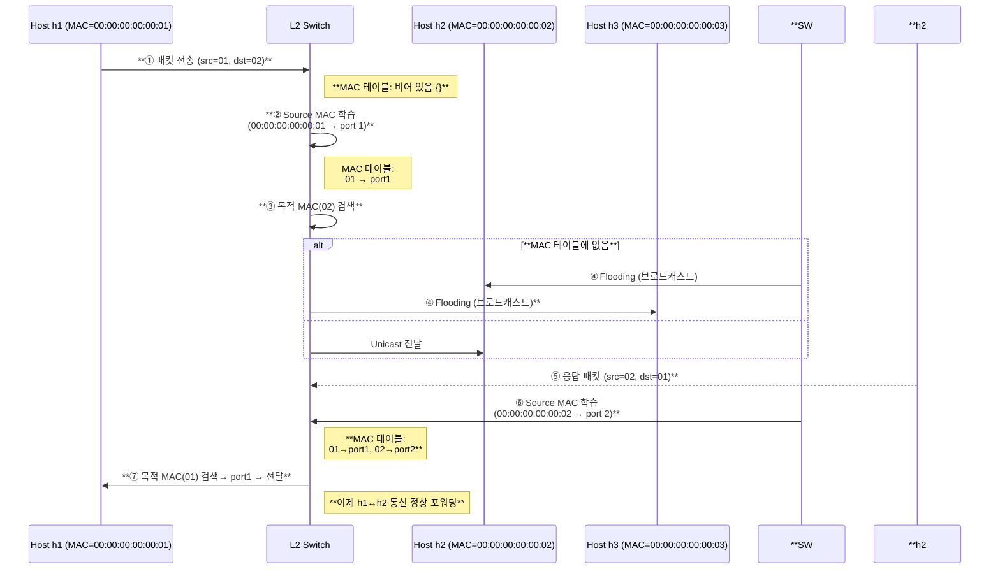
```mermaid
sequenceDiagram
    participant h1 as Host h1 (MAC=00:00:00:00:00:01)
    participant SW as L2 Switch
    participant h2 as Host h2 (MAC=00:00:00:00:00:02)
    participant h3 as Host h3 (MAC=00:00:00:00:00:03)

    h1->>SW: **① 패킷 전송 (src=01, dst=02)**
    Note right of SW: **MAC 테이블: 비어 있음 {}**

    SW->>SW: **② Source MAC 학습<br/>(00:00:00:00:00:01 → port 1)**
    Note right of SW: MAC 테이블:<br/>01 → port1

    SW->>SW: **③ 목적 MAC(02) 검색**
    alt **MAC 테이블에 없음**
        **SW->>h2: ④ Flooding (브로드캐스트)
        SW->>h3: ④ Flooding (브로드캐스트)**
    else
        SW->>h2: Unicast 전달
    end

    **h2-->>SW: ⑤ 응답 패킷 (src=02, dst=01)**
    **SW->>SW: ⑥ Source MAC 학습<br/>(00:00:00:00:00:02 → port 2)**
    Note right of SW: **MAC 테이블:<br/>01→port1, 02→port2**

    SW->>h1: **⑦ 목적 MAC(01) 검색→ port1 → 전달**
    Note right of SW: **이제 h1↔h2 통신 정상 포워딩**

```

---

| 단계 | 내용 |
| --- | --- |
| ① | h1이 처음으로 h2에게 패킷을 전송 |
| ② | 스위치는 `src=01`을 보고 MAC 테이블에 학습 |
| ③ | 목적지 `dst=02`가 테이블에 없으므로 Flooding 수행 |
| ④ | 스위치는 모든 포트(h2, h3)에 복사하여 전송 |
| ⑤ | h2가 응답 패킷을 보냄 |
| ⑥ | 스위치는 응답의 Source MAC(02) 학습 |
| ⑦ | 이제 `dst=01`을 찾을 수 있으므로 Unicast로 전송 |

---

- 이후 동작에서 h1↔h2 통신은 **Unicast로 직접 전달**되며 Flooding 발생하지 않음
    - h3는 한 번도 통신하지 않았으므로 `MAC→port` 정보가 없음
        - h3로 가는 첫 패킷은 다시 Flooding

---

## OpenFlow 스위치

- Flood 여부도 **컨트롤러가 지시해야** 함

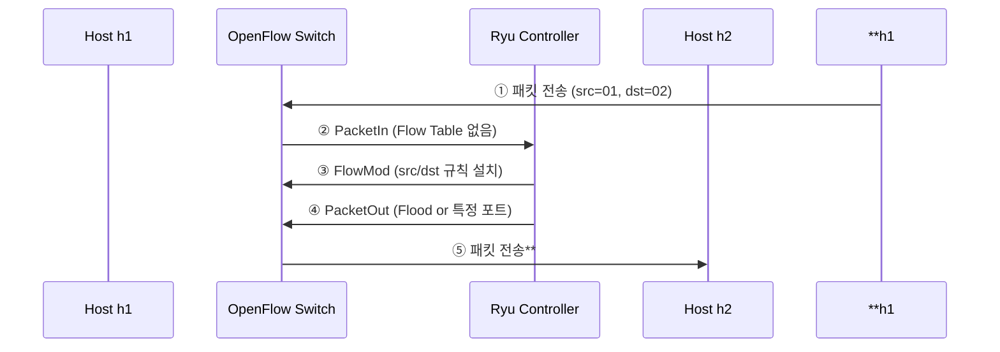
```mermaid
sequenceDiagram
    participant h1 as Host h1
    participant SW as OpenFlow Switch
    participant CTRL as Ryu Controller
    participant h2 as Host h2

    **h1->>SW: ① 패킷 전송 (src=01, dst=02)
    SW->>CTRL: ② PacketIn (Flow Table 없음)
    CTRL->>SW: ③ FlowMod (src/dst 규칙 설치)
    CTRL->>SW: ④ PacketOut (Flood or 특정 포트)
    SW->>h2: ⑤ 패킷 전송**

```

---

- L2 스위치
    - 스스로 학습 + Flooding
- **OpenFlow 스위치**
    - 컨트롤러가 Flow를 내려줘야만 전송 가능

---

## OpenFlow 스위치 + Ryu 컨트롤러 동작 흐름

- 스위치가 처음엔 아무것도 모르는 상태에서 컨트롤러 도움으로 통신을 시작하는 과정

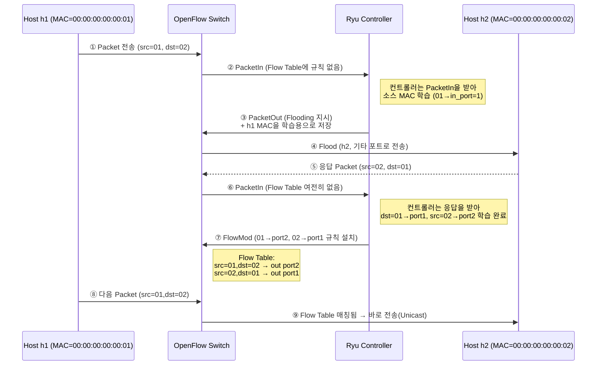
```mermaid
sequenceDiagram
    participant h1 as Host h1 (MAC=00:00:00:00:00:01)
    participant SW as OpenFlow Switch
    participant CTRL as Ryu Controller
    participant h2 as Host h2 (MAC=00:00:00:00:00:02)

    h1->>SW: ① Packet 전송 (src=01, dst=02)
    SW->>CTRL: ② PacketIn (Flow Table에 규칙 없음)
    Note right of CTRL: 컨트롤러는 PacketIn을 받아<br/>소스 MAC 학습 (01→in_port=1)

    CTRL->>SW: ③ PacketOut (Flooding 지시)<br/>+ h1 MAC을 학습용으로 저장
    SW->>h2: ④ Flood (h2, 기타 포트로 전송)

    h2-->>SW: ⑤ 응답 Packet (src=02, dst=01)
    SW->>CTRL: ⑥ PacketIn (Flow Table 여전히 없음)
    Note right of CTRL: 컨트롤러는 응답을 받아<br/>dst=01→port1, src=02→port2 학습 완료

    CTRL->>SW: ⑦ FlowMod (01→port2, 02→port1 규칙 설치)
    Note right of SW: Flow Table:<br/>src=01,dst=02 → out port2<br/>src=02,dst=01 → out port1

    h1->>SW: ⑧ 다음 Packet (src=01,dst=02)
    SW->>h2: ⑨ Flow Table 매칭됨 → 바로 전송(Unicast)

```

---

## 단계

| 단계 | 내용 | 메시지 종류 |
| --- | --- | --- |
| ① | h1이 첫 패킷 전송 | Ethernet Packet |
| ② | 스위치가 규칙을 못 찾아 PacketIn 생성 → 컨트롤러로 전송 | **PacketIn** |
| ③ | 컨트롤러가 Flood용 PacketOut 보냄 | **PacketOut** |
| ④ | 스위치가 모든 포트로 브로드캐스트 (h3가 있으면, h3 까지 포함됨) | 실제 데이터 전송 |
| ⑤ | h2가 응답 전송  (h3가 있으면, h3는 응답하지 않음) | Ethernet Packet |
| ⑥ | 스위치가 다시 PacketIn으로 컨트롤러에 보냄 | **PacketIn** |
| ⑦ | 컨트롤러가 양방향 FlowMod 규칙 설치 | **FlowMod** |
| ⑧ | h1이 다음 패킷 전송 | Ethernet Packet |
| ⑨ | 스위치가 Flow Table 매칭 → 즉시 포워딩 (컨트롤러 관여 없음) | 데이터 패킷 |
- **일반 스위치**
    - 스스로 판단하는 직원
    - 들어오는 손님을 보고 바로 학습 & 안내
- **OpenFlow 스위치**
    - 지시만 따르는 직원
    - 손님이 오면 본사(컨트롤러)에 연락해 “어디로 보내야 하죠?” 묻고, 본사가 “2번 창구로 보내라”라고 알려주면 그때부터 자동 수행

| 구분 | 일반 L2 스위치 | OpenFlow 스위치 |
| --- | --- | --- |
| MAC 학습 위치 | 스위치 자체 | 컨트롤러 (Ryu) |
| Flooding 결정 | 스위치 자동 판단 | 컨트롤러가 PacketOut 명령 |
| Flow 저장 위치 | 스위치 MAC 테이블 | Flow Table (컨트롤러가 설치) |
| 통신 시작 시 | 즉시 Flooding | PacketIn → Controller 의사결정 필요 |
| 통신 이후 | 자체 포워딩 | 설치된 FlowMatch 기반 포워딩 |

## 블록체인 vs SDN(OpenFlow)

- 중앙집중형(OpenFlow, SDN Controller 기반)은 낙후된 기술이 아니라, **용도와 목표가 다름**
    - SDN(OpenFlow)을 배우는 사람들의 핵심 포인트
- 블록체인
    - **분산 신뢰(distributed trust)**를 해결하려는 기술
    - **신뢰 없는 환경에서 분산 합의**
- OpenFlow
    - **네트워크 제어의 중앙집중화(centralized control)**로 **운영 효율성과 자동화**를 극대화하려는 기술
    - **신뢰된 환경에서 중앙 제어**

---

| 구분 | 블록체인 | SDN(OpenFlow) |
| --- | --- | --- |
| 설계 목적 | 신뢰가 없는 노드 간 **합의와 불변성** | 복잡한 네트워크의 **중앙 집중 제어와 자동화** |
| 핵심 철학 | **모두가 복제하고 합의한다 (분산 합의)** | **하나는 생각하고 나머지는 따른다 (중앙 정책)** |
| 데이터 구조 | 트랜잭션 체인 | **플로우 테이블 (Flow Table)** |
| 확장성 | 낮음 (모든 노드가 검증) | 높음 (스위치는 빠르고 단순하게 작동) |
| 속도 | 느림 (합의 필요) | 빠름 (하나의 결정, 전체 반영) |
| 보안 초점 | 데이터 위변조 방지 | 네트워크 제어 정책 강제 및 가시성 |
| 제어 주체 | 모든 참여자 (분산) | 컨트롤러 (중앙) |

## SDN 중앙처리

- 기존 네트워크  문제점
    - 스위치마다 독립적으로 동작
        - **전체 구조를 파악하기 어렵고, 정책 반영이 느림**
    - 대규모 트래픽 제어나 QoS 정책 변경 시
        - **장비별로 수동 설정 필요**
- OpenFlow의 철학
    - 모든 스위치는 단순한 데이터 플레인으로 두고, **모든 정책과 로직은 컨트롤러가 중앙에서 결정**
        - 전체 네트워크를 한눈에 보고 경로 최적화 가능 (global view)
        - 실시간 트래픽 제어, 자동 QoS, 방화벽 정책 자동 반영
        - REST API로 제어 → 프로그래밍 가능한 네트워크(Programmable Network)
- 중앙집중화는 구시대적 구조가 아니라  복잡한 분산 네트워크를 하나의 두뇌처럼 효율적으로 다루기 위한 진화된 형태

---

## 중앙 + 분산 혼합형(Hybrid) 대세

- 현대의 클라우드 네트워크 구조를 보면 완전 중앙집중도 완전 분산도 아님
    - **Kubernetes**
        - **중앙 Control Plane** + 분산 Node
    - **SDN 컨트롤러 (ONOS, OpenDaylight)**
        - **중앙 정책** + **분산 인스턴스 복제**
    - **5G Core Network**
        - 중앙 제어(CU) + 분산 데이터 처리(DU)
    - **클라우드 오케스트레이션 (AWS, Azure)**
        - 전 세계 분산 인프라 + 중앙 정책 관리
- **블록체인식 완전 분산도, 전통식 완전 중앙도 아닌 분산된 중앙집중화(Distributed Centralization)가 현재 트렌드**
    - 중앙집중형 SDN은 낙후된 기술이 아니라, 네트워크 관리의 자동화와 최적화를 위해 꼭 필요한 형태
    - **블록체인식 분산은 신뢰가 없는 환경을 위한 구조이고, SDN은 신뢰된 환경에서 효율을 극대화하려는 구조**

| 항목 | 블록체인 | SDN (OpenFlow) |
| --- | --- | --- |
| 목표 | 탈중앙, 신뢰없는 합의 | 중앙제어, 정책 일관성 |
| 대표 구조 | Peer-to-peer | Controller ↔ Switch |
| 강점 | 투명성, 신뢰성 | 속도, 효율성, 자동화 |
| 한계 | 느림, 복잡함 | 단일 장애 지점(SPOF) 위험 |
| 진화 방향 | 성능 개선 (Layer2 scaling) | 컨트롤러 분산화 (Cluster SDN) |

---

## **중앙집중형 SDN(OpenFlow)에서 분산 아키텍처(클러스터형)으로** 발전

- 한 대의 컨트롤러가 다운되면 전체가 멈춘다는 단점을 해결한 구조.

## [1] 기본형: 단일 컨트롤러 구조

- **하나의 컨트롤러가 모든 스위치를 제어**
- 구조가 단순하고 이해하기 쉬움
    - 하지만 **컨트롤러 다운 시 전체 네트워크 장애 발생 (Single Point of Failure, SPOF)**

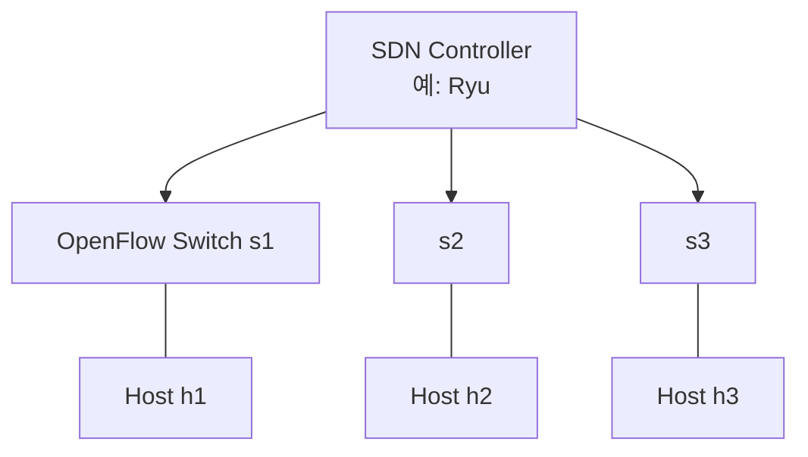
```mermaid
flowchart TD
    A[SDN Controller<br/>예: Ryu] --> B1[OpenFlow Switch s1]
    A --> B2[s2]
    A --> B3[s3]
    B1 --- h1[Host h1]
    B2 --- h2[Host h2]
    B3 --- h3[Host h3]

```

## [2] 확장형: 분산 SDN 컨트롤러 클러스터 구조

- **여러 컨트롤러가 서로 동기화(State Sync)**
- **하나가 Master, 나머지는 Standby/Replica**
    - **어떤 컨트롤러가 죽어도 다른 컨트롤러가 즉시 인계 (Failover)**
- **스위치는 보통 컨트롤러 목록(controller list)을 가지고 있고, 자동으로 연결 가능한 컨트롤러로 재접속**

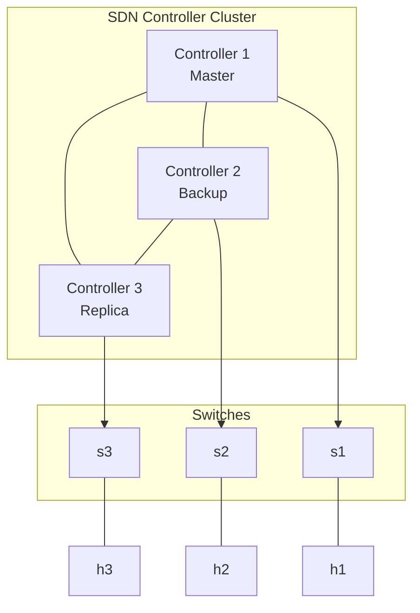
```mermaid
flowchart TD
    subgraph Controller_Cluster["SDN Controller Cluster"]
        C1[Controller 1<br/>Master]
        C2[Controller 2<br/>Backup]
        C3[Controller 3<br/>Replica]
    end

    subgraph Switches
        S1[s1]
        S2[s2]
        S3[s3]
    end

    C1 --- C2
    C1 --- C3
    C2 --- C3

    C1 --> S1
    C2 --> S2
    C3 --> S3

    S1 --- h1
    S2 --- h2
    S3 --- h3

```

| 플랫폼 | 구조 특징 | 설명 |
| --- | --- | --- |
| **ONOS (Open Network Operating System)** | **Cluster 기반** | 여러 인스턴스가 상태 공유 (Raft 프로토콜 기반) |
| **OpenDaylight (ODL)** | **MD-SAL + Clustering** | 각 노드가 독립 실행, 데이터스토어 동기화 |
| **Ryu (단일형)** | 단일 인스턴스 중심, HA 직접 구현 필요 | 가볍고 실험용으로 최적 |

## 분산 컨트롤러의 내부 동작 (ONOS)

- **컨트롤러 장애에도 네트워크는 지속적으로 동작**

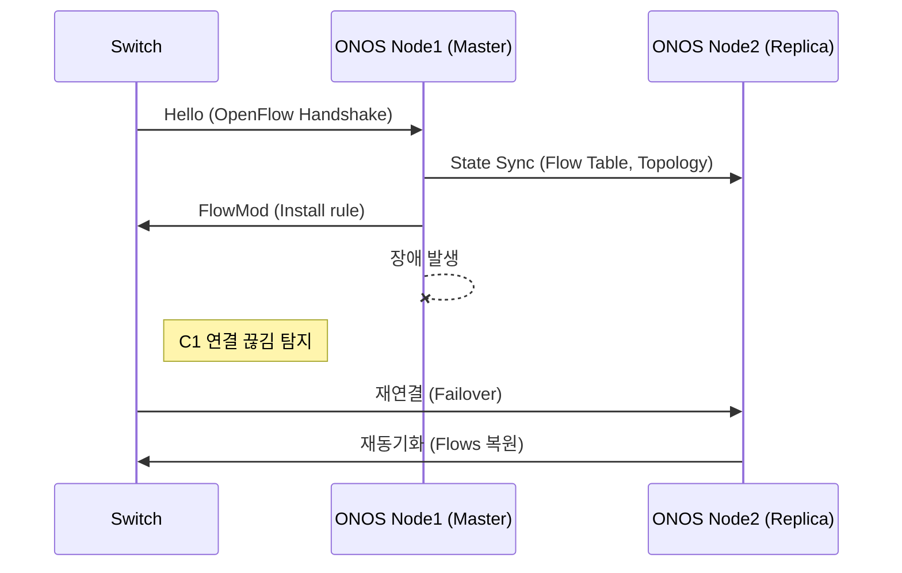
```mermaid
sequenceDiagram
    participant s1 as Switch
    participant C1 as ONOS Node1 (Master)
    participant C2 as ONOS Node2 (Replica)

    s1->>C1: Hello (OpenFlow Handshake)
    C1->>C2: State Sync (Flow Table, Topology)
    C1->>s1: FlowMod (Install rule)
    C1--xC1: 장애 발생 
    Note right of s1: C1 연결 끊김 탐지
    s1->>C2: 재연결 (Failover)
    C2->>s1: 재동기화 (Flows 복원)

```

---

- 블록체인이 데이터 신뢰를 위한 분산 합의라면, SDN 클러스터는 **제어 신뢰성을 위한 분산 제어**에 초점을 둔 진화형 구조
- 현대 SDN은 중앙집중형 철학을 유지하되, **물리적 구현은 분산(fault-tolerant) 구조로 진화한 형태**

| 구분 | 단일 컨트롤러 | 분산 클러스터 (ONOS/ODL) |
| --- | --- | --- |
| 구성 | 1개 | 여러 개 (Master + Replica) |
| 장애 내성 | 낮음 | 높음 (자동 Failover) |
| 확장성 | 낮음 | 높음 (스위치 수 늘려도 분산처리) |
| 데이터 일관성 | 단일 상태 | 클러스터 간 상태 동기화 |
| 성능 | 빠르지만 위험 | 안정적이고 고가용성 |

---

## **확장형: 분산 SDN 컨트롤러 클러스터 구조**

- 여러 개의 컨트롤러가 있지만, **스위치 입장에서는 마치 하나의 거대한 컨트롤러처럼 보이는 구조**
- **클러스터형 SDN 컨트롤러(Controller Cluster)**라고 부름
    - ONOS, OpenDaylight, OpenKilda, Tungsten Fabric 등이 있음

---

## 구조

### 각 컨트롤러의 역할

- **Master Controller**
    - 특정 스위치의 주 제어권을 가짐
    - **Flow 설치/삭제 가능**
- **Backup (Standby) Controller**
    - 동일 스위치의 상태를 실시간 복제 받음
    - Master 장애 시 즉시 인계받음
- **Replica (Read-only) Controller**
    - 네트워크 전체 상태를 조회하거나 로깅 용도로 사용
- **각 스위치마다 하나의 Master 컨트롤러가 배**정되고, 클러스터 내부에서는 **상태 동기화(State Synchronization)** 가 이루어짐

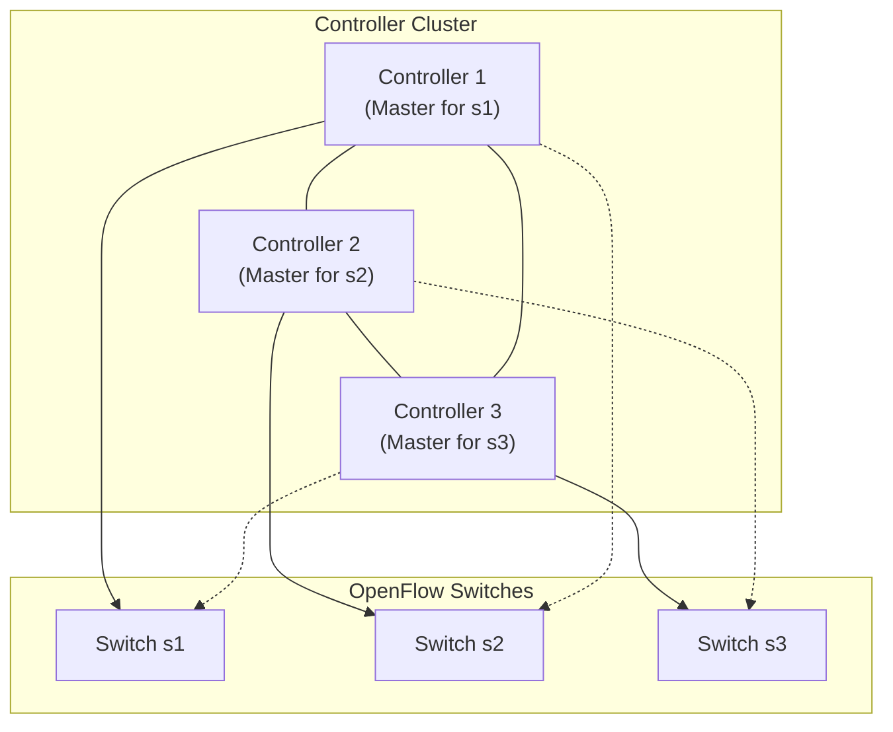
```mermaid
flowchart TD
    subgraph Cluster["Controller Cluster"]
        C1["Controller 1<br/>(Master for s1)"]
        C2["Controller 2<br/>(Master for s2)"]
        C3["Controller 3<br/>(Master for s3)"]
        C1 --- C2
        C2 --- C3
        C3 --- C1
    end

    subgraph Network["OpenFlow Switches"]
        S1["Switch s1"]
        S2["Switch s2"]
        S3["Switch s3"]
    end

    C1 --> S1  
    C2 --> S2
    C3 --> S3
    C1 -.-> S2
    C2 -.-> S3
    C3 -.-> S1

```

---

## 클러스터 내부 동작 원리

### 분산 데이터 저장소 (Distributed Store)

- 모든 컨트롤러는 **공유 데이터 저장소**를 이용해 동일한 네트워크 상태를 유지
- **ONOS는 Raft Consensus Algorithm** 을 사용해 일관성을 보장
    - 컨트롤러 간에는 “누가 Master냐”보다 “모두가 동일한 정보를 갖고 있다”가 더 중요

```
Controller 1: s1의 포트 상태 변경 감지
→ Cluster Store에 반영
→ Raft를 통해 C2, C3에 복제
→ 모든 노드의 Topology Map 일관 유지

```

### Mastership 할당 (Master Election)

- 각 스위치(s1, s2, s3)는 여러 컨트롤러와 연결되어 있지만, 실제 Flow 설치 명령은 **단 하나의 Master Controller** 만 수행
- 나머지 컨트롤러는 Standby 상태로 대기하다가 Master가 죽으면 자동 승격

```
**s1 → C1(Master), C2(Backup), C3(Replica)**
s2 → C2(Master), C1(Backup), C3(Replica)
s3 → C3(Master), C2(Backup), C1(Replica)

```

---

### 상태 동기화 (State Synchronization)

- 각 컨트롤러는 **Topology (링크, 포트, 스위치), Intents (정책)**, **Flows**, **Hosts** 정보를 주기적으로 동기화
- 이를 통해 어떤 노드가 장애나도 전체 네트워크 정책은 일관성을 유지

---

### 장애 처리 (Failover)

- 스위치가 자동으로 **다른 컨트롤러로 연결 전환 (Failover)**
    - 복구 후에도 **Flow Table, 정책 정보 복원 가능**

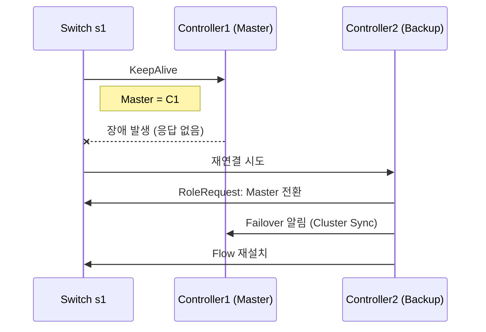
```mermaid
sequenceDiagram
    participant S as Switch s1
    participant C1 as Controller1 (Master)
    participant C2 as Controller2 (Backup)

    S->>C1: KeepAlive
    Note right of S: Master = C1
    C1--xS: 장애 발생  (응답 없음)
    S->>C2: 재연결 시도
    C2->>S: RoleRequest: Master 전환
    C2->>C1: Failover 알림 (Cluster Sync)
    C2->>S: Flow 재설치

```

---

## 장점

| 항목 | 설명 |
| --- | --- |
| 고가용성 (High Availability) | 한 컨트롤러 다운돼도 나머지가 즉시 대체 |
| 확장성 (Scalability) | 컨트롤러 노드 수를 늘려 대규모 네트워크 제어 가능 |
| 일관성 (Consistency) | Raft, Hazelcast 등 분산 합의로 상태 일관 유지 |
| 부하분산 (Load Balancing) | 스위치 그룹별로 다른 컨트롤러가 담당 |
| 중앙정책 유지 | 관리자는 여전히 단일 논리적 컨트롤러처럼 제어 가능 |

## 단점 / 고려사항

| 항목 | 설명 |
| --- | --- |
| 복잡성 증가 | 컨트롤러 간 통신, 상태 복제, 클러스터 관리 필요 |
| 지연(Latency) | Raft 합의 과정에서 약간의 지연 발생 |
| 동기화 실패 | 일부 노드의 상태 불일치 시 정책 충돌 가능 |
| 구성 비용 | 클러스터용 서버 및 네트워크 리소스 증가 |

---

## ONOS 클러스터 내부 구성

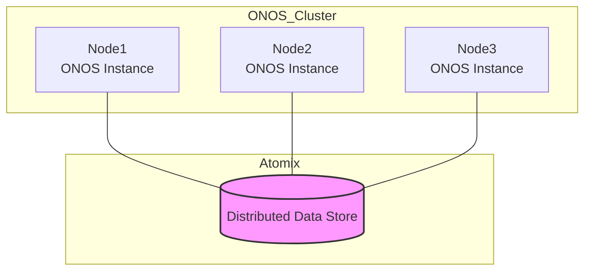
```mermaid
flowchart TD
    subgraph ONOS_Cluster
        N1[Node1<br/>ONOS Instance]
        N2[Node2<br/>ONOS Instance]
        N3[Node3<br/>ONOS Instance]
    end
    subgraph Atomix
        DS1[(Distributed Data Store)]
    end
    N1 --- DS1
    N2 --- DS1
    N3 --- DS1
    DS1:::dbstyle

    classDef dbstyle fill:#f9f,stroke:#333,stroke-width:2px;

```

### 구성요소

| 구성요소 | 역할 |
| --- | --- |
| **Atomix Store** | Raft 기반 분산 데이터 저장소 |
| **Leadership Service** | Mastership 관리 |
| **Cluster Messaging** | 컨트롤러 간 동기화 통신 |
| **Intent Framework** | 정책 기반 경로 제어 |
| **Topology Provider** | 링크/호스트 상태 감시 |

---

- 현대 SDN은 단순한 중앙집중형이 아니라 **중앙정책 + 분산처리**
    - **Google B4 WAN SDN**
        - 중앙 정책 엔진 + 각 지역 컨트롤러 분산 실행
    - **Facebook Fabric Aggregator**
        - 논리적 중앙 제어 + 수천 개 장비 제어
    - **ONOS / ODL**
        - 실제 통신망 수준의 분산 컨트롤러 클러스터 운영
- 분산 SDN 클러스터는 중앙집중형의 효율성과 분산형의 안정성을 결합한 구조
    - 블록체인처럼 합의를 하고, 중앙처럼 빠르게 제어하는 **하이브리드 제어 시스템**

| 구분 | 단일 컨트롤러 | 분산 컨트롤러 클러스터 |
| --- | --- | --- |
| 가용성 | 낮음 (SPOF) | 높음 (HA) |
| 확장성 | 제한적 | 노드 확장으로 무한 확장 |
| 상태 일관성 | 단일 메모리 | 분산 합의(Raft 등) |
| 제어 방식 | 중앙 집중 | 분산 중앙(Distributed Centralization) |
| 운영 복잡도 | 낮음 | 높음 (관리 도구 필요) |

---

# Google B4

- **B4 : Backbone For Google**
- Google 데이터센터(DC) 간 트래픽을 연결하는 전 세계 규모의 **소프트웨어 정의 광대역 네트워크(WAN)**
- **OpenFlow 기반 중앙 제어형 네트워크가 실제 전 세계 규모에서 어떻게 동작하는지** 보여주는 대표적인 시스템

---

## 목적

- Google은 2010년대 초반, 전 세계 수십 개의 데이터센터를 연결하면서 이런 문제에 직면함
    - 각 링크의 **대역폭 사용률이 매우 낮음**
        - **30~40%**
    - 전통적 라우팅(OSPF/BGP)
        - **정적 정책 기반이라 실제 트래픽 부하 변화에 즉시 반응 불가**
        - 기존 통신사업자(캐리어)의 전송망은 **비용이 비싸고, 유연성이 부족**
    - **대규모 MapReduce / GFS / YouTube 트래픽** 등
        - 내부 트래픽이 급변 → 트래픽 제어가 불가능
- Google은 기존의 IP 라우팅 대신, **OpenFlow 기반의 SDN 중앙 제어형 WAN B4** 구축
    - 우리 데이터센터끼리 연결하는 전용 백본망을 직접 만들자
    - 그리고 그걸 **소프트웨어(즉, SDN)** 로 제어하자!

---

## 구조

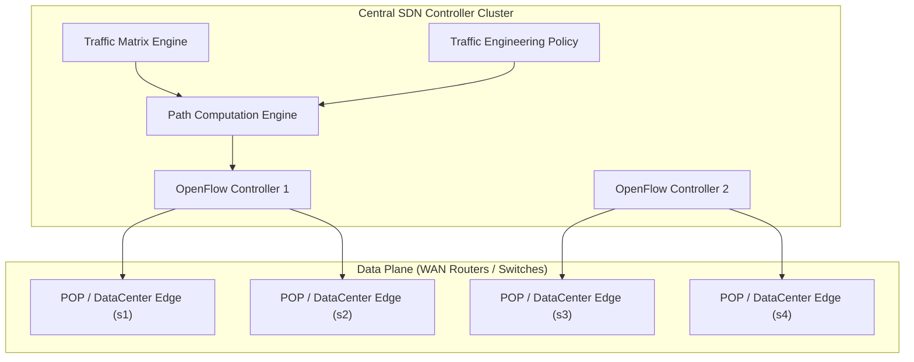
```mermaid
flowchart TD
    subgraph ControlPlane["Central SDN Controller Cluster"]
        PCE["Path Computation Engine"]
        TME["Traffic Matrix Engine"]
        TE["Traffic Engineering Policy"]
        OFC1["OpenFlow Controller 1"]
        OFC2["OpenFlow Controller 2"]
    end

    subgraph DataPlane["Data Plane (WAN Routers / Switches)"]
        S1["POP / DataCenter Edge (s1)"]
        S2["POP / DataCenter Edge (s2)"]
        S3["POP / DataCenter Edge (s3)"]
        S4["POP / DataCenter Edge (s4)"]
    end

    PCE --> OFC1
    TME --> PCE
    TE --> PCE
    OFC1 --> S1
    OFC1 --> S2
    OFC2 --> S3
    OFC2 --> S4

```

---

## 구성 요소

| 구성요소 | 역할 |
| --- | --- |
| **Traffic Engineering Server (TES)** | 중앙 제어기, 전체 링크 상태/부하 모니터링 |
| **Path Computation Engine (PCE)** | 최적 경로 계산 (MPLS 기반), OpenFlow FlowMod 전송 |
| **OpenFlow Agent** | 각 라우터/스위치에 설치된 제어 에이전트 |
| **Global Controller Cluster** | 장애 대비, 분산 동기화 |
| **Traffic Matrix Engine (TME)** | 트래픽 수요(Traffic Demand Matrix)를 분석해 최적화 |
| **B4 Switches** | 상용 화이트박스 스위치 + OpenFlow Agent 내장 |

---

## 동작 과정

### Step 1. 네트워크 상태 수집

- 각 스위치/링크가 주기적으로 **대역폭, 지연, 패킷 손실 정보**를 컨트롤러에 보고
- 컨트롤러는 이를 종합해 **네트워크 전체 상태 그래프**를 생성

### Step 2. Traffic Matrix 분석

- TME가 Google 내부 시스템(GFS, YouTube, BigTable 등)의 트래픽 요청을 모니터링
- 서비스 단위로 어느 데이터센터 간 얼마나 필요한가를 분석 (Demand Matrix)

### Step 3. 최적 경로 계산 (Centralized Path Computation)

- PCE가 수집한 상태/수요 정보를 이용해 **전체 네트워크 용량 최적화 문제** 해결
    - Linear Optimization / MaxFlow 등 알고리즘 사용
    - 한 링크가 혼잡하면 트래픽을 다른 경로로 재배치 (Re-route)

### Step 4. Flow Rule 설치

- **PCE → OpenFlow Controller → 각 스위치로 FlowMod 명령 전송**
- **각 스위치는 새로운 Forwarding Table을 반영하여 트래픽을 즉시 전환**

### Step 5. 실시간 재조정 (Re-optimization)

- 몇 초 단위로 상태를 재평가
- 링크 장애, 트래픽 급변 시 자동 재계산 (≈ 5초 이내 반응)

---

## 트래픽 제어 방식

- Google B4는 **애플리케이션 기반 트래픽 우선순위 제어**
- 전체 네트워크가 **Google 애플리케이션의 우선순위 정책**을 따라 유연하게 재조정

| 트래픽 유형 | QoS 우선순위 | 동작 |
| --- | --- | --- |
| 사용자 요청 (Gmail, YouTube) | 최고 | 항상 우선 라우팅 |
| 백엔드 복제 트래픽 (GFS, MapReduce 등) | 중간 | 여유 대역폭만 사용 |
| 백그라운드 백업 트래픽 | 낮음 | 유휴 시간대만 전송 |

## 기술

| 영역 | 설명 |
| --- | --- |
| **OpenFlow** | 스위치에 직접 Flow Table 설치/삭제 |
| **SDN Controller** | 중앙 제어형 TE 알고리즘 수행 |
| **MPLS 기반 Fast Reroute** | 링크 장애 시 몇 ms 이내 백업 경로로 전환 |
| **Global View** | 모든 링크·스위치 상태를 중앙에서 관찰 |
| **Flow Aggregation** | 수많은 TCP 플로우를 서비스별 Aggregate Flow로 관리 |
| **Cluster Controller** | 장애 복구 및 확장성 확보 |

## 성능 및 효과

| 항목 | 기존 (BGP/OSPF) | B4 SDN 이후 |
| --- | --- | --- |
| 대역폭 활용률 | **약 30~40%** | **90% 이상** |
| 경로 재구성 시간 | 분 단위 | 초 단위 (≈ 5초) |
| 장애 복구 시간 | 수 초~분 | 밀리초 단위 |
| 정책 변경 | 수동 CLI | 중앙 API (자동화) |
| 전체 관리 | 장비별 독립 제어 | 중앙 집중 + 자동화 |

## 안정성 확보 (Controller Cluster)

- B4는 단일 컨트롤러가 아니라, **여러 개의 컨트롤러 클러스터**를 지역별로 배치
    - **장애 복원력(Failover)** 과 **지리적 분산 제어** 보장
    - WAN 전체가 단일 장애에 멈추지 않음

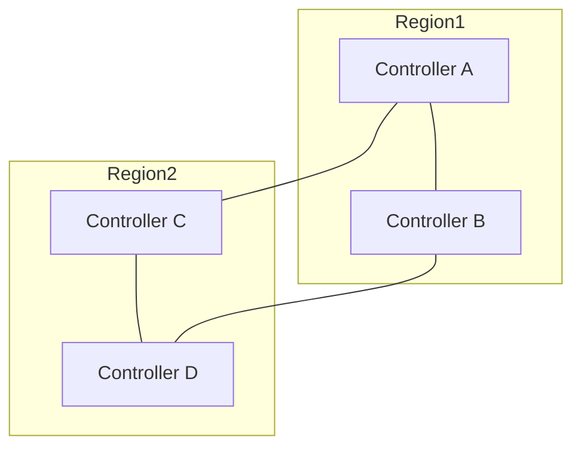
```mermaid
flowchart TD
    subgraph Region1
        R1C1[Controller A]
        R1C2[Controller B]
    end
    subgraph Region2
        R2C1[Controller C]
        R2C2[Controller D]
    end
    R1C1 --- R1C2
    R2C1 --- R2C2
    R1C1 --- R2C1
    R1C2 --- R2C2

```

---

## 개발 및 운영 방식

- **제어 알고리즘**
    - **Python + C++ 기반 내부 프레임워크**
- **스위치**
    - **상용 화이트박스 장비 (OpenFlow 1.3 호환)**
- **테스트/디플로이 자동화**
    - Borg/Kubernetes 기반
- **정책 제어 REST API** 제공
    - 네트워크를 코드로 관리(Infrastructure as Code) 실현

---

## 핵심 철학

- 네트워크는 더 이상 하드웨어가 아니다.
    - 정책에 따라 **소프트웨어적으로 제어 가능한 리소스**다
    - Google B4는 SDN의 교과서적인 철학을 실제로 구현한 사례

---

## 참고 논문

- *B4: Experience with a Globally-Deployed Software Defined WAN* (Sigcomm 2013, by Google)
    - 저자
        - Sushant Jain, Alok Kumar, et al.
    - 핵심
        - OpenFlow 기반 TE
        - 중앙 제어식 최적화
        - 트래픽 우선순위 기반
        - 자원 스케줄링 90% 이상 링크 활용률

---

| 키워드 | 설명 |
| --- | --- |
| **B4 = 세계 최초 글로벌 SDN WAN** | 전 세계 데이터센터를 하나의 네트워크처럼 제어 |
| **OpenFlow 활용** | 실제 트래픽 제어 명령 수행 |
| **중앙 TE 알고리즘** | 네트워크 전체 최적화 |
| **정책 기반 제어 (Intent-Based)** | 애플리케이션 중요도별로 트래픽 관리 |
| **실시간 최적화** | 트래픽 변화·장애에 수 초 내 재조정 |
| **하이브리드 구조** | 중앙정책 + 분산 컨트롤러 조합 |

# Google B4 Traffic Engineering

- B4의 핵심은 네트워크 전체를 중앙에서 최적화 하는 것.
    - 각 링크의 대역폭과 트래픽 수요를 수학적으로 모델링
    - 최대 효율을 내도록 **Flow를 계산 → 스위치에 FlowMod로 전송**
    - **Traffic Engineering (TE) 알고리즘**과 그 결과가 **OpenFlow FlowMod** 로 어떻게 스위치에 반영되는 지 확인

---

## 입력 데이터

| 입력 항목 | 설명 |
| --- | --- |
| **Topology Graph** `G(V, E)` | 노드(V): 스위치/라우터, 링크(E): 경로 |
| **Capacity(e)** | 각 링크 e의 대역폭 (예: 10 Gbps) |
| **Traffic Demand Matrix (D)** | (출발, 목적지, 요구 대역폭)의 집합 |
| **Priority Class (P)** | 서비스 우선순위 (예: YouTube > Backup) |
- 시나리오

| Source | Destination | Demand (Gbps) | Priority |
| --- | --- | --- | --- |
| DC1 | DC2 | 8 | High |
| DC1 | DC3 | 5 | Medium |
| DC2 | DC3 | 2 | Low |

---

## 수학적 모델 (TE Optimization)

- TE를 **선형계획법(Linear Programming, LP)** 문제로 변환

### 목적 함수

- 네트워크 전체의 링크 활용 효율 극대화
    
    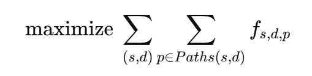
    

### 제약식

- **링크 용량 제한**
    - 어떤 링크 e의 총 트래픽은 용량 C(e)를 초과할 수 없음
    
    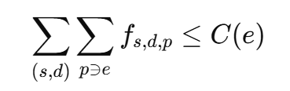
    
- **트래픽 보존 (Flow Conservation)**
    - 모든 경로에 분배된 총량은 수요 D와 같아야 함

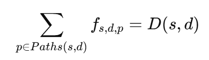

- **우선순위 가중치**
    
    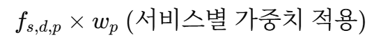
    
- **Fairness (Max-Min 공정성)**
    - **링크 용량을 넘지 않으면서, 각 서비스별로 가능한 한 공정하게 트래픽을 분배**합니다.
    
    
    

---

## 경로 계산 (Path Computation Engine)

- PCE가 LP의 결과를 기반으로 실제 경로를 선택
- 이 정보를 기반으로 PCE는 **Flow Entry (match + action)** 를 생성

```
DC1 → DC2: **경로1(s1-s2-s4) 5Gbps, 경로2(s1-s3-s4) 3Gbps**
DC1 → DC3: 경로1(s1-s3) 5Gbps

```

---

## Flow Rule 생성 (OpenFlow FlowMod)

- 컨트롤러는 계산된 경로를 각 스위치에 다음처럼 전달
    - 각 스위치마다 이 FlowMod가 전송되어 경로가 구성

```python
# 예시 OpenFlow 명령 구조
OFPFlowMod(
    match = OFPMatch(eth_src="DC1_MAC", eth_dst="DC2_MAC"),
    actions = [OFPActionOutput(port=3)],
    priority = 100,
    cookie = 0xB4TE,
    idle_timeout = 0,
    hard_timeout = 0
)

```

---

## 동적 재최적화 과정

- B4는 초당~수초 단위로 전체 네트워크를 모니터링하고 다음과 같은 **루프**를 수행
- 장애 발생, 트래픽 폭증 시에도 자동으로, **최적화 → Flow 갱신 → 재배치 (re-routing)** 가 일어.

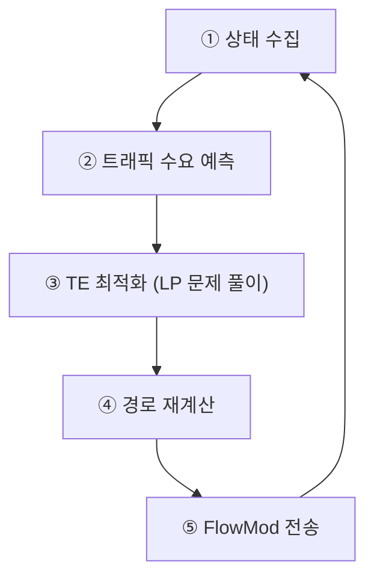
```mermaid
flowchart TD
    A["① 상태 수집"] --> B["② 트래픽 수요 예측"]
    B --> C["③ TE 최적화 (LP 문제 풀이)"]
    C --> D["④ 경로 재계산"]
    D --> E["⑤ FlowMod 전송"]
    E --> A

```

---

## 장애 시 시퀀스 다이어그램

- **실제 반응 속도**
    - 약 1~5초
- 링크 장애 시 기존 TCP 연결이 거의 끊기지 않음

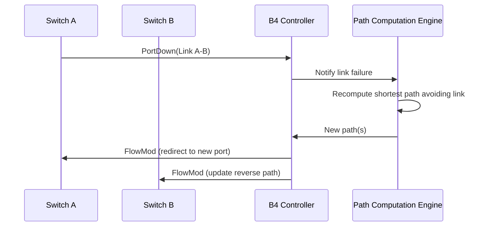
```mermaid
sequenceDiagram
    participant S1 as Switch A
    participant S2 as Switch B
    participant C as B4 Controller
    participant P as Path Computation Engine

    S1->>C: PortDown(Link A-B)
    C->>P: Notify link failure
    P->>P: Recompute shortest path avoiding link
    P->>C: New path(s)
    C->>S1: FlowMod (redirect to new port)
    C->>S2: FlowMod (update reverse path)

```

---

## 트래픽 우선순위 (QoS 기반 Scheduling)

- B4는 트래픽을 서비스 클래스별로 구분
    - 네트워크가 사람 중심이 아닌 서비스 중심으로 동작

| Class | 서비스 (예시) | 제어 방식 |
| --- | --- | --- |
| High Priority | Gmail, YouTube, Search | 절대 우선 할당 |
| Medium | GFS, Bigtable Sync | 남는 대역폭 사용 |
| Low | Backup, Batch Jobs | Background 전송만 허용 |

---

## 실제 OpenFlow 명령 전달 구조

- 각 Switch는 **OpenFlow Channel (TCP 6633/6653)** 을 통해 Controller와 연결
    - Controller는 **Barrier Message** 로 Flow 적용 완료 확인
    - 주기적으로 **Stats Request/Reply** 로 트래픽 실시간 모니터링

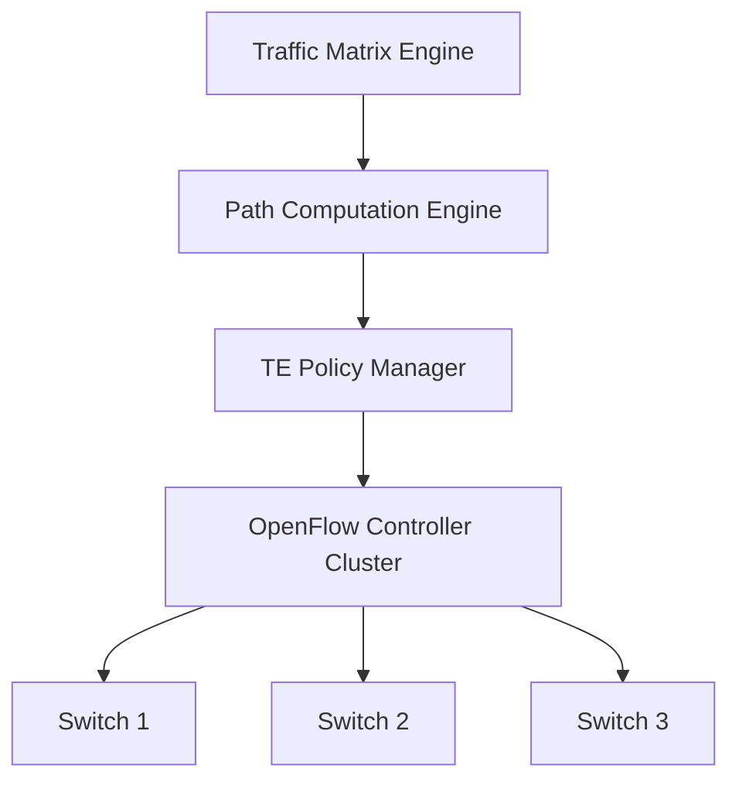
```mermaid
flowchart TD
    TME["Traffic Matrix Engine"] --> PCE["Path Computation Engine"]
    PCE --> TE["TE Policy Manager"]
    TE --> CTRL["OpenFlow Controller Cluster"]
    CTRL --> SW1["Switch 1"]
    CTRL --> SW2["Switch 2"]
    CTRL --> SW3["Switch 3"]

```

---

## 성능

- B4는 중앙집중형 SDN의 이상형
    - **모든 네트워크를 하나의 거대한 컴퓨터처럼 제어**
        - 제어(Logic): 중앙 클러스터
        - 데이터 처리(Data Plane): 분산 스위치
        - 정책 반영(Automation): 수학적 최적화
        - 결과 반영(FlowMod): OpenFlow

| 지표 | 전통적 네트워크 | Google B4 SDN |
| --- | --- | --- |
| 평균 링크 활용률 | 40% | 90%+ |
| 장애 복구 시간 | 수초~분 | < 1초 |
| 정책 변경 반영 | 수동 (CLI) | 자동 (API + 알고리즘) |
| 트래픽 우선순위 제어 | 불가능 | 서비스별 QoS 가능 |
| 전체 관리 비용 | 높음 | 자동화로 대폭 절감 |

---

## 다이어그램

- 이 루프가 실시간으로 돌면서 네트워크가 끊임없이 **자기 최적화(Self-Optimizing)**

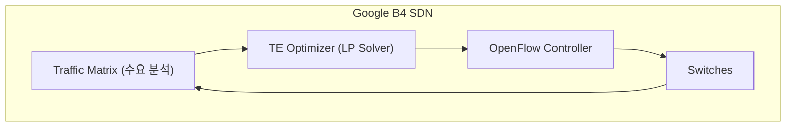
```mermaid
flowchart TD
    subgraph Google B4 SDN
        TM["Traffic Matrix (수요 분석)"]
        OPT["TE Optimizer (LP Solver)"]
        OFC["OpenFlow Controller"]
        SW["Switches"]
    end
    TM --> OPT
    OPT --> OFC
    OFC --> SW
    SW --> TM

```

---

# 컨트롤러 장애(Failover) 시나리오

- **B4식 SDN 분산 컨트롤러 환경에서의 Failover 시나리오**와 **무중단(일관성 유지) 2-단계 플로우 업데이트(Two-phase / Versioned Update)**

## 1-1. Master 컨트롤러 장애 → Standby 승격 (Mastership 전환)

- 스위치는 컨트롤러 리스트(여러 IP) 보유
- OF 1.3의 **Role(ROLE_MASTER / ROLE_SLAVE)** 사용
- Keepalive/echo 타임아웃으로 Master 불능 감지
    - Standby가 Master로 승격
- 운영 포인트
    - **Echo/Hello 타임아웃**을 과도하게 짧게 하지 말 것(불필요한 플랩 방지)
    - 승격 시 **Barrier** 로 적용 완료 확인 후 통계 수집 재개
    - 북반구/남반구 등 지연 높은 구간은 **지역별 컨트롤러** 우선

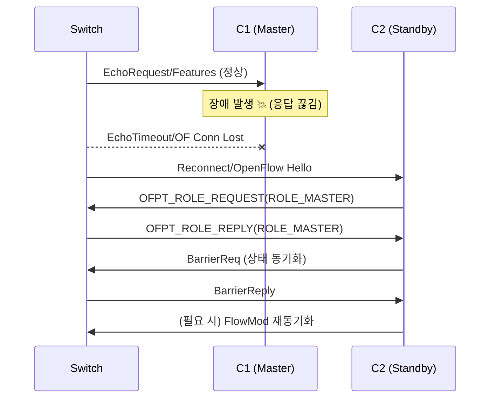
```mermaid
sequenceDiagram
    participant SW as Switch
    participant C1 as C1 (Master)
    participant C2 as C2 (Standby)

    SW->>C1: EchoRequest/Features (정상)
    Note over C1: 장애 발생 💥 (응답 끊김)
    SW--xC1: EchoTimeout/OF Conn Lost
    SW->>C2: Reconnect/OpenFlow Hello
    C2->>SW: OFPT_ROLE_REQUEST(ROLE_MASTER)
    SW->>C2: OFPT_ROLE_REPLY(ROLE_MASTER)
    C2->>SW: BarrierReq (상태 동기화)
    SW->>C2: BarrierReply
    C2->>SW: (필요 시) FlowMod 재동기화

```

---

## 1-2. 컨트롤러 클러스터 내부 합의(상태 동기화)

- TE 상태(Topology, Intents, 할당량)를 **분산 합의(Raft/Paxos)** 로 관리
- Master 변경 시 **Intent/Flow 상태**를 새로운 Master가 즉시 인계
- 운영 포인트
    - 계산(TE)과 전달(FlowMod)을 분리해 설계하면 복구가 단순해짐
    - State Store에 **커밋된 버전**만 사용(Partial Write 방지)

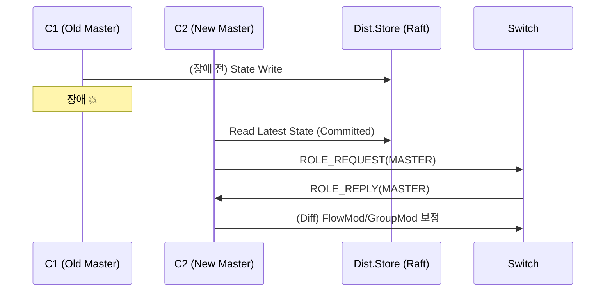
```mermaid
sequenceDiagram
    participant C1 as C1 (Old Master)
    participant C2 as C2 (New Master)
    participant DS as Dist.Store (Raft)
    participant SW as Switch

    C1->>DS: (장애 전) State Write
    Note over C1: 장애 💥
    C2->>DS: Read Latest State (Committed)
    C2->>SW: ROLE_REQUEST(MASTER)
    SW->>C2: ROLE_REPLY(MASTER)
    C2->>SW: (Diff) FlowMod/GroupMod 보정

```

---

# 2) 링크 장애(PortDown) 시나리오

## 2-1. 링크 다운 → 빠른 재라우팅(FRR + 중앙 재최적화)

- 하드웨어 Fast Reroute(ECMP/MPLS FRR)로 **수 ms** 수준의 즉각 대응
    - 이어서 중앙 TE가 **수 초** 이내에 최적화 재실행(혼잡 해소)
- 운영 포인트
    - FRR로 즉각 대응, TE 재계산으로 **Load rebalancing**
    - 장애 링크 복구 시에도 **두 단계(드레이닝→복원)** 로 혼잡 피크 방지.

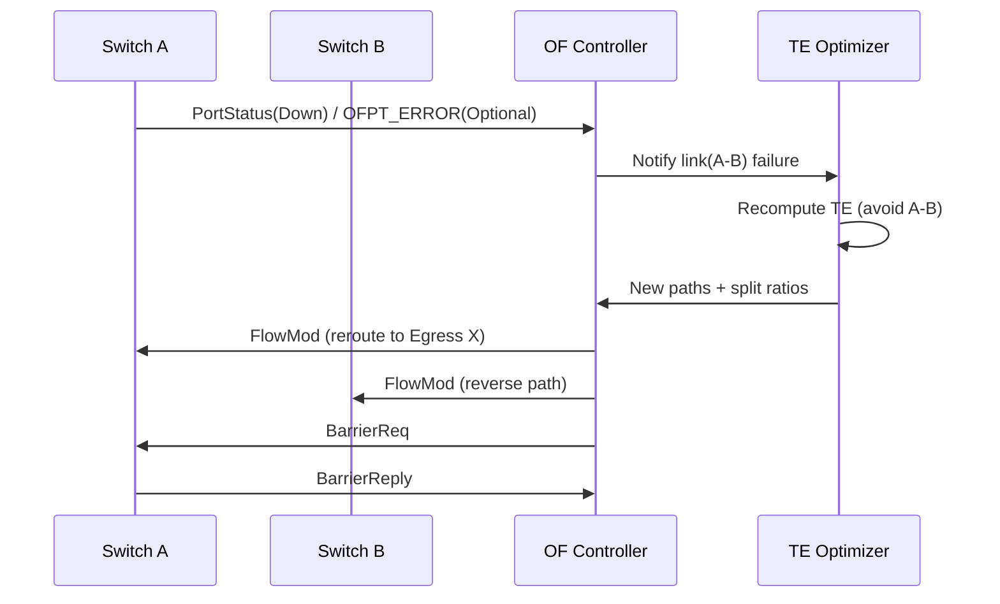
```mermaid
sequenceDiagram
    participant SWA as Switch A
    participant SWB as Switch B
    participant CTRL as OF Controller
    participant PCE as TE Optimizer

    SWA->>CTRL: PortStatus(Down) / OFPT_ERROR(Optional)
    CTRL->>PCE: Notify link(A-B) failure
    PCE->>PCE: Recompute TE (avoid A-B)
    PCE->>CTRL: New paths + split ratios
    CTRL->>SWA: FlowMod (reroute to Egress X)
    CTRL->>SWB: FlowMod (reverse path)
    CTRL->>SWA: BarrierReq
    SWA->>CTRL: BarrierReply

```

---

## Barrier

- **Barrier ACK**(Barrier Acknowledgment)는 OpenFlow 프로토콜에서 **명령 실행의 완료 시점을 보장하기 위해 사용되는 동기화 메커니즘**

| 항목 | 설명 |
| --- | --- |
| 메시지 이름 | `OFPT_BARRIER_REQUEST` / `OFPT_BARRIER_REPLY` |
| 역할 | 컨트롤러 ↔ 스위치 간 **명령 순서 보장 및 완료 확인** |
| 방향 | 컨트롤러 → 스위치 (`BarrierRequest`)  스위치 → 컨트롤러 (`BarrierReply`) |
| 목적 | 이전 FlowMod/PacketOut 명령들이 모두 처리되었는가? 확인 |

---

## 동작 흐름

- BarrierReply를 받았다 = 그 전에 보낸 FlowMod가 스위치에 적용 완료됐다

```
컨트롤러 ----(1) FlowMod(들)...----> 스위치
컨트롤러 ----(2) BarrierRequest----> 스위치
스위치 ----(3) BarrierReply----> 컨트롤러

```

- 여러 개의 `FlowMod` 명령을 보낸 후,
- `BarrierRequest` 를 보내면,
- 스위치는 **모든 이전 메시지를 처리 완료한 뒤** `BarrierReply` 를 반환

## Ryu Controller 예

```python
# 모든 FlowMod가 실제로 적용되었는지 확인
parser = dp.ofproto_parser
ofp = dp.ofproto

dp.send_msg(parser.OFPBarrierRequest(dp))
self.logger.info("Barrier Request sent")

# 이후 이벤트 핸들러
@set_ev_cls(ofp_event.EventOFPBarrierReply, MAIN_DISPATCHER)
def barrier_reply_handler(self, ev):
    self.logger.info("Barrier ACK received from dpid=%s", ev.msg.datapath.id)

```

---

## Barrier의 필요성

- 여러 FlowMod는 택배 상자처럼 순차 발송됨
    - BarrierRequest는 배송 다 끝났습니까? 물어보는 신호임
    - BarrierReply는 모두 배송 완료되었습니다. 라는 확인서임
- 컨트롤러는 플로우가 다 설치됐는지 확실히 알고 다음 단계(예: 경로 스위칭, 삭제)를 수행할 수 있음

| 상황 | Barrier의 필요성 |
| --- | --- |
| **두 단계 업데이트(2-phase)** | 새 플로우가 적용된 뒤에만 트래픽을 전환해야 함 |
| **페일오버 복구** | 동기화 완료 후만 Role Master 전환 |
| **대량 Flow 배포** | 일부만 설치된 중간 상태 방지 |
| **테스트/디버깅** | 명령 순서를 확정적으로 제어 가능 |

---

# 3) 스위치 장애/재시작 시나리오

- 스위치 복구 시 컨트롤러는 **FeaturesReply** 수신 후 **역방향 동기화**로 플로우 재설치
- 대규모 스위치 동시 재시작(전원 장애 등) 시 **Rate Limit** 로 Flow 폭주 방지.
- 운영 포인트
    - **Batch/Chunk** 로 플로우 배포, 초당 명령량 제한(OVS/ASIC 보호).
    - 테이블 미스/기본 규칙부터 재설치 후 서비스 규칙 순.

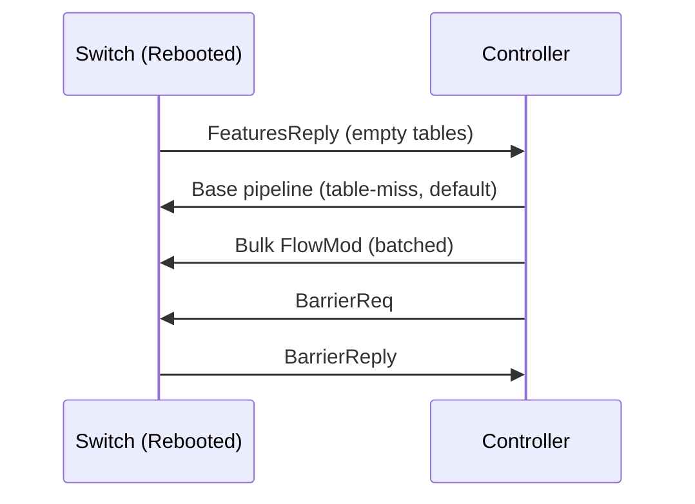
```mermaid
sequenceDiagram
    participant SW as Switch (Rebooted)
    participant CTRL as Controller
    SW->>CTRL: FeaturesReply (empty tables)
    CTRL->>SW: Base pipeline (table-miss, default)
    CTRL->>SW: Bulk FlowMod (batched)
    CTRL->>SW: BarrierReq
    SW->>CTRL: BarrierReply

```

---

# 4) 무중단 2-단계 플로우 업데이트(Two-phase / Versioned Update)

- 문제
    - 경로/정책 변경 시 **루프/블랙홀** 없이 전환해야 함.
- 해결
    - **2단계**: 새 경로 규칙 **사전 설치 → 트래픽 이동 → 구 규칙 제거**
    - **버전 태깅**: 메타데이터/라벨로 구/신 경로 공존

## 4-1. 절차(End→Core→Ingress 순)

- 운영 포인트
    - **Egress→Core→Ingress** 순으로 “설치”, **Ingress→Core→Egress** 순으로 “삭제”.
        - 각 단계마다 **Barrier** 로 적용 보장.
    - 필요 시 **Draining Window**(수 초) 두어 기존 세션 자연 소멸 유도.

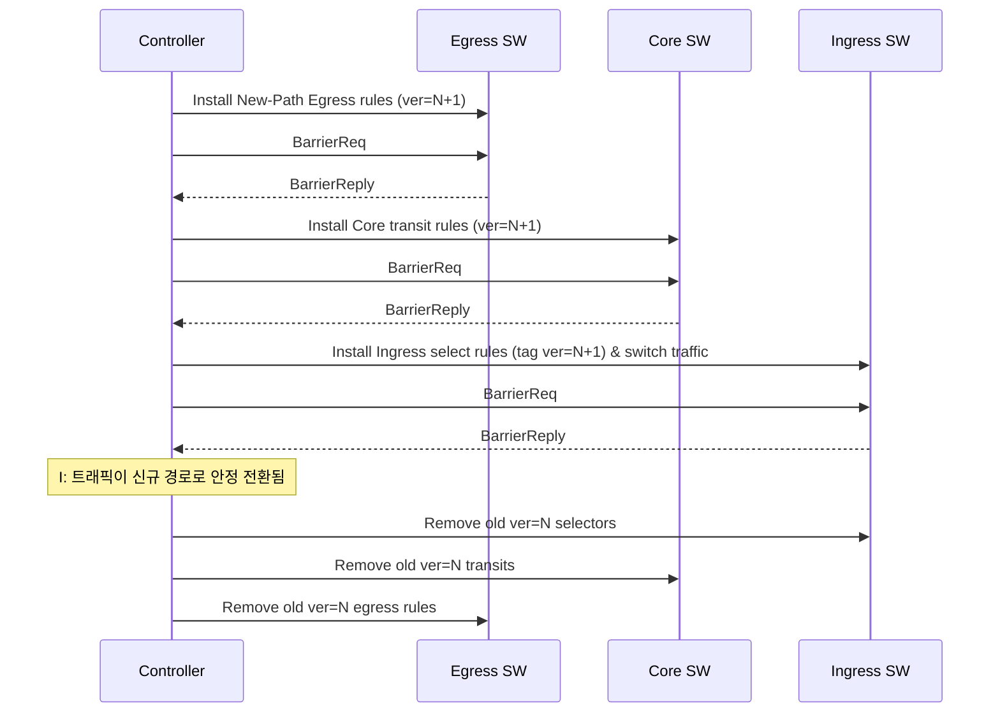
```mermaid
sequenceDiagram
    participant CTRL as Controller
    participant E as Egress SW
    participant C as Core SW
    participant I as Ingress SW

    CTRL->>E: Install New-Path Egress rules (ver=N+1)
    CTRL->>E: BarrierReq
    E-->>CTRL: BarrierReply

    CTRL->>C: Install Core transit rules (ver=N+1)
    CTRL->>C: BarrierReq
    C-->>CTRL: BarrierReply

    CTRL->>I: Install Ingress select rules (tag ver=N+1) & switch traffic
    CTRL->>I: BarrierReq
    I-->>CTRL: BarrierReply

    Note over CTRL:I: 트래픽이 신규 경로로 안정 전환됨

    CTRL->>I: Remove old ver=N selectors
    CTRL->>C: Remove old ver=N transits
    CTRL->>E: Remove old ver=N egress rules

```

## 4-2. 구현 팁(매치/액션 설계)

- **버전 태그**
    - VLAN/MPLS/Metadata(OF1.3 set_field + metadata) 활용
    - 예: `metadata=0xN`(구), `metadata=0xN+1`(신)
- **선택 룰**
    - Ingress에서 DSCP/Label을 새 버전으로 세팅 → 코어는 해당 라벨만 매칭
- **그룹 테이블**(ALL/SELECT)로 **점진적 가중치 전환**(10%→50%→100%)

---

# 5) 검증(Verification) & 롤백(Rollback)

- 검증
    - **FlowConsistent?**
        - 각 홉에 버전 N+1이 모두 존재하는지 확인
    - **Barrier 후 샘플러**
        - sFlow/NetFlow·OF Stats로 신규 경로 유입률 관찰
    - **Health Gate**
        - 지연/손실 임계 초과 시 즉시 롤백
- 롤백
    - 역순으로 구 버전(N) 재활성화 → 신 버전(N+1) 제거
    - **Idempotent 설계**
        - 중복 명령에도 안전(존재하지 않는 항목 삭제 시 무해)

---

# 6) 운영 체크리스트

- 컨트롤러 목록/우선순위, OF Role 설정 확인
- Echo/Hello/Idle 타임아웃 합리적 설정(플랩 방지)
- 배포 순서
    - **설치(E→C→I)** → **스위치오버** → **삭제(I→C→E)**
- 모든 단계 **Barrier** 확인
- 통계 기반 **안전 게이트**(지연/손실/혼잡) 적용
- 대규모 변경은 **가중치 전환**(그룹 SELECT)로 점진 이행
- 재최적화 주기 1–5초, 링크 코스트는 사용률 곡선에 민감도 적용
- 대규모 재시작 대비 **Rate Limit / Batch 배포**

---

## MPLS란

- Google의 **B4(WAN SDN)** 과 **MPLS(Multi-Protocol Label Switching)** 의 관계는 경쟁이 아니라 진화와 재해석입니다.
    - Google은 MPLS의 핵심 개념을 **SDN 방식으로 재구현**
- **MPLS (Multi-Protocol Label Switching)** 는 패킷에 **레이블(label)** 을 붙여서 IP 대신 **고속 포워딩**을 하는 기술
    - 전통적인 IP 라우팅은 **Longest Prefix Match (LPM)** 기반
        - 느리고 복잡
    - MPLS는 **고정 길이 Label** 기반
        - 빠르고, 경로 제어(Traffic Engineering)가 용이

**핵심 구조**

```
Ingress LSR ──▶ Core LSR ──▶ Egress LSR
   (라벨 부착)     (라벨 교체)     (라벨 제거)

```

- MPLS는 주로 통신사업자(ISP) 망에서
    - **QoS 보장**
    - **VPN 서비스**
    - **트래픽 엔지니어링(TE)** 을 위해 사용

---

## Google은 왜 MPLS 대신 SDN (B4)을 선택했는가?

- Google의 WAN(B4)은 **MPLS의 한계를 극복**하려는 시도
- B4
    - MPLS-TE의 SDN화 버전
    - MPLS의 **Label Switching 개념은 유지**, 하지만 제어평면을 **완전히 중앙 집중화**

| 항목 | MPLS (전통) | Google B4 (SDN 기반) |
| --- | --- | --- |
| **제어 구조** | 분산 제어 (각 라우터가 계산) | 중앙 집중 제어 (PCE가 계산) |
| **경로 설정** | RSVP-TE, LDP 등 프로토콜 기반 | OpenFlow 명령으로 직접 설치 |
| **장비 비용** | 고가의 전용 라우터 (Cisco/Juniper) | 화이트박스 스위치 (저가) |
| **운영 정책 변경** | 수동/복잡 | 실시간 소프트웨어 제어 |
| **트래픽 최적화** | 제한적 (지역 기반) | 전역(Global) TE 알고리즘 사용 |
| **API / 자동화** | 거의 없음 | 완전한 프로그래머블 API |

---

## B4의 MPLS 유사 구조

- B4 내부에서는 실제로 다음과 유사한 개념이 사용
    - B4는 MPLS-TE의 철학을 **OpenFlow의 Match-Action 모델**로 옮긴 것

| MPLS 용어 | B4 내부 개념 |
| --- | --- |
| LSP (Label Switched Path) | TE Tunnel / Flow Path |
| RSVP-TE Signaling | PCE → Controller → Switch via OpenFlow |
| Label Stack | FlowMatch + Metadata Field |
| Label Swap | Flow Table Rule Update |
| Path Re-optimization | 2-Phase Update with Barrier (비중단 경로 전환) |

## MPLS와 B4의 제어 흐름 비교

- MPLS는 **각 라우터가 독립적으로 Label Path 계산**
- B4는 **하나의 PCE가 글로벌 최적 경로 계산 후 명령을 푸시**

### MPLS (전통 방식)

```
NMS (관리자)
   │
   ▼
RSVP-TE Signaling
   │
   ▼
라우터 간 분산 계산
   │
   ▼
Label 설치

```

### B4 (SDN 방식)

```
PCE (중앙 Path Computation Element)
   │
   ▼
SDN Controller (OFC Cluster)
   │
   ▼
OpenFlow (FlowMod)
   │
   ▼
스위치(화이트박스)

```

## Google 내부 WAN 구조 (실제 개념)

```
+--------------------------------------------------+
|                PCE / TE 서버 (Central)           |
|    - 글로벌 트래픽 엔지니어링, Path 최적화       |
+-----------------------+--------------------------+
                        |
                        v
+-----------------------+--------------------------+
|        SDN Controller Cluster (B4)               |
|    - Path → Flow rule 변환                       |
|    - OpenFlow 명령 전송 (수천 개 스위치 관리)   |
+-----------------------+--------------------------+
                        |
                        v
+-----------------------+--------------------------+
|        WAN 스위치 (화이트박스, MPLS 유사 구조)   |
|    - Label 대신 OpenFlow Match/Action 사용       |
+--------------------------------------------------+

```

---

## 결론

- Google은 MPLS의 Label Switching 개념은 유지하되, 제어 평면을 완전히 중앙 집중형 SDN으로 재설계
- **MPLS-TE의 소프트웨어 정의 재탄생**이 바로 Google B4

| 구분 | MPLS | Google B4 |
| --- | --- | --- |
| **패킷 식별 방식** | Label | OpenFlow Match |
| **제어평면** | 분산 (라우터 간) | 중앙집중형 SDN |
| **경로제어(TE)** | RSVP-TE | 중앙 PCE 알고리즘 |
| **장비 타입** | 벤더 전용 고가 라우터 | 화이트박스 스위치 |
| **운영방식** | CLI 기반, 수동 | 자동화된 소프트웨어 API |
| **대표 구현체** | Cisco, Juniper | Google B4, ONOS, ODL |

---

### MPLS → Google B4 SDN 진화 구조

```mermaid
timeline
    title MPLS → SDN (B4) Evolution Timeline

    1998 : MPLS 등장 : 고속 라벨 스위칭 / QoS / VPN 지원
    2001 : MPLS-TE (Traffic Engineering) : RSVP-TE 신호 기반 경로제어
    2008 : Google 글로벌 DC 트래픽 급증 : 기존 MPLS의 한계 인식
    2010 : Google B4 프로젝트 착수 : SDN(OpenFlow) 기반 WAN 제어 실험
    2012 : Google B4 프로덕션 적용 : 중앙 PCE + OpenFlow로 경로 제어
    2014 : Traffic Engineering 자동화 완성 : 전역 경로 최적화 알고리즘
    2016 : Controller Cluster 도입 : 분산 SDN 컨트롤러로 확장성 확보
    2020~ : B4 + Jupiter Fabric 통합 : Google Cloud 백본의 핵심 인프라로 발전

```

---

### MPLS vs B4 구조 비교

```mermaid
flowchart LR
    subgraph MPLS["전통 MPLS 구조 (분산 제어)"]
        NMS["NMS / Operator"]
        R1["Ingress LSR\n(Label 붙임)"]
        R2["Core LSR\n(Label 교체)"]
        R3["Egress LSR\n(Label 제거)"]
        NMS -->|RSVP-TE / LDP| R1
        R1 --> R2 --> R3
    end

    subgraph B4["Google B4 구조 (중앙 SDN 제어)"]
        PCE["PCE (Path Computation Element)\n- 글로벌 TE 계산"]
        CTRL["SDN Controller Cluster\n(OpenFlow / Raft)"]
        SW1["Ingress Switch\n(tag: metadata=ver)"]
        SW2["Core Switch\n(flow update)"]
        SW3["Egress Switch\n(output)"]
        PCE --> CTRL --> SW1 --> SW2 --> SW3
    end

    MPLS -->|SDN화| B4

```

---

### 핵심 철학 변화

- **MPLS가 가진 ‘Label Switching’ 개념은 유지하되, ‘제어 평면’을 소프트웨어로 중앙 집중화한 것이 B4의 핵심 철학**

| 항목 | MPLS | Google B4 SDN |
| --- | --- | --- |
| 제어 평면 | 분산 (라우터마다 계산) | 중앙 집중 (PCE + Controller) |
| 신호 프로토콜 | RSVP-TE, LDP | OpenFlow |
| 경로 정보 | Label 기반 | Match/Action 기반 |
| 하드웨어 | 고가 벤더 장비 | 화이트박스 스위치 |
| 운영 | 수동 구성 | API 기반 자동화 |
| TE 최적화 | 제한적 (로컬) | 전역(Global) 알고리즘 |
| 장애 복구 | 재시그널링 | 2-Phase 업데이트 + Barrier Sync |

---

# 선형계획법 (Linear Programming, LP)

- 선형계획법(Linear Programming, LP)은 **목적 함수를 선형식으로 두고**, 일련의 선형 제약식(등식/부등식)을 만족하는 변수들의 값을 찾아 최적해(최대 또는 최소)를 구하는 최적화 기법
    - 운영연구(OR), 경제학, 물류, 제조, AI/ML 등 다양한 분야에서 사용

### **목적 함수(Objective Function)**

- 최대화 혹은 최소화할 대상

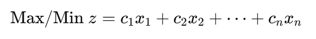

### **제약 조건(Constraints)**

- 선형 등식/부등식

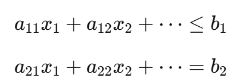

### **변수의 비음성(Non-negativity) 조건**

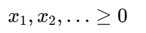

---

# 예시

**공장에서 두 종류의 음료 A, B를 생산할 때 이익 극대화**

- A 생산 시 이익 = 5
- B 생산 시 이익 = 3
- 제약:
    - 노동 시간: 2A + B ≤ 100
    - 원료 사용량: A + B ≤ 80
- LP식

### 목적 함수

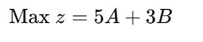

### 제약 조건

- **최대 이익을 주는 A, B 생산량**을 찾

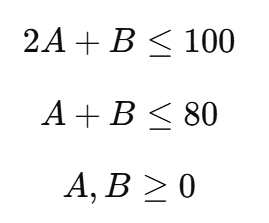

.

---

# 선형계획법의 해법(Algorithms)

- **심플렉스(SIMPLEX) 알고리즘**
    - 선형계획법의 가장 고전적, 널리 사용
    - 고차원 공간의 꼭짓점(vertex)을 따라 최적점을 찾는 방식
- **내부점(IPM, Interior Point Method)**
    - 제약 영역 내부를 따라 이동하며 최적해 탐색
    - 대규모 LP 또는 sparse 행렬 문제에 적합
- **듀얼 심플렉스**
    - 제약에 작은 변화가 있을 때 빠르게 해 갱신

---

# 활용 분야

| 분야 | 활용 예 |
| --- | --- |
| 물류·운송 | 최적 경로, 차량 배차, 창고 운영 |
| 제조 | 자원 배분, 생산 계획 |
| 금융 | 포트폴리오 최적화 |
| 에너지 | 발전 계획, 전력 흐름 최적화 |
| AI/머신러닝 | Feature selection, L1 최적화 |
| 네트워크 | 대역폭 할당 |

---

# 관련 개념 vs LP

| 개념 | 설명 |
| --- | --- |
| LP (Linear Programming) | 목적함수·제약이 선형 |
| ILP (Integer LP) | 변수들이 정수 |
| MILP (Mixed Integer LP) | 정수 + 실수 변수 혼합 |
| NLP (Nonlinear Programming) | 비선형 목적/제약 포함 |

---

### 꼭짓점 찾기

- 선형계획법이니까 **꼭짓점(모서리) 후보들**에서만 최대값이 나옴
1. 축과 만나는 점들
    - A=0일 때
    
    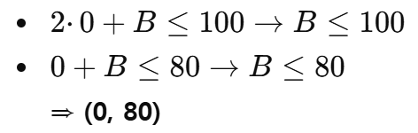
    
    - B=0일 때:
        
        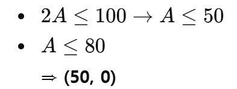
        
    - 원점: **(0, 0)**
2. 제약식 둘의 교점
    
    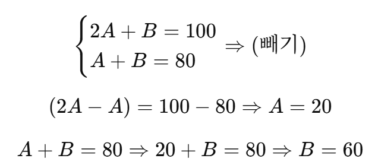
    
- 따라서 후보 점들:

((0,0), (0,80), (50,0), (20,60))

---

### 각 점에서 이익 계산

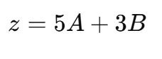

- (0, 0): (z = 0)
- (0, 80): (z = 5·0 + 3·80 = 240)
- (50, 0): (z = 5·50 + 3·0 = 250)
- (20, 60): (z = 5·20 + 3·60 = 100 + 180 = 280)

---

### 결론

- **최대 이익이 나는 생산량:**
    - (A = 20) 단위
    - (B = 60) 단위
        - 최대 이익: **(z = 280)**

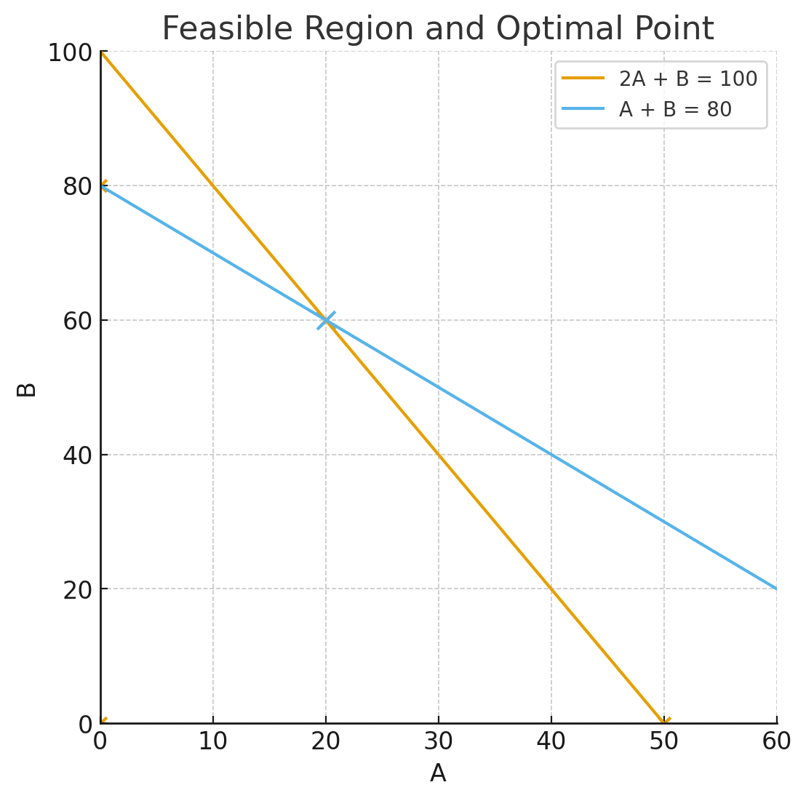

- **제약식 2개(직선)**
    - (2A + B = 100)
    - (A + B = 80)
- **가능영역의 꼭짓점들 표시**
- **최적해(20, 60)** 점
