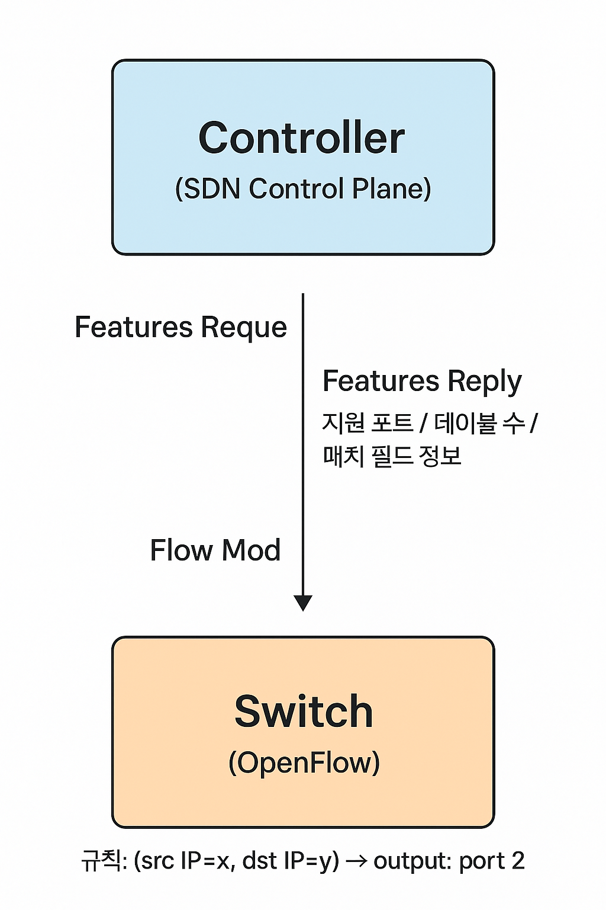
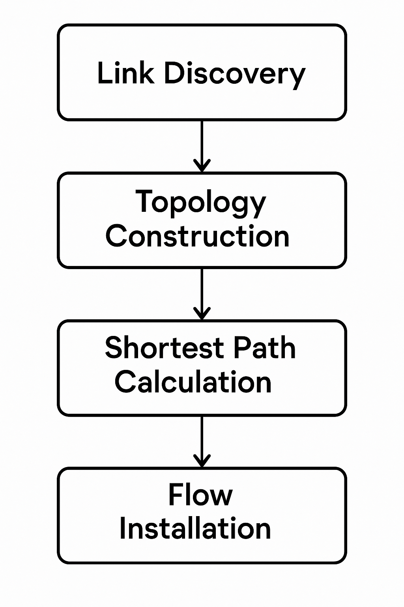
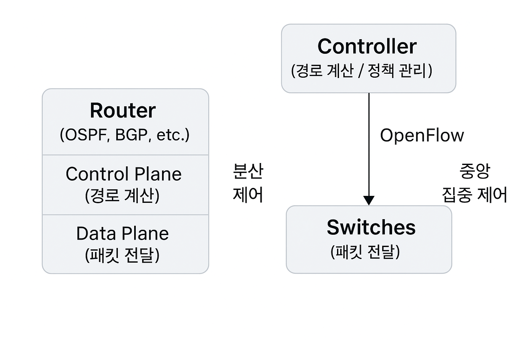
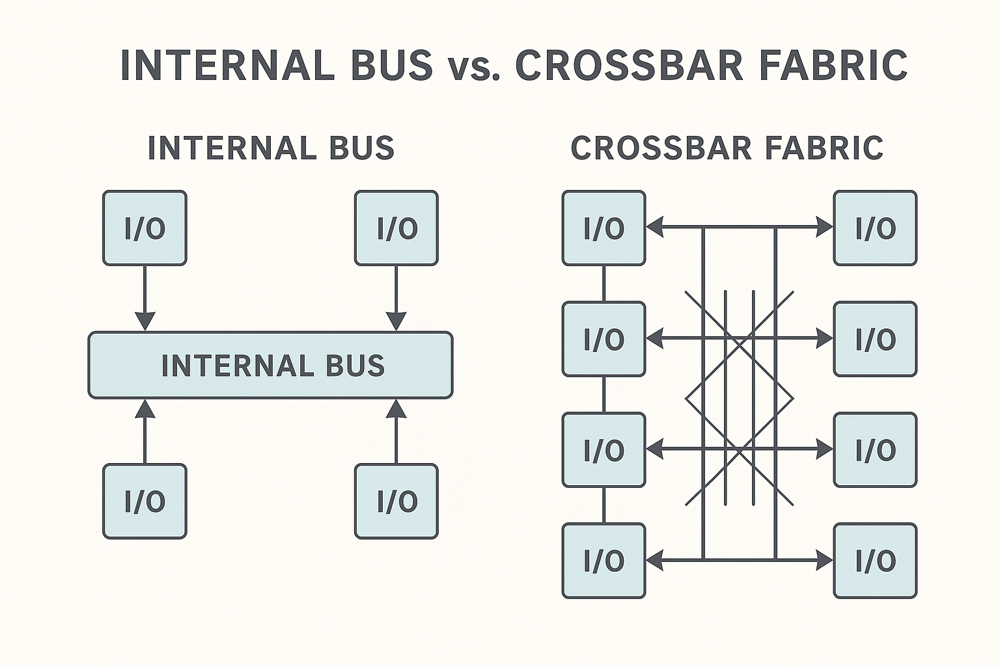

# 컨트롤러와 라우터, 스위치

---

### [1] SDN(Software Defined Networking) 구조

- 컨트롤러가 스위치의 제어 평면(Control Plane)을 중앙에서 관리
- 컨트롤러는 스위치의 하드웨어 상태를 **직접 알지는 않지만**, 스위치로부터 **상태 정보를 주기적으로 보고받거나 요청**할 수 있음
- **OpenFlow** 프로토콜을 사용하는 경우
    - 컨트롤러는 스위치로부터 다음과 같은 정보를 받을 수 있음
        - 포트 상태 (업/다운 여부)
        - 링크 상태
        - 플로우 테이블 통계
        - 버퍼 상태 등
        - **하드웨어의 동작 상태를 논리적으로 파악할 수 있는 수준**의 정보
- 컨트롤러는 스위치의 실제 내부 하드웨어 레벨(ASIC 상태, 전력 소모, 온도 등)까지는 보통 알 수 없음
    - 그런 세부 사항은 벤더 특화 인터페이스(SNMP, NetConf/YANG, Telemetry 등)로만 접근 가능

---

### 비-SDN (전통적 네트워크) 구조

- 컨트롤러가 별도로 존재하지 않고, **스위치가 스스로 제어 평면을 수행**
    - 외부 컨트롤러는 하드웨어 상태를 알 수 없음
    - 관리 시스템(NMS, Network Management System)이 **SNMP** 등을 통해 일부 정보를 모니터링할 수 있음

---

| 구분 | 컨트롤러가 스위치 하드웨어 상태를 아는가? | 방식 |
| --- | --- | --- |
| SDN(OpenFlow 등) | 예 | 상태/통계 메시지 교환 |
| 전통 네트워크 | 아니오 | NMS를 통한 간접 모니터링 |
| 특수한 벤더 장비 | 예 | SNMP, NetConf, Telemetry 등 |

---

## **[2] SDN 구조** 컨트롤러(controller)가 **스위치(switch) 상태 파악 과정**

- **컨트롤러**
    - 네트워크의 두뇌 역할로, 스위치에게 플로우(Flow) 규칙을 내려보냄.
- **스위치**
    - 실제 패킷을 처리하는 손발 역할
    - 컨트롤러의 명령을 따라 동작함.
- 둘 사이는 **OpenFlow 프로토콜**을 통해 통신

```
+------------------------+
|      Controller        |
| (Central brain / SDN)  |
+----------+-------------+
           | OpenFlow Protocol
           |
+----------v-------------+
|        Switch          |
| (Data Plane Hardware)  |
+------------------------+

```

---

## 상태 정보 흐름 (Status Information Flow)

- 스위치는 하드웨어 및 네트워크 상태가 바뀔 때마다 **컨트롤러에 이벤트 메시지**를 보냄

```
[Switch Hardware Event]
     |
     | (1) 포트 다운 발생
     v
[OpenFlow: Port Status Message]
     |
     v
[Controller receives event]
     |
     | (2) 컨트롤러가 Topology Update 수행
     v
[Updated Network View]

```

### 메시지

| 메시지 이름 | 방향 | 의미 |
| --- | --- | --- |
| **OFPT_PORT_STATUS** | Switch → Controller | 포트의 상태(Up/Down/Config 변경) 보고 |
| **OFPT_FLOW_REMOVED** | Switch → Controller | 플로우 엔트리가 제거될 때 알림 |
| **OFPT_STATS_REPLY** | Switch → Controller | 컨트롤러가 요청한 통계 정보에 대한 응답 |
| **OFPT_ERROR** | Switch → Controller | 하드웨어나 플로우 설치 중 오류 보고 |
| **OFPT_FEATURES_REPLY** | Switch → Controller | 스위치 기능(지원 포트, 테이블 등) 보고 |

---

## 주기적 상태 확인 (Polling)

- 컨트롤러는 주기적으로 스위치에 **통계 요청**을 보낼 수도 있음
- 이 메시지를 통해 컨트롤러는 다음을 모니터링함
    - 포트 트래픽량
    - 패킷 손실률
    - 플로우 테이블 사용량
    - 버퍼 점유 상태 등
- **네트워크 트래픽 변화나 장애 발생을 실시간으로 감지**할 수 있음

```
Controller → Switch : OFPT_STATS_REQUEST
Switch → Controller : OFPT_STATS_REPLY

```

---

## 컨트롤러가 알고 있는 스위치 상태 범위

| 구분 | 컨트롤러가 알 수 있음 | 알 수 있음 |
| --- | --- | --- |
| 네트워크 논리 상태 | 포트 up/down, 링크 연결, 플로우 테이블 통계 | Yes |
| 트래픽 통계 | 송수신 패킷 수, 바이트 수, 손실률 등 | Yes |
| 하드웨어 세부 정보 | 내부 ASIC 온도, 팬 속도, 전원 상태 등 | No (벤더 전용 인터페이스 필요) |

---

## 컨트롤러가 알아야 하는 스위치 상태 범위

- 컨트롤러가 플로우(Flow Modification, `OFPT_FLOW_MOD`)를 보내려면
    - **스위치의 논리적 구조와 자원 상태는 반드시 알아야 하지만**, **모든 하드웨어 상태까지 알 필요는 없음**

| 상태 종류 | 예시 | 컨트롤러가 알아야 하는가? | 이유 |
| --- | --- | --- | --- |
| **논리적 상태 (Logical State)** | 스위치가 어떤 포트를 가지고 있는지, 어떤 플로우 테이블 구조를 지원하는지, 어떤 매치 필드를 사용할 수 있는지 | **예** | 컨트롤러가 유효한 플로우 규칙을 만들기 위해 필요 |
| **물리적 상태 (Physical State)** | 포트 전기적 연결, 내부 온도, 하드웨어 에러, 전력 상태 등 | **아니요** | 이런 정보는 플로우 설치에 직접 필요하지 않음 |

## 플로우 모디피케이션(Flow Modification) 과정

- 컨트롤러는 먼저 스위치가 어떤 기능을 지원하는지를 알아야만 그에 맞는 플로우 규칙을 보낼 수 있음
    - 스위치가 `ipv6` 매치를 지원하지 않으면 `ipv6` 기반 규칙을 설치할 수 없음
    - 포트 2가 다운되어 있다면, 거기로 트래픽을 보내는 플로우를 설치하는 것은 무의미함
    - 하지만 컨트롤러는 포트의 전기적 세부 신호나 칩 온도 같은 물리 상태를 몰라도 됨

```
[1] 컨트롤러 → Switch : Features Request
[2] 스위치 → Controller : Features Reply
       └─ 지원 포트 / 테이블 수 / 매치 필드 정보
[3] 컨트롤러 → Switch : Flow Mod
       └─ 규칙: (src IP=x, dst IP=y) → output: port 2

```

---



## 스위치의 하드웨어 상태까지 완전히 알아야 하는 것은 아님

- 네트워크 토폴로지와 각 링크/포트의 **논리(플로우 테이블, 포트 Up/Down,  대역폭 등) 상태**를 정확히 알아야 한다는 뜻이지, 모든 하드웨어 내부 상태를 알아야 한다는 뜻은 아님
    - **컨트롤러의 지식 수준은 네트워크 논리 계층(Logical Layer)에 한정**

---

| 구분 | 설명 | 컨트롤러가 알아야 하는가 |
| --- | --- | --- |
| 플로우 테이블 구조 | 어떤 필드 매칭 가능, 어떤 액션 지원 | Yes |
| 포트 및 링크 상태 | up/down, 대역폭, 지연 등 | Yes |
| 트래픽 통계 | 패킷 수, 플로우 수, 혼잡도 | Yes |
| 하드웨어 세부 상태 | 온도, 팬, 전압, 칩 상태 | No |

---

## **SDN 컨트롤러의 최단 경로(Shortest Path)** 계산

- 컨트롤러는 스위치로부터 링크 정보를 수집해 네트워크 그래프를 구성하고, 그 그래프 위에서 **Shortest Path** 알고리즘을 수행하여 각 스위치에 플로우를 설치함으로써 최적 경로를 생성
    - 컨트롤러는 다음 단계로 네트워크의 **전체 토폴로지(Topology)**를 학습
    - **각 스위치 연결 인식**
        - 컨트롤러가 네트워크에 새 스위치가 접속하면
            - `OFPT_FEATURES_REPLY` 메시지로 스위치의 포트 정보(논리적 구조)를 받음
    - **링크 감지 (Link Discovery)**
        - 컨트롤러는 **LLDP (Link Layer Discovery Protocol)** 패킷을 각 스위치 포트에 주기적으로 전송시킴
        - 스위치가 LLDP를 받아 다른 포트로 다시 전달하면, 컨트롤러는 “이 포트 ↔ 저 포트” 간의 **물리적 연결(link)** 파악
    - **Topology Database 구축**
        - 수집된 링크 정보를 그래프 형태로 저장
        - 이로써 컨트롤러는 **네트워크 전체의 연결 그래프**를 보유

```
스위치1 —(링크)→ 스위치2 —(링크)→ 스위치3 …

```

---

## 최단 경로(Shortest Path) 계산

- 컨트롤러는 링크 그래프를 바탕으로 **그래프 알고리즘** 수행
- **Dijkstra 알고리즘**
    - 가장 일반적인 shortest path 알고리즘
- **Bellman-Ford**, **Floyd-Warshall**, **A* (Heuristic)** 사용

```
Switch1 --1ms-- Switch2 --1ms-- Switch3
   |                         |
  2ms                      1ms
   |                         |
 Switch4 ---------------------

```

- 컨트롤러는 이 링크 그래프를 이용해 **Switch1 → Switch3** 사이의 최단 경로를 계산
- Dijkstra 알고리즘 결과
    - **Switch1 → Switch2 → Switch3 (총 지연 2ms)**

---

## 계산된 경로 반영

- 컨트롤러는 계산된 경로를 실제 네트워크에 적용하기 위해 각 스위치에 다음과 같은 **Flow Mod 메시지**를 보냄
    - **데이터 패킷이 최단 경로로 전달됨**

| 스위치 | 규칙 (Flow Entry) | 동작 |
| --- | --- | --- |
| Switch1 | dstIP = 10.0.0.3 | output: port to Switch2 |
| Switch2 | dstIP = 10.0.0.3 | output: port to Switch3 |
| Switch3 | dstIP = 10.0.0.3 | output: local port |

---

| 항목 | 설명 |
| --- | --- |
| **컨트롤러가 링크 정보를 아는가?** | Yes. LLDP 기반 Topology Discovery로 수집 |
| **모든 스위치의 링크를 조합할 수 있는가?** | Yes. 그래프 형태로 네트워크 전체를 표현 |
| **Shortest Path 계산 가능?** | Yes. Dijkstra 등 그래프 알고리즘 사용 |
| **결과 적용 방법** | Flow Mod 메시지로 스위치에 플로우 설치 |

---

- **토폴로지 흐름도(Topology Flow Diagram)**



---

## **[3] 전통적인 라우터(Router)**와 **SDN 컨트롤러(Controller)**

- **패킷의 경로를 결정한다**는 공통점이 있지만, 그 **위치와 역할, 동작 방식**이 완전히 다름
- 구조적 차이 (Control Plane 분리 여부)

| 구분 | **라우터 (Router)** | **SDN 컨트롤러 (Controller)** |
| --- | --- | --- |
| **위치** | **각 네트워크 장비(하드웨어)에 내장** | **중앙 집중 서버 (소프트웨어)** |
| **제어 평면(Control Plane)** | **장비 내부**에 존재 | **중앙 컨트롤러**에 존재 |
| **데이터 평면(Data Plane)** | 자신이 직접 패킷을 전달 | **스위치(OpenFlow 등)**가 담당 |
| **동작 방식** | 분산 제어 (Distributed Control) | 중앙 집중 제어 (Centralized Control) |
| **프로토콜** | OSPF, BGP, RIP 등 | OpenFlow, NetConf, gRPC 등 |
| **의사결정 단위** | 라우터가 스스로 경로 계산 | 컨트롤러가 네트워크 전체를 고려해 경로 계산 |
| **지능/시야 범위** | 국소적(Local): 인접 라우터만 인식 | 전역적(Global): 모든 스위치와 링크 인식 |

---

### 전통 라우터 구조 (분산 제어)

- 각 라우터가 스스로 경로를 계산하고, 패킷을 포워딩함.
- **서로 간에 라우팅 테이블을 교환함 (예: OSPF, BGP).**
- 네트워크가 커질수록 관리가 복잡함.

```
+-------------------------------+
|   Router (OSPF, BGP, etc.)   |
|-------------------------------|
| Control Plane  | Data Plane  |
|  (경로 계산)   | (패킷 전달) |
+-------------------------------+

```

---

### SDN 구조 (중앙 집중 제어)

- 컨트롤러가 네트워크 전체를 논리적으로 관리
- 각 스위치는 단순히 패킷을 전달만 함
- 경로 변경, QoS, 보안 정책 등을 중앙에서 쉽게 적용 가능

```
+------------------------+
|     Controller         |  ← Control Plane 중앙 집중
| (경로 계산 / 정책 관리)|
+-----------+------------+
            |
            | OpenFlow
            |
+-----------v------------+
|        Switches        |  ← Data Plane만 담당
| (패킷 전달)             |
+-------------------------+

```

---

- 라우터는 자신이 직접 길(경로)을 계산하고 이동시킨다면, **SDN 컨트롤러**는 전체 지도를 가지고 중앙에서
    
    이쪽으로 가라고 **스위치들에게 명령하는 두뇌 역할** 
    

| 기능 | 라우터 | SDN 컨트롤러 |
| --- | --- | --- |
| **경로 계산** | **직접 수행 (OSPF, BGP 등)** | **전역 그래프 기반 계산** |
| **플로우 설치** | 내부 테이블 자동 갱신 | 스위치로 Flow Mod 전송 |
| **토폴로지 인식** | 인접 장비만 인식 | 네트워크 전체 인식 |
| **정책 적용** | 장비마다 개별 설정 | 중앙에서 일괄 설정 가능 |
| **확장성** | 네트워크 커질수록 복잡 | 중앙 관리로 단순화 가능 |

---

|  | 라우터 | SDN 컨트롤러 |
| --- | --- | --- |
| 교통 시스템에 비유 | 각 교차로가 알아서 신호 조정 | 중앙 교통 관제센터가 모든 신호 제어 |
| 장점 | 자율성, 독립성 | 전체 최적화, 중앙 관리 |
| 단점 | 전역 최적화 어려움 | 컨트롤러 장애 시 영향 큼 |

---



---

## [4] 탈중앙화된 라우터(Distributed Routing)와 중앙집중식 컨트롤러(SDN Controller)

## 탈중앙화 구조 (Distributed Routing, 전통적 라우터)

### 장점

1. **자율성과 독립성**
    - 각 라우터가 스스로 경로를 계산하고 동작하므로 컨트롤러나 외부 시스템에 의존하지 않음
    - 일부 장비가 고장나도 전체 네트워크는 계속 동작함
2. **장애 복원력 (Fault Tolerance)**
    - 중앙 장애점(Single Point of Failure)이 없음.
    - 하나의 라우터가 고장 나더라도 다른 라우터가 자체적으로 우회 경로 계산 가능.
3. **검증된 안정성**
    - OSPF, BGP, RIP 등의 프로토콜은 수십 년간 검증됨.
    - 인터넷 전역에서 실제로 사용 중 (ISP 코어망 등).
4. **분산 확장성**
    - 네트워크 규모가 커져도 새로운 라우터가 자동으로 인접 경로 학습 가능.

---

### 단점

1. **전역 최적화 불가**
    - 각 라우터는 자신의 주변 정보만 보고 경로 결정함
    - 전체적으로 비효율적일 수 있음.
2. **정책 일관성 어려움**
    - 여러 라우터에 동일한 정책을 적용하려면 수동 설정 필요
    - 관리 복잡도 상승
3. **제어 가시성 부족**
    - 중앙에서 네트워크 전체의 트래픽, 링크 상태를 한눈에 보기 어려움.
4. **새로운 기능 도입 어려움**
    - 프로토콜 단위로 표준화되어 있어, 새로운 기능 추가 시 전체 장비 펌웨어 업데이트 필요.

---

## 중앙집중제어 구조 (Centralized Control, SDN Controller)

### 장점

1. **전역 최적화 (Global Optimization)**
    - 컨트롤러가 네트워크 전체 토폴로지를 알고 있어, **Shortest Path, Load Balancing, QoS, 보안 정책** 등을 전체적으로 계산 가능
2. **정책 통합 관리**
    - 한 번의 설정으로 모든 스위치에 동일 정책 반영 가능.
        - ACL, 트래픽 우선순위, QoS 등을 중앙에서 일괄 제어.
3. **빠른 서비스 프로비저닝**
    - 새로운 경로, 가상 네트워크, 트래픽 엔지니어링 등을 **소프트웨어로 즉시 적용 가능**.
4. **가시성(Visibility) 향상**
    - 컨트롤러는 네트워크 전체 상태를 실시간으로 모니터링 가능.
    - 장애 탐지 및 트래픽 분석이 쉬움.

---

### 단점

1. **중앙 장애점 (Single Point of Failure)**
    - 컨트롤러가 다운되면 네트워크 제어 불가능.
    - 일부 시스템은 “fail-safe 모드”로 패킷 전달만 지속하지만, 경로 변경 불가.
2. **확장성 문제**
    - 대규모 네트워크에서 컨트롤러 하나로 모든 스위치를 관리하면 부하 증가.
    - 분산형 컨트롤러 구조(ONOS, OpenDaylight 등)로 보완 필요.
3. **지연 문제**
    - 모든 제어 결정이 중앙을 거치므로 초기 플로우 설치 시 딜레이 발생 가능.
4. **복잡한 초기 구축**
    - 컨트롤러, 프로토콜(OpenFlow 등), API, 보안 관리 등 구성 요소가 많아 초기 설계 복잡.

---

## 비교

| 구분 | **탈중앙화 라우터** | **중앙집중 컨트롤러 (SDN)** |
| --- | --- | --- |
| 제어 방식 | 각 장비가 스스로 제어 | 중앙 컨트롤러가 전체 제어 |
| 장애 내성 | 강함 (분산 구조) | 약함 (컨트롤러 장애 시 위험) |
| 전역 최적화 | 어려움 | 쉬움 |
| 정책 관리 | 분산 설정 | 중앙 일괄 관리 |
| 확장성 | 자연스럽게 확장 | 컨트롤러 부하 고려 필요 |
| 가시성 | 제한적 | 전체 네트워크 가시성 확보 |
| 구성 복잡도 | 낮음 | 높음 |
| 도입 용도 | ISP, 전통 네트워크 | 클라우드, 데이터센터, NFV 환경 |

---

- 라우터(분산 제어)는 안정성과 자율성이 강점이지만,  전체 네트워크 최적화가 어렵고 관리가 복잡
- 컨트롤러(중앙 집중)는 전역적 최적화와 정책 제어가 가능하지만, 중앙 장애와 확장성 문제를 해결하기 위한 추가 설계가 필요.

---

| 구분 | **스위치 (Switch)** | **라우터 (Router)** |
| --- | --- | --- |
| OSI 계층 | 2계층 (데이터링크 계층) | 3계층 (네트워크 계층) |
| 식별 기준 | **MAC 주소** | **IP 주소** |
| 통신 단위 | **프레임 (Frame)** | **패킷 (Packet)** |
| 주요 역할 | 같은 네트워크(LAN) 내부 장치 간 연결 | 서로 다른 네트워크(LAN↔WAN) 간 연결 |
| 장비 간 통신 방식 | MAC 주소 기반 포워딩 | 라우팅 테이블 기반 경로 결정 |

---

## [5] **라우터와 스위치의 통신 방식**

## 스위치의 통신 방식 (Layer 2 Switching)

- 스위치는 **MAC 주소 테이블(MAC Address Table)** 을 기반으로 어떤 포트로 프레임을 전송할지 결정
    1. **프레임 수신**
        - 스위치가 들어오는 프레임의 **출발지 MAC 주소(Source MAC)** 를 학습
            - MAC 주소 테이블에 `MAC주소 - 포트번호` 저장.
    2. **목적지 MAC 확인**
        - 프레임의 **Destination MAC 주소**를 테이블에서 찾음.
    3. **포워딩 / 플러딩**
        - 해당 MAC이 테이블에 있으면 그 포트로 전송 (Unicast)
        - 없으면 모든 포트로 브로드캐스트 (Flooding)
    4. **학습 및 갱신**
        - 네트워크 변화에 따라 MAC 테이블 자동 업데이트.
        - PC1이 PC2에게 데이터를 보낼 때 스위치는 PC2의 MAC은 포트 3에 연결됨을 알고, 프레임을 포트 3으로만 전송.
    
    ---
    

## 라우터의 통신 방식 (Layer 3 Routing)

- 라우터는 **IP 주소** 기반으로 서로 다른 네트워크를 연결
- 네트워크 경계에서 **패킷의 목적지를 분석해 최적 경로를 선택**
    1. **패킷 수신**
        - 들어온 패킷의 **Destination IP 주소**를 확인.
    2. **라우팅 테이블 참조**
        - 내부 **Routing Table**에서 목적지 네트워크와 일치하는 경로를 탐색.
    3. **최적 경로 선택**
        - 여러 경로가 있으면 메트릭(Metric) 값이 가장 낮은 경로 선택.
    4. **다음 홉(Next Hop)으로 전송**
        - 해당 인터페이스로 패킷을 포워딩.
        - PC1(192.168.1.0/24)이 PC2(10.0.0.0/24)와 통신하려면, 라우터가 10.0.0.0/24은 포트 2를 통해 간다고 판단하고 패킷 전달
    
    ---
    
    - 스위치
        - **LAN 내부 통신**을 담당 (프레임 단위)
    - 라우터
        - **LAN ↔ 다른 네트워크 간 통신** 담당 (패킷 단위)
    - 실제로 한 네트워크에서는 **스위치가 라우터의 인터페이스에 연결**
    
    ```
    [Host A] --(Frame)--> [Switch] --(Frame)--> [Router] --(Packet)--> [Switch] --(Frame)--> [Host B]
    
    ```
    
    ---
    
    ## 라우터와 스위치 통신 차이
    
    - 스위치는 같은 네트워크(LAN) 내 장치들을 MAC 주소 기반으로 연결하고, **라우터**는 서로 다른 네트워크를 IP 주소 기반으로 연결
    - 스위치가 **빠른 전달**, 라우터가 **경로 결정** 담당.
    
    | 구분 | 스위치 | 라우터 |
    | --- | --- | --- |
    | 구분 기준 | MAC 주소 | IP 주소 |
    | 주소 학습 | 자동 (MAC 테이블) | 수동/동적 (라우팅 프로토콜) |
    | 전송 단위 | 프레임 | 패킷 |
    | 브로드캐스트 처리 | 가능 | 불가능 |
    | 주요 프로토콜 | Ethernet, VLAN, STP | IP, OSPF, BGP, RIP |
    | 목적 | LAN 내 통신 | LAN 간 통신 (인터네트워크) |
    
    ---
    

## [6] 라우터와 스위치 간 통신 구조

- **스위치와 라우터가 통합된 장비 내부의 아키텍처**
    - 패킷 포워딩 파이프라인 (Packet Forwarding Pipeline)
        - **L2 엔진이 L3 엔진으로 프레임을 넘길 때, 내부적으로 하드웨어적 메커니즘으로 통신**
        - **L3 스위치의 내부 버스 구조(ASIC 기반)** 와 **메모리 아키텍처**
        - L2 엔진과 L3 엔진은 별도의 CPU가 아니라, **하드웨어 ASIC(Application-Specific Integrated Circuit)** 내부의 **파이프라인 구조(Pipeline Architecture)** 로 연결됨
        - 소프트웨어적 호출이 아닌 **하드웨어 레벨에서 직접 연결된 데이터 경로(Data Path)** 를 통해 전달.
    
    ---
    
    ### 일반적인 L3 스위치 내부 구조
    
    ```
    +----------------------------------------------------------+
    |                Switching ASIC (Forwarding Engine)        |
    |----------------------------------------------------------|
    | 1. Ingress Parser → 2. Lookup Engines (L2/L3) → 3. Egress|
    +----------------------------------------------------------+
    
    ```
    
    1. **Ingress Port에서 프레임 수신**
        - 프레임이 들어오면 **Ingress Parser**가 헤더를 분석함
            - 이더넷, VLAN, IP 등 프로토콜 필드를 추출.
    2. **L2 Lookup**
        - MAC 주소 테이블(TCAM/Hash Table)에서 목적지 MAC 확인.
        - 이 MAC은 게이트웨이 인터페이스라면 L3 엔진으로 전달 필요.
    3. **L2 → L3 엔진 내부 전달**
        - **데이터가 메모리를 오가는 것이 아니라**, **ASIC 내부의 Crossbar Switch Fabric** 또는 **Internal Bus**를 통해 **하드웨어 라우팅 파이프라인으로 직접 전달**
        - 이 구조는 CPU 내부의 ALU ↔ 레지스터 간 연결처럼 **동기화된 클럭 파이프라인**
    4. **L3 Lookup**
        - L3 엔진이 IP 헤더를 검사하여 **라우팅 테이블 (TCAM/Forwarding Table)** 조회.
        - 다음 홉(Next Hop)과 출력 포트 정보 결정.
    5. **Egress 처리**
        - 새 MAC 헤더를 붙여서 재캡슐화 후, Egress Port로 프레임 전송.
    
    ---
    
    ## 내부 통신에 사용되는 하드웨어 기술
    
    | 구성 요소 | 설명 |
    | --- | --- |
    | **ASIC (Application-Specific IC)** | L2/L3 처리 기능이 전용 회로로 구현되어 있음. CPU 개입 없이 하드웨어 레벨에서 포워딩 수행. |
    | **Switch Fabric / Crossbar** | L2 → L3 → Egress 경로를 연결하는 고속 백플레인(내부 버스). 수 Tbps급 대역폭 제공. |
    | **TCAM (Ternary Content Addressable Memory)** | MAC, IP, VLAN, ACL 등 검색에 사용. 병렬 비교가 가능해 매우 빠름. |
    | **SRAM / DRAM** | 패킷 버퍼 및 임시 저장소로 사용. ASIC과 동일한 칩 또는 인접 모듈에 위치. |
    | **DMA (Direct Memory Access)** | CPU를 거치지 않고, ASIC 간 데이터 이동 시 사용되는 방식. |
    
    ---
    
    ## Cisco / Broadcom 계열 ASIC
    
    - 대부분의 상용 스위치 칩은 **Broadcom Trident / Tomahawk 시리즈** 구조를 가짐
        - L2 엔진, L3 엔진, ACL 엔진, QoS 엔진이 각각 ASIC 블록으로 존재
        - 내부 연결은 **Switch Fabric** 또는 **On-chip Bus Matrix**
        - 각 엔진은 공통 패킷 버퍼를 공유
        - 내부 데이터 경로는 전용 **DMA + Pipeline stage** 로 구현됨
    
    ```
    [Ingress Parser]
       ↓
    [L2 Engine] → [L3 Engine] → [QoS / ACL Engine]
       ↓
    [Egress Port]
    
    ```
    
    ---
    

## [7] 데이터 흐름 (하드웨어 레벨)

## Internal Bus (내부 버스 구조)

- Internal Bus는 **하나의 중앙 버스(통로)를 모든 포트나 엔진이 공유(shared) 하며 사용하는 구조**
    - 여러 데이터 경로가 하나의 도로를 순서대로 번갈아 사용하는 방식
- 데이터가 들어오면 버스 중재기(Arbiter)가 **버스 점유권**을 부여.
- L2 엔진이 버스를 통해 L3 엔진으로 프레임을 전달
- 전달이 끝나면 버스가 다시 해제되고, 다른 모듈이 버스를 점유.

```
 [Port 1] ─┐
 [Port 2] ─┤
 [L2 Engine]│
 [L3 Engine]│
 [Port 3] ─┘
     │
  ┌──────────────┐
  │ Internal Bus │  ← 공통 데이터 경로
  └──────────────┘

```

- Internal Bus는 **소규모 장비나 저속 네트워크**에서는 효율적이지만, 고성능 장비에서는 **포트 간 충돌과 대역폭 제한** 때문에 비효율적

| 항목 | 설명 |
| --- | --- |
| **데이터 흐름** | 순차적(하나의 통로 공유) |
| **장점** | 구조 단순, 설계 쉬움, 비용 낮음 |
| **단점** | 여러 데이터가 동시에 이동 불가 → 대역폭 병목 발생 |
| **적용 예시** | 초기 스위치/라우터, 저가형 ASIC 구조 |

---

## Crossbar Switch Fabric (교차형 스위치 패브릭)

- Crossbar Fabric은 각 입력 포트가 각 출력 포트로 **동시에 연결될 수 있는 비차단(Non-blocking)** 고속 스위칭 매트릭스
- 모든 포트가 동시에 서로 다른 목적지로 데이터를 보낼 수 있는 구조
- 입력 포트와 출력 포트 사이에 **교차점(crosspoint)** 을 갖고 있으며, 각 crosspoint는 하드웨어적으로 **동시에 여러 경로를 연결**
    - 각 입력 포트가 전송할 목적지 출력 포트를 요청.
    - 스케줄러(Arbiter)가 **동시 연결 가능한 비충돌 조합**을 계산.
    - Crossbar Matrix가 전자적으로 스위칭 경로를 열어줌.
    - 모든 포트 간 병렬 데이터 전송 수행.

```
        +-------------------+
Port 1 ─┤ \                 |
Port 2 ─┤  X   Crossbar     │→ Port A
Port 3 ─┤ /   Switch Fabric │→ Port B
        +-------------------+

```

| 항목 | 설명 |
| --- | --- |
| **데이터 흐름** | 병렬 (동시 다중 전송 가능) |
| **장점** | 대역폭 매우 높음, 충돌 거의 없음 |
| **단점** | 회로 복잡, 설계 비용 높음 |
| **적용 예시** | 고성능 스위치/라우터 ASIC (Cisco, Juniper, Broadcom 등) |
- Port1 → L3 Engine
- Port2 → QoS Engine
- Port3 → Egress Buffer
    - 이 세 데이터 전송이 동시에 발생해도 Crossbar Fabric은 각각의 경로를 독립적으로 연결

---

| 항목 | **Internal Bus** | **Crossbar Fabric** |
| --- | --- | --- |
| 데이터 전송 방식 | 순차적 (공유 버스) | 병렬 (전용 연결) |
| 대역폭 | 제한적 (n:1 구조) | 매우 높음 (n:n 구조) |
| 지연(Latency) | 상대적으로 큼 | 매우 작음 |
| 충돌(Collision) | 버스 경합 발생 | 거의 없음 |
| 설계 난이도 | 낮음 | 높음 |
| 활용 범위 | 저가형 스위치, 소형 장비 | 고성능 코어/데이터센터 스위치, L3 ASIC |

---

## ASIC 내부 적용 방식

- 대부분의 현대 L3 스위치 ASIC (예: Broadcom Trident, Tomahawk, Cisco UADP 등)
    - **Crossbar + Internal Bus 혼합형 구조** 사용
    - **Crossbar Fabric**
        - 고속 포트 간 데이터 전달 (L2 ↔ L3 ↔ Egress)
    - **Internal Bus**
        - 제어 정보(Control Plane) 전달, CPU ↔ ASIC 간 통신
- 데이터 포워딩(패킷)은 Crossbar로, 제어 명령(설정, 테이블 업데이트 등)은 Internal Bus로 처리

---

| 구분 | 역할 | 핵심 특징 |
| --- | --- | --- |
| **Internal Bus** | ASIC 내부 통신의 기본 공유 경로 | 구조 단순하지만 병목 발생 |
| **Crossbar Switch Fabric** | 포트 간 동시 데이터 전송용 매트릭스 | 고속, 병렬 처리 가능, 대형 장비에 필수 |
| **L2-L3 간 전달 시 실제 사용 구조** | Crossbar 기반 하드웨어 파이프라인 | 내부 버스를 통해 제어 신호 전달 |

---


