# [12주차_1차시] REST API MAC 차단 L2 스위치

### REST API로 MAC 주소를 차단/해제할 수 있는 L2 스위치(Ryu 앱)

- OpenFlow 1.3 L2 learning 스위치처럼 동작
- REST API(`/macblock/macs`)로 차단할 MAC 목록을 관리
- 차단된 MAC의 트래픽은 스위치에서 바로 **DROP** 하도록 flow 설치
- `mac_block_rest.py`

---

```python
from ryu.base import app_manager
from ryu.controller import ofp_event
from ryu.controller.handler import MAIN_DISPATCHER, CONFIG_DISPATCHER, set_ev_cls
from ryu.ofproto import ofproto_v1_3
from ryu.lib.packet import packet
from ryu.lib.packet import ethernet
from ryu.lib.packet import ether_types

from ryu.app.wsgi import WSGIApplication, ControllerBase, route
from webob import Response
import json

MACBLOCK_INSTANCE_NAME = 'mac_block_app'

class MacBlockSwitch(app_manager.RyuApp):
    OFP_VERSIONS = [ofproto_v1_3.OFP_VERSION]

    # WSGI 컨텍스트를 생성해 달라고 Ryu에 요청
    _CONTEXTS = {
        'wsgi': WSGIApplication,
    }

    def __init__(self, *args, **kwargs):
        super(MacBlockSwitch, self).__init__(*args, **kwargs)
        self.mac_to_port = {}
        self.blocked_macs = set()

        # Ryu가 생성한 WSGI 인스턴스
        wsgi = kwargs['wsgi']
        # REST 컨트롤러 등록
        wsgi.register(MacBlockController, {MACBLOCK_INSTANCE_NAME: self})

    # =========================
    #   OpenFlow 기본 설정
    # =========================
    @set_ev_cls(ofp_event.EventOFPSwitchFeatures, CONFIG_DISPATCHER)
    def switch_features_handler(self, ev):
        datapath = ev.msg.datapath
        ofproto = datapath.ofproto
        parser = datapath.ofproto_parser

        # 기본 룰: 모든 패킷을 컨트롤러로
        match = parser.OFPMatch()
        actions = [parser.OFPActionOutput(
            ofproto.OFPP_CONTROLLER,
            ofproto.OFPCML_NO_BUFFER)]
        self.add_flow(datapath, priority=0, match=match, actions=actions)

    def add_flow(self, datapath, priority, match, actions,
                 buffer_id=None, idle_timeout=0, hard_timeout=0):
        ofproto = datapath.ofproto
        parser = datapath.ofproto_parser

        inst = [parser.OFPInstructionActions(
            ofproto.OFPIT_APPLY_ACTIONS,
            actions)]

        if buffer_id is not None and buffer_id != ofproto.OFP_NO_BUFFER:
            mod = parser.OFPFlowMod(datapath=datapath,
                                    buffer_id=buffer_id,
                                    priority=priority,
                                    idle_timeout=idle_timeout,
                                    hard_timeout=hard_timeout,
                                    match=match,
                                    instructions=inst)
        else:
            mod = parser.OFPFlowMod(datapath=datapath,
                                    priority=priority,
                                    idle_timeout=idle_timeout,
                                    hard_timeout=hard_timeout,
                                    match=match,
                                    instructions=inst)
        datapath.send_msg(mod)

    # =========================
    #   Packet-In 처리
    # =========================
    @set_ev_cls(ofp_event.EventOFPPacketIn, MAIN_DISPATCHER)
    def _packet_in_handler(self, ev):
        msg = ev.msg
        datapath = msg.datapath
        dpid = datapath.id
        ofproto = datapath.ofproto
        parser = datapath.ofproto_parser

        in_port = msg.match['in_port']

        pkt = packet.Packet(msg.data)
        eth = pkt.get_protocols(ethernet.ethernet)[0]

        # IPv6 멀티캐스트(33:33:xx:xx:xx:xx)는 무시
        if eth.dst.startswith('33:33'):
            return

        # LLDP 등은 무시
        if eth.ethertype == ether_types.ETH_TYPE_LLDP:
            return

        src = eth.src.lower()
        dst = eth.dst.lower()

        self.logger.info("packet in dpid=%s src=%s dst=%s in_port=%s",
                         dpid, src, dst, in_port)

        # === MAC 차단 로직 ===
        if src in self.blocked_macs or dst in self.blocked_macs:
            self.logger.info("BLOCKED MAC detected. Dropping packet (src=%s, dst=%s)", src, dst)

            if src in self.blocked_macs:
                match = parser.OFPMatch(eth_src=src)
            else:
                match = parser.OFPMatch(eth_dst=dst)

            # DROP flow (actions = [])
            self.add_flow(datapath,
                          priority=100,
                          match=match,
                          actions=[],
                          buffer_id=msg.buffer_id,
                          idle_timeout=60)
            return

        # === L2 learning ===
        self.mac_to_port.setdefault(dpid, {})
        self.mac_to_port[dpid][src] = in_port

        if dst in self.mac_to_port[dpid]:
            out_port = self.mac_to_port[dpid][dst]
        else:
            out_port = ofproto.OFPP_FLOOD

        actions = [parser.OFPActionOutput(out_port)]

        if out_port != ofproto.OFPP_FLOOD:
            match = parser.OFPMatch(in_port=in_port, eth_src=src, eth_dst=dst)
            if msg.buffer_id != ofproto.OFP_NO_BUFFER:
                self.add_flow(datapath,
                              priority=1,
                              match=match,
                              actions=actions,
                              buffer_id=msg.buffer_id,
                              idle_timeout=300)
                return
            else:
                self.add_flow(datapath,
                              priority=1,
                              match=match,
                              actions=actions,
                              idle_timeout=300)

        data = None
        if msg.buffer_id == ofproto.OFP_NO_BUFFER:
            data = msg.data

        out = parser.OFPPacketOut(datapath=datapath,
                                  buffer_id=msg.buffer_id,
                                  in_port=in_port,
                                  actions=actions,
                                  data=data)
        datapath.send_msg(out)

# =======================
#   REST API Controller
# =======================

class MacBlockController(ControllerBase):

    def __init__(self, req, link, data, **config):
        super(MacBlockController, self).__init__(req, link, data, **config)
        # RyuApp 인스턴스
        self.mac_app = data[MACBLOCK_INSTANCE_NAME]

    # 차단 MAC 목록 조회
    @route('macblock', '/macblock/macs', methods=['GET'])
    def list_blocked_macs(self, req, **kwargs):
        body = {
            "blocked_macs": sorted(list(self.mac_app.blocked_macs))
        }
        return self._json_response(body)

    # MAC 차단 추가 (POST)
    @route('macblock', '/macblock/macs', methods=['POST'])
    def add_blocked_mac(self, req, **kwargs):
        try:
            content = req.body.decode('utf-8')
            data = json.loads(content)
            mac = data.get('mac', '').lower()
        except Exception:
            return self._json_response(
                {"error": "invalid JSON. expected {\"mac\": \"xx:xx:xx:xx:xx:xx\"}"},
                status=400
            )

        if not mac:
            return self._json_response({"error": "mac is required"}, status=400)

        self.mac_app.blocked_macs.add(mac)
        self.mac_app.logger.info("REST: Added blocked MAC %s", mac)

        return self._json_response({
            "result": "ok",
            "blocked_macs": sorted(list(self.mac_app.blocked_macs))
        })

    # MAC 차단 해제 (DELETE)
    @route('macblock', '/macblock/macs/{mac}', methods=['DELETE'])
    def delete_blocked_mac(self, req, mac, **kwargs):
        mac = mac.lower()
        if mac in self.mac_app.blocked_macs:
            self.mac_app.blocked_macs.remove(mac)
            self.mac_app.logger.info("REST: Removed blocked MAC %s", mac)
            return self._json_response({
                "result": "ok",
                "blocked_macs": sorted(list(self.mac_app.blocked_macs))
            })
        else:
            return self._json_response({
                "error": "mac not found",
                "blocked_macs": sorted(list(self.mac_app.blocked_macs))
            }, status=404)

    # 공통 JSON 응답
    def _json_response(self, data, status=200):
        body = json.dumps(data)
        # charset 명시해서 WebOb 오류 방지
        return Response(
            content_type='application/json',
            body=body,
            status=status,
            charset='utf-8'
        )

```

---

### REST API 서버 구동 확인

```bash
ryu-manager mac_block_rest.py --wsapi-port 8080
```

- `creating context wsgi`
- `wsgi starting up on http://0.0.0.0:8080`
    
    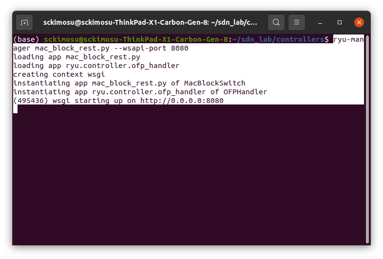
    

---

### 차단 목록 확인 (GET)

- 다른 터미널에서

```bash
curl http://127.0.0.1:8080/macblock/macs

```

- 처음 상태

```json
{"blocked_macs": []}

```

- 실행 화면

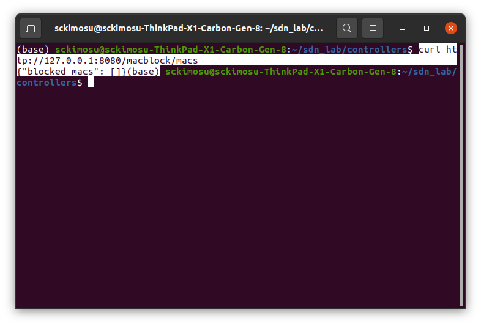

- 응답 화면

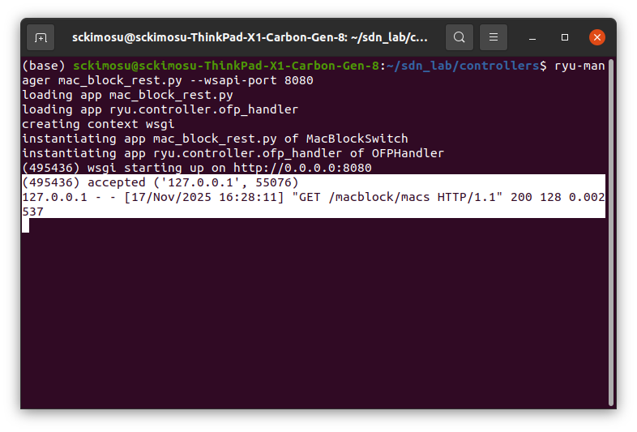

### MAC 차단 추가 (POST)

- `00:00:00:00:00:01` 차단

```bash
curl -X POST http://127.0.0.1:8080/macblock/macs \
  -H "Content-Type: application/json" \
  -d '{"mac": "00:00:00:00:00:01"}'

```

- 실행화면
    
    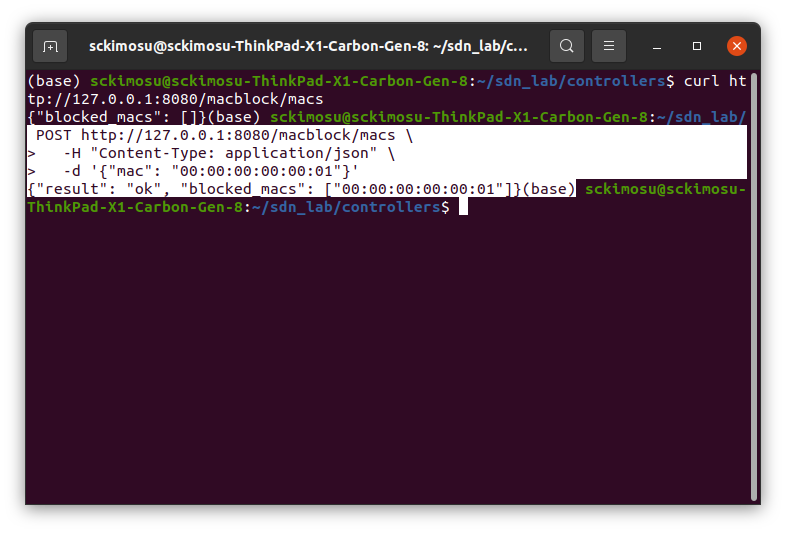
    
- 응답

```json
{
  "result": "ok",
  "blocked_macs": ["00:00:00:00:00:01"]
}

```

- 컨트롤러 로그 화면

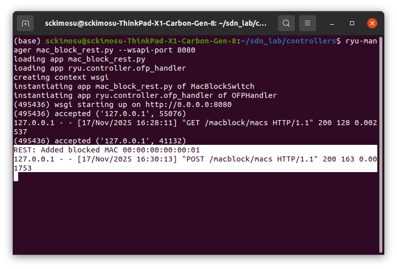

---

### MAC 차단 해제 (DELETE)

- 명령

```bash
curl -X DELETE http://127.0.0.1:8080/macblock/macs/00:00:00:00:00:01

```

- 실행 화면


- 컨트롤러 로그 응답 화면

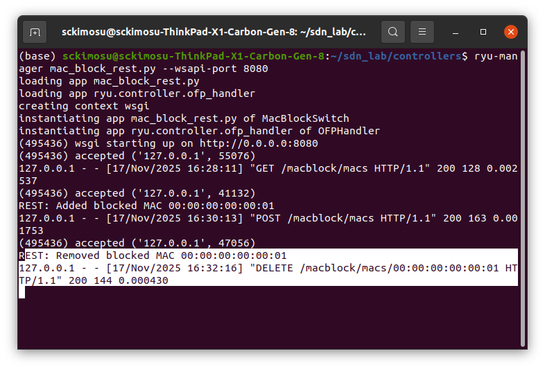

---

### Mininet 확인

- 명령

```bash
sudo mn --controller=remote,ip=127.0.0.1,port=6653 \
        --topo single,3 \
        --switch ovsk,protocols=OpenFlow13

```

- 실행화면

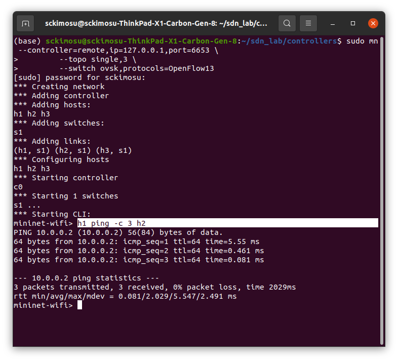

- 컨트롤러 로그 응답 화면

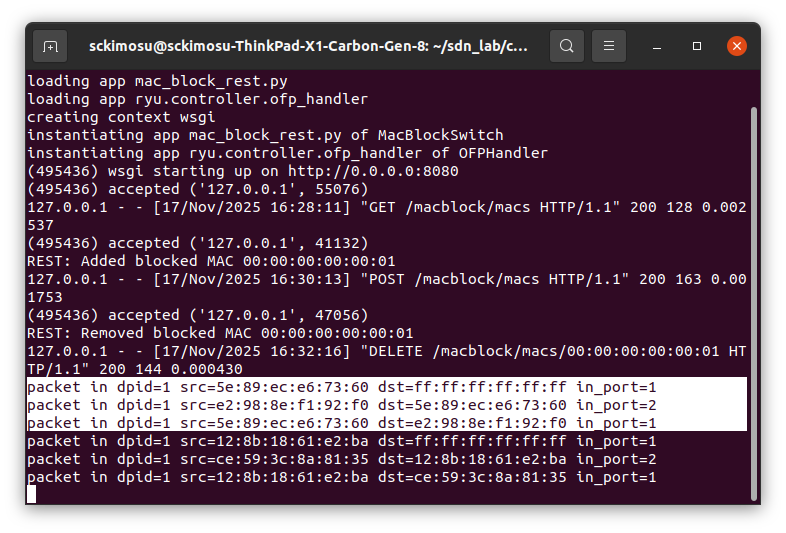

### REST 방식 h1 MAC 차단

```bash
curl -X POST http://127.0.0.1:8080/macblock/macs \
  -H "Content-Type: application/json" \
  -d '{"mac": "00:00:00:00:00:01"}'

```

- 명령
    
    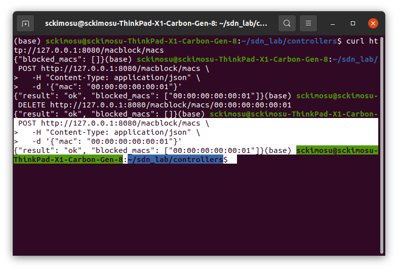
    
- 컨트롤러 로그 응답 화면
    
    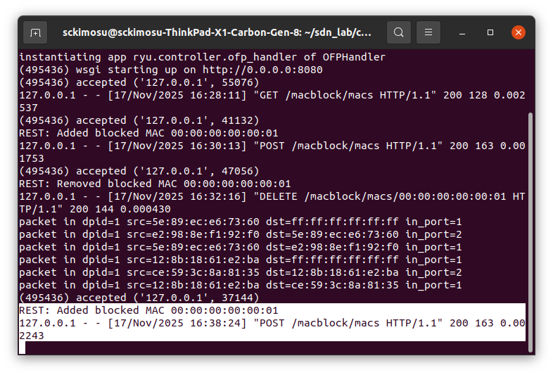
    
    ### Mininet 에서 차단 확인
    
    - ping 안 가면 성공

```bash
mininet> h1 ping -c 3 h2

```

### REST 실행 명령

```bash
# 차단 목록 조회
curl http://127.0.0.1:8080/macblock/macs

# MAC 추가
curl -X POST http://127.0.0.1:8080/macblock/macs \
  -H "Content-Type: application/json" \
  -d '{"mac": "00:00:00:00:00:01"}'

# MAC 삭제
curl -X DELETE http://127.0.0.1:8080/macblock/macs/00:00:00:00:00:01

```

## `curl`

- **Command-Line URL**
    - 터미널에서 **HTTP 요청(REST API)** 을 보낼 때 사용하는 가장 대표적인 도구
    - 터미널에서 웹 서버(예: Ryu 컨트롤러)와 직접 통신하기 위해 사용하는 명령어 도구
        - 웹 브라우저
            - 사람이 클릭해서 요청함
        - curl
            - 컴퓨터가 명령어로 요청함
                - 브라우저 주소창에 입력하는 대신 터미널에서 아래 명령어 입력
                - 웹 페이지 내용을 가져옴
- 서버가 제공하는 **REST API 테스트** 가능
- 웹 브라우저 없이 HTTP 통신 가능
- JSON 데이터 전송 가능
- 자동화 스크립트(shell script)와 연동 가능
- Mininet / Ryu 같은 SDN 실험에서 컨트롤러를 직접 제어 가능
    - SDN 실험, DevOps, 서버 테스트 등에서 많이 사용

```bash
curl http://example.com

```

### GET 요청 (정보 가져오기)

```bash
curl http://127.0.0.1:8080/macblock/macs

```

### POST 요청 (데이터 보내기)

```bash
curl -X POST URL -d 데이터

```

### JSON 데이터 보내기

```bash
curl -H "Content-Type: application/json" \
     -d '{"mac":"00:00:00:00:00:01"}' \
     -X POST http://127.0.0.1:8080/macblock/macs

```

### DELETE 요청 (삭제)

```bash
curl -X DELETE URL

```

### curl 설치 확인

```bash
curl --version

```

| 기능 | 설명 |
| --- | --- |
| curl | 터미널에서 웹 요청을 보낼 수 있는 명령어 |
| GET | 데이터 가져오기 |
| POST | 데이터 추가/보내기 |
| DELETE | 삭제 요청 |
| JSON 전송 | `-H` + `-d` 옵션 |

---

### ****`curl` 옵션 **`-H`, `-d`, `-X`**

- `H` (= Header)
    - HTTP 요청 헤더(Header) 설정
    - 이 요청은 JSON 데이터를 보낸다라는 의미
    - 서버(Ryu 컨트롤러)에게 **보내는 데이터 형식이 JSON이라는 것을 알려주는 헤더**

---

```
-H "Content-Type: application/json"

```

- `d` (= Data)
    - 서버로 **보낼 데이터(payload)**
        - 이 JSON 객체를 요청 본문(body)에 실어서 보냄
        - POST/DELETE/PUT 같은 요청에서 **데이터 전송**할 때 반드시 사용

```
-d {"mac":"00:00:00:00:00:01"}

```

- `X` (= Method)
    - HTTP 요청 방식 지정
        - GET
        - POST
        - PUT
        - DELETE

```
-X POST

```

```
POST 요청을 보내라

```

### curl -H "Content-Type: application/json" \
     -d '{"mac":"00:00:00:00:00:01"}' \
     -X POST http://127.0.0.1:8080/macblock/macs

- POST 방식으로 JSON 데이터를 담아 해당 URL로 전송해라
- Ryu 컨트롤러에게 MAC 주소(00:00:00:00:00:01)를 차단 목록에 추가하라는 의미

```
curl -H "Content-Type: application/json" \
     -d '{"mac":"00:00:00:00:00:01"}' \
     -X POST http://127.0.0.1:8080/macblock/macs

```

| 옵션 | 의미 | 설명 |
| --- | --- | --- |
| `-H` | Header | 데이터 형식(예: JSON) 지정 |
| `-d` | Data | 서버로 보낼 데이터(body) |
| `-X` | Method | 요청 방식 지정 (POST/DELETE…) |

### 1. import

- Ryu 기본 앱, 이벤트, 핸들러, OpenFlow 1.3, 패킷 파서 등 기본 import
- `WSGIApplication, ControllerBase, route`
    - Ryu의 REST API(WEB 서버) 기능
- `Response`
    - HTTP 응답 객체
- `MACBLOCK_INSTANCE_NAME`
    - REST 컨트롤러에서 RyuApp 인스턴스를 가져올 때 사용하는 키

```python
from ryu.base import app_manager
from ryu.controller import ofp_event
from ryu.controller.handler import MAIN_DISPATCHER, CONFIG_DISPATCHER, set_ev_cls
from ryu.ofproto import ofproto_v1_3
from ryu.lib.packet import packet
from ryu.lib.packet import ethernet
from ryu.lib.packet import ether_types

from ryu.app.wsgi import WSGIApplication, ControllerBase, route
from webob import Response
import json

MACBLOCK_INSTANCE_NAME = 'mac_block_app'

```

### **1-1.  WSGIApplication**

- Ryu 안에서 REST API 웹 서버를 실행하도록 해주는 모듈
    - Ryu는 기본적으로 OpenFlow 컨트롤러지만, WSGI(웹 서버 게이트웨이 인터페이스)를 이용해 **REST API 서버**도 함께 구성
    - 이를 위해 Ryu에서 제공하는 클래스가 **WSGIApplication**
        - REST API URL 라우팅 등록
        - ControllerBase 객체 생성
        - 웹 서버 포트 관리 (`-wsapi-port 8080`)

```python
_CONTEXTS = {"wsgi": WSGIApplication}

```

### **1-2. ControllerBase**

- REST API 요청을 실제로 처리하는 클래스 WSGIApplication이 웹 서버를 띄우는 것이라면, ControllerBase는 **요청을 처리하는 컨트롤러 클래스(=웹 핸들러)**
- ControllerBase가 하는 일
    - HTTP 요청 처리
    - JSON 파싱
    - 응답 생성
    - Ryu 앱(MacBlockSwitch)과 연결
- 웹 서버(WsgiApp) ↔ 요청 처리(ControllerBase) ↔ Ryu App 로직

```python
class MacBlockAPIController(ControllerBase):
    ...

```

### 1-3. **route**

- REST API URL을 등록하는 데 사용하는 데코레이터
- POST /macblock/macs 요청이 들어오면 add_mac 함수 실행

```python
@route('macblock', '/macblock/macs', methods=['POST'])
def add_mac(self, req, **kwargs):

```

| 항목 | 설명 |
| --- | --- |
| `'macblock'` | 이 REST API 그룹 이름 |
| `/macblock/macs` | URL 경로 |
| `methods=['POST']` | HTTP 메서드 제한 (POST만 허용 |

### 1-4. **Response**

- REST API 응답 객체 (HTTP Response) ControllerBase 안에서 반드시 Response 객체를 반환
- Response는 다음을 포함할 수 있음
    - `status` (200, 400, 403, 404 등)
    - `body` (문자열 or JSON)
    - `content_type` (“application/json” 등)

```python
return Response(status=200, body="Added XX:XX")

```

### 1-5. **MACBLOCK_INSTANCE_NAME**

- Ryu App 인스턴스를 WSGI와 연결하기 위한 key 이름
    - Ryu 구조상 REST API 컨트롤러(ControllerBase)와 로직(MacBlockSwitch)은 서로 다른 객체
    - 그래서 WSGI에 등록할 때
        - 이런 방식으로 **Ryu App(self)** 을 REST API 컨트롤러에 전달
        - ControllerBase에서는 이렇게 받아서 사용함:

```python
MACBLOCK_INSTANCE_NAME = 'mac_block_api_app'

wsgi.register(MacBlockAPIController,
              {MACBLOCK_INSTANCE_NAME: self})

```

- `MacBlockSwitch` = 진짜 로직
- `MacBlockAPIController` = REST API 라우터
- 둘을 연결해주는 이름이 **MACBLOCK_INSTANCE_NAME**

```python
self.mac_app = data[MACBLOCK_INSTANCE_NAME]

```

### 1-6. 구조

```
브라우저/curl → (WSGIApplication 웹 서버)
               → ControllerBase (URL route 처리)
               → Ryu App 인스턴스 (MacBlockSwitch 로직)
               → Response 로 결과 반환

```

---

## 2. MacBlockSwitch (Ryu 앱 본체)

- 이 클래스가 OpenFlow 컨트롤러 역할을 하는 Ryu 앱
- `OFP_VERSIONS`
    - OpenFlow 1.3 사용.
- `_CONTEXTS` :
    - Ryu에게 “나 wsgi 쓸 거니까, `wsgi` 컨텍스트 만들어줘!”라고 요청하는 부분
    - 이 덕분에 `__init__`에서 `kwargs['wsgi']`로 WSGI 인스턴스를 받을 수 있음.

```python
class MacBlockSwitch(app_manager.RyuApp):
    OFP_VERSIONS = [ofproto_v1_3.OFP_VERSION]

    _CONTEXTS = {
        'wsgi': WSGIApplication,
    }

```

### 2-1. 초기화

- `self.mac_to_port`
    - L2 learning용 테이블
    - `self.mac_to_port[dpid][mac] = port`
- `self.blocked_macs`
    - **REST로 관리될 차단 MAC 주소 집합**
- `wsgi.register(...)`
    - WSGI 서버에 `MacBlockController` REST 컨트롤러를 등록
    - `{MACBLOCK_INSTANCE_NAME: self}`를 넘겨서 컨트롤러에서 `self.mac_app`으로 이 RyuApp 인스턴스를 사용할 수 있게 함

```python
    def __init__(self, *args, **kwargs):
        super(MacBlockSwitch, self).__init__(*args, **kwargs)
        self.mac_to_port = {}
        self.blocked_macs = set()

        wsgi = kwargs['wsgi']
        wsgi.register(MacBlockController, {MACBLOCK_INSTANCE_NAME: self})

```

---

## 3. 스위치 Features 핸들러 (기본 룰 설치)

- 스위치가 처음 컨트롤러에 연결될 때 호출
- `match = OFPMatch()`
    - 모든 패킷에 매칭 (기본 룰)
- 액션
    - 패킷을 **컨트롤러로 보내기**
- 이걸 `priority=0`으로 설치해서, 다른 룰이 없을 때는 항상 PacketIn이 오도록 만듦.

```python
    @set_ev_cls(ofp_event.EventOFPSwitchFeatures, CONFIG_DISPATCHER)
    def switch_features_handler(self, ev):
        datapath = ev.msg.datapath
        ofproto = datapath.ofproto
        parser = datapath.ofproto_parser

        match = parser.OFPMatch()
        actions = [parser.OFPActionOutput(
            ofproto.OFPP_CONTROLLER,
            ofproto.OFPCML_NO_BUFFER)]
        self.add_flow(datapath, priority=0, match=match, actions=actions)

```

---

## 4. add_flow 헬퍼 함수

- FlowMod를 만들고 스위치에 전송하는 공통 함수.
- `priority`, `match`, `actions`, `idle_timeout`, `hard_timeout` 등 받음.
- `buffer_id`가 있으면 그 버퍼에 있는 패킷 처리까지 같이 수행.

```python
    def add_flow(self, datapath, priority, match, actions,
                 buffer_id=None, idle_timeout=0, hard_timeout=0):
        ...
        inst = [parser.OFPInstructionActions(
            ofproto.OFPIT_APPLY_ACTIONS,
            actions)]
        ...
        mod = parser.OFPFlowMod(..., match=match, instructions=inst)
        datapath.send_msg(mod)

```

## 5. Packet-In 핸들러 (핵심 로직)

- Packet-In이 들어올 때마다 호출.
- `dpid`: 스위치 ID
- `in_port`: 패킷이 들어온 포트 번호
- `pkt` / `eth`: 수신 패킷의 이더넷 헤더

```python
    @set_ev_cls(ofp_event.EventOFPPacketIn, MAIN_DISPATCHER)
    def _packet_in_handler(self, ev):
        msg = ev.msg
        datapath = msg.datapath
        dpid = datapath.id
        ofproto = datapath.ofproto
        parser = datapath.ofproto_parser

        in_port = msg.match['in_port']

        pkt = packet.Packet(msg.data)
        eth = pkt.get_protocols(ethernet.ethernet)[0]

```

### 5-1. 불필요한 패킷 무시

- 목적지 MAC이 `33:33:...` → IPv6 멀티캐스트 → 무시
- LLDP 패킷 → 링크 발견용 → 무시

```python
        if eth.dst.startswith('33:33'):
            return

        if eth.ethertype == ether_types.ETH_TYPE_LLDP:
            return

```

### 5-2. MAC 주소, 로그 출력

- `src`, `dst` : 소문자로 변환해서 관리 (REST로 들어오는 값과 비교 편하게)

```python
        src = eth.src.lower()
        dst = eth.dst.lower()

        self.logger.info("packet in dpid=%s src=%s dst=%s in_port=%s",
                         dpid, src, dst, in_port)

```

### 5-3. MAC 차단 로직

- 소스나 목적지 MAC 중 하나라도 `self.blocked_macs` 안에 있으면
    - 로그 찍고
    - 그 MAC을 기준으로 하는 **DROP flow** 설치
        - `actions=[]`
            - 매칭 시 아무 행동도 안 함 = DROP
        - `priority=100`
            - 매우 높은 우선순위, 다른 룰보다 먼저 매칭
        - `idle_timeout=60`
            - 60초 동안 안 쓰이면 flow 자동 삭제
- `return`
    - 이 패킷은 더 이상 처리하지 않고 버림
    - 즉, REST API로 등록된 MAC은 이후부터 스위치에서 바로 차단됨

```python
        if src in self.blocked_macs or dst in self.blocked_macs:
            self.logger.info("BLOCKED MAC detected. Dropping packet (src=%s, dst=%s)", src, dst)

            if src in self.blocked_macs:
                match = parser.OFPMatch(eth_src=src)
            else:
                match = parser.OFPMatch(eth_dst=dst)

            self.add_flow(datapath,
                          priority=100,
                          match=match,
                          actions=[],
                          buffer_id=msg.buffer_id,
                          idle_timeout=60)
            return

```

### 5-4. L2 learning (MAC → 포트 학습)

- 이 스위치(dpid)에 대해 `src` MAC이 어느 포트에서 들어왔는지 기록
- 나중에 `dst`로 패킷 보낼 때 flood 안 하고 단일 포트로 보낼 수 있게 됨

```python
        self.mac_to_port.setdefault(dpid, {})
        self.mac_to_port[dpid][src] = in_port

```

### 5-5. 목적지 포트 결정 & flow 설치

```python
        if dst in self.mac_to_port[dpid]:
            out_port = self.mac_to_port[dpid][dst]
        else:
            out_port = ofproto.OFPP_FLOOD

        actions = [parser.OFPActionOutput(out_port)]

```

- `dst`를 이미 학습했으면
    - 그 포트로 전송
- 아니면
    - `OFPP_FLOOD`로 모든 포트로 뿌리기

```python
        if out_port != ofproto.OFPP_FLOOD:
            match = parser.OFPMatch(in_port=in_port, eth_src=src, eth_dst=dst)
            ...
            self.add_flow(..., actions=actions, idle_timeout=300)

```

- flood가 아니라면
    - `(in_port, src, dst)` 조합으로 flow 설치 (priority=1)
    - 이후 동일한 패턴의 패킷은 컨트롤러 안 거치고 스위치에서 바로 처리

### 5-6. 실제 PacketOut 전송

- 스위치에 버퍼가 없으면 패킷 데이터 함께 보내고,
- 아닌 경우 buffer_id만 전달
- 최종적으로 해당 포트로 패킷 내보냄

```python
        data = None
        if msg.buffer_id == ofproto.OFP_NO_BUFFER:
            data = msg.data

        out = parser.OFPPacketOut(..., actions=actions, data=data)
        datapath.send_msg(out)

```

---

## 6. MacBlockController (REST API 컨트롤러)

- HTTP 요청을 처리하는 클래스
- `self.mac_app`
    - 이전 `wsgi.register`에서 넘겨준 `MacBlockSwitch` 인스턴스
        - REST 핸들러에서 `self.mac_app.blocked_macs`를 조작

```python
class MacBlockController(ControllerBase):

    def __init__(self, req, link, data, **config):
        super(MacBlockController, self).__init__(req, link, data, **config)
        self.mac_app = data[MACBLOCK_INSTANCE_NAME]

```

### 6-1. 차단 MAC 목록 조회 (GET)

- `GET /macblock/macs`
- 현재 차단된 MAC 목록을 JSON으로 반환

```python
    @route('macblock', '/macblock/macs', methods=['GET'])
    def list_blocked_macs(self, req, **kwargs):
        body = {
            "blocked_macs": sorted(list(self.mac_app.blocked_macs))
        }
        return self._json_response(body)

```

### 6-2. MAC 추가 (POST)

- 요청 body(JSON)를 파싱해서 `"mac"` 필드를 가져옴.

```python
    @route('macblock', '/macblock/macs', methods=['POST'])
    def add_blocked_mac(self, req, **kwargs):
        try:
            content = req.body.decode('utf-8')
            data = json.loads(content)
            mac = data.get('mac', '').lower()
        except Exception:
            ...

```

- `{"mac": "00:00:00:00:00:01"}`
    - MAC이 비어 있으면 400 에러
    - 그렇지 않으면 `blocked_macs`에 추가하고 현재 목록 반환

```python
        if not mac:
            return self._json_response({"error": "mac is required"}, status=400)

        self.mac_app.blocked_macs.add(mac)
        self.mac_app.logger.info("REST: Added blocked MAC %s", mac)

        return self._json_response({
            "result": "ok",
            "blocked_macs": sorted(list(self.mac_app.blocked_macs))
        })

```

### 6-3. MAC 삭제 (DELETE)

- `DELETE /macblock/macs/<MAC주소>`
- URL path에 있는 MAC을 받아서 set에서 제거

```python
    @route('macblock', '/macblock/macs/{mac}', methods=['DELETE'])
    def delete_blocked_mac(self, req, mac, **kwargs):
        mac = mac.lower()
        if mac in self.mac_app.blocked_macs:
            self.mac_app.blocked_macs.remove(mac)
            ...
        else:
            ...

```

## 7. JSON 응답 헬퍼

- Python 딕셔너리
    - JSON 문자열로 변환
- `charset='utf-8'`을 명시해서 WebOb의 charset 없이 text body 금지 에러 해결
- REST 핸들러들이 전부 이 함수를 써서 응답

```python
    def _json_response(self, data, status=200):
        body = json.dumps(data)
        return Response(
            content_type='application/json',
            body=body,
            status=status,
            charset='utf-8'
        )

```

---

## 8. 실험

### **Ryu 앱 실행**

```bash
ryu-manager mac_block_rest.py --wsapi-port 8080

```

- 스위치가 연결되면
    - 모든 패킷을 컨트롤러로 보내는 기본 flow 설치
- REST API로
    - `POST /macblock/macs`
        - `blocked_macs`에 MAC 추가
    - `DELETE /macblock/macs/{mac}`
        - 차단 해제
    - `GET /macblock/macs`
        - 목록 확인
- 패킷이 들어오면
    - 차단 MAC 관련이면
        - DROP flow(priority 100) 설치하고 버림
    - 아니면
        - MAC learning + 필요 시 flow 설치해서 L2 스위치처럼 동작

---

### Ryu 실행 화면


### 차단 목록 조회 화면

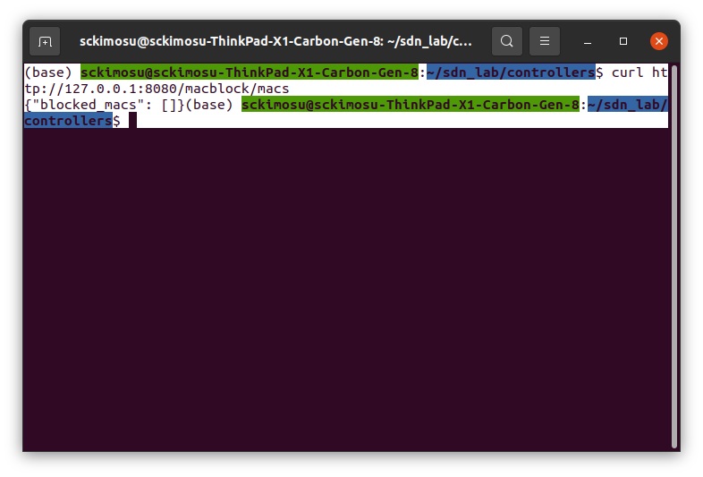

### 컨트롤러 화면


### REST MAC 추가

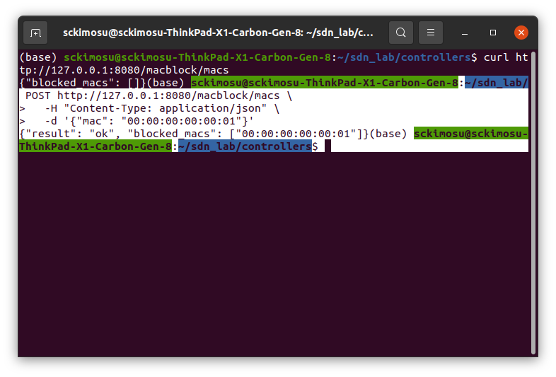

### REST MAC 삭제

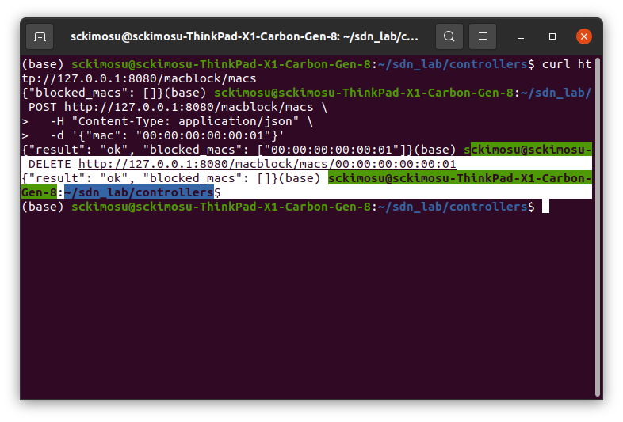

### 컨트롤러 화면

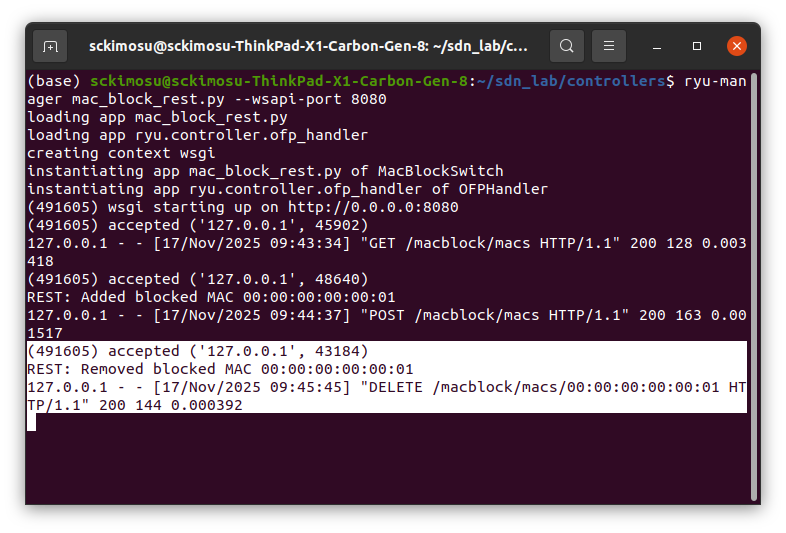

### **h1의 인터페이스 MAC 주소 (`12:8b:18:61:e2:ba`) 이용 추가/삭제하는 코드**

- h1 ifconfig 로 h1 MAC 주소 파악
    - ether 12:8b:18:61:e2:ba
        
        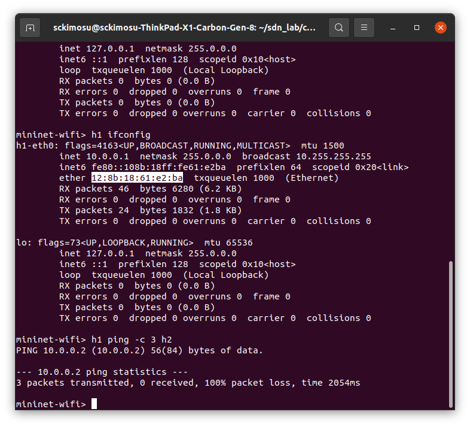
        

```bash
ryu-manager --ofp-tcp-listen-port 6653 mac_block_app.py

```

- 추가
    - `POST /macblock/macs`
- 삭제
    - `DELETE /macblock/macs/{mac}`
- Ryu 실행
    - WSGI(REST) 포트는 기본 8080

---

### h1 MAC을 직접 지정해서 추가/삭제 (curl 버전)

- `h1 ifconfig` 해서 MAC 알고 있으니까, 그냥 하드코딩해서 REST 호출

### `POST /macblock/macs`  추가

- 추가 (차단)

```bash
curl -X POST http://127.0.0.1:8080/macblock/macs \
  -H "Content-Type: application/json" \
  -d '{"mac": **"12:8b:18:61:e2:ba"}**'

```

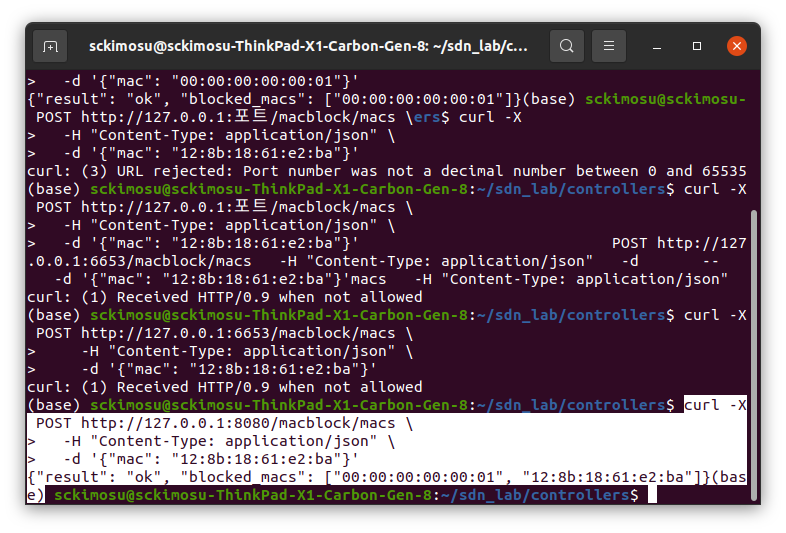

### 미니넷 확인


### 컨트롤러 확인

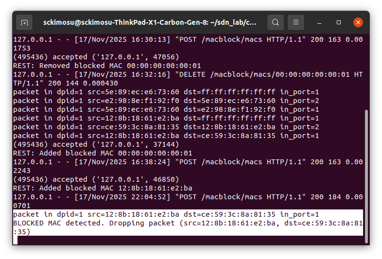

### `DELETE /macblock/macs/{mac}`  삭제 (차단 해제)

```bash
curl -X DELETE http://127.0.0.1:8080/macblock/macs/**12:8b:18:61:e2:ba**

```

### 명령 터미널에서 명령어 입력

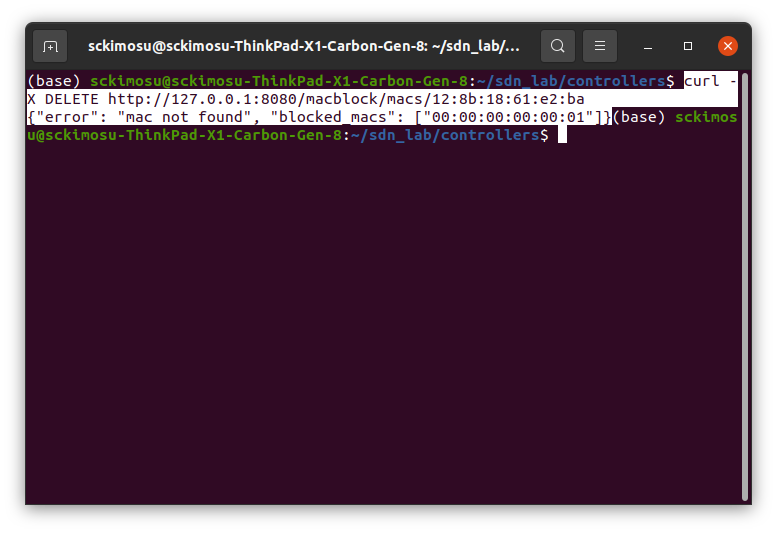

### 컨트롤러 확인

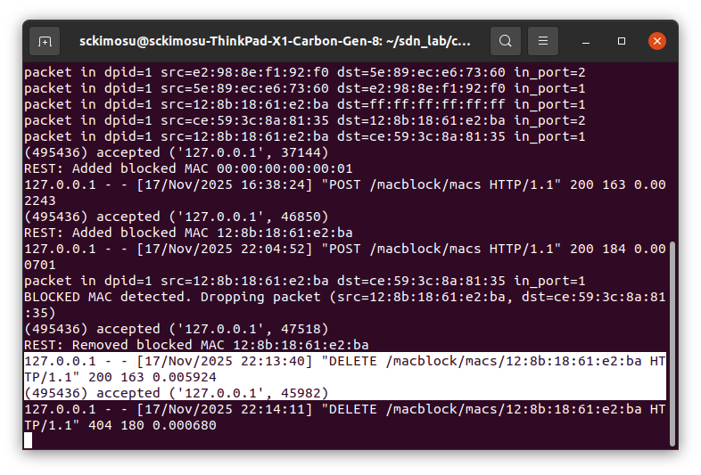

### 미니넷 화면

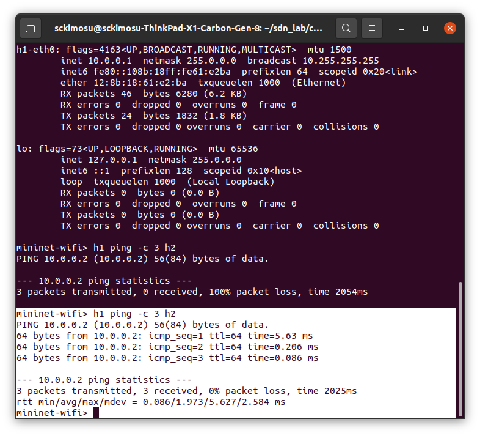

### 컨트롤러 화면


- OpenFlow 포트(6653)는 **스위치–컨트롤러 통신용**
- REST는 **WSGI 포트(기본 8080)** 에서 서비스됨
    - 그쪽으로 curl/requests를 보내야 함.
- h1 MAC `12:8b:18:61:e2:ba` 기준으로
    - `POST /macblock/macs` 로 추가
    - `DELETE /macblock/macs/{mac}` 로 삭제
