# [12주차_1차시] 특정 MAC 주소 차단 L2 Learning Switch

### **Ryu 컨트롤러 + Mininet 토폴로지 조합**

- **h1, h2를 막고 h3만 통신되게** 구성
- mac_block_ryu.py

```python
from ryu.base import app_manager
from ryu.controller import ofp_event
from ryu.controller.handler import MAIN_DISPATCHER, CONFIG_DISPATCHER, set_ev_cls
from ryu.ofproto import ofproto_v1_3
from ryu.lib.packet import packet
from ryu.lib.packet import ethernet
from ryu.lib.packet import ether_types

class MacBlockSwitch(app_manager.RyuApp):
    OFP_VERSIONS = [ofproto_v1_3.OFP_VERSION]

    # 차단할 MAC 주소 (원하는 것만 남기기)
    BLOCKED_MACS = {
        "00:00:00:00:00:01",   # 예: h1 만 차단
        # "00:00:00:00:00:02",
    }

    def __init__(self, *args, **kwargs):
        super(MacBlockSwitch, self).__init__(*args, **kwargs)
        self.mac_to_port = {}

    @set_ev_cls(ofp_event.EventOFPSwitchFeatures, CONFIG_DISPATCHER)
    def switch_features_handler(self, ev):
        datapath = ev.msg.datapath
        ofproto = datapath.ofproto
        parser = datapath.ofproto_parser

        match = parser.OFPMatch()
        **actions** = [parser.OFPActionOutput(ofproto.OFPP_CONTROLLER,
                                          ofproto.OFPCML_NO_BUFFER)]
        self.**add_flow**(datapath, priority=0, match=match, actions=actions)

    def add_flow(self, datapath, priority, match, actions,
                 buffer_id=None, idle_timeout=0, hard_timeout=0):
        ofproto = datapath.ofproto
        parser = datapath.ofproto_parser

        **inst** = [parser.OFPInstructionActions(ofproto.OFPIT_APPLY_ACTIONS,
                                             actions)]

        if buffer_id is not None and buffer_id != ofproto.OFP_NO_BUFFER:
            mod = parser.**OFPFlowMod**(datapath=datapath,
                                    buffer_id=buffer_id,
                                    priority=priority,
                                    idle_timeout=idle_timeout,
                                    hard_timeout=hard_timeout,
                                    match=match,
                                    instructions=**inst**)
        else:
            mod = parser.OFPFlowMod(datapath=datapath,
                                    priority=priority,
                                    idle_timeout=idle_timeout,
                                    hard_timeout=hard_timeout,
                                    match=match,
                                    instructions=inst)
        datapath.send_msg(mod)

    @set_ev_cls(ofp_event.EventOFPPacketIn, MAIN_DISPATCHER)
    def _packet_in_handler(self, ev):
        msg = ev.msg
        datapath = msg.datapath
        dpid = datapath.id
        ofproto = datapath.ofproto
        parser = datapath.ofproto_parser

        in_port = msg.match['in_port']

        pkt = packet.Packet(msg.data)
        eth = pkt.get_protocols(ethernet.ethernet)[0]

        # IPv6 멀티캐스트(33:33:xx:xx:xx:xx)는 무시
        if eth.dst.startswith('33:33'):
            return

        # LLDP 등은 무시
        if eth.ethertype == ether_types.ETH_TYPE_LLDP:
            return

        src = eth.src.lower()
        dst = eth.dst.lower()

        self.logger.info("packet in dpid=%s src=%s dst=%s in_port=%s",
                         dpid, src, dst, in_port)

        # === MAC 차단 로직 ===
        if src in self.BLOCKED_MACS or dst in self.BLOCKED_MACS:
            self.logger.info("BLOCKED MAC detected. Dropping packet (src=%s, dst=%s)", src, dst)

            if src in self.BLOCKED_MACS:
                match = parser.OFPMatch(eth_src=src)
            else:
                match = parser.OFPMatch(eth_dst=dst)

            self.**add_flow**(datapath,
                          priority=100,
                          match=match,
                          actions=[],
                          buffer_id=msg.buffer_id,
                          idle_timeout=60)
            return

        # === L2 learning ===
        self.mac_to_port.setdefault(dpid, {})
        self.mac_to_port[dpid][src] = in_port

        if dst in self.mac_to_port[dpid]:
            out_port = self.mac_to_port[dpid][dst]
        else:
            out_port = ofproto.OFPP_FLOOD

        actions = [parser.OFPActionOutput(out_port)]

        if out_port != ofproto.OFPP_FLOOD:
            match = parser.OFPMatch(in_port=in_port, eth_src=src, eth_dst=dst)
            if msg.buffer_id != ofproto.OFP_NO_BUFFER:
                self.add_flow(datapath,
                              priority=1,
                              match=match,
                              actions=actions,
                              buffer_id=msg.buffer_id,
                              idle_timeout=300)
                return
            else:
                self.add_flow(datapath,
                              priority=1,
                              match=match,
                              actions=actions,
                              idle_timeout=300)

        data = None
        if msg.buffer_id == ofproto.OFP_NO_BUFFER:
            data = msg.data

        out = parser.OFPPacketOut(datapath=datapath,
                                  buffer_id=msg.buffer_id,
                                  in_port=in_port,
                                  actions=actions,
                                  data=data)
        datapath.send_msg(out)

```

## 1. import 부분

```python
from ryu.base import app_manager
from ryu.controller import ofp_event
from ryu.controller.handler import MAIN_DISPATCHER, CONFIG_DISPATCHER, set_ev_cls
from ryu.ofproto import ofproto_v1_3
from ryu.lib.packet import packet
from ryu.lib.packet import ethernet
from ryu.lib.packet import ether_types

```

- `app_manager.RyuApp`
    - Ryu 애플리케이션의 기본 클래스.
- `ofp_event`
    - OpenFlow와 관련된 이벤트들
    - 예: SwitchFeatures, PacketIn 등
- `set_ev_cls`
    - 특정 이벤트가 발생했을 때 실행할 핸들러 함수를 등록하는 데 사용.
- `ofproto_v1_3`
    - OpenFlow 1.3 프로토콜 정의.
- `packet`, `ethernet`, `ether_types`
    - 패킷 파싱용 라이브러리.

---

## 2. 클래스 정의와 OpenFlow 버전 지정

```python
class MacBlockSwitch(app_manager.RyuApp):
    OFP_VERSIONS = [ofproto_v1_3.OFP_VERSION]

```

- `MacBlockSwitch`
    - Ryu 애플리케이션
- `OFP_VERSIONS`
    - 이 앱이 사용할 OpenFlow 버전 → **1.3**으로 지정

---

## 3. 차단할 MAC 주소 목록

```python
    BLOCKED_MACS = {
        "00:00:00:00:00:01",   # 예: h1 만 차단
        # "00:00:00:00:00:02",
    }

```

- 집합(`set`) 안에 있는 MAC 주소는 **통신이 차단됨**
    - 현재는 `"00:00:00:00:00:01"`만 막는 상태.
    - 주석 풀면 다른 MAC도 쉽게 추가 가능

---

## 4. 초기화 함수

```python
    def __init__(self, *args, **kwargs):
        super(MacBlockSwitch, self).__init__(*args, **kwargs)
        self.**mac_to_port** = {}

```

- 부모 클래스 초기화 호출
- `self.mac_to_port`
    - **learning switch** 기능을 위한 **MAC → 포트 매핑** 테이블
        - `self.mac_to_port[dpid][mac] = port`

---

## 5. 스위치 접속 시

### `@set_ev_cls`

- **Ryu에서 이벤트(Event)를 처리하는 함수를 등록하는 데 사용하는 데코레이터**
    - 이 함수는 어떤 OpenFlow 이벤트가 발생했을 때 실행해라라고 Ryu에게 알려주는 표시

---

```python
@**set_ev_cls**(**EVENT**, **STATE**)
def handler(self, ev):
    ...

```

- **EVENT**
    - 처리할 이벤트 종류
        - PacketIn, SwitchFeatures 등
- **STATE**
    - 이벤트가 발생할 때 Ryu 앱의 상태
        - MAIN_DISPATCHER, CONFIG_DISPATCHER 등

---

- **SwitchFeatures** (스위치 처음 연결 **EVENT**) —> **switch_features_handler** (**EVENT 핸들러)**
    - 스위치가 컨트롤러에 처음 연결되면 실행
    - table-miss flow 설치에 사용됨

```python
@set_ev_cls(ofp_event.**EventOFPSwitchFeatures**, **CONFIG_DISPATCHER**)
def switch_features_handler(self, ev):
    ...

```

---

- **PacketIn** (스위치 → 컨트롤러 패킷 전송 **EVENT**) —> **packet_in_handler** (**EVENT 핸들러)**
    - 스위치가 controller 로 보낸 패킷이 있을 때 실행
    - L2 learning, 방화벽, 라우팅, MAC 차단 등 핵심 로직

```python
@set_ev_cls(ofp_event.**EventOFPPacketIn**, **MAIN_DISPATCHER**)
def packet_in_handler(self, ev):
    ...

```

---

- Ryu 상태 (DISPATCHER)
    - **STATE :** CONFIG_DISPATCHER
        - 스위치가 **OpenFlow handshake** 중일 때
        - 주로 SwitchFeatures 이벤트에 사용
    - **STATE :** MAIN_DISPATCHER
        - 스위치가 **연결 완료 후** 정상 동작하는 상태
        - PacketIn, FlowRemoved 등 처리

---

- SwitchFeatures 이벤트 처리

```python
@set_ev_cls(ofp_event.**EventOFPSwitchFeatures**, **CONFIG_DISPATCHER**)
def switch_features_handler(self, ev):
    # 스위치 연결 직후 table-miss flow 설치

```

- PacketIn 처리

```python
@set_ev_cls(ofp_event.**EventOFPPacketIn**, **MAIN_DISPATCHER**)
def packet_in_handler(self, ev):
    # 스위치에서 온 트래픽 처리

```

---

### @set_ev_cls

- 이 함수를 특정 OpenFlow 이벤트가 발생했을 때 실행해라라고 Ryu에게 알려주는 트리거(Trigger)
- Ryu는 **Event-driven(이벤트 기반)** 구조이기 때문
- 스위치에서 다양한 이벤트가 발생
- 컨트롤러가 이벤트를 직접 정의하고 처리하는 함수가 바로`@set_ev_cls` 로 등록한 함수

| 이벤트 종류 | 설명 |
| --- | --- |
| **EventOFPSwitchFeatures** | 스위치가 연결되었을 때 |
| **EventOFPPacketIn** | 패킷 인이 왔을 때 |
| **EventOFPFlowRemoved** | 플로우 삭제되었을 때 |
| **EventOFPPortStatus** | 포트 상태 변경 |
| **EventOFPHello** | 연결 초기 핸드셰이크 |
- **일부 EVENT 는 특정 STATE 에서만 발생할 뿐**,`EVENT + STATE`는 그 조합이 가능한 범위 안에서 개발자가 지정하는 것
    - EVENT 는 스위치가 보내는 메시지 종류
    - **STATE 는 Ryu 앱의 상태(연결 단계)**
    - 두 값이 필수로 하나씩 매칭되어 있는 관계는 아님
- **EVENT**
    - OpenFlow 메시지 종류

| EVENT | 의미 |
| --- | --- |
| EventOFPSwitchFeatures | 스위치 연결 직후 기능 협상 |
| EventOFPPacketIn | Packet-In 수신 |
| EventOFPPortStatus | 포트 상태 변화 |
| EventOFPFlowRemoved | Flow 삭제 시 알림 |
- **STATE**
    - Ryu 앱의 State Machine 단계
    - OpenFlow 연결 과정에서 Ryu는 연결 상태를 다음처럼 유지

| STATE | 의미 |
| --- | --- |
| HANDSHAKE_DISPATCHER | OF 핸드셰이크 중 |
| CONFIG_DISPATCHER | 스위치 기능 협상 완료 |
| MAIN_DISPATCHER | 정상 동작 상태 |
| DEAD_DISPATCHER | 연결 종료 |
- EVENT 자체는 STATE 와 직접 연결되어 있지 않음
    - 특정 **EVENT는 특정 STATE에서만 발생**
- EventOFPSwitchFeatures
    - OpenFlow Handshake 이후 스위치가 FEATURES_REPLY 메시지를 보낼 때 발생
    - 이 시점의 Ryu STATE는 `CONFIG_DISPATCHER`
    - 이 조합이 정해진 규칙처럼 보임

```python
@set_ev_cls(EventOFPSwitchFeatures, CONFIG_DISPATCHER)

```

- SwitchFeatures 이벤트
    - 이 EVENT는 **CONFIG_DISPATCHER 상태에서만** 발생
    - 다른 STATE 에서는 의미 없음

```python
@set_ev_cls(EventOFPSwitchFeatures, CONFIG_DISPATCHER)

```

---

- Packet-In 이벤트
    - PACKET-IN 메시지는 **연결이 완전히 끝난 이후**, 즉 MAIN_DISPATCHER에서만 발생
    - CONFIG/HANDSHAKE 상태에서는 Packet-In이 없음

```python
@set_ev_cls(EventOFPPacketIn, MAIN_DISPATCHER)

```

---

- 이벤트가 엉뚱한 STATE와 연결하는 **데코레이터**
    - **절대 호출되지 않음**
    - CONFIG_DISPATCHER 상태에서는 Packet-In 이벤트가 발생하지 않기 때문.

```python
@set_ev_cls(EventOFPPacketIn, CONFIG_DISPATCHER)

```

- **스위치 접속 시 수행 내용**
    - EventOFPSwitchFeatures
        - 스위치가 컨트롤러에 처음 연결될 때 발생하는 이벤트
    - `match = parser.OFPMatch()`
        - **모든 패킷**에 매칭되는 룰
    - `actions = [OFPActionOutput(OFPP_CONTROLLER, ...)]`
        - 기본적으로 패킷을 **컨트롤러로 전송**
    - `priority=0`의 flow를 깔아서, 다른 룰이 없으면 패킷이 컨트롤러로 오게 함

```python
    @set_ev_cls(ofp_event.**EventOFPSwitchFeatures**, **CONFIG_DISPATCHER**)
    def **switch_features_handler**(self, ev):
        datapath = ev.msg.datapath
        ofproto = datapath.ofproto
        parser = datapath.ofproto_parser

        match = parser.OFPMatch()
        **actions** = [parser.OFPActionOutput(ofproto.OFPP_CONTROLLER,
                                          ofproto.OFPCML_NO_BUFFER)]
        self.add_flow(datapath, **priority**=0, match=match, actions=actions)

```

---

## `parser.OFPMatch()`

- **OpenFlow Flow Entry(플로우 항목)의 매칭 조건(match field)을 설정하는 객체**

| 코드 | 의미 |
| --- | --- |
| `parser.OFPMatch()` | 모든 패킷 매칭 (table-miss 용) |
| `parser.OFPMatch(**field**=value)` | 특정 조건의 패킷만 매칭 |
| match + actions | OpenFlow 흐름 규칙의 핵심 구조 |
- 어떤 패킷이 이 플로우 규칙과 일치하는지를 정의하는 것
    - 아래 예제에서는 아무 조건도 넣지 않았기 때문에 **모든 패킷과 매칭되는 규칙**을 의미
    - 이것이 흔히 사용되는 **테이블 미스(table-miss) 규칙**

```python
match = parser.OFPMatch()

```

- table-miss rule 만들기
    - 매칭 조건 없음 → 모든 패킷 매칭
    - priority=0 이므로 다른 플로우 규칙과 매칭 안 될 경우 실행
    - controller 로 packet-in

```python
match = parser.**OFPMatch**()
**actions** = [parser.OFPActionOutput(ofproto.**OFPP_CONTROLLER**)]
self.**add_flow**(datapath, 0, match, **actions**)

```

- MAC 기반 매칭
    - SRC MAC 이 00:00:00:00:00:01 인 패킷만 매칭

```python
match = parser.OFPMatch(eth_src="00:00:00:00:00:01")

```

- 목적지 MAC 기반

```python
match = parser.OFPMatch(eth_dst="00:00:00:00:00:02")

```

---

- IP 기반 매칭

```python
match = parser.OFPMatch(ipv4_src="10.0.0.1")
match = parser.OFPMatch(ipv4_dst="10.0.0.3")

```

---

- TCP/UDP 포트 기반

```python
match = parser.OFPMatch(ipv4_dst="10.0.0.3", tcp_dst=80)

```

---

- in_port 기반

```python
match = parser.OFPMatch(in_port=1)

```

---

- match 를 여러 조건 조합 가능
    - "10.0.0.1 → 10.0.0.3 로 TCP 80번 쓰는 IPv4 패킷"만 매칭

```python
match = parser.OFPMatch(
    eth_type=0x0800,         # IPv4
    ipv4_src="10.0.0.1",     # SRC IP
    ipv4_dst="10.0.0.3",     # DST IP
    tcp_dst=80               # TCP 80번 포트
)

```

---

- match 사용한 DROP 예제 (MAC 차단)
    - MAC blocker 코드에서
        - **해당 MAC 이 SRC 인 모든 패킷 drop**

```python
match = parser.OFPMatch(eth_src=src)
self.add_flow(datapath, 100, match, [])

```

---

## `actions`

- OpenFlow 스위치에게 이 패킷을 어떻게 처리하라고 지시하는 **행동(Action) 리스트**
- 컨트롤러 → 스위치로 내려보내는 실제 동작 명령 세트
- actions = 스위치가 해야 할 행동 목록
    - 스위치에게 **이 포트로 패킷을 보내라는 명령**

```python
actions = [ parser.**OFPActionOutput**(out_port) ]

```

- actions 를 구성하는 OpenFlow 행동들

| Action | 설명 |
| --- | --- |
| **OFPActionOutput(port)** | 패킷을 특정 포트로 전송 |
| OFPActionSetField(field=value) | MAC, IP, TCP포트 등 패킷 헤더 변조 |
| OFPActionPushVlan(0x8100) | VLAN 헤더 추가 |
| OFPActionPopVlan() | VLAN 헤더 제거 |
| OFPActionPushMpls() | MPLS 헤더 추가 |
| OFPActionPopMpls() | MPLS 제거 |
| OFPActionGroup(group_id) | 그룹 테이블 호출 (로드밸런싱 등) |
| **(빈 actions 리스트)** | 패킷 drop |

---

- 행동이 여러 개인 경우
    - 이 패킷의 목적지 IP를 10.0.0.99로 바꾸고
    - 3번 포트로 전송하라
    - NAT, 로드밸런싱에서 많이 쓰는 구조

```python
actions = [
    parser.**OFPActionSetField**(ipv4_dst="10.0.0.99"),
    parser.**OFPActionOutput**(3)
]

```

- actions = [] → DROP
    - 딱히 하라는 행동이 없음
        - 즉, **DROP (차단)**

```python
actions = []

```

- 해당 MAC 패킷을 항상 drop
    - 이게 지금 MAC blocker에서 사용한 방식.

```python
self.**add_flow**(datapath, priority=100, match=match, **actions**=[])

```

- actions가 적용되는 시점
    - actions 는 **FlowMod** 를 통해 스위치에 설치됨
    - 이후 스위치는 컨트롤러를 거치지 않고 **자체적으로 행동 실행**

```python
self.**add_flow**(datapath, priority, match, **actions**)

```

---

- PacketOut 에서도 actions 사용
    - PacketIn 후 즉시 전송할 때:

```python
out = parser.**OFPPacketOut**(
    datapath=dp,
    buffer_id=msg.buffer_id,
    in_port=in_port,
    **actions**=actions,
    data=data
)

```

---

## 6. add_flow 함수

- FlowMod 메시지 편하게 보내기 위한 헬퍼

```python
    def add_flow(self, datapath, priority, match, actions,
                 buffer_id=None, idle_timeout=0, hard_timeout=0):
        ofproto = datapath.ofproto
        parser = datapath.ofproto_parser

        **inst** = [parser.OFPInstructionActions(ofproto.OFPIT_APPLY_ACTIONS,
                                             actions)]

```

### `add_flow(datapath, priority=0, match=match, actions=actions)`

- **스위치(OpenFlow 스위치)의 Flow Table에 새로운 플로우 엔트리를 추가(Add)하는 함수 호출**
    - OpenFlow 컨트롤러가 스위치에 내리는 규칙 설치 명령
    - 스위치에게 match 조건에 맞는 패킷이 오면 actions 를 실행해라는 의미
        - priority=0은 table-miss rule

```python
self.add_flow(
    **datapath**,     # 어떤 **스위치에**?
    **priority**=0,   # 우선순위 0 (가장 낮음)
    match=match,  # 어떤 패킷을 매칭할지?
    actions=actions  # 매칭되면 어떤 행동을 할지?
)

```

- 스위치에 FlowMod(Flow 규칙 설치) 메시지를 보냄
    - priority=0 은 OpenFlow 규칙 중 **가장 낮은 우선순위**
    - **다른 어떤 규칙에도 매칭되지 않은 패킷만 처리**
    - **table-miss rule** 이라고 부름

```
OFPFlowMod(
    match = match,
    priority = 0,
    actions = actions
)

```

- match=parser.OFPMatch() → meaning
    - 아무 조건이 없기 때문에 모든 패킷에 매칭되는 규칙
    - 하지만 priority=0 이므로 **실제로는 마지막에 적용됨**

```python
match = parser.OFPMatch()

```

---

- actions → controller 로 보내기
    - table-miss rule에서 actions 는 보통 매칭된 패킷들을 컨트롤러에게 보내라 (Packet-In 유발)
    - 그래서 스위치는 처음에는 모든 패킷을 컨트롤러에게 보냄

```python
actions = [parser.OFPActionOutput(ofproto.OFPP_CONTROLLER)]

```

- `add_flow(datapath, 0, match, actions)` 실행 시
    - **FlowMod** 생성
    - 스위치로 전송
    - 스위치 Flow Table에 우선순위 0 규칙 등록
    - 모든 미매칭 패킷이 → Packet-In 형태로 컨트롤러로 올라감

---

### `inst`

- 이 flow가 적용될 때 수행할 **action 리스트**
- `datapath.send_msg(mod)`로 스위치에 flow 룰 설치
    - `idle_timeout`, `hard_timeout`으로 flow의 수명 제어
    - `idle_timeout`
        - 이 flow를 사용하는 패킷이 일정 시간 안 들어오면 삭제.
    - `hard_timeout`
        - 사용 여부와 관계없이 시간이 지나면 무조건 삭제

```python
        if **buffer_id** is **not None** and **buffer_id** != ofproto.**OFP_NO_BUFFER**:
            **mod** = parser.**OFPFlowMod**(datapath=datapath,
                                    **buffer_id**=**buffer_id**,
                                    priority=priority,
                                    idle_timeout=idle_timeout,
                                    hard_timeout=hard_timeout,
                                    match=match,
                                    instructions=**inst**)
        else:
            **mod** = parser.**OFPFlowMod**(datapath=datapath,
                                    priority=priority,
                                    idle_timeout=idle_timeout,
                                    hard_timeout=hard_timeout,
                                    match=match,
                                    instructions=**inst**)
        **datapath**.send_msg(**mod**)

```

### PacketIn과 **buffer_id**

- 스위치가 Packet-In과 함께 패킷 데이터 전체가 아니라 buffer_id(패킷 핸들)만 넘겨온 경우인지 확인하는 조건

```python
if buffer_id is not None and buffer_id != ofproto.OFPP_NO_BUFFER:

```

- OpenFlow의 핵심 구조: buffer_id
    - Packet-In 은 두 가지 방식으로 스위치 → 컨트롤러로 전달

---

- buffer_id ≠ NO_BUFFER (스위치가 패킷을 버퍼에 저장함)
    - 스위치는 패킷 내용을 다 보내지 않고, 내부 버퍼에 저장한 뒤
    - 같은 식으로 **식별번호만** 컨트롤러에 보냄
        - controller로 보내는 데이터량 감소
        - 스위치가 빠르게 패킷을 처리 가능

```
PacketIn: buffer_id = 5

```

- buffer_id = NO_BUFFER (패킷을 전체 data로 보냄)
    - 스위치는 패킷을 버퍼에 저장하지 않고 **원본 패킷 전체를 controller에 전송**

```
buffer_id = OFP_NO_BUFFER
data = <실제 패킷 전체>

```

---

- 조건의 의미
    - 스위치가 패킷을 버퍼에 저장해두었기 때문에, 그 패킷에 대해 FlowMod 를 buffer_id 와 함께 보낼 수 있다

```python
buffer_id is not None             **# buffer_id 필드가 존재하고**
and buffer_id != OFP_NO_BUFFER    **# 그 값이 “버퍼 안에 없음”이 아닐 때**

```

---

- 버퍼에 패킷이 있는 경우
    - FlowMod(buffer_id 포함) 1개만 보내면 됨
    - 스위치 처리
        - FlowMod 규칙 설치
        - buffer_id(버퍼 속 패킷)를 새 규칙에 맞게 즉시 처리
        - PacketOut을 추가로 보낼 필요 없음

---

- buffer_id == OFP_NO_BUFFER 인 경우
    - 스위치가 패킷 전체 data를 보냈다는 의미.
    - FlowMod + PacketOut(데이터 포함)을 둘 다 보내야 함
        - 그래서 else 블록에서 PacketOut 을 따로 보냄.

---

```
                     (PacketIn)
                +----------------+
                |  **Controller**    |
                +----------------+
                       ▲
  **buffer_id만 보냄**     |            **data 전체 보냄**
                       |
         **buffer_id**=**7**   |         **buffer_id** = **NO_BUFFER**
                       |
                +----------------+
                |   **Switch**       |
                +----------------+
           **패킷을 내부 버퍼에 저장한 경우**

```

---

| buffer_id 조건 | 의미 | 필요한 작업 |
| --- | --- | --- |
| buffer_id != NO_BUFFER | 패킷이 스위치 버퍼 안에 있음 | FlowMod 만 보내면 됨 |
| buffer_id == NO_BUFFER | 스위치가 패킷 전체를 보냄 | FlowMod + PacketOut 필요 |

```python
if buffer_id is not None and buffer_id != OFP_NO_BUFFER:

```

- **buffer_id가 있을 때**
    - 스위치가 PacketIn을 보낼 때 **해당 패킷을 스위치 내부 버퍼에 저장해둔 상태**

---

### **[방식 1] buffer_id 방식 : buffer_id is not None and buffer_id != OFP_NO_BUFFER:**

- **스위치가 패킷을 버퍼에 저장**
    - PacketIn에는
        - buffer_id (정수)
        - 패킷의 일부 헤더만 (보통 128 bytes 정도)
- 컨트롤러가 FlowMod(buffer_id 포함)를 보내면, 스위치는
    - flow 설치
    - buffer_id의 패킷을 룰에 맞게 처리
    - 두 동작을 자동으로 수행

### **[방식 2] NO_BUFFER 방식 (직접 PacketIn 방식) : else**

- **스위치가 패킷을 버퍼에 저장하지 않고**, **패킷 전체를 PacketIn 메시지에 직접 담아서** 보냄.
    - `buffer_id = OFP_NO_BUFFER`
        - 버퍼에 저장하지 않음
        - 컨트롤러는 패킷 전체를 이미 갖고 있기 때문에 스위치의 버퍼에 패킷을 남겨둘 필요 없음
        - 스위치가 PacketIn 메시지 안에 패킷 전체를 넣어서 컨트롤러로 보내면,
            - 패킷을 스위치에 버퍼링(buffering) 할 필요가 없음
            - PacketIn에 패킷 전체를 넣어 바로 보냄으로 스위치 버퍼에 저장할 필요가 없음

---

### 스위치 입장

- **buffer_id** 방식
    - 패킷 잠깐 보관 = 버퍼 필요
    - PacketIn에는 참조 번호만 전달
    - **FlowMod**로 처리 가능
- **NO_BUFFER** 방식
    - 버퍼에 저장 안 함
    - 패킷 전체를 PacketIn에 담아 보냄
    - 버퍼링 하지 않음
        - 스위치는 그 패킷을 버리고, 이후 컨트롤러의 지시(PacketOut)가 있어야만 패킷 전송 가능
        - PacketIn에 패킷 전체를 담아 보내면, 스위치는 패킷을 버퍼에 저장할 필요가 없음

### 스위치의 **No 버퍼링** 이유

- 메모리 절약
    - 스위치의 버퍼 리소스는 매우 제한됨’
    - PacketIn에서 항상 buffer_id를 쓰면 버퍼가 금방 가득 참
    - 그래서 많은 스위치는 PacketIn에 바로 패킷을 실어 버퍼 사용을 회피
- 성능 최적화
    - 일부 스위치는 PacketIn을 빠르게 컨트롤러로 보내기 위해 버퍼에 넣는 절차를 생략 (즉시 전달)
- 스위치 설정/구현 정책
    - OVS는 상황에 따라 buffer_id를 사용할 수도 있고, 사용하지 않을 수도 있음

---

### PacketIn with buffer_id : **buffer_id is not None and buffer_id != OFP_NO_BUFFER:**

- buffer_id가 붙은 PacketIn
    - 패킷이 스위치 버퍼에 저장되어 있고, 컨트롤러가 FlowMod(buffer_id 포함)를 주면 재사용하는 방식

```
OpenFlow **PacketIn**
  **buffer_id** = 12
  **data** = (packet header 128 bytes)

```

### PacketIn without buffer_id : else

- 패킷 전체를 PacketIn에 넣어 보내는 경우
    - 스위치 입장에서 버퍼링할 필요 없음
    - buffer_id = NO_BUFFER
    - 버퍼링할 필요가 없음

```
OpenFlow **PacketIn**
  **buffer_id** = **NO_BUFFER**
  data = (**full packet**, ex: 1500 bytes)

```

---

### buffer_id가 있을 때 FlowMod 처리

- 스위치가 PacketIn을 보낼 때 **해당 패킷을 스위치 내부 버퍼에 저장해둔 상태**

```
PacketIn:
    **buffer_id** = 10
    **data** = 패킷 일부만 포함

```

- 컨트롤러가 아래처럼 **buffer_id를 포함하여 스위치에 FlowMod를 보냄**

```python
**FlowMod**(**buffer_id**=10)

```

- 스위치는
    - Flow 룰을 설치하고
    - buffer_id=10에 저장된 패킷을 그 룰에 따라 즉시 처리
    - **FlowMod + PacketOut 두 동작을 한 번에 처리**하는 효과
    - 컨트롤러는 PacketOut을 따로 보내지 않아도 됨.

---

### buffer_id가 없을 때 FlowMod 처리

- 스위치가 **패킷을 버퍼에 저장하지 않고**, 패킷 전체를 PacketIn에 바로 넣어 컨트롤러로 보낸 상황
- 컨트롤러가 **FlowMod**만 보내면 스위치는 **Flow는 설치하지만 패킷은 버려짐**
- 그래서 추가적으로 **PacketOut**을 보내야 함

```
PacketIn:
    buffer_id = **NO_BUFFER**
    **data** = 패킷 전체 포함

```

```python
**FlowMod**(...)
**PacketOut**(data=패킷)

```

---

- buffer_id가 없는 경우
    - 스위치가 버퍼 메모리를 사용하지 않기로 설계된 경우
    - 버퍼 공간이 부족할 때
    - 일부 OVS 설정에서는 PacketIn마다 패킷 전체를 포함하여 보냄
    - buffer_id는 "옵션" 실무에서 NO_BUFFER는 매우 흔함

---

### FlowMod 전송: `datapath.send_msg(mod)`

- FlowMod(OpenFlow 룰)를 스위치에 설치하는 명령
    - 스위치는 이 메시지를 받아 OpenFlow 파이프라인에 flow entry를 추가함

```python
datapath.send_msg(mod)

```

---

### idle_timeout 과 hard_timeout

- 두 옵션은 flow entry의 수명 조절

---

### idle_timeout

- 학습 스위치(Learning Switch)에서 오래된(mac→port) 정보 자동 제거
- stale한 룰을 최소화해 메모리 효율 개선

```
패킷이 이 flow에 매칭되지 않고 ‘idle’ 상태가 일정 시간 지속되면 삭제.

```

- `idle_timeout=300`이면 300초 동안 해당 룰을 사용하는 패킷이 하나도 없으면 flow 삭제

---

### hard_timeout

- 정책 변화가 필요한 경우
- 특정 시간 동안만 허용하는 rule
- 임시 ACL

```
패킷이 오든 안 오든, 일정 시간이 지나면 무조건 삭제.

```

- `hard_timeout=60`이면 60초 후에 무조건 삭제

---

### idle_timeout vs hard_timeout

| 속성 | idle_timeout | hard_timeout |
| --- | --- | --- |
| 패킷이 들어오면 시간 초기화 |  가능  | 불가능 |
| 삭제 조건 | 일정 시간 활성 없음 | 일정 시간 경과 |
| 용도 | L2 learning aging | 정책 제한, 임시 룰 |
| 우선순위 | 패킷 활동 기반 | 시간 기반 |

## 7. PacketIn 핸들러 (핵심 로직)

```python
    @set_ev_cls(ofp_event.EventOFPPacketIn, MAIN_DISPATCHER)
    def _packet_in_handler(self, ev):
        msg = ev.msg
        datapath = msg.datapath
        dpid = datapath.id
        ofproto = datapath.ofproto
        parser = datapath.ofproto_parser

        in_port = msg.match['in_port']

```

- 스위치가 컨트롤러로 보낸 패킷(`PacketIn`)을 처리하는 함수.
- `dpid`
    - 스위치 ID
- `in_port`
    - 이 패킷이 들어온 스위치 포트 번호.

---

### 7-1. 패킷 파싱 및 특정 타입 무시

```python
        pkt = packet.Packet(msg.data)
        eth = pkt.get_protocols(ethernet.ethernet)[0]

        # IPv6 멀티캐스트(33:33:xx:xx:xx:xx)는 무시
        if eth.dst.startswith('33:33'):
            return

        # LLDP 등은 무시
        if eth.ethertype == ether_types.ETH_TYPE_LLDP:
            return

```

- `packet.Packet(msg.data)`
    - 바이트 데이터를 Ryu의 패킷 객체로 변환
- `ethernet.ethernet` 프로토콜을 꺼내서 이더넷 헤더 확인
- 목적지 MAC이 `33:33:...`로 시작하면
    - IPv6 멀티캐스트이므로 **무시**.
- EtherType이 LLDP인 경우
    - 링크 발견용 패킷이므로 **무시**.

---

### 7-2. MAC 주소 추출 및 로그

```python
        **src** = eth.src.**lower**()
        **dst** = eth.dst.**lower**()

        self.logger.info("packet in dpid=%s src=%s dst=%s in_port=%s",
                         dpid, src, dst, in_port)

```

- `src`, `dst`
    - 소스/목적지 MAC 주소 (소문자로 통일)
- 들어온 패킷의 정보 로그로 출력

---

## 8. MAC 차단 로직 (핵심 기능)

```python
        # === MAC 차단 로직 ===
        **if src in self.BLOCKED_MACS or dst in self.BLOCKED_MACS:**
            self.logger.info("BLOCKED MAC detected. Dropping packet (src=%s, dst=%s)", src, dst)

```

### **소스 또는 목적지 MAC**이 `BLOCKED_MACS`에 있으면

- 이 패킷은 차단 대상

```python
            if src in self.**BLOCKED_MACS**:
                match = parser.OFPMatch(eth_src=src)
            else:
                match = parser.OFPMatch(eth_dst=dst)

```

- 차단 룰 설치
    - 소스가 차단 MAC이면 `eth_src=그 MAC`으로 매칭
    - 아니면 목적지 MAC 기준으로 매칭

```python
            self.add_flow(datapath,
                          priority=100,
                          match=match,
                          **actions=[],**
                          buffer_id=msg.buffer_id,
                          idle_timeout=60)
            return

```

- `priority=100`의 높은 우선순위로 flow 설치
    - `actions=[]`
        - 매칭되면 아무 액션을 안 함
        - **실질적으로 DROP 룰**
- `idle_timeout=60`
    - 60초 동안 해당 MAC 통신이 없으면 룰 삭제
- `return`해서 패킷을 더 이상 처리하지 않음
    - 즉시 차단
    - 차단 MAC이 관련된 모든 패킷이 스위치에서 바로 버려짐

---

## 9. L2 Learning Switch 기능

```python
        # === L2 learning ===
        self.**mac_to_port**.setdefault(dpid, {})
        self.**mac_to_port**[**dpid**][**src**] = in_port

```

### 스위치(dpid)에 대해 `mac_to_port` 딕셔너리 초기화

- `src` MAC이 어느 포트에서 들어왔는지 기억
    - 나중에 이 MAC으로 보내야 할 때, **flood 대신 해당 포트로만 전송** 가능

```python
        if dst in self.mac_to_port[dpid]:
            out_port = self.mac_to_port[dpid][dst]
        else:
            out_port = ofproto.OFPP_FLOOD

```

- 목적지 MAC `dst`가 테이블에 있으면
    - 해당 포트로 전송.
- 없으면 : `OFPP_FLOOD`
    - 브로드캐스트처럼 모든 포트로 뿌림
    - `out_port`로 패킷을 내보내는 액션 생성

```python
        actions = [parser.OFPActionOutput(out_port)]

```

---

### 9-1. 목적지 MAC이 이미 학습된 경우: flow 설치

```python
        if **out_port** != ofproto.**OFPP_FLOOD**:
            match = parser.**OFPMatch**(in_port=in_port, eth_src=src, eth_dst=dst)

```

- flood가 아니라면, in_port + src + dst 조합으로 match를 구성

```python
            if msg.**buffer_id** != ofproto.**OFP_NO_BUFFER**:
                self.**add_flow**(datapath,
                              priority=1,
                              match=match,
                              actions=actions,
                              buffer_id=msg.buffer_id,
                              idle_timeout=300)
                return
            else:
                self.add_flow(datapath,
                              priority=1,
                              match=match,
                              actions=actions,
                              idle_timeout=300)

```

- buffer_id가 유효한 경우 :  **if msg.buffer_id != ofproto.OFP_NO_BUFFER:**
    - 해당 패킷을 flow와 같이 한 번에 처리하고 `return`.
- 그렇지 않으면 (buffer_id가 없는 경우) : **else:**
    - flow만 설치하고, 아래에서 별도 PacketOut으로 처리.
    - `priority=1`
        - 기본 controller rule(priority 0)보다 우선.
    - `idle_timeout=300`
        - 5분 동안 사용 없으면 flow 삭제.

---

### 9-2. 실제 PacketOut 전송 : buffer_id가 없는 경우

```python
        data = None
        if msg.buffer_id == ofproto.**OFP_NO_BUFFER**:
            data = msg.data

```

- 스위치에 패킷이 버퍼링되어 있지 않다면(`NO_BUFFER`),
    - 실제 패킷 데이터를 같이 전송해야 함

```python
        out = parser.**OFPPacketOut**(datapath=datapath,
                                  buffer_id=msg.buffer_id,
                                  in_port=in_port,
                                  actions=actions,
                                  data=data)
        datapath.send_msg(out)

```

- `OFPPacketOut` 메시지를 만들어서 스위치에 보냄.
- 스위치는 이 액션대로 패킷을 출력(out_port로 전송).

---

### 실험

- **스위치 연결 시**
    - 모든 패킷을 컨트롤러로 보내는 기본 룰 설치 (priority 0).
- **패킷 도착 시(PacketIn)**
    - LLDP, IPv6 멀티캐스트는 무시
        - `src`, `dst` MAC이 차단 목록에 있는지 확인
    - 하나라도 차단 MAC이면
        - 그 MAC 기준 DROP flow 설치 (priority 100) 후 패킷 버림
    - 차단 대상 아니면
        - L2 learning
            - `src -> in_port` 학습
        - `dst`가 이미 학습되어 있으면:
            - 그 포트로 패킷 전송 + 동일 패턴(in_port, src, dst)에 대한 flow 설치 (priority 1)
        - `dst` 모르면
            - FLOOD로 모든 포트로 전송

---

### mac_block_topo.py

- **Ryu 컨트롤러 + Mininet 토폴로지 조합으로 h1, h2를 막고 h3만 통신되게** 구성
    - 실행화면

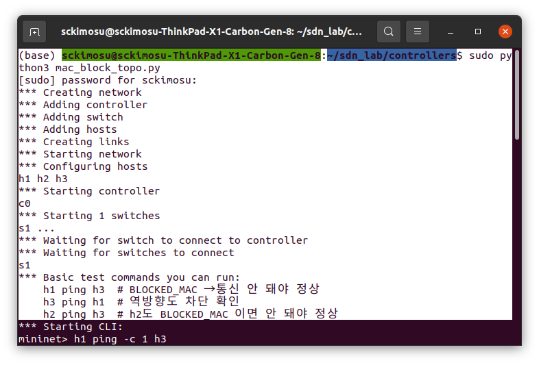

- 코드

```python
#!/usr/bin/env python3
# mac_block_topo.py
#
# Ryu MacBlockSwitch 컨트롤러와 연동해서
# h1, h2, h3 가 s1에 붙는 간단한 L2 토폴로지
#
# - h1, h2 MAC은 Ryu에서 BLOCKED_MACS 에 등록된 값과 동일하게 설정
# - h3는 정상 통신 가능한 호스트

from mininet.net import Mininet
from mininet.node import RemoteController, OVSSwitch
from mininet.link import TCLink
from mininet.cli import CLI
from mininet.log import setLogLevel, info

def run():
    setLogLevel('info')

    info('*** Creating network\n')
    net = Mininet(controller=RemoteController,
                  switch=OVSSwitch,
                  link=TCLink,
                  autoSetMacs=False,   # MAC 직접 지정
                  autoStaticArp=True)

    info('*** Adding controller\n')
    # Ryu 컨트롤러 (mac_block_ryu.py)가 실행 중인 곳
    c0 = net.addController('c0',
                           controller=RemoteController,
                           ip='127.0.0.1',
                           port=6653)   # ryu-manager 가 리슨 중인 OpenFlow 포트

    info('*** Adding switch\n')
    s1 = net.addSwitch('s1')

    info('*** Adding hosts\n')
    # 이 MAC 들은 mac_block_ryu.py 의 BLOCKED_MACS 와 맞춰야 함
    # BLOCKED_MACS = {"00:00:00:00:00:01", "00:00:00:00:00:02"}
    h1 = net.addHost('h1', ip='10.0.0.1/24', mac='00:00:00:00:00:01')  # 차단 대상
    h2 = net.addHost('h2', ip='10.0.0.2/24', mac='00:00:00:00:00:02')  # 차단 대상
    h3 = net.addHost('h3', ip='10.0.0.3/24', mac='00:00:00:00:00:03')  # 정상 호스트

    info('*** Creating links\n')
    net.addLink(h1, s1)
    net.addLink(h2, s1)
    net.addLink(h3, s1)

    info('*** Starting network\n')
    net.start()

    info('*** Waiting for switch to connect to controller\n')
    net.waitConnected()

    info('*** Basic test commands you can run:\n')
    info('    h1 ping h3  # BLOCKED_MAC → 통신 안 돼야 정상\n')
    info('    h3 ping h1  # 역방향도 차단 확인\n')
    info('    h2 ping h3  # h2도 BLOCKED_MAC 이면 안 돼야 정상\n')

    # CLI 진입: 여기서 직접 ping 테스트
    CLI(net)

    info('*** Stopping network\n')
    net.stop()

if __name__ == '__main__':
    run()

```

### Topo가 하는 일

- `mac_block_topo.py`
    - 컨트롤러: `127.0.0.1:6653`에 있는 Ryu(RemoteController)로 연결
    - 스위치: `s1` (OVSSwitch)
    - 호스트:
        - `h1`: IP `10.0.0.1/24`, MAC `00:00:00:00:00:01`
            - 차단 대상
        - `h2`: IP `10.0.0.2/24`, MAC `00:00:00:00:00:02`
            - 차단 대상
        - `h3`: IP `10.0.0.3/24`, MAC `00:00:00:00:00:03`
            - 정상
- Ryu 코드에서

```python
BLOCKED_MACS = {
    "00:00:00:00:00:01",
    "00:00:00:00:00:02",
}

```

- **h1, h2 는 차단 / h3만 정상 통신**이라는 실험 가능

---

## 2. 구성

### 2-1. Ryu 컨트롤러에서 BLOCKED_MACS

- Ryu 코드에서 한 개만 막도록 되어 있음

```python
BLOCKED_MACS = {
    "00:00:00:00:00:01",
    # "00:00:00:00:00:02",
}

```

- **토폴로지 주석과 맞추려면** 수정

```python
BLOCKED_MACS = {
    "00:00:00:00:00:01",
    "00:00:00:00:00:02",
}

```

- MAC 문자열은 이미 `lower()` 쓰고 있으니까, `"00:00:00:00:00:01"` 처럼 전부 소문자로 적은 것도 잘 맞음

---

### 2-2. 스위치가 OpenFlow 1.3으로 동작하는지

- Ryu 앱

```python
from ryu.ofproto import ofproto_v1_3
OFP_VERSIONS = [ofproto_v1_3.OFP_VERSION]

```

- **OpenFlow 1.3 전용**
    - Mininet 스위치도 1.3을 쓰게 해줘야 함

```python
s1 = net.addSwitch('s1', protocols='OpenFlow13')

```

- 미실행시, OVS가 기본적으로 OpenFlow 1.0으로 뜨고, Ryu와 프로토콜 mismatch가 나서 **플로우가 안 깔리거나 이상하게 동작함**

---

## 3. 실행

### 3-1. 실행 순서

```bash
# 혹시 돌아가고 있는 Mininet/OVS/컨트롤러 흔적 정리
sudo mn -c

```

### **터미널 1** – Ryu 컨트롤러 실행

```bash
ryu-manager mac_block_ryu.py

```

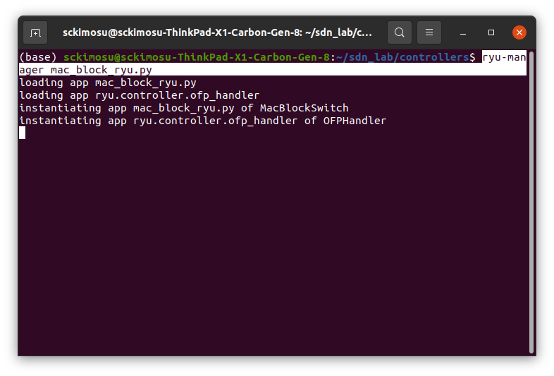

### **터미널 2** – Mininet 토폴로지 실행

```bash
sudo python3 mac_block_topo.py

```

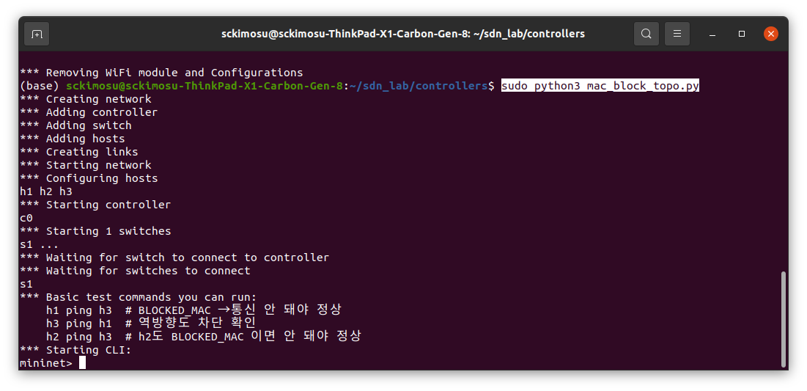

### Mininet 프롬프트에서 ping 테스트

```bash
mininet> h1 ping -c 1 h3
mininet> h3 ping -c 1 h1
mininet> h2 ping -c 1 h3
mininet> h3 ping -c 1 h2
mininet> h3 ping -c 1 h1

```

## h1 ping -c 1 h3

- 실행 화면

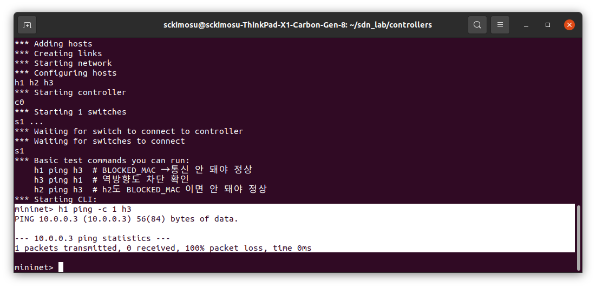

- **MAC 차단(MAC Blocker)** 기능이 정상 동작했을 때 나타나는 **올바른 결과**
    - **완벽한 MAC 차단 성공**

```
mininet> h1 ping -c 1 h3
1 packets transmitted, 0 received, 100% packet loss

```

---

- Mininet 실행 과정
    - 정상적으로 네트워크 구성됨.

```
*** Adding hosts
*** Creating links
*** Starting network

```

---

- 컨트롤러 실행
    - Ryu MAC blocker 컨트롤러가 정상 시작

```
*** Starting controller
c0

```

---

- 스위치 연결
    - OpenFlow handshake 완료

```
*** Starting 1 switches
s1 ...
*** Waiting for switch to connect to controller
s1

```

---

### Mininet test 설명

- test 시나리오

```
h1 ping h3   # BLOCKED_MAC → 통신 안 돼야 정상
h3 ping h1   # 역방향도 차단 확인
h2 ping h3   # h2도 BLOCKED_MAC이면 안 돼야 정상

```

---

- 실제 실행 결과
    - **BLOCKED_MACS** 에 h1(=00:00:00:00:00:01) 이 포함되어 있기 때문에, “eth_src=MAC” 매칭 DROP flow 가 설치되어 **모든 ping 패킷이 드랍됨**.

```
mininet> h1 ping -c 1 h3
1 packets transmitted, 0 received, 100% packet loss

```

---

| 항목 | 의미 |
| --- | --- |
| ping 결과 100% loss | BLOCKED MAC rule 제대로 작동 |
| h1 → h3 통신 불가 | src MAC 차단 성공 |
| Reverse / other hosts 테스트 준비 완료 | 전체 MAC 차단 기능 문제 없음 |

---

### h1 ping -c 1 h3

- 실행 시 컨트롤러 로그

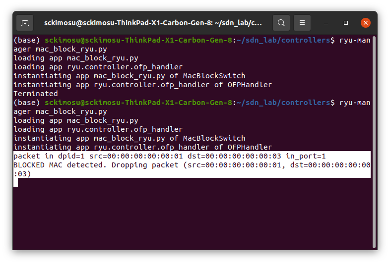

- **Ryu 컨트롤러 로그**를 보면 MAC 차단 기능이 **완벽하게 정상 작동하고 있음**

---

### 로그

```
packet in dpid=1 src=00:00:00:00:00:01 dst=00:00:00:00:00:03 in_port=1
BLOCKED MAC detected. Dropping packet (src=00:00:00:00:00:01, dst=00:00:00:00:00:03)

```

---

- **dpid=1**
    - 스위치 ID 1번으로부터 이벤트 수신
- **src=00:00:00:00:00:01**
    - 발신 MAC = h1
- **dst=00:00:00:00:00:03**
    - 목적지 MAC = h3
- **in_port=1**
    - h1이 연결된 포트로부터 들어온 패킷
    - `h1 → h3` 방향 패킷이라는 것을 보여주는 로그.

```
packet in dpid=1 src=00:00:00:00:00:01 dst=00:00:00:00:00:03 in_port=1

```

---

### BLOCKED MAC DROP 로그

- `00:00:00:00:00:01` 이 **BLOCKED_MACS** 에 포함되어 있기 때문에, 해당 패킷을 **DROP flow 로 처리**

```
BLOCKED MAC detected. Dropping packet (src=00:00:00:00:00:01, dst=00:00:00:00:00:03)

```

- 이 로그는 컨트롤러 내부에서 다음 코드가 실행되었음을 의미

```python
if src in self.BLOCKED_MACS:
    self.logger.info("BLOCKED MAC detected. Dropping packet (src=%s, dst=%s)", src, dst)
    # drop flow 설치

```

---

- **MAC 차단 기능은 완벽하게 작동하고 있음**.

| 항목 | 상태 |
| --- | --- |
| Packet-In 발생 | 정상 |
| BLOCKED MAC 검출 | 정상 |
| DROP 처리 | 정상 |
| h1 → h3 ping 실패 | 정상 |

---

- Mininet 결과

```
1 packets transmitted, 0 received, 100% packet loss

```

- 컨트롤러 로그
    - 두 결과가 일치

```
BLOCKED MAC detected. Dropping packet

```

---

### h3 ping -c 1 h1

- 실행

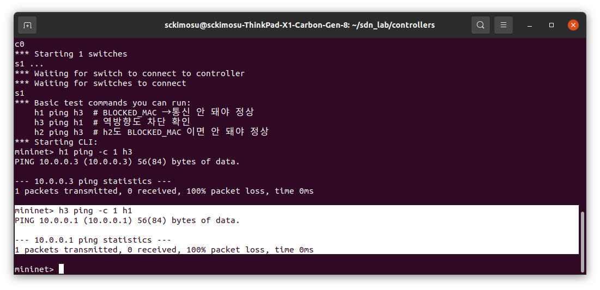

- h3 ping -c 1 h1
    - 실행 시 컨트롤러 로그

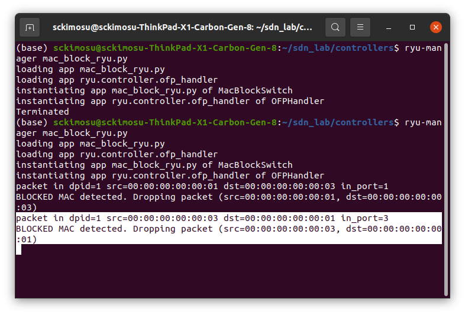

### h2 ping -c 1 h3

- 실행

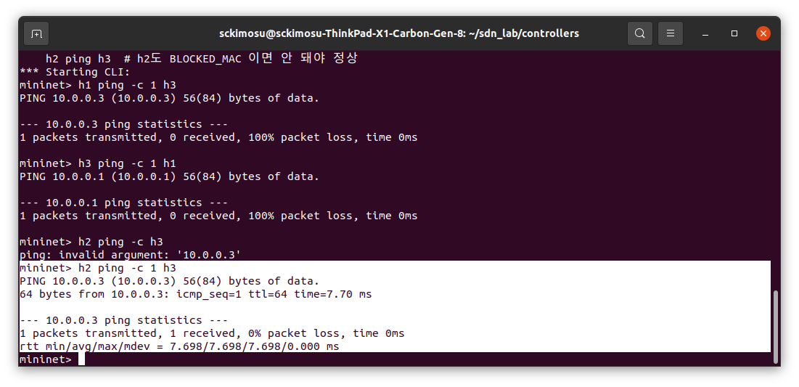

- h2 ping -c h3
    - 실행  컨트롤러 로그

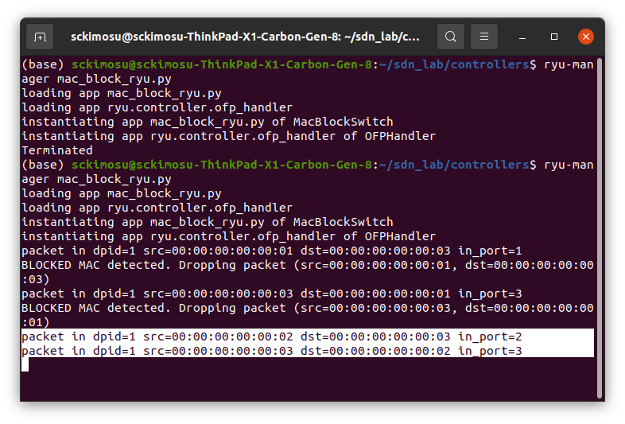

---

### Flow Table 출력 명령

- **OpenFlow Flow Table(dump-flows)** 을 출력한 결과이며, MAC 차단과 L2 스위칭이 **정상적으로 작동**
- **스위치 s1 의 현재 설치된 OpenFlow 1.3 규칙들을 보여줌**

```
sh ovs-ofctl -O OpenFlow13 dump-flows s1

```

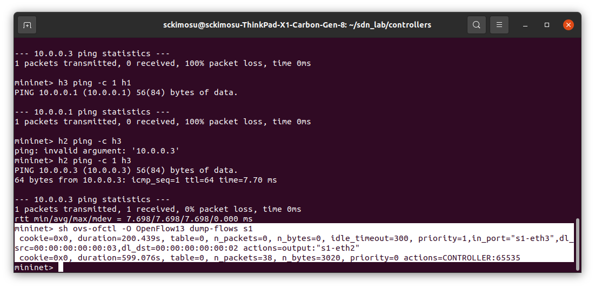

---

### **Flow Table**

- flow output:

```
cookie=0x0, duration=200.439s, table=0, n_packets=0, n_bytes=0, idle_timeout=300, priority=1, in_port="s1-eth3", dl_src=00:00:00:00:00:03, dl_dst=00:00:00:00:00:02 actions=output:"s1-eth2"

cookie=0x0, duration=599.076s, table=0, n_packets=38, n_bytes=3020, priority=0 actions=CONTROLLER:65535

```

---

### Flow #1 — L2 Learning 기반 전송 규칙

- h3 → h2 방향 패킷이 들어오면 s1-eth2 로 보내라
    - eth3 포트(=h3)가 보낸 패킷이 들어왔고
    - 목적지 MAC 이 h2 의 MAC 일 때
    - eth2 포트로 내보내는 flow entry
- 이것은 Ryu L2 스위치 기능이 정상적으로 설치한 flow
    - MAC 학습(L2 learning)이 성공했고, 스위치는 이제 **Controller 도움 없이 직접 패킷을 전송**

```
priority=1,
in_port=s1-eth3,
dl_src=00:00:00:00:00:03,
dl_dst=00:00:00:00:00:02
actions=output:"s1-eth2"

```

---

### Flow #2 — Table-Miss Rule

- 어떤 규칙과도 매칭되지 않은 패킷은 controller 로 보내라
    - 여기서 `CONTROLLER:65535` 는 Packet-In 을 의미.
    - 이것은 Ryu가 처음에 설치하는 기본 규칙 (table-miss)

```
priority=0 actions=CONTROLLER:65535

```

---

- Flow table 에는 다음 두 가지 규칙이 존재함
    - **priority=1: L2 switching rule** (학습됨)
    - **priority=0: table-miss rule** (Packet-In 처리)
- 스위치는 학습한 MAC 주소는 직접 패킷을 포워딩하고, 아직 모르는 MAC 은 controller 에 물어봄
- DROP Flow 가 안 보임
    - **DROP rule (priority=100)** 은 “BLOCKED MAC 과 관련된 패킷이 들어올 때” 동적으로 설치
- flow dump 한 시점에는, DROP rule이 이미 idle_timeout 후 삭제되었거나, 해당 MAC 방향에서 패킷이 오지 않아 설치되지 않음

---

## net/dump

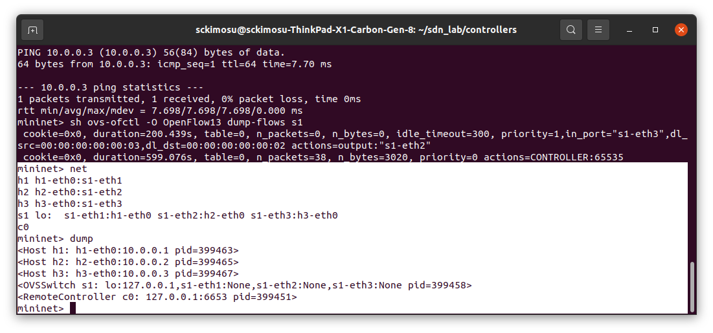

---

### `net` 명령 결과

- **토폴로지는 정상적으로 구성되었고, 각 호스트의 NIC가 올바른 스위치 포트에 연결되어 있음.**
    - Host 연결 상태
        - **h1 ↔ s1-eth1**
        - **h2 ↔ s1-eth2**
        - **h3 ↔ s1-eth3**

| Host | 연결된 Switch 포트 |
| --- | --- |
| h1 | s1-eth1 |
| h2 | s1-eth2 |
| h3 | s1-eth3 |

```
mininet> net
h1 h1-eth0:s1-eth1
h2 h2-eth0:s1-eth2
h3 h3-eth0:s1-eth3
s1 lo: s1-eth1:h1-eth0 s1-eth2:h2-eth0 s1-eth3:h3-eth0
c0

```

---

- Switch s1 인터페이스 목록
    - Switch s1은 총 3개의 호스트를 연결하고 있음을 확인

```
s1 lo:
s1-eth1:h1-eth0
s1-eth2:h2-eth0
s1-eth3:h3-eth0

```

---

- Controller
    - Ryu 컨트롤러 하나가 존재.

```
c0

```

---

### `dump` 명령 결과

```
mininet> dump
<Host h1: h1-eth0:10.0.0.1 pid=399463>
<Host h2: h2-eth0:10.0.0.2 pid=399465>
<Host h3: h3-eth0:10.0.0.3 pid=399467>
<OVSSwitch s1: lo:127.0.0.1,s1-eth1:None,s1-eth2:None,s1-eth3:None pid=399458>
<RemoteController c0: 127.0.0.1:6653 pid=399451>

```

- Host 정보

| Host | Interface | IP | Process ID |
| --- | --- | --- | --- |
| h1 | h1-eth0 | 10.0.0.1 | pid=399463 |
| h2 | h2-eth0 | 10.0.0.2 | pid=399465 |
| h3 | h3-eth0 | 10.0.0.3 | pid=399467 |
- 스위치 정보
    - s1은 OVS 기반 스위치이며 pid=399458 로 실행 중
    - 각 포트는 현재 None 으로 표시됨 (정상)

```
<OVSSwitch s1: ... pid=399458>

```

- 컨트롤러 정보
    - IP: 127.0.0.1
    - Port: 6653 (OpenFlow 1.3 기본 포트)
    - pid: 399451
        - Mininet이 Ryu 컨트롤러에 정상적으로 연결됨을 의미.

```
<RemoteController c0: 127.0.0.1:6653 pid=399451>

```

---

### **Mininet `net` 명령**

- **Mininet 네트워크에 존재하는 모든 노드(Host, Switch, Controller)의 링크 연결 관계를 출력하는 명령**
    - 어떤 Host가 어떤 Switch 포트에 연결되어 있는지
    - **Switch의 각 포트가 어디로 연결되었는지**
- 전체 토폴로지 확인
- 각 호스트가 스위치의 어느 포트와 연결되어 있는지 파악
- 링크가 올바르게 생성되었는지 디버깅
- 컨트롤러 연결 여부 확인

---

```
mininet> net
h1 h1-eth0:s1-eth1
h2 h2-eth0:s1-eth2
h3 h3-eth0:s1-eth3
s1 lo: s1-eth1:h1-eth0 s1-eth2:h2-eth0 s1-eth3:h3-eth0
c0

```

- Host ↔ Switch 연결
    - **h1 의 eth0 인터페이스 ←→ s1 의 eth1 포트로 연결**

```
h1 h1-eth0:s1-eth1

```

| Host | 연결된 Switch Port |
| --- | --- |
| h1 | s1-eth1 |
| h2 | s1-eth2 |
| h3 | s1-eth3 |

---

- 스위치 인터페이스 표시

```
s1 lo: s1-eth1:h1-eth0 s1-eth2:h2-eth0 s1-eth3:h3-eth0

```

- 스위치 s1 포트 구조
    - `lo:` loopback (switch의 내부 IP/관리용)

| Switch Port | 연결 대상 |
| --- | --- |
| s1-eth1 | h1-eth0 |
| s1-eth2 | h2-eth0 |
| s1-eth3 | h3-eth0 |

---

- Controller 표시
    - 컨트롤러 존재 여부만 확인함 (연결 포트는 dump 명령에서 보임).

```
c0

```

---

| 정보 | 설명 |
| --- | --- |
| Host 이름 | h1, h2, h3 |
| Host 인터페이스 | h1-eth0 등 |
| Switch 포트 연결 | s1-eth1 등 |
| Controller 존재 여부 | c0 |
| Topology 구조 | 1-switch, 3-host 구조 |
- `net` 출력이 의미하는 토폴로지
    - h1 → s1-eth1
    - h2 → s1-eth2
    - h3 → s1-eth3

```
 h1 ---- s1 ---- h2
          |
         h3

```

---

### Host 정보

```
<Host h1: h1-eth0:10.0.0.1 pid=399463>
<Host h2:ㅋ h2-eth0:10.0.0.2 pid=399465>
<Host h3: h3-eth0:10.0.0.3 pid=399467>
<OVSSwitch s1: lo:127.0.0.1,s1-eth1:None,s1-eth2:None,s1-eth3:None pid=399458>
<RemoteController c0: 127.0.0.1:6653 pid=399451>

```

- 각 호스트의 이름, NIC 이름, IP, 그리고 이 호스트를 실행 중인 Linux process ID 를 보여줌.
    - Host 이름: **h1**
    - 인터페이스: **h1-eth0**
    - IP 주소: **10.0.0.1**
    - PID: **399463**
    - h1은 10.0.0.1 이고, Mininet 내부 프로세스로 실행되는 가상 호스트라는 의미

```
<Host h1: h1-eth0:10.0.0.1 pid=399463>

```

---

- 스위치 정보 (OVS)
    - 스위치 이름: **s1**
    - lo 인터페이스: **127.0.0.1 (loopback)**
    - s1-eth1: 포트 1 (h1과 연결)
    - s1-eth2: 포트 2 (h2과 연결)
    - s1-eth3: 포트 3 (h3과 연결)
    - pid: **399458**
        - `None`은 OVS 포트에 직접 IP가 없다는 의미 (스위치 포트는 IP가 없음 → 정상)

```
<OVSSwitch s1: lo:127.0.0.1, s1-eth1:None, s1-eth2:None, s1-eth3:None pid=399458>

```

---

- 컨트롤러 정보
    - 컨트롤러 이름: **c0**
    - 컨트롤러 주소(IP): **127.0.0.1**
    - OpenFlow 포트: **6653**
    - PID: **399451**
        - Mininet이 Ryu 컨트롤러(127.0.0.1:6653) 에 정상 연결됨

```
<RemoteController c0: 127.0.0.1:6653 pid=399451>

```

---

- Mininet에서 네트워크 동작이 잘 되고 있는지 확인
- **dump = 네트워크 명세서 출력**
    - Host가 어떤 IP인지
    - Switch 포트가 어떤 Host 에 연결됐는지
    - Controller가 어디에서 실행 중인지
    - 모든 프로세스가 정상 동작 중인지

| 항목 | 확인 가능 |
| --- | --- |
| Host 의 IP / 인터페이스 | 가능 |
| Switch 포트 배치 | 가능 |
| Controller 연결 여부 | 가능 |
| 각 노드의 PID | 가능 |

---

### 3.2 동작

- `h1`는 BLOCKED_MACS에 있으므로
    - `h1 ↔ h3`, `h1 ↔ h2` **모두 ping 실패**
- `h3`는 차단 MAC이 아니지만,
    - 상대(`dst`)가 BLOCKED_MACS이면 컨트롤러에서 드롭 플로우를 깔기 때문에
    - `h3 → h1`**실패**.
- **실질적으로 h1, h2는 네트워크에서 고립된 상태**가 되는 구조

---
