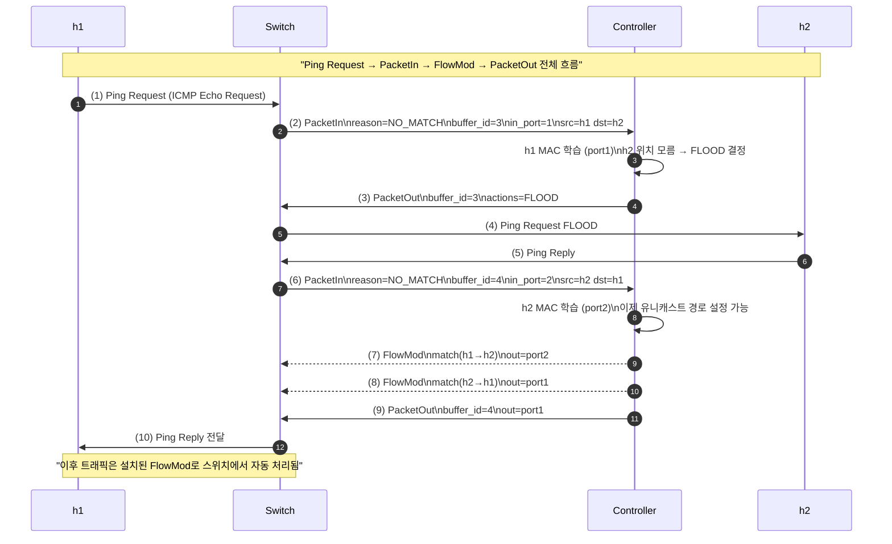
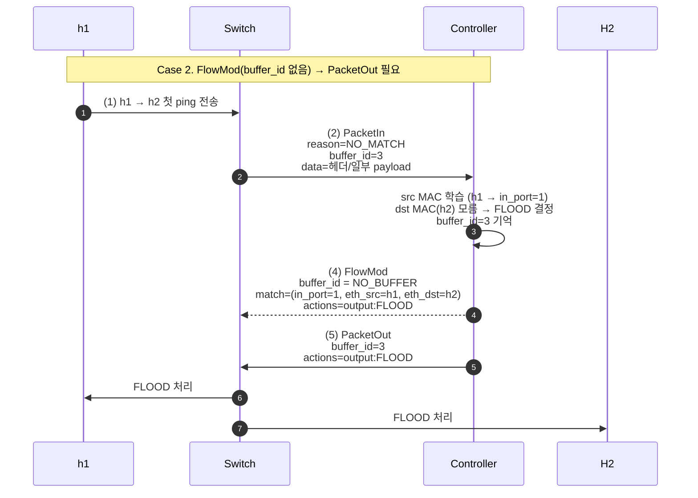
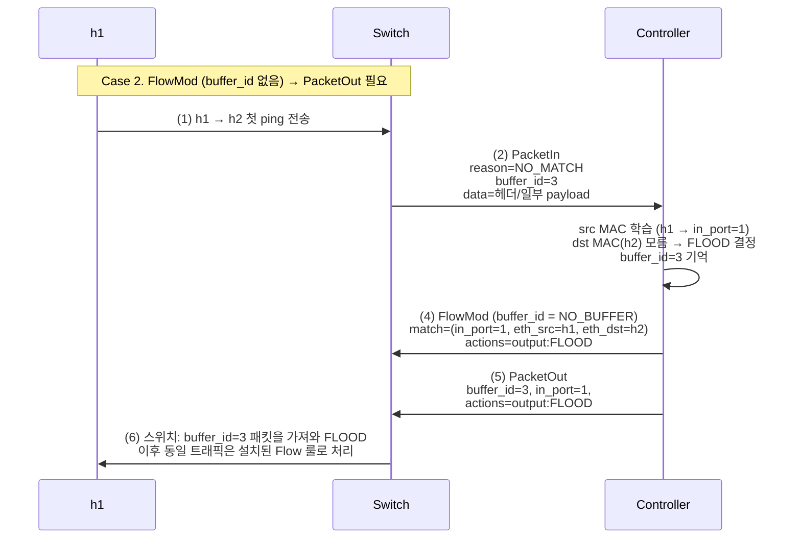

# [12주차_2차시] 스위치–컨트롤러 메시지

# **Ping Request → PacketIn → FlowMod → PacketOut 전체 흐름 (Sequence Diagram)**



---

## **1) Ping Request (ICMP Echo Request)**

- Host(h1) → Switch
- 실제 네트워크 패킷
- Ethernet + IP + ICMP 구조

## **2) PacketIn (Switch → Controller)**

- 스위치가 FlowTable에서 룰을 못 찾으면 생성
    - `reason = NO_MATCH`
    - `buffer_id = 3` → 스위치가 패킷을 버퍼에 저장함
    - `data` = 패킷 헤더(일부 payload 포함)
- 컨트롤러가 의사결정을 하기 위해 **스위치가 보내는 메시지**

## **3) FlowMod (Controller → Switch)**

- 컨트롤러가 스위치의 FlowTable에 룰을 설치
    - match: (in_port=1, eth_src=h1, eth_dst=h2)
    - actions: output:FLOOD
    - buffer_id = **NO_BUFFER**
        - 이 FlowMod는 룰만 설치하며 패킷 처리는 안 함

## **4) PacketOut (Controller → Switch)**

- FlowMod에 buffer_id를 넣지 않았으므로 PacketOut 필요
    - buffer_id = 3 → 스위치 버퍼에서 패킷 꺼냄
    - actions = output:FLOOD
    - data 없음(스위치가 버퍼에 있으니까)

---

### 1. **Ping Request(ICMP Echo Request) 메시지**

- Ping Request 3단계 헤더

```
Ethernet Header  →  IP Header  →  ICMP Header + Payload

```

- Ethernet Header (14 bytes)

| 필드 | 길이 **(**b**ytes)** | 예시 값 | 설명 |
| --- | --- | --- | --- |
| **Destination MAC** | 6 | ff ff ff ff ff ff | h1 → switch (**broadcast**) |
| **Source MAC** | 6 | 00 00 00 00 00 01 | h1 **MAC** |
| EtherType | 2 | 08 00 | IPv4(0x0800) |

---

- IPv4 Header (20 bytes)

| 필드 | 길이 **(**b**ytes)** | 예시 값 | 설명 |
| --- | --- | --- | --- |
| Version + IHL | 1 | 45 | IPv4, header 20B |
| DSCP/ECN | 1 | 00 | 기본값 |
| Total Length | 2 | 00 54 | 84 bytes (IP header + ICMP) |
| Identification | 2 | 6f a6 | Fragment 식별자 |
| Flags + Fragment Offset | 2 | 00 00 | fragmentation 없음 |
| TTL | 1 | 40 | TTL=64 |
| Protocol | 1 | 01 | ICMP = 1 |
| Header Checksum | 2 | 27 4a | IPv4 checksum |
| **Source IP** | 4 | 0a 00 00 01 | 10.0.0.1 |
| **Destination IP** | 4 | 0a 00 00 02 | 10.0.0.2 |

---

- ICMP Echo Request Header (8 bytes)

| 필드 | 길이 **(**b**ytes)** | 예시 값 | 설명 |
| --- | --- | --- | --- |
| **Type** | 1 | 08 | **Echo Request** |
| Code | 1 | 00 | 항상 0 |
| Checksum | 2 | e5 4a | ICMP checksum |
| Identifier | 2 | 00 01 | 프로세스 ID |
| Sequence Number | 2 | 00 2b | ping sequence 번호 |

---

- ICMP Payload (기본 56 bytes)

```
61 62 63 64 65 66 ... → **ASCII: abcdefghijklmnopqrstuvwabcdefghijklmnopqrs**

```

---

### Ping Request 전체 길이 : 98 bytes

```
Ethernet(14) + IP(20) + ICMP(8 + 56) = 98 bytes

```

---

### 2. 스위치

- 이 패킷 **(Ping Request)** 을 **FlowTable**에서 **L2 포워딩 룰**을 찾다가 없으면 **PacketIn**을 발생

---

### 3. **PacketIn 메시지**

- **스위치 → 컨트롤러** 방향 메시지
- 이 패킷(**Ping Request)**을 스위치의 FlowTable에서 처리할 수 없으므로, 컨트롤러 처리 요청

| 필드 | 길이 **(**b**ytes)** | 의미 |
| --- | --- | --- |
| header | 8 | OpenFlow 공통 헤더 (version=4, type=10(PacketIn)) |
| **buffer_id** | **4** | **패킷을 저장한 버퍼 번호 또는 0xffffffff (NO_BUFFER)** |
| total_len | 2 | 패킷 실제 길이 |
| **reason** | 1 | **why PacketIn? (NO_MATCH / ACTION / INVALID_TTL)** |
| table_id | 1 | 패킷이 검사되던 테이블 번호 |
| cookie | 8 | 룰에 연결된 cookie 값 |
| match | variable | 패킷의 매칭된 필드들 (in_port, eth.src 등) |
| padding | 2 | alignment |
| **data** | variable | 패킷 전체 또는 앞부 |
- **buffer_id**
    - **FlowMod buffer_id** (=3)을 넣으면 PacketOut 없이도 이 패킷이 자동 처리됨.

```
스위치 내부의 패킷 버퍼 index (ex: 3)

```

- data
    - **실제 패킷의 앞부분(기본 128 bytes 정도만 보냄, 98bytes 만 실제 데이터, 나머지 30 bytes 는 패딩)**
- reason : **PacketIn**이 발생한 이유:
    - 0 = NO_MATCH
        - 룰이 없음 → 가장 일반적
    - 1 = ACTION
        - controller action 명령
    - 2 = INVALID_TTL
        - TTL=0인 IP 패킷

---

### Wireshark PacketIn 메시지

```markup
OpenFlow 1.3 PacketIn
  buffer_id: 3
  total_len: 98
  reason: 0 (NO_MATCH)
  table_id: 0
  match:
     in_port: 1
     eth.src: 00:00:00:00:00:01
     eth.dst: ff:ff:ff:ff:ff:ff
  data:
     ff ff ff ff ff ff 00 00 ...

```

---

### Ping Request vs PacketIn 메시지

| 항목 | Ping Request | PacketIn |
| --- | --- | --- |
| 방향 | **host → switch** | **switch → controller** |
| 종류 | ICMP 메시지 | OpenFlow 메시지 |
| 생성 이유 | **host가 ping 보냄** | **FlowTable에 룰 없음** |
| 포함 내용 | **Ethernet/IP/ICMP** | **buffer_id, match, reason, data(패킷 일부)** |
| 실제 패킷 포함 여부 | 전체 포함 | 일부 또는 없음 (buffer_id로 대체) |

---

```
Host → [Ping Request] → Switch
      (Ethernet + IP + ICMP)

Switch:
  룰 없음 → PacketIn 생성

Switch → [PacketIn(buffer_id=3, data 일부)] → Controller

```

---

### 4. FlowMod 메시지

- **컨트롤러 → 스위치** 방향 메시지
- Flow Table 에 **룰을 설치/수정/삭제**하기 위한 메시지

---

```
+----------------------+
| OpenFlow Header      |  (version, type=14, length, xid)
+----------------------+
| cookie               |  8 bytes
| cookie_mask          |  8 bytes
+----------------------+
| table_id             |  1 byte
| command              |  1 byte (ADD, MODIFY, DELETE)
| idle_timeout         |  2 bytes
| hard_timeout         |  2 bytes
| priority             |  2 bytes
| buffer_id            |  4 bytes
| out_port             |  4 bytes
| out_group            |  4 bytes
| flags                |  2 bytes
| padding              |  2 bytes
+----------------------+
| match (variable)     |
+----------------------+
| instructions         |
|  (actions or Goto)   |
+----------------------+

```

| 필드 | 의미 |
| --- | --- |
| **table_id** | Flow가 설치될 테이블 |
| **command** | ADD / MODIFY / DELETE |
| **idle_timeout** | 일정 시간 패킷이 안 오면 삭제 |
| **hard_timeout** | 시간 지나면 무조건 삭제 |
| **priority** | Flow 우선순위 |
| **buffer_id** | PacketIn의 buffer_id 사용 시 패킷 즉시 처리 가능 |
| **match** | **패킷 조건 (in_port, eth.src, ip.src, …)** |
| **instructions** | APPLY_ACTIONS, GOTO, WRITE_ACTIONS |

---

### FlowMod 메시지

- **buffer_id 미포함**

```
FlowMod
 match: in_port=1, eth_src=00:00:00:00:00:01, eth_dst=00:00:00:00:00:02
 actions: output=2
 idle_timeout=300
 priority=1
 buffer_id = None  ← PacketOut 필요

```

- **buffer_id 포함**

```
FlowMod
 match: (h1→h2)
 actions: output:FLOOD
 ****buffer_id = 3     ← PacketOut 불필요

```

---

### FlowMod raw 헤더

```
04 0e 00 48   -- version=4, type=14(FlowMod), length=72
00 00 00 01   -- xid
00 00 00 00 00 00 00 00   -- cookie
00 00 00 00 00 00 00 00   -- cookie mask
00 01   -- table_id=0, command=ADD
01 2c   -- idle_timeout=300
00 00   -- hard_timeout=0
00 01   -- priority=1
ff ff ff ff   -- buffer_id = NO_BUFFER
ff ff ff ff   -- out_port=ANY
ff ff ff ff   -- out_group=ANY
00 00   -- flags
00 00   -- pad
... match ...
... actions ...

```

---

### 5. PacketOut 메시지

- **컨트롤러 → 스위치** 메시지
- 스위치가 특정 패킷을 지정된 action으로 **즉시 내보내도록** 지시하는 목적

---

```
+------------------------+
| OpenFlow Header        |  (version, type=13, length, xid)
+------------------------+
| buffer_id              | 4 bytes
| in_port                | 4 bytes
| actions_len            | 2 bytes
| padding                | 6 bytes
+------------------------+
| actions (variable)     |
+------------------------+
| data (variable)        | (buffer_id = NO_BUFFER일 때만 포함)
+------------------------+

```

| 필드 | 의미 |
| --- | --- |
| **buffer_id** | PacketIn에서 들어온 버퍼 번호 또는 NO_BUFFER |
| **in_port** | 패킷이 들어온 포트 |
| **actions** | **스위치가 수행할 동작(OUTPUT, DROP 등)** |
| **data** | buffer_id 없으면 반드시 packet 전체 포함 |

---

### PacketOut 예시

```
buffer_id = 3
in_port = 1
actions = [OUTPUT:2]

```

- data 직접 포함

```
buffer_id = NO_BUFFER
data = (전체 Ethernet/IP/ICMP 패킷)
actions = [FLOOD]

```

---

### PacketOut raw 헤더

```
04 0d 00 30   -- version=4, type=13(PacketOut), len=48
00 00 00 02   -- xid
00 00 00 03   -- buffer_id = 3
00 00 00 01   -- in_port = 1
00 10         -- actions_len = 16
00 00 00 00 00 00 00 00 00 00  -- padding
...actions...

```

---

```
PacketOut = "이 패킷을 지금 이 포트로 내보내라"
buffer_id 사용 → 스위치 버퍼 패킷 전송
data 포함 → 패킷 전체를 직접 포함

```

---

# PacketIn vs PacketOut vs FlowMod

| 구분 | PacketIn | PacketOut | FlowMod |
| --- | --- | --- | --- |
| **방향** | **스위치 → 컨트롤러** | **컨트롤러 → 스위치** | **컨트롤러 → 스위치** |
| **목적** | **컨트롤러에게 패킷 정보를 전달 (미처리 패킷 알림)** | **스위치로 패킷을 직접 전송하도록 지시** | **Flow 룰 설치/수정/삭제** |
| **포함되는 packet** | 전체 또는 앞부분(data) | 전체 또는 버퍼링된 패킷(buffer_id) | 없음 (단, buffer_id 포함 가능 → 패킷 즉시 처리) |
| **주요 필드** | buffer_id, match, reason, data, in_port | buffer_id, data, actions, in_port | match, actions, buffer_id, timeouts, priority |
| **처리 방식** | **컨트롤러에게 판단을 요청** | **컨트롤러가 직접 forwarding 지시** | **스위치의 Flow Table 변경** |
| **발생 시점** | **Flow Table에 매칭되는 항목이 없을 때** | **Flooding, Unicast forwarding, ARP reply 등 즉시 처리할 때** | 패킷 처리 자동화를 위해 **룰을 설치할 때** |
| **오버헤드** | 비교적 큼 (컨트롤러와 통신) | 작음 (스위치가 바로 패킷 처리) | initial 비용만 큼 (설치 후는 고속 처리) |
| **버퍼 사용** | 스위치가 패킷을 buffer에 저장하고 buffer_id로 전달 가능 | buffer_id를 사용하면 스위치에 저장된 패킷 재사용 | buffer_id로 PacketOut 없이도 패킷 계속 처리 가능 |

---

### PacketIn

- **스위치 → 컨트롤러**
- 패킷 어떻게 처리할까요라고 물어보는 메시지
    - 매칭되는 Flow가 없음
    - data(패킷) 전체 또는 앞부분 포함
    - buffer_id 포함 가능

---

### PacketOut : 현재 (패킷처리)

- **컨트롤러 → 스위치**
- 이 패킷을 지금 이 포트로 내보내라라고 지시
    - actions 필수 (OUTPUT, FLOOD 등)
    - buffer_id 또는 data 사용
        - buffer_id 있으면 스위치 버퍼 패킷
        - buffer_id 없으면 data 전체 포함

---

### FlowMod : 미래 (MAC 러닝)

- **컨트롤러 → 스위치**
- 앞으로 이런 패킷이 오면 이렇게 처리해라라는 규칙 설치 메시지.
    - match 조건
    - actions
    - idle_timeout / hard_timeout
    - buffer_id 포함 가능
        - Flow 설치 + buffer 패킷 자동 처리

---

### **ICMP Ping**

- h1 → h2 패킷이 스위치 도착
- 스위치
    - FlowTable에 룰 없음 → **PacketIn 발생**
- 컨트롤러
    - **MAC learning**
    - FlowMod 설치 (향후 자동 처리)
- 컨트롤러 → 스위치
    - **PacketOut** (첫 패킷만 직접 전송)
- 이후 패킷은 FlowTable이 자동 처리
    - PacketIn 없음

---

### FlowMod 메시지 : buffer_id 유/무에 따른 첫 패킷 처리

```
─────────────────────────────────────────────────────────────────
     Case 1.  FlowMod(buffer_id 포함) → PacketOut 필요 없음
─────────────────────────────────────────────────────────────────

1) h1 → h2 첫 ping 전송
     ↓
2) 룰 없음 → PacketIn
     - reason = NO_MATCH
     - buffer_id = 3
     - data 일부
     ↓
3) 컨트롤러: MAC 학습 → dst unknown → FLOOD 결정
     ↓
4) FlowMod 전송
     - match = (in_port=1, src=h1, dst=h2)
     - actions = output:FLOOD
     - buffer_id = 3   ← 중요!!
     ↓
5) 스위치:
     - buffer_id=3 패킷을 FlowMod actions대로 즉시 처리
     - PacketOut 필요 없음
     - Flow Table 룰 설치 완료

```



---

```
Case 2.  FlowMod(buffer_id 없음) → PacketOut 필요
────────────────────────────────────────────────────────────

1) h1 → h2 첫 ping 전송
   ↓
2) 스위치에서 매칭되는 룰 없음 → PacketIn 발생
   - reason = NO_MATCH
   - buffer_id = 3
   - data = 패킷 헤더 일부 (또는 일부 payload)
   ↓
3) 컨트롤러
   - src MAC 학습 (h1 → in_port=1)
   - dst MAC(h2) 모름 → FLOOD로 보내야 한다고 결정
   - (PacketIn에서 받은 buffer_id=3 값을 기억만 하고 있음)
   ↓
4) FlowMod 전송 (MAC 러닝)  ← buffer_id 없음!  
   - match  = (in_port=1, eth_src=h1, eth_dst=h2)
   - actions = output:FLOOD   (또는 output:특정 포트들)
   - buffer_id 는 설정하지 않음 (NO_BUFFER) --> MAC 러닝에는 버퍼가 필요없음 
   ↓
5) PacketOut 전송 (패킷처리) ← 여기서 buffer_id 사용!
   - buffer_id = 3       ← 스위치 버퍼에 있는 원래 패킷 번호 --> 패킷처리에는 버퍼가 필요함
   - in_port  = 1
   - actions  = output:FLOOD
   ↓
6) 스위치 동작
   - PacketOut의 buffer_id=3에 해당하는 버퍼 패킷을 가져와
     actions(FLOOD)에 따라 모든 포트(입력 포트 제외)에 전송
   - 동시에, 4단계에서 설치된 Flow 룰 덕분에
     이후 동일한 (h1→h2) 트래픽은 Flow Table에서 자동 처리

```



---

## **패킷 처리 : 3가지 경우**

### **Case 1 : PacketIn(buffer_id ⭕) + FlowMod(buffer_id 포함)**

### **FlowMod: MAC 러닝 ⭕, buffer_id: 패킷처리 ⭕**

### PacketOut 필요 없음 (스위치가 바로 처리)

### 발생

- 스위치가 패킷을 **버퍼링했고**,
- 컨트롤러가 **FlowMod와 패킷 처리**를 **한 번에 묶어서 처리**하고 싶을 때.
    - 컨트롤러는 스위치의 MAC 러닝과 패킷 처리 두 가지 임무를 수행해야 함

### 동작

```
PacketIn:
    buffer_id = 3
    data = (헤더 일부)

```

```
FlowMod:
    buffer_id = 3         ← 중요
    actions = output:X

```

- 스위치 동작
    - FlowMod로 **룰 설치**
    - buffer_id=3에 저장된 원본 패킷을 **즉시 actions에 따라 전송**
    - PacketOut 필요 없음
- **가장 효율적인 방식**

---

### **Case 2 :  PacketIn(buffer_id ⭕) + FlowMod(buffer_id ❌) + PacketOut(buffer_id ⭕)**

### **FlowMod: MAC 러닝(미래패킷처리), buffer_id ❌: 현재패킷처리 불가능**

### **PacketOut 필요 (현재패킷처리, PacketIn의 buffer_id ⭕)**

### 발생

- 스위치는 패킷을 버퍼링했지만
- 컨트롤러는 FlowMod와 PacketOut을 **분리하여 처리**하고 싶을 때

### 동작

```
PacketIn:
    buffer_id = 3

```

- FlowMod(룰 설치만):

```
FlowMod:
    buffer_id 없음
    actions = output:X

```

- PacketOut(패킷 처리)
    - **FlowMod와 PacketOut이 분리되어 있음**

```
PacketOut:
    buffer_id = 3         ← 원본 패킷을 스위치에서 꺼냄
    actions = output:X

```

- 스위치 동작
- FlowMod 룰 설치
- PacketOut buffer_id=3 패킷 즉시 전송

---

### **Case 3 : buffer_id = OFP_NO_BUFFER (패킷 버퍼링 ❌)**

### **FlowMod: MAC 러닝 (미래패킷처리), buffer_id ❌: 현재패킷처리 불가능**

### **PacketOut 필요 (현재패킷처리)**

- PacketOut에서 raw data 필요 (**OFP_NO_BUFFER 때문)**

### 발생

- 스위치가 패킷을 버퍼링하지 않은 경우
    - 메모리 부족
    - NO_BUFFER 모드 스위치
    - 특정 트래픽 정책
    - 패킷 크기가 매우 작을 때
- PacketIn

```
PacketIn:
    buffer_id = 0xffffffff  (OFP_NO_BUFFER)
    data = 패킷 전체 (raw)

```

- FlowMod
    - FlowMod는 버퍼가 없기 때문에 당연히 buffer_id를 사용할 수 없음

```
FlowMod:
    buffer_id 없음

```

- PacketOut
    - 스위치에 패킷이 없으므로 raw data를 직접 넣어야 함
    - **스위치는 패킷을 저장하지 않았기 때문에 raw data 필수**

```
PacketOut:
    buffer_id = OFP_NO_BUFFER
    data = [패킷 전체]

```

---

- buffer_id가 있으면 스위치는 패킷을 버퍼링한 것이고,
컨트롤러는 FlowMod를 buffer_id 포함/미포함 방식으로 선택 가능
- buffer_id = OFP_NO_BUFFER이면 스위치는 패킷을 저장하지 않았으며,
컨트롤러는 PacketOut에 raw data를 실어 보내야 함

| Case | PacketIn buffer_id | FlowMod buffer_id | PacketOut | 패킷 처리 |
| --- | --- | --- | --- | --- |
| 1. FlowMod(buffer_id 포함) | 있음 | 있음 | 없음 | FlowMod에서 자동 처리 |
| 2. FlowMod(buffer_id 없음) | 있음 | 없음 | 있음 (buffer_id 사용) | PacketOut에서 처리 |
| 3. NO_BUFFER 모드 (버퍼링하지 않음) | 없음 (`OFP_NO_BUFFER`) | 없음 | 있음 (raw data 필요) | PacketOut(raw data) |

---

## Ryu 컨트롤러 코드

## 공통 (_packet_in_handler)

- 언더스코어(_) 시작 → 내부용(private) 의미
    - `_packet_in_handler()` 는 **이벤트 콜백이므로 외부에서 호출하면 안 됨**
    - 이 함수는 **컨트롤러 내부에서만 호출되는 핸들러이고, 외부 API로 제공되는 함수가 아니다**라는 의미.

```python
@set_ev_cls(ofp_event.EventOFPPacketIn, MAIN_DISPATCHER)
def _packet_in_handler(self, ev):
    msg = ev.msg
    datapath = msg.datapath
    ofproto = datapath.ofproto
    parser = datapath.ofproto_parser

    in_port = msg.match['in_port']
    buffer_id = msg.buffer_id

    pkt = packet.Packet(msg.data)
    eth = pkt.get_protocols(ethernet.ethernet)[0]
    src = eth.src
    dst = eth.dst

    dpid = datapath.id
    self.mac_to_port.setdefault(dpid, {})
    self.mac_to_port[dpid][src] = in_port

    # 목적지 포트 결정 (학습 스위치 예제)
    if dst in self.mac_to_port[dpid]:
        out_port = self.mac_to_port[dpid][dst]
    else:
        out_port = ofproto.OFPP_FLOOD

    actions = [parser.OFPActionOutput(out_port)]

```

### Case 1: PacketIn(buffer_id ⭕) + FlowMod(buffer_id ⭕) → PacketOut ❌

### **FlowMod (buffer_id ⭕)**

- **FlowMod  : MAC 러닝, 미래 패킷 처리 ⭕**
- **buffer_id O  : 현재  패킷 처리 ⭕**

### 가장 효율적인 방식

- FlowMod에 buffer_id를 넣어서 룰 설치 + 버퍼링된 패킷 처리를 한 번에 처리.
- 조건
    - `buffer_id != OFP_NO_BUFFER`
    - out_port가 FLOOD가 아니라 유니캐스트 경로 확정된 상황일 때 사용

```python
if out_port != ofproto.OFPP_FLOOD:
    match = parser.OFPMatch(in_port=in_port, eth_src=src, eth_dst=dst)

    if buffer_id != ofproto.OFP_NO_BUFFER:
        # === Case 1: FlowMod(buffer_id 포함), PacketOut 없음 ===
        self.logger.info("Case1: FlowMod with buffer_id, no PacketOut")

        inst = [parser.OFPInstructionActions(
                    ofproto.OFPIT_APPLY_ACTIONS, actions)]

        mod = parser.OFPFlowMod(datapath=datapath, # OFPFlowMod : 미래패킷처리 준비 완료 !
                                priority=1,
                                buffer_id=buffer_id,  # ← 여기, 현재패킷처리완료 !
                                match=match,
                                instructions=inst,
                                idle_timeout=300)
        datapath.send_msg(mod)

        # FlowMod가 buffer_id 패킷까지 알아서 처리하므로
        # PacketOut 보낼 필요 없음
        return

```

- 스위치 입장
    - FlowMod 수신 → 룰 설치
    - buffer_id=xxx에 있던 패킷을 새 룰의 actions에 따라 **즉시 전송**

---

### Case 2: PacketIn(buffer_id ⭕) + FlowMod(buffer_id ❌) + PacketOut(buffer_id ⭕)

### **FlowMod (buffer_id** ❌**)**

- **FlowMod : MAC 러닝, 미래 패킷 처리 ⭕**
- **FlowMod buffer_id** ❌ **: 현재 패킷 처리** ❌

### **PacketOut**

- **buffer_id ⭕ (PacketIn에서 가져 옴), 현재 패킷 처리 ⭕**

### Ryu 기본 L2Switch 스타일

- FlowMod는 룰만 설치하고, PacketOut이 버퍼 패킷을 실제로 내보냄.
- 조건
    - `buffer_id != OFP_NO_BUFFER`
    - FlowMod에 buffer_id를 넣지 않기로 한 경우

```python
if out_port != ofproto.OFPP_FLOOD:
    match = parser.OFPMatch(in_port=in_port, eth_src=src, eth_dst=dst)

    if buffer_id != ofproto.OFP_NO_BUFFER:
        # === Case 2: FlowMod(buffer_id 없음) + PacketOut(buffer_id 사용) ===
        self.logger.info("Case2: FlowMod(no buffer_id) + PacketOut(buffer_id)")

       **** # 1) FlowMod: 룰만 설치
        inst = [parser.OFPInstructionActions(
                    ofproto.OFPIT_APPLY_ACTIONS, actions)]
        mod = parser.OFPFlowMod(datapath=datapath,
                                priority=1,
                                match=match,
                                instructions=inst,
                                idle_timeout=300)
        datapath.send_msg(mod)

        # 2) PacketOut: buffer_id를 이용해서 현재 패킷 전송
        out_msg = parser.OFPPacketOut(datapath=datapath,
                                      buffer_id=buffer_id,  # ← 여기!
                                      in_port=in_port,
                                      actions=actions,
                                      data=None)  # buffer_id가 있으므로 data 필요 X
        datapath.send_msg(out_msg)
        return

```

- 스위치
    - FlowMod → 향후 패킷들은 룰로 처리
    - PacketOut(buffer_id=3) → 지금 버퍼에 있는 패킷 한 번 내보내기

---

### Case 3: PacketIn(**buffer_id = OFP_NO_BUFFER,** buffer_id ❌) + FlowMod(buffer_id ❌) + PacketOut(data ⭕)

### **FlowMod(buffer_id** ❌)

- **FlowMod : MAC 러닝, 미래 패킷 처리 ⭕**
- **FlowMod buffer_id X: 현재 패킷 처리** ❌

### **PacketOut**

- **buffer_id = OFP_NO_BUFFER (노버퍼링, buffer_id** ❌ **)**
- **data (PacketIn에 포함된 Packet 사용),  현재 패킷 처리 ⭕**

### 스위치가 버퍼링을 안 한 경우

- PacketIn의 data에 패킷 전체가 들어있고, PacketOut에 **raw data를 그대로 실어 보내야 하는 경우**.
- 조건
    - `buffer_id == OFP_NO_BUFFER`

```python
if out_port != ofproto.OFPP_FLOOD:
    match = parser.OFPMatch(in_port=in_port, eth_src=src, eth_dst=dst)

    if buffer_id == ofproto.OFP_NO_BUFFER**:**
        # === Case 3: NO_BUFFER → FlowMod + PacketOut(data) ===
        self.logger.info("Case3: NO_BUFFER → FlowMod + PacketOut(data)")

        # 1) FlowMod: 룰만 설치 (buffer_id 없음)
        inst = [parser.OFPInstructionActions(
                    ofproto.OFPIT_APPLY_ACTIONS, actions)]
        mod = parser.OFPFlowMod(datapath=datapath,
                                priority=1,
                                match=match,
                                instructions=inst,
                                idle_timeout=300)
        datapath.send_msg(mod)

        # 2) PacketOut: data에 패킷 전체를 실어서 전송
        out_msg = parser.OFPPacketOut(datapath=datapath,
                                      buffer_id=ofproto.OFP_NO_BUFFER,
                                      in_port=in_port,
                                      actions=actions,
                                      data=msg.data)  # ← 여기!
        datapath.send_msg(out_msg)
        return

```

### 스위치 입장

- 패킷을 버퍼에 저장해 둔 게 없으므로
- PacketOut이 data를 통해 새 패킷처럼 보내준 것을 그대로 출력
- **buffer_id 있음**
    - FlowMod에 넣으면
        - Case1 (FlowMod만, PacketOut X)
    - FlowMod에 안 넣고 PacketOut에만 쓰면
        - Case2
- **buffer_id == OFP_NO_BUFFER**
    - FlowMod에는 못 쓰고
    - PacketOut(data=msg.data)를 써야 함
        - Case3

---

# OpenFlow 스위치 내부 구조

```
────────────────────────────────────────────
│               OpenFlow Switch             │
│───────────────────────────────────────────│
│                                           │
│   1. Packet Parsing & Pipeline Input       │
│        - Port에서 패킷 수신                │
│        - Ethernet/IP/TCP 헤더 파싱         │
│                                           │
│───────────────────────────────────────────│
│   2. Flow Table Pipeline                   │
│                                           │
│    +───────────────+     +───────────────+
│    │  Table 0      │ --> │  Table 1      │ ...
│    +───────────────+     +───────────────+
│        │  Match             │  Match
│        │  Priority          │  Priority
│        ▼                    ▼
│    [ Action Set ]     [ Action Set ]
│                                           │
│───────────────────────────────────────────│
│   3. Action Execution Stage               │
│        - OUTPUT                           │
│        - DROP                             │
│        - MOD (MAC/IP 변경)                │
│        - Goto Table                        │
│                                           │
│───────────────────────────────────────────│
│   4. Packet Buffer (FlowMod buffer_id)    │
│       - 패킷 일부를 메모리에 저장          │
│       - PacketIn buffer_id 전달            │
│       - FlowMod에서 buffer_id 사용 가능    │
│                                           │
│───────────────────────────────────────────│
│   5. OpenFlow Agent (Control Plane)       │
│             : 컨트롤러와 통신하는 모듈      │
│        - PacketIn 전송                    │
│        - FlowMod 수신                     │
│        - PortStatus/Features 교환         │
│                                           │
│───────────────────────────────────────────│
│   6. Datapath (Fast Path)                 │
│        - HW/DPDK/커널 공간에서 고속 처리   │
│        - Flow Table 룰을 캐시해서 바로 처리 │
│                                           │
────────────────────────────────────────────

```

---

### 1. 패킷 파싱 (Packet Parsing)

- 스위치가 포트에서 패킷을 수신하면
    - Ethernet 헤더 파싱
    - VLAN, IP, TCP/UDP, ICMP 헤더 파싱
    - 내부 파이프라인에서 사용할 metadata 생성
        - **이 metadata가 Flow Table의 match 필드와 비교됨**

```
in_port, eth_src, eth_dst, eth_type,
vlan_id, ip_proto, ipv4_src, ipv4_dst,
tcp_src, tcp_dst, ...

```

---

### 2. Flow Table Pipeline 구조 (테이블 내용)

- 스위치에는 **여러 Flow Table**이 존재

```
Table 0 → Table 1 → Table 2 → ...

```

- Match (헤더 필드)

```
**eth_src**=xx, **ip_dst**=10.0.0.1, **tcp_dst**=80 ...

```

- Priority (룰 우선순위)
    - 숫자 클수록 높은 우선순위
- Instructions
    - APPLY_ACTIONS
    - WRITE_ACTIONS
    - GOTO_TABLE
    - CLEAR_ACTIONS
- Action Set
    - Pipeline 마지막에 실행됨.

---

- 매칭 과정
    - 패킷 도착 → Table 0에서 최적 매칭 룰 찾기 → 실행 →필요하면 Table 1로 이동.

---

### 3. Action Execution Stage

- Instruction에 따라 다음 수행
    - OUTPUT
        - 특정 포트로 패킷 전송
    - DROP
        - 아무 동작 없음 (드롭)
    - MODIFY
        - MAC 주소 변경
        - IP 주소 변경
        - TCP/UDP 포트 변경
        - TTL 감소 등
    - GOTO_TABLE:X
        - 다음 테이블로 이동

---

### 4. Packet Buffer (buffer_id)

- OpenFlow 스위치는 **패킷 데이터를 버퍼에 저장**할 수 있으며, PacketIn에 buffer_id만 넣어 컨트롤러로 보냄

```
buffer[3] ← 패킷 전체 저장됨
PacketIn → buffer_id = 3

```

- FlowMod에서 buffer_id 사용
    - 스위치는 buffer[3]에 저장된 실제 패킷을 **바로 새 Flow 룰대로 전송**
        - PacketOut이 필요 없음
        - one-shot 처리 가능

```
FlowMod(buffer_id=3)

```

- buffer_id = NO_BUFFER (0xffffffff)
    - 패킷이 버퍼에 저장되지 않음
        - PacketIn data에 패킷 전체 포함

---

### 5. OpenFlow Agent (Control Plane) : 컨트롤러와 통신하는 모듈

- PacketIn 보내기
- PacketOut 받기
- FlowMod 받기
- Features 요청/응답
- Port 상태 보고
- **table-miss 발생 → PacketIn 전송**

---

### 6. Datapath / Fast Path 구조

- OpenFlow 스위치는 다음 구조 중 하나를 가짐
    - **Software Switch (OVS)**
        - Slow Path
            - user space (OpenFlow Agent)
        - Fast Path
            - kernel space (datapath)
    - **Hardware Switch**
        - ASIC(SDN 칩)이 Flow Table 매칭을 직접 수행

---

### 패킷 처리 흐름 (순서도)

```
[1] 패킷 수신
     ↓
[2] 헤더 파싱
     ↓
[3] Table 0 매칭
     │   ├─ 매칭 성공 → Instruction 수행
     │   └─ 매칭 실패 → table-miss
     ↓
[4] 필요하면 Table 1로 이동
     ↓
[5] Action Set 실행
     ↓
[6] OUTPUT or DROP

```

- table-miss 일 때

```
PacketIn(buffer_id, 일부 데이터) → 컨트롤러

```

- 컨트롤러가 FlowMod 보내면

```
FlowMod → 새 룰 설치
PacketOut/버퍼 처리

```

---

### 스위치 구조

```
   +--------------------------+
   |        OpenFlow Agent   |
   | (FlowMod, PacketIn/Out) |
   +-----------+--------------+
               |
   +-----------v--------------+
   |       Packet Buffer      |
   |      (buffer_id pool)    |
   +-----------+--------------+
               |
   +-----------v--------------+
   |   Pipeline (Table 0..N)  |
   |   - Match                |
   |   - Priority             |
   |   - Instructions         |
   +-----------+--------------+
               |
   +-----------v--------------+
   |    Action Execution      |
   +-----------+--------------+
               |
   +-----------v--------------+
   |        Output Ports      |
   +--------------------------+

```

---

## ICMP Ping Request  패킷 **파싱(parse)**

```
┌───────────────────────────────┐
│ Ethernet Header (Layer 2)     │
├───────────────────────────────┤
│ IP Header (Layer 3)           │
├───────────────────────────────┤
│ ICMP Header (Layer 4)         │
├───────────────────────────────┤
**│** ICMP Payload (48 bytes)       **│**
└───────────────────────────────┘

```

---

### 1. Ethernet(II) Header (14 bytes)

```
0         6         12       14
+---------+---------+---------+
|  DST MAC|  SRC MAC|EtherType|
+---------+---------+---------+

```

### Ethernet Header (Ping Request)

```
dst MAC = 00:00:00:00:00:02
src MAC = 00:00:00:00:00:01
EtherType = 0x0800  (IPv4)

```

- OpenFlow 스위치 테이블에 사용되는 매칭 필드
    - 스위치는 여기까지 파싱 후 IPv4 패킷이라는 것을 알게 됨.

```
eth_src
eth_dst
****eth_type

```

---

### 2. IPv4 Header (20 bytes 기본)

```
0           8           16          24
+---------------------------------------+
|Ver|IHL|DSCP|ECN|      Total Length    |
+---------------------------------------+
|        Identification                 |
+---------------------------------------+
|Flags| Fragment Offset                 |
+---------------------------------------+
|   TTL   |   Protocol (1=ICMP)         |
+---------------------------------------+
|        Header Checksum                |
+---------------------------------------+
|        Source IP Address              |
+---------------------------------------+
**|**        Destination IP Address         **|**
+---------------------------------------+

```

### IP Header (Ping Request)

```
Version = 4
IHL = 5 (20 bytes)
Protocol = 1 (ICMP)
TTL = 64
**src IP = 10.0.0.1**
**dst IP = 10.0.0.2**

```

- OpenFlow 스위치 테이블에 사용되는 매칭 필드

```
ipv4_src
ipv4_dst
ip_proto = 1(=ICMP)

```

---

### 3. ICMP Header (8 bytes)

```
0           8           16          24
+---------------------------------------+
| ****Type (8=Echo Request) ****|   Code(0)    **** |
****+---------------------------------------+
|           Checksum                    |
+---------------------------------------+
|        Identifier (ID)                |
+---------------------------------------+
|        Sequence Number                |
+---------------------------------------+

```

### Ping Request (에코 요청)

```
Type = 8
Code = 0

```

- OpenFlow 스위치 테이블에 사용되는 매칭 필드

```
icmpv4_type = 8  (8=Echo Request)
icmpv4_code = 0

```

---

### 4. ICMP Payload (48 bytes)

- ping은 보통 48바이트의 데이터 가짐

```
61 62 63 64 65 66 67 68
69 6A 6B 6C 6D 6E 6F 70
...
(“abcdefghijklmnopqrstuvwxyz...”)

```

- OpenFlow는 **payload는 매칭하지 않음**
    - 헤더 정보만 필요하기 때문

### 스위치가 PacketIn으로 컨트롤러에 보내는 경우

- buffer_id 있음
    - 패킷 전체 보내지 않음
    - **Ethernet + IP + ICMP 헤더 정도(최초 128 bytes 정도)만 포함**
- buffer_id 없음
    - 패킷 전체를 PacketIn의 data에 포함

| Layer | 내용 | OpenFlow 매칭 가능 |
| --- | --- | --- |
| Ethernet | src, dst, EtherType | O |
| IPv4 | src, dst, proto, TTL | O |
| ICMP | type(8), code(0) | O |
| Payload | 데이터 문자열 | X |

---

## Ping Request **덤프**

### 총 길이

- **84 바이트**
- IP 헤더의 `total length = 0x0054 = 84` 와 일치 ****
- Wireshark :  헥사 **바이트 단위로 파싱**

### 분해

- 0–13
    - Ethernet
- 14–33
    - IPv4 header
- 34–41
    - ICMP header
- 42–89
    - ICMP payload

```
ff ff ff ff ff ff  00 00 00 00 00 01  08 00         #  Ethernet 헤더 
45 00 00 54 6f a6  00 00 40 01 27 4a  0a 00 00 01   #  IPv4 헤더
0a 00 00 02 08 00  e5 4a 00 01 00 2b  61 62 63 64   #  ICMP 헤더
65 66 67 68 69 6a  6b 6c 6d 6e 6f 70  71 72 73 74   #  ICMP Payload 
75 76 77 61 62 63  64 65 66 67 68 69  6a 6b 6c 6d
6e 6f 70 71 72 73

```

---

### 1. Ethernet 헤더 : 0 ~ 13 바이트, 14 bytes

### 1-1) 목적지 MAC (0~5)

```
ff ff ff ff ff ff

```

- `ff:ff:ff:ff:ff:ff`
    - **브로드캐스트 MAC 주소**
    - 스위치/허브 상의 모든 노드에게 보내는 프레임

### 1-2) 출발지 MAC (6~11)

```
00 00 00 00 00 01

```

- `00:00:00:00:00:01`
    - h1의 MAC이라고 보면 됨

### 1-3) EtherType (12~13)

```
08 00

```

- 0x0800 = **IPv4**
    - 이더넷 페이로드는 IPv4 패킷

---

### 2. IPv4 헤더 : 14 ~ 33 바이트, 20 bytes

- IP 헤더는 20바이트 고정(옵션 없음) 구조

### 2-1) 첫 바이트: Version + IHL (14)

```
45

```

- 4 = `0100` (상위 4비트)
    - **IPv4**
- 5 = `0101` (하위 4비트)
    - **IHL = 5 words = 5 × 4 = 20 bytes**
        - IP 버전: 4
        - 헤더 길이: 20바이트

### 2-2) DSCP/ECN (15)

```
00

```

- DSCP = 0, ECN = 0
    - 특별한 QoS 없이 기본 값

### 2-3) Total Length (16~17)

```
00 54

```

- 0x0054 = **84 (10진수)**
- **IP 헤더 + ICMP 헤더 + 데이터 전체 길이 = 84 bytes**
    - IP 헤더 : 20
    - ICMP 헤더 : 8
    - ICMP 데이터 : 84 - 20 - 8 = 56

### 2-4) Identification (18~19)

```
6f a6

```

- 0x6fa6
    - **IP 단편화(fragmentation) 식별자**
    - 보통 ping에서는 유니크한 값

### 2-5) Flags + Fragment Offset (20~21)

```
00 00

```

- 상위 3비트
    - Flags
        - 0 → DF, MF 모두 꺼짐 (단편화 없음)
- 나머지 13비트
    - Fragment Offset
        - 0 → 첫 조각(또는 단편화 안 됨)
- 이 패킷은 **단편화되지 않은 단일 IP 패킷**

### 2-6) TTL (22)

```
40

```

- 0x40 = 64
    - TTL = 64 (리눅스 기본)

### 2-7) Protocol (23)

```
01

```

- 0x01 = **ICMP (Internet Control Message Protocol)**

### 2-8) Header Checksum (24~25)

```
27 4a

```

- 0x274a
    - IP 헤더에 대한 체크섬

### **2-9) Source IP (26~29)**

```
**0a 00 00 01**

```

- 0x0a = 10
- 0x00 = 0
- 0x00 = 0
- 0x01 = 1
    - **10.0.0.1**
    - **네트워크 바이트 순서(Network Byte Order)**
    - **빅엔디언(Big-endian)**
        - **가장 상위 바이트(MSB)를 먼저 전송하는 방식**

### 2-10) Destination IP (30~33)

```
**0a 00 00 02**

```

- **10.0.0.2**

---

### 3. ICMP 헤더 : 34 ~ 41 바이트, 8 bytes

- **IP 페이로드 :** ICMP 부분

### 3-1) Type (34)

```
08

```

- 8 = **Echo Request (ping 요청)**

### 3-2) Code (35)

```
00

```

- 0 = 표준 Echo Request

### 3-3) Checksum (36~37)

```
e5 4a

```

- 0xe54a
    - ICMP 헤더 + 데이터에 대한 체크섬

### 3-4) Identifier / ID (38~39)

```
00 01

```

- 0x0001 = 1
    - ping 명령어에서 프로세스 ID 등을 기반으로 정해지는 값

### 3-5) Sequence Number (40~41)

```
00 2b

```

- 0x002b = 43
    - ping 요청이 몇 번째인지 나타내는 시퀀스 번호

---

## 4. ICMP Payload : 42 ~ 끝, 데이터 영역

```
61 62 63 64 65 66 67 68 69 6a 6b 6c 6d 6e 6f 70
71 72 73 74 75 76 77 61 62 63 64 65 66 67 68 69
6a 6b 6c 6d 6e 6f 70 71 72 73

```

- ASCII로 바꾸면
    - 0x61 = 'a'
    - 0x62 = 'b'
    - 0x63 = 'c'
- 문자열로 쓰면
    - **알파벳이 반복되는 ping payload**
    - 일반적인 ping은 이런 식으로 패턴 있는 데이터를 넣어서 보냄

```
**abcdefghijklmnopqrstuvw**abcdefghijklmnopqrs

```

- **ICMP payload 안에는 `x`, `y`, `z` 문자가 포함되지 않음**

```
61 62 63 64 65 66 67 68 69 6a 6b 6c 6d 6e 6f 70
71 72 73 74 75 76 77 61 62 63 64 65 66 67 68 69
6a 6b 6c 6d 6e 6f 70 71 72 73

```

- 앞부분 ASCII 변환

```
a  b  c  d  e  f  g  h  i  j  k  l  m  n  o  p
q  r  s  t  u  v  w

```

- 이어서 다시

```
a  b  c  d  e  f  g  h  i  j  k  l  m  n  o  p
q  r  s

```

- 전체 문자열

```
abcdefghijklmnopqrstuvwabcdefghijklmnopqrs

```

---

### Hex → ASCII 변환 표

| Hex | ASCII |
| --- | --- |
| 61 | a |
| 62 | b |
| 63 | c |
| 64 | d |
| 65 | e |
| 66 | f |
| 67 | g |
| 68 | h |
| 69 | i |
| 6A | j |
| 6B | k |
| 6C | l |
| 6D | m |
| 6E | n |
| 6F | o |
| 70 | p |
| 71 | q |
| 72 | r |
| 73 | s |
| 74 | t |
| 75 | u |
| 76 | v |
| 77 | w |
| 61 | a |
| 62 | b |
| 63 | c |
| 64 | d |
| 65 | e |
| 66 | f |
| 67 | g |
| 68 | h |
| 69 | i |
| 6A | j |
| 6B | k |
| 6C | l |
| 6D | m |
| 6E | n |
| 6F | o |
| 70 | p |
| 71 | q |
| 72 | r |
| 73 | s |

---

# Ping Request (**Ethernet + IPv4 + ICMP**) 구조

### 1. L2 (Ethernet)

- dst MAC
    - `ff:ff:ff:ff:ff:ff` (브로드캐스트)
- src MAC
    - `00:00:00:00:00:01`
- EtherType
    - `0x0800` (IPv4)

### 2. L3 (IPv4)

- Version
    - 4
    - IHL: 20 bytes
- Total Length
    - 84 bytes (IP 기준)
- Identification
    - 0x6fa6
- Flags/Fragment
    - not fragmented
- TTL
    - 64
- Protocol
    - 1 (ICMP)
- Header Checksum
    - 0x274a
- src IP
    - 10.0.0.1
- dst IP
    - 10.0.0.2

### 3. L4 (ICMP)

- Type
    - 8 (Echo Request)
- Code
    - 0
- Checksum
    - 0xe54a
- Identifier
    - 1
- Sequence
    - 43
- Payload: `abcdefghijklmnopqrstuvwabcdefghijklmnopqrs`

---

# 스위치 테이블 파이프라인

### 여러 개의 테이블(Flow Table 0, Table 1, Table 2, …)

- 큰 룰 한 개가 아니라, 작은 룰 여러 개로 나누기 위해
- 네트워크 기능을 **분리·계층화하여 유연하게 구성**
- 네트워크 기능이 많아지면 한 테이블에 모든 룰을 넣는 방식은 문제가 있음
    - 룰이 많아지면 lookup 비용 증가
    - 우선순위 관리가 복잡해짐
    - 룰 충돌 가능성이 증가
    - 유지보수 어려움

### **기능별로 테이블을 나눔**

- 분리하면 **룰 수가 줄고**, **정확한 순서대로** 처리 가능

```
Table 0 → MAC 기반 처리
Table 1 → VLAN / QoS 처리
Table 2 → IP 라우팅 처리
Table 3 → ACL / 방화벽 처리
Table 4 → NAT 처리

```

---

### 파이프라인에 의한 단계별 처리

- 하나의 패킷에 대해 여러 종류의 처리가 필요함
- **데이터센터의 스위치 요구 사항**
    - **L2 Switching**
    - **VLAN Tag 삽입**
    - **L3 Routing**
    - **QoS (우선순위 조절)**
    - **방화벽 ACL**
    - **Load Balancer**
    - **NAT**
        - **위 내용을 한 테이블에서 다 처리하는 건 사실상 불가능**
- Multi-Table에서는 다음과 같이 구성할 수 있음
    - 단계별로 처리하면 깔끔함

```
Table 0: L2 switching
Table 1: VLAN push/pop
Table 2: L3 routing
Table 3: QoS marking
Table 4: firewall

```

---

### 룰 재사용을 통한 테이블 최적화

- multi-table 구조에서는 **공통 규칙을 재사용**할 수 있음
    - MAC 처리 부분은 하나만 유지
    - 테넌트별 ACL은 별도로 구성
    - 룰이 기하급수적으로 늘어나는 걸 방지
    - 대형 네트워크에서는 룰이 10만 개, 100만 개까지도 증가하므로 이 구조는 매우 필수적임.

```
Table 0: MAC-based routing (공통)
Table 1: tenant A ACL
Table 2: tenant B ACL
Table 3: tenant C ACL

```

---

### OpenFlow 파이프라인 = 대규모 하드웨어 스위치의 ASIC 설계와 동일

- **실제 하드웨어 스위치(예: Cisco, Juniper, Arista)**는 ASIC이 다음과 같은 파이프라인 구조를 가짐
    - OpenFlow의 Multi-table은 **하드웨어 스위치 구조를 추상화한 것**
        - OF pipeline = 실제 하드웨어 동작을 그대로 반영한 구조
        - 그래서 ASIC 기반 스위치는 Multi-table을 사용함.

```
**L2 Lookup → VLAN → L3 Lookup → ACL → QoS → Output**

```

---

### 테이블을 나누면 컨트롤러가 더 유연한 정책을 만들 수 있음

- Table 0에는 MAC 기반 forwarding
- Table 1에는 미러링해야 하는 조건
- Table 2에는 특정 프로토콜만 drop
- Table 3에는 특정 테넌트만 routing
    - 이걸 조합해서 매우 복잡한 정책을 구현할 수 있음.
    - **Multi-table은 SDN 정책을 조합하는 기본 메커니즘**

---

### 스위치가 여러 테이블을 가지는 이유

- **룰 개수 감소 + lookup 속도 향상**
- **기능별 분리 (L2, L3, ACL, QoS 등)**
- **파이프라인 방식으로 계층적 처리 가능**
- **스위치 ASIC의 실제 구조 반영**
- **정책 조합과 대규모 SDN 환경 지원**
- **유연성과 확장성 증가**

---

## buffer_id가 있을 때

- 스위치는 패킷을 **버퍼에 저장**하고
- PacketIn에는 `buffer_id`만 실어서 보냄

### 동작 [그림 1]

```
[ 스위치 ]                                     [ 컨트롤러 ]

1) 패킷 수신
    ↓
2) 패킷 버퍼에 저장 (예: buffer_id = 10)
    ↓
3) PacketIn(buffer_id = 10, data = 일부헤더)  ─────────────▶

                                             4) PacketIn 처리
                                             5) flow 설치 결정

                                             6) FlowMod(
                                                   match=...,
                                                   actions=...,
                                                   buffer_id=10
                                               ) ───────────▶

7) FlowMod 수신 + 룰(Rule)설치
8) buffer_id=10 버퍼에 있는 원래 패킷을
   방금 설치된 룰(actions)에 따라 즉시 처리(전송)

```

- 코드 부분

```python
if buffer_id is not None and buffer_id != ofproto.OFP_NO_BUFFER:
    mod = parser.OFPFlowMod(..., buffer_id=buffer_id, ...) # buffer_id 있을 때 (지금 케이스)
else:
    mod = parser.OFPFlowMod(..., ...)  **# buffer_id 없을 때**

```

- `buffer_id != OFP_NO_BUFFER` 임으로, if 구문 실행
    - **스위치가 버퍼에 패킷을 저장해 둔 상태**
- FlowMod에 buffer_id를 같이 보내서
    - **룰 설치(7) + 버퍼에 있던 패킷 처리(8)를 한 번에** 시킴
    - 따로 PacketOut 안 보내도 됨

## buffer_id가 없을 때

- 스위치는 패킷을 버퍼에 **저장하지 않고**
- PacketIn 안에 패킷 전체(data)를 넣어서 보냄
- 따라서 `buffer_id = OFP_NO_BUFFER`

### 동작 [그림 2]

```
[ 스위치 ]                                     [ 컨트롤러 ]

1) 패킷 수신
    ↓
2) 버퍼에 저장하지 않고,
   PacketIn( buffer_id = NO_BUFFER,
             data = 패킷 전체 ) ─────────────▶

                                             3) PacketIn 처리
                                             4) flow 설치 결정

                                             5) FlowMod(
                                                   match=...,
                                                   actions=...
                                                   # buffer_id 없음!
                                               ) ───────────▶

6) 룰만 설치됨 (현재 패킷은 이미 스위치 쪽에 없음)

                                             7) PacketOut(
                                                   in_port=...,
                                                   actions=...,
                                                   data=패킷데이터
                                               ) ───────────▶

8) PacketOut에 딸려온 데이터 패킷을
   actions에 따라 전송

```

---

## 실제 코드

```python
def add_flow(self, datapath, priority, match, actions,
             buffer_id=None, idle_timeout=0, hard_timeout=0):

    ...

    if buffer_id is not None and buffer_id != ofproto.OFP_NO_BUFFER:
        # [그림 1] 버퍼에 패킷이 있는 경우
        # FlowMod + buffer_id
        mod = parser.OFPFlowMod(..., buffer_id=buffer_id, ...)
    else:
        # [그림 2] 버퍼에 패킷 없는 경우(NO_BUFFER)
        # FlowMod만 (패킷은 나중 PacketOut으로 보내야)
        mod = parser.OFPFlowMod(...)

    datapath.send_msg(mod)

```

### 코드의 두 조건

```python
if buffer_id is not None and buffer_id != ofproto.OFP_NO_BUFFER:

```

### `buffer_id is not None`

### PacketIn 메시지 안에 buffer_id 필드가 존재했다

- 스위치가 PacketIn 메시지를 만들 때 **buffer_id 필드를 아예 넣지 않는 경우는 없다**
- 하지만 Ryu는 내부적으로 버퍼링 상황을 None으로 표현할 수도 있음
- **True라고 해서 스위치가 버퍼링했다는 의미는 아님.**

```
PacketIn 메시지를 받았고,
그 안에 buffer_id라는 값이 있다

```

### `buffer_id != ofproto.OFP_NO_BUFFER`

### 스위치가 패킷을 버퍼링한 상태이다

```
OFP_NO_BUFFER = 0xffffffff

```

- 이 값이면
    - 스위치가 **패킷을 버퍼에 저장하지 않았다**
    - PacketIn.data 안에 **패킷 전체가 있음**
    - PacketOut은 반드시 `data=msg.data`로 패킷 전체를 보내야 함

```
buffer_id != OFP_NO_BUFFER
→ 스위치가 패킷을 버퍼에 저장했고
→ PacketOut에서 buffer_id만 넣어도 된다

```

---

### 두 조건 **결합**

```python
buffer_id is not None
AND
buffer_id != OFP_NO_BUFFER

```

### **스위치가 패킷을 버퍼에 저장해 두었음**

- 이 경우
    - PacketIn은 header 일부(data)만 포함
    - FlowMod(buffer_id 포함), 또는 PacketOut(buffer_id 포함) 가능
    - raw data를 PacketOut에 넣을 필요 없음

---
