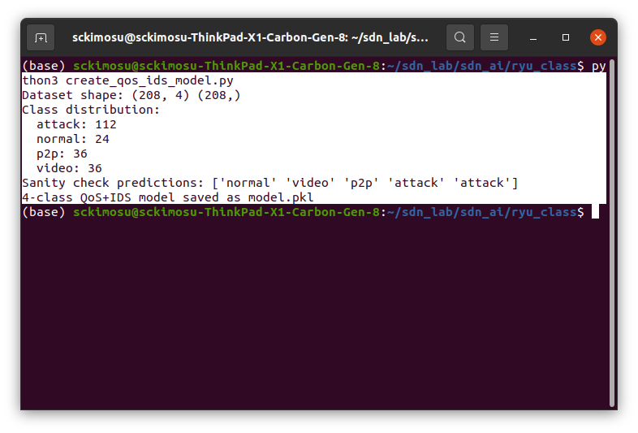
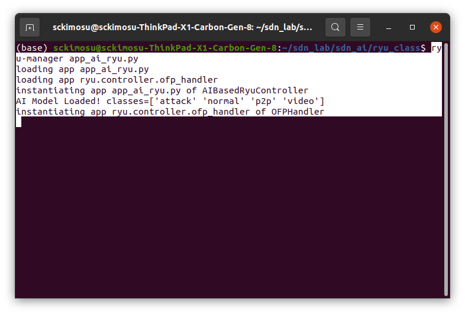
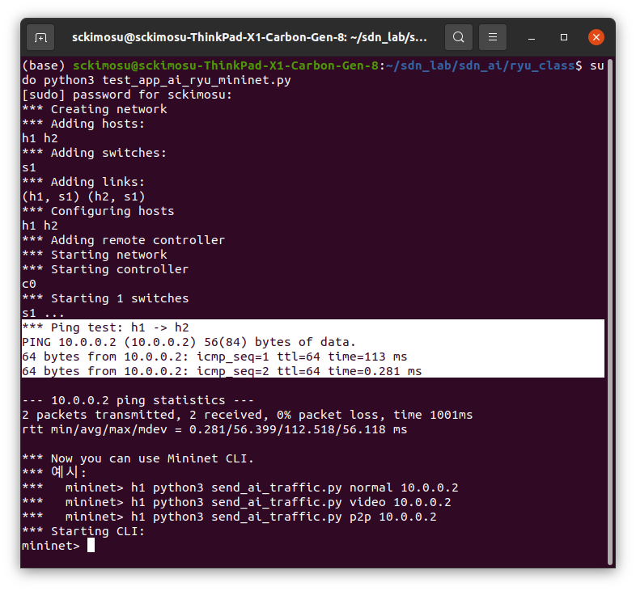
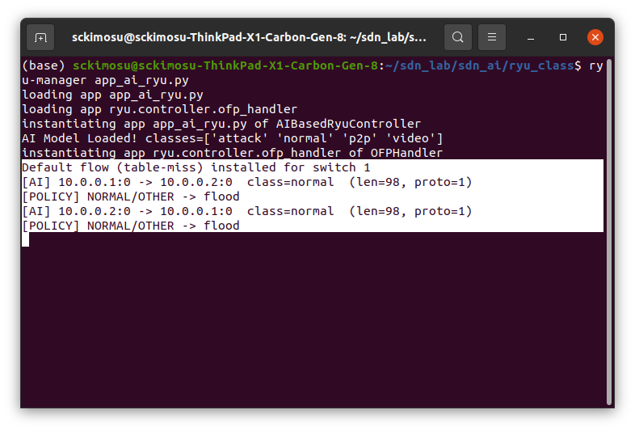
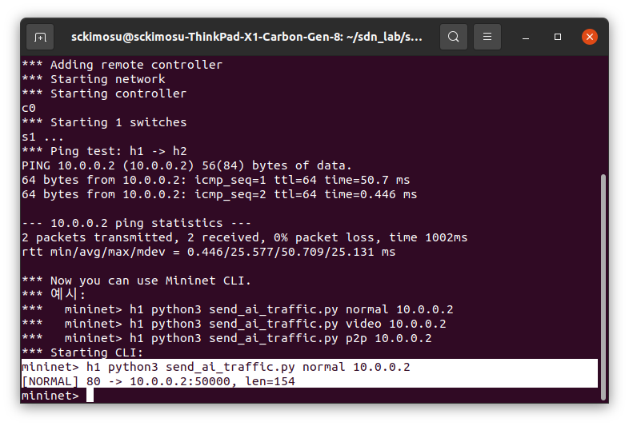
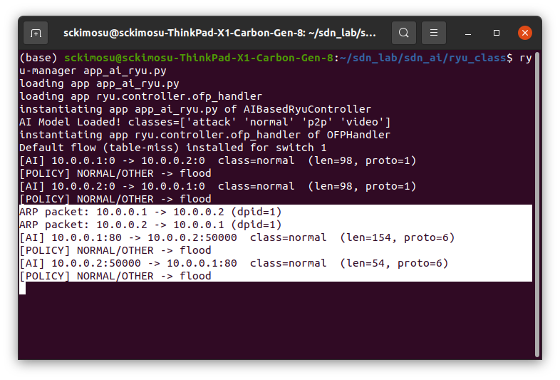
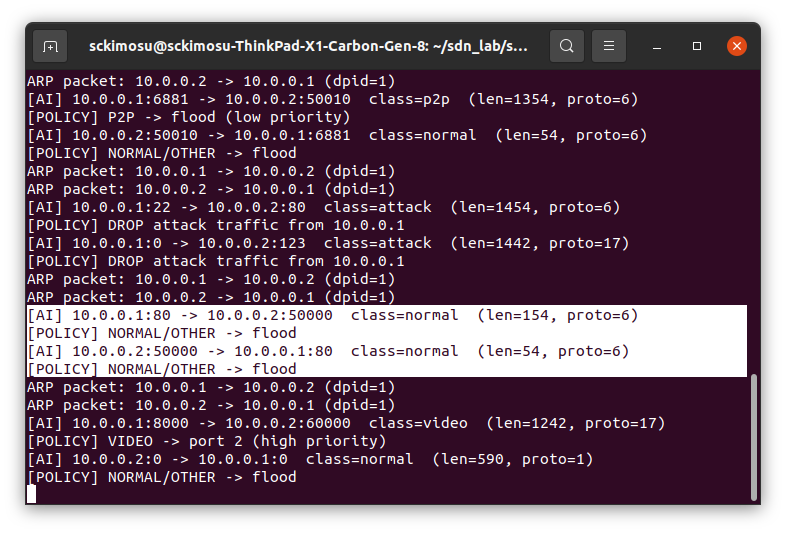

# QoS(트래픽 분류) 및 IDS(공격 탐지) 분류 AI Ryu 컨트롤러

### **normal**

- 일반 웹/일반 트래픽
- TCP, 작은 패킷, 포트 80/443 등

### **video**

- 스트리밍/미디어류
- UDP, 큰 패킷, 포트 8000~9000 등

### **p2p**

- 토렌트/파일 공유류
- TCP, 큰 패킷, 포트 6881~6999 등

## **attack**

- 비정상 트래픽 (스캔/DoS 계열을 간단히 묶어서 표현)
    - 이상한 포트(22, 23, 3389 등)에 반복적인 큰 패킷
    - UDP/TCP로 랜덤 포트에 큰 패킷 쏟아지는 패턴
    - IDS : **Intrusion Detection System**
        - **침입 탐지 시스템**
        - 네트워크나 시스템에서 **비정상·악의적 행위(공격)를 탐지하는 시스템**
            - 포트 스캐닝
            - 비정상적인 패킷 흐름
            - TCP SYN flood
            - DoS/DDoS 공격
            - 패스워드 브루트포스
            - 비정상 포트 접근 (22, 23, 3389 등)
            - 비정상 패킷 패턴
    - IPS : **Intrusion Prevention System**
        - **침입 방지 시스템**
            - **공격 탐지 + 차단(prevention)** 하는 역할
            - SDN + AI로 구현하면 자동 탐지 + 자동 차단이 가능
            
            ### IDS vs IPS
            
            | 구분 | IDS | IPS |
            | --- | --- | --- |
            | 풀네임 | Intrusion Detection System | Intrusion Prevention System |
            | 역할 | 공격을 탐지 | 공격을 탐지 + 차단 |
            | 동작 | 패시브(수동) | 액티브(능동) |
            | 처리 | 경고(Alert)만 함 | 정책에 따라 DROP, BLOCK 수행 |
            | 네트워크 위치 | 미러링된 트래픽을 읽음 | 트래픽 경로 중간에서 즉시 차단 가능 |
            | 예시 | Snort IDS | Suricata, Palo Alto IPS |
            

            
            - SDN + AI로 구현
                - AI 모델이 attack이라고 판단하면
                - `actions = []`
                    - 출력 포트 없음 → DROP
                    - FlowMod rule 설치 → 이후 동일한 공격 트래픽도 자동 DROP
                    - SDN 기반의 **IPS 기능**
            
            ```python
            if traffic_class == "attack":
                priority = 1000
                actions = []  # DROP
                self.logger.info("[POLICY] DROP attack traffic from %s", src_ip)
            

---

### 특징 (feature) 구분

- 규칙에 맞춰 **인공 학습 데이터**를 만들어서 RandomForest로 학습시키는 구조

### `pkt_len`

- normal
    - 60 ~ 400 정도
- video/p2p/attack
    - 800 ~ 1500 정도 (큰 패킷 위주)

### `proto`

- normal, p2p, attack
    - `TCP=6`
- video, attack
    - `UDP=17`

### `src_port`

- normal
    - 80, 443 위주
- video
    - 8000~9000
- p2p
    - 6881~6999
- attack
    - 22, 23, 3389, 0, 랜덤 포트

### `dst_port`

- 50000+, 60000+ 등으로 분리해서 사용

## **RandomForest**

- 머신러닝에서 가장 널리 사용되는 **앙상블(Ensemble) 모델**
- 여러 개의 결정 트리(Decision Tree)를 만들어 투표(Voting)을 통해 최종 예측을 수행하는 모델

---

- 많은 개수의 결정 트리를 만들고, 그 트리들의 예측을 투표하거나 평균 내어 최종 결과를 결정하는 모델.
    - 트리 1: normal
    - 트리 2: normal
    - 트리 3: video
    - 트리 4: normal
        - 대부분이 normal → 최종 결과 = normal
            - 이런 식의 앙상블(집단지성) 모델
- `create_qos_ids_model.py`에서 사용한 모델

---

```python
RandomForestClassifier(
    n_estimators=300,
    random_state=42,
    class_weight="balanced"
)

```

### `n_estimators=300`

- 트리 300개 사용
- 매우 안정적인 모델

### `class_weight="balanced"`

- 클래스 개수가 불균형할 때
- 자동으로 가중치를 조절해서 공격/normal/video/p2p 모두 잘 학습하도록 함

### `random_state=42`

- 재현 가능한 결과(실행할 때마다 같은 모델)
    - video/p2p/normal/attack 패턴을 **안정적으로 분류**
    - 작은 synthetic dataset에서도 높은 정확도
    - 예측 속도 빠름 → SDN 컨트롤러에서 실시간 분류 가능

---

- **많은 개수의 Decision Tree(결정트리)로 이루어진 숲(forest)**
- 각 트리가 독립적으로 학습하고
    - 최종 예측은 **투표(Majority Voting)** 또는 평균으로 결정.

---

### **RandomForest 3요소**

- **다수의 트리 (n_estimators)**

```
Tree_1
Tree_2
Tree_3
...
Tree_300

```

- 모델 : **300개의 트리로 구성**

```python
RandomForestClassifier(n_estimators=300)

```

---

- Bootstrap Sampling
    - Bootstrap : 전체 데이터에서 중복 허용(random with replacement)으로 샘플을 뽑아 새로운 학습용 데이터셋을 만드는 방법
    - 각 트리는 다른 데이터로 학습
    - 각 트리는 전체 데이터에서 **중복 허용(random)** 으로 샘플링한 데이터로 학습
        - Tree 1 → 전체 데이터 80% (중복 포함)
        - Tree 2 → 다른 랜덤 데이터 80%
        - Tree 3 → 또 다른 랜덤 데이터 80%
        - **트리마다 서로 다른 데이터 조합 → 다양성 확보 → 과적합 감소**

---

- **Feature Randomness (특징 선택도 랜덤)**
    - 각 트리는 노드(split)를 만들 때 **모든 feature를 사용하지 않고 일부만 선택**
        - 특징: `[pkt_len, proto, src_port, dst_port]`
            - 트리의 첫 split에서
                - tree_1 → pkt_len, proto 중에서 선택
                - tree_2 → pkt_len, src_port 중에서 선택
                - tree_3 → proto, dst_port 중에서 선택
                - 이렇게 **각 트리는 서로 다른 방향으로 패턴을 학습**하여 전체적인 예측 안정성 상승

---

### 입력 특징을 모든 트리에 넣음

```
features = [pkt_len=154, proto=6, src_port=80, dst_port=50000]

```

- 입력을 300개 트리가 모두 예측

```
Tree_1 -> normal
Tree_2 -> normal
Tree_3 -> video
Tree_4 -> normal
...
Tree_300 -> normal

```

### Majority Voting

- 가장 많은 표를 얻은 클래스가 최종 예측 결과가 됨
    - normal: 240 표
    - video: 20 표
    - p2p: 5 표
    - attack: 35 표
        - 최종 예측 = **normal**

---

```
                 ┌── Tree_1 (voting: normal)
                 ├── Tree_2 (voting: normal)
(features) ----> ├── Tree_3 (voting: video)
                 ├── Tree_4 (voting: normal)
                 └── ... Tree_300 (...)

Final Result = Majority Voting

```

- RandomForest의 예측 과정
    - **모든 트리는 동일한 입력을 받음**
    - **입력값을 분할하거나 변형하지 않음**
    - 입력은 단 하나, 트리 300개 모두 같은 입력을 받음

```
input_features = [154, 6, 80, 50000]

for each tree in forest:
    tree.predict(input_features)

```

---

### **트리 구조(분기 규칙) 모두 다름**

- **같은 입력이어도 각 트리에서 다른 분기 경로를 따라감**
- 트리들은 모두 다른 데이터로 학습했고, 각 split에서 사용하는 특징(feature) 후보가 random이어서 전체 구조가 전부 다름.
- **같은 입력이어도 각 트리에서 다른 결정 생성**
- Tree 1 구조

```
if **src_port** < 100:
    if **pkt_len** > 200:
        class = normal
    else:
        class = attack

```

- Tree 2 구조

```
if **proto** == 17:
    class = video
else:
    if **dst_port** > 60000:
        class = video
    else:
        class = p2p

```

- Tree 3 구조

```
if pkt_len > 1000:
    class = attack
else:
    if src_port in [6881, 6882]:
        class = p2p
    else:
        class = normal

```

- 입력: 학생 점수(수학, 영어, 과학, 역사) 4개
    - 교사 300명에게 똑같은 성적표를 줌
    - 교사마다 평가 기준이 다름
        - 누군가는 학생 우수
        - 또 다른 교사는 보통
        - 또 다른 교사는 특기생이라고 판단
- **학생(입력)은 하나지만, 교사(트리)의 판단 기준이 다르기 때문에 결과가 다양**
    - RandomForest도 동일

---

### 4-클래스 모델 생성 파일 (QoS + IDS)

- `create_qos_ids_model.py` 파일
    - 실행하면 `model.pkl` 생성됨
    - `app_ai_ryu.py`에서 그대로 읽어 사용

```python
# create_qos_ids_model.py
#
# 4클래스 QoS + IDS 모델 학습 스크립트
# feature: [pkt_len, proto, src_port, dst_port]
# class: "normal", "video", "p2p", "attack"

import joblib
import numpy as np
from sklearn.ensemble import RandomForestClassifier
from sklearn.preprocessing import StandardScaler
from sklearn.pipeline import Pipeline

def build_synthetic_dataset():
    X = []
    y = []

    # --------------------------
    # 1) normal 트래픽 (웹 등)
    #    - 작은 패킷, TCP, src_port 80/443
    # --------------------------
    for pkt_len in [80, 120, 200, 300]:
        for src_port in [80, 443]:
            for dst_port in [50000, 51000, 52000]:
                X.append([pkt_len, 6, src_port, dst_port])
                y.append("normal")

    # --------------------------
    # 2) video 트래픽 (UDP 스트리밍)
    #    - 큰 패킷, UDP, src_port 8000~9000
    # --------------------------
    for pkt_len in [900, 1100, 1300, 1500]:
        for src_port in [8000, 8001, 9000]:
            for dst_port in [60000, 61000, 62000]:
                X.append([pkt_len, 17, src_port, dst_port])
                y.append("video")

    # --------------------------
    # 3) p2p 트래픽 (TCP, 토렌트 등)
    #    - 큰 패킷, TCP, src_port 6881~6999
    # --------------------------
    for pkt_len in [900, 1100, 1300, 1500]:
        for src_port in [6881, 6882, 6999]:
            for dst_port in [50010, 50020, 50030]:
                X.append([pkt_len, 6, src_port, dst_port])
                y.append("p2p")

    # --------------------------
    # 4) attack 트래픽 (간단 IDS용)
    #    - 예시 1: 큰 패킷 + TCP + 민감 포트 (22, 23, 3389 등)
    #    - 예시 2: 큰 패킷 + UDP + 랜덤 포트/0 포트 등
    # --------------------------
    # attack - TCP
    for pkt_len in [1000, 1200, 1400, 1500]:
        for src_port in [22, 23, 3389, 0]:
            for dst_port in [80, 443, 22, 23]:
                X.append([pkt_len, 6, src_port, dst_port])
                y.append("attack")

    # attack - UDP
    for pkt_len in [1000, 1200, 1400, 1500]:
        for src_port in [0, 53, 123]:  # 0/53(DNS)/123(NTP) 등 악용 예시 느낌
            for dst_port in [0, 53, 123, 1900]:
                X.append([pkt_len, 17, src_port, dst_port])
                y.append("attack")

    X = np.array(X, dtype=float)
    y = np.array(y, dtype=object)
    return X, y

def main():
    X, y = build_synthetic_dataset()
    print("Dataset shape:", X.shape, y.shape)
    classes, counts = np.unique(y, return_counts=True)
    print("Class distribution:")
    for c, n in zip(classes, counts):
        print(f"  {c}: {n}")

    # 스케일러 + RandomForest 파이프라인
    model = Pipeline([
        ("scaler", StandardScaler()),
        ("rf", RandomForestClassifier(
            n_estimators=300,
            random_state=42,
            class_weight="balanced"  # 혹시 불균형 있어도 보정
        ))
    ])

    model.fit(X, y)

    # 간단한 sanity check
    test_samples = np.array([
        # normal
        [120, 6, 80, 50000],
        # video
        [1200, 17, 8000, 60000],
        # p2p
        [1300, 6, 6881, 50010],
        # attack(TCP)
        [1400, 6, 22, 80],
        # attack(UDP)
        [1400, 17, 0, 123],
    ], dtype=float)

    preds = model.predict(test_samples)
    print("Sanity check predictions:", preds)

    # app_ai_ryu.py에서 그대로 읽어가기 위해 파일 이름은 model.pkl로 유지
    joblib.dump(model, "model.pkl")
    print("4-class QoS+IDS model saved as model.pkl")

if __name__ == "__main__":
    main()

```

### **RandomForest 처리 학습**

- **정규(normal) 트래픽 패턴**

```python
for pkt_len in [80, 120, 200, 300]:
    for src_port in [80, 443]:
        for dst_port in [50000, 51000, 52000]:
            X.append([pkt_len, 6, src_port, dst_port])
            y.append("normal")

```

- 반복문은 아래 feature 벡터 생성
    - 총 4 × 2 × 3 = **24개의 normal 데이터**가 만들어짐.
    - 작은 패킷 + TCP + 80/443 포트 형태는 normal 이라고 **데이터로서 규칙을 명시**

| pkt_len | proto | src_port | dst_port | class |
| --- | --- | --- | --- | --- |
| 80 | 6 | 80 | 50000 | normal |
| 80 | 6 | 80 | 51000 | normal |
| 80 | 6 | 80 | 52000 | normal |
| 80 | 6 | 443 | 50000 | normal |
| ... | ... | ... | ... | normal |
| 300 | 6 | 443 | 52000 | normal |

---

### 트리마다 다른 bootstrap 샘플 생성

- normal 샘플 24개에서 트리1은 아래 데이터 추출

```
[80,6,80,50000], normal
[80,6,443,51000], normal
[120,6,80,50000], normal
[300,6,443,52000], normal
...
(중복도 포함됨)

```

- 트리2는 또 다른 랜덤 샘플을 사용함.

---

### 분기(split)에서 사용할 feature를 무작위로 고름

- split 시 feature 후보를 random으로 선택
    - 같은 normal 데이터라 하더라도 각 트리에서 **다른 관점으로 패턴을 분리하게 됨**.
        - TreeA: `[pkt_len, src_port]`
        - TreeB: `[proto, dst_port]`
        - TreeC: `[pkt_len, proto, dst_port]`

---

### Decision Tree : normal 패턴 규칙 찾음

- Tree_1 은 이런 규칙을 만들 수 있음

```
if pkt_len < 400:
    if src_port in [80,443]:
        class = normal
    else:
        class = other

```

- Tree_2 는 또 다른 규칙을 만들 수 있음

```
if proto == 6:
    if pkt_len <= 300:
        class = normal

```

- Tree_3 은 이렇게 배울 수도 있음

```
if src_port == 80:
    class = normal
elif src_port == 443:
    class = normal

```

- 트리마다 규칙이 **모두 다름** → RF의 핵심.

---

### **원본 Normal 데이터**

- 24개의 normal 샘플

| 번호 | pkt_len | proto | src_port | dst_port | class |
| --- | --- | --- | --- | --- | --- |
| 1 | 80 | 6 | 80 | 50000 | normal |
| 2 | 80 | 6 | 80 | 51000 | normal |
| 3 | 80 | 6 | 80 | 52000 | normal |
| 4 | 80 | 6 | 443 | 50000 | normal |
| … | … | … | … | … | … |
| 24 | 300 | 6 | 443 | 52000 | normal |

---

### **트리1의 샘플**

- 아래는 트리1이 뽑은 bootstrap 샘플
    - **중복 있음**
    - **일부 원본 데이터는 빠짐**
    - **일부 데이터는 2~3번 들어감**

```
Tree 1 bootstrap sample (예시):
[80, 6, 80, 50000]
[80, 6, 443, 50000]
[120, 6, 443, 51000]
[80, 6, 80, 52000]
[200, 6, 80, 50000]
[120, 6, 443, 52000]
[300, 6, 443, 50000]
[80, 6, 443, 51000]
[200, 6, 80, 50000]
...
(총 24개, 중복 존재)

```

### **트리2의 샘플 (트리1과 완전히 다름)**

- 이제 같은 원본 데이터에서 트리2는 또 다른 Random(부트스트랩) 샘플 생성
- 트리1 샘플과 다름

```
Tree 2 bootstrap sample (예시):
[120, 6, 80, 52000]
[120, 6, 80, 52000]     # ← 중복됨
[300, 6, 443, 51000]
[80, 6, 443, 52000]
[80, 6, 80, 50000]
[200, 6, 443, 51000]
[200, 6, 443, 50000]
[300, 6, 80, 50000]
[120, 6, 443, 50000]
...
(총 24개, 중복, 누락 전부 존재)

```

- 트리마다 보는 데이터 자체가 다르므로 완전히 다른 규칙을 학습하게 됨.

| 요소 | 트리1 | 트리2 |
| --- | --- | --- |
| 데이터 포함 | A, B, C 포함 | B, D, F 포함 |
| 중복 형태 | A 두 번, D 없음 | C 세 번, A 없음 |
| 분포 | pkt_len 낮은 값 많음 | pkt_len 높은 값 많음 |

---

### 트리2가 학습한 규칙

```
if pkt_len > 150:
    class = normal
else:
    if src_port == 443:
        class = normal

```

### 트리1의 규칙

- **서로 다른 데이터 → 서로 다른 규칙**

```
if src_port == 80:
    class = normal
else:
    if pkt_len <= 120:
        class = normal

```

---

## 네트워크 트래픽을 4개의 클래스로 분류하기 위한 **가상 데이터 생성**

- **create_qos_ids_model.py**
    - normal (웹)
    - video (UDP 스트리밍)
    - p2p (토렌트)
    - attack (IDS)
- RandomForest (**RF**) 기반의 파이프라인 모델 학습
    - 간단한 test 입력으로 정상 동작 확인
- 학습된 모델을 model.pkl로 저장
    - **QoS(서비스 품질) 분류 + IDS(침입 탐지)를 위한 4개 클래스(normal, video, p2p, attack) 머신러닝 모델 학습하고 저장**
    - **가상 데이터셋 생성**
    - **RandomForest 기반 분류 모델 구성**
    - **학습**
    - **테스트 샘플로 sanity-check**
    - **모델을 model.pkl로 저장**

---

### 1. **가상 데이터셋 생성 : build_synthetic_dataset()**

- 실제 트래픽 데이터를 사용하지 않고, 특정 패턴을 가진 가상 네트워크 트래픽을 생성하여 ML 모델이 **QoS + IDS 역할을 동시에 수행**할 수 있게 함

---

- Normal 트래픽 생성
    - **작은 패킷 길이**
        - 80~300 bytes
    - **TCP (proto = 6)**
    - 웹 서비스 포트인 **80/443**을 사용
    - 목적지 포트는 높은 랜덤 포트(= 클라이언트 요청)
    - 분류 라벨: `"normal"`

```python
for pkt_len in [80, 120, 200, 300]:
    for src_port in [80, 443]:
        for dst_port in [50000, 51000, 52000]:

```

- Video(스트리밍) 트래픽 생성
    - **큰 패킷**
        - 900~1500 bytes
    - **UDP (proto = 17)**
    - 스트리밍에서 자주 쓰는 포트(8000 계열)
    - 분류 라벨: `"video"`

```python
for pkt_len in [900, 1100, 1300, 1500]:
    for src_port in [8000, 8001, 9000]:
    for dst_port in [60000, 61000, 62000]:

```

---

- P2P 트래픽 생성
    - **TCP + 큰 패킷**
    - 토렌트 포트(6881~6999)
    - 분류 라벨: `"p2p"`

```python
for pkt_len in [900, 1100, 1300, 1500]:
    for src_port in [6881, 6882, 6999]:

```

---

- Attack 트래픽 생성
    - TCP 기반 공격
        - SSH(22), Telnet(23), RDP(3389) 등
            - **0 포트** 같은 비정상 포트
        - 목적지 민감 포트로 구성

```python
for src_port in [22, 23, 3389, 0]:

```

- UDP 기반 공격
    - DNS(53), NTP(123), SSDP(1900) 등 공격에 자주 악용되는 포트
    - 분류 라벨: `"attack"`

```python
for src_port in [0, 53, 123]:
for dst_port in [0, 53, 123, 1900]:

```

---

### 2. 모델 구성 (Pipeline)

- StandardScaler
    - 특징(feature) 값들을 정규화하여 모델 안정성 증가
- RandomForestClassifier
    - 트리 기반 모델로, 복잡한 비선형 패턴을 잘 잡아냄.
- class_weight="balanced"
    - 특정 클래스가 적어도 자동으로 가중치를 조절하여 불균형 데이터 문제 완화.

```python
model = Pipeline([
    ("scaler", StandardScaler()),
    ("rf", RandomForestClassifier(
        n_estimators=300,
        random_state=42,
        class_weight="balanced"
    ))
])

```

### 3. 학습

- X
    - packet_length
    - proto
    - src_port
    - dst_port
- y
    - "normal"
    - "video"
    - "p2p"
    - "attack"

---

```python
model.fit(X, y)

```

---

### 4. Sanity Check

- 테스트 샘플 5개를 넣고 예측
    - 예상 라벨이 정상적으로 나오면 모델이 정상적으로 학습된 것.

```python
test_samples = np.array([
    [120, 6, 80, 50000],        # normal
    [1200, 17, 8000, 60000],    # video
    [1300, 6, 6881, 50010],     # p2p
    [1400, 6, 22, 80],          # attack (TCP)
    [1400, 17, 0, 123],         # attack (UDP)
])

```

---

### 5. 모델 저장

- model.pkl 파일 생성
- 다른 애플리케이션(app_ai_ryu.py 같은 곳)에서 바로 불러서 사용 가능

```python
joblib.dump(model, "model.pkl")

```

---

### **Sanity Check**

- 학습한 직후, 매우 기본적인 예측을 수행해 보고 예상한 결과가 제대로 나오는지 확인하는 초기 진단 과정
- 실제 서비스에 투입하기 전에 **학습된 모델이 기본적인 패턴조차 구분하지 못하는 문제가 없는지** 가볍게 확인하는 목적
- 간단한 테스트를 통해 모델이 정상적으로 작동하는지 확인하는 과정

---

- 코드에서는 다음 5개의 샘플을 직접 생성

```python
test_samples = np.array([
    # normal
    [120, 6, 80, 50000],
    # video
    [1200, 17, 8000, 60000],
    # p2p
    [1300, 6, 6881, 50010],
    # attack(TCP)
    [1400, 6, 22, 80],
    # attack(UDP)
    [1400, 17, 0, 123],
])

```

- 각 라벨 : 무엇인지 이미 알고 있음

| 샘플 | 의미 | 예상 결과 |
| --- | --- | --- |
| [120, 6, 80, 50000] | 작은 패킷 + TCP + 80 포트 | normal |
| [1200, 17, 8000, 60000] | 큰 패킷 + UDP | video |
| [1300, 6, 6881, 50010] | 큰 패킷 + TCP + p2p 포트 | p2p |
| [1400, 6, 22, 80] | 민감 포트 → 공격 | attack |
| [1400, 17, 0, 123] | UDP + 0/123 포트 → 공격 | attack |
- 이 샘플을 모델에 넣어 예측함

```python
preds = model.predict(test_samples)
print("Sanity check predictions:", preds)

```

- 출력 (정상일 때)

```
Sanity check predictions: ['normal' 'video' 'p2p' 'attack' 'attack']

```

---

- **모델이 기본적인 패턴을 제대로 학습했는지 확인하는 빠른 검증 절차**
    - 데이터셋이 잘 만들어졌는지
    - 라벨이 올바르게 매칭되었는지
    - 모델이 엉뚱한 예측을 하지 않았는지
        - 이런 부분을 체크하는 쉬운 방법 Sanity Check

---

### `[1400, 6, 22, 80]` 샘플 분석

- **attack(공격)** 으로 분류한 이유:
    - **민감 포트(sensitive port, 22)**를 사용하고 있기 때문

| 값 | 의미 |
| --- | --- |
| **1400** | pkt_len = 큰 패킷(= 공격 트래픽에서 자주 발생) |
| **6** | 프로토콜 = TCP |
| **22** | src_port = *SSH* (보안 민감 포트) |
| **80** | dst_port = 웹 서버 포트 |

---

### **민감 포트(Sensitive Port)**

- 공격자들이 자주 노리는 보안적으로 민감한 서비스 포트 의미
- 해당 포트에서 동작하는 서비스가 **보안상 중요한 시스템 접근 경로**이기 때문에 공격자가 많이 노FLA

---

### **SSH – 22번 포트**

- 리눅스 서버 원격접속 포트
- 공격자들이 많이 시도하는 포트 중 하나
    - Brute-force, Dictionary attack, password guessing
- 22번 포트에서 로그인 시도 폭주 → 공격 시나리오 매우 흔함
    - 22는 민감 포트로 분류

---

### 민감 포트

| 포트 | 서비스 | 민감도 |
| --- | --- | --- |
| **22** | SSH | 서버 원격접속 → 공격 표적 1순위 |
| **23** | Telnet | 암호화 X → 공격자에게 취약 |
| **3389** | Windows RDP | Windows 서버 원격접속 |
| **21** | FTP | 인증 취약, 무차별 대입 공격 |
| **445** | SMB | 랜섬웨어, 웜 공격 표적 |
| **0** | 예약 포트 → 비정상 패턴 | 스캔/공격에 사용됨 |

---

- synthetic dataset에서 attack 패턴 정의
    - **패킷 크기 크고**
    - **TCP에**
    - **src_port가 22, 23, 3389, 0 중 하나면 attack** 으로 설정해둠.

```python
# attack - TCP
for pkt_len in [1000, 1200, 1400, 1500]:
    for src_port in [22, 23, 3389, 0]:
        for dst_port in [80, 443, 22, 23]:
            X.append([pkt_len, 6, src_port, dst_port])
            y.append("attack")

```

---

### **22번 포트에서 로그인 시도 폭주**

- **실제 보안 운영(보안관제, IDS/IPS, SIEM)에서 장 흔하게 관찰되는 공격 시나리오 중 하나**.
- 22번 포트는 **SSH(리눅스 서버 원격 접속)** 서비스의 기본 포트
- SSH는 다음을 가능하게 함
    - 서버 로그인
    - 관리자 권한 획득
    - 파일 업로드/다운로드
    - 명령 실행
        - **이 포트를 뚫으면 서버 전체를 장악할 수 있음**
- 공격자들은 22번 포트를 자동으로 스캔하고, 인터넷에 공개된 모든 IP의 22번을 대상으로 공격 시도

---

### **로그인 시도 폭주(Brute Force Attack)**

- 공격자는 아래 같은 자동화된 도구 사용
    - hydra
    - medusa
    - ncrack
    - botnet SSH scanner
    - Mirai, Gafgyt 등 IoT 악성코드 내장 SSH brute-force module
    - 이 도구들은 다음을 **자동으로 무한 반복**
        - 패스워드 사전(딕셔너리)을 사용한 무차별 대입 공격(Brute Force Attack)

```
root / 1234
root / admin
root / password
guest / 12345
ubuntu / ubuntu
...
패스워드 1초에 수십~수백 번 시도

```

### IDS/IPS, sshd 로그

- 수 초 안에 50~100회 실패하면 100% 공격

```
Failed password for root from 185.23.xxx.xxx port 54321 ssh2
Failed password for root from 185.23.xxx.xxx port 54321 ssh2
Failed password for root from 185.23.xxx.xxx port 54321 ssh2
Failed password for admin from 112.85.xxx.xxx port 40222 ssh2
Failed password for user from 112.85.xxx.xxx port 40222 ssh2
Failed password for ubuntu from 112.85.xxx.xxx port 40222 ssh2
...
attack: SSH brute force detected

```

---

### 공격(attack)으로 분류

- **포트 22(SSH) : 공격에 자주 활용되는 대표적인 민감 포트**
    - 포트 22는 SSH 원격 접속 포트로, 공격에서 자주 사용됨
        - SSH brute force 공격
        - 봇넷/트로이 목마의 악성 통신
        - 무작위 포트 스캐닝 공격에서 SSH는 항상 포함됨
        - 취약한 SSH 서버를 노리는 공격
            - IDS 룰셋에서도 **22 포트 사용은 고위험 행위로 분류**

---

- **코드에서 이미 공격 패턴으로 정의됨**
    - 스크립트의 Attack 생성 부분을 보면,  attack 조건
        - **큰 패킷**
        - **TCP**
        - **src_port가 22, 23, 3389, 0 중 하나 → 공격 패턴**
        - **dst_port도 민감 포트거나 웹 서버 포트**
            - **src_port = 22 이면 자동으로 attack 라벨**이 부여됨

```python
# attack - TCP
for pkt_len in [1000, 1200, 1400, 1500]:
    for src_port in [22, 23, 3389, 0]:
        for dst_port in [80, 443, 22, 23]:
            X.append([pkt_len, 6, src_port, dst_port])
            y.append("attack")

```

---

### **현재 훈련데이터가 단순하기 때문에** 정상 트래픽이라도 22 포트 쓰면 공격으로 분류됨

- 현재 **synthetic** dataset에서는 **22 포트(SSH 사용)는 attack 라벨**로 생성됨
    - 정상적인 SSH 관리 트래픽도 존재
    - **모델에는 정상적인 SSH 데이터가 제공되지 않기 때문에** 모델은 22 포트를 공격으로만 학습
    - **훈련데이터가 단순 synthetic 이기 때문에 발생하는 한계**
        - **공격/정상 구분 기준을 더 현실적으로 만들기 필요**
        - **공격 트래픽 패턴을 더 정교하게 구성 필요**

---

## 모델 생성 실험

### 명령어

```bash
python3 create_qos_ids_model.py

```

### 출력



### 출력 로그

```
Dataset shape: (N, 4) (N,)
Class distribution:
  attack: ...
  normal: ...
  p2p: ...
  video: ...
Sanity check predictions: ['normal' 'video' 'p2p' 'attack' 'attack']
4-class QoS+IDS model saved as model.pkl

```

### `Dataset shape: (N, 4) (N,)`

- 모델이 학습한 **입력 데이터(X)** 와 **라벨(Y)** 의 크기
    - **(N, 4)**
        - X 의 형태 = **N개의 샘플 × 4개의 특징**
        - 특징 4개
            - `[pkt_len, proto, src_port, dst_port]`
    - **(N,)**
        - Y 의 형태 = **N개의 라벨(클래스 값)**
        - 라벨은 `"normal"`, `"video"`, `"p2p"`, `"attack"` 중 하나
- 트래픽 샘플 N개를 만들었고 각 샘플은 4개의 숫자 특징으로 구성

---

### `Class distribution:`

- 각 클래스별 **데이터 개수**를 의미
    - 이 부분은 모델이 학습할 때 어떤 클래스가 얼마나 포함되어 있는지 보여 줌
    - 클래스 불균형 여부 체크 가능

```
attack: 112
normal: 24
p2p: 36
video: 36

```

---

### `Sanity check predictions: ['normal' 'video' 'p2p' 'attack' 'attack']`

- 모델에게 **기본적인 5개의 샘플**을 넣어서 예측한 결과
    - sanity check 입력:
        - normal 특징 → ‘normal’
        - video 특징 → ‘video’
        - p2p 특징 → ‘p2p’
        - 공격(TCP) 패턴 → ‘attack’
        - 공격(UDP) 패턴 → ‘attack’
- 출력
    - 모델이 기본적인 패턴은 올바르게 학습했다는 의미

```
['normal' 'video' 'p2p' 'attack' 'attack']

```

---

### `4-class QoS+IDS model saved as model.pkl`

- 학습 끝난 모델
    - model.pkl 이름으로 파일로 저장했다는 뜻

```
model.pkl

```

- 이 파일은 나중에 다른 스크립트에서 불러서 사용
    - “정상/비디오/P2P/공격” 을 분류하는 4개 클래스 모델이 성공적으로 저장됨.

```python
model = joblib.load("model.pkl")
model.predict([...])

```

| 출력 | 의미 |
| --- | --- |
| Dataset shape | X: N×4개의 특징, Y: N개의 레이블 |
| Class distribution | 각 클래스별 데이터 개수 |
| Sanity check predictions | 기본 샘플 예측 결과 (모델 정상 여부 확인) |
| 4-class QoS+IDS model saved | 학습 모델을 model.pkl로 저장 완료 |

### **QoS + IDS용 4클래스 ML 모델 완성**

- `create_qos_ids_model.py` 실행 성공
- **4-클래스 모델 정상 학습 완료**
- 클래스 분포 정상
- Sanity check : 의도한 대로 정확히 나옴
- `model.pkl` 으로 저장됨

---

### Dataset 생성 성공

```
Dataset shape: (208,4)
Class distribution:
    attack: 112
    normal: 24
    p2p: 36
    video: 36

```

### 모델 학습 정상

- 출력된 샘플 예측값
    - 학습 데이터와 정확히 일치 → 모델이 설계대로 학습 완료.

```
['normal' 'video' 'p2p' 'attack' 'attack']

```

### 최종 모델 저장

```
4-class QoS+IDS model saved as model.pkl

```

---

## **QoS(트래픽 분류) + IDS(공격 탐지) 분류** 실험

### Ryu 시작 : 터미널 1

- `AI Model Loaded!` 로그 확인
    - `class`가 4개(normal/video/p2p/attack)로 나오는 것 확인

```bash
pkill -f ryu-manager   # (돌아가는 게 있으면)
ryu-manager app_ai_ryu.py

```

- 화면



### Mininet 시뮬레이터 실행  : 터미널 2

```bash
sudo python3 test_app_ai_ryu_mininet.py

```

- 화면



## Mininet 화면

- **Mininet 네트워크가 정상적으로 올라옴**
- `h1 → h2` 간 ping 테스트 성공 → 네트워크 연결 정상
- Mininet CLI에서 트래픽을 보낼 수 있음

```
*** Ping test: h1 -> h2
PING 10.0.0.2 (10.0.0.2) 56(84) bytes of data.
...
*** Now you can use Mininet CLI.
mininet> h1 python3 send_ai_traffic.py normal 10.0.0.2
mininet> h1 python3 send_ai_traffic.py video 10.0.0.2
mininet> h1 python3 send_ai_traffic.py p2p 10.0.0.2

```

### 컨트롤러 화면



### Ryu 컨트롤러 화면 의미

- **AI Model Loaded! classes=[...]**
    - `model.pkl` 파일(4-class QoS/IDS 모델)이 정상 로드됨
    - attack, normal, p2p, video 4개의 클래스가 감지됨

```
AI Model Loaded! classes=['attack','normal','p2p','video']

[AI] 10.0.0.1:0 -> 10.0.0.2:0 class=normal (len=98, proto=1)
[POLICY] NORMAL/OTHER -> flood

```

---

- **[AI] 10.0.0.1:0 -> 10.0.0.2:0 class=normal**
    - 모델이 실제 트래픽을 분류한 결과
        - Mininet에서 send_ai_traffic.py로 패킷을 보내기 전에
        - h1 ↔ h2 Ping 테스트(=ICMP 프로토콜)가 이미 실행됨
        - 해당 ICMP 패킷이 먼저 도착했고,
        - AI 모델이 이 패킷(IP/ICMP)을 분석해서 판단
            - len=98 → small packet = normal 특징
            - proto=1 (ICMP) → dataset에는 없지만 normal 패턴과 가까움
        - **normal** 로 분류됨.

```
src = 10.0.0.1
dst = 10.0.0.2
src_port = 0
dst_port = 0
len = 98
proto = 1   (ICMP)
predicted class = normal

```

### **[POLICY] NORMAL/OTHER -> flood**

- Ryu에 설정해둔 **정책(policy)**
    - normal 트래픽은 특별한 QoS 정책을 적용하지 않고
    - 단순히 **flood (브로드캐스트)** 처리
    - 즉, **normal 트래픽은 차단하지 않고 네트워크에 흘려 보냄**

---

## Mininet에서 트래픽 보내기 실험

```bash
mininet> h1 python3 send_ai_traffic.py normal 10.0.0.2
mininet> h1 python3 send_ai_traffic.py video 10.0.0.2
mininet> h1 python3 send_ai_traffic.py p2p 10.0.0.2

```

- 미니넷



- 컨트롤러



## ARP 패킷 생성 시기

### ARP는 “Ping test: h1 → h2” 때문에 이미 생성됨

- send_ai_traffic.py 때문에 추가로 다시 발생할 수도 있음
- “ARP는 Ping 때문에 이미 생성었고, send_ai_traffic.py 실행 시점에는 ARP 캐시 상황에 따라 새로운 ARP가 생성될 수도 있고, 안 될 수도 있다.

---

### Ping test: h1 → h2 는 100% ARP 를 발생

- ping(=ICMP) 을 보내려면
    - h1은 h2의 MAC 주소를 모르면
    - ARP Request 를 먼저 보낸다
        - **Ping test를 하면 반드시 ARP가 발생함**
            - Ping = IP 패킷 → IP → MAC 변환 필요 → ARP 필수
    - 최초의 ARP 패킷은 **Ping test 단계에서 이미 발생**

```
*** Ping test: h1 -> h2

```

### send_ai_traffic.py 실행 시에 ARP가 다시 발생 여부

- 가능하지만 **조건부**
- Linux(또는 Mininet 호스트)의 ARP 캐시는 **보통 60초 정도 유지**
    - ping 이후 시간이 짧다면
        - h1은 여전히 h2의 MAC 주소를 기억
        - send_ai_traffic.py 실행 시 **ARP가 다시 발생하지 않음**
    - ping 이후 시간이 꽤 지났다면
        - ARP 캐시가 만료
        - send_ai_traffic.py 실행 시 **새로운 ARP 발생**
        - 
- **둘 다 가능**

---

### ARP 패킷이 도착하면 스위치는 PacketIn 생성

- 스위치 Flow Table에 ARP 처리 룰이 없으면
    - table-miss
- 스위치는 ARP 패킷 전체를 **PACKET_IN** 으로 Ryu에 전달
    - Ryu에서 보게 되는 부분

```
@set_ev_cls(EventOFPPacketIn)
def packet_in(...):
    arp_pkt = pkt.get_protocol(arp.arp)

```

---

### Ryu가 ARP 패킷 분석

- 컨트롤러(Ryu)는 여기에서
    - src MAC, dst MAC
    - src IP, dst IP
    - in_port 등을 읽음

---

### Ryu가 Flood 하기로 결정

- 이 부분이 Ryu 코드에서 구현됨
    - dst MAC을 모르면
    - ARP Request라면
    - 스위치를 통해 **브로드캐스트(Flood)** 수행

```python
actions = [parser.**OFPActionOutput**(ofproto.OFPP_FLOOD)]

```

---

### Flood는 스위치가 수행 → PacketOut 메시지 사용

- Flood 자체는 컨트롤러가 직접 하는 것이 아님
- 컨트롤러는 **스위치에게 이 패킷을 Flood해라** 라는 명령만 내림
    - 이 명령이 **PACKET_OUT** 메시지

```python
out = parser.**OFPPacketOut**(
    datapath=datapath,
    buffer_id=msg.buffer_id,
    in_port=in_port,
    actions=actions,
    data=msg.data
)
datapath.send_msg(out)

```

---

- Flood는 특별한 포트 번호로 지정

```
OFPP_FLOOD = 0xFFFF

```

- 해당 switch의 **모든 포트로 전송**
- 단, 입력(in_port) 제외 (loop 방지)

```python
parser.OFPActionOutput(ofproto.OFPP_FLOOD)

```

- **Flood 역할은 PacketOut이 수행**
- **컨트롤러는 Flood 명령만 내리는 역할**

```
1) h1 → ARP Request 브로드캐스트
2) 스위치 → Flow table 없음 → PacketIn 전송
3) Ryu packet_in 핸들러 실행
4) Ryu가 ARP 패킷인지 확인
5) dst MAC 없으면 → Flood 결정
6) Ryu → PacketOut(Action=FLOOD) 메시지를 스위치에 보냄
7) 스위치 → 모든 포트로 ARP Request 브로드캐스트

```

---

### **ARP Flood**

- **컨트롤러가 PacketOut 메시지를 통해 스위치에게 flood 해라라고 명령**
- **`PacketOut`**
    - **Ryu 컨트롤러가 ARP 패킷을 Flood 처리할 때 사용되는 동작**

---

## Ryu 로그에서 분류 확인

- normal → flood
- video → port 2 (high priority)
- p2p → flood(low)
- attack → drop

## **QoS+IDS 모델 Ryu 컨트롤러 코드**

```python
if traffic_class == "attack":
    # DROP
elif traffic_class == "video":
    # 고우선순위, 포트 2
elif traffic_class == "p2p":
    # low priority flood
else:
    # normal/기타

```

---

### `model.pkl` 조합

- `app_ai_ryu.py`+ `create_qos_ids_model.py`로 구성
    - normal → flood
    - video → port 2 고정, high priority
    - p2p → low priority flood
    - attack → drop
        - 4클래스 QoS+IDS 정책 동작
        - `app_ai_ryu.py`로 저장해서 `ryu-manager app_ai_ryu.py` 실행

```python
# app_ai_ryu.py
# Ryu + ML 기반 QoS + IDS 컨트롤러 (4클래스)
#
# - ARP 패킷: flood (기본 통신 지원)
# - IPv4 패킷:
#     1) 특징 추출  (pkt_len, proto, src_port, dst_port)
#     2) ML 모델 예측 (normal / video / p2p / attack)
#     3) traffic_class별 정책 적용
#
# create_qos_ids_model.py 로 생성한 model.pkl 사용 가정

from ryu.base import app_manager
from ryu.controller import ofp_event
from ryu.controller.handler import MAIN_DISPATCHER, CONFIG_DISPATCHER, set_ev_cls
from ryu.lib.packet import packet, ethernet, ipv4, tcp, udp, arp
from ryu.ofproto import ofproto_v1_3

import joblib
import numpy as np

class AIBasedRyuController(app_manager.RyuApp):
    OFP_VERSIONS = [ofproto_v1_3.OFP_VERSION]

    def __init__(self, *args, **kwargs):
        super(AIBasedRyuController, self).__init__(*args, **kwargs)

        # 미리 학습된 ML 모델 로딩 (RandomForest + Pipeline 등)
        # 같은 디렉터리에 model.pkl 있어야 함
        self.model = joblib.load("model.pkl")
        self.logger.info("AI Model Loaded! classes=%s",
                         getattr(self.model, "classes_", "unknown"))

        # MAC 학습용 테이블
        # mac_to_port[dpid][mac] = port
        self.mac_to_port = {}

    # 스위치가 처음 연결될 때 (기본 rule 설치)
    @set_ev_cls(ofp_event.EventOFPSwitchFeatures, CONFIG_DISPATCHER)
    def switch_features_handler(self, ev):
        datapath = ev.msg.datapath
        parser = datapath.ofproto_parser
        ofproto = datapath.ofproto

        # 테이블 미스 시 패킷을 컨트롤러로 보내는 기본 룰 (table-miss)
        match = parser.OFPMatch()
        actions = [parser.OFPActionOutput(ofproto.OFPP_CONTROLLER,
                                          ofproto.OFPCML_NO_BUFFER)]
        self.add_flow(datapath, 0, match, actions)

        self.logger.info("Default flow (table-miss) installed for switch %s",
                         datapath.id)

    # Packet-In 이벤트 처리
    @set_ev_cls(ofp_event.EventOFPPacketIn, MAIN_DISPATCHER)
    def packet_in(self, ev):
        msg = ev.msg
        datapath = msg.datapath
        parser = datapath.ofproto_parser
        ofproto = datapath.ofproto
        dpid = datapath.id

        in_port = msg.match.get('in_port', None)
        if in_port is None:
            # in_port 없으면 안전하게 무시
            self.logger.warning("PacketIn without in_port on dpid=%s", dpid)
            return

        pkt = packet.Packet(msg.data)
        eth = pkt.get_protocols(ethernet.ethernet)[0]

        # -------- MAC 학습 (L2 스위칭 기본) --------
        self.mac_to_port.setdefault(dpid, {})
        self.mac_to_port[dpid][eth.src] = in_port

        # -------- 1) ARP 패킷 처리 (기본 통신용) --------
        arp_pkt = pkt.get_protocol(arp.arp)
        if arp_pkt:
            # ARP는 일단 flood (또는 목적지 MAC 알고 있으면 지정 포트로)
            self.logger.info("ARP packet: %s -> %s (dpid=%s)",
                             arp_pkt.src_ip, arp_pkt.dst_ip, dpid)

            if arp_pkt.dst_mac in self.mac_to_port[dpid]:
                out_port = self.mac_to_port[dpid][arp_pkt.dst_mac]
            else:
                out_port = ofproto.OFPP_FLOOD

            actions = [parser.OFPActionOutput(out_port)]

            out = parser.OFPPacketOut(
                datapath=datapath,
                buffer_id=msg.buffer_id,
                in_port=in_port,
                actions=actions,
                data=msg.data
            )
            datapath.send_msg(out)
            return  # ARP 처리 끝

        # LLDP 같은 건 무시
        if eth.ethertype == 0x88cc:
            return

        # -------- 2) IPv4 + TCP/UDP 파싱 --------
        ipv4_pkt = pkt.get_protocol(ipv4.ipv4)
        tcp_pkt = pkt.get_protocol(tcp.tcp)
        udp_pkt = pkt.get_protocol(udp.udp)

        # IPv4가 아니면 여기서는 AI 안 씀 (원하면 L2 스위칭만 해도 됨)
        if not ipv4_pkt:
            self.logger.debug("Non-IPv4 packet (ethertype=0x%04x), ignore AI",
                              eth.ethertype)
            return

        src_ip = ipv4_pkt.src
        dst_ip = ipv4_pkt.dst
        proto = ipv4_pkt.proto  # TCP=6, UDP=17 등

        src_port = 0
        dst_port = 0
        if tcp_pkt:
            src_port = tcp_pkt.src_port
            dst_port = tcp_pkt.dst_port
        elif udp_pkt:
            src_port = udp_pkt.src_port
            dst_port = udp_pkt.dst_port

        pkt_len = len(msg.data)

        # ==================================================
        # 핵심 1: 특징(feature) 추출
        #   -> create_qos_ids_model.py 에서 학습에 사용한 특징과
        #      동일한 순서/형태로 만들어야 함
        #   예: [패킷 길이, L4 프로토콜 번호, src_port, dst_port]
        # ==================================================
        features = np.array([pkt_len, proto, src_port, dst_port],
                            dtype=float).reshape(1, -1)

        # ==================================================
        # 핵심 2: AI 모델 예측
        #   traffic_class 값은 model.pkl 학습 때 사용한 라벨
        #   예: "normal", "video", "p2p", "attack"
        # ==================================================
        try:
            traffic_class = self.model.predict(features)[0]
        except Exception as e:
            self.logger.error("Model prediction error: %s", e)
            # 모델 에러 시 안전하게 normal 취급
            traffic_class = "normal"

        self.logger.info(
            "[AI] %s:%s -> %s:%s  class=%s  (len=%s, proto=%s)",
            src_ip, src_port, dst_ip, dst_port,
            traffic_class, pkt_len, proto
        )

        # ==================================================
        # 핵심 3: 클래스별 정책 적용
        #   - attack  : IDS 스타일 → drop
        #   - video   : QoS 스타일 → 특정 포트(예: 2번)로 고정, 우선순위 높게
        #   - p2p     : 낮은 우선순위 flood
        #   - normal  : 기본 flood
        # ==================================================
        actions = []
        priority = 100
        out_port = ofproto.OFPP_FLOOD

        if traffic_class == "attack":
            # IDS 스타일: attack 트래픽은 drop
            priority = 1000
            actions = []  # drop
            self.logger.info("[POLICY] DROP attack traffic from %s", src_ip)

        elif traffic_class == "video":
            # QoS 스타일: video 트래픽은 포트 2로 고정, 높은 우선순위
            # 주의: 실제 토폴로지에서 h2가 s1의 어느 포트에 물려있는지 확인 필요
            out_port = 2
            priority = 500
            actions = [parser.OFPActionOutput(out_port)]
            self.logger.info("[POLICY] VIDEO -> port %s (high priority)", out_port)

        elif traffic_class == "p2p":
            # p2p는 낮은 우선순위로 flood
            out_port = ofproto.OFPP_FLOOD
            priority = 50
            actions = [parser.OFPActionOutput(out_port)]
            self.logger.info("[POLICY] P2P -> flood (low priority)")

        else:
            # normal / 기타: 기본 flood, 보통 우선순위
            out_port = ofproto.OFPP_FLOOD
            priority = 100
            actions = [parser.OFPActionOutput(out_port)]
            self.logger.info("[POLICY] NORMAL/OTHER -> flood")

        # -------- 4) FlowMod 설치 (스위치에 룰 넣기) --------
        # 너무 세밀하게 match 하면 flow 수가 많아질 수 있으니,
        # 여기서는 (src_ip, dst_ip, proto) 기준의 간단한 match 사용
        match = parser.OFPMatch(
            eth_type=0x0800,  # IPv4
            ipv4_src=src_ip,
            ipv4_dst=dst_ip,
            ip_proto=proto
        )

        self.add_flow(datapath, priority, match, actions, idle_timeout=10)

        # 현재 패킷도 바로 포워딩
        out = parser.OFPPacketOut(
            datapath=datapath,
            buffer_id=msg.buffer_id,
            in_port=in_port,
            actions=actions,
            data=msg.data
        )
        datapath.send_msg(out)

    # 공통 Flow 설치 함수
    def add_flow(self, datapath, priority, match, actions,
                 idle_timeout=0, hard_timeout=0):
        parser = datapath.ofproto_parser
        ofproto = datapath.ofproto

        inst = [parser.OFPInstructionActions(
            ofproto.OFPIT_APPLY_ACTIONS, actions
        )]

        mod = parser.OFPFlowMod(
            datapath=datapath,
            priority=priority,
            match=match,
            instructions=inst,
            idle_timeout=idle_timeout,
            hard_timeout=hard_timeout
        )
        datapath.send_msg(mod)

```

---

## **QoS + IDS 를 하는 ML Ryu SDN  컨트롤러**

- `model.pkl`을 읽어와서 트래픽을 **normal / video / p2p / attack** 으로 분류
- 클래스에 따라 **포워딩 정책 적용**
    - 스위치 처음 연결 시 **table-miss 룰 설치**
    - Packet-In 이벤트 처리
    - ARP → flood
    - IPv4(+TCP/UDP) → AI 모델로 분류 → 정책 적용
    - 정책대로 FlowMod 설치 + PacketOut

---

## 2. 초기화 (`__init__`)

```python
self.model = joblib.load("model.pkl")
self.logger.info("AI Model Loaded! classes=%s",
                 getattr(self.model, "classes_", "unknown"))
self.mac_to_port = {}

```

- `model.pkl`
    - **ML 모델 로딩** (RandomForest 파이프라인)
    - `classes_` :  `'attack','normal','p2p','video'` 라벨
- `mac_to_port`
    - L2 스위칭용 MAC 테이블
    - `mac_to_port[dpid][mac] = port`

---

## 3. 스위치 최초 연결 시 (SwitchFeatures 핸들러)

- 스위치가 처음 Ryu에 연결될 때 호출
- **table-miss 룰** 설치
    - 어떤 패킷이든 매치 안 되면 컨트롤러로 Packet-In 전송
    - 우선순위 0
    - match 비워둠(=모든 패킷

```python
@set_ev_cls(ofp_event.EventOFPSwitchFeatures, CONFIG_DISPATCHER)
def switch_features_handler(self, ev):
    ...
    match = parser.OFPMatch()
    actions = [parser.OFPActionOutput(ofproto.OFPP_CONTROLLER,
                                      ofproto.OFPCML_NO_BUFFER)]
    self.add_flow(datapath, 0, match, actions)

```

---

## 4. Packet-In 처리 (`packet_in`)

### 4-1. 공통 처리 및 L2 학습

- 수신한 패킷을 Ryu `packet.Packet` 객체로 파싱
    - 이더넷 헤더 추출
    - `eth.src` MAC 을 `in_port`와 매핑 → **MAC 학습 (스위치 기능)**

```python
pkt = packet.Packet(msg.data)
eth = pkt.get_protocols(ethernet.ethernet)[0]

self.mac_to_port.setdefault(dpid, {})
self.mac_to_port[dpid][eth.src] = in_port

```

---

### 4-2. ARP 패킷 처리

- ARP인지 확인
- **ARP면 AI 모델 안 쓰고 바로 처리**
    - 목적지 MAC 을 이미 알고 있으면 해당 포트로
    - 몰라서 브로드캐스트해야 하면 `OFPP_FLOOD`
    - `PacketOut` 으로 패킷만 포워딩하고 함수 종료.
- "ARP packet: 10.0.0.1 -> 10.0.0.2" 로그가 여기서 찍힘

```python
arp_pkt = pkt.get_protocol(arp.arp)
if arp_pkt:
    self.logger.info("ARP packet: %s -> %s (dpid=%s)",
                     arp_pkt.src_ip, arp_pkt.dst_ip, dpid)

    if arp_pkt.dst_mac in self.mac_to_port[dpid]:
        out_port = self.mac_to_port[dpid][arp_pkt.dst_mac]
    else:
        out_port = ofproto.OFPP_FLOOD
    ...
    datapath.send_msg(out)
    return

```

---

### 4-3. IPv4 여부 확인

- IPv4 헤더가 없으면 AI 안 쓰고 무시 (LLDP, 기타 프로토콜 등)
- IPv4일 때만 아래 단계 진행

```python
ipv4_pkt = pkt.get_protocol(ipv4.ipv4)
tcp_pkt = pkt.get_protocol(tcp.tcp)
udp_pkt = pkt.get_protocol(udp.udp)

if not ipv4_pkt:
    self.logger.debug("Non-IPv4 packet (ethertype=0x%04x), ignore AI",
                      eth.ethertype)
    return

```

---

### 4-4. 특징(feature) 추출

- IP/포트/프로토콜/패킷 길이 추출
- `create_qos_ids_model.py` 에서 학습한 것과 **똑같은 순서**로 배열 구성
    - `[packet_length, proto, src_port, dst_port]`
- `reshape(1, -1)` 해서 1개 샘플 형태로 (모델 입력 형태)

```python
src_ip = ipv4_pkt.src
dst_ip = ipv4_pkt.dst
proto = ipv4_pkt.proto  # TCP=6, UDP=17 등

src_port = 0
dst_port = 0
if tcp_pkt:
    src_port = tcp_pkt.src_port
    dst_port = tcp_pkt.dst_port
elif udp_pkt:
    src_port = udp_pkt.src_port
    dst_port = udp_pkt.dst_port

pkt_len = len(msg.data)

features = np.array([pkt_len, proto, src_port, dst_port],
                    dtype=float).reshape(1, -1)

```

---

### 4-5. AI 모델 예측

- `model.predict(features)`
    - `"normal"`, `"video"`, `"p2p"`, `"attack"` 중 하나 리턴
- 예외 발생하면 안전하게 `"normal"` 로 취급

```python
try:
    traffic_class = self.model.predict(features)[0]
except Exception as e:
    self.logger.error("Model prediction error: %s", e)
    traffic_class = "normal"

```

- 로그
    - `[AI] 10.0.0.1:80 -> 10.0.0.2:50000 class=normal (len=154, proto=6)`

```python
self.logger.info(
    "[AI] %s:%s -> %s:%s  class=%s  (len=%s, proto=%s)",
    src_ip, src_port, dst_ip, dst_port,
    traffic_class, pkt_len, proto
)

```

---

## 5. 클래스별 정책 적용 (QoS + IDS 구현)

```python
actions = []
priority = 100
out_port = ofproto.OFPP_FLOOD

if traffic_class == "attack":
    ...
elif traffic_class == "video":
    ...
elif traffic_class == "p2p":
    ...
else:
    ...

```

### 5-1. attack → IDS 스타일 : Drop

- `actions` 를 빈 리스트로
    - 아무 포트로도 내보내지 않음 → **DROP**
- 우선순위 1000으로 가장 높게 설정.

```python
if traffic_class == "attack":
    priority = 1000
    actions = []  # drop
    self.logger.info("[POLICY] DROP attack traffic from %s", src_ip)

```

---

### 5-2. video → 특정 포트로 고정 (고우선순위 QoS)

- `out_port = 2` 로 지정
    - 서버/비디오 서버가 연결된 포트라고 가정
- 다른 트래픽보다 높은 우선순위 (500)
- 실제 토폴로지에서 h2가 어느 포트인지 맞춰줘야 함

```python
elif traffic_class == "video":
    out_port = 2
    priority = 500
    actions = [parser.OFPActionOutput(out_port)]
    self.logger.info("[POLICY] VIDEO -> port %s (high priority)", out_port)

```

---

### 5-3. p2p → 낮은 우선순위 flood

- QoS 관점에서 **낮은 중요도**로 가정
- flood는 하지만 우선순위 50으로 가장 낮게

```python
elif traffic_class == "p2p":
    out_port = ofproto.OFPP_FLOOD
    priority = 50
    actions = [parser.OFPActionOutput(out_port)]
    self.logger.info("[POLICY] P2P -> flood (low priority)")

```

---

### 5-4. normal / 기타 → 기본 flood

- 일반적인 트래픽은 기본 flood.
- 우선순위 100 (p2p보다 높고, video/attack보다는 낮거나 중간).

```python
else:
    out_port = ofproto.OFPP_FLOOD
    priority = 100
    actions = [parser.OFPActionOutput(out_port)]
    self.logger.info("[POLICY] NORMAL/OTHER -> flood")

```

---

## 6. FlowMod 설치 (스위치에 룰 넣기)

- **매치 조건**
    - IPv4 (`eth_type=0x0800`)
    - src/dst IP
    - L4 프로토콜 (TCP/UDP)
- 포트까지는 매치하지 않아서 플로우 수를 줄임

```python
match = parser.OFPMatch(
    eth_type=0x0800,  # IPv4
    ipv4_src=src_ip,
    ipv4_dst=dst_ip,
    ip_proto=proto
)

self.add_flow(datapath, priority, match, actions, idle_timeout=10)

```

- `idle_timeout=10` → 10초간 사용 없으면 플로우 삭제.
    - 그리고 현재 패킷도 바로 내보냄

```python
out = parser.OFPPacketOut(...)
datapath.send_msg(out)

```

---

## 7. `add_flow` 함수

- 공통 FlowMod 인스톨 함수
- instruction
    - APPLY_ACTIONS 로 `actions` 적용.
- `idle_timeout`, `hard_timeout` 인자도 받을 수 있게 해둠

```python
def add_flow(self, datapath, priority, match, actions,
             idle_timeout=0, hard_timeout=0):
    ...
    mod = parser.OFPFlowMod(...)
    datapath.send_msg(mod)

```

---

## **QoS + IDS 를 하는 ML Ryu SDN  컨트롤러**

- Mininet 에서 `h1 python3 send_ai_traffic.py normal 10.0.0.2` 실행
- h1 → h2 패킷이 스위치를 거쳐 Ryu로 Packet-In
- Ryu가 IPv4/TCP/길이/포트 정보를 추출
- `model.pkl` 로 분류 → `normal` 이라고 판단
- `NORMAL/OTHER -> flood` 정책 로그 출력
- Flood 액션으로 PacketOut + FlowMod 설치
- 이후 동일한 src/dst/proto 트래픽은 스위치가 직접 처리 (컨트롤러 안 올라옴)
    - attack/video/p2p 에 대해서도 같은 방식으로 **AI → 정책 매핑 → Flow 설치**가 실행됨

---

### `h1 python3 send_ai_traffic.py normal 10.0.0.2`

- `h1`
    - Mininet의 호스트 1
- h1에서 send_ai_traffic.py 스크립트를 실행하여 h2(10.0.0.2)로 normal 트래픽을 생성해 전송
    - 송신자: **h1**
    - 목적지 IP: **10.0.0.2** (= h2)
    - 트래픽 타입: **normal(웹/일반 통신 패턴)**

```
h1 python3 send_ai_traffic.py normal 10.0.0.2

```

---

### normal 트래픽 특징

- **TCP 사용 (proto=6)**
- **src_port = 80 또는 443** (웹 트래픽 기반)
- **dst_port = 50000 같은 ephemeral port**
- **작은 패킷 길이 (~100~300 bytes)**
    - 실제 출력
    - 작은 패킷 + TCP + 웹 포트
        
        → AI 모델이 "normal"로 인식하도록 만든 패턴
        

```
[NORMAL] 80 -> 10.0.0.2:50000, len=154

```

---

### **ARP 발생 여부**

- h1이 h2(10.0.0.2)로 처음 패킷을 보낼 때:
    - h1은 h2의 MAC 주소를 모름
        - ARP Request 발생
    - 만약 Ping test 등으로 이미 ARP 캐시가 있다면 ARP는 발생하지 않을 수도 있음
        - **ARP는 send_ai_traffic.py 때문이 아니라 IP 통신을 위한 기본 과정**

---

### **스위치(OpenFlow)의 동작**

- 패킷이 스위치(s1)로 들어오면
    - Flow Table에 해당 룰이 없음
        - table-miss
        - **PacketIn** 발생
        - Ryu 컨트롤러로 전달
            - ARP도 동일하게 PacketIn 발생

---

### **Ryu 컨트롤러의 동작**

- app_ai_ryu.py 내부

### 1. 패킷 파싱

- pkt_len
- proto (TCP=6)
- src_port=80
- dst_port=50000

### 2. AI 모델에 특징 입력

- 모델이 예측: **"normal"**

```
[154, 6, 80, 50000]

```

- 로그

```
[AI] 10.0.0.1:80 -> 10.0.0.2:50000  class=normal

```

### 정책 적용

- normal → flood
- 로그
    - 정상 트래픽이므로 차단하지 않고 네트워크로 전파(flood)시킴

```
[POLICY] NORMAL/OTHER -> flood

```

---

### **FlowMod 설치**

- Ryu는 이후 같은 패턴을 자동 처리하도록 스위치에 룰을 설치
    - 다음 동일한 트래픽은 PacketIn 없이 자동 처리

```
match: (ipv4_src=10.0.0.1, ipv4_dst=10.0.0.2, proto=6)
action: flood

```

---

```
[명령 실행]
h1 traffic_generator(normal) → TCP packet → s1

[s1]
flow table miss → PacketIn → Ryu

[Ryu]
feature 추출 → AI예측(normal) → 정책(flood) → PacketOut
FlowMod 설치

[s1]
패킷 flood → h2 도착

```

---

## **Mininet 스크립트 코드**

- `test_app_ai_ryu_mininet.py`
- **`app_ai_ryu.py` 테스트용**

```python
# test_app_ai_ryu_mininet.py
#
# app_ai_ryu.py (Ryu + ML 기반 QoS/IDS 컨트롤러) 테스트용 Mininet 스크립트
#
# 토폴로지:
#   h1 ---- s1 ---- h2
#
# - 컨트롤러: 127.0.0.1:6633 (RemoteController, OpenFlow 1.3)
# - 실행 후:
#     * h1 ↔ h2 ping 테스트
#     * Mininet CLI 진입 → send_ai_traffic.py 로 트래픽 쏴서 테스트

from mininet.net import Mininet
from mininet.node import OVSSwitch, RemoteController
from mininet.topo import Topo
from mininet.cli import CLI
from mininet.log import setLogLevel, info

class SimpleAITopo(Topo):
    """
    h1 --- s1 --- h2 구조의 간단한 토폴로지
    """

    def build(self):
        # OpenFlow 1.3 사용하도록 protocols 지정
        s1 = self.addSwitch('s1', protocols='OpenFlow13')

        # 호스트 2개 (IP 고정)
        h1 = self.addHost('h1', ip='10.0.0.1/24')
        h2 = self.addHost('h2', ip='10.0.0.2/24')

        # 링크 연결
        self.addLink(h1, s1)
        self.addLink(h2, s1)

def run():
    topo = SimpleAITopo()
    net = Mininet(
        topo=topo,
        switch=OVSSwitch,
        controller=None,      # RemoteController를 수동으로 추가
        autoSetMacs=True,
        autoStaticArp=True
    )

    # Ryu 컨트롤러 (app_ai_ryu.py) 가 127.0.0.1:6633 에 떠 있다고 가정
    info('*** Adding remote controller\n')
    c0 = net.addController(
        'c0',
        controller=RemoteController,
        ip='127.0.0.1',
        port=6633
    )

    info('*** Starting network\n')
    net.start()

    h1, h2 = net.get('h1', 'h2')

    # 기본 연결 확인용 ping 테스트
    info('*** Ping test: h1 -> h2\n')
    print(h1.cmd('ping -c 2 10.0.0.2'))

    info('*** Now you can use Mininet CLI.\n')
    info('*** 예시:\n')
    info('***   mininet> h1 python3 send_ai_traffic.py normal 10.0.0.2\n')
    info('***   mininet> h1 python3 send_ai_traffic.py video 10.0.0.2\n')
    info('***   mininet> h1 python3 send_ai_traffic.py p2p 10.0.0.2\n')

    # CLI 진입
    CLI(net)

    info('*** Stopping network\n')
    net.stop()

if __name__ == '__main__':
    setLogLevel('info')
    run()

```

## 실험 구성

**모델 생성**

```bash
python3 create_qos_ids_model.py   # 또는 create_qos_model.py

```

**Ryu 컨트롤러 실행**

```bash
ryu-manager app_ai_ryu.py

```

**테스트 토폴로지 실행**

```bash
sudo python3 test_app_ai_ryu_mininet.py

```

**Mininet CLI에서 트래픽 전송**

```bash
mininet> h1 python3 send_ai_traffic.py normal 10.0.0.2
mininet> h1 python3 send_ai_traffic.py video 10.0.0.2
mininet> h1 python3 send_ai_traffic.py p2p 10.0.0.2

```

## 4클래스(normal / video / p2p / attack) 테스트 `send_ai_traffic.py`

- `app_ai_ryu.py` + `create_qos_ids_model.py` 조합에 맞게 설계
- Mininet에서 h1에서 실행한다고 가정 (`iface` 기본값 `h1-eth0`)
- 각 트래픽 타입이 **모델 학습 데이터 패턴과 최대한 비슷하게** 패킷 생성

```python
# send_ai_traffic.py
#
# Ryu + ML 기반 QoS/IDS 컨트롤러(app_ai_ryu.py) 테스트용 트래픽 생성 스크립트
#
# usage (Mininet CLI 안에서):
#   mininet> h1 python3 send_ai_traffic.py normal 10.0.0.2
#   mininet> h1 python3 send_ai_traffic.py video 10.0.0.2
#   mininet> h1 python3 send_ai_traffic.py p2p 10.0.0.2
#   mininet> h1 python3 send_ai_traffic.py attack 10.0.0.2
#
# 필요시 iface 지정도 가능:
#   mininet> h1 python3 send_ai_traffic.py normal 10.0.0.2 h1-eth0
#
# feature 패턴은 create_qos_ids_model.py 의 학습 데이터와 최대한 일치하게 구성:
#   [pkt_len, proto, src_port, dst_port]

import sys

from scapy.all import Ether, IP, TCP, UDP, sendp

def send_normal(dst_ip, iface):
    """
    normal 예시:
    - 작은 패킷, TCP, src_port 80/443
    - 학습 예: [120, 6, 80, 50000]
    """
    src_port = 80
    dst_port = 50000
    payload = b'N' * 100  # 약 100바이트

    pkt = Ether() / IP(dst=dst_ip) / TCP(sport=src_port, dport=dst_port) / payload
    print(f"[NORMAL] {src_port} -> {dst_ip}:{dst_port}, len={len(bytes(pkt))}")
    sendp(pkt, iface=iface, count=1, verbose=False)

def send_video(dst_ip, iface):
    """
    video 예시:
    - 큰 패킷, UDP, src_port 8000/9000
    - 학습 예: [1200, 17, 8000, 60000]
    """
    src_port = 8000
    dst_port = 60000
    payload = b'V' * 1200  # 약 1200바이트

    pkt = Ether() / IP(dst=dst_ip) / UDP(sport=src_port, dport=dst_port) / payload
    print(f"[VIDEO] {src_port} -> {dst_ip}:{dst_port}, len={len(bytes(pkt))}")
    sendp(pkt, iface=iface, count=1, verbose=False)

def send_p2p(dst_ip, iface):
    """
    p2p 예시:
    - 큰 패킷, TCP, src_port 6881~6999
    - 학습 예: [1300, 6, 6881, 50010]
    """
    src_port = 6881
    dst_port = 50010
    payload = b'P' * 1300  # 약 1300바이트

    pkt = Ether() / IP(dst=dst_ip) / TCP(sport=src_port, dport=dst_port) / payload
    print(f"[P2P] {src_port} -> {dst_ip}:{dst_port}, len={len(bytes(pkt))}")
    sendp(pkt, iface=iface, count=1, verbose=False)

def send_attack(dst_ip, iface):
    """
    attack 예시:
    create_qos_ids_model.py 에서 설계한 패턴과 유사하게:
    - 큰 패킷, TCP, src_port 22, dst_port 80
      학습 예: [1400, 6, 22, 80]
    - 또는 큰 패킷, UDP, src_port 0, dst_port 123
      학습 예: [1400, 17, 0, 123]
    여기서는 둘 중 하나 선택해서 보내도 되고, 둘 다 보내도 됨.
    """

    # TCP 기반 공격 느낌 패킷 (예: SSH brute-force, 포트 스캔 느낌)
    src_port_tcp = 22
    dst_port_tcp = 80
    payload_tcp = b'A' * 1400

    pkt_tcp = Ether() / IP(dst=dst_ip) / TCP(sport=src_port_tcp, dport=dst_port_tcp) / payload_tcp
    print(f"[ATTACK-TCP] {src_port_tcp} -> {dst_ip}:{dst_port_tcp}, len={len(bytes(pkt_tcp))}")
    sendp(pkt_tcp, iface=iface, count=1, verbose=False)

    # UDP 기반 공격 느낌 패킷 (예: NTP/DNS 증폭 트래픽 비슷한 패턴)
    src_port_udp = 0
    dst_port_udp = 123
    payload_udp = b'A' * 1400

    pkt_udp = Ether() / IP(dst=dst_ip) / UDP(sport=src_port_udp, dport=dst_port_udp) / payload_udp
    print(f"[ATTACK-UDP] {src_port_udp} -> {dst_ip}:{dst_port_udp}, len={len(bytes(pkt_udp))}")
    sendp(pkt_udp, iface=iface, count=1, verbose=False)

def main():
    if len(sys.argv) < 3:
        print("Usage: python3 send_ai_traffic.py [normal|video|p2p|attack] <dst_ip> [iface]")
        sys.exit(1)

    traffic_type = sys.argv[1]
    dst_ip = sys.argv[2]
    iface = sys.argv[3] if len(sys.argv) > 3 else "h1-eth0"  # Mininet에서 h1 기본 NIC

    if traffic_type == "normal":
        send_normal(dst_ip, iface)
    elif traffic_type == "video":
        send_video(dst_ip, iface)
    elif traffic_type == "p2p":
        send_p2p(dst_ip, iface)
    elif traffic_type == "attack":
        send_attack(dst_ip, iface)
    else:
        print("Unknown traffic type. Use: normal, video, p2p, attack")
        sys.exit(1)

if __name__ == "__main__":
    main()

```

---

### Mininet

```bash
# (1) Ryu 컨트롤러 실행 중이어야 함
ryu-manager app_ai_ryu.py

# (2) Mininet 토폴로지 실행
sudo python3 test_app_ai_ryu_mininet.py

# (3) Mininet CLI에서:
mininet> h1 python3 send_ai_traffic.py normal 10.0.0.2
mininet> h1 python3 send_ai_traffic.py video 10.0.0.2
mininet> h1 python3 send_ai_traffic.py p2p 10.0.0.2
mininet> h1 python3 send_ai_traffic.py attack 10.0.0.2

```

- 보내고 나면, `ryu-manager` 터미널에
    - normal → `[AI] ... class=normal` + `[POLICY] NORMAL/OTHER -> flood`
    - video → `[AI] ... class=video` + `[POLICY] VIDEO -> port 2 (high priority)`
    - p2p → `[AI] ... class=p2p` + `[POLICY] P2P -> flood (low priority)`
    - attack → `[AI] ... class=attack` + `[POLICY] DROP attack traffic from ...`
    - 로그가 뜨는지 보면서 QoS+IDS 정책이 잘 동작하는지 확인

- send_ai_traffic.py 사용 화면


- send_ai_traffic.py 사용 화면
    - 로그 한 줄씩 보면, 설계한 4클래스 QoS+IDS가 **동작 중**



---

## 1. normal 트래픽

- `TCP(6), src_port=80` → 학습 데이터상 **normal**
- 양방향(요청/응답) 모두 normal로 잘 분류
- 정책도 예상대로 `flood` (기본 정책) 적용.

```
[AI] 10.0.0.1:80 -> 10.0.0.2:50000  class=normal  (len=154, proto=6)
[POLICY] NORMAL/OTHER -> flood

[AI] 10.0.0.2:50000 -> 10.0.0.1:80  class=normal  (len=54, proto=6)
[POLICY] NORMAL/OTHER -> flood

```

### **두 번 정책이 적용되는 이유**

- **정방향 패킷(h1이 보낸 것) + 역방향 패킷(상대가 응답한 것)** 둘 다 컨트롤러로 올라오기 때문

```
h1 python3 send_ai_traffic.py normal 10.0.0.2

[AI] 10.0.0.1:80 -> 10.0.0.2:50000  class=normal  (len=154, proto=6)
[POLICY] NORMAL/OTHER -> flood

[AI] 10.0.0.2:50000 -> 10.0.0.1:80  class=normal  (len=54, proto=6)
[POLICY] NORMAL/OTHER -> flood

```

---

### 1. 첫 번째 로그: h1 → h2 로 보낸 패킷

- `send_ai_traffic.py normal` 이 하는 일

```python
src_port = 80
dst_port = 50000
payload = b'N' * 100
pkt = Ether()/IP(dst=10.0.0.2)/TCP(sport=80, dport=50000)/payload
sendp(pkt, iface="h1-eth0")

```

- 스위치 입장에서 보면:
    - src IP: **10.0.0.1**
    - dst IP: **10.0.0.2**
    - src port: **80**
    - dst port: **50000**
    - proto: **TCP(6)**
    - 길이: **154 바이트 (헤더 + payload)**
- 이 패킷이 테이블 미스 → Packet-In → AI 분류 → `class=normal` → 정책 flood.

---

### 2. 두 번째 로그: h2 → h1 로 돌아오는 응답 패킷

- 10.0.0.2(h2) 커널 입장에서는
    - 10.0.0.1:80 → h2(10.0.0.2):50000 로 이상한 TCP 세그먼트가 들어옴
    - 해당 포트(50000)가 열려 있지도, 세션(handshake)도 없으니
    - **보통 TCP RST(Reset) 등의 응답을 보냄**
- 그 응답 패킷의 5튜플
    - src IP: **10.0.0.2**
    - dst IP: **10.0.0.1**
    - src port: **50000** (원래의 dst 포트)
    - dst port: **80** (원래의 src 포트)
    - proto: **TCP(6)**
    - 길이: **54 바이트** (payload 없이 헤더만 있는 TCP 세그먼트라 짧음)
- 역방향 패킷도 아직 해당 방향으로 설치된 flow가 없기 때문에 다시 **table-miss → Packet-In → AI 분류**를 수행하게 됨
- 두 번째 줄
    - 생성되며 정상적인 동작

```
[AI] 10.0.0.2:50000 -> 10.0.0.1:80  class=normal  (len=54, proto=6)
[POLICY] NORMAL/OTHER -> flood

```

---

### 둘 다 class=normal 임

- 모델은 feature를 이렇게 정의함
    - 두 번째 패킷도 여전히
        - proto = 6 (TCP)
        - src_port = 50000, dst_port = 80
        - 길이도 그리 크지 않음(54)
    - 학습된 규칙 관점에서 공격 느낌도 아니고, p2p나 video 패턴(큰 패킷 + 특정 포트 대역)도 아니라서**normal로 분류**

```python
[pkt_len, proto, src_port, dst_port]

```

---

## 2. ARP

- ARP는 AI 안 타고 **별도로 flood 처리** → 정상 동작.
- ping, 기본 통신이 잘 되니까 계속 보이는 로그입니다.

```
ARP packet: 10.0.0.1 -> 10.0.0.2 (dpid=1)
ARP packet: 10.0.0.2 -> 10.0.0.1 (dpid=1)

```

---

## 3. video 트래픽

- `UDP(17) + src_port=8000 + 큰 패킷` → **video**로 정확히 분류
- `VIDEO -> port 2 (high priority)`정책
    - 설정한 QoS 스타일 정책 실행 중
    - s1의 2번 포트가 h2 쪽이라면 video 전용 고우선 경로처럼 동작.

```
[AI] 10.0.0.1:8000 -> 10.0.0.2:60000  class=video  (len=1242, proto=17)
[POLICY] VIDEO -> port 2 (high priority)

```

---

## 4. p2p 트래픽

- `TCP(6) + src_port=6881 + 큰 패킷` → **p2p**로 정확하게 분류
- 정책도 `P2P -> flood (low priority)`로 맞게 들어감
- 반대로 돌아오는 짧은 응답 패킷은 normal로 분류 → 괜찮은 동작.

```
[ARP ... 생략]
[AI] 10.0.0.1:6881 -> 10.0.0.2:50010  class=p2p  (len=1354, proto=6)
[POLICY] P2P -> flood (low priority)
[AI] 10.0.0.2:50010 -> 10.0.0.1:6881  class=normal  (len=54, proto=6)
[POLICY] NORMAL/OTHER -> flood

```

---

## 5. attack 트래픽

- `TCP, src_port=22, dst_port=80, 큰 패킷`
    - **attack 패턴**으로 학습시킨 것과 동일 → attack으로 분류
- `UDP, src_port=0, dst_port=123, 큰 패킷`도 마찬가지로 attack 패턴
    - attack으로 분류
- 컨트롤러 정책대로 둘 다 **DROP** 처리됨

```
[AI] 10.0.0.1:22 -> 10.0.0.2:80  class=attack  (len=1454, proto=6)
[POLICY] DROP attack traffic from 10.0.0.1

[AI] 10.0.0.1:0 -> 10.0.0.2:123  class=attack  (len=1442, proto=17)
[POLICY] DROP attack traffic from 10.0.0.1

```

---

- **4 클래스(normal / video / p2p / attack) 모두 분류**
- 각 클래스에 대해 **설계한 정책 적용**
    - normal → flood
    - video → port 2, high priority
    - p2p → low priority flood
    - attack → drop
- ARP, 기본 통신, 응답 패킷까지 처리

### Mininet 쪽 출력

- 설계한 **4가지 트래픽 패턴을 정확히 생성**했다는 뜻
- Ryu 컨트롤러 쪽
    - normal → `class=normal` + `[POLICY] NORMAL/OTHER -> flood`
    - video → `class=video` + `[POLICY] VIDEO -> port 2 (high priority)`
    - p2p → `class=p2p` + `[POLICY] P2P -> flood (low priority)`
    - attack → `class=attack` + `[POLICY] DROP attack traffic from ...`
    - **트래픽 생성 → AI 분류 → QoS/IDS 정책 적용**까지 파이프라인은 정상

```
[NORMAL] 80 -> 10.0.0.2:50000, len=154
[VIDEO] 8000 -> 10.0.0.2:60000, len=1242
[P2P] 6881 -> 10.0.0.2:50010, len=1354
[ATTACK-TCP] 22 -> 10.0.0.2:80, len=1454
[ATTACK-UDP] 0 -> 10.0.0.2:123, len=1442

```
