# ML 기반 라우팅 Ryu 컨트롤러

---

## Ryu SDN 컨트롤러에 ML 기반 라우팅 애플리케이션 구현

- 기존의 **최단 경로(Dijkstra 기반)** 대신,
    - **ML이 지연 + 사용률 + hop 수를 종합적으로 판단해서 최적 경로를 고르는 SDN 컨트롤러**

## 1. 네트워크 토폴로지 수집 (Ryu topology + LLDP)

- `-observe-links` 옵션과 함께 Ryu 실행
- `ryu.topology.switches` 앱 사용
    - 스위치 간 링크를 LLDP 기반으로 자동 탐색
- 컨트롤러는 주기적으로 각 스위치 포트에서 LLDP 패킷 전송
    - 이를 수신한 정보를 바탕으로
    - **스위치 노드와 링크(edge)를 포함하는 네트워크 그래프** 구성
- 동시에, 데이터 패킷이 들어올 때마다 소스 MAC 주소와 (스위치 ID, 포트 번호)를 기록
    - 각 호스트의 **MAC → (접속 스위치, 포트)** 정보 학습
    - 로그의 `[HOST] learn 00:... -> (sw, port)` 부분

---

## 2. table-miss 플로우를 이용한 패킷 수집

- 각 스위치에는 **table-miss 플로우 엔트리** 설치
    - 매칭되지 않은 패킷이 들어오면 컨트롤러로 `PacketIn` 메시지가 전송되도록 설정
- 이를 통해 새로운 (src MAC, dst MAC) 통신 요청이 발생할 때마다
    - 컨트롤러가 패킷을 직접 보고 **경로 계산 + 룰 설치** 수행

---

## 3. 컨트롤러에서 모든 후보 경로 계산

- Ryu가 수집한 토폴로지 그래프(스위치/링크 정보)를 기반
    - 특정 (src 호스트, dst 호스트)에 대해 가능한 모든 단순 경로(또는 K-최단 경로)를 계산
- 각 경로에 대해 feature 벡터 생성
    
    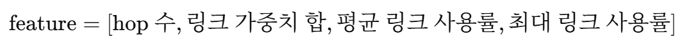
    
    - **hop 수**
        - 경로 상 링크(스위치 간 연결)의 개수
    - **링크 가중치 합**
        - 지연, 대역폭 역수 등으로 정의된 링크 weight의 합
    - **평균 링크 사용률**
        - 경로를 구성하는 링크들의 사용률 평균
    - **최대 링크 사용률**
        - 경로 상 링크들 중 가장 혼잡한 링크의 사용률
- 로그의 `features=[1.0, 1.0, 0.0, 0.0]`, `features=[2.0, 2.0, 0.0, 0.0]` 형태로 출력되는 부분

---

## 4. RandomForest 회귀 모델(`model.pkl`)을 이용한 경로 선택

- 각 경로의 feature 벡터를 **사전 학습된 RandomForest Regressor**에 입력
    - 해당 경로의 예상 비용(cost)을 예측
- 예측된 cost 값 중 **가장 작은 경로를 최종 선택**
    - 로그의 `[ML] path=[...] cost=...`
- 선택된 경로에 대해, 경로 상의 각 스위치에 대해
    - `(src MAC, dst MAC)` 조합에 대한 OpenFlow 룰을 설치
    - 이후 동일한 트래픽은 컨트롤러를 거치지 않고 **스위치 레벨에서 직접 포워딩**되도록 처리.
    - 로그의 `[ROUTE] src → dst path: [...]` 가 실제 설치된 경로.

---

## 플로우 테이블(Flow Table)

- 스위치 내부 **정책 룰 집합(rule table)**
    - 패킷 입력시 수행하는 행동 규칙 (Flow Entry)
        - 4개 요소로 구성

```
(1) Match     (무슨 패킷에 적용?)
(2) Priority  (우선순위)
(3) Actions   (무엇을 할까?)
(4) Counters  (지금까지 몇 개의 패킷이 matched?)

```

---

### Flow Entry 구조

- **Match Fields (매치 조건)**
    - 패킷의 어떤 필드를 검사할지 결정
    - `eth_src`, `eth_dst`, `ip_src`, `ip_dst`, `tcp_dst`, `vlan`, `in_port`
- **Priority (우선순위)**
    - 높은 priority 룰이 먼저 적용
    - OpenFlow는 룰들이 비교되어 가장 높은 priority 룰이 적용됨
        - LLDP 룰
            - **Priority  :** 65535 (가장 높음)
        - ML 라우팅 룰
            - **Priority  :** 10
        - table-miss
            - **Priority  :** 0 (가장 낮음)
- **Actions (동작)**
    - 패킷의 출력 포트 결정
        - `output:3`
            - 3번 포트로 패킷 전송
        - `CONTROLLER`
            - 컨트롤러로 Packet-In
        - `drop`
            - 버림
- **Counters**
    - Flow Entry가 처리한 패킷 수
    - `n_packets`, `n_bytes`

---

## **Flow Table(Flow Entry) 구조**

- **h1(src MAC) : port1 → h2(dst MAC) : port2  forward**

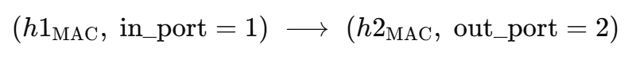

- **Flow Table**
    - 스위치가 도착한 패킷을 처리하는 규칙 저장
    - **MAC 매칭**
        - 스위치가 패킷을 받고 **패킷의 헤더(MAC, IP, TCP )에서 src MAC을 발췌하여, 기존 Flow Table의 h1 src MAC과 동일한지 체크**
            - **h1(src MAC)**
                - **도착한 패킷에서 src MAC을 발췌하여 기존 Flow Table의 h1 MAC과 동일 체크**
            - **h2(dst MAC)**
                - **도착한 패킷에서 dst MAC을 발췌하여 기존 Flow Table의 h2 MAC과 동일 체크**
    - **동작 Actions : forward**

---

### 패킷 매칭 + 동작 (forward)의 집합

- Flow Table

```
(1) MATCH 조건  : 어떤 패킷에 적용?
(2) ACTIONS     : 매칭되면 무엇을 할까?
(3) PRIORITY    : 어떤 룰이 먼저 적용될까?
(4) COUNTERS    : 몇 개의 패킷이 처리됐는가?

```

### Flow Table **MATCH 조건**

- 실제 스위치 내부에서는  TCAM (하드웨어)으로 비교
    - 논리적으로는 **if 조건문과 동일한 개념**
        - **Ternary Content-Addressable Memory (삼진 콘텐츠 주소 지정 메모리)**
        - **0, 1, *(don't care) 3가지 값을 저장/비교할 수 있는 특수 고속 메모리**

---

### 1. MAC 매칭 if 구문 : 기본

- **수신 패킷의 src MAC이 h1이고, dst MAC이 h2이면 2번 포트로 포워딩**

```
if packet.src_mac == h1_mac and packet.dst_mac == h2_mac:
    forward(out_port=2)

```

---

### 2. Flow Entry 전체 if 문으로 표현

- Flow Entry
    - **수신 패킷의 src MAC이 h1이고, dst MAC이 h2이면 2번 포트로 포워딩**

```
match:
    dl_src = h1
    dl_dst = h2
action:
    output:2

```

- if 문

```python
if packet.src_mac == h1_mac and packet.dst_mac == h2_mac:
    output_port = 2

```

---

### 3. in_port 포함 Flow 매칭 if

- Flow Table은 실제로 다음 3가지 모두 사용할 수 있음
    - src MAC (dl_src)
    - dst MAC (dl_dst)
    - 들어온 포트(in_port)
    - **수신 패킷의 src MAC이 h1이고, dst MAC이 h2이면 2번 포트로 포워딩**

```python
if packet.in_port == 1 and \
   packet.src_mac == h1_mac and \
   packet.dst_mac == h2_mac:
       output_port = 2

```

---

### 4. FlowMod 구조를 if 로 바꾼 버전

- Flow Entry
    - **수신 패킷의 src MAC이 h1이고, dst MAC이 h2이면 2번 포트로 포워딩**

```
priority=10
match:
    in_port=1
    dl_src=00:..:01
    dl_dst=00:..:02
actions=output:2

```

- if 문으로

```python
# Flow Table 룰 1
if packet.in_port == 1 and \
   packet.src_mac == "00:00:00:00:00:01" and \
   packet.dst_mac == "00:00:00:00:00:02":
       forward(out_port=2)

```

---

### 5. OpenFlow Table 전체 if-elif 표현

- LLDP 룰
- ML Flow 룰
- table-miss 룰

```python
# 1. LLDP
if packet.eth_type == 0x88cc:
    send_to_controller()

# 2. ML 라우팅 룰
elif packet.src_mac == h1 and packet.dst_mac == h2:
    forward(port=2)

# 3. table-miss
else:
    send_to_controller()

```

---

### 2. h1 → h2 forwarding 구조 = Flow Entry 1개

```
priority=10,
dl_src=00:00:00:00:00:01,
dl_dst=00:00:00:00:00:02,
actions=output:"s1-eth3"

```

| 항목 | 의미 |
| --- | --- |
| dl_src | h1의 MAC |
| dl_dst | h2의 MAC |
| actions=output | 다음 hop 포트로 전달 |
| priority | ML 라우팅 규칙 (10) |

---

### 3. Flow Table = MAC 기반 라우팅 룰들의 모음

- 스위치 s2 안에 여러 Flow rule이 있을 수 있음
    - MAC 기반 라우팅 규칙들의 집합 : **Flow Table(table 0)**
    - Flow Table
        - MAC 기반 포워딩 테이블 + 우선순위 + 동작 정의

```
dl_src=h1, dl_dst=h2 → output:3
dl_src=h3, dl_dst=h4 → output:1
dl_src=h2, dl_dst=h1 → output:2
dl_src=h4, dl_dst=h3 → output:1

```

### 4. 스위치 : Flow Table을 보고 패킷 Forward 수행

- 패킷이 들어오면 **스위치는 Flow Table을 기반으로 포워딩 동작 수행**

```
(1) dl_src=01, dl_dst=02
     ↓
(2) Flow Table에서 동일 match rule 검색
     ↓
(3) 해당 rule의 output 포트 실행
     ↓
(4) 패킷 forward

```

---

### 예시 : 스위치 Flow Table

- **h1→h3 패킷이 s1에 오면 s1-eth3으로 내보내라**

```
cookie=0x0, duration=23.209s, table=0,
n_packets=2, n_bytes=196,
idle_timeout=30, priority=10,
dl_src=00:00:00:00:00:01,
dl_dst=00:00:00:00:00:03
actions=output:"s1-eth3"

```

| 항목 | 설명 |
| --- | --- |
| `cookie=0x0` | 식별용 값(옵션) |
| `duration=23.209s` | 룰이 설치된 후 경과 시간 |
| `table=0` | OpenFlow 테이블 번호 (기본은 table 0) |
| `n_packets=2` | 이 룰을 통해 처리된 패킷 수 |
| `n_bytes=196` | 처리된 총 바이트 수 |
| `idle_timeout=30` | 30초 동안 트래픽 없으면 자동 삭제 |
| `priority=10` | 우선순위 (ML 룰은 10) |
| `dl_src=00:..:01` | 매치 조건: 소스 MAC |
| `dl_dst=00:..:03` | 매치 조건: 목적지 MAC |
| `actions=output:"s1-eth3"` | s1의 3번 포트로 패킷 전달 |

---

### 패킷 처리 순서 : 스위치 Flow Table

- `priority=65535`
    - LLDP는 항상 최우선 처리
- `priority=10`
    - ML 라우팅 룰: 유니캐스트 라우팅 처리
- `priority=0`
    - table-miss: 처음 보는 패킷만 컨트롤러로 전송

```
패킷 들어옴
   ↓
Flow Table 0 룰들 중에서
   priority 높은 것부터 매칭 확인
   ↓
매칭되는 룰 있다 → 그 actions 실행
매칭되는 룰 없다 → table-miss 실행

```

---

# Flow Table 생성 : Ping 보낸 후 ML 라우팅에서

### Ping 처음 보냄 → Flow 없음 → table-miss → Packet-In

- 컨트롤러에서 ML 기반 경로 선택 후 다음 Flow 설치
- 왕복 각각에 대해 **양방향 flow 설치**

### h1 → h3 라우팅 후

- **Flow Table** 생성 : **s1**

```
priority 10, match (h1 → h3)
actions=output s1-eth3

```

- **Flow Table** 생성 : **s2**

```
priority 10, match (h1 → h3)
actions=output s2-eth1

```

### h3 → h1 라우팅 후

- Flow Table 생성 : s2

```
priority 10, match (h3 → h1)
actions=output s2-eth3

```

- Flow Table 생성 : s1

```
priority 10, match (h3→h1)
actions=output s1-eth1

```

---

### Flow Table

- SDN 컨트롤 평면 개념을 만드는 핵심
    - **Flow Table을 컨트롤러가 원하는 대로 마음대로 재구성하는 것**

| 전통 네트워크 | SDN |
| --- | --- |
| L2/L3 스위치는 자체 라우팅, ARP 처리 | 모든 정책은 컨트롤러에서 결정 |
| 정적 MAC 테이블 | OpenFlow Flow Table |
| 경로 변경 어려움 | FlowMod로 실시간 변경 가능 |

---

## Flow Table 수 (한 개 스위치)

### **최대 255개의 Flow Table (0~254)**

- OpenFlow 스펙 기준
    - 실제 지원 개수는 스위치 구현(OVS 등)에 따라 다름
- 스위치는 **Flow** Table 0 하나를 사용
    - Ryu도 Table 0에만 FlowMod를 넣도록 설계됨
    - ML 라우팅 코드에서도 항상 **스위치 하나가 Flow Table 1개만 갖는다**

```python
table_id = 0

```

---

## **Flow Pipeline :** OpenFlow 스위치 내부에서 **여러 Flow Table이 순차적 연결 구조**

### 스위치 내부의 테이블 연결 구조 = **Flow Pipeline**

- OpenFlow 스위치는 **1개 이상의 Flow Table**을 가지고 있으며, 이들이 **table 0 → table 1 → table 2 → ...** 형태로 순차적으로 연결

---

- 패킷이 들어오면, **Flow Pipeline으로** 패킷 처리

```
Table 0 → (매칭) → next_table
        → (매칭) → next_table
                ...
        → (마지막 테이블)

```

---

- 각 테이블은 next_table 지정

| Table 번호 | 역할 |
| --- | --- |
| Table 0 | 기본 처리, L2/L3 매칭, 우선 rule |
| Table 1~N | 세부 정책, ACL, QoS, 라우팅 상세, forwarding |
- **파이프라인 연결**

```
goto_table: 1

```

---

- 3개의 테이블
    - 이 구조 전체가 **Flow Pipeline**

```python
Table 0:
    if match A: goto table 1
    elif match B: goto table 2
    else: miss → CONTROLLER

Table 1:
    if match C: apply action
    else: next table 2

Table 2:
    if match D: output port

```

---

### 파이프라인

- **정책(ACL) + 라우팅 + QoS 분리** 위해
- **대규모 네트워크에서 룰 관리가 용이**
- **멀티테이블 구조를 통해 성능 향상**
- **TCAM 사용 효율 증가**
    - Table 0
        - ARP 처리
    - Table 1
        - MAC 기반 라우팅
    - Table 2
        - IP 기반 라우팅
    - Table 3
        - QoS 스케줄링
    - 여러 역할 분산 효과

---

### **단일 Table (table 0) 사용 :** 단일 table pipeline

- Mininet + OVS의 기본 구조

```
table=0

```

## `self.datapaths` : Ryu 컨트롤러

### **현재 네트워크에 연결된 모든 스위치 목록**

- Ryu 입장에서 네트워크에 설치된 스위치 개수는 가변

```
스위치의 수 = self.datapaths의 원소 수

```

- **목록**

```
[SWITCH] connected: 1
[SWITCH] connected: 2
[SWITCH] connected: 3

```

### **switch 개수**

- **datapath 개수**
    - 각 datapath는 하나의 OpenFlow 스위치와 매핑됨
- datapath는 Flow Table 수는 이론적으로 255개이지만,
    - Ryu는 보통 Table 0만 사용

```python
self.datapaths = {
    1: <Datapath object>,
    2: <Datapath object>,
    3: <Datapath object>
}

```

| 항목 | 의미 | 개수 |
| --- | --- | --- |
| **Flow Table** | 스위치 내부의 패킷 처리 테이블 | OVS 기본 1개 (table 0) / OF 1.3 최대 255개 |
| **self.datapaths** | 컨트롤러에 연결된 스위치 목록 | 스위치 수 = datapaths 수 |

---

## ML Routing 컨트롤러 프로젝트 폴더 구조

### `train_model.py`

- ML 모델(`model.pkl`) 생성

### `ml_routing_controller_clean.py`

- Ryu 컨트롤러 (ML 경로 선택)

### `exp_ml_routing.py`

- Mininet 실험 스크립트

```bash
~/sdn_lab/sdn_ai/ml_routing/
 ├─ train_model.py
 ├─ ml_routing_controller_clean.py
 └─ exp_ml_routing.py

```

- 필요 패키지

```bash
pip3 install ryu networkx joblib scikit-learn

```

---

### `train_model.py` – 모델 학습

```python
# train_model.py
# -*- coding: utf-8 -*-

"""
Ryu 컨트롤러에서 사용할 ML 경로 선택 모델 학습 예제

feature: [hop_count, total_weight, avg_util, max_util]
target:  cost (작을수록 좋은 경로)
"""

import numpy as np
import joblib
from sklearn.ensemble import RandomForestRegressor

# 학습 데이터
# [hop, weight, avg_util, max_util]
X = np.array([
    [1, 1, 0.0, 0.0],   # 1홉, 깨끗한 경로
    [2, 2, 0.0, 0.0],   # 2홉
    [3, 3, 0.0, 0.0],   # 3홉
    [2, 2, 0.5, 0.8],   # 2홉 + 혼잡 (0.5)
    [3, 3, 0.7, 0.9],   # 3홉 + 혼잡 (0.9)
])

# 각 경로의 cost (값이 낮을수록 좋은 경로)
y = np.array([
    10,    # 1홉
    20,    # 2홉
    30,    # 3홉
    80,    # 2홉 + 혼잡
    120,   # 3홉 + 혼잡
])

model = RandomForestRegressor(
    n_estimators=50,
    random_state=0
)
model.fit(X, y)

joblib.dump(model, "model.pkl")
print(">> model.pkl 저장 완료")

```

- 실행

```bash
python3 train_model.py

```

---

### `ml_routing_controller_clean.py` – Ryu 컨트롤러

```python
# ml_routing_controller_clean.py
# -*- coding: utf-8 -*-

from ryu.base import app_manager
from ryu.controller import ofp_event
from ryu.controller.handler import CONFIG_DISPATCHER, MAIN_DISPATCHER
from ryu.controller.handler import set_ev_cls
from ryu.ofproto import ofproto_v1_3

from ryu.lib.packet import packet, ethernet
from ryu.lib.packet import ether_types

from ryu.topology import api as topo_api
from ryu.topology import event as topo_event

import networkx as nx
import warnings
import logging

# scikit-learn 관련 경고 숨기기
try:
    import joblib
    from sklearn.exceptions import InconsistentVersionWarning
    warnings.filterwarnings("ignore", category=InconsistentVersionWarning)
except Exception:
    joblib = None

class MLRoutingController(app_manager.RyuApp):
    OFP_VERSIONS = [ofproto_v1_3.OFP_VERSION]

    def __init__(self, *args, **kwargs):
        super(MLRoutingController, self).__init__(*args, **kwargs)
        self.logger.setLevel(logging.INFO)

        self.net = nx.DiGraph()    # 토폴로지 그래프
        self.host_table = {}       # mac -> (dpid, port)
        self.link_metrics = {}     # (u, v) -> {"utilization": 0.0}
        self.datapaths = {}        # dpid -> datapath

        self.model = self._load_model("model.pkl")

    # ------------------------------------------------------------------
    # 스위치 연결 시: table-miss 설치
    # ------------------------------------------------------------------
    @set_ev_cls(ofp_event.EventOFPSwitchFeatures, CONFIG_DISPATCHER)
    def switch_features_handler(self, ev):
        dp = ev.msg.datapath
        ofp = dp.ofproto
        parser = dp.ofproto_parser

        self.datapaths[dp.id] = dp
        self.logger.info("[SWITCH] connected: %s", dp.id)

        # table-miss: 매칭 안 되면 컨트롤러로
        match = parser.OFPMatch()
        actions = [parser.OFPActionOutput(ofp.OFPP_CONTROLLER,
                                          ofp.OFPCML_NO_BUFFER)]
        inst = [parser.OFPInstructionActions(ofp.OFPIT_APPLY_ACTIONS, actions)]

        dp.send_msg(parser.OFPFlowMod(
            datapath=dp, priority=0, match=match, instructions=inst
        ))

    # ------------------------------------------------------------------
    # 토폴로지 이벤트
    # ------------------------------------------------------------------
    @set_ev_cls(topo_event.EventSwitchEnter)
    def switch_enter_handler(self, ev):
        self._rebuild_topology()

    @set_ev_cls(topo_event.EventSwitchLeave)
    def switch_leave_handler(self, ev):
        self._rebuild_topology()

    @set_ev_cls(topo_event.EventLinkAdd)
    def link_add_handler(self, ev):
        self._rebuild_topology()

    @set_ev_cls(topo_event.EventLinkDelete)
    def link_delete_handler(self, ev):
        self._rebuild_topology()

    def _rebuild_topology(self):
        self.net.clear()
        self.link_metrics.clear()

        switches = topo_api.get_all_switch(self)
        for sw in switches:
            self.net.add_node(sw.dp.id)

        links = topo_api.get_all_link(self)
        for link in links:
            src = link.src
            dst = link.dst

            self.net.add_edge(src.dpid, dst.dpid,
                              port=src.port_no,
                              weight=1.0)
            self.link_metrics[(src.dpid, dst.dpid)] = {
                "utilization": 0.0
            }

        self.logger.info("[TOPO] nodes=%s, edges=%s",
                         list(self.net.nodes), list(self.net.edges))

    # ------------------------------------------------------------------
    # Packet-In 처리
    # ------------------------------------------------------------------
    @set_ev_cls(ofp_event.EventOFPPacketIn, MAIN_DISPATCHER)
    def packet_in_handler(self, ev):
        msg = ev.msg
        dp = msg.datapath
        dpid = dp.id
        parser = dp.ofproto_parser
        ofp = dp.ofproto
        in_port = msg.match["in_port"]

        pkt = packet.Packet(msg.data)
        eth = pkt.get_protocol(ethernet.ethernet)

        # LLDP는 토폴로지 탐색용 → 무시
        if eth.ethertype == ether_types.ETH_TYPE_LLDP:
            return

        src = eth.src
        dst = eth.dst

        # ----------------------------------------------------------
        # IPv6 멀티캐스트 / 브로드캐스트: 조용히 FLOOD (로그 없음)
        # ----------------------------------------------------------
        if dst.startswith("33:33") or dst == "ff:ff:ff:ff:ff:ff":
            out = parser.OFPPacketOut(
                datapath=dp,
                buffer_id=msg.buffer_id,
                in_port=in_port,
                actions=[parser.OFPActionOutput(ofp.OFPP_FLOOD)],
                data=msg.data
            )
            dp.send_msg(out)
            return
        # ----------------------------------------------------------

        # 호스트 위치 학습
        if src not in self.host_table:
            self.host_table[src] = (dpid, in_port)
            self.logger.info("[HOST] learn %s -> (%s, %s)", src, dpid, in_port)

        # 목적지 호스트 위치 확인
        if dst in self.host_table:
            dst_dpid, dst_port = self.host_table[dst]
        else:
            # 모르는 목적지는 FLOOD
            out = parser.OFPPacketOut(
                datapath=dp,
                buffer_id=msg.buffer_id,
                in_port=in_port,
                actions=[parser.OFPActionOutput(ofp.OFPP_FLOOD)],
                data=msg.data
            )
            dp.send_msg(out)
            return

        # 같은 스위치면 바로 내보내기
        if dpid == dst_dpid:
            out = parser.OFPPacketOut(
                datapath=dp,
                buffer_id=msg.buffer_id,
                in_port=in_port,
                actions=[parser.OFPActionOutput(dst_port)],
                data=msg.data
            )
            dp.send_msg(out)
            return

        # 서로 다른 스위치 → ML 경로 선택
        best_path = self._select_best_path(dpid, dst_dpid)
        self.logger.info("[ROUTE] %s → %s path: %s", src, dst, best_path)

        self._install_path(best_path, src, dst, dst_port, msg)
```

```python

    # ------------------------------------------------------------------
    # ML 경로 선택
    # ------------------------------------------------------------------
    def _select_best_path(self, src_dpid, dst_dpid):
        if src_dpid not in self.net or dst_dpid not in self.net:
            raise Exception("unknown dpid in topology")

        # 모델 없으면 단순 최단 경로
        if self.model is None:
            self.logger.info("[ML] no model → shortest path")
            return nx.shortest_path(self.net, src_dpid, dst_dpid, weight="weight")

        paths = list(nx.all_simple_paths(self.net, src_dpid, dst_dpid, cutoff=6))
        if not paths:
            raise Exception("no path between %s and %s" % (src_dpid, dst_dpid))

        best_path = None
        best_cost = None

        for p in paths:
            features = self._build_features(p)
            try:
                cost = self.model.predict([features])[0]
            except Exception as e:
                self.logger.error("[ML] predict error: %s", e)
                return nx.shortest_path(self.net, src_dpid, dst_dpid, weight="weight")

            self.logger.info("[ML] path=%s cost=%.3f features=%s",
                             p, cost, features)

            if best_cost is None or cost < best_cost:
                best_cost = cost
                best_path = p

        return best_path

    def _build_features(self, path):
        """
        feature: [hop_count, total_weight, avg_util, max_util]
        실험 1에서는 utilization=0 으로만 사용
        """
        hop = len(path) - 1
        total_weight = 0.0
        utils = []

        for i in range(len(path) - 1):
            u = path[i]
            v = path[i + 1]
            edge = self.net.get_edge_data(u, v, {})
            total_weight += edge.get("weight", 1.0)

            util = self.link_metrics.get((u, v), {}).get("utilization", 0.0)
            utils.append(util)

        avg_util = sum(utils) / len(utils) if utils else 0.0
        max_util = max(utils) if utils else 0.0

        return [float(hop), float(total_weight), float(avg_util), float(max_util)]

    # ------------------------------------------------------------------
    # 선택된 경로에 따라 Flow 설치
    # ------------------------------------------------------------------
    def _install_path(self, path, src, dst, dst_port_last, msg):
        buffer_id = msg.buffer_id
        data = msg.data if buffer_id == msg.datapath.ofproto.OFP_NO_BUFFER else None
        in_port_first = msg.match["in_port"]

        for i, dpid in enumerate(path):
            dp = self.datapaths[dpid]
            parser = dp.ofproto_parser
            ofp = dp.ofproto

            if i == len(path) - 1:
                out_port = dst_port_last
            else:
                next_dpid = path[i + 1]
                out_port = self.net[dpid][next_dpid]["port"]

            match = parser.OFPMatch(eth_src=src, eth_dst=dst)
            actions = [parser.OFPActionOutput(out_port)]

            dp.send_msg(parser.OFPFlowMod(
                datapath=dp,
                priority=10,
                match=match,
                idle_timeout=30,
                instructions=[
                    parser.OFPInstructionActions(ofp.OFPIT_APPLY_ACTIONS, actions)
                ]
            ))

            # 첫 스위치에는 PacketOut
            if i == 0:
                dp.send_msg(parser.OFPPacketOut(
                    datapath=dp,
                    buffer_id=buffer_id,
                    in_port=in_port_first,
                    actions=actions,
                    data=data
                ))

    # ------------------------------------------------------------------
    # 모델 로딩
    # ------------------------------------------------------------------
    def _load_model(self, path):
        if joblib is None:
            self.logger.warning("[ML] joblib not installed → ML disabled")
            return None
        try:
            model = joblib.load(path)
            self.logger.info("[ML] loaded model: %s", path)
            return model
        except Exception as e:
            self.logger.warning("[ML] cannot load model %s: %s", path, e)
            return None

```

---

## `ml_routing_controller_clean.py` – Ryu 컨트롤러

- 토폴로지
    - 호스트 위치 학습
- 경로 후보에 대해 feature를 만들고
    - ML 모델(model.pkl)로 cost 예측해서 가장 좋은 경로에 Flow 설치

---

## 1. 전역/초기화 부분

```python
class MLRoutingController(app_manager.RyuApp):
    OFP_VERSIONS = [ofproto_v1_3.OFP_VERSION]

    def __init__(...):
        self.net = nx.DiGraph()
        self.host_table = {}
        self.link_metrics = {}
        self.datapaths = {}
        self.model = self._load_model("model.pkl")

```

- `self.net`
    - **스위치 간 링크 구조** 저장
        - NetworkX DiGraph 이용
        - `nodes=[1,2,3], edges=[(1,2),(2,3), ...]`
- `self.host_table`
    - `MAC → (dpid, port)`
        - `00:..:01 -> (1,1)`
        - h1은 s1의 1번 포트에 붙어 있다

### **`00:..:01 -> (1,1)` 의미**

- **`00:..:01`**은 h1
- **`(1,1)`**에서 앞에 **`1`**은 s1, 뒤에 **`1`**은 1번 포트
    - MAC 주소 00:..:01 을 가진 호스트(h1)는 스위치 s1의 1번 포트에 붙어 있다

| 항목 | 의미 |
| --- | --- |
| **00:..:01** | 호스트 **h1의 MAC 주소** |
| **(1,1)** | 첫 번째 숫자 **1 = 스위치 s1의 DPID**, 두 번째 숫자 **1 = s1의 1번 포트 번호** |

---

```
h1 (MAC = 00:..:01)
          ↓
       s1의 1번 포트 (s1-eth1)

```

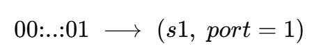

---

```python
self.hosts[src_mac] = (dpid, in_port)

```

- **호스트 위치 학습(host learning)**
- **경로 계산 시 출발/도착 스위치 찾기**
- **FlowMod 설치 시 in_port/out_port 결정**

---

### Ryu 로그

```
[HOST] learn 00:00:00:00:00:01 -> (dpid=1, port=1)

```


---

- `self.link_metrics`
    - `(u, v) → { "utilization": 0.0 }`
        - 현재 실험에선 0만 사용하지만, 나중에 링크 사용률 넣으려고 만든 자리
- `self.datapaths`
    - `dpid → datapath`
        - FlowMod/PacketOut 보낼 때 사용
- `self.model`
    - `model.pkl`을 joblib으로 로딩한 ML 회귀 모델
        - `features=[hop, weight, avg_util, max_util]`
            - `cost` 예측에 사용

---

## 2. 스위치 처음 연결될 때: table-miss 룰 설치

```python
@set_ev_cls(EventOFPSwitchFeatures, CONFIG_DISPATCHER)
def switch_features_handler(self, ev):
    dp = ev.msg.datapath
    ...
    self.datapaths[dp.id] = dp

    match = parser.OFPMatch()
    actions = [parser.OFPActionOutput(ofp.OFPP_CONTROLLER, ofp.OFPCML_NO_BUFFER)]
    ...
    dp.send_msg(FlowMod(..., priority=0, match=match, actions=actions))

```

- 스위치가 컨트롤러에 붙으면
    - `dpid`를 `self.datapaths`에 등록
    - **table-miss 룰** 설치
        - 어떤 Flow에도 안 맞는 패킷 → 전부 컨트롤러로 Packet-In
- ping 보낼 때
    - Flow 없음 → 이 table-miss에서 처리함 → Ryu로 Packet-In
    - **ML 라우팅 + Flow 설치**가 시작됨

---

## 3. 토폴로지 이벤트 처리: `_rebuild_topology()`

- LLDP로 수집한 **스위치/링크 정보를 그래프로 변환 : NetworkX**
    - `-observe-links` 옵션으로 계속 topology 갱신됨

```python
@set_ev_cls(EventSwitchEnter)
@set_ev_cls(EventSwitchLeave)
@set_ev_cls(EventLinkAdd)
@set_ev_cls(EventLinkDelete)
def ...:
    self._rebuild_topology()

```

```python
def _rebuild_topology(self):
    self.net.clear()
    self.link_metrics.clear()

    switches = topo_api.get_all_switch(self)
    links = topo_api.get_all_link(self)

    for sw in switches:
        self.net.add_node(sw.dp.id)

    for link in links:
        src = link.src; dst = link.dst
        self.net.add_edge(src.dpid, dst.dpid, port=src.port_no, weight=1.0)
        self.link_metrics[(src.dpid, dst.dpid)] = { "utilization": 0.0 }

```

- 출력 로그
    - `nx.all_simple_paths(self.net, src_dpid, dst_dpid)` 로 후보 경로 찾음
    
    ```
    [TOPO] nodes=[1,3,2], edges=[(1,2),(2,1),(2,3),(3,2)]
    
    ```
    

---

## 4. **토폴로지 정보**

- **Ryu가 수집한 토폴로지 정보를 기반으로 NetworkX DiGraph 재구성**
    - **기존 토폴로지 초기화**
    - **스위치(노드) 등록**
    - **링크(edge) 등록 + 포트 정보 + 링크 메트릭 초기화**

```python
def _rebuild_topology(self):
    self.net.clear()
    self.link_metrics.clear()

    switches = topo_api.get_all_switch(self)
    links = topo_api.get_all_link(self)

    for sw in switches:
        self.net.add_node(sw.dp.id)

    for link in links:
        src = link.src; dst = link.dst
        self.net.add_edge(src.dpid, dst.dpid, port=src.port_no, weight=1.0)
        self.link_metrics[(src.dpid, dst.dpid)] = { "utilization": 0.0 }

```

---

- 최종 NetworkX DiGraph self.net 구조

```
노드 : 스위치 dpid
엣지 : (src_dpid → dst_dpid)
속성 : {port, weight}

```

---

### 기존 토폴로지 초기화

### self.net : NetworkX DiGraph

- 현재까지 수집된 모든 스위치 + 링크(edge)가 담겨 있음
    - 새로운 링크 이벤트가 발생할 때마다 전체 구조 새로 생성
- 따라서, 이전 정보와 충돌하지 않도록 clear()

```python
self.net.clear() 
self.link_metrics.clear() # 이전 정보와 충돌하지 않도록

```

### self.link_metrics

- 링크 사용률(utilization) 저장하는 dict
    - 링크 변경/삭제를 감안해서 매번 초기화

```python
self.link_metrics[(1,2)] = {"utilization":0.05}

```

---

### 스위치 리스트 얻기

- Ryu의 topology API 호출

```python
switches = topo_api.get_all_switch(self)

```

### 현재 네트워크에 연결된 **모든 스위치 객체 목록** 반환

```
switches = [Switch(dpid=1), Switch(dpid=2), Switch(dpid=3)]

```

- Switch 객체 구조

```python
sw.dp.id   → 스위치 dpid
sw.dp      → Datapath 객체
sw.ports   → 스위치 포트 목록

```

---

### 스위치 하나당 그래프 노드 하나 생성 : 스위치를 그래프 노드로 추가

```python
for sw in switches:
    self.net.add_node(sw.dp.id)

```

- 결과

```
s1, s2, s3

```

### DiGraph

- DiGraph의 노드는 **스위치 ID(dpid)만 사용**

### 호스트는 graph에 포함시키지 않음

- host 정보는 hub 방식 대신 별도의 MAC → DP 위치 테이블에서 관리

```python
self.net.add_node(1)
self.net.add_node(2)
self.net.add_node(3)

```

---

### 링크 리스트 얻기

```python
links = topo_api.get_all_link(self)

```

### link는 다음 정보를 가지고 있음

```
Link:
    src: {dpid, port_no}
    dst: {dpid, port_no}

```

### link 예 : s1-eth1 <-> s2-eth3

- s1, s2의 1,2가 dpid
- eth1, eth3의 1과 3이 port_no

```
s1-eth1 <-> s2-eth3  # s1, s2의 1,2가 dpid, eth1, eth3의 1과 3이 port_no 

```

---

## **DPID(dpid)와 Port 번호(port_no)의 차이**

### 1. **dpid = 스위치 ID**

- **스위치 자체를 식별하는 번호**
    - `s1 → dpid = 1`
    - `s2 → dpid = 2`
    - `s3 → dpid = 3`

---

### 2. **port_no = 스위치의 각 인터페이스 번호**

- 스위치 각각은 여러 개의 포트를 가짐
    - `s1-eth1 → port 1` : **eth1의 1이 port_no**
    - `s1-eth3 → port 3` : **eth3의 3이 port_no**

### s1, s2의 1, 2 : dpid **스위치 번호**

```
s1 → dpid=1
s2 → dpid=2

```

### eth1, eth3의 1과 3 : port_no

```
s1-eth1 → port_no=1
s1-eth3 → port_no=3

```

---

### Ryu 링크 정보

### **양방향 링크 : 두 개의 Link 객체**

### src=(1, port1)

- **앞의 1은 h1이 아니라 스위치 s1의 DPID**
    - h1은 **스위치 s1의** port1에 연결되었다

| 항목 | 의미 |
| --- | --- |
| **src (1, port1)** | 스위치 **s1 (dpid=1)** 의 **1번 포트** |
| **dst (2, port3)** | 스위치 **s2 (dpid=2)** 의 **3번 포트** |

### **s1과 s2 사이의 링크 정보**

```
s1 (port 1) ←—— 링크 ——→ s2 (port 3)

```

### dst=(2, port3)

- **앞의 2는 h2가 아니라 스위치 s2의 DPID**
    - h2는 **스위치 s2의** port3에 연결되었다

```
Link1: src=(1,port1), dst=(2,port3) # 1: **스위치 s1의 DPID, 2: 스위치 s2의 DPID**
Link2: src=(2,port3), dst=(1,port1) # 1: **스위치 s1의 DPID, 2: 스위치 s2의 DPID**

```

---

## Ryu Topology Discovery 저장 내용

### 1. 스위치 ↔ 스위치

### 2. 스위치 ↔ 스위치의 포트 번호

### 3. 호스트는 topology link로 저장되지 않음

- 호스트는 **Packet-In을 통해 MAC 기반으로 따로 저장**
- 이 정보는 host table

```
00:..:01 → (1,1)   # h1은 s1의 1번 포트에 붙음
00:..:02 → (2,1)   # h2는 s2의 1번 포트에 붙음

```

### 반면 network link 정보는 host MAC 없이 **스위치 간의 포트 연결 정보**만 저장

```
link src=(1,1) dst=(2,3)
link src=(2,3) dst=(1,1)

```

---

### Link 정보 :  스위치 ↔ 스위치 연결

### (dpid, port_no) 구조

- 호스트 MAC이나 호스트 번호(h1,h2)가 아님

[src=(1,port1), dst=(2,port3)](https://www.notion.so/src-1-port1-dst-2-port3-2b8fc8f15f0380209915c4c284bcd998?pvs=21)

```
s1의 1번 포트 —— 연결 —— s2의 3번 포트

```

---

### 링크 : Edge (DiGraph)로 추가

```python
for link in links:
    src = link.src
    dst = link.dst
    self.net.add_edge(src.dpid, dst.dpid,
                      port=src.port_no, weight=1.0)

```

### Edge 방향

### NetworkX DiGraph이므로 (1 → 2)와 (2 → 1)을 **별개 edge**로 저장

- 포트 번호가 방향마다 다름
    - s1→s2 포트 = 1 포트
    - s2→s1 포트 = 3 포트
- 링크 사용률(utilization)을 방향별로 저장
- ML routing이 경로를 탐색할 때 양방향 edge 필요

---

### Edge 속성

### `port`

- **FlowMod를 설치할 때 out_port로 사용**됨.

```python
port=src.port_no

```

- 예시

```
s1 -- s2
(s1 입장에서 next-hop s2로 가는 포트) = 1

```

- ML 모델이 선택한 path=[1, 2]라면

```python
out_port = self.net[1][2]["port"]

```

### `weight=1.0`

- 기본 링크 비용 (Oost)
    - shortest_path 계산에 사용 가능
    - ML feature에도 사용 가능

---

### 링크 메트릭 초기화

```python
self.link_metrics[(src.dpid, dst.dpid)] = { "utilization": 0.0 }

```

- 각 링크 (u→v) 방향에 대해 dict 생성
    - 링크 사용률 계산
    - port stats polling (OFPPortStatsRequest)
    - 링크 바이트 변화량 측정

| key | value |
| --- | --- |
| (src_dpid, dst_dpid) | {"utilization":0.0} |
- 예시

```python
self.link_metrics[(1,2)] = {"utilization":0.0}
self.link_metrics[(2,1)] = {"utilization":0.0}

```

- ML feature에서 다음 형태로 사용

```
avg_util = average( self.link_metrics[(u,v)]["utilization"] )
max_util = max( self.link_metrics[(u,v)]["utilization"] )

```

---

# 토폴로지 알고리즘

### ML 라우팅이 사용할 수 있도록 완성된 네트워크 그래프 생성

- path 탐색, 링크 메트릭, flow 설치가 모두 토폴로지 구조를 기반으로 움직임

```
1. 그래프 초기화(self.net.clear)
2. 모든 스위치를 노드로 추가
3. 모든 링크를 방향 edge로 추가
4. edge가 가진 port 번호 저장
5. edge별 링크 이용률(utilization) 초기화

```

## **토폴로지 그래프(**Topology Graph), **토폴로지 테이블(Topology Table)**

- Topological Database / Topology View / Topology Graph
- SDN 컨트롤러(Ryu, ONOS, OpenDaylight 등)는 형태는 달라도 **네트워크 전체의 스위치 연결 정보를 저장하는 구조**를 가지고 있음

---

### 스위치 테이블 (Datapath Table)

- Ryu에서 스위치 테이블
    - 현재 컨트롤러에 연결된 스위치 목록
    - 스위치 ID(DPID) 관리
    - 개수는 가변(dynamic)

```python
self.datapaths = {}    # dpid → datapath 객체

```

---

### 토폴로지 테이블 (Topology Table)

- Ryu에서는 토폴로지 테이블
    - `get_all_switch(self)`
        - 스위치 목록
    - `get_all_link(self)`
        - 링크 목록
- 이 정보를 **내부 그래프 구조**로 저장함
    - 예시

```python
self.net = nx.DiGraph()

```

- 여기에 아래 정보를 추가하여 **토폴로지 테이블 구성**
    - 노드
        - 스위치(dpid)
    - 엣지
        - 링크(src_dpid → dst_dpid, port_no 포함)
    - 가중치
        - weight1 또는 지연/대역폭 기반 가중치

---

### Ryu  Topology Graph

- Ryu는 토폴로지 정보를 그래프로 처리
- 예

```python
self.net.add_node(sw.dp.id) # 스위치 id (1)가 노드로 s1 변환 
self.net.add_edge(src.dpid, dst.dpid, port=src.port_no) # 소스 스위치 (1)과 목적지 스위치 (2)사이의 소스 포트 번호 

```

### 토폴로지 테이블 내용

### (1) 스위치 목록 테이블

```
switches = {1, 2, 3, ...}

```

### (2) 링크 목록 테이블 (s1-port1 → s2-port3)

```
links = [
  (1,1) → (2,3)
  (1,2) → (3,3)
  (2,3) → (1,1)
]

```

### `(1,1) → (2,3)`  : **(s1의 port1) → (s2의 port3)**

- 스위치 s1의 1번 포트가 스위치 s2의 3번 포트와 연결되어 있다
- `(dpid, port_no)` 형태로
    - **(1,1)** = 스위치 **s1**, 포트 **1**
    - **(2,3)** = 스위치 **s2**, 포트 **3**
- 예시

```
(1,1) → (2,3)

```

- 아래와 같은 의미

```
s1-eth1  →  s2-eth3

```

- 그림
    - 왼쪽
        - s1
        - 그 중 1번 포트
    - 오른쪽
        - s2
            - 그 중 3번 포트
    - 방향이 있으면
        - Directed Link
    - Ryu는 양 방향 링크를 둘 다 기록

```
     port1                 port3
   ┌────────┐           ┌────────┐
   │   s1   │──────────▶│   s2   │
   └────────┘           └────────┘

```

---

- Ryu의 링크 정보 제공

```
link.src.dpid      # 1
link.src.port_no   # 1

link.dst.dpid      # 2
link.dst.port_no   # 3

```

- 코드에서 그래프로 전환

```python
self.net.add_edge(src.dpid, dst.dpid, port=src.port_no)

```

- 다음처럼 저장됨

```
edge: 1 --(port 1)--> 2

```

## **그래프(model) 설계 방식 (Ryu)**

- **그래프에 dst.port_no(=3)를 넣지 않음**
- **링크 양방향을 따로 add_edge() 하는 구조**

### 코드

- 여기서는 **src → dst 방향의 링크만 기록**
    - 출발지 스위치 ID: `src.dpid`
    - 도착지 스위치 ID: `dst.dpid`
    - 출발 포트 번호: `src.port_no`

```
self.net.add_edge(src.dpid, dst.dpid, port=src.port_no)

```

- 예시

```
(s1, port2) → (s3, port3)

```

- 그래프 저장
    - 여기서 2는 **s1에서 나가는 포트 번호**
    - **그런데 dst.port_no(=3)는 넣지 않음**
        - Ryu는 링크를 양방향으로 따로 보고 두 개의 Directed Edge 로 처리하기 때문

```
add_edge(1, 3, port=2)

```

### 같은 링크에 대해 실제로는 **두 개의 add_edge**가 들어옴

### 1. src → dst 방향

```
src = (1,2)
dst = (3,3)
self.net.add_edge(1, 3, port=2)

```

### 2. dst → src 방향 (반대 방향 링크)

```
src = (3,3)
dst = (1,2)
self.net.add_edge(3, 1, port=3)

```

- 토폴로지 그래프는 다음 두 개를 가지게 됨
    - 그래서 **dst.port_no를 첫 번째 add_edge에서 넣지 않아도** 두 번째 add_edge에서 **그 값이 들어오게 되어 있음**

| 방향 | 저장되는 포트 |
| --- | --- |
| 1 → 3 | port=2 |
| 3 → 1 | port=3 |

---

### 결과적으로 그래프는 완전한 링크 정보를 가짐

- 최종적으로 self.net 안에는
    - 양방향이 모두 기록되므로 **dst.port_no를 첫 번째에서 넣을 필요가 없음**

```
edge: 1 → 3  (port 2)
edge: 3 → 1  (port 3)

```

---

### 방향성(DiGraph) 기반 그래프

- link는 **양방향 링크**이므로 그래프에는 **두 개의 Directed Edge**가 필요

### 출발 포트 번호만 저장

- 패킷이 나가는 포트는 항상 출발 스위치의 포트이기 때문
- 예
    - 경로 계산 후 s1 → s3로 가야 할 경우

```
out_port = self.net[s1][s3]['port']  # 여기서 port=2

```

### 반대 방향

- **각 방향 edge에 포트 번호가 따로 있음**
- 최종적으로 그래프에는 양방향 포트 정보가 모두 존재
    - 1 → 3 : port 2
    - 3 → 1 : port 3
        - 같은 링크에 대해 역방향 add_edge가 자동으로 들어와서
            - 그 때 port=3이 기록됨

```
out_port = self.net[s3][s1]['port']  # port=3

```

---

## 5. Packet-In 처리 : `packet_in_handler`

```python
@set_ev_cls(EventOFPPacketIn, MAIN_DISPATCHER)
def packet_in_handler(self, ev):
    msg = ev.msg
    dp = msg.datapath
    dpid = dp.id
    in_port = msg.match['in_port']

    pkt = packet.Packet(msg.data)
    eth = pkt.get_protocol(ethernet.ethernet)

```

### LLDP/IPv6 멀티캐스트/브로드캐스트 필터링

- LLDP
    - 토폴로지용, 무시
- `33:33:..`, `ff:ff:ff:ff:ff:ff`
    - IPv6 멀티캐스트/브로드캐스트

```python
if eth.ethertype == ETH_TYPE_LLDP:
    return

src = eth.src; dst = eth.dst

if dst.startswith("33:33") or dst == "ff:ff:ff:ff:ff:ff":
    # 로그 찍지 않고 조용히 FLOOD
    out = PacketOut(..., actions=[OUTPUT(FLOOD)])
    dp.send_msg(out)
    return

```

---

## 호스트 위치 학습 (MAC 테이블)

### host_table[src] = (dpid, in_port)

- 이  코드 한 줄이 호스트 위치 학습 (Host Location Learning)

### `[HOST] learn 00:..:01 -> (1,1)`

- MAC 주소 `00:..:01` (호스트 h1의 MAC 주소)은 dpid 1번 스위치의 1번 포트에 붙어 있음

```python
if src not in self.host_table:
    self.host_table[src] = (dpid, in_port) # 코드 한 줄이 호스트 위치 학습(Host Location Learning)
    self.logger.info("[HOST] learn %s -> (%s, %s)", src, dpid, in_port)

```

---

### 4-3. 목적지 호스트 위치 확인

- 아직 모르는 MAC이면
    - 브로드캐스트로 흘려보내고 대기
- 목적지 호스트 알고 있으면
    
    ### ML 라우팅 시작
    
    - **self.host_table[dst]**
        - 목적지 dst MAC이 host_table 안에 있을 때,
            - 즉 목적지를 알고 있으면
            - ML 라우팅 시작해서 Best Path를 찾음
        - dst_dpid, dst_port  발췌해서
            - ML 라우팅 시작으로 보내서 Best Path를 찾음

```python
if dst in self.host_table:
    dst_dpid, dst_port = self.host_table[dst] # 목적지 dst MAC이 host_table 안에 있을 때
    # 아래 [1]로 전송됨 
else:
    # 모르면 FLOOD
    PacketOut(FLOOD)
    return

```

---

### 4-4. 같은 스위치에 붙어 있으면 ML 안 쓰고 바로 전송

- h1, h2는 같은 s1에 붙어 있음

```python
if dpid == dst_dpid:
    PacketOut(OUTPUT(dst_port))
    return

```

---

### 4-5. 다른 스위치에 있으면 → ML 경로 선택

```python
best_path = self._select_best_path(dpid, dst_dpid) # [1] 목적지를 알고 있을때, 목적지로 가는 최적의 ML path 선택 
self.logger.info("[ROUTE] %s → %s path: %s", src, dst, best_path)

self._install_path(best_path, src, dst, dst_port, msg)

```

- 이 두 줄이 바로 이 부분에서 나온 것

```
[ML] path=[1, 2] cost=16.200 features=[1.0, 1.0, 0.0, 0.0]
[ROUTE] 00:00:00:00:00:01 → 00:00:00:00:00:03 path: [1, 2]

```

---

## 5. ML 경로 선택: `_select_best_path`

- 각 경로에 대해 `_build_features(path)`로 feature 벡터 생성
- `model.predict()`로 **cost 예측**
- cost가 가장 작은 경로를 `best_path`로 선택
    - feature `[1.0,1.0,0.0,0.0]` → cost 16.2
    - 여러 경로가 있으면 그중 cost 최소인 경로가 선택됨
    - 지금 토폴로지는 h1↔h3가 1홉이라 후보 경로가 `[1,2]` 하나뿐이라 그대로 선택

```python
def _select_best_path(self, src_dpid, dst_dpid):
    if self.model is None:
        return nx.shortest_path(...)

    paths = list(nx.all_simple_paths(self.net, src_dpid, dst_dpid, cutoff=6))
    best_path, best_cost = None, None

    for p in paths:
        features = self._build_features(p)
        cost = self.model.predict([features])[0]
        self.logger.info("[ML] path=%s cost=%.3f features=%s", p, cost, features)

        if best_cost is None or cost < best_cost:
            best_cost, best_path = cost, p

    return best_path

```

---

## 6. Feature 계산: `_build_features`

- `weight = 1`로 동일
- `utilization = 0.0`만 사용
    - 경로가 `[1,2]`면:
        - hop = 1
        - total_weight = 1
        - avg_util = 0
        - max_util = 0
        - `features=[1.0,1.0,0.0,0.0]`
- `[ML] ... features=[1.0, 1.0, 0.0, 0.0]` 로그와 일치

```python
def _build_features(self, path):
    hop = len(path) - 1
    total_weight = 0.0
    utils = []

    for (u,v) in path:
        edge = self.net.get_edge_data(u,v,{})
        total_weight += edge.get("weight",1.0)
        util = self.link_metrics.get((u,v),{}).get("utilization",0.0)
        utils.append(util)

    avg_util = sum(utils)/len(utils) if utils else 0.0
    max_util = max(utils) if utils else 0.0

    return [float(hop), float(total_weight), float(avg_util), float(max_util)]

```

---

## 7. Flow 설치: `_install_path`

```python
def _install_path(self, path, src, dst, dst_port_last, msg):
    buffer_id = msg.buffer_id
    data = ...           # 필요 시 PacketOut 데이터
    in_port_first = msg.match["in_port"]

    for i, dpid in enumerate(path):
        dp = self.datapaths[dpid]
        parser = dp.ofproto_parser
        ofp = dp.ofproto

        if i == len(path)-1:
            out_port = dst_port_last
        else:
            next_dpid = path[i+1]
            out_port = self.net[dpid][next_dpid]["port"]

        match = parser.OFPMatch(eth_src=src, eth_dst=dst)
        actions = [parser.OFPActionOutput(out_port)]

        # FlowMod 설치 (priority=10, idle_timeout=30)
        dp.send_msg(FlowMod(...))

        # 첫 스위치에는 PacketOut 같이 전송
        if i == 0:
            dp.send_msg(PacketOut(...))

```

- 이 함수에 의해 스위치들에는 아래 Flow가 설치됨
    - idle_timeout=30 : 30초 이후에는 지워지고, 다시 트래픽 오면 다시 ML 경로 선택 + Flow 설치.

```
priority=10, dl_src=00:..:01, dl_dst=00:..:03 actions=output:"s1-eth3"
priority=10, dl_src=00:..:03, dl_dst=00:..:01 actions=output:"s1-eth1"
...

```

---

## 8. 모델 로딩: `_load_model`

- `train_model.py`에서 만든 `model.pkl`을 읽어서 RandomForest 모델로 사용
- 실패하면 warning 찍고 ML 비활성화(최단경로 fallback)

```python
def _load_model(self, path):
    model = joblib.load(path)
    self.logger.info("[ML] loaded model: %s", path)
    return model

```

---

# Mininet 실험 자동 스크립트 : `exp_ml_routing.py`

### 1. 스위치  :  3개

- s1, s2, s3
- OF1.3

### 2. 호스트 : 4개

- h1, h2, h3, h4
- 모두 10.0.0.x/24, 같은 서브넷

### 3. 링크

- h1, h2 — s1
- h3 — s2
- h4 — s3
- s1–s2, s2–s3 스위치 체인

## 4. Hop count

- **라우팅 경로 상에서 패킷이 거치는 라우터/스위치의 수** 또는 **스위치 간 링크의 수** 의미.
    - **Host–Switch 연결(h1–s1, s1–h2) : hop count에 포함되지 않음**
- **스위치 간 링크 개수만 포함**
    - **아래 연결은 스위치 간 이동이 없으므로 hop = 0**
    - Host ↔ Switch 구간은 **엣지 접속 링크(access link)** 이기 때문에 실제 네트워크 라우팅 hop 계산에 포함되지 않음

```
h1 — s1 — h2

```

---

### 1) h1 → h2

- 둘 다 s1에 연결
    - 스위치 경로는 `s1` 하나뿐
    - **0 hops**

```
h1 — s1 — h2  # **스위치 간 링크 개수 : 0** 

```

---

### 2) h1 → h3

- h1–s1 / s1–s2 / s2–h3
- 스위치 경로

```
s1 — s2 → 1 hop # **스위치 간 링크 개수 : 1,** s1 — s2

```

---

### 3) h1 → h4

- h1–s1 / s1–s2 / s2–s3 / s3–h4
- 스위치 경로

```
s1 — s2 — s3 → 2 hops # **스위치 간 링크 개수 : 2,** s1 — s2, s2 — s3

```

---

| 실제 경로 | hop 계산 | 결과 |
| --- | --- | --- |
| h1–s1–h2 | 스위치 이동 없음 | **0 hops** |
| h1–s1–s2–h3 | s1 → s2 | **1 hop** |
| h1–s1–s2–s3–h4 | s1 → s2 → s3 | **2 hops** |

---

```python
# exp_ml_routing.py
# -*- coding: utf-8 -*-

from mininet.net import Mininet
from mininet.node import RemoteController, OVSKernelSwitch
from mininet.link import TCLink
from mininet.log import setLogLevel, info
from mininet.cli import CLI
from time import sleep

def run_experiment():
    net = Mininet(controller=RemoteController,
                  switch=OVSKernelSwitch,
                  link=TCLink,
                  autoSetMacs=True,
                  autoStaticArp=True)

    info('*** 컨트롤러 추가 (Ryu)\n')
    c0 = net.addController('c0',
                           controller=RemoteController,
                           ip='127.0.0.1',
                           port=6633)

    info('*** 스위치 추가 (OF13)\n')
    s1 = net.addSwitch('s1', protocols='OpenFlow13')
    s2 = net.addSwitch('s2', protocols='OpenFlow13')
    s3 = net.addSwitch('s3', protocols='OpenFlow13')

    info('*** 호스트 추가 (같은 서브넷 10.0.0.0/24)\n')
    h1 = net.addHost('h1', ip='10.0.0.1/24')
    h2 = net.addHost('h2', ip='10.0.0.2/24')
    h3 = net.addHost('h3', ip='10.0.0.3/24')
    h4 = net.addHost('h4', ip='10.0.0.4/24')

    info('*** 링크 추가\n')
    # host - switch
    net.addLink(h1, s1, bw=10)
    net.addLink(h2, s1, bw=10)
    net.addLink(h3, s2, bw=10)
    net.addLink(h4, s3, bw=10)

    # switch - switch
    net.addLink(s1, s2, bw=10, delay='2ms')
    net.addLink(s2, s3, bw=10, delay='2ms')

    info('*** 네트워크 시작\n')
    net.start()

    # 컨트롤러/토폴로지 안정 시간 약간 대기
    sleep(2)

    info('*** pingall 2회 (ARP + Flow 설치용)\n')
    net.pingAll()
    net.pingAll()

    info('*** cross-switch ping 테스트 (ML 경로 선택 트리거)\n')
    h1.cmdPrint('ping -c 3 10.0.0.3')
    h2.cmdPrint('ping -c 3 10.0.0.4')

    info('*** 스위치 Flow 테이블 확인\n')
    for sw in (s1, s2, s3):
        info('--- %s flows ---\n' % sw.name)
        print(net.get(sw.name).cmd('ovs-ofctl dump-flows %s -O OpenFlow13' % sw.name))

    info('*** CLI 진입 (추가 실험 가능)\n')
    CLI(net)

    info('*** 네트워크 종료\n')
    net.stop()

if __name__ == '__main__':
    setLogLevel('info')
    run_experiment()

```

---

# 실험 순서

## 1) 모델 학습

### `model.pkl` 생성 확인

```bash
cd ~/sdn_lab/sdn_ai/ml_routing
python3 train_model.py

```

---

## 2) Ryu 컨트롤러 실행

```bash
ryu-manager --observe-links ml_routing_controller_clean.py

```

### 로그

```
[ML] loaded model: model.pkl
[SWITCH] connected: ...
[TOPO] nodes=..., edges=...

```

- 컨트롤러 로그 화면

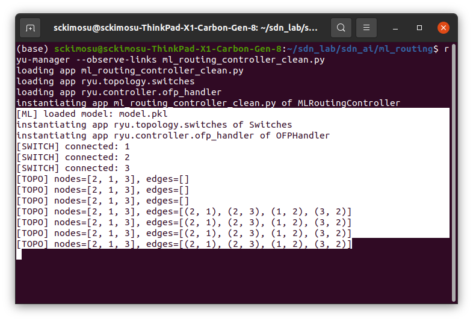

---

## `-observe-links` 옵션

### **Ryu의 Topology Discovery 기능을 활성화하는 옵션**

- 이 옵션을 사용하면 **Ryu가 네트워크의 스위치 간 링크 정보를 자동으로 수집하고 업데이트**
    - 일반적으로 Ryu는 **스위치에 대한 정보만** 얻음
    - 하지만 스위치 간 링크(s1 ↔ s2 ↔ s3 등) 정보를 얻기 위해서는 OpenFlow만으로는 부족하고 **LLDP(Link Layer Discovery Protocol)** 기반 탐색이 필요

---

### LLDP 패킷 자동 주입

- 각 스위치의 각 포트에 주기적으로 LLDP 패킷을 보냄
    - 패킷 내용: 자신이 어떤 스위치/포트인지 정보 포함
    - 목적: 이 패킷이 어떤 다른 스위치의 어떤 포트에 도착했는지 확인하기 위함
        - 누가 누구와 연결되어 있는지 (링크)를 자동으로 알게 되는 구조

---

### 스위치 간 링크 자동 기록

- 수집된 정보는 Ryu의 `Toplogy API`에서 확인 가능
    - `get_switch(datapath_id)`
    - `get_link(datapath_id)`
    - `get_all_links()`
    - `get_all_switches()`
        - ML 라우팅에서 **그래프 기반 경로 탐색**을 하려면 이 정보가 필요

---

### 링크 변화 이벤트 발생

- 링크가 추가되거나 제거되면 Ryu가 이벤트를 발생시킴
    - `EventLinkAdd`
    - `EventLinkDelete`
        - 이를 사용하면 ML 모델이 링크 변화에 따라 학습 업데이트나 경로 재계산을 자동 수행

---

### `-observe-links`

- ML 라우팅 컨트롤러
    - **실시간 링크 정보를 알아야 하므로 `--observe-links` 필수**

| 기능 | 설명 |
| --- | --- |
| Topology discovery | Ryu가 LLDP를 활용해 네트워크 링크 구조 자동 수집 |
| 경로 계산에 필요 | ML 기반 경로 선택 / shortest path 계산 가능 |
| 링크 변경 감지 | 링크가 down/up 되면 이벤트 트리거 |
| Graph 구성 | 네트워크 그래프를 동적으로 업데이트 |

## **토폴로지가 채워지는 과정**

---

### 1. 컨트롤러 + ML 모델 + 토폴로지 앱

- `model.pkl`
    - ML 경로 선택에 사용할 **학습된 모델을 성공적으로 로드**
- `ryu.topology.switches`
    - `-observe-links` 와 같이 동작하는 **토폴로지 수집 앱**.
- `ryu.controller.ofp_handler`
    - :모든 OpenFlow 메시지를 처리하는 기본 핸들러
- **ML 라우팅 + 토폴로지 수집 + OpenFlow 처리** 세 가지가 모두 올라간 상태

```
[ML] loaded model: model.pkl
instantiating app ryu.topology.switches of Switches
instantiating app ryu.controller.ofp_handler of OFPHandler

```

---

### 2. 스위치 연결 로그

- DP ID가 1, 2, 3인 스위치(s1, s2, s3)가 차례로 컨트롤러에 연결된 상황
    - 보통 Mininet에서 s1→1, s2→2, s3→3

```
[SWITCH] connected: 1
[SWITCH] connected: 2
[SWITCH] connected: 3

```

---

### 3. TOPO 로그: 노드만 있고 edges는 빈 상태

- 스위치들이 컨트롤러에 연결된 직후
    - **스위치 노드 정보는 알고 있지만**
    - **LLDP 기반 링크 탐색이 아직 끝나지 않아서 edge가 비어 있음**
    - 이 시점에서는 **스위치가 있다는 것만 아는 상태, 누가 누구랑 연결됐는지는 아직 모름**

```
[TOPO] nodes=[2, 1, 3], edges=[]
[TOPO] nodes=[2, 1, 3], edges=[]
[TOPO] nodes=[2, 1, 3], edges=[]

```

---

### 4. TOPO 로그: 링크(엣지) 정보가 채워짐

```
[TOPO] nodes=[2, 1, 3], edges=[(2, 1), (2, 3), (1, 2), (3, 2)]
[TOPO] nodes=[2, 1, 3], edges=[(2, 1), (2, 3), (1, 2), (3, 2)]
[TOPO] nodes=[2, 1, 3], edges=[(2, 1), (2, 3), (1, 2), (3, 2)]
[TOPO] nodes=[2, 1, 3], edges=[(2, 1), (2, 3), (1, 2), (3, 2)]

```

### 4-1. 엣지가 4개 (양방향 표현)

`edges=[(2, 1), (2, 3), (1, 2), (3, 2)]`

- **방향성을 가진 링크로 두 번씩 표현**
    - `2 ↔ 1` 링크
    - `2 ↔ 3` 링크
        - `(2, 1)`
            - s2의 어떤 포트 → s1의 어떤 포트
        - `(1, 2)`
            - s1의 어떤 포트 → s2의 어떤 포트
        - `(2, 3)` / `(3, 2)`
            - 같은 구조
- **물리적으로는 2개의 링크지만, 논리적으로는 4개의 directed edge로 표현**

---

### 4-2. 같은 로그가 반복

- `[TOPO] nodes=[...] edges=[...]` 가 계속 반복 출력
    - 주기적으로(예: timer, polling) 토폴로지를 출력하도록 코드 작성
    - 특정 이벤트(링크 추가 이벤트 등)가 발생할 때마다 같은 상태를 여러 번 프린트
- **토폴로지가 안정된 뒤에도 같은 내용이 반복**되므로, 컨트롤러 코드 안에서 `event`나 `loop` 안에서 `print_topology()` 여러 번 호출하는 구조

---

- **ML 모델(`model.pkl`)은  로드됨**
- **3대 스위치가 컨트롤러에 정상 연결됨**
    - `-observe-links` + `ryu.topology.switches` 가 잘 작동해서
        - 처음에는 node만 인식
        - 이후 LLDP 탐색이 끝나고 edge가 채워짐
- 토폴로지는 **s1 – s2 – s3 형태의 체인 구조**로 잘 인식됨
- 양방향 링크라서 edge가 4개로 보이는 것이 정상 동작

---

## 3) Mininet 실험 자동화 스크립트 실행

### 다른 터미널에서

```python
sudo python3 exp_ml_routing.py
```

- 미니넷 화면

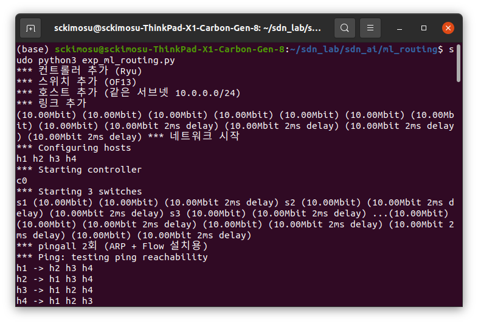

- **Mininet가 스위치를 올릴 때**
    - **각 스위치에 붙은 링크(인터페이스)의 대역폭/지연 설정을 한 줄로 요약**

```
*** Starting 3 switches
s1 (10.00Mbit) (10.00Mbit) (10.00Mbit 2ms delay)
s2 (10.00Mbit) (10.00Mbit 2ms delay) (10.00Mbit 2ms delay)
s3 (10.00Mbit) (10.00Mbit 2ms delay) ...
(10.00Mbit) (10.00Mbit) (10.00Mbit 2ms delay) (10.00Mbit) (10.00Mbit 2ms delay) (10.00Mbit 2ms delay) (10.00Mbit) (10.00Mbit 2ms delay)

```

### **괄호 개수 = 해당 스위치에 연결된 포트(링크) 개수**

- **괄호 하나 = 스위치에 붙은 링크 하나**
- `10.00Mbit`
    - **대역폭 10Mbps**
    - **지연은 기본값(≈0)**
- `10.00Mbit 2ms delay`
    - **대역폭 10Mbps**
    - **지연 2ms 추가**
- `s1 (10.00Mbit) (10.00Mbit) (10.00Mbit 2ms delay)`
    - s1에 **포트(링크)가 3개** 있다는 뜻
        - 10Mbps (delay 없음)
            - 예: h1–s1
        - 10Mbps (delay 없음)
            - 예: h2–s1
        - 10Mbps + 2ms delay
            - 예: s1–s2 링크
- `s2 (10.00Mbit) (10.00Mbit 2ms delay) (10.00Mbit 2ms delay)`
    - s2 포트 3개
        - 10Mbps
            - 예: 호스트 연결
        - 10Mbps + 2ms
            - 예: s1–s2 방향
        - 10Mbps + 2ms
            - 예: s2–s3 방향
- `s3 (10.00Mbit) (10.00Mbit 2ms delay) ...`
    - s3
        - 호스트 쪽 링크
            - 10Mbps
        - 스위치 간 링크
            - 10Mbps + 2ms delay
- `TCLink` 쓸 때 준 옵션들

```python
TCLink, bw=10           # (10.00Mbit)
TCLink, bw=10, delay='2ms'  # (10.00Mbit 2ms delay)

```

---

### **스위치에 설정한 링크 제약(bw, delay) 적용 확인**

- 어떤 링크가 **느린 링크(2ms delay)** 인지 확인
    - ML 라우팅에서는 이 지연이 **feature** 또는 **cost**로 들어갈 수 있겠죠.
- ping 결과에서 보이는 `~4.3ms` RTT는
    - 왕복에 2ms 링크가 두 번(왕복) 지나가는 구조라면 **정상 범위**

---

- `pingall` 2번
- `h1 -> h3`, `h2 -> h4` ping 자동 실행

```bash
cd ~/sdn_lab/sdn_ai/ml_routing
sudo python3 exp_ml_routing.py

```

### Ryu 터미널

- 로그 확인 가능

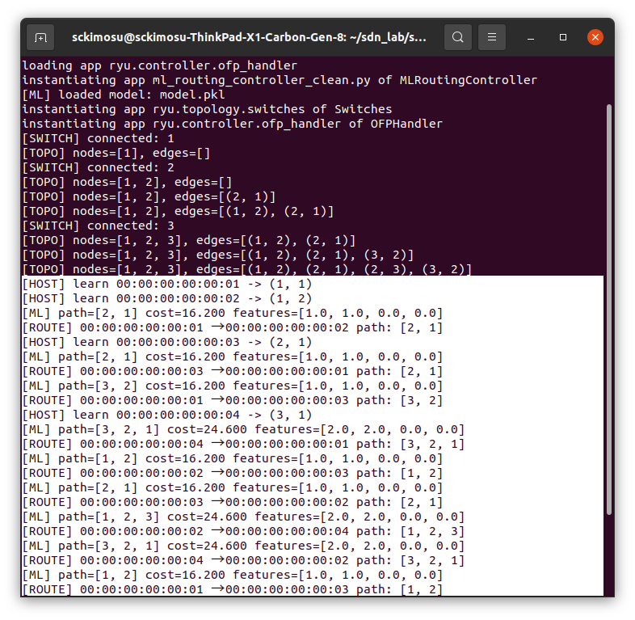

```
[HOST] learn ...
[ML] path=[...] cost=...
[ROUTE] ... path: [...]

```

- 각 스위치에 설치된 Flow 출력

```python
mininet> sh ovs-ofctl dump-flows s1 -O OpenFlow13
mininet> sh ovs-ofctl dump-flows s2 -O OpenFlow13
mininet> sh ovs-ofctl dump-flows s3 -O OpenFlow13

```

---

### HOST learn 로그

- 호스트가 어디에 붙어 있는지 학습

```
[HOST] learn 00:00:00:00:00:01 -> (1, 1)
[HOST] learn 00:00:00:00:00:02 -> (1, 2)
[HOST] learn 00:00:00:00:00:03 -> (2, 1)
[HOST] learn 00:00:00:00:00:04 -> (3, 1)

```

- 컨트롤러가 **MAC → (스위치, 포트)** 위치를 학습했다는 뜻
    - `00:00:00:00:00:01` → `(1, 1)`
        - 스위치 **1번의 1번 포트**에 h1 연결
    - `00:00:00:00:00:02` → `(1, 2)`
        - 스위치 **1번의 2번 포트**에 h2 연결
    - `00:00:00:00:00:03` → `(2, 1)`
        - 스위치 **2번의 1번 포트**에 h3 연결
    - `00:00:00:00:00:04` → `(3, 1)`
        - 스위치 **3번의 1번 포트**에 h4 연결
- 구조
    - s1 ↔ (h1, h2)
    - s2 ↔ (h3)
    - s3 ↔ (h4)
- s1–s2–s3 가 서로 링크로 이어져 있는 **라인(topology chain)**

---

### ML / ROUTE 로그: “어떤 경로를 선택했는지 + 그때의 feature와 cost”

### 1) h1 → h2

```
[ML] path=[2, 1] cost=16.200 features=[1.0, 1.0, 0.0, 0.0]
[ROUTE] 00:00:00:00:00:01 → 00:00:00:00:00:02 path: [2, 1]

```

- **src MAC**
    - `00:..:01` (h1)
- **dst MAC**
    - `00:..:02` (h2)
- ML이 선택한 **스위치 경로**
    - `[2, 1]`
- 그 경로에 대해 계산된 **비용(cost)**
    - `16.200`
- cost를 계산할 때 사용한 **입력 feature**
    - `[1.0, 1.0, 0.0, 0.0]`
- `path=[2, 1]`
    - 스위치 2→1 순서로 지나간다는 의미
    - 실제 토폴로지/코드 구조에 따라 **인덱스/DPID 매핑**이 다름
        - **두 개 스위치를 경유하는 1-hop(중간 링크 1개) 경로**
- `features=[1.0, 1.0, 0.0, 0.0]`
    - **경로 길이, 지연 합, 패킷 손실, 사용률**

---

### 2) h3 → h1 / h1 → h3

```
[ML] path=[2, 1] cost=16.200 features=[1.0, 1.0, 0.0, 0.0]
[ROUTE] 00:00:00:00:00:03 → 00:00:00:00:00:01 path: [2, 1]

[ML] path=[3, 2] cost=16.200 features=[1.0, 1.0, 0.0, 0.0]
[ROUTE] 00:00:00:00:00:01 → 00:00:00:00:00:03 path: [3, 2]

```

- h3(스위치 2) ↔ h1(스위치 1) 사이의 경로
    - 두 스위치를 지나는 1-hop 경로이며
    - 같은 feature, 같은 cost(16.2)로 평가

---

### 3) h4 ↔ h1 (스위치 3 ↔ 1, 중간에 2 포함)

```
[HOST] learn 00:00:00:00:00:04 -> (3, 1)
[ML] path=[3, 2, 1] cost=24.600 features=[2.0, 2.0, 0.0, 0.0]
[ROUTE] 00:00:00:00:00:04 → 00:00:00:00:00:01 path: [3, 2, 1]

```

- 경로
    - `[3, 2, 1]` → 스위치 3 → 2 → 1
        - **2개의 링크**
        - **2 hop**
- feature: `[2.0, 2.0, 0.0, 0.0]`
    - 1-hop 경로 때와 달리 첫 두 값이 2.0으로 증가
    - **경유 링크 수/지연 링크 수가 2개**로 반영
- cost: `24.600`
    - 1-hop일 때 16.2
    - 2-hop일 때 24.6
        - **비례 증가**
        - hop 수가 늘어나면 비용도 증가

```
[ML] path=[1, 2, 3] cost=24.600 features=[2.0, 2.0, 0.0, 0.0]
[ROUTE] 00:00:00:00:00:02 → 00:00:00:00:00:04 path: [1, 2, 3]

[ML] path=[3, 2, 1] cost=24.600 features=[2.0, 2.0, 0.0, 0.0]
[ROUTE] 00:00:00:00:00:04 → 00:00:00:00:00:02 path: [3, 2, 1]

```

- s1 ↔ s3 사이도 중간에 s2를 거치는 2-hop 경로
    - feature `[2.0, 2.0, 0.0, 0.0]` / cost `24.6` 로 동일하게 나옵니다.

---

### 4) 마지막 줄

```
[ML] path=[1, 2] cost=16.200 features=[1.0, 1.0, 0.0, 0.0]
[ROUTE] 00:00:00:00:00:01 → 00:00:00:00:00:03 path: [1, 2]

```

- `01 → 03`일 때 path=[3,2]였는데, 여기서는 **같은 호스트 쌍에 대해 path=[1,2]가 선택된 것**
    - **path 후보를 여러 개 두고, 상황(트래픽/queue/링크상태)에 따라 다른 경로를 선택**
    - 로그 상에서 그래프 노드 번호 ↔ 스위치 DPID ↔ Mininet sX 이름 매핑이 바뀐 표현일 수 있음
- **ML 모듈이 매번 `features`를 넣고**
    - **→ cost를 계산하고 → path를 출력해서 라우팅에 반영**
    - 단순한 최단 거리 Dijkstra가 아니라, **model.pkl에서 나온 결과를 컨트롤러가 실제 경로로 사용됨**

---

- `HOST learn ...`
    - 각 호스트의 MAC이 **어느 스위치의 몇 번 포트에 물려 있는지** 컨트롤러가 학습 완료.
- 각 통신( MAC A → MAC B )마다
    - `features=[...]`
        - **경로에 대한 특성(feature vector)**
    - `cost=...`
        - **ML 모델이 출력한 그 경로의 비용/품질 점수**
    - `path=[...]`
        - **ML이 선택한 스위치 경로 (노드 리스트)**
    - `ROUTE ... path: [...]`
        - 그 경로를 실제 **flow 설치에 사용**했다는 로그
- `features=[1.0, 1.0, 0.0, 0.0]` vs `[2.0, 2.0, 0.0, 0.0]`
    - **1-hop vs 2-hop 경로**같은 구조적 차이
- `cost=16.2` vs `24.6`
    - **경로 길이가 길수록 cost가 커지는 방향**으로 모델이 학습되어 있음

---

- 각 스위치에 설치된 Flow 출력 화면

```python
sh ovs-ofctl -O OpenFlow13 dump-flows s1

```

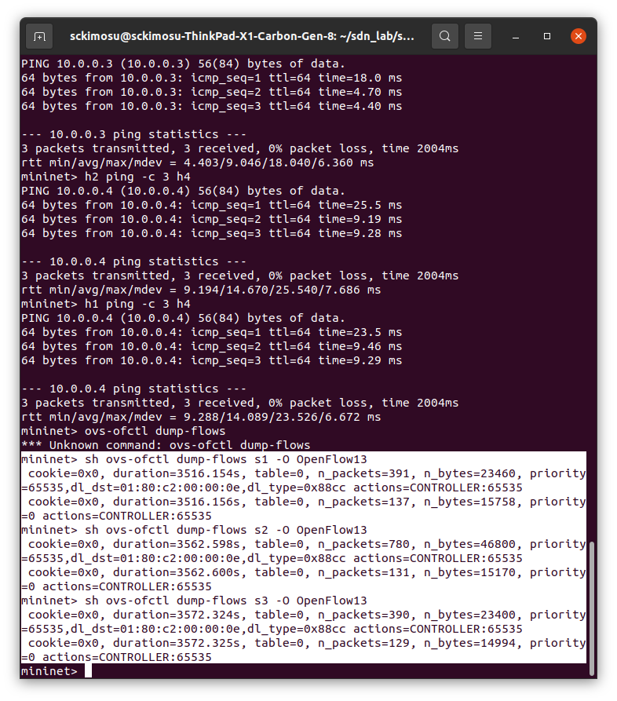

---

## **LLDP (Link Layer Discovery Protocol) :** 스위치 사이 연결 상황 파악

- **스위치간 물리적 링크(Topology) 감지하는 프로토콜**
    - **Ryu가 자동으로 네트워크 그래프(self.net) 구축**
    - 스위치가 자신의 정보를 이웃 스위치에게 브로드캐스팅(broadcasting)

---

### **LLDP 메시지**

| 항목 | 값 |
| --- | --- |
| Layer | L2 (IP 사용 안 함) |
| EtherType | `0x88cc` |
| Destination MAC | `01:80:c2:00:00:0e` (멀티캐스트) |
| 목적 | 스위치 간 이웃(Neighbor) 발견 / 토폴로지 수집 |
| 사용처 | Ryu, OpenDaylight, ONOS 등 SDN 컨트롤러의 Topology Discovery |
| 전송 주기 | 일반적으로 1초 또는 5초 |

---

### LLDP 프레임 구조 **구조**

- LLDP 메시지 구조
    - LLDP는 **L2(Ethernet) 프레임**으로 전송

### **Destination MAC** = MAC 헤더의 목적지 MAC

- LLDP에서는 **특수 멀티캐스트 MAC** 사용
    - `01:80:c2:00:00:0e` (일반 LLDP)
    - `01:80:c2:00:00:03` (MAC Control)
    - `01:80:c2:00:00:00` (Bridge Group Address)

---

### **Source MAC** = MAC 헤더의 출발지 MAC

- **스위치 포트의 MAC 주소**
    - LLDP를 송신하는 포트의 고유 MAC 주소

---

## **EtherType : 0x88cc**

- LLDP를 구분하는 이더 타입
    - MAC 헤더에 포함됨

---

```
+---------------------------+
| Destination MAC (6 bytes) |  ← MAC 헤더
| Source MAC      (6 bytes) |  
| EtherType 0x88cc (2 bytes)|
+---------------------------+
| TLV1: Chassis ID          |  ← LLDP Payload
| TLV2: Port ID             |
| TLV3: Time To Live        |
| ... additional TLVs       |
+---------------------------+

```

---

### LLDP TLV 필드

- TLV : Tag-Length-Value

### 1) **Chassis ID TLV**

- 스위치를 구분하는 ID
    - dpid

### 2) **Port ID TLV**

- 어떤 포트에서 전송되었는지 표시
    - s1-eth1

### 3) **TTL(Time To Live) TLV**

- 메시지가 유효한 시간(sec)

### 4) 추가 TLV

- System Name
- System Description
- Port Description
- Management Address

---

### **Ryu SDN에서 LLDP 메시지의 역할**

- Ryu의 Topology Discovery (`ryu.topology.switches`)
    - 각 스위치의 모든 포트로 LLDP 패킷 전송
    - 이웃 스위치에서 LLDP를 수신하면 Packet-In
    - **Controller는 LLDP 패킷을 분석하여**
        - **어떤 스위치가**
        - **어떤 포트를 통해**
        - **어느 스위치와 연결되어 있는지를 맵핑함**

---

### Ryu가 만든 LLDP 패킷 예시

- Ryu는 다음과 같은 형태의 패킷을 스위치로 보냄
    - 스위치가 이 패킷을 다른 스위치로 전달하면 그 스위치에서 Packet-In으로 컨트롤러에 도달함.

```
Ethernet(dst=01:80:c2:00:00:0e,
         src="port mac",
         ethertype=0x88cc)
+ LLDP chassis_id
+ LLDP port_id
+ LLDP ttl=120

```

---

### Flow Table에서 LLDP 처리

- 스위치 Flow 출력을 통해서

```
priority=65535, dl_dst=01:80:c2:00:00:0e, dl_type=0x88cc actions=CONTROLLER

```

- 이 규칙은 자동으로 설치됨
    - 의미

```
LLDP 패킷은 항상 컨트롤러로 보내라
(링크 감지에 필수)

```

---

### LLDP와 Ping

- LLDP 메시지는 스위치 간 연결(Link)을 탐지하는 L2 프로토콜이며, ping과 아무 관련이 없음

| 항목 | LLDP | ping(ICMP) |
| --- | --- | --- |
| 목적 | 링크/토폴로지 감지 | 호스트 reachability 테스트 |
| 계층 | L2 | L3+ICMP |
| EtherType | 0x88cc | 0x0800 / 0x86dd |
| MAC | 01:80:c2:00:00:0e | 목적지 MAC |
| Ryu 동작 | Controller로 무조건 전달 | ML 경로에 따라 Flow 설치 |

---

### LLDP 메시지 (hex dump)

- Ryu에서는 토폴로지를 만들기 위해 필수적으로 사용됨
    - `01:80:c2:00:00:0e`
        - LLDP multicast
    - `88cc`
        - LLDP EtherType
    - `02`
        - Chassis ID TLV
    - `04`
        - Port ID TLV
    - `06`
        - TTL TLV

```
01 80 c2 00 00 0e   ff ff ff ff ff ff   88 cc
02 07 04 73 31 02 00
04 07 70 6f 72 74 2d 31
06 02 00 78

```

---

## **스위치 기본 규칙(default rules)**

### **1. LLDP 패킷 처리용 Flow 엔트리 (priority=65535)**

- **LLDP(Link Layer Discovery Protocol) 패킷을 컨트롤러로 보내는 룰**
    - Ryu Topology Discovery(`-observe-links`, switches.py)가 자동 설치
        - 링크 상태(스위치 간 연결 정보)를 수집하기 위한 필수 항목

```
cookie=0x0, duration=3516.154s, table=0, n_packets=391, n_bytes=23460,
priority=65535, dl_dst=01:80:c2:00:00:0e, dl_type=0x88cc
actions=CONTROLLER:65535

```

| 필드 | 의미 |
| --- | --- |
| `priority=65535` | 가장 높은 우선순위 → LLDP 패킷을 최우선 처리 |
| `dl_dst=01:80:c2:00:00:0e` | LLDP multicast MAC 주소 |
| `dl_type=0x88cc` | LLDP Ethernet 타입 |
| `actions=CONTROLLER:65535` | LLDP 패킷을 모두 Ryu 컨트롤러로 전달 |
- Ryu는 LLDP 패킷을 스위치들로 보내고, 다른 스위치에서 다시 수신하여 어느 스위치의 어느 포트가 어느 스위치와 연결되어 있는지 분석
- **링크 감지용(Topology Discovery) Flow**

---

### **2. Table-miss Flow 엔트리 (priority=0)**

- 스위치가 **매칭되는 Flow가 없을 때 컨트롤러로 보내는 규칙**
- Ryu ML 컨트롤러에서 직접 설치한 기본 rule
    - 최초 패킷 → table-miss → Ryu 컨트롤러로 Packet-In → 컨트롤러가 ML로 경로 선택 → Flow 설치→ 이후 패킷은 스위치 내부에서 바로 처리

```
cookie=0x0, duration=3516.156s, table=0, n_packets=137, n_bytes=15758,
priority=0 actions=CONTROLLER:65535

```

| 필드 | 의미 |
| --- | --- |
| `priority=0` | 가장 낮은 우선순위, 어떤 룰에도 매칭되지 않는 경우에 적용 |
| `actions=CONTROLLER:65535` | 패킷 전체를 컨트롤러로 전송 |

---

### s1의 ML 라우팅 Flow(priority=10) 처리

- **s1에서 ML 라우팅 패킷이 발생한 적 없다면, ML Flow가 생기지 않음**
    - Flow가 설치되는 위치는 그 경로에 실제로 포함된 스위치에만 설치됨
    - 아래와 같이 `h1->h3` 트래픽이 지나갈 수 있는 경로가 아래 경우라면
        - s1에 Flow가 생성되지만,

```
h1 - s2 - s1 - s3 - h3

```

- 선택된 경로가 아래 경우처럼
    - **s1은 경로에 포함되지 않기 때문에 s1에는 ML Flow가 생기지 않음**

```
h1 - s2 - s3 - h3

```

---

### h1 → h3 ping 후 다시 스위치 **ML Flow** 확인

- ping 경로에 따라 s1에 새로운 rule이 생기면
    - ML 라우팅이 s1을 사용한 증거

```bash
mininet> h1 ping -c 3 h3
mininet> sh ovs-ofctl dump-flows s1 -O OpenFlow13

```

### 미니넷 화면

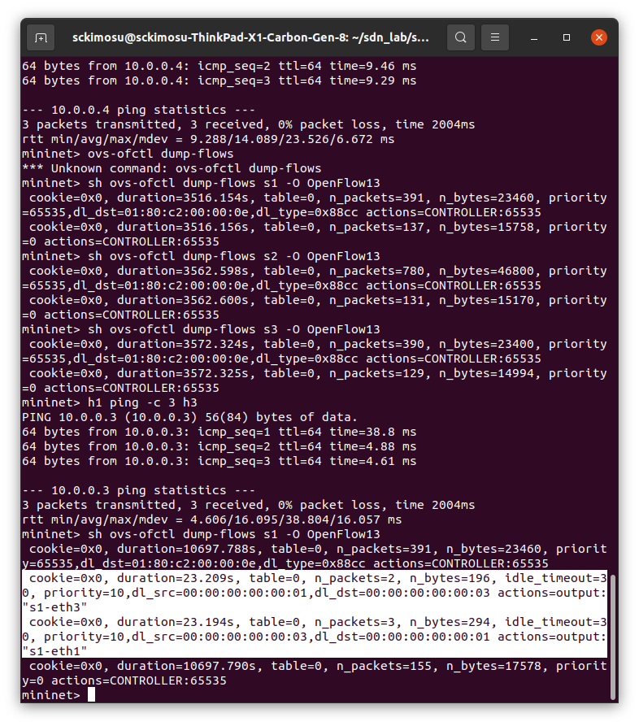

---

### 컨트롤러 화면

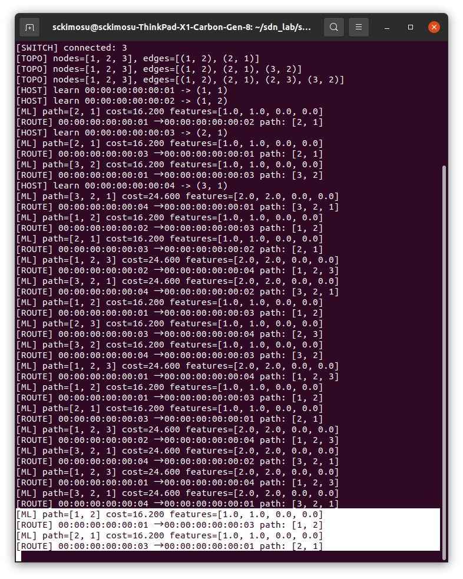

---

### **ML 라우팅 실제 동작**

```
[ML] path=[1, 2] cost=16.200 features=[1.0, 1.0, 0.0, 0.0]
[ROUTE] 00:00:00:00:00:01 → 00:00:00:00:00:03 path: [1, 2]
[ML] path=[2, 1] cost=16.200 features=[1.0, 1.0, 0.0, 0.0]
[ROUTE] 00:00:00:00:00:03 → 00:00:00:00:00:01 path: [2, 1]

```

### 1. `path=[1, 2]` / `path=[2, 1]` 의미

- `1`, `2` : **스위치의 dpid**
    - `1`
        - s1
    - `2`
        - s2
- 호스트 위치
    - h1 (MAC: `00:...:01`)
        - s1에 연결
    - h3 (MAC: `00:...:03`)
        - s2에 연결
- `00:..:01 → 00:..:03`
    - **h1 → h3** 트래픽
        - 경로: `[1, 2]`
            - s1 → s2 : 원 (1) 홉
- `00:..:03 → 00:..:01`
    - **h3 → h1** 트래픽
        - 경로: `[2, 1]`
            - s2 → s1 한 홉
    - **왕복 방향 각각에 대해 별도의 경로를 계산하고, 그 결과를 로그로 찍음**

---

### `features=[1.0, 1.0, 0.0, 0.0]`

- 컨트롤러 feature

```python
[ hop_count, total_weight, avg_util, max_util ]

```

- `hop_count = 1.0`
    - 스위치 간 홉 수 :  1
    - s1 ↔ s2 한 번만 건너뛰면 도달
- `total_weight = 1.0`
    - 각 링크 weight=1.0 이므로 1홉
    - 총 weight도 1
- `avg_util = 0.0`
- `max_util = 0.0`
    - **링크 사용률(utilization)을 아직 반영하지 않으므로** 0으로 사용.
        - 지금은 **최단 경로 기반 feature**
        - **향후 혼잡도 반영을 위한 자리**

---

### `cost=16.200`

```
cost=16.200

```

- `train_model.py`에서 학습한 **RandomForestRegressor**가 `features=[1.0,1.0,0.0,0.0]`을 입력받고 예측한 경로의 비용(cost)
    - 숫자(16.2)가 중요한 게 아니라, 여러 후보 경로 중에서 cost가 가장 낮은 경로를 선택한다라는 점이 핵심
- 현재 토폴로지에서 h1 ↔ h3는 사실상 **1홉짜리 경로만 존재**
    - 경로 후보가 `[1,2]` 하나뿐임
    - 그래서 자동 선택된 것
- 토폴로지가 더 복잡해져서 경로 후보가 여러 개 있으면, 각 경로마다 feature를 계산하고, 모델이 예측한 cost를 비교해서 **가장 작은 cost의 경로를 고를 수 있음**

---

### `[ML]`와 `[ROUTE]` 로그 관계

- 한 쌍씩 읽으면 됨

### 1) h1 → h3

- `[ML]`
    - 후보 경로 [1, 2]에 대해 feature를 이렇게 만들었고, 모델이 cost=16.2로 예측했다
- `[ROUTE]`
    - 그래서 결국 01 → 03 트래픽은 path=[1, 2]로 라우팅한다

```
[ML] path=[1, 2] cost=16.200 features=[1.0, 1.0, 0.0, 0.0]
[ROUTE] 00:00:00:00:00:01 → 00:00:00:00:00:03 path: [1, 2]

```

### 2) h3 → h1

- 동일한 로직이지만 방향만 반대 (s2 → s1)

```
[ML] path=[2, 1] cost=16.200 features=[1.0, 1.0, 0.0, 0.0]
[ROUTE] 00:00:00:00:00:03 → 00:00:00:00:00:01 path: [2, 1]

```

---

### Flow 테이블과 연결

- s1 Flow
    - src=00:...:01, dl_dst=00:...:03 actions=output:"s1-eth3"
        - `path=[1,2]`에 따라 s1에 설치된 h1→h3용 룰
    - dl_src=00:...:03, dl_dst=00:...:01 actions=output:"s1-eth1"
        - `path=[2,1]`에 따라 s1에 설치된 h3→h1용 룰

```
priority=10, dl_src=00:...:01, dl_dst=00:...:03 actions=output:"s1-eth3"
priority=10, dl_src=00:...:03, dl_dst=00:...:01 actions=output:"s1-eth1"

```

---

## `train_model.py`

- Ryu 컨트롤러가 사용할 model.pkl이라는 머신러닝 모델 파일을 만드는 스크립트
    - 이 모델은 경로의 특징(feature)을 입력으로 받아, 그 경로의 cost(좋음/나쁨)를 숫자로 예측
- 컨트롤러 입장에서
    - 경로 후보 ①, ②, ③ …에 대해
        - feature = `[hop 수, weight 합, 평균 사용률, 최대 사용률]`
        - `cost = model.predict([feature])`
            - cost가 **가장 작은** 경로를 최종 선택
            - 이 구조에서 `train_model.py`는 **feature → cost의 관계를 학습**시키는 단계

---

### import 부분

- `numpy`
    - 숫자 배열 다룰 때 사용 (학습 데이터 X, y를 구성)
- `joblib`
    - 학습이 끝난 모델을 `model.pkl`로 저장/불러올 때 사용
- `RandomForestRegressor`
    - 회귀 모델 (입력 : 연속값 출력)
    - 여기서는 `cost`를 실수(float)로 예측해야 하므로, 분류가 아니라 **회귀(regression)** 사용

```python
import numpy as np
import joblib
from sklearn.ensemble import RandomForestRegressor

```

### X feature 설계

- 하나의 행(row)이 한 경로(path)를 의미
- 각 칸의 의미
    - `hop`
        - 홉 수 = 해당 경로를 지나가는 스위치 개수 - 1
        - `1 → 2 → 3`이면 hop = 2
    - `weight`
        - 링크 weight 합 (지금은 그냥 hop 수와 같은 값으로 둠)
        - 나중에 링크별 지연/거리 등을 반영할 수 있음
    - `avg_util`
        - 이 경로를 구성하는 링크들의 평균 사용률 (0.0 ~ 1.0)
    - `max_util`
        - 이 경로에서 가장 사용률이 높은 링크의 사용률 (병목 구간)
- 각 샘플
    - `[1, 1, 0.0, 0.0]`
        - 홉 1
        - weight 1
        - 사용률 거의 없음
            - **아주 이상적인 짧고 깨끗한 경로**
    - `[2, 2, 0.0, 0.0]`
        - 홉 2
        - 사용률 없음
        - 1 홉보다는 좀 더 긴 경로
    - `[3, 3, 0.0, 0.0]`
        - 홉 3
        - 사용률 없음
        - 더 긴 경로
    - `[2, 2, 0.5, 0.8]`
        - 홉 2
        - 평균 사용률 50%
        - 최대 80%
            - **혼잡한 경로**
    - `[3, 3, 0.7, 0.9]`
        - 홉 3
        - 더 심한 혼잡
            - 가장 피하고 싶은 경로
    - `X`  : 경로의 상태를 추상적으로 표현한 것

---

```python
# 학습 데이터
# [hop, weight, avg_util, max_util]
X = np.array([
    [1, 1, 0.0, 0.0],   # 1홉, 깨끗한 경로
    [2, 2, 0.0, 0.0],   # 2홉
    [3, 3, 0.0, 0.0],   # 3홉
    [2, 2, 0.5, 0.8],   # 2홉 + 혼잡
    [3, 3, 0.7, 0.9],   # 3홉 + 혼잡
])

```

### y target(cost) 설계

- 각 row에 대응되는 **정답 cost**
    - 홉이 늘어날수록 cost 증가
    - 혼잡(util)이 높아질수록 cost가 상승
        - 깨끗한 1홉
            - cost : 10
        - 깨끗한 2홉
            - cost : 20
        - 깨끗한 3홉
            - cost :30
        - 혼잡한 2홉
            - cost : 80 (길이도 길고 혼잡해서 나쁨)
        - 혼잡한 3홉
            - cost : 120 (최악)
- cost를 보고, 모델이 아래 규칙 학습
    - **짧고 덜 막힌 경로**
        - 모델이 **좋다 (cost 가 낮음) 로 학습**
    - **길거나 막힌 경로**
        - ****모델이 **좋지 않음 (cost 가 높음)으로 학습**

---

```python
# 각 경로의 cost (값이 낮을수록 좋은 경로)
y = np.array([
    10,    # 1홉
    20,    # 2홉
    30,    # 3홉
    80,    # 2홉 + 혼잡
    120,   # 3홉 + 혼잡
])

```

### 모델 생성 및 학습

- `RandomForestRegressor`
    - 여러 개의 결정트리(Decision Tree)를 합쳐서 사용하는 앙상블 모델
    - 개별 트리들의 예측값을 평균 내서 보다 안정된 예측
- `n_estimators=50`
    - 트리 50개 정도
    - 작은 데이터에도 동작
- `random_state=0`
    - 랜덤 시드 고정
    - 실행할 때마다 같은 결과가 나오도록
- `model.fit(X, y)`
    - feature X와 target y를 이용해서 **feature → cost 함수** 학습

---

```python
model = RandomForestRegressor(
    n_estimators=50,
    random_state=0
)
model.fit(X, y)

```

---

### 학습된 모델을 파일로 저장

- `model` 객체를 `model.pkl`에 저장

```python
joblib.dump(model, "model.pkl")
print(">> model.pkl 저장 완료")

```

- Ryu 컨트롤러에서 사용
    
    ```python
    model = joblib.load("model.pkl")
    cost = model.predict([features])[0]
    
    ```
    

---

### 학습된 모델이 컨트롤러에서 사용됨 (`ml_routing_controller_clean.py`)

- `train_model.py`에서 학습한 모델은 컨트롤러 입장에서 보면
    - 경로에 대한 점수(cost)를 산정하는 함수 역할
- 경로 후보 생성

```python
paths = list(nx.all_simple_paths(self.net, src_dpid, dst_dpid, cutoff=6))

```

- 각 경로별 feature 계산

```python
features = self._build_features(path)
# -> [hop_count, total_weight, avg_util, max_util] 형식

```

- 머신러닝 모델로 cost 예측

```python
cost = self.model.predict([features])[0]

```

- cost가 가장 작은 경로 선택

```python
if best_cost is None or cost < best_cost:
    best_cost = cost
    best_path = path

```

---

### 모델 (model.pkl) 생성 화면

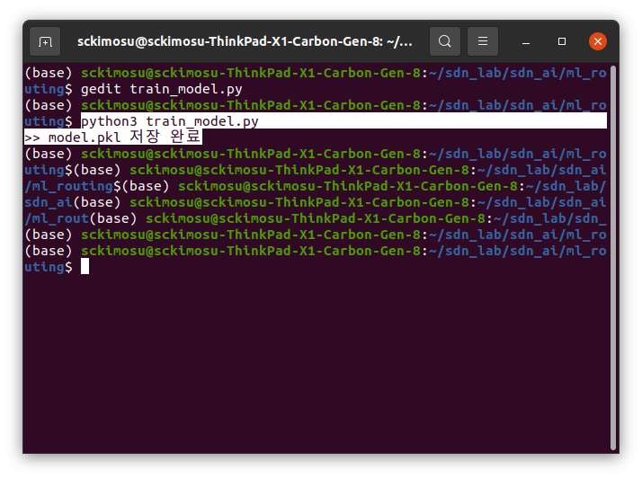

### 컨트롤러 실행

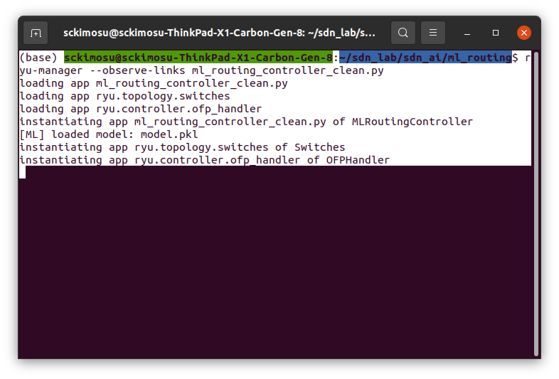

### 스위치 토폴로지 생성

- sudo python3 exp_ml_routing.py
    - **Mininet + Ryu 환경에서 토폴로지를 구성**
    - **기본 ARP/Flow 설치 후**
    - **cross-switch ping 테스트까지 정상 수행된 로그**
- 컨트롤러 추가
    - `c0` → Ryu 컨트롤러 정상 실행됨.
- 스위치 3대 생성
    - s1, s2, s3
    - 링크 속도는 대부분 **10Mbps**, 일부 링크는 **2ms 지연 포함**
- 호스트 추가
    - h1, h2, h3, h4
    - 모두 동일 서브넷 `10.0.0.0/24`
- 기본 pingall 2회 수행
    - ARP 테이블 생성 + 기본 포워딩 룰 설치 성공
    - 모든 호스트 간 connectivity OK

```
0% dropped (12/12 received)

```

- cross-switch ping 테스트
    - h1 → h3(10.0.0.3) 3회 Ping
        - **왕복 지연 4.2~4.4 ms** 수준
        - 스위치 간 경로에 포함된 **2ms delay 링크가 실제로 적용된 것으로 보임**

```
time = 4.26 ms
time = 4.43 ms
time = 4.43 ms

```

---

- 전체 네트워크가 정상 구동됨
    - **링크 속도/지연 설정이 실제 Ping RTT에 반영됨**
    - 기본 L2 Switching 동작은 문제 없음
        - Ryu controller가 정상적으로 MAC learning + flow 설치를 수행
        - ML 기반 경로 선택(ML routing trigger)이 필요
            - 현재 ping 테스트 결과는 **지연이 있는 링크를 포함한 기본 경로로 동작했음**

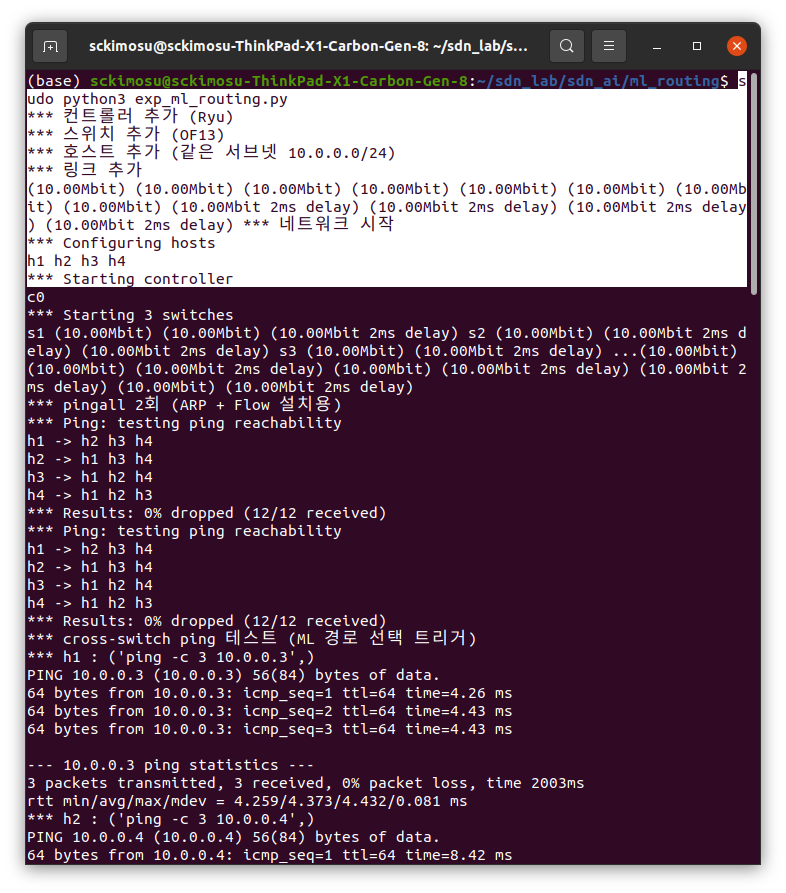

---

### 컨트롤러 상황

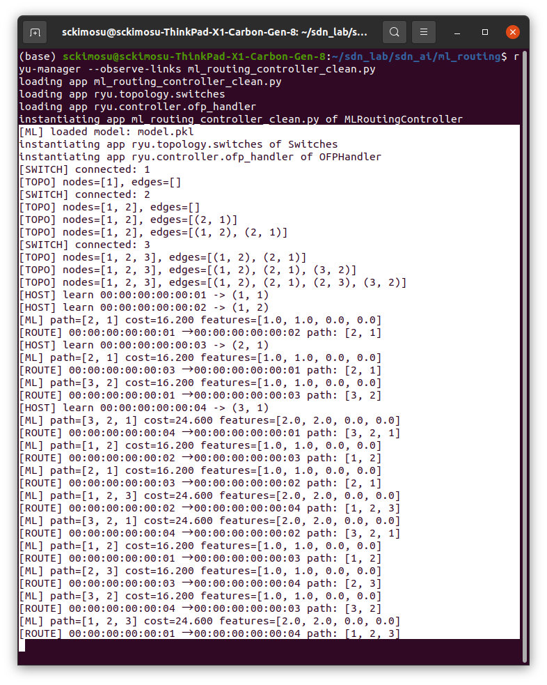

### ping test

- h1 ping -c 3 h3

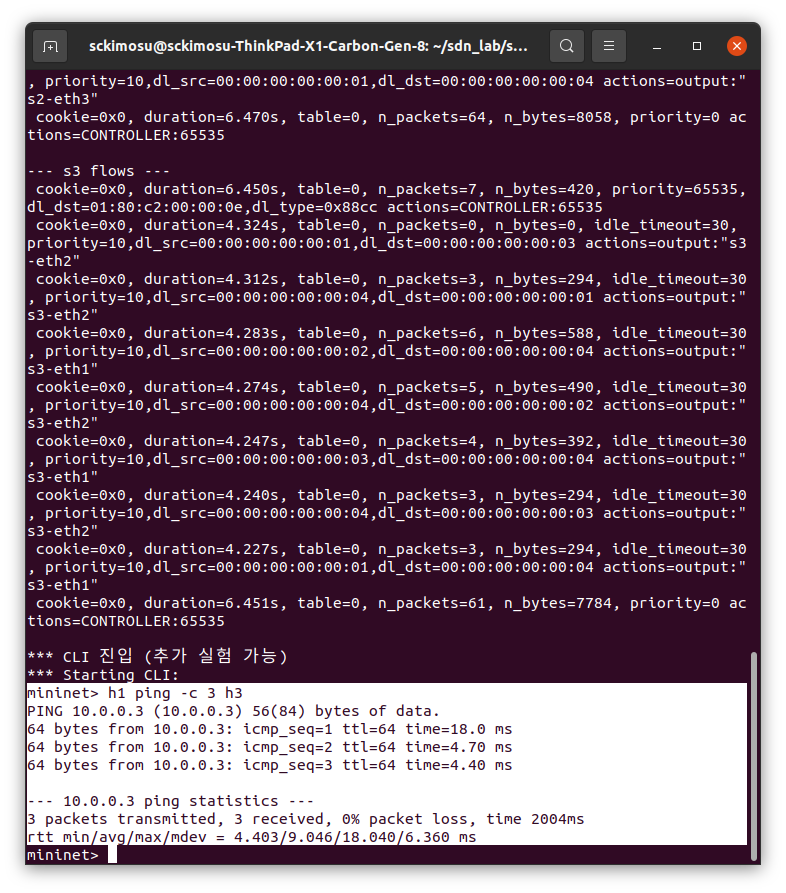

### 컨트롤러

- h1 ping -c 3 h3 테스트후 ML 라우팅

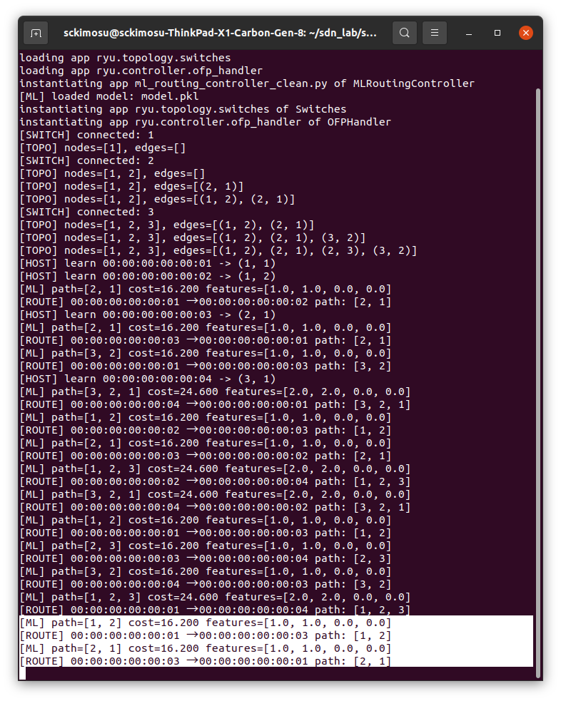

### ping test

- h2 ping -c 3 h4

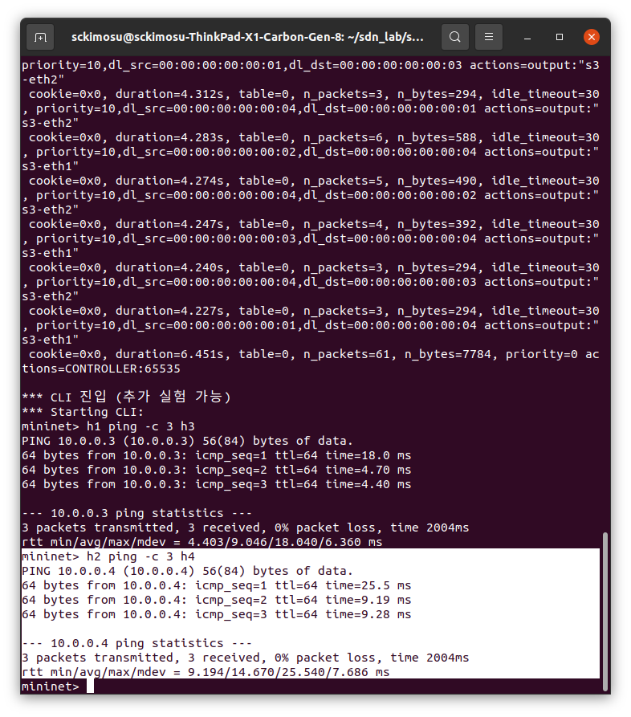

### 컨트롤러

- h2 ping -c 3 h4 테스트 후 ML 라우팅

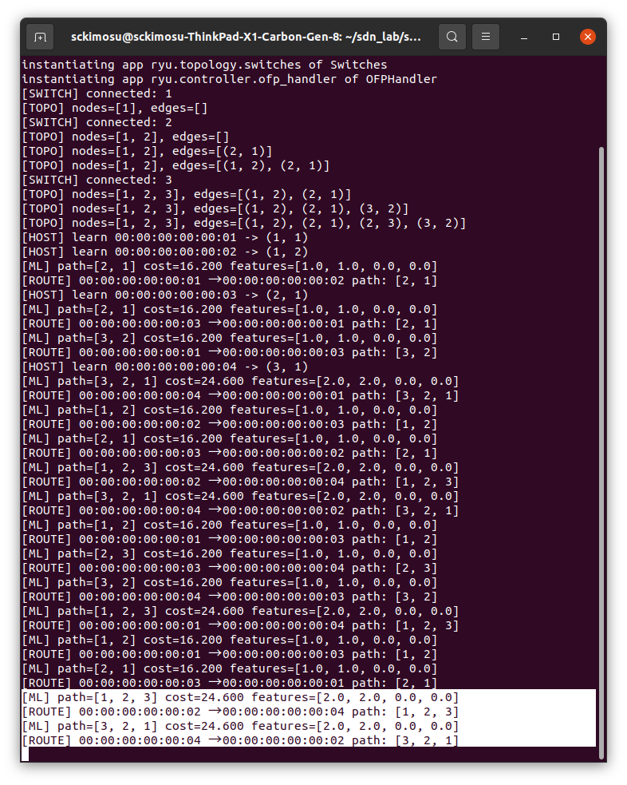

### ping test

- h1 ping -c 3 h4

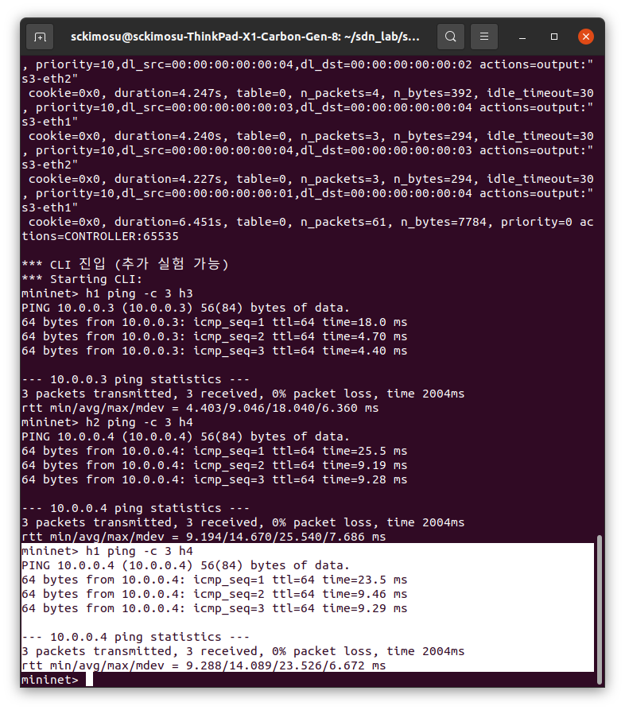

### 컨트롤러

- h1 ping -c 3 h4  테스트 후 ML 라우팅

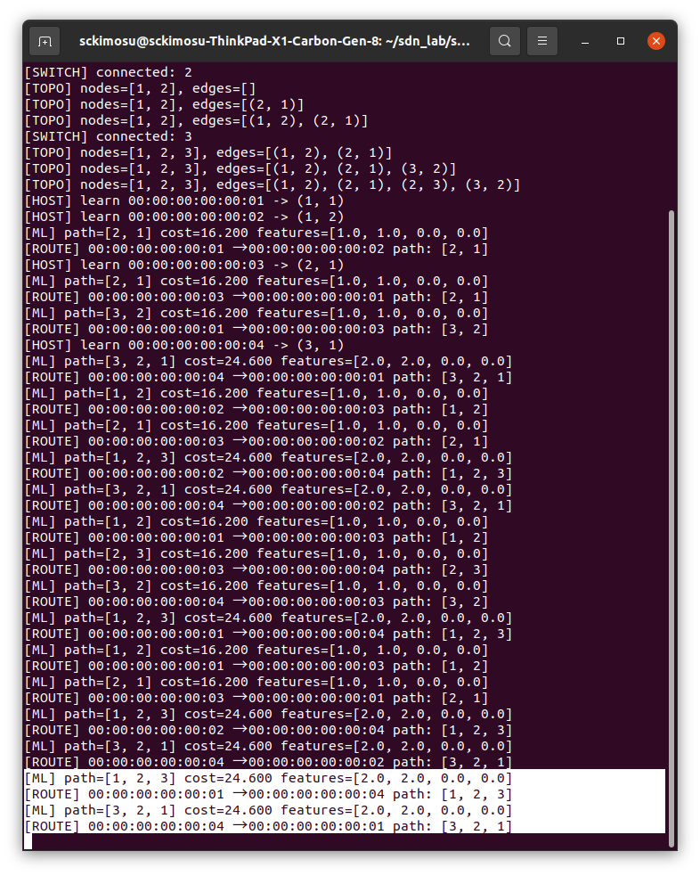
