# Ping 통해 본 컨트롤러 학습

---

### **Host → Router → Server**

- 양 끝 호스트는 OSI 7계층 전체를 사용하지만, 중간 라우터는 L3까지만 처리
- **클라이언트(호스트) 7계층 → 라우터(3계층) → 서버(7계층)** 로 이동

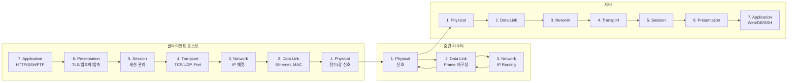

---

### 호스트(클라이언트)

- 호스트
    - **7계층 전체** 사용
- HTTP 요청

```
L7: HTTP 데이터 생성
L6: TLS 암호화
L5: 세션 설정
L4: TCP 세그먼트 생성
L3: IP 패킷 생성
L2: Ethernet 프레임 캡슐화
L1: PHY 신호로 전송

```

---

### 라우터(중간 장비 → L3까지만 처리)

- 라우터는 **L7~L4까지의 정보는 해석하지 않고**, 아래 계층만 처리
    - L3
        - IP 목적지 보고 라우팅 결정
    - L2
        - MAC 주소를 다음 홉 MAC 으로 변경
    - L1:
        - 전기/광 신호로 다시 송신
- 라우터는 **프레임을 벗겨서 → IP 패킷을 보고 → 다시 새 Ethernet 프레임으로 감싼 뒤 전송**

---

### 서버(수신)

- 서버는 호스트와 반대로 **L1 → L7 방향으로 역캡슐화**를 수행

```
L1 신호 → L2 프레임 → L3 IP → L4 TCP → L5/6 처리 → L7 웹 서버에서 처리

```

---

# **ARP 포함 Host → Switch → Router → Server 흐름**

- 실제 네트워크에서 패킷이 이동하는 **과정(ARP → 프레임 → 라우팅 → 서버 전달)**

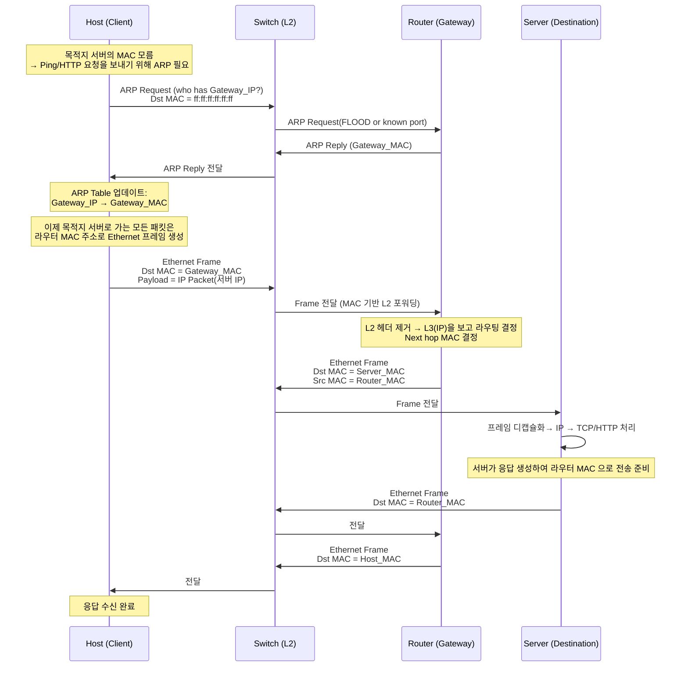

---

### 단계 1 :  ARP 단계 (목적지 MAC 모를 때)

- 호스트는 서버 MAC 을 직접 모릅
    - 서버가 다른 네트워크라면 **게이트웨이 MAC이 필요**하므로 ARP 수행.
        - Host → Switch → Router
            - **ARP Request (브로드캐스트)**
        - Router → Switch → Host
            - **ARP Reply (유니캐스트)**
        - Host 는 ARP Table 에 저장:

```
Gateway_IP → Gateway_MAC

```

---

### 단계 2 : Host → Router (L2: MAC 기반)

- 목적지 서버의 IP 는 Gateway 를 통해 전달되므로
    - Ethernet Frame 의 목적지 MAC = **Gateway_MAC**
    - IP 패킷의 목적지 IP = **Server_IP**

---

### 단계 3 : Router → Server (L3: 라우팅)

- 라우터는
    - Ethernet 헤더 제거(L2)
    - IP 패킷을 보고 라우팅(L3)
    - 다음 홉 또는 서버 MAC 으로 새 Ethernet Frame 생성(L2)

---

### 단계 4 : Server → Router → Host (응답 경로)

- 라우터와 스위치는 ARP 캐시 및 MAC 학습 기반으로 L2 포워딩 + L3 라우팅을 통해 클라이언트까지 회신.

---

| 단계 | 설명 |
| --- | --- |
| 1 | Host: Gateway MAC 모름 → ARP Request |
| 2 | Router: ARP Reply → Host 학습 |
| 3 | Host: Gateway MAC 으로 Ethernet Frame 생성 |
| 4 | Switch: MAC 기반 포워딩 |
| 5 | Router: L3 라우팅 → Server MAC 으로 다시 Ethernet Frame 생성 |
| 6 | Switch: Server 로 전달 |
| 7 | Server 응답 → Router → Host |

---

### **Ping 패킷의 OSI 7계층 구조 (캡슐화)**

- **왼쪽 H1**
    - **Ping 패킷 OSI 7계층 캡슐화**
- **중간 라우터**
    - **3계층까지만 처리**
- **오른쪽 H2**
    - **OSI 7계층 디캡슐화**

---

### **Ping 패킷 OSI 7계층 캡슐화 + Router + H2 디캡슐화**

```mermaid
flowchart LR

%% ---------------------- H1 ----------------------
subgraph H1["H1 (Ping 송신자)"]
direction TB
H1_L7["7. Application<br/>ICMP Echo Request 생성"]
H1_L6["6. Presentation"]
H1_L5["5. Session"]
H1_L4["4. Transport<br/>ICMP Encapsulation"]
H1_L3["3. Network<br/>IP Header 추가"]
H1_L2["2. Data Link<br/>Ethernet Header 추가"]
H1_L1["1. Physical<br/>신호 전송"]

H1_L7 --> H1_L6 --> H1_L5 --> H1_L4 --> H1_L3 --> H1_L2 --> H1_L1
end

%% ---------------------- Router ----------------------
subgraph R["Router / Switch"]
direction TB
R_L1["1. Physical<br/>수신/송신"]
R_L2["2. Data Link<br/>MAC 기반 포워딩"]
R_L3["3. Network<br/>IP 기반 라우팅"]

R_L1 --> R_L2 --> R_L3 --> R_L2 --> R_L1
end

%% ---------------------- H2 ----------------------
subgraph H2["H2 (Ping 수신자)"]
direction TB
H2_L1["1. Physical<br/>신호 수신"]
H2_L2["2. Data Link<br/>Ethernet Header 제거"]
H2_L3["3. Network<br/>IP/ICMP 확인"]
H2_L4["4. Transport<br/>ICMP 처리"]
H2_L5["5. Session"]
H2_L6["6. Presentation"]
H2_L7["7. Application<br/>ICMP Echo Reply 생성"]

H2_L1 --> H2_L2 --> H2_L3 --> H2_L4 --> H2_L5 --> H2_L6 --> H2_L7
end

%% 연결 흐름
H1_L1 --> R_L1 --> H2_L1

```

---

### **H1 → Ping 패킷 캡슐화**

- H1 은 Ping(ICMP Echo Request)를 만들기 위해 다음 순서로 헤더를 붙임
    - L7
        - Ping Application 데이터 생성
    - L4
        - ICMP 헤더 추가 (Type=8)
    - L3
        - IP 헤더 추가 (Src IP=H1, Dst IP=H2)
    - L2
        - Ethernet 헤더 추가
        - 목적지가 H2 MAC을 몰라서 ARP 했었다면 Dst=Gateway MAC
    - L1
        - 전기/광 신호로 전송

---

### **라우터**

- 라우터는 **ICMP, IP Payload 내용 등 L4~L7 데이터는 해석하지 않음**
- 라우터는 다음만 수행

| 계층 | 라우터가 수행하는 것 |
| --- | --- |
| L3 | 목적지 IP 보고 라우팅 |
| L2 | 새 MAC 주소로 Ethernet 프레임 재작성 |
| L1 | 다음 홉으로 신호 송신 |

### **H2 → Ping 패킷 디캡슐화**

- H2는 패킷을 수신한 후
    - L1
        - 신호 수신
    - L2
        - 이더넷 헤더 제거
    - L3
        - IP 헤더 분석 → Protocol=1(ICMP)
    - L4
        - ICMP Echo Request 확인
    - L7
        - 응답(Ping Reply) 생성
    - 다시 H1로 보내기 위해 동일 구조로 캡슐화하여 전송

---

```
┌──────────────────────────────┐
│   7. Application Layer        │  ← ping 명령 실행 (user space)
│   (ping, echo, time display)  │
└──────────────────────────────┘
                 ↓
┌──────────────────────────────┐
│   6. Presentation Layer       │  ← 별도 작업 없음(암호화 없음)
└──────────────────────────────┘
                 ↓
┌──────────────────────────────┐
│   5. Session Layer            │  ← 세션 개념 없음
└──────────────────────────────┘
                 ↓
┌──────────────────────────────┐
│   4. Transport Layer          │
│   (TCP/UDP를 사용하지 않음)   │
│   Ping은 포트 없음!           │
└──────────────────────────────┘
                 ↓
┌──────────────────────────────┐
│   3. Network Layer (IP)       │
│   +------------------------+  │
│   |   IP Header            |  │
│   |   - Src IP (H1)        |  │
│   |   - Dst IP (H2)        |  │
│   |   - Protocol = 1(ICMP) |  │
│   +------------------------+  │
│   |   ICMP Header          |  │
│   |   Type=8(echo req)     |  │
│   |   Code=0               |  │
│   |   Identifier/Seq#      |  │
│   |   Payload(data)        |  │
│   +------------------------+  │
└──────────────────────────────┘
                 ↓
┌─────────────────────────────────────────┐
│   2. Data Link Layer (Ethernet)         │
│   +-----------------------------------+ │
│   |  Ethernet Header                  | │
│   |  - Dst MAC (H2_MAC)               | │
│   |  - Src MAC (H1_MAC)               | │
│   |  - EtherType = 0x0800 (IPv4)      | │
│   +-----------------------------------+ │
│   |        IP Packet (위 내용 전체)   | │
│   +-----------------------------------+ │
│   |  FCS (Frame Check Sequence)        | │
└─────────────────────────────────────────┘
                 ↓
┌──────────────────────────────┐
│   1. Physical Layer (PHY)    │
│   전기/광 신호로 비트 전송    │
└──────────────────────────────┘

```

---

| OSI 계층 | Ping에서 수행되는 역할 |
| --- | --- |
| L7 Application | 사용자 ping 명령 실행 |
| L6 Presentation | Encoding/Decoding 필요 없음 |
| L5 Session | 세션 유지 없음 |
| L4 Transport | TCP/UDP 사용 X → ICMP 는 L3 프로토콜 |
| L3 Network | IP 헤더 + ICMP 헤더 생성 (핵심) |
| L2 Data Link | Ethernet 헤더 추가 (MAC 주소 기반 전송) |
| L1 Physical | 실제 신호(비트)로 전송 |

---

### Ping 패킷 구성

- Ping Request 구조

```
Ethernet Frame
 └── Ethernet Header
      ├── Dst MAC = H2 MAC
      ├── Src MAC = H1 MAC
      └── EtherType = IPv4

     IP Packet
      ├── Src IP = H1 IP
      ├── Dst IP = H2 IP
      └── Protocol = 1 (ICMP)

         ICMP Message
           ├── Type = 8 (Echo Request)
           ├── Code = 0
           ├── Identifier
           ├── Sequence Number
           └── Data (payload)

```

---

### **Ping Request (ICMP Echo Request)**

- **Ethernet 프레임으로 전송하려면 H2 MAC 주소 필요**
- Ethernet(데이터링크 계층)은 **MAC 주소 기반**으로 동작
    - IP 패킷(=Ping Request)을 보내기 위해서는 목적지 MAC 주소가 있어야 함

---

### Ping (ICMP) IP 패킷

- Ping Request 구조
    - L3
        - ICMP Echo Request (IP 패킷)
    - L2
        - Ethernet frame 필요
        - NIC(네트워크 인터페이스)는 IP 패킷을 **MAC 주소 없이 절대로 전송할 수 없음**
        - Ping(=IP 패킷)은 **MAC 주소가 없으면 나갈 수 없는 패킷**

---

### Ethernet 프레임

- Ping Request 가 전송되려면 아래 3개가 필요
    - **dst MAC = H2 MAC** 을 모르면 Ethernet 프레임을 생성할 수 없음

```
src MAC = H1 MAC
dst MAC = H2 MAC  ← 반드시 필요
eth_type = 0x0800 (IP)
payload = ICMP Echo Request

```

---

### 목적지 H2 MAC을 모를 때 → ARP Request 발생

- H1 → H2 Ping 보내려고 함
    - H2 MAC 모름
- ARP Request 브로드캐스트
    - ff:ff:ff:ff:ff:ff
- H2 → ARP Reply
    - MAC: aa:bb:cc:dd:ee:ff
- H1 이 ARP Table 업데이트
    - 10.0.0.2 → aa:bb:cc:dd:ee:ff

### Ethernet 프레임 생성 후 Ping Request 전송

---

### 사용자 애플리케이션이 h1에게 Ping Request 명령함

```
mininet> h1 ping h2

```

### h1 운영체제 (OS)

- h2 MAC 주소를 알아야 Ethernet 프레임을 만들 수 있음
- ARP Request 생성

```
이 IP 주소(10.0.0.2)와 통신해야 함
MAC 주소를 알아야 Ethernet 프레임을 만들 수 있음

```

### Mininet

- h2의 IP를 알고 있음

```
h2 IP = 10.0.0.2

```

- h1의 명령으로 전달

```
h1 ping 10.0.0.2

```

- h1 OS는 다음 행동을 시작함

```
나는 10.0.0.2의 MAC을 모른다 → ARP 요청

```

---

### h1 운영체제 내부

- ping 명령 수신
    - 목적지 IP = 10.0.0.2 확인
- h1 ARP 캐시 확인
    - h1 캐시가 비어 있음
    - MAC 없음
- ARP Request 메시지 broadcast 실행
- 응답을 받으면 ARP 캐시에 등록
- Ethernet 프레임 생성 가능
- ping 전송

---

## **FlowMod (Flow Modification Message)**

### **명령(Command)**

- 컨트롤러(Ryu)가 스위치에게 보내는 **OpenFlow 메시지**
    - **Flow Table을 추가/수정/삭제하라는 지시**
- 이 조건의 룰을 Flow Table에 설치하라 라는 **지시 메시지**
- **FlowMod 메시지**

```
FlowMod {
    match: {}                     # 조건 없음
    priority: 0                   # 가장 낮은 우선순위
    instructions: [
        APPLY-ACTIONS: [
            OUTPUT: CONTROLLER    # 컨트롤러로 보내기
                max_len=65535     # 전체 패킷 보내기
        ]
    ]
}

```

---

## **Flow Table (스위치 내부 룰 집합)**

### **데이터 패스 룰(Rule set)**

- 스위치(OVS)의 내부 데이터플레인에 실제 저장되는 룰
- 패킷 처리는 이 Flow Table 을 기반으로 함
- FlowMod 명령의 결과가 저장되는 곳

### ovs-ofctl dump-flows 결과

- FlowMod 지시에 따라 스위치에 생성된 규칙

```
priority=1, in_port=1, eth_dst=H2_MAC, actions=output:2

```

- priority
    - 우선순위
- actions
    - 매칭되면 어떻게 처리할지?
- counters
    - 패킷 수, 바이트 수 등이 포함된 **스위치의 실제 상태(state)**
- Flow Table 은 **스위치가 패킷을 처리할 때 참조하는 데이터 구조**

### **FlowMod(명령)가 Flow Table(룰)을 생성**

- 스위치가 패킷 포워딩에 사용

| 항목 | FlowMod | Flow Table |
| --- | --- | --- |
| 정의 | 스위치에게 룰을 설치하라는 **명령 메시지** | 스위치 내부에 저장되는 **실제 룰** |
| 존재 위치 | 컨트롤러(Ryu)에서 생성 | 스위치(OVS) 내부에 저장 |
| 수명 | 메시지 전송 후 소멸 | idle/hard timeout 까지 유지 |
| 목적 | Flow Table 변경 | 패킷 처리 |
| 실행 주체 | 컨트롤러 | 스위치 데이터플레인 |

---

### **컨트롤러 : FlowMod 메시지 전송 → 스위치 : Flow Table에 룰을 생성**

```
FlowMod (컨트롤러 → 스위치)
    ↓
Flow Table (스위치 내부 룰)

```

- FlowMod
    - 명령
    - **행위(Action)**
- Flow Table
    - 스위치에 저장
    - **상태(State)**

---

### `add_flow()` 함수가 스위치로 FlowMod 메시지 보냄

```python
match = parser.OFPMatch(in_port=1, eth_dst="00:00:00:00:00:02")
actions = [parser.OFPActionOutput(2)]
self.add_flow(datapath, 1, match, actions)

```

### 스위치 내부

- Flow Table 이 다음과 같이 바뀜
    - FlowMod 명령어는 저장되지 않음
    - FlowMod 명령어를 처리한 결과가 Flow Table 에 저장됨.

```
cookie=0x0, priority=1, in_port=1, eth_dst=00:00:00:00:00:02, actions=output:2

```

---

### 컨트롤러에서 유지하는 **MAC 학습 테이블 :** mac_to_port

- 학습된 MAC
    - 포트 대응을 기록하기 위한 **소프트웨어 테이블**
- **중첩 딕셔너리(dict) 구조**
    - **첫 번째 Key**
        - 스위치 번호 (=DPID)
    - **두 번째 Key**
        - 호스트의 MAC 주소
    - **Value**
        - 해당 MAC이 들어온 스위치 포트 번호

```
mac_to_port = {
    dpid: {
        mac_address: in_port
    }
}

```

### mac_to_port[1][00:00:00:00:00:01] = 1

- 1번 스위치에서 h1(00:00:00:00:00:01)은 포트 1에 연결되어 있다
- **첫 번째 key**
    - [1]
    - 스위치 번호
- **두 번째 key**
    - [00:00:00:00:00:01]
    - h1의 mac 주소
- **value**
    - port 1을 나타냄

```python
mac_to_port[1][00:00:00:00:00:01] = 1  # [스위치 번호], [h1 MAC], 포트 번호

```

| 요소 | 의미 |
| --- | --- |
| `mac_to_port[1]` | **DPID가 1번인 스위치의 MAC 테이블** |
| `[00:00:00:00:00:01]` | **h1의 MAC 주소** |
| `= 1` | **MAC 00:00:00:00:00:01은 스위치의 1번 포트에서 들어왔다** |

---

### mac_to_port : 스위치 s1에 h1, h2가 연결되어 있으면

- MAC h1
    - 스위치 1번의 포트 1 에 연결됨
- MAC h2
    - 스위치 1번의 포트 2에 연결됨

```python
mac_to_port = {
    1: {                              [스위치 번호],  
        "00:00:00:00:00:01": 1,       [h1 MAC], 포트 번호
        "00:00:00:00:00:02": 2        [h2 MAC], 포트 번호
    }
}

```

---

# `mac_to_port` 테이블 변화

- **1H1 → H2 첫 패킷** 시점
- **H2 → ARP Reply** 시점
- 토폴로지
    - 스위치 dpid = 1
    - h1 ↔ s1 포트 1
    - h2 ↔ s1 포트 2

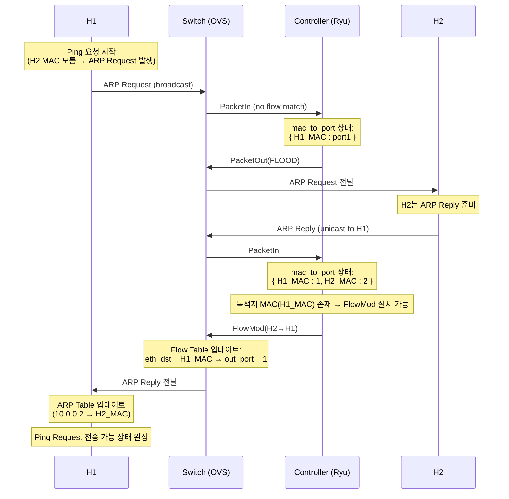

---

## H1 → H2 첫 패킷 시점의 mac_to_port 상태

### 단계 1: 아무 트래픽도 없었을 때

```python
self.mac_to_port = {}

```

- 스위치 dpid=1 기준

```python
self.mac_to_port[1]  # 존재하지도 않음

```

---

### 단계 2: H1 이 H2 로 ping 시도 → 먼저 ARP Request 전송

- H1 이 `10.0.0.2`로 ping 을 보내려 하면, H2 의 MAC 을 모르기 때문에 먼저 **ARP Request** 를 브로드캐스트
- 이 ARP Request 프레임이 스위치 s1 에 도착하면
    - `in_port = 1` (H1 이 연결된 포트)
    - `src = H1_MAC`
    - `dst = ff:ff:ff:ff:ff:ff` (브로드캐스트)
- 컨트롤러의 `_packet_in_handler` 에서 수행

```python
self.mac_to_port.setdefault(dpid, {})
self.mac_to_port[1][H1_MAC] = 1

```

- 이 시점의 `mac_to_port` 상태
    - **알고 있는 것**
        - H1_MAC 은 포트 1에서 들어온다
    - **모르는 것**
        - H2_MAC, H2 가 어디 포트에 있는지 모름

```python
mac_to_port = {
    1: {
        H1_MAC: 1
    }
}

```

- `dst`(H2_MAC)가 mac_to_port 에 없으니
    - 스위치는 이 ARP Request 를 FLOOD(브로드캐스트)로 뿌리고,
    - **FlowMod 도 아직 설치 못함** (어디로 보내야 할지 모름)

```python
if dst in mac_to_port[1]:
    # False
    # ⇒ out_port = FLOOD

```

---

## H2 → ARP Reply 시점의 mac_to_port 상태 변화

- 이제 브로드캐스트된 ARP Request 를 받은 H2 가 **ARP Reply 를 unicast 로 H1 에게 보냄**

### 단계 3: H2 → ARP Reply 패킷이 s1 에 도착

- ARP Reply 프레임
    - `in_port = 2` (H2 가 연결된 포트)
    - `src = H2_MAC`
    - `dst = H1_MAC`
- 컨트롤러에서 다시 PacketIn 처리

```python
self.mac_to_port.setdefault(dpid, {})
self.mac_to_port[1][H2_MAC] = 2

```

- `mac_to_port` 상태는 다음처럼 변경
    - H1_MAC → port 1
    - H2_MAC → port 2
    - **양쪽 MAC 모두 학습 완료된 상태**

```python
mac_to_port = {
    1: {
        H1_MAC: 1,
        H2_MAC: 2
    }
}

```

---

### 단계 4: 이 시점에서 FlowMod 설치가 가능해짐

- 이제 컨트롤러는 ARP Reply 의 목적지 MAC(H1_MAC)을 보고
    - **H2 → H1 방향 FlowMod** 가 스위치 Flow Table 에 설치

```python
if dst in self.mac_to_port[1]:
    out_port = self.mac_to_port[1][dst]   # = 1
    actions = [OFPActionOutput(1)]
    match = OFPMatch(in_port=2, eth_dst=H1_MAC)
    add_flow(datapath, priority=1, match, actions)

```

---

- **H1 첫 패킷(ARP Request)**
    - H1_MAC 만 학습, H2_MAC 모름
    - FLOOD, FlowMod 설치 불가
    - `mac_to_port[1] = { H1_MAC: 1 }`
- **H2 의 ARP Reply**
    - H2_MAC 도 학습 → H1_MAC, H2_MAC 둘 다 학습
    - 이때부터 **FlowMod(H2→H1)** 설치 가능
    - `mac_to_port[1] = { H1_MAC: 1, H2_MAC: 2 }`

## **FlowMod 명령 발생 시점**

- **목적지 MAC(dst)에 대한 출구 포트(out_port)를 알고 있을 때**
- **목적지 MAC을 가진 패킷이 처음으로 들어왔을 때**

```
dst MAC 이 mac_to_port 테이블에 존재할 때 : 존재여부는 match 로 파악
그 dst로 향하는 패킷이 처음 들어오는 순간 → add_flow()로 FlowMod 설치
 ****
```

---

```python
if dst in self.mac_to_port[dpid]:
    match = parser.OFPMatch(in_port=in_port, eth_dst=dst)
    self.add_flow(datapath, 1, match, actions)

```

## **FlowMod 명령에 따른** Flow Table **설치**

### 1) **ARP Request (H1 → 브로드캐스트)**

- 스위치는 **H1 MAC 을 학습**
- 목적지 MAC = ff:ff:ff:ff:ff:ff → FLOOD 해야 함
- H2 MAC 은 아직 모름
    - FlowMod **명령** 불가
    - **Flow Table 설치 불가**

---

### 2) **ARP Reply (H2 → H1)**

- 스위치는 **H2 MAC 을 학습**
- 목적지 MAC = H1 MAC, 이미 학습된 상태
    - 둘 다 학습됨 (H1_MAC, H2_MAC)
    - 이 순간 조건 충족
        - **이 때 FlowMod(H2 → H1) 명령으로 Flow Table 설치**

```
dst(H1 MAC) in mac_to_port → True

```

---

### 3) **ICMP Echo Request (Ping H1 → H2)**

- 목적지 MAC = H2 MAC
- 스위치는 이미 H2 MAC 학습해 놓았음
    - 조건 충족
    - **이 때 FlowMod(H1 → H2) 명령으로 Flow Table 설치**

```
dst(H2 MAC) in mac_to_port → True

```

---

### 4) **ICMP Echo Reply (H2 → H1)**

- 이미 H1 MAC 학습되어 있음
    - 이때는 첫 패킷이므로 FlowMod(H2 → H1) 설치됨
        - 이미 설치된 경우 건너뜀

---

### 시나리오 : 메시지 관점

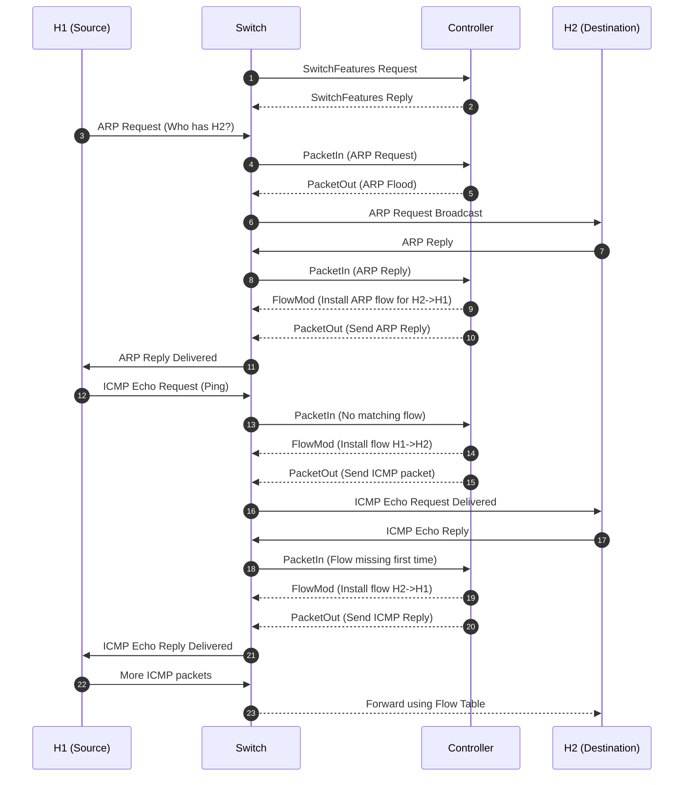

### SimpleSwitch13 구조에서 마지막 FlowMod 메시지

- 마지막 FlowMod(H2 → H1, 19번)는 없어도 되지만,
    - **SimpleSwitch13 구조에서는 생기게 되어 있음**
- Ping 과정에서 이미 **첫 번째 ARP Reply** 처리 시점에 스위치는 아래를 학습
    - H1 MAC → port_X
    - H2 MAC → port_Y
        - ARP Reply 단계에서 이미 **H2 → H1 방향 FlowMod 메시지가 생성됨**
            - H2 → H1 ICMP Reply도 **ARP Reply 때 만들어진 FlowMod 메시지로 충분히 처리 가능**
            - **따라서 마지막 FlowMod(H2 → H1)메시지는 없어도 ICMP Reply 전달 가능**
    - ARP Reply 에서 이미 동일한 목적지 MAC(H1)에 대한 룰이 설치되어 있기 때문, **중복 FlowMod** 임

---

### SimpleSwitch13 컨트롤러는 설치된 FlowTable 내용을 확인하지 않음

- PacketIn 오면 해당 방향 FlowMod가 아직 없다고 간주하고 매번 FlowMod를 설치
    - 컨트롤러는 스위치에 룰이 이미 있는지 검사하지 않고, dst MAC이 학습되어 있으면 FlowMod 메시지로 다시 설치하도록 만들어져 있음
        - 기존 FlowMod 가 있는지 확인
            - 코드 없음
        - 동일 FlowMod 라면 설치하지 않기
            - 코드 없음
    - PacketIn 이 **그 방향의 첫 Unicast 패킷이라고 판단**하면 FlowMod를 또 설치

```python
if dst in self.mac_to_port[dpid]:
    self.add_flow(datapath, 1, match, actions)

```

---

### 시나리오  :  플로우 관점

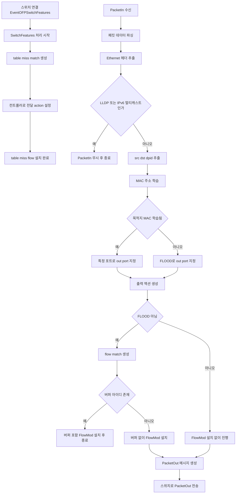

### **시나리오 1, 2: 구현 코드 (simple_switch_13.py)**

```python
from ryu.base import app_manager
from ryu.controller import ofp_event
from ryu.controller.handler import CONFIG_DISPATCHER, MAIN_DISPATCHER
from ryu.controller.handler import set_ev_cls
from ryu.ofproto import ofproto_v1_3
from ryu.lib.packet import packet
from ryu.lib.packet import ethernet

class SimpleSwitch13(app_manager.RyuApp):
    OFP_VERSIONS = [ofproto_v1_3.OFP_VERSION]

    def __init__(self, *args, **kwargs):
        super(SimpleSwitch13, self).__init__(*args, **kwargs)
        self.mac_to_port = {}

    @set_ev_cls(ofp_event.EventOFPSwitchFeatures, CONFIG_DISPATCHER)
    def switch_features_handler(self, ev):
        datapath = ev.msg.datapath
        ofproto = datapath.ofproto
        parser = datapath.ofproto_parser

        print("\n[+] 스위치 연결, table-miss 플로우 설치")

        match = parser.OFPMatch()
        actions = [parser.OFPActionOutput(ofproto.OFPP_CONTROLLER,
                                          ofproto.OFPCML_NO_BUFFER)]
        self.add_flow(datapath, 0, match, actions)

    def add_flow(self, datapath, priority, match, actions, buffer_id=None):
        ofproto = datapath.ofproto
        parser = datapath.ofproto_parser

        inst = [parser.OFPInstructionActions(
            ofproto.OFPIT_APPLY_ACTIONS, actions)]

        if buffer_id:
            mod = parser.OFPFlowMod(
                datapath=datapath, buffer_id=buffer_id, priority=priority,
                match=match, instructions=inst)
        else:
            mod = parser.OFPFlowMod(
                datapath=datapath, priority=priority,
                match=match, instructions=inst)

        print(f"[FlowMod] match={match} → actions={actions}")
        datapath.send_msg(mod)

    @set_ev_cls(ofp_event.EventOFPPacketIn, MAIN_DISPATCHER)
    def _packet_in_handler(self, ev):
        msg = ev.msg
        datapath = msg.datapath
        parser = datapath.ofproto_parser
        ofproto = datapath.ofproto

        in_port = msg.match['in_port']

        pkt = packet.Packet(msg.data)
        eth = pkt.get_protocol(ethernet.ethernet)

        if eth.ethertype == 35020 or eth.dst.startswith("33:33"):
            return

        src = eth.src
        dst = eth.dst
        dpid = datapath.id

        self.mac_to_port.setdefault(dpid, {})

        print(f"\n[PacketIn] dpid={dpid} src={src} dst={dst} in_port={in_port}")

        # MAC Learning
        self.mac_to_port[dpid][src] = in_port
        print(f"  [MAC 학습] {src} → port {in_port}")

        if dst in self.mac_to_port[dpid]:
            out_port = self.mac_to_port[dpid][dst]
        else:
            out_port = ofproto.OFPP_FLOOD

        actions = [parser.OFPActionOutput(out_port)]

        if out_port != ofproto.OFPP_FLOOD:
            match = parser.OFPMatch(in_port=in_port, eth_dst=dst)
            if msg.buffer_id != ofproto.OFP_NO_BUFFER:
                self.add_flow(datapath, 1, match, actions, msg.buffer_id)
                return
            else:
                self.add_flow(datapath, 1, match, actions)

        data = None
        if msg.buffer_id == ofproto.OFP_NO_BUFFER:
            data = msg.data

        out = parser.OFPPacketOut(
            datapath=datapath, buffer_id=msg.buffer_id,
            in_port=in_port, actions=actions, data=data)

        datapath.send_msg(out)

```

---

### 실험 : 시나리오 1

### **Ryu 실행 (터미널 1)**

```bash
ryu-manager simple_switch_13.py

```

- 컨트롤러 화면

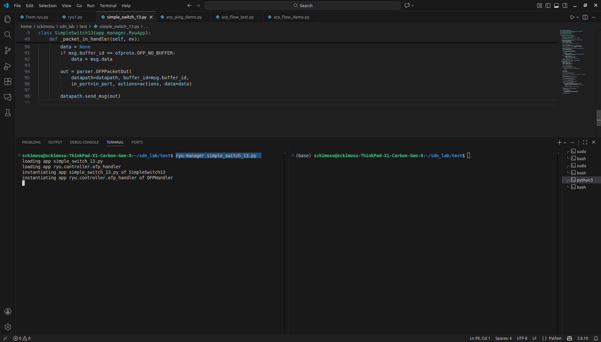

---

### **Mininet 실행 (터미널 2)**

```bash
sudo mn --topo single,3 --mac --switch ovsk,protocols=OpenFlow13 --controller=remote

```

- 미니넷 화면

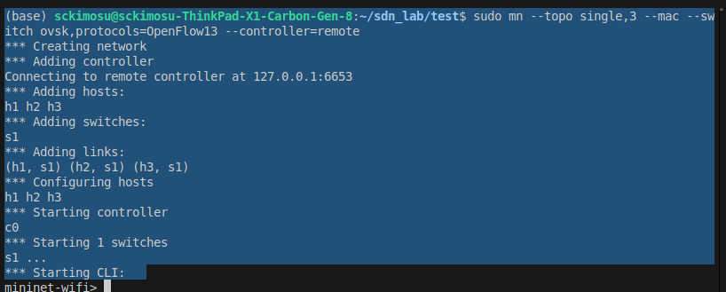

- 컨트롤러 화면

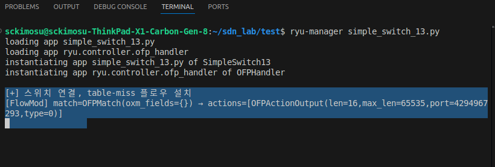

---

### **첫 번째 [FlowMod] 명령**

- **table-miss 플로우 설치**
    - **스위치 연결 시 Ryu 컨트롤러가 자동으로 설치**

```
[+] 스위치 연결, table-miss 플로우 설치
[FlowMod] match=OFPMatch(oxm_fields={}) → actions=[OFPActionOutput(len=16,max_len=65535,port=4294967293,type=0)]

```

---

- match=OFPMatch(oxm_fields={})
    - 빈 매치 조건
        - **모든 패킷에 일치(match everything)**
        - **그 어떤 조건에도 맞지 않는 모든 패킷이 이 rule을 타게 됨**

```python
parser.OFPMatch()

```

---

- actions=[OFPActionOutput(...)]
    - **스위치가 이 FlowMod 에 매칭되는 패킷을 컨트롤러에게 보내라.**
        - 컨트롤러 포트 번호 : 4294967293 = OFPP_CONTROLLER
        - 컨트롤러 특수 포트는 정수로 정의

| OpenFlow 상수 | 실제 값 | 의미 |
| --- | --- | --- |
| **OFPP_CONTROLLER** |  0xfffffffd = 4294967293 (OF 1.3) | 패킷을 컨트롤러로 전송 |
| OFPP_NORMAL | 0xfffa | L2 스위치처럼 동작 |
| OFPP_FLOOD | 0xfffb | 플러딩 |
- **이 패킷을 컨트롤러에게 보내라**

```
port=4294967293  #OFPP_CONTROLLER

```

---

### max_len=65535 (OFPCML_NO_BUFFER)

- **패킷 전체 내용을 잘라내지 말고 전체 패킷을 컨트롤러로 보내라**
    - 스위치에서의 buffer_id 문제 방지하기 위해 PacketOut시 재전송하기 위해 컨트롤러가 사용
    - 매칭되지 않는 모든 패킷은 스위치가 버리지 말고, Ryu 컨트롤러에게 PacketIn으로 보내라.

```
ofproto.OFPCML_NO_BUFFER

```

---

## **Ping 테스트**

```
mininet> h1 ping h2

```

- 미니넷 화면

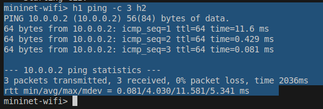

- 컨트롤러 화면

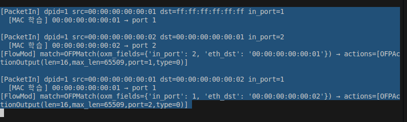

---

## 실험 1 : FlowTable 상태 확인 (ARP 테이블 상태 확인 없음)

- PacketIn 발생
- 출발지 MAC 학습
- 목적지 MAC 검사
    - 있으면
        - 유니캐스트 포워딩 FlowMod 설치
    - 없으면
        - FLOOD
- PacketOut으로 패킷 전달
    - 스위치는 그 FlowMod를 저장하여 이후 트래픽은 하드웨어 레벨에서 처리

### **첫 번째** MAC **학습 : Ryu 컨트롤러**

```
[PacketIn] dpid=1 src=3e:41:43:e4:95:55 dst=ff:ff:ff:ff:ff:ff in_port=1
  [MAC 학습] 3e:41:43:e4:95:55 → port 1

```

---

### 1. PacketIn 발생

```
[PacketIn] dpid=1 src=3e:41:43:e4:95:55 dst=ff:ff:ff:ff:ff:ff in_port=1

```

### dpid=1

- PacketIn이 발생한 스위치 ID = 스위치 1

### src=3e:41:43:e4:95:55

- 이 패킷을 보낸 **출발지 호스트의 MAC 주소**
- 처음 등장한 MAC이므로 학습 대상

### dst=ff:ff:ff:ff:ff:ff

- 목적지 MAC = **브로드캐스트**
- **ARP Request** 또는 IPv6 NDP, DHCP 등 브로드캐스트 패킷일 가능성이 높음

### in_port=1

- 이 패킷이 **스위치의 1번 포트에서 들어왔다**는 의미

---

### 2.  PacketIn에서 MAC 학습

```
[MAC 학습] 3e:41:43:e4:95:55 → port 1

```

### 3. 첫 번째 mac_to_port 테이블 기록

- [1] 스위치 1에서 (dpid=1)
    - [2] MAC=3e:41:43:e4:95:55인 ([mac=3e:41:43:e4:95:55])
        - [3] 호스트는 포트 1에 연결되어 있다 ( = 1)
        - 나중에 이 MAC을 목적지로 하는 패킷이 오면 스위치가 컨트롤러에게 올 필요 없이 **port 1으로 직접 포워딩**

```
mac_to_port[dpid=1][mac=3e:41:43:e4:95:55] = 1

```

---

### MAC 학습 구조 : mac_to_port (딕셔너리 형태)

- Ryu **컨트롤러** 내부 구조

```python
self.mac_to_port = {
    1: {
        "3e:41:43:e4:95:55": 1,
        ...
    }
}

```

- **첫 번째 index**
    - 스위치ID (DPID)
- **두 번째 key**
    - MAC 주소
- **value**
    - 들어온 포트 번호

---

### **두 번째** MAC **학습 : Ryu 컨트롤러**

```
[PacketIn] dpid=1 src=f2:09:70:30:d4:d3 dst=3e:41:43:e4:95:55 in_port=2
  [MAC 학습] f2:09:70:30:d4:d3 → port 2

```

- **dpid=1**
    - 스위치 ID 1번이 PacketIn을 보냈다
- **src=f2:09:70:30:d4:d3**
    - 이 패킷을 보낸 호스트의 MAC 주소
    - 즉 **출발 MAC 주소**
- **dst=3e:41:43:e4:95:55**
    - 이 패킷이 도착해야 하는 목적지 MAC 주소
- **in_port=2**
    - 스위치 s1의 **포트 2에서 들어온 패킷 (ARP Reply)**

```
[PacketIn] dpid=1 src=f2:09:70:30:d4:d3 dst=3e:41:43:e4:95:55 in_port=2

```

---

### MAC 학습 메시지

- 스위치 1번에서 MAC 주소 f2:09:70:30:d4:d3 가진 장치는 포트 2에 연결되어 있음을 **Ryu가 학습(mac_to_port 테이블에 기록)**

```
[MAC 학습] f2:09:70:30:d4:d3 → port 2

```

---

### 스위치의 역할

- 패킷을 보고 규칙(Flow Table)이 없으면
    - PacketIn으로 컨트롤러에 전달
- FlowMod를 받으면 규칙을 설치함

### 컨트롤러의 역할

- PacketIn을 보고
    - MAC 주소와 포트를 **학습**
        - 이후 **FlowMod를 설치**
    - 학습(Learning)
        - 스위치가 아니라 **Ryu 컨트롤러의 기능**

---

```
[스위치] -- PacketIn --> [Ryu 컨트롤러]
                                 |
                                 +-- mac_to_port[dpid][src] = in_port  ← 학습
                                 |
                                 +-- (필요하면) FlowMod 설치
                                 |
                    <-- PacketOut --+

```

---

### 두 번째 mac_to_port 테이블 기록

- 스위치 1번(s1)의 포트 2에는 MAC 주소 **f2:09:70:30:d4:d3** 장치가 연결되어 있음 확인
- 다음 패킷을 이 MAC 주소로 보낼 경우
    - 패킷을 스위치 포트 2로 내보내면 됨

```python
mac_to_port[1]["f2:09:70:30:d4:d3"] = 2

```

| 항목 | 의미 |
| --- | --- |
| PacketIn | 스위치가 규칙이 없어 컨트롤러에 패킷 전달 |
| src MAC | 패킷을 보낸 호스트의 MAC |
| in_port | 스위치의 어느 포트에서 들어왔는지 |
| MAC 학습 | Ryu가 mac_to_port 테이블 업데이트 |
| FlowMod | Ryu가 스위치에 규칙을 설치 |
| 스위치 | 학습 하지 않음, 오직 FlowRule 실행 |

---

### **두 번째 [FlowMod]** (Flow Modification)

- **스위치에게 in_port=2 이고 목적지 MAC이 3e:41:43:e4:95:55 이면, port=1 로 포워딩하라**
- 새로운 **Flow Rule(흐름 규칙)**을 Ryu 컨트롤러가 스위치에 설치
    - OpenFlow 메시지 종류 중 하나
    - 스위치 Flow Table을 **추가 / 수정 / 삭제**할 때 사용하는 메시지.

```
[FlowMod] match=OFPMatch(oxm_fields={'in_port': 2, 'eth_dst': '3e:41:43:e4:95:55'})
→ actions=[OFPActionOutput(len=16,max_len=65509,port=1,type=0)]

```

### match 조건

- 스위치의 2번 포트로 들어왔고, 목적지 MAC 주소가 3e:41:43:e4:95:55 인 패킷
    - 이 조건과 **정확히 일치하는 패킷만** 이 룰이 적용

```
{'in_port': 2, 'eth_dst': '3e:41:43:e4:95:55'}

```

---

### actions

- 그 패킷은 1번 포트로 내보내라 (forward)
    - in_port=2 (호스트2)
    - 목적지 MAC = 호스트1
        - out_port = 1 (호스트1 쪽 링크)

```
[OFPActionOutput(port=1)]

```

---

- **ARP Reply (또는 첫 번째 ICMP Ping 응답)를 처리**하는 과정에서 **두 번째 [FlowMod]** 설치
- 패킷 흐름
    - H2가 H1에 ping 응답을 보내려고 함
    - 스위치에 해당 Flow가 없음
        - PacketIn 발생
    - Ryu가 목적지 MAC 3e:41:43:e4:95:55
        - port 1이라고 학습
        - FlowMod로 해당 규칙을 설치
    - 그 뒤에는 동일한 패킷이 와도 스위치가 직접 처리하게 되어 더 이상 PacketIn이 발생하지 않음.

---

```
match = (입력 포트 = 2 AND 목적지 MAC = 3e:41:43:e4:95:55)
action = (1번 포트로 전송)

```

- Flow Rule이 스위치에 추가되었기 때문에 향후 이 조건과 일치하는 모든 패킷은 Ryu에게 올라오지 않고 스위치가 직접 포워딩

---

### **세 번째 [FlowMod]** (Flow Modification) 설치 (h1 → h2 방향)

```
[FlowMod] match={'in_port': 1, 'eth_dst': 'f2:09:70:30:d4:d3'}
→ actions=[OUTPUT:2]

```

- 스위치에 다음 플로우 추가
    - 앞으로 h1→h2 트래픽은 스위치가 직접 처리

| match | action | 설명 |
| --- | --- | --- |
| in_port=1 AND eth_dst=f2:09:70:30:d4:d3 | output:2 | h1 → h2 포워딩 룰 |

---

```
[PacketIn] dpid=1 src=00:00:00:00:00:01 dst=00:00:00:00:00:02 in_port=1
  [MAC 학습] 00:00:00:00:00:01 → port 1
[FlowMod] match=OFPMatch(oxm_fields={'in_port': 1, 'eth_dst': '00:00:00:00:00:02'}) → actions=[OFPActionOutput(len=16,max_len=65509,port=2,type=0)]

```

### **세 번째** MAC **학습 : Ryu 컨트롤러**

```
[PacketIn] dpid=1 src=00:00:00:00:00:01 dst=00:00:00:00:00:02 in_port=1

```

- dpid = 1
    - 스위치 ID (데이터패스 ID)
    - **스위치 s1에서 PacketIn이 발생했다**는 의미.

---

- src = 00:00:00:00:00:01
    - 이 패킷을 보낸 MAC 주소 = **h1**

---

- dst = 00:00:00:00:00:02
    - 목적지 MAC 주소 = **h2**
    - h1이 h2로 가는 프레임을 보냈다.

---

- in_port = 1
    - 이 패킷이 **스위치의 port 1**으로 들어왔다는 의미.

```
00:00:00:00:00:01 (h1) → (port 1) → s1

```

---

### MAC 학습 단계

```
[MAC 학습] 00:00:00:00:00:01 → port 1

```

- Ryu 컨트롤러가 MAC 주소 테이블을 업데이트함

```python
mac_to_port[1]["00:00:00:00:00:01"] = 1

```

- h1(MAC=00:00:00:00:00:01)은 s1의 1번 포트에 연결되어 있다

---

### **세 번째 [FlowMod]** (Flow Modification) 설치 (h1 → h2 방향)

- Ryu가 스위치에 **새로운 Flow entry**를 설치했다는 의미

```
[FlowMod] match=OFPMatch(oxm_fields={'in_port': 1, 'eth_dst': '00:00:00:00:00:02'})
          → actions=[OFPActionOutput(port=2)]

```

---

- match = {'in_port': 1, 'eth_dst': '00:00:00:00:00:02'}
    - 스위치에게 다음 조건을 알려줌
        - 만약 패킷이 port 1에서 들어오고, 목적지 MAC이 00:00:00:00:00:02라면 …
        - 이 조건과 일치하는 패킷은 이제 컨트롤러로 오지 않음.
    - 아래 형태의 패킷
        - 앞으로는 스위치에서 직접 처리됨
        - PacketIn 발생 안 함
        - ping 속도가 빨라짐

```
in_port=1
eth_dst = h2 MAC

```

---

### actions = [Output:2]

- Ryu가 스위치에 전달한 동작
    - 이 매칭 조건을 만족하면 포트 2로 전송해라

```
h1 → s1 → (Flow Table 매칭) → s1의 port 2 → h2 로 전송

```

---

## 실험 2 :**ARP 테이블(h1)과 플로우 테이블(스위치)**

### ARP 테이블 (ARP Cache) :  h1

- 호스트가 상대 MAC 주소를 알아야 IP 패킷을 만들 수 있기 때문에 존재

| 항목 | 설명 |
| --- | --- |
| 저장 위치 | **호스트(h1) 내부 OS (Linux 커널)** |
| 용도 | IP 주소 → MAC 주소 매핑 저장 |
| 작동 계층 | L3 주소(IP)를 **L2 MAC 주소로 변환** |
| 예시 | 10.0.0.2 → 00:00:00:00:00:02 |
| 확인 명령 | `h1 arp -n` 또는 `h1 ip neigh` |
| 만료 시간 | 수십 초~몇 분 후 삭제됨 |

### 로컬 캐시

```
IP 주소 → MAC 주소

```

---

### 플로우 테이블 (Flow Table) : 스위치(OVS)

- 스위치가 어떤 포트로 포워딩해야 하는가를 표현

| 항목 | 설명 |
| --- | --- |
| 저장 위치 | **스위치 (OVS) 내부** |
| 용도 | 패킷이 어떤 포트로 가야 하는지 결정 |
| 작동 계층 | **L2 스위칭 규칙** (MAC 기반) |
| 예시 | in_port=1, eth_dst=h2 → output=2 |
| 확인 명령 | `ovs-ofctl dump-flows s1` |
| 만료 시간 | idle_timeout, hard_timeout 또는 삭제 전까지 유지 |

### **스위치 룰(rule)** 저장

```
in_port + MAC 주소 → output_port

```

---

| 구분 | ARP 테이블 (h1) | Flow Table (스위치) |
| --- | --- | --- |
| 저장 위치 | Host 내부 | Switch 내부 |
| 저장 내용 | IP → MAC | 포트 + MAC → 포트 |
| 역할 | 상대 MAC 주소 찾기 | 프레임 포워딩 |
| 작동 계층 | 3계층(IP)와 2계층(MAC) 사이 | 2계층(MAC switching) |
| 누가 관리? | OS(Linux kernel) | OpenFlow 스위치 (OVS) |
| 누가 업데이트? | ARP 프로토콜 | SDN 컨트롤러(Ryu) |

### ping 과정에서 ARP 테이블과 Flow 테이블

### h1에서 일어나는 일

```
10.0.0.2의 MAC 주소가 무엇인지 모름
→ ARP Request 전송
→ ARP Reply 수신
→ ARP 테이블에 저장

```

### 스위치에서 일어나는 일

```
00:00:00:00:00:01 → port 1 (h1)
00:00:00:00:00:02 → port 2 (h2)
→ FlowMod 설치 (컨트롤러)

```

- 실험 코드
    - monitor_arp_flows.py

```python
#!/usr/bin/python

from mininet.net import Mininet
from mininet.node import RemoteController, OVSKernelSwitch
from mininet.cli import CLI
import time

def monitor_arp_and_flows(h1, s1, ping_proc, interval=0.5):
    """
    h1: Mininet host 객체 (예: h1)
    s1: Mininet switch 객체 (예: s1)
    ping_proc: h1.popen(...) 으로 실행한 ping 프로세스
    interval: 몇 초마다 상태를 확인할지
    """
    last_arp = None
    last_flows = None

    print("\n=== ARP / Flow Table 모니터링 시작 ===\n")

    # ping 프로세스가 끝날 때까지 루프
    while ping_proc.poll() is None:
        # 1) h1의 ARP 테이블
        arp = h1.cmd("arp -n")
        if arp != last_arp:
            print("\n=== [ARP 테이블 변경] h1 ===")
            print(arp.strip())
            last_arp = arp

        # 2) s1의 Flow Table
        flows = s1.cmd("ovs-ofctl dump-flows s1")
        if flows != last_flows:
            print("\n=== [Flow Table 변경 감지] s1 ===")
            print(flows.strip())
            last_flows = flows

        time.sleep(interval)

    print("\n=== ping 종료, 최종 ARP / Flow Table 상태 ===\n")
    # 종료 직후 한 번 더 찍어주기 (선택)
    arp = h1.cmd("arp -n")
    if arp != last_arp:
        print("\n=== [최종 ARP 테이블] h1 ===")
        print(arp.strip())

    flows = s1.cmd("ovs-ofctl dump-flows s1")
    if flows != last_flows:
        print("\n=== [최종 Flow Table] s1 ===")
        print(flows.strip())

def test():
    print("\n=== 네트워크 생성 ===\n")
    net = Mininet(controller=RemoteController, switch=OVSKernelSwitch)

    # 리모트 컨트롤러 (Ryu) 설정
    c0 = net.addController('c0', ip='127.0.0.1', port=6633)

    # 호스트와 스위치 생성
    h1 = net.addHost('h1', ip='10.0.0.1/24')
    h2 = net.addHost('h2', ip='10.0.0.2/24')
    s1 = net.addSwitch('s1')

    # 링크 연결
    net.addLink(h1, s1)
    net.addLink(h2, s1)

    # 네트워크 시작
    net.start()

    print("\n=== (1) 초기 ARP 테이블 확인 (h1) ===\n")
    print(h1.cmd("arp -n"))

    print("\n=== (2) 초기 Flow Table (s1) ===\n")
    print(s1.cmd("ovs-ofctl dump-flows s1"))

    # (3) ping을 백그라운드 프로세스로 실행 (stdout은 여기서 굳이 안 읽어도 됨)
    print("\n=== (3) h1 → h2 ping 실행 (3회) ===\n")
    ping_proc = h1.popen("ping -c 3 10.0.0.2")

    # (4) ping이 도는 동안 ARP / Flow Table 실시간 모니터링
    monitor_arp_and_flows(h1, s1, ping_proc, interval=0.5)

    # (5) 원하면 ping 결과를 한 번 더 실행해서 눈으로 확인 (추가 ping이지만 상관 없다면)
    print("\n=== (5) ping 결과 확인 (추가 1회 실행) ===\n")
    print(h1.cmd("ping -c 1 10.0.0.2"))

    print("\n=== 이제 CLI에서 추가 실험을 해도 됩니다. ===\n")
    CLI(net)
    net.stop()

if __name__ == "__main__":
    test()

```

### **Ryu MAC 학습 → FlowMod 설치 → ARP/Ping 흐름 관찰**

- Mininet 환경 생성 (H1–S1–H2)
- Ryu 컨트롤러와 연결된 OVS 스위치 사용
- H1 → H2 로 ping을 보내면서
    - H1 의 ARP 테이블 변화 출력
    - S1 의 Flow Table(ovs-ofctl dump-flows) 변화 출력
- FlowMod(ARP Reply, ICMP Ping) 설치 과정 확인

# ---------------------------------------------------

# monitor_arp_and_flows() 함수

# ---------------------------------------------------

```python
def monitor_arp_and_flows(h1, s1, ping_proc, interval=0.5):

```

- ping 이 보내지는 동안
- h1 의 ARP 테이블과 s1 의 OpenFlow Flow Table 의 변화를 **실시간으로 출력**
    - 언제 ARP 가 생기는지, 언제 FlowMod 가 설치되는지 자동 감지

---

### 1) 이전 상태를 저장하기 위한 변수

```python
last_arp = None
last_flows = None

```

### 2) ping 프로세스가 끝날 때까지 반복

- poll() → 프로세스가 살아있으면 None 을 반환
    - ping 이 끝날 때까지 계속 체크하는 구문

```python
while ping_proc.poll() is None:

```

---

### 3) ARP 테이블 변화 감지

- H1 의 ARP 테이블을 읽음
    - 이전 값과 다르면
        - 실제로 ARP learning 이 발생한 상태
- ARP Reply 도착 순간 ARP 테이블이 변하므로 이 출력이 뜸

```python
arp = h1.cmd("arp -n")
if arp != last_arp:
    print("\n=== [ARP 테이블 변경] h1 ===")
    print(arp.strip())
    last_arp = arp

```

---

### 4) Flow Table 변화 감지

- S1 내부의 OVS Flow Table 을 읽음
    - 이전과 다르면 FlowMod 설치됨 의미
        - SimpleSwitch13 이 FlowMod 를 설치한 순간 추적

```python
flows = s1.cmd("ovs-ofctl dump-flows s1")
if flows != last_flows:
    print("\n=== [Flow Table 변경 감지] s1 ===")
    print(flows.strip())
    last_flows = flows

```

---

# ---------------------------------------------------

# test() 함수

# ---------------------------------------------------

### 1) Mininet 토폴로지 생성

- RemoteController
    - Ryu 와 TCP 연결
- OVSKernelSwitch
    - 실제 OVS 커널 모듈 기반 스위치

```python
net = Mininet(controller=RemoteController, switch=OVSKernelSwitch)

```

---

### 2) 컨트롤러 등록

- Ryu SimpleSwitch13 을 이 포트에서 실행 중

```python
c0 = net.addController('c0', ip='127.0.0.1', port=6633)

```

---

### 3) 호스트/스위치 추가

```python
h1 = net.addHost('h1', ip='10.0.0.1/24')
h2 = net.addHost('h2', ip='10.0.0.2/24')
s1 = net.addSwitch('s1')

```

---

### 4) 링크 연결

- H1—S1—H2 구조

```python
net.addLink(h1, s1)
net.addLink(h2, s1)

```

---

### 5) 네트워크 시작

- OVS 스위치가 Ryu 컨트롤러에 접속함
    - 여기서 Ryu 가 SwitchFeatures/FlowMod(table-miss) 설치

```python
net.start()

```

---

### 6) 초기 상태 출력

- Flow Table 이 비어있음을 확인

```python
print(h1.cmd("arp -n"))
print(s1.cmd("ovs-ofctl dump-flows s1"))

```

---

### 7) ping 비동기 실행

- h1.popen()은 백그라운드에서 ping 실행
    - Mininet의 Host 객체가 ping 명령을 **별도의 프로세스(subprocess)** 로 실행하고 그 프로세스를 제어할 수 있는 핸들(popen 객체)을 반환
    - **실행 중에도 Python 코드가 계속 진행됨**
        - `poll()`, `wait()`, `stdout` 등을 사용해서 프로세스를 관찰할 수 있음
        - stdout : 여기서 사용하지 않음
        - ping 이 즉시 시작되지만 Python 은 ping 끝날 때까지 기다리지 않음
            - 바로 다음 코드가 실행됨

```python
ping_proc = h1.popen("ping -c 3 10.0.0.2")

```

---

### 8) 실시간 ARP/FlowTable 모니터링 시작

- ARP, FlowMod 설치되는 순간 콘솔 출력

```python
monitor_arp_and_flows(h1, s1, ping_proc, interval=0.5)

```

---

### 9) CLI 열기

- 직접 mininet 하에 명령어 입력 가능

```python
CLI(net)

```

---

# ---------------------------------------------------

# 스크립트 실행 흐름

# ---------------------------------------------------

### 첫 Ping 전 H1 상태

- ARP 테이블
    - 비어 있음
- Flow Table
    - table-miss 룰만 있음

### Ping 도중

### [1] ARP Request 전송

- FlowMod 없음
- FlowTable 변화 없음

### [2] ARP Reply 도착

- FlowMod (H2→H1) 설치
- Flow Table 변경 출력

### [3] Ping (ICMP Echo Request)

- FlowMod (H1→H2) 설치
- FlowTable 변경 출력

### [4] ICMP Echo Reply

- 필요하면 또 FlowMod(H2→H1) 재설치

---

### 실행화면


### 실행화면

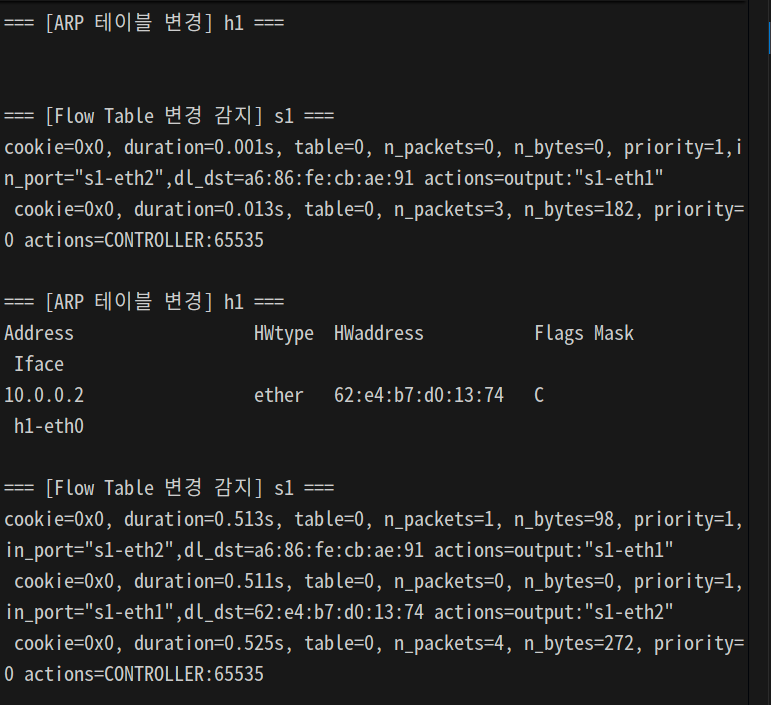

### **ARP 프로토콜 출력**

- h1이 10.0.0.2(h2)의 MAC 주소를 새로 학습했다는 뜻
    - **IP 10.0.0.2 → MAC ea:07:63:36:4a:06**
    - h1은 이제 h2의 MAC 주소를 알고 있기 때문에 이후 ICMP ping은 직접 MAC 주소로 이더넷 프레임을 구성해서 보냄

```
=== [ARP 테이블 변경] h1 ===
Address                  HWtype  HWaddress           Flags Mask            Iface
10.0.0.2                 ether   ea:07:63:36:4a:06   C                     h1-eth0

```

- **Address = 10.0.0.2**
    - h1이 찾고자 했던 대상의 **IP 주소**, 즉 h2의 IP.
    - 핑을 보내기 위해
    - 이 IP 주소에 대한 MAC 주소가 필요하므로 ARP가 사용됨.

```
h1 → 10.0.0.2

```

---

- **HWtype = ether**
    - **하드웨어 타입: Ethernet(1)**
    - MAC 주소 기반의 Ethernet 네트워크임

---

- **HWaddress = ea:07:63:36:4a:06**
    - **10.0.0.2의 실제 MAC 주소**, 즉 **h2의 MAC 주소**
    - 이 주소는 h2가 ARP reply에서 알려준 MAC 주소
        - 이 정보를 h1이 자신의 ARP cache에 저장함

```
ARP Reply:
10.0.0.2 is at ea:07:63:36:4a:06

```

---

- **Flags = C**
    - **C = COMPLETE**
    - ARP entry가 완전히 채워졌음
    - `C` 완전히 학습 완료된 상태.

---

- **Iface = h1-eth0**
    - 이 ARP 정보는 **h1의 eth0 인터페이스를 통해** 배워진 것임
    

---

### ARP 테이블과 Flow Table

- ARP 테이블
    - **호스트(h1 OS 내부)가 관리**
- Flow Table
    - **OVS 스위치(s1)가 관리**
- h1(10.0.0.1)이 h2(10.0.0.2)에게 ping 보내려고 했음
- 목적지 MAC 주소를 모름 → ARP 요청 브로드캐스트
- h2가 ARP Reply로 자신의 MAC을 알려줌
- h1은 아래처럼 ARP 테이블에 기록
    - 이제 ping(ICMP)을 정상적으로 전송할 수 있게 됨
    - 플로우 테이블에도 h1→h2 방향의 FlowMod가 설치됨

```
10.0.0.2  →  ea:07:63:36:4a:06

```

| 계층 | 관리 주체 | 역할 |
| --- | --- | --- |
| L2 ARP Cache | 호스트 OS | IP → MAC 매핑 저장 |
| OpenFlow Flow Table | 스위치 + Ryu | 패킷 포워딩 룰 저장 |

---

### 실행화면

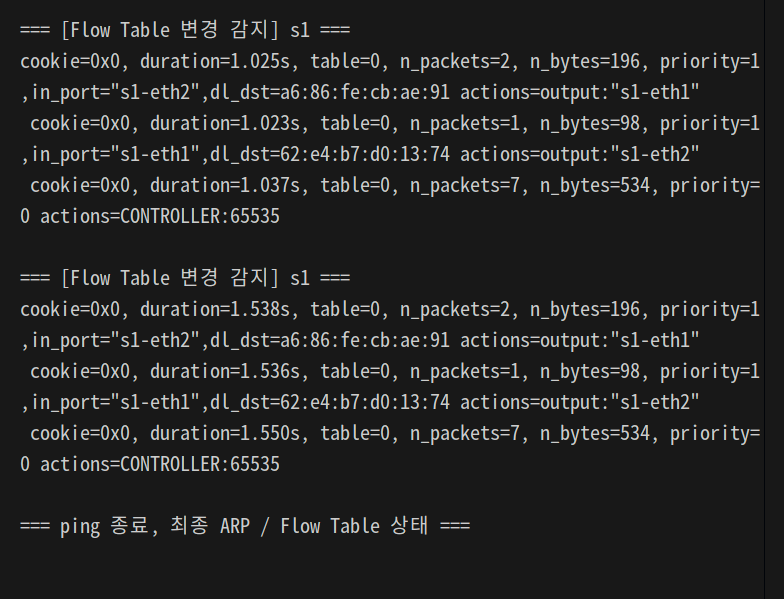

### 실행화면

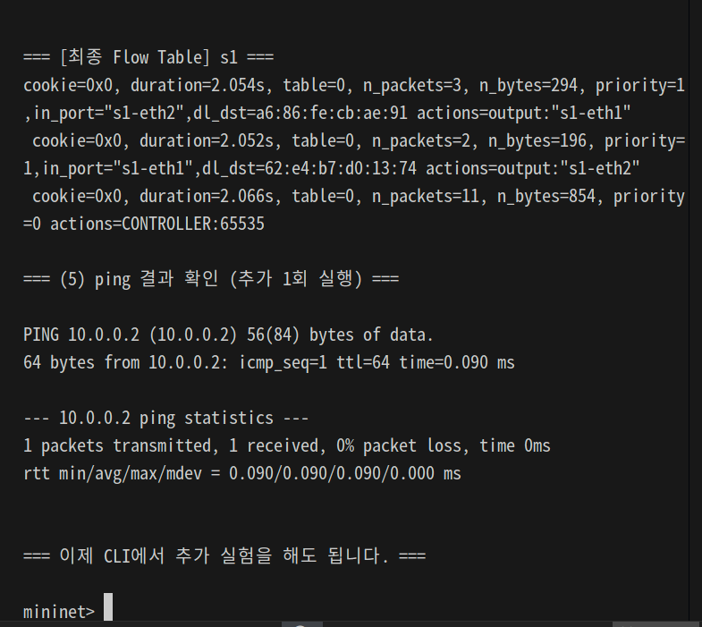
