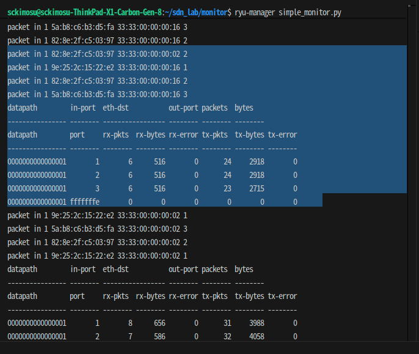
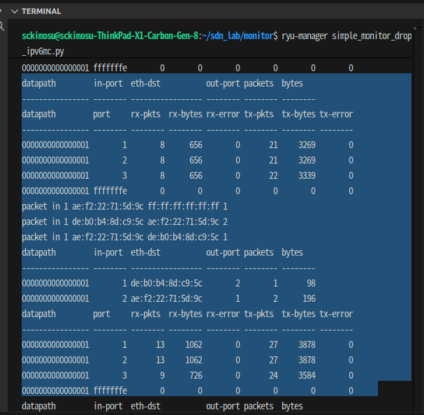
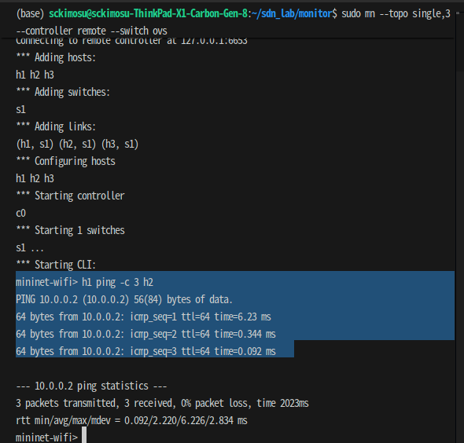
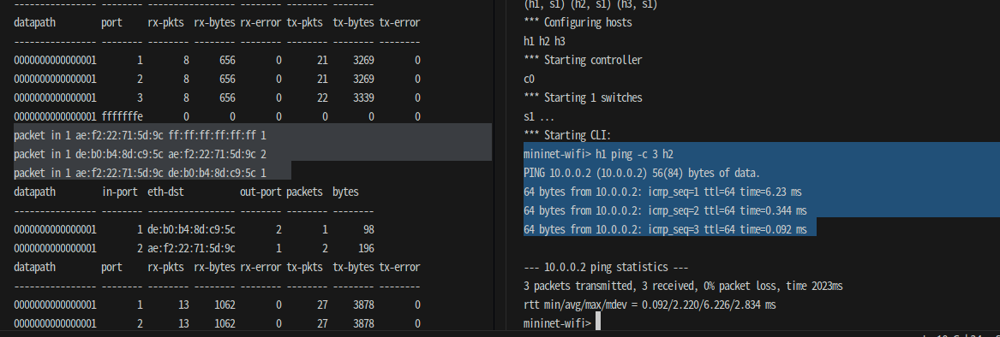

# Packet in : ARP 요청/응답과 Ping 요청 학습

---

# SimpleMonitor


```python
from operator import attrgetter

from ryu.app import simple_switch_13
from ryu.controller import ofp_event
from ryu.controller.handler import MAIN_DISPATCHER, DEAD_DISPATCHER
from ryu.controller.handler import set_ev_cls
from ryu.lib import hub

class SimpleMonitor(simple_switch_13.SimpleSwitch13):

    def __init__(self, *args, **kwargs):
        super(SimpleMonitor, self).__init__(*args, **kwargs)
        self.datapaths = {}
        self.monitor_thread = hub.spawn(self._monitor)

    @set_ev_cls(ofp_event.EventOFPStateChange,
                [MAIN_DISPATCHER, DEAD_DISPATCHER])
    def _state_change_handler(self, ev):
        datapath = ev.datapath
        if ev.state == MAIN_DISPATCHER:
            if not datapath.id in self.datapaths:
                self.logger.debug('register datapath: %016x', datapath.id)
                self.datapaths[datapath.id] = datapath
        elif ev.state == DEAD_DISPATCHER:
            if datapath.id in self.datapaths:
                self.logger.debug('unregister datapath: %016x', datapath.id)
                del self.datapaths[datapath.id]

    def _monitor(self):
        while True:
            for dp in self.datapaths.values():
                self._request_stats(dp)
            hub.sleep(10)

    def _request_stats(self, datapath):
        self.logger.debug('send stats request: %016x', datapath.id)
        ofproto = datapath.ofproto
        parser = datapath.ofproto_parser

        req = parser.OFPFlowStatsRequest(datapath)
        datapath.send_msg(req)

        req = parser.OFPPortStatsRequest(datapath, 0, ofproto.OFPP_ANY)
        datapath.send_msg(req)

    @set_ev_cls(ofp_event.EventOFPFlowStatsReply, MAIN_DISPATCHER)
    def _flow_stats_reply_handler(self, ev):
        body = ev.msg.body

        self.logger.info('datapath         '
                         'in-port  eth-dst           '
                         'out-port packets  bytes')
        self.logger.info('---------------- '
                         '-------- ----------------- '
                         '-------- -------- --------')
        for stat in sorted([flow for flow in body if flow.priority == 1],
                           key=lambda flow: (flow.match['in_port'],
                                             flow.match['eth_dst'])):
            self.logger.info('%016x %8x %17s %8x %8d %8d',
                             ev.msg.datapath.id,
                             stat.match['in_port'], stat.match['eth_dst'],
                             stat.instructions[0].actions[0].port,
                             stat.packet_count, stat.byte_count)

    @set_ev_cls(ofp_event.EventOFPPortStatsReply, MAIN_DISPATCHER)
    def _port_stats_reply_handler(self, ev):
        body = ev.msg.body

        self.logger.info('datapath         port     '
                         'rx-pkts  rx-bytes rx-error '
                         'tx-pkts  tx-bytes tx-error')
        self.logger.info('---------------- -------- '
                         '-------- -------- -------- '
                         '-------- -------- --------')
        for stat in sorted(body, key=attrgetter('port_no')):
            self.logger.info('%016x %8x %8d %8d %8d %8d %8d %8d',
                             ev.msg.datapath.id, stat.port_no,
                             stat.rx_packets, stat.rx_bytes, stat.rx_errors,
                             stat.tx_packets, stat.tx_bytes, stat.tx_errors)

```

---

### 실험

### Ryu 컨트롤러 실행

- `simple_monitor.py` 파일을 Ryu로 실행

```
ryu-manager simple_monitor.py

```

- 터미널에 아래와 같은 로그가 출력되면 정상

```
loading app simple_monitor.py
instantiating app simple_monitor.SimpleMonitor

```

---

### Mininet 실행 (기본 스위치 topo)

- 다른 터미널을 열고

```
sudo mn --topo single,3 --controller remote --switch ovs

```

- Mininet이 3호스트 + 1스위치 구조로 실행
    - 스위치가 Ryu에 연결될 때 Ryu 로그

```
register datapath: 0000000000000001

```

---

### 트래픽 생성해서 모니터링 확인

- Mininet CLI에서

### 핑 테스트

```
mininet> h1 ping h2

```

### 대량 트래픽

```
mininet> h1 iperf -s &
mininet> h2 iperf -c h1

```

---

### Ryu 로그에서 Flow & Port 통계 확인

- 10초마다 자동 출력

### Flow Stats 출력

```
datapath         in-port eth-dst           out-port packets  bytes
---------------- -------- ----------------- -------- -------- --------
0000000000000001        1 00:00:00:00:00:02        2       10     6000

```

### Port Stats 출력

```
datapath         port   rx-pkts rx-bytes rx-error tx-pkts tx-bytes tx-error
---------------- ------ ------- -------- -------- -------- -------- --------
0000000000000001      1      12     7200        0      15     9000        0

```

---

| 기능 | 설명 |
| --- | --- |
| 스위치 자동 등록 | Ryu에 연결될 때 자동 등록 |
| 10초마다 통계 요청 | Flow + Port stats |
| Flow Stats 출력 | 각 플로우의 packet/byte 수 확인 |
| Port Stats 출력 | 각 포트의 트래픽 및 에러 확인 |
| 학습 스위치 기능 포함 | simple_switch_13 기반 |

---

- 화면



---

### Packet-in 로그

- 목적지 MAC : `33:33:00:00:00:xx`
    - **멀티캐스트 IPv6 MAC 주소**
    - IPv6의 **ND(Neighbor Discovery)** 트래픽이 흐르고 있음

```
packet in 1 82:8e:2f:c5:03:97 33:33:00:00:00:02 2
packet in 1 9e:25:2c:15:22:e2 33:33:00:00:00:16 1
packet in 1 82:8e:2f:c5:03:97 33:33:00:00:00:16 2
packet in 1 5a:b8:c6:b3:d5:fa 33:33:00:00:00:16 3

```

- 형식

```
packet in [IN_PORT] [SRC_MAC] [DST_MAC] [OUT_PORT]

```

| 항목 | 설명 |
| --- | --- |
| `packet in 1` | 스위치의 **1번 포트**에서 패킷이 들어옴 |
| `82:8e:2f:c5:03:97` | 출발지 MAC 주소 |
| `33:33:00:00:00:02` | 목적지 MAC 주소 |
| `2` | SimpleSwitch13이 학습한 결과 패킷을 보낼 포트 |
- `33:33:00:00:00:02`
    - IPv6 All-Routers Multicast
- `33:33:00:00:00:16`
    - IPv6 MLD Multicast
        - **Linux 호스트가 기본적으로 내는 IPv6 관련 패킷**

---

### Flow Stats 출력 없음

- `datapath         in-port ...`
    - 실제 플로우 출력이 비어 있음
        - **정상**

---

### Port Stats 로그 분석

- **IPv6 멀티캐스트 패킷이 packet-in 으로 들어온 정상 동작 로그**
- Port Stats는 균일하고 에러 없이 정상 동작
- `fffffffe` 포트
    - OVS 스위치 LOCAL 포트
    - 트래픽이 없어도 정상

```
datapath         port     rx-pkts  rx-bytes rx-error tx-pkts  tx-bytes tx-error
---------------- -------- -------- -------- -------- -------- -------- --------
0000000000000001        1        6      516        0       24     2918        0
0000000000000001        2        6      516        0       24     2918        0
0000000000000001        3        6      516        0       23     2715        0
0000000000000001 fffffffe        0        0        0        0        0        0

```

### 포트

| 포트번호 | 의미 |
| --- | --- |
| `1, 2, 3` | 호스트들이 연결된 실제 OVS 포트 |
| `fffffffe` (`OFPP_LOCAL`) | OVS 내부 local 인터페이스 |
- 각 호스트 포트(1,2,3)는 동일하게 패킷 6개 수신
    - 멀티캐스트 패킷이 브로드캐스트처럼 퍼짐
- 송신 패킷은 약 23~24개
    - 내부 스위치가 FLOOD한 결과
- 모든 에러값이 0
    - 링크는 정상

```
0000000000000001        1        6      516        0       24     2918        0

```

| 항목 | 값 | 의미 |
| --- | --- | --- |
| rx-pkts | 6 | 1번 포트로 받은 패킷 수 |
| rx-bytes | 516 | 수신된 바이트 |
| rx-error | 0 | 손실/에러 없음 |
| tx-pkts | 24 | 1번 포트로 전송한 패킷 수 |
| tx-bytes | 2918 | 전송한 바이트 수 |
| tx-error | 0 | 송신 오류 없음 |

---

## OFPP_LOCAL 포트

---

- **호스트 OS와 OVS 브리지 간의 연결**
    - 이 IP는 **LOCAL 포트에 바인딩**
        - OVS 스위치는 자신의 LOCAL 포트를 통해
            - ping 응답
            - ARP 처리
            - IP 라우팅
            - 관리 트래픽 등을 수행

```
$ ip addr add 10.0.0.1/24 dev br0

```

---

- **컨트롤 플레인 트래픽이 LOCAL 포트를 통해 흐름**
    - LLDP
    - STP / RSTP
    - OVSDB 관리 트래픽
    - OVS → Host OS 서비스 트래픽

---

| 기능 | 설명 |
| --- | --- |
| **Host OS와 OVS 브리지 연결** | 브리지 IP가 이 포트로 바인딩 |
| **OVS의 내부 제어 트래픽 처리** | LLDP, ARP, 관리 패킷 |
| **OpenFlow 룰에서 LOCAL 포트로 출력 가능** | `output:LOCAL` |
| **물리적 포트가 아니라 논리적 포트** | 브리지 인터페이스 자체 |
| **일반 실험에서는 패킷 수가 0이 정상** | Host ↔ OVS 트래픽이 없으면 비어있음 |

---

- 컨트롤러 화면



- 미니넷 화면



- 화면



---

## `packet in` : **ARP 요청/응답**, **ICMP Ping 요청 학습 과정**

```
packet in 1 ae:f2:22:71:5d:9c ff:ff:ff:ff:ff:ff 1
packet in 1 de:b0:b4:8d:c9:5c ae:f2:22:71:5d:9c 2
packet in 1 ae:f2:22:71:5d:9c de:b0:b4:8d:c9:5c 1

```

### `packet in`형식

```
packet in [in_port] [src_mac] [dst_mac] [out_port]

```

---

### 첫 번째 `packet in`

- **h1  → broadcast (ARP Request)**
- h1의 MAC
    - `ae:f2:22:71:5d:9c`
- 목적지
    - **브로드캐스트 MAC (ff:ff:ff:ff:ff:ff)**
- 스위치에서 받은 포트
    - **1번**
- 스위치가 플러딩(FLOOD)하려는 포트
    - **1**

```
packet in 1 ae:f2:22:71:5d:9c ff:ff:ff:ff:ff:ff 1

```

### 발생 이유

- h1이 ping 보내기 전 **ARP Request는 항상 broadcast**
    - 그래서 목적지 MAC이 `ff:ff:ff:ff:ff:ff`

```
"10.0.0.2 누구 MAC주소?" (ARP 요청)

```

---

### 두 번째 `packet in`

- **h2 → h1**
    - **ARP Reply**
- h2 MAC
    - `de:b0:b4:8d:c9:5c`
- h1 MAC
    - `ae:f2:22:71:5d:9c`
- 스위치에서 받은 포트
    - 1 (ARP Reply 도 여전히 스위치로 들어오므로)
- 스위치가 내보내려는 포트
    - **2번**

```
packet in 1 de:b0:b4:8d:c9:5c ae:f2:22:71:5d:9c 2
```

### ARP Reply 발생 이유

- h1이 "너 누구야?"라고 물었기 때문에 h2가 대답
- SimpleSwitch13이 학습한 MAC 테이블에 기반하여 스위치는 이 패킷을 h1이 있는 포트로 전달

```
"나 10.0.0.2 는 MAC = de:b0:b4:8d:c9:5c 이야"

```

---

### 세 번째 `packet in`

- **h1 → h2**
    - **ICMP Echo Request = ping**
- src MAC
    - h1 = `ae:f2:22:71:5d:9c`
- dst MAC
    - h2 = `de:b0:b4:8d:c9:5c`
- in_port
    - 1 (h1이 연결된 포트)
- out_port
    - 1
        - out_port가 **1**로 보이는 이유는 출력되는 로그가 출력 포맷 때문
        - SimpleSwitch13은 실제로 FLOOD 또는 학습된 포트 번호로 정상 전달

```
packet in 1 ae:f2:22:71:5d:9c de:b0:b4:8d:c9:5c 1

```

---

### ping 과정

| 단계 | 설명 | MAC |
| --- | --- | --- |
| 1 | ARP Request | ff:ff:ff:ff:ff:ff |
| 2 | ARP Reply | h2 → h1 |
| 3 | ICMP Echo Request #1 | h1 → h2 |
| 4 | ICMP Echo Reply #1 | h2 → h1 |
| 5 | ICMP Echo Request #1 | h1 → h2 |

---

### packet-in

| 로그 | 의미 |
| --- | --- |
| `ae:f2:22:71:5d:9c → ff:ff:ff:ff:ff:ff` | **ARP 요청** |
| `de:b0:b4:8d:c9:5c → ae:f2:22:71:5d:9c` | **ARP 응답** |
| `ae:f2:22:71:5d:9c → de:b0:b4:8d:c9:5c` | **Ping(ICMP) 요청** |

---

## Flow Stats 출력

---

### 포맷

```
datapath   in-port  eth-dst       out-port  packets  bytes

```

| 항목 | 의미 |
| --- | --- |
| datapath | 스위치 ID |
| in-port | 해당 플로우가 매칭되는 입력 포트 번호 |
| eth-dst | 목적지 MAC 주소 |
| out-port | 목적지 MAC 으로 패킷을 내보낼 포트 번호 |
| packets | 이 룰을 통해 전달된 패킷 수 |
| bytes | 이 룰을 통해 전달된 총 바이트 수 |

---

```
0000000000000001        1 de:b0:b4:8d:c9:5c        2        1       98
0000000000000001        2 ae:f2:22:71:5d:9c        1        2      196

```

### 첫 번째 플로우

- **스위치 1번의 port 2에 de:b0:b4:8d:c9:5c(MAC=h2)이 연결되어 있음**
    - h1에서 h2로 간 패킷이 1개, 총 98바이트가 이 Flow로 처리됨

```
0000000000000001        1  de:b0:b4:8d:c9:5c        2        1       98

```

### 생성 시점

- h1 → h2 로 ping 을 보낼 때 생김
    - Echo Request 1개가 이 flow entry를 통해 전달됨

| 필드 | 의미 |
| --- | --- |
| datapath = 1 | OVS 스위치 ID |
| in-port = 1 | h1 이 연결된 포트 |
| eth-dst = de:b0:b4:8d:c9:5c | 목적지 = h2 MAC |
| out-port = 2 | h2 가 연결된 포트 |
| packets = 1 | h1 → h2 으로 간 패킷 1개가 match됨 |
| bytes = 98 | 이 패킷 크기 98 바이트 |

---

### 두 번째 플로우

- **스위치 1번의  port 1에 ae:f2:22:71:5d:9c(MAC=h1)이 연결되어 있음**
    - h2에서 h1로 간 패킷이 2개, 총 196 바이트가 이 Flow로 처리됨

```
0000000000000001        2  ae:f2:22:71:5d:9c        1        2      196

```

| 플로우 | 의미 |
| --- | --- |
| in-port 1, dst=h2 → out 2 | **h1 → h2** 로 향하는 트래픽 |
| in-port 2, dst=h1 → out 1 | **h2 → h1** 로 향하는 트래픽 |

---

## **ping -c 3 실행 시 발생하는 packet-in 개수 = 5개 ~ 6개**

- **ICMP Echo Reply(2, 3번째)에서** **packet-in이 발생하지 않음**

### SimpleSwitch13의 규칙

- 목적지 MAC을 모르면 → Packet-In
    - MAC 학습 후에는 → Packet-In 안 함 (스위치가 직접 포워딩)
- Echo Reply도 첫 번째만 Packet-In
    - 나머지 Echo Reply는 Flow Rule 에 의해 처리됨
    - Packet-In이 발생하지 않음

---

### h1 → h2 방향 (ARP + Ping Request)

| 번호 | 패킷 | packet-in | 이유 |
| --- | --- | --- | --- |
| 1 | ARP Request | 발생 | broadcast |
| 2 | ARP Reply | 발생 | unknown MAC |
| 3 | ICMP Echo Request (1st) | 발생 | unknown MAC |
| 5 | ICMP Echo Request (2nd) | 발생하지 않음 | MAC learned |
| 7 | ICMP Echo Request (3rd) | 발생하지 않음 | MAC learned |

---

### 2. h2 → h1 방향 (Ping Reply)

| 번호 | 패킷 | packet-in | 이유 |
| --- | --- | --- | --- |
| 4 | ICMP Echo Reply (1st) | 발생 | unknown MAC |
| 6 | ICMP Echo Reply (2nd) | 발생하지 않음 | MAC learned |
| 8 | ICMP Echo Reply (3rd) | 발생하지 않음 | MAC learned |

---

## 필수 packet-in 발생

```
필수 packet-in:
1) ARP Request
2) ARP Reply
3) 1st Ping Request
4) 1st Ping Reply

```

## 추가 packet-in 발생

- 추가로, SimpleSwitch13는
    - **IPv6 NDP나 멀티캐스트 주소(33:33:xx)** 패킷도 Packet-In으로 올림
    - Mininet 환경에서는 거의 항상 추가로 **1개 ~ 2개 더 발생**
    - 그래서 실제로 보이는 개수가 최종 packet-개
- SimpleSwitch13는 NDP/IPv6 멀티캐스트 패킷도 Packet-In 시킴
    - Mininet 환경에서는 Linux 호스트가 IPv6 NDP 메시지를 자동으로 발송
    - 이 패킷들이 **추가 Packet-In** 을 발생시키며 Ping Reply의 일부처럼 보였음

```
33:33:00:00:00:16
33:33:00:00:00:02

```

---

### **총** packet-in 발생 수 : **5 ~ 6개**

| 패킷 종류 | packet-in 발생 수 |
| --- | --- |
| ARP Request | 1 |
| ARP Reply | 1 |
| 1st Ping Request | 1 |
| 1st Ping Reply | 1 |
| IPv6 멀티캐스트(NDP 등) | 1~2개 (환경에 따라) |

### **H1 → H2 경로가 ARP로 이미 학습되어 있는데도, 첫 번째 Ping Request에서 Packet-In 발생 이유**

- ARP로 MAC → 포트 매핑이 학습되어도,
    - **스위치에 ICMP(Ping)에 대한 Forwarding Action Flow가 존재하지 않기 때문에**,
    - 첫 번째 Ping 패킷은 스위치가 스스로 처리할 수 없어 **controller에게 Packet-In 이벤트 발생**
- ARP는 **MAC table**만 생성
    - 하지만 Ping(ICMP)은 **Forwarding Action flow table 항목 필요**
        - 이 Flow가 없으므로 **첫 번째 Ping은 Packet-In** 됨
        - 컨트롤러가 Flow를 설치하면 이후 Ping은 Packet-In이 발생하지 않음

---

### ARP가 해주는 것

- ARP Request/Reply로 인해 스위치는 이 정보만 알게 됨
    - **MAC Table**이 채워짐.

```
IP(H2) → MAC(H2)
MAC(H2) → Switch Port

```

### ARP가 해주지 않는 것

- ARP는 다음을 해주지 않음
    - ICMP 패킷을 어떻게 포워딩할지에 대한 **Flow Rule 설치**
    - End-to-End **경로(flow path) 설정**
    - 스위치 간의 forwarding rule provisioning
- 따라서 Ping은 별도의 Flow가 필요함.

---

## **1st Ping에서만 Packet-In 발생**

### 스위치에는 기본적으로 Ping(ICMP)에 대한 Flow가 존재하지 않음

- 스위치는 패킷을 받으면 Flow Table을 lookup 함
    - ARP 패킷은 미리 정의된 table-miss rule 또는 ARP 전용 rule로 처리됨
        - MAC learning 가능
    - 하지만 **ICMP 패킷에 대한 Rule이 없음**
        - 그래서 스위치는 해당 Ping을 **Controller에게 Packet-In** 보냄

### Controller는 Packet-In을 받고 새로운 Flow Rule 설치

- 컨트롤러는 Packet-In을 보고 다음 수행
    - H2의 MAC주소가 어디로 가야 하는지 확인 (이미 ARP에서 학습됨)
    - ICMP forwarding rule을 각 스위치에 설치

### 이후 Ping은 Packet-In 없이 정상 Forwarding

- Flow가 설치되면 Ping은 스위치에서 바로 처리되기 때문에 더 이상의 Packet-In은 발생하지 않음.

---

## **흐름**

- ARP로 경로(H1→H2 포트)는 학습되었지만, **ICMP 패킷을 처리할 Flow Rule이 없기 때문에 1st Ping은 Packet-In이 발생**

```
[ARP Completed] → Switch knows MAC(H2) on port X
       ↓
[1st Ping Arrives]
       ↓
Flow table lookup → No ICMP flow exists
       ↓
Packet-In to Controller
       ↓
Controller installs ICMP forward flow
       ↓
[2nd Ping] → Forwarding OK (no Packet-In)

```

---
