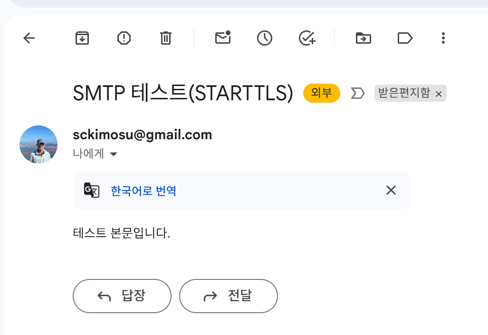

# SMTP 프로토콜

- SMTP(Simple Mail Transfer Protocol)
    - 인터넷에서 **전자메일을 송신하기 위한 표준 프로토콜**
    - **발신 측 메일 서버 → 수신 측 메일 서버**로 메일을 전달하는 역할을 하며, 최종적으로 수신자의 메일 클라이언트(POP3/IMAP)가 메일을 가져가 읽을 수 있도록 함.
        - SMTP : **메일 전송을 담당하는 프로토콜**
        - POP3/IMAP : **메일 수신/읽기용 프로토콜**
            - 현재는 보안 강화를 위해 **SMTP + 인증 + 암호화**가 기본적으로 사용.

---

## SMTP

- **이름**: Simple Mail Transfer Protocol
- **포트 번호**: 기본적으로 TCP 25번 포트를 사용, 보안 연결 시 465(SMTPS), 587(STARTTLS) 사용.
- **역할**: 메일 송신, 중계(relay), 전달.
- **구조**: 텍스트 기반 프로토콜로, 클라이언트-서버 간 명령어와 응답 코드 교환 방식.

---

## 동작 과정 (메일 발송 흐름)

1. **사용자(MUA, Mail User Agent)** → 메일 작성 후 발송 요청.
2. **SMTP 클라이언트(Mail Submission Agent, MSA)** → 발신 서버에 연결.
3. **SMTP 서버(Mail Transfer Agent, MTA)** → 수신자 도메인을 확인하여 DNS(MX 레코드)를 통해 목적지 서버 검색.
4. **서버 간 전송** → SMTP를 통해 메일 전달.
5. **수신 측 서버(Mail Delivery Agent, MDA)** → 받은 메일을 저장.
6. **수신자(MUA)** → POP3/IMAP을 통해 메일 확인.

---

## 주요 명령어

SMTP는 텍스트 기반 명령으로 작동합니다. 대표적인 명령어는 다음과 같습니다:

- `HELO` / `EHLO`: 서버와 연결 시 자기 자신 식별
- `MAIL FROM`: 발신자 주소 지정
- `RCPT TO`: 수신자 주소 지정
- `DATA`: 메일 본문 전송 시작
- `QUIT`: 세션 종료

---

## 보안과 인증

- **문제**: 초기 SMTP는 인증·암호화가 없어 스팸, 위조, 도청에 취약.
- **해결책**:
    - **SMTP AUTH**: 사용자 인증을 통한 발송 허가
    - **TLS/SSL**: 암호화 통신 (465, 587 포트 사용)
    - **SPF, DKIM, DMARC**: 발신 도메인 위조 방지

---

```jsx
import smtplib
from email.mime.text import MIMEText
from email.mime.multipart import MIMEMultipart

SMTP_HOST = "smtp.gmail.com"
SMTP_PORT = 587  # STARTTLS
USER = "your_email@gmail.com"          # 전체 이메일 주소
APP_PASSWORD = "abcd efgh ijkl mnop"   # 16자리 앱 비밀번호(공백 없이 붙여써도 됩니다)

TO = "sckim7@kookmin.ac.kr"

msg = MIMEMultipart()
msg["From"] = USER
msg["To"] = TO
msg["Subject"] = "SMTP 테스트(STARTTLS)"
msg.attach(MIMEText("테스트 본문입니다.", "plain"))

server = smtplib.SMTP(SMTP_HOST, SMTP_PORT)
server.set_debuglevel(1)          # 문제 시 상세 로그 확인용
server.ehlo()
server.starttls()
server.ehlo()
server.login(USER, APP_PASSWORD)  # 앱 비밀번호 사용
server.sendmail(USER, TO, msg.as_string())
server.quit()

```

- 앱 비밀번호(App Passwords) 메뉴 위치
    - [https://myaccount.google.com/apppasswords](https://myaccount.google.com/apppasswords)
    - (2단계 인증이 켜져 있는 계정에서만 접속 가능)
    
- **SMTP 세션** 로그

---

```jsx
send: 'ehlo [192.168.56.1]\r\n'
reply: b'250-smtp.gmail.com at your service, [1.209.175.115]\r\n'
reply: b'250-SIZE 35882577\r\n'
reply: b'250-8BITMIME\r\n'
reply: b'250-STARTTLS\r\n'
reply: b'250-ENHANCEDSTATUSCODES\r\n'
reply: b'250-PIPELINING\r\n'
reply: b'250-CHUNKING\r\n'
reply: b'250 SMTPUTF8\r\n'
reply: retcode (250); Msg: b'smtp.gmail.com at your service, [1.209.175.115]\nSIZE 35882577\n8BITMIME\nSTARTTLS\nENHANCEDSTATUSCODES\nPIPELINING\nCHUNKING\nSMTPUTF8'
send: 'STARTTLS\r\n'
reply: b'220 2.0.0 Ready to start TLS\r\n'
reply: retcode (220); Msg: b'2.0.0 Ready to start TLS'
send: 'ehlo [192.168.56.1]\r\n'
reply: b'250-smtp.gmail.com at your service, [1.209.175.115]\r\n'
reply: b'250-SIZE 35882577\r\n'
reply: b'250-8BITMIME\r\n'
reply: b'250-AUTH LOGIN PLAIN XOAUTH2 PLAIN-CLIENTTOKEN OAUTHBEARER XOAUTH\r\n'
reply: b'250-ENHANCEDSTATUSCODES\r\n'
reply: b'250-PIPELINING\r\n'
reply: b'250-CHUNKING\r\n'
reply: b'250 SMTPUTF8\r\n'
reply: retcode (250); Msg: b'smtp.gmail.com at your service, [1.209.175.115]\nSIZE 35882577\n8BITMIME\nAUTH LOGIN PLAIN XOAUTH2 PLAIN-CLIENTTOKEN OAUTHBEARER XOAUTH\nENHANCEDSTATUSCODES\nPIPELINING\nCHUNKING\nSMTPUTF8'
send: 'AUTH PLAIN AHNja2ltb3N1QGdtYWlsLmNvbQBwb3B3IGVucnMgcHVsdyBoZGdmIA==\r\n'
reply: b'235 2.7.0 Accepted\r\n'
reply: retcode (235); Msg: b'2.7.0 Accepted'
send: 'mail FROM:<sckimosu@gmail.com> size=429\r\n'
reply: b'250 2.1.0 OK 98e67ed59e1d1-3276f57b227sm30235195a91.6 - gsmtp\r\n'
reply: retcode (250); Msg: b'2.1.0 OK 98e67ed59e1d1-3276f57b227sm30235195a91.6 - gsmtp'
send: 'rcpt TO:<sckim7@kookmin.ac.kr>\r\n'
reply: b'250 2.1.5 OK 98e67ed59e1d1-3276f57b227sm30235195a91.6 - gsmtp\r\n'
reply: retcode (250); Msg: b'2.1.5 OK 98e67ed59e1d1-3276f57b227sm30235195a91.6 - gsmtp'
send: 'data\r\n'
reply: b'354 Go ahead 98e67ed59e1d1-3276f57b227sm30235195a91.6 - gsmtp\r\n'
reply: retcode (354); Msg: b'Go ahead 98e67ed59e1d1-3276f57b227sm30235195a91.6 - gsmtp'
data: (354, b'Go ahead 98e67ed59e1d1-3276f57b227sm30235195a91.6 - gsmtp')
send: b'Content-Type: multipart/mixed; boundary="===============4717853085368418245=="\r\nMIME-Version: 1.0\r\nFrom: sckimosu@gmail.com\r\nTo: sckim7@kookmin.ac.kr\r\nSubject: =?utf-8?b?U01UUCDthYzsiqTtirgoU1RBUlRUTFMp?=\r\n\r\n--===============4717853085368418245==\r\nContent-Type: text/plain; charset="utf-8"\r\nMIME-Version: 1.0\r\nContent-Transfer-Encoding: base64\r\n\r\n7YWM7Iqk7Yq4IOuzuOusuOyeheuLiOuLpC4=\r\n\r\n--===============4717853085368418245==--\r\n.\r\n'
reply: b'250 2.0.0 OK  1757127926 98e67ed59e1d1-3276f57b227sm30235195a91.6 - gsmtp\r\n'
reply: retcode (250); Msg: b'2.0.0 OK  1757127926 98e67ed59e1d1-3276f57b227sm30235195a91.6 - gsmtp'
data: (250, b'2.0.0 OK  1757127926 98e67ed59e1d1-3276f57b227sm30235195a91.6 - gsmtp')
send: 'quit\r\n'
reply: b'221 2.0.0 closing connection 98e67ed59e1d1-3276f57b227sm30235195a91.6 - gsmtp\r\n'
reply: retcode (221); Msg: b'2.0.0 closing connection 98e67ed59e1d1-3276f57b227sm30235195a91.6 - gsmtp'
```

- 실제 수신자 편지함(혹은 스팸함)에 도착했는지 확인


    - 인터넷에서 **전자메일을 송신하기 위한 표준 프로토콜**
    - **발신 측 메일 서버 → 수신 측 메일 서버**로 메일을 전달하는 역할을 하며, 최종적으로 수신자의 메일 클라이언트(POP3/IMAP)가 메일을 가져가 읽을 수 있도록 함.
        - SMTP : **메일 전송을 담당하는 프로토콜**
        - POP3/IMAP : **메일 수신/읽기용 프로토콜**
            - 현재는 보안 강화를 위해 **SMTP + 인증 + 암호화**가 기본적으로 사용.

---

## SMTP

- **이름**: Simple Mail Transfer Protocol
- **포트 번호**: 기본적으로 TCP 25번 포트를 사용, 보안 연결 시 465(SMTPS), 587(STARTTLS) 사용.
- **역할**: 메일 송신, 중계(relay), 전달.
- **구조**: 텍스트 기반 프로토콜로, 클라이언트-서버 간 명령어와 응답 코드 교환 방식.

---

## 동작 과정 (메일 발송 흐름)

1. **사용자(MUA, Mail User Agent)** → 메일 작성 후 발송 요청.
2. **SMTP 클라이언트(Mail Submission Agent, MSA)** → 발신 서버에 연결.
3. **SMTP 서버(Mail Transfer Agent, MTA)** → 수신자 도메인을 확인하여 DNS(MX 레코드)를 통해 목적지 서버 검색.
4. **서버 간 전송** → SMTP를 통해 메일 전달.
5. **수신 측 서버(Mail Delivery Agent, MDA)** → 받은 메일을 저장.
6. **수신자(MUA)** → POP3/IMAP을 통해 메일 확인.

---

## 주요 명령어

SMTP는 텍스트 기반 명령으로 작동합니다. 대표적인 명령어는 다음과 같습니다:

- `HELO` / `EHLO`: 서버와 연결 시 자기 자신 식별
- `MAIL FROM`: 발신자 주소 지정
- `RCPT TO`: 수신자 주소 지정
- `DATA`: 메일 본문 전송 시작
- `QUIT`: 세션 종료

---

## 보안과 인증

- **문제**: 초기 SMTP는 인증·암호화가 없어 스팸, 위조, 도청에 취약.
- **해결책**:
    - **SMTP AUTH**: 사용자 인증을 통한 발송 허가
    - **TLS/SSL**: 암호화 통신 (465, 587 포트 사용)
    - **SPF, DKIM, DMARC**: 발신 도메인 위조 방지

---

```jsx
import smtplib
from email.mime.text import MIMEText
from email.mime.multipart import MIMEMultipart

SMTP_HOST = "smtp.gmail.com"
SMTP_PORT = 587  # STARTTLS
USER = "your_email@gmail.com"          # 전체 이메일 주소
APP_PASSWORD = "abcd efgh ijkl mnop"   # 16자리 앱 비밀번호(공백 없이 붙여써도 됩니다)

TO = "sckim7@kookmin.ac.kr"

msg = MIMEMultipart()
msg["From"] = USER
msg["To"] = TO
msg["Subject"] = "SMTP 테스트(STARTTLS)"
msg.attach(MIMEText("테스트 본문입니다.", "plain"))

server = smtplib.SMTP(SMTP_HOST, SMTP_PORT)
server.set_debuglevel(1)          # 문제 시 상세 로그 확인용
server.ehlo()
server.starttls()
server.ehlo()
server.login(USER, APP_PASSWORD)  # 앱 비밀번호 사용
server.sendmail(USER, TO, msg.as_string())
server.quit()

```

- 앱 비밀번호(App Passwords) 메뉴 위치
    - [https://myaccount.google.com/apppasswords](https://myaccount.google.com/apppasswords)
    - (2단계 인증이 켜져 있는 계정에서만 접속 가능)
    
- **SMTP 세션** 로그

---

```jsx
send: 'ehlo [192.168.56.1]\r\n'
reply: b'250-smtp.gmail.com at your service, [1.209.175.115]\r\n'
reply: b'250-SIZE 35882577\r\n'
reply: b'250-8BITMIME\r\n'
reply: b'250-STARTTLS\r\n'
reply: b'250-ENHANCEDSTATUSCODES\r\n'
reply: b'250-PIPELINING\r\n'
reply: b'250-CHUNKING\r\n'
reply: b'250 SMTPUTF8\r\n'
reply: retcode (250); Msg: b'smtp.gmail.com at your service, [1.209.175.115]\nSIZE 35882577\n8BITMIME\nSTARTTLS\nENHANCEDSTATUSCODES\nPIPELINING\nCHUNKING\nSMTPUTF8'
send: 'STARTTLS\r\n'
reply: b'220 2.0.0 Ready to start TLS\r\n'
reply: retcode (220); Msg: b'2.0.0 Ready to start TLS'
send: 'ehlo [192.168.56.1]\r\n'
reply: b'250-smtp.gmail.com at your service, [1.209.175.115]\r\n'
reply: b'250-SIZE 35882577\r\n'
reply: b'250-8BITMIME\r\n'
reply: b'250-AUTH LOGIN PLAIN XOAUTH2 PLAIN-CLIENTTOKEN OAUTHBEARER XOAUTH\r\n'
reply: b'250-ENHANCEDSTATUSCODES\r\n'
reply: b'250-PIPELINING\r\n'
reply: b'250-CHUNKING\r\n'
reply: b'250 SMTPUTF8\r\n'
reply: retcode (250); Msg: b'smtp.gmail.com at your service, [1.209.175.115]\nSIZE 35882577\n8BITMIME\nAUTH LOGIN PLAIN XOAUTH2 PLAIN-CLIENTTOKEN OAUTHBEARER XOAUTH\nENHANCEDSTATUSCODES\nPIPELINING\nCHUNKING\nSMTPUTF8'
send: 'AUTH PLAIN AHNja2ltb3N1QGdtYWlsLmNvbQBwb3B3IGVucnMgcHVsdyBoZGdmIA==\r\n'
reply: b'235 2.7.0 Accepted\r\n'
reply: retcode (235); Msg: b'2.7.0 Accepted'
send: 'mail FROM:<sckimosu@gmail.com> size=429\r\n'
reply: b'250 2.1.0 OK 98e67ed59e1d1-3276f57b227sm30235195a91.6 - gsmtp\r\n'
reply: retcode (250); Msg: b'2.1.0 OK 98e67ed59e1d1-3276f57b227sm30235195a91.6 - gsmtp'
send: 'rcpt TO:<sckim7@kookmin.ac.kr>\r\n'
reply: b'250 2.1.5 OK 98e67ed59e1d1-3276f57b227sm30235195a91.6 - gsmtp\r\n'
reply: retcode (250); Msg: b'2.1.5 OK 98e67ed59e1d1-3276f57b227sm30235195a91.6 - gsmtp'
send: 'data\r\n'
reply: b'354 Go ahead 98e67ed59e1d1-3276f57b227sm30235195a91.6 - gsmtp\r\n'
reply: retcode (354); Msg: b'Go ahead 98e67ed59e1d1-3276f57b227sm30235195a91.6 - gsmtp'
data: (354, b'Go ahead 98e67ed59e1d1-3276f57b227sm30235195a91.6 - gsmtp')
send: b'Content-Type: multipart/mixed; boundary="===============4717853085368418245=="\r\nMIME-Version: 1.0\r\nFrom: sckimosu@gmail.com\r\nTo: sckim7@kookmin.ac.kr\r\nSubject: =?utf-8?b?U01UUCDthYzsiqTtirgoU1RBUlRUTFMp?=\r\n\r\n--===============4717853085368418245==\r\nContent-Type: text/plain; charset="utf-8"\r\nMIME-Version: 1.0\r\nContent-Transfer-Encoding: base64\r\n\r\n7YWM7Iqk7Yq4IOuzuOusuOyeheuLiOuLpC4=\r\n\r\n--===============4717853085368418245==--\r\n.\r\n'
reply: b'250 2.0.0 OK  1757127926 98e67ed59e1d1-3276f57b227sm30235195a91.6 - gsmtp\r\n'
reply: retcode (250); Msg: b'2.0.0 OK  1757127926 98e67ed59e1d1-3276f57b227sm30235195a91.6 - gsmtp'
data: (250, b'2.0.0 OK  1757127926 98e67ed59e1d1-3276f57b227sm30235195a91.6 - gsmtp')
send: 'quit\r\n'
reply: b'221 2.0.0 closing connection 98e67ed59e1d1-3276f57b227sm30235195a91.6 - gsmtp\r\n'
reply: retcode (221); Msg: b'2.0.0 closing connection 98e67ed59e1d1-3276f57b227sm30235195a91.6 - gsmtp'
```

- 실제 수신자 편지함(혹은 스팸함)에 도착했는지 확인



- 로그 :  **정상 발송 완료**
- 핵심 신호들:
    - `STARTTLS` 후 `EHLO` → `250-AUTH ...` (인증 방식 노출)
    - `AUTH PLAIN ...` → **`235 2.7.0 Accepted`** (인증 성공)
    - `MAIL FROM` / `RCPT TO` → `250 OK`
    - `DATA` → `250 2.0.0 OK ...` (메시지 수락·큐잉 완료)
    - 마지막 `221 ... closing connection` (세션 정상 종료)
        - 즉, Gmail이 메시지를 받아서 큐에 넣음. 이제 수신자 편지함/스팸함에 도착했는지만 확인.

## **SMTP 세션** 로그

### 1. 클라이언트 인사 (EHLO)

```
send: 'ehlo [192.168.56.1]'
reply: b'250-smtp.gmail.com at your service...'

```

- 클라이언트가 자기 자신(192.168.56.1)을 EHLO로 알림
- 서버가 기능 리스트(STARTTLS, PIPELINING, SMTPUTF8 등)를 알려줌

---

### 2. 암호화 시작 (STARTTLS)

```
send: 'STARTTLS'
reply: b'220 2.0.0 Ready to start TLS'

```

- 클라이언트가 STARTTLS 요청
- 서버가 TLS 보안 채널 준비 완료
- 이후 통신은 암호화된 세션으로 진행

---

### 3. 보안 연결 후 재-EHLO

```
send: 'ehlo [192.168.56.1]'
reply: b'250-smtp.gmail.com at your service...'

```

- TLS 세션이 시작되었으므로 클라이언트가 다시 EHLO 전송
- 이번에는 **AUTH 메서드 지원 목록**(LOGIN, PLAIN, XOAUTH2 등)을 응답

---

### 4. 인증 (AUTH PLAIN)

```
send: 'AUTH PLAIN ...'
reply: b'235 2.7.0 Accepted'

```

- 클라이언트가 Base64로 인코딩한 `\0username\0password` 전송
- 서버가 `235 Accepted` 응답 → 인증 성공

---

### 5. 발신자 지정 (MAIL FROM)

```
send: 'mail FROM:<sckimosu@gmail.com>'
reply: b'250 2.1.0 OK'

```

- 발신자 주소 지정
- 서버가 정상 수락

---

### 6. 수신자 지정 (RCPT TO)

```
send: 'rcpt TO:<sckim7@kookmin.ac.kr>'
reply: b'250 2.1.5 OK'

```

- 수신자 주소 지정
- 서버가 정상 수락 (존재하는 도메인/계정으로 판단됨)

---

### 7. 메일 데이터 전송 (DATA)

```
send: 'data'
reply: b'354 Go ahead'

```

- 서버가 메일 본문 입력을 기다림
- 클라이언트가 MIME 헤더, 본문, 첨부 구분자 등을 포함한 메시지를 전송 후 `.`으로 종료

```
reply: b'250 2.0.0 OK ...'

```

- 서버가 메시지를 큐에 저장하고 수신자에게 전달할 준비 완료

---

### 8. 세션 종료 (QUIT)

```
send: 'quit'
reply: b'221 2.0.0 closing connection'

```

- 연결 정상 종료

---

- `STARTTLS` → TLS 암호화 성공
- `AUTH PLAIN` → Gmail 인증 성공 (`235 Accepted`)
- `MAIL FROM` / `RCPT TO` → 정상 수락 (`250 OK`)
- `DATA` → 메시지 큐잉 성공 (`250 2.0.0 OK`)
- `QUIT` → 세션 정상 종료
    - **메일 발송이 Gmail SMTP 서버에서 정상적으로 처리되었음**을 의미
    - 이제 실제 수신자 편지함(혹은 스팸함)에 도착했는지 확인

---

## TLS / SSL **암호화 통신 프로토콜**

- **SSL**
    - **S**ecure **S**ockets **L**ayer
    - (보안 소켓 계층)
    - 넷스케이프(Netscape)가 1990년대 중반에 개발한 최초의 웹 암호화 프로토콜. 현재는 보안 취약점으로 사용이 권장되지 않습니다.
- **TLS**
    - **T**ransport **L**ayer **S**ecurity
    - (전송 계층 보안)
    - SSL의 후속 표준으로, IETF(국제 인터넷 표준화 기구)에 의해 관리됨. 현재 웹과 이메일 보안에서 사실상 표준으로 사용됩니다.

---

## TLS/SSL의 역할

- **암호화(Encryption)**: 전송되는 데이터를 제3자가 볼 수 없게 암호화
- **인증(Authentication)**: 서버(및 필요 시 클라이언트)의 신원을 디지털 인증서를 통해 검증
- **무결성(Integrity)**: 데이터가 전송 중 변조되지 않았음을 보장

---

- **HTTPS**: HTTP + TLS/SSL → 보안 웹 통신
- **SMTP/IMAP/POP3**: 이메일 송수신 시 TLS/SSL 적용 (예: Gmail 465/587 포트)
- **VPN, 메시징 앱** 등 다양한 네트워크 서비스

---

- **SSL** = Secure Sockets Layer (구식)
- **TLS** = Transport Layer Security (현행 표준)

---

## `MIMEMultipart()`

- **MIME (Multipurpose Internet Mail Extensions)**
    - 이메일에 텍스트뿐만 아니라 이미지, 오디오, 첨부 파일 등 다양한 데이터를 담을 수 있게 해주는 표준 형식
    - Python에서 이메일을 보낼 때 많이 쓰는 `MIMEMultipart()`는 파이썬 표준 라이브러리인 `email.mime.multipart` 모듈의 클래스
    - **Multipart**: 여러 부분(Part)으로 나뉜 메시지(예: 본문 텍스트 + 첨부파일)를 다룰 때 사용
        - `MIMEMultipart()`는 **하나의 이메일에 여러 종류의 콘텐츠(텍스트, HTML, 첨부파일 등)를 담기 위한 컨테이너 클래스**.

---

## 사용

```python
from email.mime.multipart import MIMEMultipart
from email.mime.text import MIMEText
from email.mime.base import MIMEBase
from email import encoders

# 메일 객체 생성
msg = MIMEMultipart()
msg["From"] = "sender@example.com"
msg["To"] = "receiver@example.com"
msg["Subject"] = "테스트 메일 (첨부파일 포함)"

# 본문 추가 (텍스트)
body = "안녕하세요, 이것은 MIMEMultipart 테스트 메일입니다."
msg.attach(MIMEText(body, "plain"))

# 첨부파일 추가
filename = "test.txt"
with open(filename, "rb") as attachment:
    part = MIMEBase("application", "octet-stream")
    part.set_payload(attachment.read())

# 파일을 base64로 인코딩
encoders.encode_base64(part)
part.add_header("Content-Disposition", f"attachment; filename= {filename}")

# 메시지에 첨부
msg.attach(part)

```

---

## 용도

1. **텍스트 + HTML 동시 전송**
    - 같은 이메일을 받더라도, 어떤 클라이언트는 일반 텍스트, 어떤 클라이언트는 HTML을 보여줄 수 있도록 구성
2. **첨부파일 전송**
    - 이미지, 문서 등 바이너리 파일을 메일과 함께 보낼 때 사용
3. **복합 구조 이메일**
    - 본문에 텍스트 + 인라인 이미지 + 첨부파일이 함께 들어간 복잡한 이메일 작성 가능

---.png)

- 로그 :  **정상 발송 완료**
- 핵심 신호들:
    - `STARTTLS` 후 `EHLO` → `250-AUTH ...` (인증 방식 노출)
    - `AUTH PLAIN ...` → **`235 2.7.0 Accepted`** (인증 성공)
    - `MAIL FROM` / `RCPT TO` → `250 OK`
    - `DATA` → `250 2.0.0 OK ...` (메시지 수락·큐잉 완료)
    - 마지막 `221 ... closing connection` (세션 정상 종료)
        - 즉, Gmail이 메시지를 받아서 큐에 넣음. 이제 수신자 편지함/스팸함에 도착했는지만 확인.

## **SMTP 세션** 로그

### 1. 클라이언트 인사 (EHLO)

```
send: 'ehlo [192.168.56.1]'
reply: b'250-smtp.gmail.com at your service...'

```

- 클라이언트가 자기 자신(192.168.56.1)을 EHLO로 알림
- 서버가 기능 리스트(STARTTLS, PIPELINING, SMTPUTF8 등)를 알려줌

---

### 2. 암호화 시작 (STARTTLS)

```
send: 'STARTTLS'
reply: b'220 2.0.0 Ready to start TLS'

```

- 클라이언트가 STARTTLS 요청
- 서버가 TLS 보안 채널 준비 완료
- 이후 통신은 암호화된 세션으로 진행

---

### 3. 보안 연결 후 재-EHLO

```
send: 'ehlo [192.168.56.1]'
reply: b'250-smtp.gmail.com at your service...'

```

- TLS 세션이 시작되었으므로 클라이언트가 다시 EHLO 전송
- 이번에는 **AUTH 메서드 지원 목록**(LOGIN, PLAIN, XOAUTH2 등)을 응답

---

### 4. 인증 (AUTH PLAIN)

```
send: 'AUTH PLAIN ...'
reply: b'235 2.7.0 Accepted'

```

- 클라이언트가 Base64로 인코딩한 `\0username\0password` 전송
- 서버가 `235 Accepted` 응답 → 인증 성공

---

### 5. 발신자 지정 (MAIL FROM)

```
send: 'mail FROM:<sckimosu@gmail.com>'
reply: b'250 2.1.0 OK'

```

- 발신자 주소 지정
- 서버가 정상 수락

---

### 6. 수신자 지정 (RCPT TO)

```
send: 'rcpt TO:<sckim7@kookmin.ac.kr>'
reply: b'250 2.1.5 OK'

```

- 수신자 주소 지정
- 서버가 정상 수락 (존재하는 도메인/계정으로 판단됨)

---

### 7. 메일 데이터 전송 (DATA)

```
send: 'data'
reply: b'354 Go ahead'

```

- 서버가 메일 본문 입력을 기다림
- 클라이언트가 MIME 헤더, 본문, 첨부 구분자 등을 포함한 메시지를 전송 후 `.`으로 종료

```
reply: b'250 2.0.0 OK ...'

```

- 서버가 메시지를 큐에 저장하고 수신자에게 전달할 준비 완료

---

### 8. 세션 종료 (QUIT)

```
send: 'quit'
reply: b'221 2.0.0 closing connection'

```

- 연결 정상 종료

---

- `STARTTLS` → TLS 암호화 성공
- `AUTH PLAIN` → Gmail 인증 성공 (`235 Accepted`)
- `MAIL FROM` / `RCPT TO` → 정상 수락 (`250 OK`)
- `DATA` → 메시지 큐잉 성공 (`250 2.0.0 OK`)
- `QUIT` → 세션 정상 종료
    - **메일 발송이 Gmail SMTP 서버에서 정상적으로 처리되었음**을 의미
    - 이제 실제 수신자 편지함(혹은 스팸함)에 도착했는지 확인

---

## TLS / SSL **암호화 통신 프로토콜**

- **SSL**
    - **S**ecure **S**ockets **L**ayer
    - (보안 소켓 계층)
    - 넷스케이프(Netscape)가 1990년대 중반에 개발한 최초의 웹 암호화 프로토콜. 현재는 보안 취약점으로 사용이 권장되지 않습니다.
- **TLS**
    - **T**ransport **L**ayer **S**ecurity
    - (전송 계층 보안)
    - SSL의 후속 표준으로, IETF(국제 인터넷 표준화 기구)에 의해 관리됨. 현재 웹과 이메일 보안에서 사실상 표준으로 사용됩니다.

---

## TLS/SSL의 역할

- **암호화(Encryption)**: 전송되는 데이터를 제3자가 볼 수 없게 암호화
- **인증(Authentication)**: 서버(및 필요 시 클라이언트)의 신원을 디지털 인증서를 통해 검증
- **무결성(Integrity)**: 데이터가 전송 중 변조되지 않았음을 보장

---

- **HTTPS**: HTTP + TLS/SSL → 보안 웹 통신
- **SMTP/IMAP/POP3**: 이메일 송수신 시 TLS/SSL 적용 (예: Gmail 465/587 포트)
- **VPN, 메시징 앱** 등 다양한 네트워크 서비스

---

- **SSL** = Secure Sockets Layer (구식)
- **TLS** = Transport Layer Security (현행 표준)

---

## `MIMEMultipart()`

- **MIME (Multipurpose Internet Mail Extensions)**
    - 이메일에 텍스트뿐만 아니라 이미지, 오디오, 첨부 파일 등 다양한 데이터를 담을 수 있게 해주는 표준 형식
    - Python에서 이메일을 보낼 때 많이 쓰는 `MIMEMultipart()`는 파이썬 표준 라이브러리인 `email.mime.multipart` 모듈의 클래스
    - **Multipart**: 여러 부분(Part)으로 나뉜 메시지(예: 본문 텍스트 + 첨부파일)를 다룰 때 사용
        - `MIMEMultipart()`는 **하나의 이메일에 여러 종류의 콘텐츠(텍스트, HTML, 첨부파일 등)를 담기 위한 컨테이너 클래스**.

---

## 사용

```python
from email.mime.multipart import MIMEMultipart
from email.mime.text import MIMEText
from email.mime.base import MIMEBase
from email import encoders

# 메일 객체 생성
msg = MIMEMultipart()
msg["From"] = "sender@example.com"
msg["To"] = "receiver@example.com"
msg["Subject"] = "테스트 메일 (첨부파일 포함)"

# 본문 추가 (텍스트)
body = "안녕하세요, 이것은 MIMEMultipart 테스트 메일입니다."
msg.attach(MIMEText(body, "plain"))

# 첨부파일 추가
filename = "test.txt"
with open(filename, "rb") as attachment:
    part = MIMEBase("application", "octet-stream")
    part.set_payload(attachment.read())

# 파일을 base64로 인코딩
encoders.encode_base64(part)
part.add_header("Content-Disposition", f"attachment; filename= {filename}")

# 메시지에 첨부
msg.attach(part)

```

---

## 용도

1. **텍스트 + HTML 동시 전송**
    - 같은 이메일을 받더라도, 어떤 클라이언트는 일반 텍스트, 어떤 클라이언트는 HTML을 보여줄 수 있도록 구성
2. **첨부파일 전송**
    - 이미지, 문서 등 바이너리 파일을 메일과 함께 보낼 때 사용
3. **복합 구조 이메일**
    - 본문에 텍스트 + 인라인 이미지 + 첨부파일이 함께 들어간 복잡한 이메일 작성 가능

---
