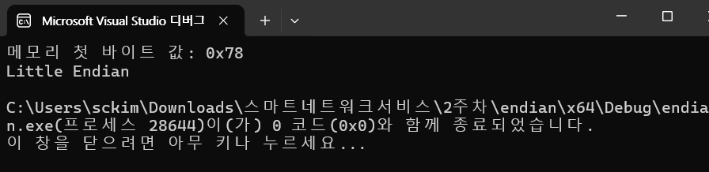
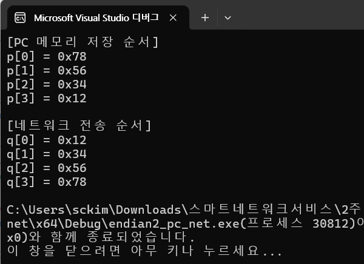
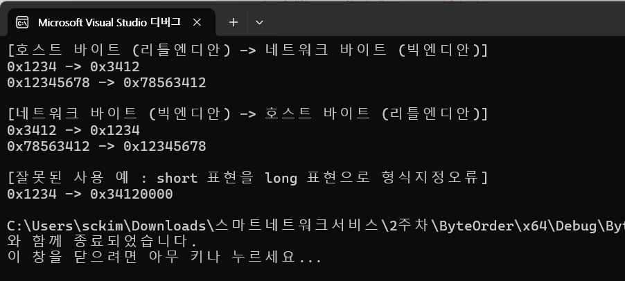

# 엔디언(Endian)

- 엔디언은 **메모리에 데이터를 저장할 때 바이트를 어떤 순서로 배치할지** 정하는 방식
    - 32비트 정수 `0x12345678`을 메모리에 저장한다고 가정

---

- 빅엔디언 (Big Endian)
    - **가장 상위 바이트(MSB, Most Significant Byte)** 를 **메모리의 낮은 주소**에 저장하는 방식.
    - 메모리에 저장되는 순서
    - 즉, 사람이 읽는 숫자와 동일한 순서로 메모리에 저장
    - **네트워크 바이트 오더**가 바로 빅엔디언 방식

```
주소 ↑
0x00 : 12
0x01 : 34
0x02 : 56
0x03 : 78

```

---

- 리틀엔디언 (Little Endian)
    - **가장 하위 바이트(LSB, Least Significant Byte)** 를 **메모리의 낮은 주소**에 저장하는 방식.
    - 메모리에 저장되는 순서:

```
주소 ↑
0x00 : 78
0x01 : 56
0x02 : 34
0x03 : 12

```

---

- 예시 코드 (C)

```c
#include <stdio.h>

int main() {
    unsigned int x = 0x12345678;
    unsigned char *p = (unsigned char*)&x;

    printf("메모리 첫 바이트 값: 0x%02X\n", p[0]);

    if (p[0] == 0x12)
        printf("Big Endian\n");
    else if (p[0] == 0x78)
        printf("Little Endian\n");
    else
        printf("Unknown Endian\n");

    return 0;
}

```

- `p[0]` 값이 `0x12`이면 빅엔디언, `0x78`이면 리틀엔디언.
    - 대부분의 PC (Intel, AMD)는 **리틀엔디언**을 사용.
    - 네트워크 통신 시에는 **빅엔디언(네트워크 바이트 오더)** 를 사용하기 때문에,`htonl()`, `htons()`, `ntohl()`, `ntohs()` 같은 변환 함수가 필요

---

- **빅엔디언** : 큰 바이트 → 낮은 주소 (사람이 읽는 순서와 같음).
- **리틀엔디언** : 작은 바이트 → 낮은 주소 (PC에서 일반적으로 사용).
- **네트워크 전송** : 항상 **빅엔디언** 사용.

---

- 실행 결과 (환경에 따라 다름)
    - **리틀엔디언 시스템 (일반 PC, x86/AMD64 CPU):**



```
메모리 첫 바이트 값: 0x78
Little Endian

```

- **빅엔디언 시스템 (일부 네트워크 장비, 구형 RISC CPU):**

```
메모리 첫 바이트 값: 0x12
Big Endian

```

---

- `p[0]`은 "메모리의 가장 낮은 주소에 있는 바이트"를 보여주는 값

```jsx
#include <stdio.h>
#include <winsock2.h>  // Windows 환경 (Linux는 <arpa/inet.h>)
#include <windows.h>

#pragma comment(lib, "Ws2_32.lib")  // <-- 링커에 Winsock2 추가

int main() {
    unsigned int x = 0x12345678;
    unsigned char* p = (unsigned char*)&x;

    printf("[PC 메모리 저장 순서]\n");
    for (int i = 0; i < 4; i++)
        printf("p[%d] = 0x%02X\n", i, p[i]);

    unsigned int nx = htonl(x);  // host to network long
    unsigned char* q = (unsigned char*)&nx;

    printf("\n[네트워크 전송 순서]\n");
    for (int i = 0; i < 4; i++)
        printf("q[%d] = 0x%02X\n", i, q[i]);

    return 0;
}

```

```jsx
[PC 메모리 저장 순서]
p[0] = 0x78
p[1] = 0x56
p[2] = 0x34
p[3] = 0x12

[네트워크 전송 순서]
q[0] = 0x12
q[1] = 0x34
q[2] = 0x56
q[3] = 0x78

```



## 1. CPU와 엔디언 (리틀엔디언)

- CPU 아키텍처에 따라 **리틀엔디언** 또는 **빅엔디언** 방식을 사용
    - **리틀엔디언**: x86, x86-64(대부분의 PC CPU)
    - **빅엔디언**: 일부 구형 RISC CPU (SPARC, PowerPC 등)
    - **듀얼 모드 지원**: ARM, MIPS (설정에 따라 둘 다 가능)
    - 따라서 **CPU 내부 메모리 저장 순서**는 하드웨어에 의해 결정

---

## 2. 운영체제와 엔디언 (리틀엔디언)

- 운영체제는 보통 **CPU의 엔디언 모드에 맞춰서 동작**
    - x86 PC 위의 Windows/Linux : **리틀엔디언 OS**
    - SPARC 머신 위의 Solaris는 : **빅엔디언 OS**
- 운영체제가 “나는 빅엔디언으로, CPU는 리틀엔디언으로” 이렇게 따로 동작하지 않음
    - OS는 CPU의 메모리 표현 방식을 그대로 따라야 동작됨

---

## 3. 네트워크와 엔디언 (빅엔디언)

- 네트워크 전송 규칙(RFC)은 모든 장치가 **빅엔디언(네트워크 바이트 오더)** 를 쓰도록 정해져 있음
    - **리틀엔디언 CPU**에서 데이터를 보낼 때는 변환 함수(`htonl`, `htons`)로 바꿔주고, 받는 쪽도(`ntohl`, `ntohs`)로 다시 변환함.
    - 함수 사용해야 서로 다른 아키텍처 간에도 동일한 데이터 전송이 가능

---

- **CPU 내부**: CPU 아키텍처가 정한 엔디언 (x86은 리틀엔디언)
- **운영체제**: CPU의 엔디언을 그대로 따름 (따라서 x86 위의 Windows/Linux도 리틀엔디언)
- **네트워크 (TCP/IP)**: 항상 빅엔디언(네트워크 바이트 오더)

---

- PC(x86)에서는 **CPU = 리틀엔디언**, **운영체제도 리틀엔디언**,
- 네트워크 전송할 때만 **빅엔디언**으로 변환

---

## `sockaddr_in`

- C 소켓 프로그래밍에서 IP 주소와 포트를 지정할 때 사용하는 구조체
    - `sockaddr` → 모든 주소 체계에 공통으로 쓰는 기본 구조체
    - `sockaddr_in` → **Internet(IPv4)** 전용 구조체 (`in` = Internet)
    - `sockaddr_in6` → **Internet(IPv6)** 전용 구조체 (`in6` = Internet version 6)

```c
struct sockaddr_in {
    short          sin_family;   // 주소 체계 (AF_INET)
    unsigned short sin_port;     // 포트 번호
    struct in_addr sin_addr;     // IPv4 주소
    char           sin_zero[8];  // 패딩 (사용 안 함)
};

```

---

- `in`의미
    - `in` = **Internet** 의 약자
    - `sockaddr_in`은 **인터넷(IP) 주소 체계(AF_INET)** 전용 구조체
    - 원래 소켓 API는 범용 구조체 `struct sockaddr`를 사용하지만, 인터넷 주소 체계에 맞게 확장한 버전이 `sockaddr_in`.

---

- `AF_INET` → Address Family: Internet (IPv4)
- `struct in_addr` → Internet Address (IPv4 주소 담는 구조체)
- `sockaddr_in6` → Internet Protocol version 6 (IPv6 주소용 구조체)
    - `in`이 붙으면 인터넷 주소 체계 전용

---

- 실습 3-1 (교재 72 페이지)

```jsx
#include "..\Common.h"

int main(int argc, char* argv[])
{
	// 윈속 초기화
	WSADATA wsa;
	if (WSAStartup(MAKEWORD(2, 2), &wsa) != 0)
		return 1;

	u_short x1 = 0x1234;
	u_long  y1 = 0x12345678;
	u_short x2;
	u_long  y2;

	// 호스트 바이트 (리틀엔디안) -> 네트워크 바이트 (빅엔디안)
	printf("[호스트 바이트 (리틀엔디안) -> 네트워크 바이트 (빅엔디안)]\n");
	printf("%#x -> %#x\n", x1, x2 = htons(x1));
	printf("%#x -> %#x\n", y1, y2 = htonl(y1));

	// 네트워크 바이트 (빅엔디안) -> 호스트 바이트 (리틀엔디안)
	printf("\n[네트워크 바이트 (빅엔디안) -> 호스트 바이트 (리틀엔디안)]\n");
	printf("%#x -> %#x\n", x2, ntohs(x2));
	printf("%#x -> %#x\n", y2, ntohl(y2));

	// 잘못된 사용 예
	printf("\n[잘못된 사용 예 : short 표현을 long 표현으로 형식지정오류]\n");
	printf("%#x -> %#x\n", x1, htonl(x1));

	// 윈속 종료
	WSACleanup();
	return 0;
}


```




- 케이블 상의 전송 순서
    - `"192.168.0.1"` → `inet_pton` 변환 → `[C0 A8 00 01]` (네트워크 바이트 오더, 빅엔디안)
    - 실제 동축 케이블, UTP, 광케이블 등의 **물리 매체로 전송될 때도 이 순서 그대로 감.**

```
첫 번째 전송 바이트: C0  (192)
두 번째 전송 바이트: A8  (168)
세 번째 전송 바이트: 00  (0)
네 번째 전송 바이트: 01  (1)

```

---

- 이유
    - 인터넷 프로토콜은 “네트워크 바이트 오더 = 빅엔디안”을 **표준**으로 정의했기 때문.
    - 따라서 IP 주소나 포트 번호 등 **멀티바이트 필드**는 항상 가장 상위 바이트(MSB, Most Significant Byte)가 먼저 전송됨.
    - 이것은 CPU 내부 엔디안과는 무관. (Intel CPU가 리틀엔디안이어도, 소켓 API가 알아서 빅엔디안으로 바꿔줌.)

---

- 케이블을 타고 실제 전송될 때 **맨 앞에는 `C0`**, 그 다음 `A8`, 그 다음 `00`, 마지막으로 `01` 순서가 흘러감.
