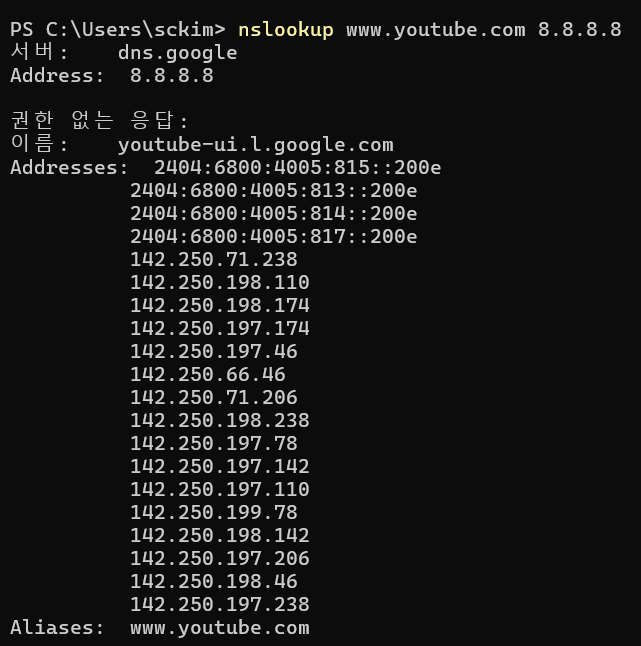
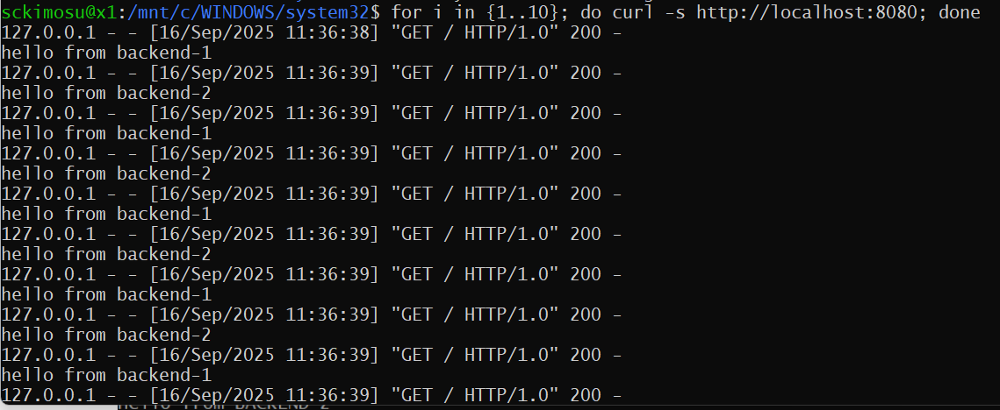

# DNS와 서버 로드밸런싱

## DNS

- **DNS(Domain Name System, 도메인 이름 시스템)** 은 인터넷에서 **도메인 이름(예: google.com)** 을 **IP 주소(예: 142.250.190.14)** 로 변환해주는 시스템.
    - 사람 → `www.naver.com` 같은 이름을 기억
    - 컴퓨터 → `223.130.200.107` 같은 숫자(IP 주소)로 통신,
    - 이 둘을 이어주는 **전화번호부** 역할을 하는 게 DNS

---

- DNS 동작 방식 (간단 흐름)
    - 사용자가 브라우저에 `www.example.com` 입력
    - PC → **DNS 서버**에 "이 도메인의 IP 주소 알려줘!" 요청
    - DNS 서버 → 해당 도메인의 **IP 주소**를 찾아서 응답
    - 브라우저가 그 IP 주소의 서버와 연결 → 웹사이트 표시

---

- DNS 서버 종류
    - **Root DNS 서버**: 최상위 서버 (전 세계에 13개 클러스터 존재)
    - **TLD 서버**: `.com`, `.net`, `.kr` 같은 최상위 도메인 관리
    - **Authoritative DNS 서버**: 실제 도메인 정보(IP)를 저장
    - **Recursive DNS 서버**: 사용자의 요청을 받아서 대신 찾아주는 서버 (보통 ISP나 구글 DNS, 클라우드플레어 DNS 등)
        - 내가 `www.google.com` 입력
        - DNS → IP 주소 `142.250.190.14` 응답
        - 브라우저가 해당 서버에 접속 → 구글 페이지 표시

---

- **캐싱(Cache)**
    - 자주 쓰는 도메인 → 빠르게 불러오기 위해 PC나 DNS 서버에 일정 시간 저장
- **대표적인 퍼블릭 DNS**:
    - Google DNS: `8.8.8.8`, `8.8.4.4`
    - Cloudflare DNS: `1.1.1.1`, `1.0.0.1`
    - OpenDNS: `208.67.222.222`, `208.67.220.220`

---

## DNS 조회 실습 (도메인 → IP 확인)

- nslookup DNS 조회 실습
    - Windows (CMD) : `Name:` 과 `Address:` 가 나오고, IP 주소를 확인

```bash
nslookup www.google.com

```

- macOS / Linux (터미널)

```bash
dig www.google.com

```

- 결과
    - 실행할 때마다 다른 IP가 나오거나, 여러 개의 IP가 동시에 표시됨
    - 이는 구글이 여러 서버로 분산 처리하고 있다는 의미
    - 대형 사이트(예: Google, Naver)는 한 서버에만 트래픽이 몰리지 않도록 **여러 서버(IP 주소)** 를 운영.
    - DNS는 접속할 때마다 서로 다른 IP를 배당.
        - 이를 통해 **로드밸런싱(load balancing)** 또는 **CDN(Content Delivery Network)** 동작.

```bash
nslookup www.google.com
Name:    www.google.com
Addresses:  142.250.190.14
           142.250.190.78
           142.250.190.110

```


## **로드밸런싱(load balancing)**

- **여러 지역 DNS 서버 비교하기**
    - 구글 DNS(8.8.8.8), Cloudflare DNS(1.1.1.1), KT/LG DNS 등으로 `nslookup`을 해보면 **지역별로 다른 서버 IP** 를 받을 수 있음.

```bash
nslookup www.youtube.com 8.8.8.8
nslookup www.youtube.com 1.1.1.1

```

- **CDN 서비스 확인**
    - `nslookup [www.youtuve.com](http://www.youtuve.com) 8.8.8.8`
    - 전 세계 위치에 따라 다른 youtube 서버 IP를 줌 → 가장 가까운 youtube 서버 접속
    
    
    
- **8.8.8.8 DNS가** youtube 서버에 대해 **여러 개 IP 응답**
    - 한 도메인(www.youtube.com)에 대해 IP가 수십 개 나온 것은 **로드밸런싱 + CDN** 때문.
    - 클라이언트는 이 중 하나를 선택해 접속
  

  

    
- **IPv6 + IPv4 동시 제공**
    - IPv6가 먼저 표시되는 건 요즘 DNS 응답의 일반적인 패턴.
    - IPv6 사용 가능 환경이면 우선 IPv6로 접속을 시도.
- **지리적으로 가까운 서버 제공**
    - 구글 DNS는 사용자의 IP(지역)를 참고해서 **가장 가까운 유튜브 서버** IP들을 묶어서 제공함.
    - 한국에서 실행하면 한국/일본/홍콩 쪽 구글 리전 IP가 나오기도 하고, 다른 나라에서는 다른 IP 대역이 제공됨.

# 유튜브 IP 가 **어느 지역(리전)** 서버인지 추적 (`nslookup` 결과)

### whois 사용 : 리눅스(Ubuntu WSL)에서

---

```bash
whois 142.250.197.206

```


- whois 142.250.197.142


- 출력

```
NetRange:   142.250.0.0 - 142.251.255.255
OrgName:    Google LLC
OrgId:      GOGL
Country:    US
...

```

- **소유자(Google LLC)** 와 **대역(미국 등록)** 정보가 나옴
    - 하지만 실제 서버 위치는 미국이 아닐 수도 있음. Google은 글로벌 CDN을 쓰기 때문.

---

### 핑/트레이스 경로 확인

- 응답 시간(ms)이 짧으면 가까운 지역 서버일 가능성이 큼
    - 예를 들어 **한국에서 핑이 20~40ms** → 서울/일본 리전
    - **150ms 이상** → 미국 서부 리전 가능성이 큼

```bash
ping 142.250.197.206
traceroute 142.250.197.206    # Linux/macOS
tracert 142.250.197.206       # Windows PowerShell

```

---

### GeoIP 데이터베이스 사용

- Ubuntu에서:
    - 설치
    
    
    
    - 실행


```bash
sudo apt install -y geoip-bin
geoiplookup 142.250.197.206

```

- 출력
    - 아래 출력의 경우 일본 리전에 가까운 서버
    - 한국 유튜브 트래픽은 종종 일본/홍콩 구글 리전으로 라우팅됨

```
GeoIP Country Edition: JP, Japan

```

### 여러 IP 확인 자동화

- `nslookup` 으로 받은 모든 IP 위치를 한번에 확인:

```bash
for ip in $(nslookup www.youtube.com 8.8.8.8 | grep "Address" | awk '{print $2}' | grep -Eo '([0-9]{1,3}\.){3}[0-9]{1,3}'); do
    echo -n "$ip -> "
    geoiplookup $ip | cut -d: -f2
done

```

- 출력

```
142.250.197.206 -> JP, Japan
142.250.197.174 -> KR, South Korea
142.251.46.206  -> US, United States
...

```

---

- 결과


- `whois` → 소유자/대역 정보 (거의 다 Google LLC로 나옴)
- `ping`/`traceroute` → 실제 네트워크 경로/지연시간으로 지역 추정
- `geoiplookup` → GeoIP 데이터베이스로 국가/리전 매핑

---

## **로드밸런싱(load balancing) 실습**

---

- Windows PowerShell에서 **리눅스(WSL, Ubuntu 22.04)** 를 실행
    - 체크 :  가상화 →  사용


- PowerShell 열기
    - PowerShell에서 Ubuntu 실행
        
        
        

- 사용 명렁어 : wsl

```powershell
wsl

```

- 다른 버전 실행

```powershell
wsl -d Ubuntu-22.04

```

---

- 리눅스 기본 업데이트
    - Ubuntu 터미널이 열리면:

```bash
sudo apt update && sudo apt upgrade -y

```

---

- sudo apt update


- sudo apt upgrade


- Nginx와 Python 설치

```bash
sudo apt install -y nginx python3

```

---

- sudo apt install -y nginx python3


- 백엔드 서버 준비

```bash
mkdir -p ~/lb-lab/server1 ~/lb-lab/server2
echo "Hello from BACKEND-1" > ~/lb-lab/server1/index.html
echo "Hello from BACKEND-2" > ~/lb-lab/server2/index.html

```

## 명령어:

```bash
mkdir -p ~/lb-lab/server1 ~/lb-lab/server2
```

### 의미

* `mkdir` → 새 디렉터리를 생성하는 명령어.
* `-p` → 상위 디렉터리가 없으면 자동으로 함께 만들어주고, 이미 디렉터리가 존재해도 오류를 내지 않음.
* `~/lb-lab/server1 ~/lb-lab/server2` → 홈 디렉터리(`~`) 아래에 `lb-lab/server1`과 `lb-lab/server2` 두 개의 하위 디렉터리를 생성.

### 실행 결과

명령어 실행 후 디렉터리 구조는 다음과 같이 됨

```
lb-lab/
 ├── server1/
 └── server2/
```

즉, `~/lb-lab` 폴더 안에 `server1`과 `server2`라는 두 개의 디렉터리가 생김


## 명령어

```bash
echo "Hello from BACKEND-1" > ~/lb-lab/server1/index.html
```

### 동작 원리

* `echo "Hello from BACKEND-1"` → 문자열 **Hello from BACKEND-1** 을 출력.
* `>` → 출력 결과를 화면에 표시하지 않고 파일로 저장(리다이렉션)함.
* `~/lb-lab/server1/index.html` → 저장할 파일 경로.

### 실행 결과

* `~/lb-lab/server1/` 디렉터리 안에 `index.html` 파일이 새로 생성.
* 파일 안에는 다음 내용이 저장됨:

```
Hello from BACKEND-1
```

### 확인 방법

파일이 제대로 생성되었는지 확인

```bash
cat ~/lb-lab/server1/index.html
```

출력:

```
Hello from BACKEND-1
```

`server1` 디렉터리에 간단한 HTML(텍스트) 파일이 생성됨


- 백엔드 서버 실행
    - 같은 터미널에서도 가능, `&` 사용

```bash
python3 -m http.server 5001 --directory ~/lb-lab/server1 &
python3 -m http.server 5002 --directory ~/lb-lab/server2 &

```


- 테스트:

```bash
curl http://localhost:5001
curl http://localhost:5002

```

---


- Nginx 로드밸런싱 설정

```bash
sudo nano /etc/nginx/sites-available/lb-lab

```

- 내용:

```
upstream backend_pool {
    server 127.0.0.1:5001;
    server 127.0.0.1:5002;
}

server {
    listen 8080;

    location / {
        proxy_pass http://backend_pool;
    }
}

```

- 활성화:

```bash
sudo ln -s /etc/nginx/sites-available/lb-lab /etc/nginx/sites-enabled/
sudo nginx -t
sudo systemctl restart nginx

```
    - ln -s : 심볼릭 링크(symbolic link) 생성

    - /etc/nginx/sites-available/lb-lab : 원본 설정 파일 (가용한 사이트 설정 저장소)

    - /etc/nginx/sites-enabled/ : Nginx가 실제로 불러오는 활성화된 사이트 설정 경로
---


## **Nginx 로드밸런싱 설정 블록**

- **Nginx → 프록시 서버 역할**
- **backend_pool → 백엔드 서버 그룹**
- **8080 포트 → 외부와 연결되는 엔트리 포인트**
- **proxy_pass → 요청을 백엔드로 전달 (로드밸런싱 자동 적용)**
- 하나의 Nginx 서버가 앞단에서 **부하 분산기(Load Balancer)** 역할을 하는 설정

---

- `upstream backend_pool { ... }`
    - **백엔드 서버 그룹 정의**
    - `backend_pool` 이라는 이름의 **서버 풀(pool)** 을 만들고, 그 안에 두 개의 서버를 등록
    - `127.0.0.1:5001` → 첫 번째 백엔드 서버 (localhost, 포트 5001)
    - `127.0.0.1:5002` → 두 번째 백엔드 서버 (localhost, 포트 5002)
    - 이 두 서버가 **같은 서비스**를 제공하고 있고, Nginx가 알아서 트래픽을 나눠줌.

```
server 127.0.0.1:5001;
server 127.0.0.1:5002;

```

---

- `server { ... }`
    - 클라이언트 요청을 받는 **Nginx 프론트엔드 서버 블록**
- `listen 8080;`
    - Nginx가 **호스트의 8080 포트**에서 요청을 받도록 지정.
    - 사용자가 브라우저에서 `http://localhost:8080` 으로 접속하면 이 블록이 동작함.
- `location / { ... }`
    - `http://localhost:8080/` 으로 들어오는 모든 요청 처리 규칙
- `proxy_pass http://backend_pool;`
    - 요청을 `backend_pool` (위에서 정의한 두 서버 그룹)으로 전달함
- Nginx는 라운드로빈 방식(기본값)으로 두 서버에 번갈아 요청을 보냄
    - 첫 번째 요청 → `127.0.0.1:5001`
    - 두 번째 요청 → `127.0.0.1:5002`
    - 세 번째 요청 → 다시 `127.0.0.1:5001`
    - 이런 식으로 반복

---

- 클라이언트가 `http://localhost:8080` 으로 요청을 보냄
- Nginx(프록시)가 요청을 받아 `backend_pool` 로 전달
- `backend_pool` 안의 서버 5001, 5002 중 하나로 트래픽 분산
- 백엔드 서버가 응답 (`Hello from BACKEND-1` 또는 `Hello from BACKEND-2`)
- 응답을 다시 Nginx가 받아 클라이언트에게 반환

---

- 로드밸런싱 테스트

```bash
for i in {1..10}; do curl -s http://localhost:8080; done

```

- 출력:

```
Hello from BACKEND-1
Hello from BACKEND-2
Hello from BACKEND-1
Hello from BACKEND-2
...

```


