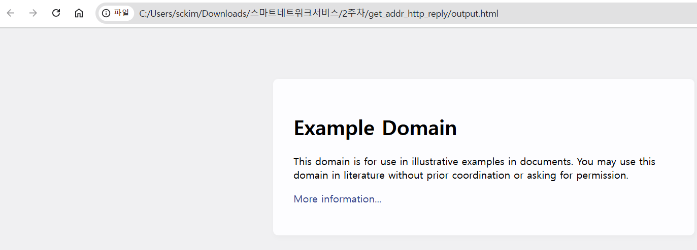

# DNS 조회 HTTP 클라이언트

## 목적

- **입력된 호스트로 직접 TCP 소켓을 열어 HTTP 요청을 보내고, 응답 본문을 `output.html`에 저장한 뒤 브라우저로 자동 열어주는 간단한 HTTP 클라이언트**.
- 추가로 **여러 DNS 후보 중 몇 번째 시도에서 연결됐는지와 연결된 IP**를 화면과 파일에 기록.

## 기능

- **콘솔 출력 인코딩 준비**
    - Windows 콘솔 기본 인코딩은 CP949나 OEM 코드라서 한글이 깨짐.
    - 프로그램 시작 시 `stdout`, `stderr`를 UTF-16 모드로 전환하고 `wprintf`를 사용 → Visual Studio 디버그 콘솔에서도 한글이 깨지지 않고 표시.

---

- **명령줄 인자 처리**
    - 실행 시 `프로그램이름 <호스트명> <포트>` 형식으로 입력을 받음.
    - 인자를 주지 않으면 기본값은 `www.example.com` 과 포트 `80` 을 사용.
    - 예:
        
        ```
        http_client_win_all_wide www.example.com 80
        
        ```
        

---

- **호스트명(DNS) 조회**
    - `getaddrinfo` 를 이용해 입력된 호스트명을 DNS 조회.
    - IPv4/IPv6를 모두 허용(`AF_UNSPEC`)하고 TCP 소켓(`SOCK_STREAM`)을 요청.
    - 결과로 여러 개의 IP 후보(예: IPv4 주소, IPv6 주소)가 나올 수 있음.

---

- **연결 시도**
    - 얻은 후보 주소들을 차례대로 시도.
    - 각 시도마다:
        - 소켓 생성
        - `connect` 호출
        - 성공/실패 여부 및 소요 시간(ms) 출력
    - 성공하면 즉시 멈추고, 실패하면 다음 후보로 넘어감.
    - 연결된 IP 주소와 “몇 번째 후보에서 성공했는지” 정보를 기억함.

---

- **HTTP 요청 보내기**
    - 연결된 소켓으로 아주 단순한 HTTP 요청을 보냄:
        
        ```
        GET / HTTP/1.1
        Host: <호스트명>
        Connection: close
        
        ```
        
    - `Connection: close` → 서버가 응답 후 바로 연결을 닫도록 유도.

---

- **서버 응답 받기**
    - 응답은 HTTP 헤더 + 본문으로 구성됨.
    - 코드에서는 헤더를 건너뛰고 **본문만 저장함**.
    - 저장 파일 이름은 `output.html`.

---

- **결과 파일에 기록 추가**
    - `output.html` 맨 위에 HTML 주석으로 다음 정보를 기록함
        - 성공한 후보 번호
        - 전체 후보 수
        - 연결된 IP
        - 포트 번호
    
    예시:
    
    ```html
    <!-- 연결 성공: 1/3번째 후보, IP=93.184.216.34, 포트=80 -->
    
    ```
    

---

- **리소스 정리 & 자동 실행**
    - 소켓 닫기, Winsock 라이브러리 해제.
    - 브라우저 자동 실행: `ShellExecuteW("open", "output.html")` 호출 → 기본 웹 브라우저로 `output.html`이 열림.

---

---

```c

// 사용법: http_client_win_all_wide <hostname> <port>

#define WIN32_LEAN_AND_MEAN
#include <winsock2.h>
#include <ws2tcpip.h>
#include <windows.h>
#include <shellapi.h>
#include <fcntl.h>
#include <io.h>
#include <stdio.h>
#include <stdlib.h>

#pragma comment(lib, "ws2_32.lib")
#pragma comment(lib, "Shell32.lib")

static unsigned long long now_ms(void) {
    return (unsigned long long)GetTickCount64();
}

static void init_console_wide(void) {
    // 표준 출력/에러를 UTF-16 텍스트 모드로
    _setmode(_fileno(stdout), _O_U16TEXT);
    _setmode(_fileno(stderr), _O_U16TEXT);
}

int wmain(int argc, wchar_t **wargv) {
    init_console_wide();

    // 호스트, 포트 파라미터 처리
    const wchar_t *whost = (argc >= 2) ? wargv[1] : L"www.example.com";
    const wchar_t *wport = (argc >= 3) ? wargv[2] : L"80";

    // UTF-16 → UTF-8 변환 (getaddrinfo는 멀티바이트 필요)
    char host[256], port[16];
    WideCharToMultiByte(CP_UTF8, 0, whost, -1, host, sizeof(host), NULL, NULL);
    WideCharToMultiByte(CP_UTF8, 0, wport, -1, port, sizeof(port), NULL, NULL);

    // Winsock 초기화
    WSADATA wsa;
    if (WSAStartup(MAKEWORD(2,2), &wsa) != 0) {
        fwprintf(stderr, L"WSAStartup 실패\n");
        return 1;
    }

    // 주소 조회
    struct addrinfo hints;
    ZeroMemory(&hints, sizeof(hints));
    hints.ai_family   = AF_UNSPEC;
    hints.ai_socktype = SOCK_STREAM;

    struct addrinfo *res = NULL;
    int rc = getaddrinfo(host, port, &hints, &res);
    if (rc != 0) {
        fwprintf(stderr, L"getaddrinfo 실패: %d\n", WSAGetLastError());
        WSACleanup();
        return 1;
    }

    // 후보 개수 세기
    int total = 0;
    for (struct addrinfo *t = res; t; t = t->ai_next) total++;
    wprintf(L"총 후보 수: %d (호스트=%s, 포트=%s)\n", total, whost, wport);

    // 연결 시도
    int sockfd = -1, attempt = 0, connected_attempt = -1;
    char connected_ip[INET6_ADDRSTRLEN] = {0};

    for (struct addrinfo *p = res; p; p = p->ai_next) {
        attempt++;
        int s = (int)socket(p->ai_family, p->ai_socktype, p->ai_protocol);
        if (s < 0) {
            wprintf(L"%d/%d: 소켓 생성 실패\n", attempt, total);
            continue;
        }

        unsigned long long t0 = now_ms();
        int ok = (connect(s, p->ai_addr, (int)p->ai_addrlen) == 0);
        unsigned long long dt = now_ms() - t0;

        if (ok) {
            void *addr = (p->ai_family == AF_INET)
                       ? (void*)&((struct sockaddr_in*)p->ai_addr)->sin_addr
                       : (void*)&((struct sockaddr_in6*)p->ai_addr)->sin6_addr;
            inet_ntop(p->ai_family, addr, connected_ip, sizeof(connected_ip));
            connected_attempt = attempt;

            wchar_t wip[INET6_ADDRSTRLEN];
            MultiByteToWideChar(CP_UTF8, 0, connected_ip, -1, wip, INET6_ADDRSTRLEN);

            wprintf(L"%d/%d번째 후보 연결 성공: %s (포트 %s, %llums)\n",
                   attempt, total, wip, wport, dt);
            sockfd = s;
            break;
        } else {
            closesocket(s);
            wprintf(L"%d/%d번째 후보 연결 실패 (%llums)\n", attempt, total, dt);
        }
    }

    freeaddrinfo(res);

    if (sockfd == -1) {
        fwprintf(stderr, L"모든 후보 연결 실패: %s:%s\n", whost, wport);
        WSACleanup();
        return 1;
    }

    // HTTP GET 요청
    char request[512];
    _snprintf_s(request, sizeof(request), _TRUNCATE,
                "GET / HTTP/1.1\r\n"
                "Host: %s\r\n"
                "Connection: close\r\n"
                "\r\n", host);
    send(sockfd, request, (int)strlen(request), 0);

    // 파일 열기
    FILE *fp = NULL;
    errno_t ferr = _wfopen_s(&fp, L"output.html", L"wb");
    if (ferr != 0 || fp == NULL) {
        perror("fopen_s");
        closesocket(sockfd);
        WSACleanup();
        return 1;
    }

    // 연결 정보 HTML 주석 기록
    if (connected_attempt != -1 && connected_ip[0] != '\0') {
        fprintf(fp, "<!-- 연결 성공: %d/%d번째 후보, IP=%s, 포트=%s -->\n",
                connected_attempt, total, connected_ip, port);
    }

    // 응답 수신 → 본문 저장
    char buffer[4096];
    int header_done = 0, n;
    while ((n = recv(sockfd, buffer, sizeof(buffer), 0)) > 0) {
        if (!header_done) {
            char *body = strstr(buffer, "\r\n\r\n");
            if (body) {
                header_done = 1;
                body += 4;
                fwrite(body, 1, n - (int)(body - buffer), fp);
            }
        } else {
            fwrite(buffer, 1, n, fp);
        }
    }

    fclose(fp);
    closesocket(sockfd);
    WSACleanup();

    wprintf(L"응답 본문을 output.html 파일에 저장했습니다.\n");

    // 브라우저 자동 실행
    HINSTANCE h = ShellExecuteW(NULL, L"open", L"output.html", NULL, NULL, SW_SHOWNORMAL);
    if ((UINT_PTR)h <= 32) {
        system("start \"\" \"output.html\"");
    }

    return 0;
}

```

---

- 빌드 방법

```bash
cl /W4 /EHsc /utf-8 http_client_win_all_wide.c ws2_32.lib Shell32.lib

```

---

## 코드

## 1. 헤더 포함 & 라이브러리 링크

```c
#define WIN32_LEAN_AND_MEAN
#include <winsock2.h>
#include <ws2tcpip.h>
#include <windows.h>
#include <shellapi.h>
#include <fcntl.h>
#include <io.h>
#include <stdio.h>
#include <stdlib.h>

#pragma comment(lib, "ws2_32.lib")
#pragma comment(lib, "Shell32.lib")

```

- **WIN32_LEAN_AND_MEAN** : `windows.h` 가 불필요하게 `winsock.h` 같은 옛 헤더를 포함하지 않도록 최소화.
- **winsock2.h / ws2tcpip.h** : 소켓, getaddrinfo, inet_ntop 등 TCP/IP 함수.
- **windows.h / shellapi.h** : UTF-16 콘솔, `ShellExecute` (브라우저 열기).
- **fcntl.h / io.h** : `_setmode` 함수로 표준출력을 UTF-16 모드로 전환하기 위해 필요.
- `#pragma comment` : 링커가 자동으로 `ws2_32.lib`, `Shell32.lib` 를 링크하도록 지정.

---

## 2. 콘솔 출력 UTF-16 모드 전환

```c
static void init_console_wide(void) {
    _setmode(_fileno(stdout), _O_U16TEXT);
    _setmode(_fileno(stderr), _O_U16TEXT);
}

```

- Windows 기본 콘솔은 UTF-8이 아니라 OEM/ANSI 코드페이지라서 한글 깨짐 발생.
- 표준출력을 UTF-16 모드로 바꾸면 `wprintf` 등 wide 출력이 안정적으로 표시됨.
- 따라서 main 대신 `wmain`을 사용.

---

## 3. 프로그램 시작 (wmain)

```c
int wmain(int argc, wchar_t **wargv) {
    init_console_wide();
    const wchar_t *whost = (argc >= 2) ? wargv[1] : L"www.example.com";
    const wchar_t *wport = (argc >= 3) ? wargv[2] : L"80";

```

- `wmain` : 유니코드 기반 진입점 → 명령줄 인자를 `wchar_t` 배열로 받음.
- 기본 인자가 없으면 `www.example.com:80` 으로 접속.

---

## 4. Wide → UTF-8 변환

```c
char host[256], port[16];
WideCharToMultiByte(CP_UTF8, 0, whost, -1, host, sizeof(host), NULL, NULL);
WideCharToMultiByte(CP_UTF8, 0, wport, -1, port, sizeof(port), NULL, NULL);

```

- Winsock API(`getaddrinfo`)는 멀티바이트(UTF-8/ANSI) 문자열만 지원 → Wide → UTF-8 변환 필요.

---

## 5. Winsock 초기화

```c
WSADATA wsa;
if (WSAStartup(MAKEWORD(2,2), &wsa) != 0) {
    fwprintf(stderr, L"WSAStartup 실패\n");
    return 1;
}

```

- Windows에서 소켓을 쓰려면 `WSAStartup`으로 Winsock 라이브러리를 초기화해야 함.

---

## 6. DNS 조회 & 연결 후보 리스트 얻기

```c
struct addrinfo hints;
ZeroMemory(&hints, sizeof(hints));
hints.ai_family   = AF_UNSPEC;
hints.ai_socktype = SOCK_STREAM;
struct addrinfo *res = NULL;
int rc = getaddrinfo(host, port, &hints, &res);

```

- `getaddrinfo` 로 호스트 이름 → 여러 IP 후보(IPv4/IPv6) 변환.
- `res` 는 연결 후보 리스트.

---

## 7. 후보 개수 세기 & 연결 시도

```c
int total = 0;
for (struct addrinfo *t = res; t; t = t->ai_next) total++;
wprintf(L"총 후보 수: %d\n", total);

for (struct addrinfo *p = res; p; p = p->ai_next) {
    attempt++;
    int s = socket(...);
    if (connect(s, ...) == 0) { 성공 → break; }
}

```

- 후보 개수를 세서 몇 개 IP가 있는지 출력.
- 각 후보(IP)에 대해 소켓 생성 → 연결 시도.
- 연결 성공 시 시도 횟수, 소요 시간, IP를 기록.

---

## 8. HTTP GET 요청

- 가장 단순한 HTTP 1.1 요청 `"GET /"` 전송.
- Host 헤더 필수.

```c
// HTTP GET 요청 문자열 생성
char request[512];
_snprintf_s(request, sizeof(request), _TRUNCATE,
            "GET / HTTP/1.1\r\n"
            "Host: %s\r\n"
            "Connection: close\r\n"
            "\r\n", host);

// 소켓으로 요청 전송
send(sockfd, request, (int)strlen(request), 0);

```

1. **HTTP 메서드와 경로**
    
    ```
    GET / HTTP/1.1
    
    ```
    
    - `GET` → 리소스를 요청하는 HTTP 메서드
    - `/` → 루트 경로 (즉, `http://호스트명/`)
    - `HTTP/1.1` → 프로토콜 버전
2. **필수 Host 헤더**
    
    ```
    Host: example.com
    
    ```
    
    - HTTP/1.1부터는 **Host 헤더가 필수**
    - 가상 호스팅(Virtual Hosting) 때문에 서버가 같은 IP라도 여러 도메인을 구분해야 하므로 반드시 사용
3. **Connection 헤더**
    
    ```
    Connection: close
    
    ```
    
    - 응답이 끝나면 서버가 소켓을 닫도록 지시.
    - 없으면 서버가 keep-alive 연결을 유지할 수 있어서, 프로그램이 응답 끝을 파악하기 어려움.
4. **헤더 끝 표시**
    
    ```
    \r\n
    
    ```
    
    - HTTP는 CRLF(`\r\n`) 기반 프로토콜.
    - 헤더 종료는 빈 줄(즉, `\r\n\r\n`)로 표시.
    - 요청 끝에 `\r\n\r\n`을 넣어야 서버가 “헤더 끝”을 인식.
5. **전송**
    
    ```c
    send(sockfd, request, (int)strlen(request), 0);
    
    ```
    
    - 완성된 요청 문자열을 TCP 소켓에 전송.
    - 서버는 이 요청을 받아 처리 후, 응답 헤더 + 본문을 돌려줌.

---

## 9. 서버 응답 저장

```c
FILE *fp = NULL;
errno_t ferr = _wfopen_s(&fp, L"output.html", L"wb");
fprintf(fp, "<!-- 연결 성공: ... -->\n"); // 주석 기록
recv(...); fwrite(...); // 헤더는 건너뛰고 본문만 저장

```

- 응답은 `output.html` 파일에 저장.
- 헤더와 본문 구분 → 본문만 저장.
- 첫 줄에 연결된 IP/후보 번호를 HTML 주석으로 남김.

---

## 10. 리소스 정리 & 브라우저 실행

```c
fclose(fp);
closesocket(sockfd);
WSACleanup();
ShellExecuteW(NULL, L"open", L"output.html", NULL, NULL, SW_SHOWNORMAL);

```

- 파일 닫기, 소켓 닫기, Winsock 종료.
- `ShellExecuteW` 로 `output.html`을 기본 브라우저에서 열기.

---

# 결과

- **UTF-16 콘솔 출력** → `wmain + wprintf + _setmode` → VS 디버그 콘솔에서도 한글 정상.
- **Winsock 초기화 & getaddrinfo** → 여러 IP 후보를 얻고 순차적으로 연결.
- **연결 성공 후보 기록** → HTML 주석에 남김.
- **HTTP GET 요청** → 응답 본문만 `output.html` 저장.
- **자동 실행** → `ShellExecuteW` 로 브라우저 열기.

---

# 결과 화면


# 결과 화면


