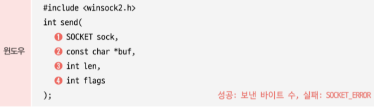
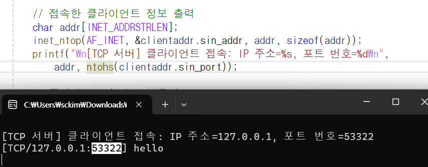

# TCP 서버-클라이언트 소켓 함수

## 서버 소켓 함수 프로토타입과 함수 구성 요소 ( 교재 4장 page 56)

### **socket()**

- 역할 : listen socket 생성
- 함수 반환값 : SOCKET

[](data:image/png;base64,iVBORw0KGgoAAAANSUhEUgAAAoEAAAC/CAYAAACBvAZMAAAQAElEQVR4Aex9h58cxdXtqe4Z5bDKWVrlnDPKCTDJZGww0WBjG2xs/D2/3/sDvhdsMBiMwSYHG2OSCQaUc845a5WztMphp7vfPbXbo5mdmQ3SKuzuHc2d7spVp3vVZ86tqnECeXmHDwWxnTsqtHlHj8pIg+DMmTPByZMn1RQDvQf0HtB7QO8BvQf0HqjU94ADfSkCioAioAhUMgR0uIqAIqAIAEoC9S5QBBQBRUARUAQUAUWgEiKgJLCSXXQdriKgCCgCioAioAgoAkRASSBRUFMEFAFFQBFQBCouAjoyRSAtAkoC08KikYqAIqAIKAKKgCKgCFRsBJQEVuzrq6Or7Ajo+BUBRUARUAQUgQwIKAnMAIxGKwKKgCKgCCgCioAiUB4RKGmflQSWFCnNpwgoAoqAIqAIKAKKQAVCQElgBbqYOhRFQBGo7Ajo+BUBRUARKDkCSgJLjtVF5wyCALFYDL7vX3QdlaUgcfI8r7IMV8epCCgCioAioAhcNQSUBJYB9CHJ45FErzCJOXLkCF544QV89913YJ4yaBJsY/369Vi+fDlWrVqFs2fPXnS1eXl5WL16NU6fPn3RdZRFwfPnz+Nvf/sbPvjgA7BPZVHnpdRBPIjtuXPn0lbDa0ncDx8+jKNHj4L9T5uxUCTL7dy5E9u2bSuUokFFQBFQBBQBReDKIaAksAywJgH47LPPQLKwaNEi0PigD6tm+muvvYbp06eXGQkkSfr3v/+Nv/71r3j++edBohm2V9rjqVOnLEndt29faYuWaX6O6f3338cnn3xyTZBA4vGHP/wBubm5KePk9V25ciVef/11PPfcc9bY9wMHDqTkTRfxzTff2HGmS9M4RUARUARKiIBmUwQuCQElgZcEX35hKjokAFSCvvzySyxbtiw/oeCzfv36+NnPfoZx48bBGFMQe2kHx3HQvn17ZGVlYdKkSSCRu9gaSV4nT56M48ePX2wVKeVIkvbu3YstW7aUmNBFo1E8/PDDuOeee8DzlEqLiGB7VGFpPC8ia4mTjh07hokTJ+LMmTMpZdgGiRzVWNd1QUWQCuY///nPEhF9Kq9LlixJqZcRJPSbNm26pGvKetQUAUVAEVAEFIGiEFASWBQ6xaSRcMyfP9+6effv34/Zs2djwYIF1s0XPuDXrVsHnnfs2BHZ2dlJJJBK08aNG0GyNHPmTMybNw8kHmGzJBonT560Lt+pU6di4cKF8XSSpNtvvx033XRTUp0sy36xvj179jBojaSC/bAB+WA7bG/OnDmgO1Oi4m+W3717N2bNmoUZM2YgJyenRMQmrIDl2daLL76IxYsXI8SGLmymUfELxzZd1FGWY3tsq0WLFujcuTNIrBhPO3ToEIhjWM/cuXOt8sk6mE4CxvGShP39738HzxNJMTFkf4jh8uXLU9zeJHkkZdOmTbPXgO2FdbP+0NgO+8hrxvRevXrh8ccfx7PPPmuNpLy0Kia/QBADqsfsB9tif//xj3/grbfeAvvCuBTTCEVAEVAEFAFF4BIRUBJ4CQCS0Gzfvt2SvObNm9sHNgkdqwwJGOeUffHFF3j11VdB8kLywHQaCSOJEtNIHl555RVQUSRZYjqVuTfeeAOMp7v5nXfesaof04wxiEQiSWSJ8TSWf+mll+xcQYZpU6ZMsXPteE6y8fbbb+Mvf/mLdUmSPJGYMY39IyF64YUXQEL14YcfWnfzmjVrmFysEROOk+2TwLRr186SXI6TxCxHCCXbJtEhdn/6059snTt27MBXX32FN998E59//nnSIpoVK1bgj3/8I+hS//jjj22/SZCovLIwSR/rZ7sktlTjSK6Yxnl9xJRjJYYvv/wyOKZwvMSC42Q/Pv30U4vRRx99lEJ62Rb7xb7zulCJJQHv06cPqMY2bdoUvAe4sIXtlsR4r4TXnv3n+IkflWOSYaqzHDPzlaQ+zaMIKAKKgCJQsREo69EpCbwEREkEBg0ahKpVq2LkyJEYPHiwdWN+73vfQ//+/W3NXbp0wZgxY0ClKySGNkE+SIhILE6cOIERI0agcePGdmEE5xBKMkgCqAi1bdvW1tGvXz9GF2skcstF8SIJCzNzIQJdlwyTmJLMdO3aFdddd51VxqhyMY2uYc5zo9o1ZMgQDBs2DJs3bwYJaHEEh8SKahtJa1ZWFn75y19iwIABqFatGpYuXWoVR6qlv//977F161ZrrJvtkvTQXc42qFoyLjRiRyJ98OBB29/WrVtbskgllXm+/fZb8PwHP/gB7r//fttntsk0jpVEOjs7G6NHjwbJGudRhu2SiDO9SZMmNn3gwIHgdUXCi32iy52Y9e7dG506dUpRX6mmcoy8D6jSJhTPeEqiWrt2bYwaNcoSevaDRLlWrVr44Q9/iB/96Ed2agHxJF68rhkr0wRFQBFQBBQBRaCUCCgJLCVgidn5UCZx44ObZI8PfxpJAskG89JlePPNN6NevXoMplg1IUiPPvoo7rrrLpDEkLiR0FDN+9e//mUJx89//nPccccd4Hy5CRMmpNRR2gi6eUlcn3zySdsuCQdVRdbD9jnXjSQuJEN16tQBlUSqd8yTzkiU/vOf/1jVkoTrV7/6FXr27GnJEjGqUaMGSETpHma9JEwkwSR0rI/HW2+9FW3atGEwxapUqYIHH3wQd999tyVIVON27dpl8xFrXguqfnS733fffSBxZhzd3RzbT37yE9x5550gllT/6MZnYS6u4Viffvppm07ide+999p+M53GOqjU9enTB4888giIBxJeJM5UH3nkNTTGJKRmPqXiF14D9o3kN1yEQry+//3v44knnrAknEpoSOIz16gpFRcBHZkioAgoAmWPgJLAS8CUahJdjVz8wJWidCeSKFHdI5kqSdUkSCQ+xhhLFEmQSGbofmT9VBTr1q1rSQnJDM9LUm+mPCRGIfkiMTXGoFWrVlbNZBmqkDQqg5ynxnmIJCTdu3dPctEyb6KRtNItSxzoJqUb2Jh8MkTSRKVtw4YNVv278cYb7QpqKmEdOnRIrCbjOfvKOXfEhxiQFBInFrj99tutCks3Lt3YXMzB/jONbmaOj+WNMSBhJOaMJxZr165Fjx490KhRI4sx5yKSnBmT33fmeffdd+2cRBJVts16Q6P7lootFwQ99NBD6NatW5hU7DE7OxsNGza07fLIa04iGRbkF4qxY8faOZKsn3iFaXpUBBQBRUARUAQuFQElgZeAoDHGulJJRujW41y6li1bonr16vbBXpKqSWZIPJjXGGPLkXgwTCPJSAwzriRmjLF7CTIvy1Ot5HmiMZ5htsEjjSSL/Rk+fLhVJqlscfEDXbs1a9ZklrRGgnrDDTeA7lIqmCR8Yf1UHUl4qALSZUzSRvJFlzMXgaStsFAkCRHbYLQxyThR/XvmmWdAlZTkj+5TqpJhXo4v7AuPNGMMk60x3Z6k+WBekk/2mfM2eY0Zx6wsR6JMNy7bvu2226xbl2mhkdSRzNPlH8aFx2qiAofnxD08D4/Eim5orjZn+yXFKiyvR0VAEVAEFAFFoCgElAQWhU4xaVSxOJ+rQYMGdlsTqkSc20e3JZWlYooXmUxyyPpJMqgqkniQUGRaJMD0sEKSOBI2upVJVLh3HUkX040xoKJFVypXCDOd6h3JE9M5Fqp2JLZUIYcOHWqJHeNJ5pgnnbFNzumjW5VzH+k+DQkTCQ5d5BwLSTLdqiQ4JEckWOnqK2kc1TO6SYk33cBPPfWU3a+RLm3WQfJJ1Y8YECOeExe6i40xVrnjvEHiwXT2i0opz1neGIPHHnsMHBdJ25///GdwbiLT6b7lAhiqi9zWhuMkbkxjWRrnHP73f/83uKCF4ZIax8W5jmyPJJfudaqrJS2v+RQBRaBcI6CdVwSuCAJKAi8BZj70SXjoXqQSyAUMJDVUrYwx4PwuPvw5X4wLB0g2uNCDc8wSiUK6LpBUcf4biRJXrtLtzJWi/NWRxPwki5yPx5WlXPVKksN+cYED3ZRc0MEVqCRBYTku9iBZoWLGdK6OpTuX6XSFcv7h119/bTeiZrskInRxM70oY5+5MIJEjMSVRJBj5lhJZIgPlUKSZRJcqpMkhSS37D+x4XiZj2OhmkdSVlSbLMsFG+wjx0HljHP+SMyMMaCiaYwB0zkWkja6p7mIh/VSvSMZZl/fe+89uzCH9ZAcM92YfBcy+0siSPc43c4kaczHuZLEn/1lG1xUw3GxLI0uXGLJOZAMl8Q4ZpbhdePiHeKZLa5jYy6olyWpR/MoAoqAIqAIKAJFIaAksCh0SpDGbUG4mICuSs51o3oWFiPRovpFoyuP5JALEqggkRhx/hhXErMsy5BIUlGiqsUwXYyPPvqo/Ukykg/OPeTcNqaFxvZvueUWsE7WTbJpjMEjjzwCEheSDxI8Lv4gQWM5EjEuOOAWLVQBOd+P6aybfeTctuuvvx5U2NguSRnVQ5YtzkhASbzoPmZeLkIhKeK8Oyp1VEqNMXahC9skWSOJWr58Odj/rKwskBiyXfaNaSTWXDTCvrFOzlHkQhqOnXFUyKjkhWXYPtOZl2PjYhAuJOF1IGlk31iG6SSD3MibpI7pHDPxN8aAhJjucK7W5bjGjBljcaVqyn6RTJIws8/Encb5lCGBDOv/3e9+ZxfgMBwa26WKHIbZJhek1K5d264k5ypqXicSz3DOaJhXj4qAIqAIKAKKQFkgoCTwElHk6l8qdiQJdANT8QqrJDlgGrct+c1vfmN/NYTEh0qcMcYuZiDJI5FhGZKwX//61+B2KQxTMfvxj39st1ph3Vzhynl3TAuNrtv/+q//siuHSVhCskaS8dvf/hYkdCQ5nNf3wAMP2GJ0FdPFSXJEssgj6yAhM8aABInuR7bHdn/xi1/g9ttvt2VL8kFFkFvPcCwkf8YYZIuS9T/+x/+w7lfWMX78eHAeH8dINzOJLLEh6WE8z0mQiQ3JEPtCdyzLknyRyJEcsuwjQnjZR/aVeHHc4XY6LMO6mJ9knXXzmoTEm4SSuDCe5YkTrxevZ7Nmzewm0LyObJdt8XqRzPKc9f3P//k/QaWO7dNYnvgyP43kn1gmEj7Gc2zsB89pJL7Ei8STY+aKcmLB62mMKoDESE0RUAQUgYqKwNUal5LAS0SeZIIPbWOMXWFL8hBWSYJBtyzn1SUaiaIxxm41QhIXlmE9JIAkGGEddPdyPh33I6SqRVITpvHIskznnn40zt1jPIkYyRzbJ5lhPFfJMo3GxSskVzSSKqpNYbvGGFCVZBrbZf0cJ8uV1Ngv9pfkh6SIYyPRCdugukYlj/1k3X369EEiRjxn+0xjXo6BdbJ9xhEnjsGYfNxJtthXkj+utDXmAnEihmE6sWd51hMaw8SK5Unq2V+msRz7zHSGacSFODKO144kLdHYL46JeWnGGLuhtzEX+mNMvsrIfqLgRVzYFnFiHVwVzDEbc6FcQVY9KAKKgCKgCCgCZYKAUya1aCWKgCKgCCgCF4GAFlEEsTFgGAAAEABJREFUFAFF4OohoCTw6mGvLSsCioAioAgoAoqAInDVEFASeJWg12YVAUVAEVAEFAFFQBG4mggoCbya6GvbioAioAgoApUJAR2rInBNIaAk8Jq6HNoZRUARUAQUAUVAEVAErgwCSgKvDM7aSmVHQMevCCgCioAioAhcYwgoCbzGLoh2RxFQBBQBRUARUAQqBgLX+iiUBF7rV0j7pwgoAoqAIqAIKAKKwGVAQEngZQBVq1QEFIHKjoCOXxFQBBSBax8BJYHX/jXSHioCioAioAgoAoqAIlDmCCgJLGNItbqri0AQBNi+fTv27t17dTuirSsCioAioAgoAtc4AkoCL/ECkXQcPXoUK1aswMKFC7F27VqcPHkSjGfVnuchJycHixYtwurVq3H69GlGx435jhw5gmXLlmHx4sXYuXMnWIa2e/fupPx5eXlg3KlTp3D+/Hns2rULO3bsSLJjx44hNzc3KS4xD/sWb/wKnpCUffHFFzhz5sxFtUqczp07h4MHD2Ys7/s+FixYgPfeew/EIWNGTVAEFAFFoGwR0NoUgXKJgJLAS7xs27ZtwwsvvIC//vWvlny88sor9hiLxUBSMn36dDz33HN455138PLLL+ONN97AiRMnbKskNitXrsTzzz+P119/HW+//bY937hxI0j0/vSnP2HdunU2b1gX2yHB2bdvH37/+9+DeVhvaPPnz8e8efNsW4z7f//v/+EPf/iDDf/5z3+O12crvYIfW7ZssX29WBLK8X/22WeYNGlS2l4TSxJw4l+3bl00a9YsbT6NVAQUAUVAEVAEFIF8BJQE5uNwUZ8kHh999BEmTpyIzp07Y+DAgcjOzrZqFdMOHz5siQ+P/fr1Q4sWLSwJnDt3rm2Pit1LL71kFcAePXqAeaLRKKgsUjH75JNPrGuTmdevX4+//OUvoBpYs2ZNUD388MMPQbJZv359hFatWjVUr149Hp4+fTpINJler149VK1aFcW9WCf7xj5wHMXlL0k6FdAcUUSpcJYkf+E8JIGffvopli9fXjjJhkmaSaSZ70c/+hFIBG3C5f7Q+hUBRUARUAQUgXKKgJLAS7hwJBwkdG3btsXjjz+OBx98ED/72c/sMRKJgMSNpIVxjzzyCJ566ik0bdoU33zzjXX5kpxNnToVjz76qC3PPL/5zW/QqVOnpF7t2bPHKnl16tTBE088AR6ZwRiDe++919bLumlDhgzB0KFD43EtW7YECSbTaF27dmXRjLZmzRrbFtXNP/7xj/j4449x9uxZm58Ejm7rt956C6+99hq+/vpr6/q2ifJBwkhl9J///CdeffVVq4hSAZSkpDfzMZ6kjaonE9nGjBkzrCL6t7/9DTyny5tpzEsCvGnTJktoqWiy/URVke74KVOmWOxJdllOTRFQBBQBRUARuBwIVJQ6lQRewpU0xoCkivP46IY9fvw4qNKRFDqOA5KXGjVqoHfv3mCY5IRq34YNG6yix3mCtWrVwujRo0EFkHlIEhs2bBjvFet88803sXXrVkvsqDQaY+LpdC1TOaRRvSPBotrHemmu69q6eU5jO/HChU6oAJJs/ec//7FzDg8dOgSOiwSNWTmnka7t2bNnWzLGfpEkshzTqfSROH711Vd2biQJMokZ0xKNrmy6qufMmWNd5iSXbJNtL1myxCqjYTrHQ7JHAki1j+MkcWQ4bJd1k1hT7Rw0aBCDaoqAIqAIKAKKgCJQDAJKAosBqKhkkrYf/vCHVrnjXD+6dkmQuICB5UhY6JYkKWOYRpLHOX1063LBRqNGjVC7dm0mpRgJ0OTJk8G5giNGjLDuYmNMPB/TP/jgA5B40Tg/kIQ0nqGUJyRjs2bNsq7tp59+Gr/+9a9x9913Wxcy0zgnjytvH3nkEfz0pz9F9+7dQdWOZJGqKNNJbO+66y48+eSToFu2devWSb2gG5vzGklqWQ9VT+LBuKysLNx///144IEHrFL6/vvvW7Lcrl07W1+rVq3Qq1cv/PznP7ftk3CzcrbNBSFUPEOVlPFqikDZI6A1KgKKgCJQcRBQEniJ15KkhC7c4cOH2/l7dKPSHUpXJpUquoUTm6hSpYolOCRwJItU5kgmE/OE58xD1bB9+/agm5VKWJgWHqkaNm/eHDQSTNYfppX2SNVw7NixdjXzd999Z1fyDhgwwM4x5HhItDhOGsdNAkwiS+NYv/32WwwbNgy33HILunXrZs/HjRsX7wbr4MpdEleSPebl2Onupmuc4+McRrqCiQ1d05xLSJJMskjSRzWV8y87duxoFU5WToJKdZGLQTgGxqkpAoqAIqAIKAKKQNEIKAksGp94aqYTkhgSHs7V45y7xo0b29XCVLqqVatm59NRqQrLk+iQqJGs0D1LVydVwTA98WiMAUkZFTm6SbkyNrEuY4xVzZhO+9WvfoXCyltifcWdk7BS4SPxIxF78cUXwcUndEmT5OXm5oJzDI3JVyM5VhJVxpOIkcx16NABrCdsiyQ3PCeho1LKsVP9Y1mm8Zykj+XYFo1udpJJ5mWeoswYA+ZjH8M6oS9FQBFQBBQBRUARKBIBJYFFwlN0IgkZzRhjiQ/VsYceeggkQ5yzRpJElzCJXlgT581RvSM5osJHBWv//v1hctLRGAMSstGjR2P8+PHW9VrY3Uvyk2jG5BO0pIpKEaDK9stf/tIusKBrlQswOC+QZJeklgQtrI6ElqSL8cYYcP4jx8u4ME/ikSTvvvvus8T17bfftnv6MS/LkRjfdtttoKpKe/bZZ/GTn/zE1plYR7pzjp/kd/v27Xa1dLo8GqcIKAKKwEUgoEUUgQqNgJLAS7i8JER0b3J/OqphJEBUAElKSKC6dOliF4TQtco05uOcuf79+1vSOHjwYHv8+9//DpJBKmKrVq2yCyPCbrEukiyuIGYbnCdHt2qYzg2jN2/ejNAyEcowf1FH9oHb3VCxYx9vvfVWHDhwwO4tSJJGdY5KHokox8Nx0T3LuXokeFyZPL1gSxqOhX3j4o+wTZI9Er0f//jHVrHk4g+6kunKzs7OtvsbMi/zEVuOieNnnDEGxIEEm/MKeQwXrBhjMHLkSLsZN+cnMr+aIqAIKAKKgCKgCBSNgJLAovEpMpXuR65+5YIQbsjMlbNcLct5cCRMVPpIpP7xj3/YDaO5eIPk8Oabb7bkkHm4eIKu17A8V8hyHiCVNy6UIPliJ6jQcTsYkrSQaDKdizG4HUto3HKG+UPjfDqSqjBc1JHEi+5fbl7NsZCccm9DLrggybvzzjvtPEGms7+ff/457rnnHjsfkWSNcwTZX+LB8nQnc+Nqtknlk6t3SeQ4d4+uc5JO1tGgQQNwkQi3n2E5GgkiXeAsS2P93PqGK67ZNreJIRFlGu3666+3i0iIJcOXbFqBIqAIKAKKgCJQwRFQEngJF5iEjiSuTZs2thYStzFjxoCuTLp8uZCBc+xICo0xoGLGuXskVSzATZ2pinF/QRI1ukY5p44uYIZZlgsimJckiISLRJDtNGnSxG4Zw7pI1EKjMsf8obEM2w/DRR25sIRuZ46Lbm6uXP7FL34BKpbGGLvQg6uGueKZfbjxxhvtHodc/WyMAdXDZ555BiS/LM98JG5sk9vmcDzEhGFu5cK62AYJJvtJIsh0liVWYVnmN8bgjjvusKSTbbNutss0GnFiOgk3f6KOcWqKgCKgCCgCikBpEKhseZUEXsIVp+o1YcIEkMz89re/BY0LRDg3kETFGGO3j+Fm0SSGJIA33HBDfFWrMcb+vBm3RGE6jXlJaEgCSQ5JqMIukuiRNHLLFJJMblDNrVgSjQtJwvw8Uonk9jI8L85I/jhnj3PyOBYeSay4gIVlSVrpzmU8+8qxci4e02jEgySYcwpZngtVQiJHUsfxcFxhXtZFdZFhqoRsm/WyLJVCkkqmhUayTXyYTnKaSHhJCDkfk65lbmZ9KW7xsD09KgKKgCKgCCgCFRkBJYGXeHWNMXaD6KysLPtTZXR3GnNhcYYxxm6xwnS6ZkkOCzdJVymVLeYh0TLGwBhj58BRAQzzG5MfR+WM9bAt5k80ErEwP48Ms36el8RYN/vJvvCY2D7LM0yyyHS2z7hEY7+o5jGd5RlmOssxvzGGQWvsF+NsQD7Ydlg3yaIxF/JKssWEY2XdbMOYC+nGGGRnZ4MElPUmuopZVk0RKBoBTVUEFAFFoPIhoCSw8l3zCjtiY/J/weXRRx8FV2ZX2IHqwBQBRUARUAQUgTJAoNKTwDLAUKu4xhCgq5zu5WusW9odRUARUAQUAUXgmkJASeA1dTm0M4qAIqAIKAJXAAFtQhFQBAQBJYECgr4VAUVAEVAEFAFFQBGobAgoCaxsV7yyj1fHrwgoAoqAIqAIKAIWASWBFgb9UAQUAUVAEVAEFIGKioCOKz0CSgLT46KxioAioAgoAoqAIqAIVGgElARW6Murg1MEKjsCOn5FQBFQBBSBTAgoCcyEjMYrAoqAIqAIKAKKgCJQgRGosCSwAl8zHZoioAgoAoqAIqAIKAKXjICSwEuG8OpWcO7cOezatQt5eXlXtyPauiJQAgSC06cRnD+HwPMQHD1ij8UVs3lPnUTg+whOnkBw9kxxRUqUHpw/jyD3KBAEJcpvM0ne4PhxBPJ3Z8P6ca0hoP1RBBSBUiCgJLAUYF2LWefNm4f/+3//L1auXFnq7nnyID7OB5o82EpduIgCx44dw5w5czBx4kSsXr1anrGleMgWUW9FTgoOHYS3fAmCWCxlmCRB3uoV8A/sS0lLFxGcOA5v4Tx48+ek2rzZ8HfvSlcsKS44dxb+rp1p+5OUMUPA37zxQtsrloIEjlm9JQvg52wTMncSsWmTACF3jIfcgyR3welTiJukEY8gNxexWdPBdG/ZYim/1RYp6oOYxesJ6zzFuk/HSV+wby9iM6eBecO6/B3bL/Q7xI+YHTxgswTSz9jcmQh27bBh/VAEFAFFoDwjoCSwPF896fuePXswbdo0HDx4UEIlf/uiqnz99deYPHlyyQuVIGdMSMxbb72FV155BZ999hk++ugjkGyWoOilZSnHpUksvJXL4G9Yl3YUwfFj8GZMFXIkBCZtjuRIKlz+3t3w9+wqsPxzb9F8S3pQAiUtOHQIsakTAVHtkmsvWYgKW9h+cGB/nHj5q1YIgdoJ9sEX0gshm6yRRMxbvBCxaZMv2JTvEBw+CAip9RfNA0R98zdtBMkbyxRlxCw2Y8qFuljv1O+E4M0GiSXLBkcPwxfcIX8LDNNYLr/fghkx3LgescnfIhBCynSSVX/1ctgx2Qj9UAQUAUWg/CKgJLD8Xjvb86FDh+J3v/sdevXqZcMl/SAJJEFbsGBBSYuUKN/JkydBEtigQQNcf/316Nq1a4nKVepMZ87AX7MKTtv2MK6bDIUoT8G2LQjE3W8aNU5OyxAytWvDHTQU7pBh+dZ/IExWfQRCopyOnWBatMxQsiBa2iSJDEhKRS0uiC3xwRdVk5lNw48lHr4AABAASURBVMagoWYtUJ1knHwjEELo29N0H8YAxsiHkE9/wdwC4itK8kX0w0D+mfz6jOMg2LoZ/vo10r7Uh/Qvp3WbfMyInWCIGjWAKlVg6jdAcEZc2WLwMvc/fa0aqwgoApcLAa330hBwLq24lr5aCJw/fx5ffPEFZs2aBWMMIpFIvCtUlqZOnYotW7ZgypQp+Pvf/46ZM2eCZZhp+/bt+OCDD7BhwwasXbsW7733Hj788EPQNcz0TEaVj+7dTz75xJafNGkSTp/OV6eo9v373/+2dR04cADRaBQnTpxA9erVbf8y1anxELfrDnCunOnYBQIWEl9UyPw1K+F07AxTXQhJYmKGc1OlKpxmLWCaNJMcxrpPWYclh9eNhKlWXeIzv0k4g00bwL74WzaL+BWgNK9A3M3+dnH5HtyPQMxfVbxyRvLrDhgMd/QEuGPGw+nV1zZJIuqtXikglY54mTp14Y4aB1vf6PFwR44BatTMxyThb8U2kvDBck7zlnCatwDJXrB7J9z+gyAgwJs51SqyEPdyQhE9VQQUAUWg3CKgJLCcXjqSLhKyGTNm4Pe//71dHBIOhSrfyy+/jBdeeMESxenTp+OPf/wj5s+fb7McPXoUS5YssaRv//79WLRoEZYtW4azZ8/a9EwfO3fuxOuvvw4SzLlz5+LNN9/Exx9/LOKOJx41387/W758uV2kkpOTY+tdty69izNTG5UtPp/krQIVKFO3bsrwgyNH4O/dA7drd1DNSslQKIKuTv/wIXgb1sKbNQ3enBkgKUOtWhBmDn/tanjr1sAXcsa2CxUH4/x1qxHs2Q1HyI+3cC58UdDCOX2F86cLm4YN4bTvaM00bopgl7h/5UsBv5yky2/jjBFyWg1GlDeS1EDGACGrgXyRsC7hFB5qS2X8IKm0dbE+MbuYQxRKp0s3FIcjx+rv2iGEbwqIP0i+RYkMfOmEqKQZG9UERUARUATKGQJOOeuvdrcAASptt912G2655RaQyHGVcEGSPaxZswYrVqzAqFGj8IMf/MCqcp9++qlNa9OmDR544AE0a9bMumsffPBB3HfffahTp45Nz/RBctmxY0fceeeduP/++9GpUydLCrkQxBU3Jvtz9913o1q1ahg/fjweeugh3HrrrXDEFZepzsoeb+egCclyevZOISckTXRfUp0yVKZKABbr8+bOgr9S1LeDB0EXsnvdCEQm3CRqYhchNYdBZY7z70QavlCjkJuAc+9WLAUXlDhCOiNjJljlzJs93ZJHupMvFMh85oiS5vbuB5oR9Q3iSoXwJ2/JQgQnT2YuWJDCOY3B+rUgYWPf3R69ITdRQWrpD0HeebBtCKk02e0zVkC8ufrYX7VCCOBUQO5pZ9AQcK6mL/1xRZ10R461imLGSjRBEVAEFIFyhEC5I4HlCNvL2lW6f3v06IGePXvK8zH9ZRw2bBhuE6I4ZswY9O3bFxs3brR9qlevHvr374+6ojw1adIEAwcORL9+/UDyZjNk+GjZsiXuuOMOEZVqgWoiyd12cS2H5+xL7969RXCKWoLIetlHY0yGGjU62LYVcgFhWmengiEuf3/1CpCQmarVUtPTxFgFTFyhTqcu1gXqDhsFJ7sdnJat4A4dbuOcLqIq1m9o22UVJD/+lk3gal1v6WKYNm3hiAoYnDsLd/hImAYNQUXQmzkNXDTB/CyX0Xi9xbiYwlu2SNpvK67VGIId21HsQhMho764kv39e0FMAp6LEkp3bMb2ikpgfZs3gjjabF7q6msbLx8k0LHpU8AVyBAM6ZaOiEvZ6dAJvrjH/R05MNXFla5fagQtfSsCikBFQCA9e6gII6vkYzDGoF27dnauoDHGErfi3L1FQcYH/7Zt2/DnP//ZrvpdvHgxcnNzrRtY9ygsCrnMaYHvw1u1TBS6TjC1aqVkDPbsQnAsFyRtnJ+XkqFQBEmMJTB5eeAefP76NfDmzoRdJTtDyI24hq2r98hh4NQJ+EsXge5jVsM5iVQGnd59ERkxGqB6Nm0STO06Eh5j+xBwT71ipgywLlogffCWSP0H9iM4dcrWY+fW1azF5PRGwiZuYPbZadfBkk+7QEXcuBdDAnnP+rt3wps9A7Y+Uaj9ebPBrWPSdcAYA6v+9eiFyKixcJo2B8QV7PYbCLdnH5hatWGvg7i2SdyhryuJgLalCCgClwEBJYGXAdRrpUqqhWFfjDHhadKRD8qkiAwBuoK5IISLQQYNGmTd0Fz9myF7xuhcIY6cL8g5jRkzVZKEQMgY5+u53XrCOG7SqC1BXLMKRoiIadgoKS1TgITO1nk8F/YohIpz67xF88QdKoSsIBwcOYRACF2QewQIfOE1Bk6HjnDF/cvFGUaIGufQ+QULMkzdLNiVxiPHwIhb2pj09xIKXuyHv2q5qG/L7SplHMsFyadp1AimatWCXIUOJIBC9qg2Qggk3cBOi5bg0RVXOZyi2yxUmwzLh789B1T26JK2YxNVlG5durvp9i1chm73yOhxsGRVFD/OhfS43+KCOYKnYHb0CPy1q+B07ALTTAhi4Qo0rAgoAopAOUNASWA5u2Bhd0nKSKRojAvDJSV1LMN5hYcPHwbnE548eVKevZl/dYT1cp4ht3656aab0KFDBzDMdllXSYx95bzE//N//g9KvGCkJBWXwzzEk4SEBMs0a5EyAs6d8zdvgNNTFCg3mSCmZC6IMHXqiII1LsVsG0IkI+LaTDR3yHCIVAz2BZwvV6++kMIAJKAQUmar9QvCEuD8QlQREhemSVzhN13I3pKF4J6ETuduQuJGWiLoczHKls2Fs8fDVDw97oUoxJjz7riymauh7SpncUcLU43nLe6E47ELYGZOhXEjcIXYOTJ+utWdvv1h+yIKZbp62KbI2/CXLUFs9nQEO3eA14JKaXDoALzlSwFuE0NVMF0FGqcIKAKKQDlCwClHfdWuJiDARR8vvPAC3nnnHUviuOffiy++aIkZs9WoUUOe7xGeWqtSpQq4XYsNyAfn83Ee4Pr16/Hcc8/hpZdeAgmhJKV9Mz/nFR48eNDmZ9vsA9thWljIGAPGuW564sI2uIn00qXyMA0LVcbjubOilK2A070nIG7KJAiEZAXbtwKxGKjQJaUVETCRqHWhcg5fkglxM9JGUpwQK0PSBwOqdiRgiWbn0En73pyZdpFEUpq4WDN2g6Tx4AHYOYlDhtnVvtzuxRkwGHStZionQwZq1kRE1Ea7Hc4lzrvjnn4krS63m2neEpD70ogb1x04BA77VQSJC06dhDdrOkz9hnAHDxV3+GjbL3foCDii2nKhiJ3fCH0pAorA5UJA670yCDhXphltpawROHXqFHbv3m336bvnnnts9WHYGIOHH34Y3bt3t/H8GDx4MO666y6eWjPG2FW+N954o/21EaqBmYgbC5DocVUwF4ZwH0Cqemz3xz/+MbjQhHlotWrVwmOPPYbWrVszmGSsg+1RTSQpTUqsZIFg7x7QVet06yH8JNnVGfieEDMhiNntwDl5lxUaYV9W6Tp2FEGCQQgTVbPg1ImkeOaRbx2ZuyTuXrpTXe5HWEC06AKmm9lp3yFjOZOVhQjn4XE/xEskgMYYuF175NfXtBkEYIQvUzDHz2ncJIxKPQr5JRHkBtGG+YQsh2qqw/q4XQzVwNSSGqMIKAKKQLlCQElgubpcFzrLVbjPPPMMfvOb3+B//a//hWeffRa/+tWv0K1bN3nmGUvEuDI3LMFfFrn33nvDoM3TuXNn/PKXv8Rvf/tbPP300yA5i2dIc8KFJk899ZTNz7boFn7yySdRv379eO6aouY88cQTKSTQ9337+8bck7BPnz6gChkvVBlPhHw5/QfBNGiUOnpJ4zxAp88AmEskRLZyI3/mJplo2nj5MMbYRQ+RQq5ibg8Tuf4mIVJp3MstWiHTi/11mjVPmfvHeGOkD1zlLIpl4fLGGFENawLGFE4CiIG4q+WmTU3LEGPkywjnAqZLNsaki47HcU6k04du49XwuFp49nTEqIiKe5l7L3JepNMmO55fTxQBRUARKK8IyNOhvHa9cve7du3almhRcUs0KnHGGDA9UW2rJu5ApiWiZoxBVlYWuPULCSCVusT0wufGGLutTKtWrdCwYUPrbmb5RAWRdXC/wcRFKayH87S4upgK5uOPP4727dszutIaiQRX4XJLlxQQHNcuxLBEQzBPSS9lhCMuTKdT1/SlpH7+koih2lVSk3spfWXFx9K96rSTay9k0OneC5BjcaVMVj1ERo8HXdpOW1FHS/jzecXWWzdL3Ls9YElmQmZTpQoiw0flr4imKijubf5WcHDihN13MTL2ert/YkIRPVUEFAFFoFwi4FwrvdZ+VGwESA579eqFH/7wh+C+hW6GOYMVG4ULozOibFFxuhBz4cyqZnXqgnPYLsRe/JnTq08+2bn4KsqspNu7H5xWbUClzh0zAeBm0sXUbgQLrk7mXomuqKOOuMmLKVKiZCOuXXfEGHBbmKQCJMb1G4Ark+1q4RGj4Q4bKaroWPCn6Ox2M5X8/k3CSwOKgCJQbhFwym3PtePlCgFjDOhObigKojGmXPW9vHeWylZZEcqywsJEIuC8PB5LXKfcN6ZePWQizyWupyAjibgjqqIx6e9HS8Zr14HTqAmcJk1h6tUvM2Je0AU9AIqBIqAIXEUElAReRfC1aUVAEVAEFAFFQBFQBK4WAkoCrxbylb1dHb8ioAgoAoqAIqAIXFUElAReVfi1cUVAEVAEFAFFoPIgoCO9thBQEnhtXQ/tjSKgCCgCioAioAgoAlcEASWBVwRmbUQRqOwI6PgVAUVAEVAErjUElARea1dE+6MIKAKKgCKgCCgCisAVQOCyk8ArMAZtQhFQBBQBRUARUAQUAUWglAhcNAnkL0AcPHwYm3NysGf/fvC3ZMO282Ix7Ni9GzHPC6Mu+sh2zp47h/Pnz4PnF12RFlQEFAFFQBG4UghoO4qAIlAOELgoEnjy1Cl89MUXePufH+HLiZPwj88+w1v//Cf2Hzxoidqx48fxl3ffBX8ijBjk5eXhxMmTRdp5ycO8NN/3sXHLVvzz3//GX955x9b1ihxfe+89fP7td9i9b59th3krux06dAjTp0/HsWPHKjsU5Xb8QZ58wZEvOukGwC8+wZkzCORvIl16cXEsjyDInE3SgnNnEZw5nWzyBS7IPQp/z24E8rfpb9qA4OyZzPWUMCU4fgx+zlYEUn9SEfaDX/QOH4LPn2mTMSf2m23bPkiepHIXGfD37ZGx7bpQmu2nw4G4FGAfyDXyt2xCUEZ9uNC4nikCioAicHUQKDUJ5ENl2py5+Pd3E1G/Xj20z26Dpo0bY+Gy5fjoyy/hyX+Yp+U/8K8mTQIVPMhr5bp1ePnNt/Duxx9ntPWbNknO/PeKtWvxqhC+9Zu34MzZs6gajdrfqT124oS0swwvv/WWJYL5uSv356xZs/Df//3fWLp0aamA4HU8KKR9y5Yt8qwtgiSjX+ooAAAQAElEQVSkqXXPnj3Yvn17mhQAGlsqBEju/OVLQYKTriBJkzdrGiBkJF16UXEkWv76tSDhyZSP7XtLFsKbNjnfpstxyncIco8IWdsGb9F8IYdnEJN49iVTPYznPeULwfNWLkOSrVqOsKy/dw+82TMAIb4sY40ETMgf42Ozp8ObMxOxGVPg79wevzdZnn0oCQ7BsVz427clW46EhVza9uTDX7MK/srlcpb/zsdhUT4GxGL6FHhTJ8GTI+T/IOYKTp5AbNokBKdPMaimCCgCikC5R6DUJJAjXrh8OaLRCB6+9x7cdv31+OHtt6Nzh/aYPm8+qOIxDx8IPNJWrV+Pb6ZNQ5UqVTKa47rMav/T/1AUQCqH933/Nvzs4Yet/VyOTz74IL5/w/VYsHQZps+da/NX9o9IJIKaNWuitL/Fy+v0r3/9C5OErJcWw7eEhM9V/EsLW9r8wenT8ObNBjKobP7mjfA3rAMy/LQZinqJgkdC5e/cUVQu2LpZv+NYlcubL39b8kUuECUw2C1qmRdDsGsnUJwCJl8AvWWL4S2YB9tv9p1G9Uy8B+Dr1EkEu6UuycsgjWQ1NmcG/K2bYWrXAX8aLjh0UAjXZATiQWAetm37EIvZYFEfVC9JXvNtAbzFC6WuSfDXrY4XCw4fBtuIR/CEGMTNgb9xHTwhi/KfElNB4hrsyJFjXn5YPxUBRSCOgJ6UTwQuigQO7tcXdN++LS7gT77+Gh98+ik2bt2KscOug+ukVsn5gs2aNMZDd9+d0bp26BBHMFfcyTVr1ECjBg1QrWpVeUYZOFIv46g68vxk+FBB5XyRZB8XnHr16oWf//zn4DFEgmln5CEekwfmWVEx6Co+J64sxjMP51cePXoU3377LdaJSpubm2vdybxOTM9krCNX8n4piu8mUW55zrpJKFknzxPrYPvMw7iwH5wisG3bNuzduxdMT2yL+TgmWuG0xHwV6TzYmYNAVDHT7sL9H44viOWJWrUMTqcuQPXqYXSJj8GJ4/mES1ywcSJTuLSQHrdrDziDr4MzYDCc7HZAtWqw7RV22RYumyYcHD0Clnd79oHbq2++ybmpUydN7vyoQBR+X9RDp08/uMNHw71upD2ScAW7d+RnKsWnqZsFp03bAsuGadYcgaiKKILEGvn/xe0/EO6YCdacfgNsi063HtZ17e/ZheDAAci3XBuvH4qAIqAIVAQEUhlbMaMyxgjZG4bbb7wRXBiSs2sX9sp/jgN798Z9t91m3cEkC4WrIXGrKkpgJguVLGMM7r75ZtD1+7f3P8D7n3yKL8T1/LkQlrc/+hfe/PBDtG7RAiOHDCncRKUKE+O3334bf/vb3zBLXMIkYCEAJHvvv/8+pon6+sYbb+D555/Hu+++iyNH5AEtmUjgXnzxRdAVTDfyc889h5dffhkkhpKc8b1s2TIw7759+zB79mz84Q9/sO2T2DGOdebk5MTLr6Vb/9VX7dzQJUuW2DaoIr7yyiu27JQpU+ILitj2xx9/jBdeeAF//OMf8cknn+BkqALFa6xYJ7xO/qoVlqyYOnVTBheI+zLYtxdO957yRah0f6p0b/prVgKisPvbtsIXZS0tEZQvCVYxEzXSmz/HqnhyUeDTRS2u3ZROpUSkRpisenA6dLpg7TvC1KyVmjGMOXcWOHceTrMWMPJ/hIlG4TRtJn2PxN3IYdaSHJ3mLeAOHBI3J7st4BgYIYYZy8v/O6aKfOEkARaV0hdFM5Avmm7vvggO7gfVUes+vghinLFNTVAEFAFF4CojULoni3R2zqJF1rXrGAd1ateWL8Y+qkSrwHVcfPbNN3j13fewdPUFt4sUse+T8h8q1cJMduDQYZuPH6OE4D1w5x0iKFS1i01YZtO2HBwR91SjBg3x84cfQuf27Zm1Upsxxip4r7/+ulXWQjBILhhHYrdVFFqSqXfeeQeTJ08Os1zU0RgTL2eMEWJi4mGS/M8++wwkdmyf9p///AdTp04F01atWoVXhRBSeWzatCm4oIWkkeQxJoolXdMffPABqALSSBYnTpwovCWIt1HRTjjHjATN6SYkT8ha4viIH+fzmfoNYBo3TUwq9pzuVc4x9FYst0QINWvCmzkN/uFDEECTy/MSStvGcRAc2Idg1w44HTuD6lwmF3VyBamhQP5Ok93Bm5G4mILn/tYt8LdIvCjU7B9q1bLuV2LCRSr+pvWAH4PTsHFqA6WICQLfunRNnSyrCBZZlHMTRTWle97ftAHihkCwfz9MJArTpCmM/N8DU+r/MotsUhMVAUVAEbiaCJT6f7SDhw9j55492C0Kxap16zFn4SJ5rgTIPXEcp06fQTQSAdW+xEHVF2WA8VT0aH955138VVQ+noe2av06cEsZriw+LepEf3Fz3nvrrbhlwniMGjoEY64batXHu2+5GR2ys3FCSOVxupHkW3tiW5XlvKq4yR955BE8+uijFv9AHmCJY8/NzRVBx8Njjz2GX//612jWrBlIypinU6dOeOaZZ5AtOPbr1w/PPvssnnrqKdSrV4/JGa1Pnz42b8OGDTF8+HB7/pOf/ESe4TXRpEkTDBs2DN/IFwG6fk+Kijd9+nSMHTvWprN/JIP333+/dV//4he/ABVJkkMSQpK+Vq1a4Y477sCdd94pnKAW/v73v4OKJyriS65XsHkDjFxH07oNhFEj8WWJ0Lo1cHr0BpWxxLRM5yR/wZHDsAs9Zs8QhTEb7tDhiIwYg+DUCXhcbLFlIwL5+5KbJr+aatXhiivYtGoNCBF0BgyCO+4GuMNGwtA1nJ+rVJ9WORP3rrdiKaytXo5wcYWtSIifJyqlt0riz5wWlbAm3CHDhBRusnP37IKMxQvzxy6qni1zMR/EWFRrqnqmbTuYGjXT18J8Z86AxI8LP/ztW61r3O0zwPbfl+tEYuz06gMIYU5ficYqAoqAIlD+ECg1CRw2cCDuuukm3CUu2/Zt2iAi/ynec+stePCuu/DEA/fjyYceRL+ePZOQ6NezBx6+9150bNfW2tbt27FXvmGHYR4bN2iAw+Ku/ODTz/CeuAXfF3fgJ6IkTRZX53fTp2OKuB95/NeXX+I9SWMeKo/hCuSkBitBwBiD2qLE1qlTR/iDSTviESNGoFu3bmgh7nMSP67qZcZoNIq6devaFdckk1lZWTbsyrVkeiYL8zJfNXGbsRzbJ7njApXbb78dGzZsAOf80dW8c+dO3HjjjfH+1a9fH3369EH16tXRpUsXMJyTkwP2i/lzhbh+/vnn+FyMRJIqIec2ZupPeY4P7Hy/5XA6d0WKq5SkZPcuq8YxXQAs0VCp3sVmTIW/ZhWMXHN3+CjQnWxq1IArRFC+FYhbU1y+yxfbeW4kgoGog96yJfBXLYcR1Y1z8hxRvZxGjcG5dRD3bIkaT8hksurBERdw3CXM+Y6J9VSJwmnbXvJ0AEiCHRfuoKFw+g4ASRZd2U6nzoiMHAsjJNVWLfeM07U7StMfLirhimOOOxB1EvKl0daV5iPYtwfe0oWQbx1wBw+DO2CwJcJOl27gima6huE6gEFlf+n4FQFFoAIhIP+rlW40jYSstWreHPWERHRu3w4jRKVrLipQQ3nAc+GGMan/S7Zp2RLfv+GGuLUT8tilQ/t4mGk9u3YVIcJBDfnPPtGqC9mYLARw/abNadKqw5jU9ko3ooqZ2xiDhqLYGWMsRlXkIcyFF5drtMYYUFUk4aRLmHMGW7dujY4dO8abJFF0C4imI6oTySgXlJDosW9NxU1MRZE2evRoPPTQQ/LMrxIvzxMqijyWd+PKVH/PblilT7BLHE8gLkx/7So4LVrCCKFKTCvqnC5dI65ft99ARIT0mVq14c2ZCX/XTjii6rmjx8PIEebCn30gCn5wQFyebdpJmdFw6tUXbhgI8dkNCHl0ChZIFNVu4TTTqAnc3v3yrVdfO0bIF48gLw9Suaif1eD26AUuHjHVa9jiRlQ6t2sPmKYthHyNgjtkOIy4wm0iP9wIIOOB3DcMFmfcxsVbMAfB/r3gYg+IMu3NmwWuxmYfUsrL/zOmfSeb15JNY4A8cUcLXgwbSZc/pPw+FdzDKXVohCKgCCgC5QyBC0+DUnZ84owZ1iV75/e+J/83yn+YCeWpGA3u28/GrF6/HtwnMNEOieK3/+ChlPgDhw6BqmLiKmIqjK3EldmvV8+UlcV33PQ9VBMlwTakHykIkGiFkcYkX6Mwnit7A1GewnDGY6EElisUhaysLNwkKjFXD3/33Xe4/vrrQdUvzEeyR4WP4ROiynAxS0MhqlQlmW/kyJGgmzi0H/7wh8JD8kkC+0i1kFvacM4g6yivxrH469fByBcpwwUQhQZCBcvfvDF/QUgpCIcRZdgdNQ5Oz9756qJcVy4uwelT9m/UaSzkTMiVK4qbiQipknadho2EcF0HKnFW+eN9knce3qzp+apYr77WHW3atQeqVpMSxb+turh2tZ2L561eke+enjvTboVDlS9TDVTbfCFudi9AcRPb+YEnT8Aexc3tr1+Nolb4sl5iyxXKMXGH++L6pjvc7T9IxjhM3L3r4Uk/SBCZN24yZqdpczCfkfsx2LNLxj8NsemTYYnkzu35Y1i5Apa0CzmOl9UTRUARUATKMQLOxfadC0Q2b8tBM1EBuUE05/OFVkv+k/zJgz+yD54pc+Zg8syZSUY1iFvMFI6ftWABYjFPRINokpHMsAyVoySTB5kx6cnNxY6rvJQjEaLbddeuXXZxDl2qDJNclWQMxhjrTiaxWi9Effny5SKWnCxJUdAFTLdvWI6rg1mQ14nuX/aJfRkzZowINxduMa5O5mKPjRs3gotISCS7d++O5qIs8/jFF1+AdbL8woUL7apnY/KvLx/uJJf/+3//b3CuIdsrrxacPWP3rHO69bIEq/A4gm1bRTEDjLhM5Y8IJXnx1yxIfnBKrqG4Pjk3kGE7T/DUKdiwECkcPwaQWPEoFZvadeA0F8VR/pYkaN+BKJT+6pXgFi22fXHJRqgiplnBbAskfBhxI8sNCZ+bVG9YK8Rrg9Sz3bZfHIGDuMi5L6E3ZwZi0yYnmb9gLqw7t7g5wOeFwEreQNRPt/9gOAUk1hHl0ZFwsH8fgliavQblPqOSGgh23Djb35Fjr43JqidkPQscU7B9G5gO5N+T0JciUAkQ0CFWbAQuPKFLOU6SssUrVuBPb7yRYq+9/z5IEvfs348enTuDrt5E48pfKn6JcTzvKq7DKlWiKT0xxsh/uyYlvjJHkLRx65e3335bvFsBuLqWW6usWbPGwkJXLOcM2oB81KtXz5ItObVvErYJEybYbWO4Sve9996zK3NtYjEfN998s533x3IffvghQhLIYu3atbPttG3bFh0S9n5kGl3S8+bNw0svvYSvvvoK9957r81DJfCnP/2p7Qu3j2G97777LjinkOVoxhjQXUxySYLIuPJqJFnB8eNwOndJGQJJG+fnOe062I2TUzJkiKDbk8pVInnyZlPNgQBxQwAAEABJREFUO2uJWGI8z73FCxD4XlJtVOl8cQ3ThWyaNLObKXP/Ps6pc1pnixu3alL+lIC4al1RGd3rhouK2QNc9UyXr8v997j3n8STaKWUKxxRpYptyy6aEaWfR0SrFM6VOSxuYy5sccQlbcQNzYxGyrtUBK8bAbqeGZfOgj174G/bLMqoqKOjx4FzJGmRsRNEBexl504Gx3PTFdU4RUARUATKHQIXTQJvGD0ao6+7DhE3ktFqVq+OccOHY4K4+Upio4YORXXOvSkE4/BBg9C5g7ijCsVX5iDVOBItbhL9X//1XxgkGDFM4keCx9W+ffv2jUM0atQoPPzww/GwMQYkcyRfXbt2Re/evVGrVq14elEn9913n12V3FkIfp8+feKrf6nWcY4f5/fdcMMNNj6xngYNGlgXMRepsI7HH3/cunv5hYJu5Keffhqsr4OQR7qGx48fn1gcgwcPRuPGjZPmGSZlKCeBYOsWOC1bwzRolNLjQBQ6ulOtS7cUrmBwj7t6DWDq179gosq5I8cI2ex6IS5Mp6on9wA7wLl6JH/+8qXwpk8Biag7/gZR0frAYxy3l9m6WdyyojKyQAYzxthxuV26I9+6wenYGXbjZumLJV+SB0W9JN3Jbg+nU5dks3v8Ff9F0AiBdAdfZ8uGBDBsjmTSyW5nFb4wLuUo5SH/p+HYMRnvCdCVTvc0STsVVOJs01MKaoQioAgoAuUPgYsmgSR3zz75U/zyx49ltI6iCl0qJMYYu4BkgJCUS62rIpUnWfrNb34D2m9/+1t75FYwdKsaY3DbbbehfcJeiiSLVP4SMeB8PG7Z8swzz9hFGCSWiemZzps1a2bzs9wPfvADS/ZI/rjB85tvvglu68K2jEl+aHNhyNixY0GyR0LKRSTG5OepJuSfaZwPyHqZHvafpJJuZLqDR48ejXHjxmXqWrmIN02awhk6LD0ZETXNGTgEDrdsKcVouLlyZMx4RMZMSLax14MqVuF4rn41jmtb4HY0XDThrxcVWb64uaKAkbxxniA3qg4OH7S/IcyfUbMFLuWD1zsTuWW8kFNf3MjessVING7TAkmD4FNk81I/yZ8x+fdVSt4wnvXQCmXgRtNUEP1N6+HNFrf09Mn5cwPnzoIvbnJuZWPnThYqp0FFQBFQBMojAikk8FobhDEGjURBqlNClepa639l6Y/v++Cvj6xevdoSRLqFE8fOVcJcKEKVMjG+pOexWAxUEqkekjyWtNy1mM/pJq7StqJsy71duH+co0fyZUq4CKNw+YsJm0gEVCVJfiIkgK3awAhBYh+40pjbyxj2t0bNi6k+qYwRN7MzZDhQ4KZNTDTyN04Cyl/2MPz1kEST9t1RY4Hq+QuFEstdzLnTVVTKHr1SilKtjFA97dMPpn5D6zpmnGnaVFzEQ+EOHQHilVJQIxQBRUARKIcIOOWwz9rlaxCBKuJGu+uuu8DNqR944AF5xifP7RwwYACeeOIJuzdhabtP4kgCSRcyyaQxGVSe0lZ8lfKTRJBkpWue8UzHFRyjEWLlDh0OV8gpSagxF/BlX7hVjUt1Uly06fpcmjjTtJkQqeFCpJLvD9Zh+8F5e4OEbKWzfgPtXEHmvVRzunaH0z2VBBJ3I4qjK2nu8FHgtjrWrhsBl3s61igbEnqp/b8M5bVKRUARqIQIKAmshBf9cgzZFVde//79MXToUHBeYuE2srKywMUqxlwgGIXzZAobYyyppDvZmNKXz1SvxhcgIJgauX4kQAUxKQdLTkUdTEkoZYStJ1Nb7Ie0YfNkOBbVx9J0xTgu7JgzFTIGTCcJtib5y6rtTE1qvCKgCCgCVxoBJYFXGvFrrT3tjyKgCCgCioAioAhUSgSUBFbKy66DVgQUAUVAEajMCOjYFQEioCSQKKgpAoqAIqAIKAKKgCJQyRBQEljJLrgOt7IjoONXBBQBRUARUATyEVASmI+DfioCioAioAgoAoqAIlAxEcgwKiWBGYDRaEVAEVAEFAFFQBFQBCoyAkoCK/LV1bEpAopAZUdAx68IKAKKQEYElARmhKZ8JARBAP5aR/norfbyaiDAe4QGuVcytR94HoLTpxGcPIng7BkEvp8pK4Jz5xCcOHHBTp8CCupmO4EvdRWEM1aiCekRENwshnJMn0FjFQFFQBEoOwSUBJYdllelpo0bN+L111/H9u3bk9svQehafNhc6T6dOXMGO3futHb48OESoFZ2WYKzZ+Hv2gkSsMK1Egd//z4Ex48VTioyTPLGskmZhNR582ZZgpcUL4EgLw/+5o3wZs+AN30yYmLe9Cnw5s+Bv3uXcLtAciW//W1bEJs2KW7e4gUg8WOu4FguvHmzgbzzDJbMSHhKYom1SX47ViGrmY6QPIlFeJ4pbxifrox/YB+8Fcsy26rllhiz/mKNfcpkUpgE21swF8RRgvbNOH9HDpJs+zb4B/bbdH74OVvhrVkFjoNhNUVAEVAESoKAksCSoHQN51m0aBGee+45rFmzplS9JFHg7/wuWCAPcD6USlX68mQ+IerS119/jePHj1+eBtLUSvL80ksv4fe//z0+++yzNDkuX5S/ZSP85UviKlpiS1TjvNnTERw9khhd7Lm3dDH8jeuT84nC502bjOBEMq4kDP7qFYjNmIpg3x6Q7ploFCSGwdbN8KZ8h2DP7nhdwalTQhg3gYQj2LUDofk7tsPfsgnBESHR0l9vxjTgfMlIIPvgrVkJEsmMtnQRgvPn4v3gCcmxN3MqPCGjaU1ILckT84bGe94XwuZNnZixHMcW5g+PwZEj8DdtSG9CvLypk4Azp8PsGY8k+97aVWnHGoT3vKisHBdyj8brCU6dzC+zaEH+UUh3TK6Nv2FdPI+/cQO8ZYvS3kvxTHpSKRDQQSoCpUFASWBp0LoG87Zr1w633XYbWrRoUare+aKgfPjhh5g8eXKpyl3OzNu2bcOLL76IY8eOXc5mkuqOCumpV68elixZgpkzZyalXc5AEIvBF8IG/oQarVBjwd498IWIoWatQilFB/0lCy1ZScpFki+qo8hESdHwYlbxYx/cYaMQGT0O7ujx9ugMvk6Upr0gaQoLkUR6K5cBQiZN/YaIW7QK/NUrJf8+QO4rnDsLsM2wYFFHyW/HKiTLW7cG/nZRvArME5Ljr18Lf+d2IOYl1UJCRSKYzvydO2CJFPuRWEr6ZBU9Ib6B3GPpyhYmjrZ41aowjRsnW8NGMv76QJUqCA4ftNmK/eBYhVTbMVplbzs8IexUVYOTJ/KLSx/BayV58yMAU6UqnNbZYm3EsmHqZoEknYQd4YvKqxDIMKhHRUARUARKgoCSwJKgdA3m8TwP69atA39Pd/z48cjOzo73korHrl27cPLkSezZswcrV67E/v375blMrQfIzc3FsmXLMHfuXGzevNmeM89ZPnzitaSe7N271yqOW7duxbfffovZs2fjlKhDYU6e79u3DzEhONvFPc06WYaEk3nyxPXIsoxnv8J4jmX9+vWYP3++HRMVyqVLl2L37gsqFMuSJLIs41mGdYbGMOOZvmnTJpxLeCCyPzk5ORYHun6ZNyzXpk0bPP300+jatWsYdUWOweFD1t3q9OgNY0xSm1TH/LWr4TRrAZNVLyktc0BShEAEZ0/DVKsmgRK+5T4imbBlhMyREJLYgHU4LgL/AvkyNWrCadsOqFZdXMvHERw9jOB4LhBx88lJvQb5jQqB8UUpJHmjqpgfmeHTceB07wnTpIkQRx9OvwFwBwy2ZqpXB2rUgNtvICBELLEGU7sOSFzdEWNQ2JwevQAZV2L++LmMxwiu7sjRKeVYj9Pmwt9RvIwonMGhQ8i3g/lHUTwDUa4DcbXLHyEgXybi+TOdCNnnWMPx8WgaN4XcrED1GplKwdSqZfFwBw6B06c/5IYBSMLbd4S3cR08UZN9cVlDX4qAIqAIlBIBp5T5Nfs1gsB5cbfRffnWW2/h7bffBslW2DWSwJdffhnvvvsu/vznP+O1116zLmMSPuYhIWIaidjatWvBOj744INi3bAkjX/4wx/w17/+FV999RX+8pe/4B//+Id4/vJdf6tWrbJpX375JV555RX87W9/s8oeiSFJGfO+8MILNv7555/HlClT5FntgQTv3//+N7777jsRQc7iX//6l+0TXd3sL8f60UcfIbEs84ZkjumffvopWCfbZNt0K7Ms22Uay3LuJPOw72FZkuha8pDlkfmvhPH60JVn6tSBadospcng9ClR89bnkyMhDikZMkRYwkW3YknVQzcCVxQ/upxjk76BZ92kk+FNmQhv8rcwtevCEZIaNsf+QkhpcPwYnFaiSnXuKqSwfT6JiURgGguRY2ZRGH3OoRNyYgkO4zKYIQls3hKoJiRI+u60bA0nu601ubGEGAb5BFPqT6qCGEn9/rIlKGyBuKYtUUoqkBA4sD+lTFhHcOZMQsb8UyNjdpo1F1LeHEZIKQk8x+q0ag1Tq3Z+3yPR/MxFfIZjteNr0xamZSvg2FF7NLWlniLKMsmqx6K4egvnwTRpCiNEOBDV098srvgE9zHzqikCikAlQeASh6kk8BIBvFrFXSEHVK+oAJJMHT16NN4VkozPP/8cdPdWFzWlc+fOmDp1Kr744gubJysrC3369EFtefA0FjdX37590atXLxFbqtr0TB9U4kiuatasiRtvvBHt27fHq6++CqqOLMP0t4WQkmQ1bNgQPXr0EIEkKjzgHFasWGFJI8sy/siRI5bUkbxyLF26dEGHDh1EVImge/fu6NevX9zFTaJKYkfXLcty7iBJHcuyXbpySXZJ7JhO1/jhgkUeGzZsAAmxI2SDaSSMdDnv2LGDRa+OiZvSXydKX7eeoApXuBNBzjZRsnyYtkKwCqmEhfMmhoODB4BTJwEqV6LGJabRTetv2Zy/eEBIHNMsKendF6ZRY+t6pqrF+WfWxD3r9upjyR7zhkaCFYjKR3LoXjcSTt/+ogqegCfkhG3YfIK1IZkToohoxEYV92FcR8YcS8pmXbNCVJMiCwKcQ+dxLiPVyFMnECQYlUyH6qG4aguyJx9EkbZjTCgTlpdvJfG8JNXBieOwhE/URUfMNBPCKtfP6dAJTsfOcITM8RicOQ26dKnixiso6oSq7X5xt4vL36G6V5jkJpZlXnEXe8sWwVs4F07zFgBJ8Po1tn23Tz84VBQTy+i5IqAIKAIlQED+5y1BLs1yzSFQRR5wd9xxB+666y5LnAp3kESQ8wV//vOf46c//aklVVTymC87OxsPPfSQJVndunXDo48+igceeAB169ZlcpFG4viTn/wEt9xyCx5//HGQbNEtHRaiq3no0KFgu0z/5S9/iaZNm2LSpEniaXTxq1/9Ck888QR+9rOfgW5bqockd9///vdxww03oJq4Ie+55x7bp4EDxQ0oFU+bNk34hQ/WxbKsm+5mkj9fyA4VUZb79a9/betm+k033QRiQJf16dOnrcs37A9d41wQI1VflXewb0gApKEAABAASURBVC+C3Fw4nbuktM+5bpyH57TrYJWelAwZIkg+uMACdbPyCd2hQvPUBCc/Zyt8IQ52PpyQm4DqkWBD0mREVXL7DRTX6wA4vfoCVLbogj2WK309iqBAISNh5Bw1uiC9+bPhL1kkSuD5fGISElYhbq6QS1fIjalaLUOP86M53oBtiLKNWB7sufTL9o2uVuk3z0nI8ksUfAoxkpsCzqChqW7dkWPFVTwSHFdB7qSDadEytUyBW9nUqRvPy+sUmzYZieZxkcr+feCiHcb7mzeAi0K8mVMRmzUdJGfxCoo44cpwrgIW+V0IXBMRLpOnBIRFiY+3aT1i06fAX7UCjriA3fHfg9O2PTyqoDtywPFQrQzL6FERUAQUgZIi4JQ0o+YrfwgMGDAAXPRQVR7mzZo1Q64Qj0sdRYMGDUD1kPWQ3FHZo7uXYRrD3/ve98AjFb5GjRpZYkdXNJXDJk2awBGlqFOnTrZvOTk5LFakcRscEteWLVvash07dgTrZZ2c70eVkWNt3VpciVJ3DXHZUQ1kpczDeX8Ms12qjew345l+xU3IC8maI25g06BRSvN0zXK1rdOzN4yovSkZ0kVInYEQE3/NSrhDh4NEkNu0hMTNFhFcHCGWbveekIsDkpnYrGlCXKaBCzMCUbcssVuxFKxHGDu8NatsOvORQLIep2MXOGxDSFtw8CCCU6fg9OwFp3c/SQ7AuW1Otx5AUcqW5Iy/hYRy+xqqlMH5PHhzZsbbtMragX02HBw5FC+SeGIXpCxbDF/ImTWe05YsRJAwp/RCGYNAFFNfVDV/qZQTEuszf2hCkuN5XQdG/nY45xHi4qZxUYYjypvciGDYjlPuNxJjm9ekJ3PxOuXEEjtxZQckcKLg0XXOPRolKfXNa7tnNyCE2BFS7Q4T9VVc0/YoOAfnztkvO6kFNUYRUAQUgeIRcIrPojmuKQRK2BljjDzra8YVBhIyKmMlLF5kNmPyH3Ssj+YIwQgLkIBRLQzD4ZFkjYqfMfllWYZ9YnyYJ9OReThnz5jUslQCOaeQSqAx+emJ9RQua4wRfuPaxSu4Ci8SM3/D+vz5foUXE8gDn8qSERc+58aVtHuco0dlKl/NG2SJoC8Ew1s0D3FyIdeIizqcLt1h1S5RXE31GqA5nYTYkcRJ++CCCumXO3QEnCZNbTrzQOLYH86JcyWvjRM12hIfqdtftwbeXFEG168FF3PAlPC/FkeumfTDadUarqh6plateJtUEulqtW0VJsSSzxk4RIiYJ0T0JLi9jC+klfMpQ6OyyD4nmtu5qyhnrSwu/p6d8GZMyVcfxb3KchBSFeY3TZrBHTMeTlchtcJv7R46TOTYwjCPEnaHDIM7fLSMvSZzZLRA1E5fyDoVVKdXP7ijx4Lbz3gL5VoJ0UspKOMm8XZHj4crrnc4Lvy9uxHs2G7nJ5qG8kXiyBEgqx4M3e9G8EypRCMUAUVAEUiPQAn/p05fWGPLNwIkYlw4QSJHMsVjcSPiXD5u4cK8VPHoaqVCF5YzxsSJZ2Jc8+bNwXl4XEHMsgcOHADrokKZmI/94Lw95uEcP6ZRxeO8w7BdunMPHToEtktySAWQ+yRyriDLsQ7mTSzLvQeZxnIHRcFinUy/0mYVNVGVjLj1BKik5gNR1/w1q+F06QYjJC0pMUOAc9bohgzE/cvVrVxg4LRtD648pfvQE2WPruLE4lQYret35Bg4AwbD1KsP+J4lVJYEkggKITSNGltC6TJfdrsLVQQ+OH8QMo5AFES2HYhiZ233TnBlczoCdqGChLMaNaWNEWAbRZmp3zChEEBFLjJ2AiJC0kiQSIBN8xaICFkKzS68wIWXMcYqlpFx19t8Dhe9SJx73QgbZjkbh/wXcbIKX5Wq9nrwmhQ2YkAlka5pQ1Is9eWXTv3kr7F43Otv/lw4nTrDFRJL1dTpO0Bcvcvgi3uX92hiSWMMHHFfOyR7x47BmzkNnridvVXL4W9cjyBnm6inM0DXtZPdXm4pA31VTAR0VIrA5UBASeDlQPUK1ElCNXHiRLtNSywWw8KFC+28u91pXWCpHTLG2DmB3FKFq3k/+eQTS8pScybHkGi988474AIRrg5u27YtOK8wOVdqaMyYMXabGq5E/uabb+yvnGRlZdkFKWFuLibhOVcKc3FJuG/fqFGjbN/efPNN/Oc//8Ebb7wBLnjp37+/VfVuvfVW0GXMVdBM5+pijskYg+uuuw4kqmG7XD1sjMHgwYPZVNyoUu7duxfElO2SSMYTy+jEru5csRQkaSQxhau1JEpclSQG8jQvnJw2bDdRPpZr58BxsQLLGXHFuv0Hgos2YNL8iRsDE60CAQ++9MdbvhQ4eRKoWg1U4iBpwbGjoDrFVcwMs86kDkgb4LzBwsZMXJwiJJKnRZkvxJVEhr9A4m/biiJt0wZRwPYI+TxryY+/eSN8cZP6eyWOG12fF7eouKYZjhvrlHx0v/p7doF78vk7tyNMl5tKyK8QWrrSpR4bL+ncnzA4cvhC16mC1q4DpDNRMUVWvpC3iDPr6pf+OB062utFrI3gZ8mgqKtBXGpMrYRE3qP7WlREbivjdOoKp1tPOFQ2mzQFxxVI3wuTyNSaNEYRUAQUgQsIpHlCXEjUs2sXgZycHLtNCxd7dO7c2a6+JXHiPnjs9ejRo9GqVSueWuM8uiFDxH1mQwBVwNtvvx1U4rjnH0kkFbiC5IwHzjGkksYtWqjmcREG59ixANU1tkt1juFEIxm77777wP3/SAJJuLg4JDs7O56Nc/fuvfdeOxZuYs08TOR8v/vvvx/cP5B9pSrIxS5c+GKMwbhx48ByVANZN0kcFU6W7dOnj10EE6ZxMcqPf/xjEDOmh0ZsSCyJIVdbXxYSePQo/O3bQLWJK3PDtu1RSBMXbZj69WEaNbFR+R9Ff1IBo4LmdO8FKldhbiPqlTtwKNw+/ZDSVpgpLwZv0XyYmrXgjhpn1TCqahFR06gqktx4SxdZohQWsce8PFH7VuUTR/kCwnxxEyJJggKSRJs580c4j9EXYlMS46pkuwhj7So7b/FCmVWi1FUXJTNWKH4lvHWrwb754j69kH+lzUfSzZW/dMempAlBDXvOfnoL5oBHzidMNJw5A7qsQaIYFshwNDVF9RwwGFxVTczDbHT/c6set88A4fAmjE4+8v4QAmnE7cv5gG6vPnC7doc9DhsFI1+o+KstVCSTC2pIEVAEFIHMCCgJzIzNNZ1CF+j1119vfy3kd7/7He68805MmDDBqnskeE899RRIgMJBUE17+OGHw6B92IwYMQLPPvusrYOrjOvXrx9Pz3SSJQ8b1sPVwVyty6PrujY7t2Bhu1XELWYjEj7q1KmDJ5980q765crdX/ziF+Aq4MS8nEv4zDPPWNLGekeOHGlr4D5+XJH82GOPgWVZD0lhWJZ9YhyJIdNZ762iDrIwy7IcVwYzjXkeeuihlO1wiCUJLY/EhRiyfFlakHsEnGfmtG6TUi2VHm574vTuC5MGv5QCBRFGyJ7Tqg0SCWBBkqh9USFH1cJg6tFxLOHkXDirIokrN+DvBcvR35Ej5CnPpsvNklzW94FcbkkUwAjZSzJxYxshKsGZ08ll0oQ4n42EsaRmmjUHpH7OkStcxuWK4CHDUTjeqqNyfzriKk5JE/XNHX8jOOevcBrJeLzL4qanUmrqNwD7nGSiwpl2HRCcz4tnz3RixO3uZHD1cxU1yWCmsrwGpk1b0P3vLVkIKrT8RRmqlpwPiRMnYFq1BvNBX4qAIlD+EbhCI3CuUDvaTBkjkJ2dbbdpIVlKNKp/xhi7R1/oXmXTnJPXWRRDnodWtWpV0KXK1bxUwhgO09IdSbpIqrjCltu5sAwXZIR5SSJJBENSGMaHR6aTYLE9bv9So0aNMMkejTF2nh/JLI1z/phgjAEVyOHDh4Nl6crl6mOmhVa3bl2wPyR6VCPDFczGGLv1zbBhw2xZbl9DshmWC4+NGjUC9z4klvwFlstBAo2QAM5hM3Qhhg0nHN1efUXd6YEyf5ALCTING6OwOmdEvYqMHCPEpiEsoVi1ApxDyD3/gu05MG07gApVipJI4ifEh+5kbt2SYlxcUcyvz0BeXHji9uiFkhoXyxA7t3vPEpdxu/awRJU/u1bSdpjP4iV9tG8hnpAvP/YXUg4fBH8mLskOHQBdvTZvUR9yLxqTQekLy5GYN2iIwsoir4E7YBA4lzQQgu6JesprxdXRDJsOneD2l3QpH1alR0VAEVAEikPAKS6DpisCIQIkblTgwrAeS4cAJ/c7XGCRhghQyaNb0a7cLV21xefm4oux42Fq103OK/1gf6z7t+8AOB07wRHi53TqAnfQEOse5lY2yYUkVL06IuNuhEt3s5Rz05ipW08yVoy3IwokMeIefU7b9oJRqhn5ElImo61Wzbrm+YWhcH2OkMPIqLHgSmSHcwLbdoDTWa7V4OvAeNNIiL5c08LlNKwIKAKKQCYElARmQkbjUxCgaviDH/wgJV4jrm0EuI2L27MPuL1LSk+FNJB4kuAwj9unn1XZSA65cCElv0SYSFSIUDs47YQMZTDOf5OsFeJNN7DLPfqKMIcErAxGa6pUsfgb/hxdmvqMEHr+SgnVStdeq96w10rijSlGZUxTn0YpAopA5UZASeC1cv3LQT/oDi7swi0H3dYuKgKKgCKgCCgCikAaBJQEpgFFoxQBRUARUAQUgSuBgLahCFxNBJQEXk30tW1FQBFQBBQBRUARUASuEgJKAq8S8NpsZUdAx68IKAKKgCKgCFxdBJQEXl38tXVFQBFQBBQBRUARqCwIXGPjVBJ4jV0Q7Y4ioAgoAoqAIqAIKAJXAgElgVcCZW1DEVAEKjsCOn5FQBFQBK45BJQEXnOXRDukCCgCioAioAgoAorA5UdASeAlYhwEAWgZq9EERUARUAQUAUVAEVAErkEElARe4kXZs2cPvvjiCxw+fPgSa9LiioAioAgoAhUFAR2HIlAeEFASWAZXaenSpXjzzTeRm5tbBrVpFYqAIqAIKAKKgCKgCFx+BJQEXiLGzZs3x80334w5c+bg448/hud5l1ijFi/fCGjvFQFFQBFQBBSB8oGAksBLvE7GGPTv3x+33HIL3n77bWzdujWlRs4ZPH/+vM4dTEFGIxQBRUARUAQUgQqAQDkdgpLAMrhwrutaNTAvLw9fffVVCtkjMXzhhRcwbdq0lLQyaF6rUAQUAUVAEVAEFAFFoNQIKAksNWTpCzRp0sQqgpMmTcLZs2eTMm3evBmvvfYapk6dqiQwCRkNKALlHgEdgCKgCCgC5RYBJYFldOkcx0GPHj2Qk5OD48ePJ9Xatm1bPPbYYxg+fDiMMUlpGlAEFAFFQBFQBBQBReBqIKAk8GJRT1OuTp06OHfuHDj/LzG5Q4cOePrppzFu3DglgYnA6LkioAgoAoqAIqAIXDUElASWIfTcIqZatWqoWrVqUq1UCWvXro1oNJoUrwFHxykZAAAQAElEQVRFQBFQBBSB8oWA9lYRqEgIKAkso6vp+z5Wr14Nun5J+BKr3bVrF9555x2sXLlS5wQmAqPnioAioAgoAoqAInDVEFASWEbQ79u3D9w0esKECaAamFgtVwc///zzeP3113UfwURgytW5dlYRUAQUAUVAEahYCCgJLIPrGYvF7NYwdPdy42hjkhd/tGjRAq1bt8ayZcuUBJYB3lqFIqAIKAKKgCJwRRCo4I0oCbzEC8yNoFesWIEvv/wSDz30kHUHF66yZs2aqF+/PoYNGwbuKVg4XcOKgCKgCCgCioAioAhcaQScK91gRWuP8/0+//xzu/3LPffck0TySBAXLlyIjz76CNnZ2XjwwQeT0isaFjoeRaACIaBDUQQUAUWgwiOgJPASL7ExBr1798bjjz9u1b501TVt2hSPPvoounXrplvEpANI4xQBRUARUAQUAUXgiiOgJLAw5KUMt2zZEnfffTcaNGiQUtIYg0GDBuHee++1bmJjkucKphTQCEVAEVAEFAFFQBFQBK4QAkoCrxDQ2owioAgoAorAtYuA9kwRqIwIKAmsjFddx6wIKAKKgCKgCCgClR4BJYGV/hao7ADo+BUBRUARUAQUgcqJgJLAynndddSKgCKgCCgCikDlRUBHbhFQEmhh0A9FQBFQBBQBRUARUAQqFwJKAivX9dbRKgKVHQEdvyKgCCgCikABAkoCC4DQgyKgCCgCioAioAgoApUJgcpDAivTVdWxKgKKgCKgCCgCioAiUAwCSgKLAUiTFQFFQBG4lhDgz1EGvp/SJf/cWXjHcpPibd5YDEFRlqaupEouMcC+Bp5nawny8kCzgTL4YN3+2TOIHTqI2L699kgcOO6w+qtx5BjZN447OH8eCIIy6wbHRitcob3Ggm9J2rL98+S+kGsfO3JYron0sXCFGq4UCCgJrBSXWQepCCgCFQUBb/8+5C1dDJKMxDHFtufg/KzpiVHwT5/C+XmzkTd7RkaLbdmUVOZSAiQn/qmTIDEL64lt24q8VStsMG/1SuQtX2LPww+Owz9+DL4Q2ExGghPmD4/+uXOIrV6B2JSJiM2chticmfnHqZMkfiV8EqIwcymP/tmz8I8eAceTqah/4gQ8GZe3arkcxVaKbdoAEr88wdzbswuxHBn7/DlF1pOp/kzx3q6d8LZsBnEL87CfeetWy32xCDyn+Xnn4csXg8Jm+7doPmIbN8A/fw4xwcs7fCis6qKOrNNiRtxCK8A/nlYQlg5Ku9I3Cds06WPiWNgBXm9fri/HYcNCon3J50sZhkNjObbLYxgXP7KM5Gd6orFN5rFtJPQ1bItpJTG2ae913rcnjguRzksq5gv5t/e13NtsKylRAoGQcF/K2Xv+zBmBJf+LAsuRpEsW+2a/GEez54JL4njsubQVyBctex6OKfEoONjK0nwoCUwDikZVBAR0DIpAxUQgtn0b8ubOTFGXfCGH/splyYMWBdCXB7x/6ADSWUwISkyIS3KhSwjJg5cElXXygcWaYps3CjlZyFN4G9YitmalPQ8/+HCzJHXqROQVNhK8yd/BO5JMUlh3TEhPbMZU+CdPwKlTB27DRnBq14YvylZs+mSwD2EbpT0S4/PTJllCl6ksCUBs4zrENojJMU+IFY0P47wFc+Ht2Q1v53bEli5KuVaZ6ixJvCW+yxan1OnJdfSElAqbsGkk3sQnxfaLYirlY1uFSOaJGrhiCYLjx0vSdMY8sb17kDdjSpLF1q+VrgTw5N7LmzkVedImiROvne3bxvWICdHOmzXdfgFIrDxv/Zp4fsb70j97j8j9zfKMo3lHj9ovN/yyw3CikVLlrZN6CvdLxs98eTL+sM8x6UNsxVKQlDGtOCNJi61cLverfOGY/C3ypnwHEn9fCBrLekL8YnNnIS9MWzTPfiFjGo33bN7CeWC5mNzfMemjJxgyjTjlCTY8p3HsrIsYB7E85C2cm4SzHYN8sYodOJAaL/UyPSY4sK50piQwHSoapwgoAorANYgAH4DBwQOAkDt2jwoDHw6x3bsQiCLBuERzatZEdOhwRIePRmTYKETkPDJ8lA0zLohEgLL8TXMhgZ48/KlWIXyJImVElQiDKUdp30g/Tc1aKGyQ/sWWLBSScCypmB23kAr2PTr2ekRGjJHxjURkpBzHTkAgyognD0aSjqSCJQgQYyptnqiWRWUn4XR79Ibbsw+c7r3hO460ew6QoxFVRhhQUcUvKi3wPfiiLgaiIBVXfyDqUh4JqiiSlnQIsYjJFwUI8buoxosqJEpTcPIkPCEb3qIFQqZOICi45r7cr/7s6fDkiwv7wWo8qqcb1gOCkzd3NqhiC3NlkiXeMZJoGaexMUBsRw48qqui9voyroJo+LlH4M2Ruk+dCqOAhDP2wfZLCDrvS56Hfzve1i3whIiRZPkH9yMm/chj/aI4JlSR9pQKL4lbIKo371neh4yjAs57Lm/xAkv+TSQKGEdU6llWDWdaPpGbb9sGX9VrgF/UYvv2MATet55cKwZ86UtswRyQUJuIC5JP9pn3J8cSN8GE9YZhlvdlzL6QURtXcC1YZ2FTElgYEQ0rAoqAInCNIsAHYCAPRCOKA9UxPnRi8p99bN4sQB6ahbvNh1CkSVO4TZsB1avD27YFpk5dG3YaNwGEVJCAFS7Hhw/dziRThdOKDAsJhLgYTZWq8lwMH+FFloATjSLSqy8i/QelmNOzN6QipH0JESaJNdWqwVSpAiOE0USrAFWrAS4fmLG0xYqLJKbBjm0gkfPkwUxSmK5MQOIhD2lz9gwMSZmoVYE89L0d24W1JLsG05UvbRz7QbIPIVWQh3tM3MKMS1uPMYgKOQ2qVgXatIU7fDQCNwLToZO99mnLJERSWfMO7AfJdkJ0xlO3WXNERo0F5F6DXPvIyLGIdOkGwxK+L/V4lhSyz4yCfDGAqFpu3SyA6q2ocoFP7Q7wRNmFqKhOq9YwjhBrKe9v3gDUbwAcy4V3YJ+twn4EPvi3kIkQR7t2z++X3GPsG/voso8sLPcPv2RERoxGRPBx2rWHJ4odFVwmF2VUtyH9dPnlY/wNiI4Tky9YjuDty33hyxcX07Y9IpIWkTQ0aAhP4gIZt3f4MHxR4E3bDvnlmGf0OESatchvUr7AkKiS8OetWAZ/7Sq4/QfG0w3T22TbcXE8tGiffojI3zPPaaZFS9jrwC9+cl0igkN+5amfSgJTMdEYRUARKH8IVPgeB/IwtK5UUVz4QIzNmmEVF6dxY9gHW63aRWLAOW6x6VNgyYvk9IVIUqEztetIKPmdt2YVYhP/g5iQxuSUokOWNLB/olokPZiFHNLtyzEUroFEM2/2TORJ3+i6SjRPVJCkegoKGyF5VOBw+rS45CYiJioRXbGx+aIqiRuXClOkVxEEsqCewgf2L0aXau5RmOy2oCvVE3d6OrLlycOcigvdzmzbiJoEUYZioi6hCOWlcJslCbN9T8gf5z6aps1hhMjExMVK9Ynu58J1GGPgiovckX44okS59erDHM8FCTeJCuQViCuWXwog95UE429iYJWsSd8gJmQsnlDEiSNEPCLueFOtOiyxatgQbm25H6UftpjjAM1bwheFi/XbOPmw5L1dBwTbt1mVS6JAt6ghQcxuD0j5QIh2IF9wTNceCOpkwSdhlPsJxbyMMbYP7Bf7ZKpXB88dfklAwUuIsSsELSKkyR18HeC48MWFX5Ca8WCE7PEew2lRIKWMI3970Y6d4cj4OcfP5ArWQrycGjVtHxwhxBBSDfmb86jay31CYufI3x4xiLRoJSSveUJ7AWJUKoUsOjLuaK8+ICEOM/CLG8cSGsk0r2sYNqIucsx2bHJdXF6LsHCho1yZQjEaVAQUAUVAEbimECBRigkxo4vH4bd+cYEGQk6sotCoCdwhwwFRHsJOkzRYV5iQpKDASJiMPHziYXm4RvoOgCsKi40TBS8s7x87Bn/XDiGMJ8OoEh05p8qcOIZg314kPeyFVMWmToQpmPeUWBkn+3vi2vXPnAYJaaI5DRohMmY8HOljYhk+EKl0RYaNtO34dHmKQuoLaSFBtOqOPDyNMYnFMp4TLyo4MXEh+0LiHCqTVHCERNHtZx/c4rpMrMAV5cXt0QuBECy6OU3f/oj07ge3TTYgimBi3ks5J8mLCXmKkdwKwSYekVHjYITMxGZOQ96yJWCetG2QfInaCwQwJE7GuZBNFDVv9QqR3vwLcQVndE/6VBpF5SyIuuSD07krSObopo5XJtfHEXUScn94QkrtdRDCF9StB87xZD7v0EFRAI/DzW4HR4i5v3lTnDAyvazMqVULyKoHKnzF1Rnp3A0Q4hgT93He7OmI8W+FyqIUDEgMBXPDuiTMt5F7BFTw5B7i3FwIWXQS0pkn0QLOa502GRB1OyLkNIm4MiPn2U6ZiLzQhBgz+mLMuZhC11QZ7YwioAgoAhUYAZIpq8yJy9cRxSAqD4Voh47iwhICJC4pLkwgKaKFMLDMeVEREhda+EIWjDHwFsy16pk3e0Y+gVq53Ia5cjcsH+3eE5Hrb4KbQCzDtKKOMT6MhADRZU3lKp5XHn724e+ld9EakpS27eD2G5jW+BAkQaDF9u4GFUpfSIxp2BiGilETcXfLOUQlg7jZjJBHvyBfTAhpvB9pToiVVfO4mERc646MOSL9cISIcI4h51TFmCbuPE8UHlbBflDBCUTZCYTYuiwzejzstRk0FBBljPnKwmz/uIJbFLsIXXvtO4Lu16iQYx4DIc+2HbZZo4Y9jX9YEigkL5AYSwITSHFWfbhCrOAkxEk2YwyiAwYjMuF7iDRvITFl83ZbZyOQLxqe4JVYo9tC2hBlzQvVwBxxxQuejrj4mc/jPVWzJtxGjeG06wDs3wNfSCPTytKMYMVrajzBq5iKiTvdvJxm4Qkhi02dhLyli+yqZ8i9DhgYuqCR/7LnxJ/XQb5YQNL4ZSU/Nc2n3LuBuPxtiqje9pj4IV/sLFHnF0Gx+D2QmKeE50oCSwiUZlMEFAFF4GohEAhJckUxISmh68cYA6oREc4lkocrJGznwcnDJd5HAyl1wUxWFtzrRsIIUeCziGbLSFl7Hi8IO78o2n8Q6EZMiC7y1M6lW7EUoOurbhY4V5EqHwsFWfUQoXpJksaIQhawD6J0xkT94APVbvvC8wLLo2LFh6gQoby1q5G3YB5oto0N60S13IlgoxyFMPjr1ti2mW5tw9pCraUGSUwCIRZuj94gxnSdU+GJCOGKCvHiPEoSXJ8qjxSn2/s8J/+L69hp0FDKjLWKqjECupgREmMEA8l6yW+Sk0jHLoiOnQAjiihJB1cCs79o2gx0DXpCEg1VPiFKkC7EGxViQ5WQpBXEz7mQSJey27MPeA/E8/NE+h9p1QbRfgPgiJuTUWVhDl2fzZojJtcpsT62YegqljFQSQ4OHYBVB6UfJMD+pg1yQ0bAcdOFjTNn7KrrxDrK4jzgnESqedJucfXZa9KmL6XmrAAADs5JREFULSwpHzYKEMLqzZhqv5xAMLd/dXKvxushMTQSookLGvwyxPYkKt3b1K4LV9RenDgOrkIOEutiAfkSGB13PUKLtBVyzPiLMOciymgRRUARUAQUgSuEAB840W6izMnDxsmqBz4orXtQVCt/ew6C47nwhBiR3EUlD7tlywwelv+QEIXKEbelEYIQCAG0KlXt2jAtW8EdOARcXWsfJpKHZWmBPKRIeAI+vBhRjAWSn5PYgyNHQPeVK20HJGNC7DjBnW4tt25dUGkpXJVTtQqi8sAj4XLqyfj27wXn2pF4MWytprjq+HAWizRrgQhVQ3G7uuIe5LkjYwnEJUdCw3CSUSUs3GhimHV26gIS6qioeK6QFS4O8MQ1TBxdedhTdbOkWIg0i/JZ7og6FRHSGB0xBnQNG2NA12VsynfggpaI9In9ARersFCBBYKpL0oOjwVRRR6oGEXkoe/KONgvKk6h8boTq5i40+34pV4y/0CuB4khpwDg4H74QpTpjgx2bMd5UTQD6UNRjQZ5ebB9LEw+iipUTJoR16bbqRsCUc5IosPsxo3ACNnGzu2IiQpIEmuxkwzcaoWLRIhjbO0q8H7nwh87t5CkVvKU1ZvTJ7jgJqhevdgqSaqNMXCq10CE987IseA8UK5A5txDGAd2BTfyX/ZcFHI4Lky9eoCot/w7zk9N8yn3eLRPXzhyf/mi3HtUsxPHW6Mm+OUjbvy7TlNNSaKUBJYEJc1zDSGgXVEEKh8CjrjLaN6Rw8ija3LRPFCZ8nbvhCdEME8UuGDDejiNm1hwjDFwxD3IeWOc/O+Ja9jfshn+ASEE4j7i3DlPCJqNF7WBDzNTpSrCV0zqik36tkSKCx+Ieax7/mw4vfvCqkidu8IIUeMeefbhGlac5uhIu9GRYxAdd4M1tGoN1KkDzn0L46I9e8MYA5KyaLceiIi70ghZM0KM6IKNiGpJcmCEFDKcZFQm07QbRhlj7KT8SItWMAVKKt3T4YIJYwyoYkU48b9GTfDFfNZlKuN1atWyfbM4CNmKTf4WRhQ0R8wVRc0dMAiSAeGL26HEJn8DuvHDuOKOxhibhaqfI2Q+nVmcDx6w+Ujy8oRsWUIiLmtLTho2ssSEq75JFG3GNB92HHI/xabI9eeWMmnyFI7yxc3ri0IXCPlE4IPn3LgYicRFCrnt2sNQTT12TEL5b2MMbLyU5159aNLc4g15cZ9FI+qcyy8rolpG+/SD6dIdwbYtdiNsyQKOhW5526bUYY9556XpAOwDw5A+kXjy3D+f8OsoEs84T/oTW7UcEBJNVdLWm+HD4iNqpp3DGJJkIbigAuh7cOrUBeQLgi/KJtu0hFrOUa8+qBi6LVrCCBmMibrNvrA+Ox91X/4WMbZZuQ8dIY0R+VLCMPcg5BYwPKfZOsOx8iguZtbDtNKaksDSIqb5FQFFQBG4SgjQNeSLe9MR9w9VqyrDRtp9ACNCjOgejM2antQz/9RJxGZMAR+SrhAp7hloy8jDhaTGI2mhihQ+zApKx0guF89H0ry+grTUQwASENM6G9Ehw2DkgUgCysUZLskgH46phcAHJFWpPFE6Eg1UPTjXUZTOxPi8hfPAfc9sVdJfEszYpvU2CEdIUqMmMAUkLT+y+E8+WEmgk9qR/gQ7d4BbcRSOZ5gPf9ZsZFzGSLsMCNnxjhxCQCIhShKvkc+FN0ICo/0GIpEE+sdEuZWxxMSdjNK+Tp0ChMRzIUWKiXpniYjUSXXNFXWNru2IXBOXczzFfUhSUYWE2S3i0S9jiQmpjy3m/oy5Ulvx77yVyxGTLydm9y4YXju5587PmYk4MSmAyc2qBzRuCkcwSKyVi0CCullwRAl0pN9U/ugCtYtAGjRAtO8ARHn/irlCBEnW/P37C6oIwAVTbD9uG+W+ELWTfWCcOXkK7BvPE+e+GiF9HldZT50IX66Hkb8jEveCijMeYiuWISZlYrNngBs5s45A7kFX3PaOqNZGlPtg1QpwSkHerGmWtLpCYo2o3m6TpjC9+iBYvhRcfc7ytl+inNsGw3tKAm6DhnDkbzXg5tlbt0hM/tts3YyY4B1a3oI59u8pP7XgswDzglDGQxF3QsYymqAIKAKKgCJwFRDgpraIVIEj6hYXI7gtW4PuSperFRs2RJCoJkj/AqoeXF0pD15X3FacnG/LtG0vdXQFJ6gHVI/kwS/Z4+9op66IjP+eVfXikRlODAyi7TsgSrczH/IF+VxR6aoMvg5225CCuMSDfcgLaSDhSjRXHqKR5i0R7NmFxPj81arnLlQhBBdCiqimCNuAK205TZvbyfmMo8VJyIVSSWeBJ6rV3j1J7bBNV5SYSLsOKfFMo3IUVsL6qTbFcrYiNm2KRBu44hqkCsSVo1Re+Uw3xiB8RVq3AdUuumfDuJIeqYxxbpwRjApbpGsPkOhD2qILOdqhE6LdexVYT0QlnduYuE2EhEiejG1KWlSIVnT8DWDejPkSEqhM8YsAFy45QoC4FUog6iCzmHoN4AjxZJ+MfEGgiusIqeMCHKbTqELz+rm9esN+cZA+8JpyDqQrJMiIEs58NFfuDUeUQY6TqpvpPxgk5Gw/tHBDbH75YZwjJNiRcjwPRCVkPY5cB4dTIIQ8B66LSO9+cg+PgyMqHtOLMs7RZPu+3Du+3MPsa0Sue0Qwt2PknoFyHoiSGhw4AFfqjvQbIP10QXWeUwgcIZx2hb+UD0TN436ebJPxITYcV6RXH1ue9x3rNlKX07Cx/eJlx0MV8BzVzQsze52WrWHElRx+KWC9mczJlKDxioAioAhcAwhoFxIQiIhLkv/Ve6Iu8JcDYksXwxMFIyZhCAHkwy4hu32gUZUASYqohNyw1pahEjVjKmAgZLCbfCQ/CiJtshEdNRZu02Yo9mWMtFMLrri7jDEIX8YY8KHFB1Eg7q8wPjwyjaoU5xAmGecH0jU8eJidXximRQcNEVdbnbB4/lEeoFQ/+asTEDIbrF0Nhml0oXFeY37G9J/sQ1QeqmEb8SMf6ONvTGo/THM5p0uqIwGkSz4mSlLenBnA2TPgvMLIsFGIiPrHTaPpumc/OFdQioAqoC+knPPOHD6kGVkaE7JumJ/zDAtblSogmaDCyixFWSAqJq9LujzGGERFwSVR4TVNl6dwnN2uR74EcMVshLjJeZXrRgBSF4lkdMyE/HtBwty4ODLhe0JOe8KOBYAx0qYQQ1tWSCr4kj5aBbCPkCdJZxTNqVULUa6Mlnzc3ohkNSr1R6TNuMkXHqqJVYaNgI3jFxq5p3geJfGTikiII4yXujgvlqqpK19cjDHgfEhL7Pl3k2g7csCNnEmS7Vj56zsyzsjY660KTgVcBoOI/N0wjptQs97o6HFgX6VZSTaWXEelXS4sibI8z8XNDXlFBw4FpzzIqX3bqQhSPipftIxc86i0aetOGG90iHzZEvexLSAfJKNRUYB5f0uwyHfyX36RWTVREVAEFAFF4GoiwF9hiHBPQHGHWlVo6yZ44kLjJHNXlJ7IUHnwJnSQqoN1y3bsBJ8/sSUPNI9lxN0JUUCikp/bwRgTPo4TCpfRKRW1SJ/+tjbTuAkceUAyQJXDadESTqvWJTOqG9WqsSjkSQojhNg0agT/2NH0xi02ROlDES+qU06z5iVrP+xn9RrxGulu97mquEUrcA4jFwlw7ibJS0Qe7o4oo3Rb+lRkpZQnLkzuOeh27gLOc5SoUr0daceIilvkmIPitziJcE9DUTo5fpPdDnZz4VL1JDmzK8SM5DjJxL1rjIEj5DRc0Q55ER/mc2rUAK8jCl6OuNHdrHpgnxhljMnf8FrikfAyxkh8XbAeI8SHZVhforFuYySf9CEx3p6Ligp52faE0Nvy0n9jLvwN+FSYN26wm1tzEUrctmwC1XVjDDgmzu9zWraCK27bsN8oeFlM5P52m7eAUy11sQnjuNVMvLyQXhZ1a9cG+89zmjEGbq3a4IIlY+S8Tl35wlUv2STOmAv9t2OrXUfgvRCHDK9rlwRm6LBGKwKKgCJQWRHgAo7owMFCOCaAbjK72fOAQYiKchUdPhpuw0ZJ0BhjrJoXHTkGEa5iFbecLSMutgjVkwGD5YFTE5fzRVWiSv+BtomoqF/RAkJoIy72Q9x3Uel7ZOwEREaMTmtRuuRINC62jWLKGSPqlRCpCLGn+te8JUhsWYwLR6jaUnmKSD/C6+LUrQsSRS5cKYnbkXUlWkQUugiVtkxjpvojalFimXTnVoFt39ESKapKToOG6bJV2jinRnVw5bkrBDnJWmeD17YiAaMksCJdTR2LIqAIVHgEqDi4ophE2rSFKw/yiChDdosSUVyMSf3mb4wB51xxzpHNyzJtskFXH+u63ICZSCT+4GQ/3abNi2yyJInGGFgMGjVBJJMJIWbbuIwvRxSaiCibRrAX2SWpJWMMqMhERA2iGgZ5ueLC5PYnTpWqEir9261VS8bbWCzDuDnmAkWpqNrpViQ2vP68JxKVp6LKVZY0Lu6wc2jFrZx0lL8de60rEBBKAivQxdShKAKKgCKgCCgCioAiUFIElASWFCnNd5kR0OoVAUVAEVAEFAFF4EoioCTwSqKtbSkCioAioAgoAorABQT07KoioCTwqsKvjSsCioAioAgoAoqAInB1EFASeHVw11YVgcqOgI5fEVAEFAFF4CojoCTwKl8AbV4RUAQUAUVAEVAEFIGrgcCVJ4FXY5TapiKgCCgCioAioAgoAopAEgJKApPg0IAioAgoAorA5UBA61QEFIFrDwElgdfeNdEeKQKKgCKgCCgCioAicNkRyCeBrgtUq1axLRIBf/DbcRy4Ml419wrhoO3ovab3gN4Deg/oPaD3wLV4DziWZlatBqdO3QptRkguSWBEyGA0GoWaYqD3gN4Deg/oPaD3wGW6B/Q5Wy54hiWB/C28Cm9C/owxUCXQVQVQlWC9B/Qe0HtA7wG9B/QegAN5GXGRyqHCv40xFX6MOkBF4CojoM0rAoqAIqAIlBMELAksJ33VbioCioAioAgoAoqAIqAIlBECZUcCy6hDWo0ioAgoAoqAIqAIKAKKwOVH4P8DAAD//w4IBJUAAAAGSURBVAMApE1Udxyfh2AAAAAASUVORK5CYII=)


```c
// 소켓 생성
SOCKET listen_sock = socket(AF_INET, SOCK_STREAM, 0);
if (listen_sock == INVALID_SOCKET) err_quit("socket()");
```
---
- **IPv4 TCP 소켓을 생성**하는 코드
```c
SOCKET socket(int domain, int type, int protocol);

```

- `domain = AF_INET`
    - IPv4 주소 체계를 사용한다는 의미. (`sockaddr_in` 구조체와 함께 사용)
- `type = SOCK_STREAM`
    - 연결 지향형 소켓 (TCP 프로토콜)
    - 신뢰성 있는 전송 보장, 순서 보장, 데이터 손실 방지
- `protocol = 0`
    - 프로토콜을 명시하지 않고, 기본값을 사용하겠다는 뜻
    - (`AF_INET` + `SOCK_STREAM` 조합이면 TCP로 자동 선택)


---

- **반환값**
    - 성공 시: 생성된 소켓의 **디스크립터**(윈도우에서는 `SOCKET` 타입, 리눅스/유닉스에서는 `int`)가 반환.
    - 실패 시: `INVALID_SOCKET` 반환.

---

- **에러 처리**
    
    ```c
    if (listen_sock == INVALID_SOCKET) err_quit("socket()");
    
    ```
    
    - 소켓 생성에 실패하면 `err_quit()` 함수를 호출해 프로그램을 종료.
    - 실패 원인은 주로:
        - 시스템 리소스 부족 (소켓 핸들 부족)
        - 권한 문제
        - 지원하지 않는 프로토콜 요청 등

---

### **socket()**
- **역할:** “IPv4 쓸래? IPv6 쓸래? 로컬 유닉스 소켓 쓸래?” 같은 **주소 체계 선택자**.
- **함수 위치:** `socket(/**af**/, type, proto)`의 `af` 자리에 들어감.
- **규칙:**
    - `AF_INET` ↔ `struct sockaddr_in`
    - `AF_INET6` ↔ `struct sockaddr_in6`
    - `AF_UNIX/AF_LOCAL` ↔ `struct sockaddr_un`(윈도우도 최신에는 지원)

### 자주 쓰는 주소 패밀리 (Address Family : AF)

- **AF_UNSPEC**: 미지정(주로 `getaddrinfo` 힌트로 IPv4/IPv6 모두 탐색).
- **AF_INET**: IPv4.
- **AF_INET6**: IPv6.
- **AF_UNIX (AF_LOCAL)**: 로컬 IPC(윈도우 10+ 지원).
- (플랫폼별) Windows: `AF_BTH`(블루투스), `AF_NETBIOS` 등 / Linux: `AF_PACKET`, `AF_NETLINK`, `AF_CAN` 등.

### 중요

- `socket()`에서 고른 AF와, `bind()/connect()`에 넘기는 `sockaddr_*`의 **형/길이**가 맞아야 함
---


### **bind()**

- 역할 : listen socket과 port (서버의 서비스, 포트의 개념이 처음 나옴) 연결
- 함수 반환값 : int


```jsx
	// bind()
	struct sockaddr_in serveraddr;
	memset(&serveraddr, 0, sizeof(serveraddr));
	serveraddr.sin_family = AF_INET;
	serveraddr.sin_addr.s_addr = htonl(INADDR_ANY);
	serveraddr.sin_port = htons(SERVERPORT);
	retval = bind(listen_sock, (struct sockaddr*)&serveraddr, sizeof(serveraddr));
	if (retval == SOCKET_ERROR) err_quit("bind()");
```

.

```c
// bind()
struct sockaddr_in serveraddr;
memset(&serveraddr, 0, sizeof(serveraddr));

```

- `sockaddr_in` 구조체는 IPv4 주소 정보를 담는 구조체.
- `memset`으로 0 초기화 → 구조체 내부의 쓰레기값을 모두 없앰.

- serveraddr 객체가 차지하는 모든 바이트를 0으로 채움
    - sockaddr_in의 모든 필드( sin_family, sin_port, sin_addr.s_addr, sin_zero[] )가 바이트 단위로 0이 됨
    - 소켓 주소 구조체를 채우기 전에 초기화하는 과정

```c
serveraddr.sin_family = AF_INET;

```

- 주소 체계를 지정 (IPv4).
- `socket(AF_INET, SOCK_STREAM, 0)` 과 일치해야 함.

```c
serveraddr.sin_addr.s_addr = htonl(INADDR_ANY);

```

- `INADDR_ANY` = **0.0.0.0 (와일드카드 주소)**
    - **"이 서버에 달린 모든 네트워크 인터페이스(IP)로 오는 요청을 받아들인다"는 의미.**
    - 서버가 192.168.0.10, 10.0.0.5 두 개의 IP를 가진 경우 모두 수신 가능
- `htonl()` = **host to network long**
    - CPU의 바이트 순서(리틀엔디언/빅엔디언)를 네트워크 표준(빅엔디언)으로 변환.

------------------------------------------------------------------------

## IP 주소 표기법과 와일드카드 주소

IP 주소 표기법은 [RFC 791 (IPv4)](https://datatracker.ietf.org/doc/html/rfc791) 에서 정해진
**점-십진수 표기법(dotted decimal notation)** 을 따름.

즉, `0~255` 범위의 정수 네 개를 점으로 구분하는 방식만이 유효한 IP 주소임

와일드카드 문자는 IP 주소 표현 규격에 포함되지 않음
 `*.*.*.*` 는 **합법적인 IP 주소 문자열이 아님**

------------------------------------------------------------------------
```c
serveraddr.sin_port = htons(SERVERPORT);

```

- `SERVERPORT` (예: 9000 같은 값)을 네트워크 바이트 오더로 변환.
- `htons()` = **host to network short**.

```c
retval = bind(listen_sock, (struct sockaddr*)&serveraddr, sizeof(serveraddr));
if (retval == SOCKET_ERROR) err_quit("bind()");

```

- `bind()` 호출로 소켓과 주소(IP+포트)를 연결.
- 실패(`SOCKET_ERROR`)하면 프로그램 종료.
- 실패 원인:
    - 이미 같은 포트를 다른 프로세스가 사용 중 (`EADDRINUSE`)
    - 권한 없는 포트를 열려고 시도 (리눅스에서 1024 이하 포트는 root 필요)
    - 잘못된 주소 지정 등

---

- `sockaddr_in`에 서버 주소 정보(IPv4, 포트, IP)를 채우고,
- `bind()`를 호출해 **소켓을 특정 IP와 포트에 묶음.**
- "내 서버가 어떤 주소/포트에서 클라이언트 접속을 기다릴지 지정"하는 단계

---

### **listen()**

- 역할 : listen socket의 최대 허용 클라이언트 정의
- 함수 반환값 : int


- int backlog **: 접속 가능한 클라이언트 수**
    - **so**cket **max** **conn**ection (somaxconn)

```jsx
	// listen()
	retval = listen(listen_sock, SOMAXCONN);
	if (retval == SOCKET_ERROR) err_quit("listen()");
```


### **accept()**

- 역할 : listen socket을 통해 접속한 클라이언트 소켓 생성
- 함수 반환값 : SOCKET


 **클라이언트 연결 수락**

---

```c
addrlen = sizeof(clientaddr);
client_sock = accept(listen_sock, (struct sockaddr*)&clientaddr, &addrlen);

```

- **`accept()` 함수**
    
    ```c
    SOCKET accept(SOCKET sockfd, struct sockaddr *addr, int *addrlen);
    
    ```
    
    - `sockfd`: `listen()` 상태의 **서버 소켓**
    - `addr`: 접속해 온 **클라이언트 주소 정보**를 담을 구조체 포인터
    - `addrlen`: 주소 구조체의 크기 (입력 시 크기를 넣고, 출력 시 실제 크기로 갱신)
    
    동작 방식:
    
    - 클라이언트가 `connect()`를 호출하면, 커널이 연결 요청을 큐에 넣음.
    - 서버가 `accept()`를 호출하면, 큐에서 하나를 꺼내 실제 연결을 맺음.
    - 그 결과, 새로운 소켓(`client_sock`)이 반환됨.
        - `listen_sock`: 여전히 **새로운 연결을 기다리는 역할** 유지
        - `client_sock`: 특정 클라이언트와 통신하는 **전용 소켓**

    - 서버 프로세스: `socket → bind → listen` 호출 **(트리거)**
    - 서버 커널:
        - **(대기/SYN) 큐**: 핸드셰이크 진행 중인 항목을 보관
        - **(완료/accept) 큐**: 3-way 핸드셰이크가 끝난 연결을 보관 → `accept()`가 여기서 꺼냄
---

- **반환값**
    - 성공: `client_sock` (클라이언트와의 통신 전용 소켓)
    - 실패: `INVALID_SOCKET`

---

- **에러 처리**
    
    ```c
    if (client_sock == INVALID_SOCKET) {
        err_display("accept()");
        break;
    }
    
    ```
    
    - 실패 시 `err_display()`로 에러를 출력하고 루프 종료.
    - 실패 원인:
        - `listen_sock`이 닫힌 경우
        - 리소스 부족 (파일 디스크립터 한계)
        - 네트워크 오류 등

---

- **클라이언트 주소 정보**
    - `clientaddr` 구조체에 클라이언트의 IP/포트 정보가 채워짐.
    - 클라이언트의 IP를 출력하려면:
        
        ```c
        char ipstr[INET_ADDRSTRLEN];
        inet_ntop(AF_INET, &clientaddr.sin_addr, ipstr, sizeof(ipstr));
        printf("Client connected: %s:%d\n", ipstr, ntohs(clientaddr.sin_port));
        
        ```
        

---

- `accept()`는 **대기열에서 연결 요청을 꺼내어 클라이언트와 연결을 확정**하는 함수.
- **서버 소켓(`listen_sock`)은 계속 대기**, **클라이언트 전용 소켓(`client_sock`)이 새로 생성**되어 통신에 사용됨.

---

## **TCP 3-way handshake와 `accept()`의 관계**

- TCP 3-Way Handshake
    - **SYN** – 클라이언트 → 서버 : 연결 요청
    - **SYN + ACK** – 서버 → 클라이언트 : 요청 수락
    - **ACK** – 클라이언트 → 서버 : 최종 확인
    - 이 세 단계가 끝나야 TCP 연결이 **정상적으로 성립(established)** 상태가 됨

---

- 서버 소켓(`listen_sock`)과 커널 큐
    - `listen()`을 호출하면 커널은 **연결 요청을 저장하는 큐**를 두 개 운용함
    - **SYN Queue (half-open queue)**
        - SYN까지 받은 상태(= handshake 미완료) 보관
    - **Accept Queue (completed queue)**
        - 3-way handshake가 끝난 후 연결이 완전히 성립된 소켓 보관

---

- `accept()`의 동작
    - `accept()`는 **handshake가 끝난 소켓**만 꺼내옴
    - 클라이언트가 3-way handshake를 모두 끝내야 `accept()`가 반환되고, 그 순간 **`clientaddr` 정보(IP와 포트)가 채워짐.**

- **TCP 3-way handshake는 커널 레벨에서 자동으로 처리됨**
    - `accept()`는 handshake가 끝난 후, 커널이 준비해 둔 완전한 연결을 가져오는 것.
    - `clientaddr`은 handshake 이후 확정된 **클라이언트의 IP/포트 정보임**

---

- 흐름

```
클라이언트 connect()
   ↓
서버 listen_sock에 SYN 도착
   ↓ (커널: handshake 처리)
서버 커널의 accept queue에 연결 완료 소켓 저장
   ↓
서버 accept() 호출 → client_sock 반환
   ↓
clientaddr에 클라이언트 IP/포트 채워짐

```

---

- **`clientaddr`은 TCP 3-way handshake가 끝난 뒤에 얻어짐.**
    - 즉, handshake는 커널이 알아서 처리하고, `accept()`는 그 결과를 프로그램에게 전달해주는 역할.

---

## **accept()로 얻은 `clientaddr` 구조체를 이용해 클라이언트의 주소 출력**

- **클라이언트의 실제 IP와 포트 출력** 코드

```c
char addr[INET_ADDRSTRLEN];
inet_ntop(AF_INET, &clientaddr.sin_addr, addr, sizeof(addr));
printf("\n[TCP 서버] 클라이언트 접속: IP 주소=%s, 포트 번호=%d\n",
    addr, ntohs(clientaddr.sin_port));

```

---

```c
char addr[INET_ADDRSTRLEN];
inet_ntop(AF_INET, &clientaddr.sin_addr, addr, sizeof(addr));

```

- `inet_ntop()` : "network to presentation"
    - 네트워크 바이트 오더(이진 IP 주소)를 사람이 읽을 수 있는 문자열로 변환
- `AF_INET` : IPv4 주소 체계를 지정.
- `&clientaddr.sin_addr` : 클라이언트의 IP 주소(네트워크 바이트 오더).
- `addr` : 변환된 문자열이 저장될 버퍼 (예: `"192.168.0.5"`)
    - `clientaddr.sin_addr`에 들어 있는 **이진 IPv4 주소를 문자열로 바꿔** `addr`에 담음.

---

```c
printf("\n[TCP 서버] 클라이언트 접속: IP 주소=%s, 포트 번호=%d\n",
    addr, (clientaddr.sin_port));

```

- `addr` → 사람이 읽을 수 있는 IP 주소 문자열.
- `clientaddr.sin_port` → 클라이언트 포트 번호(하지만 주의❗).

---

- `sin_port`는 네트워크 바이트 오더
    - `sockaddr_in`의 `sin_port`는 **네트워크 바이트 오더(빅엔디언)**로 저장.
    - `printf`에서 그대로 출력하면 값이 뒤집혀 보임.
    - 반드시 `ntohs()`로 변환해

```c
printf("\n[TCP 서버] 클라이언트 접속: IP 주소=%s, 포트 번호=%d\n",
    addr, ntohs(clientaddr.sin_port));

```

---

- `inet_ntop()` : IP 주소를 사람이 읽을 수 있는 문자열로 변환.
- `ntohs()` : 포트 번호를 네트워크 바이트 오더 → 호스트 바이트 오더로 변환.

---

## 클라이언트 소켓 함수 프로토타입과 함수 구성 요소

### connect()

- 역할 : 서버와 연결
- 함수 반환값 : int


```jsx
	// connect()
	struct sockaddr_in serveraddr;
	memset(&serveraddr, 0, sizeof(serveraddr));
	serveraddr.sin_family = AF_INET;
	inet_pton(AF_INET, SERVERIP, &serveraddr.sin_addr);
	serveraddr.sin_port = htons(SERVERPORT);
	retval = connect(sock, (struct sockaddr*)&serveraddr, sizeof(serveraddr));
	if (retval == SOCKET_ERROR) err_quit("connect()");
```

---

- `serveraddr`의 의미

```c
struct sockaddr_in serveraddr;
serveraddr.sin_family = AF_INET;
inet_pton(AF_INET, SERVERIP, &serveraddr.sin_addr);
serveraddr.sin_port = htons(SERVERPORT);

```

- **`serveraddr`은 TCP 3-way handshake를 통해 얻어지는 게 아님**
    - **클라이언트가 접속할 서버의 주소(IP + 포트)를 직접 지정**
    - 즉, 클라이언트는 handshake 하기 전에 이미 `serveraddr`을 알고 있어야 함
        - (예: `SERVERIP = "127.0.0.1"`, `SERVERPORT = 9000`)
        - 이 값은 프로그램 작성 시 **개발자가 지정하거나, DNS 조회(gethostbyname/getaddrinfo)** 를 통해 얻어니는 것으로, handshake가 서버 주소를 알려주는 건 아님.

---

- 3-Way Handshake의 역할
    - TCP 3-way handshake는 **연결을 확립하는 절차**이지, 주소를 알아내는 절차가 아님.
    - 클라이언트가 `connect()` 호출할 때 `serveraddr`을 사용해 **어느 서버와 통신할지 이미 지정함**.
    - 커널은 그 정보(IP, 포트)를 바탕으로 서버에 SYN을 보냄.
    - 서버는 SYN+ACK으로 응답하고, 클라이언트가 ACK을 보내면 연결 완료.
        - `serveraddr` : handshake 전에 **프로그래머가 지정**
        - handshake : 지정된 서버와 실제 연결을 **성립**
     
      


```c
struct sockaddr_in serveraddr;
memset(&serveraddr, 0, sizeof(serveraddr));

```

- `serveraddr` 구조체 초기화.
- `sockaddr_in`은 서버의 IP와 포트 정보를 담는 IPv4 주소 구조체.

---

```c
serveraddr.sin_family = AF_INET;

```

- 주소 체계를 IPv4로 지정.

---

```c
inet_pton(AF_INET, SERVERIP, &serveraddr.sin_addr);

```

- `SERVERIP` (예: `"127.0.0.1"` 또는 `"192.168.0.10"`) 문자열을 네트워크 바이트 오더의 이진 IP 주소로 변환.
- 결과는 `serveraddr.sin_addr`에 저장됨.
- `inet_pton()` → "presentation (문자열) to network (이진)" 변환 함수.

---

```c
serveraddr.sin_port = htons(SERVERPORT);

```

- 접속할 서버의 포트를 설정 (`SERVERPORT`는 정수, 예: 9000).
- `htons()`를 써서 네트워크 바이트 오더(빅엔디언)로 변환.

---

```c
retval = connect(sock, (struct sockaddr*)&serveraddr, sizeof(serveraddr));
if (retval == SOCKET_ERROR) err_quit("connect()");

```

- `connect()` 호출로 서버에 TCP 연결 요청을 전송.
- 이때 클라이언트 → 서버로 **3-way handshake**가 시작됨.
    1. 클라이언트가 **SYN** 패킷 보냄.
    2. 서버가 **SYN+ACK** 응답.
    3. 클라이언트가 **ACK** 응답.
        
        → 연결 성립(`ESTABLISHED` 상태).
        
- 성공 시 `0` 반환.
- 실패 시 `SOCKET_ERROR` 반환 → 서버가 열려 있지 않거나 방화벽 차단 등.

---

- 클라이언트에서 **서버 IP/포트 지정 후 `connect()`로 연결 요청**을 보내는 단계
- 연결이 성립하면, 이후 `send()` / `recv()`를 통해 데이터 송수신 가능해짐.

---

## 데이터 전송 소켓 함수 프로토타입과 함수 구성 요소

### send ()

- 역할 : 데이터 전송
- 함수 반환값 : int



### recv ()

- 역할 : 데이터 수신
- 함수 반환값 : int


## bind() 함수

- 0.0.0.0은 “모든 IP(와일드카드)”를 뜻함
- IPv4에서 `0.0.0.0`은 **INADDR_ANY**(값 0)로, “이 머신의 모든 인터페이스로 오는 연결/패킷을 받겠다”는 의미.
- **주소를 만드는 게 아니라, 바인드할 “대상”을 와일드카드로 지정**

## IPv4

```c
struct sockaddr_in addr;
memset(&addr, 0, sizeof(addr));
addr.sin_family = AF_INET;
addr.sin_port = htons(8080);              // 원하는 포트
addr.sin_addr.s_addr = htonl(INADDR_ANY); // == 0, 모든 인터페이스
bind(fd, (struct sockaddr*)&addr, sizeof(addr));

```

## IPv6

```c
struct sockaddr_in6 a6 = {0};
a6.sin6_family = AF_INET6;
a6.sin6_port = htons(8080);
a6.sin6_addr = in6addr_any; // "::" (IPv6 와일드카드)
bind(fd, (struct sockaddr*)&a6, sizeof(a6));

```

## `INADDR_ANY`

- IPv4에서 값 **0**(주소 **0.0.0.0**)을 뜻하는 매크로
    - **`INADDR_ANY` = “모든 인터페이스로 바인드”** (0.0.0.0).
    - `bind()`에 넣으면 **이 머신의 모든 인터페이스(모든 NIC)의 해당 포트**로 들어오는 트래픽을 받겠다는 의미
- **사용**
    
    ```c
    struct sockaddr_in addr = {0};
    addr.sin_family = AF_INET;
    addr.sin_port   = htons(8080);
    addr.sin_addr.s_addr = htonl(INADDR_ANY); // == 0.0.0.0
    bind(fd, (struct sockaddr*)&addr, sizeof(addr));
    
    ```
    
    - `INADDR_ANY`는 0이라 `htonl()` 유무와 상관없지만, 적어두면 안전
- **효과**
    - **TCP**: 해당 포트로 오는 모든 로컬 IP에 대한 연결 수락.
    - **UDP**: 해당 포트로, 모든 로컬 IP로 도착한 datagram을 수신.
    - 방화벽이 열려 있으면 **외부에서도 접근 가능**
    - 로컬에서만 받으려면 **`127.0.0.1`**(loopback)로 바인드.
    - 특정 NIC로만 받으려면 그 **특정 IP**로 바인드.
    - **IPv6 대응**: `in6addr_any` (주소 `::`)
    
    ```c
    struct sockaddr_in6 a6 = {0};
    a6.sin6_family = AF_INET6;
    a6.sin6_port   = htons(8080);
    a6.sin6_addr   = in6addr_any; // ::
    
    ```
    

- INADDR_ANY : 0으로 정의
    - memset() 함수는 serveraddr 변수 메모리 영역을 0으로 초기화함
    - serveraddr 변수 초기화
        - sin_family에는 AF_INET 값
        - s_addr에는 INADDR_ANY (0)
        - s_port는 9000 으로


## TCPServer

```jsx
#include "..\Common.h"

char* SERVERIP = (char*)"127.0.0.1";
#define SERVERPORT 9000
#define BUFSIZE    512

int main(int argc, char* argv[])
{
	int retval;

	// 명령행 인수가 있으면 IP 주소로 사용
	if (argc > 1) SERVERIP = argv[1];

	// 윈속 초기화
	WSADATA wsa;
	if (WSAStartup(MAKEWORD(2, 2), &wsa) != 0)
		return 1;

	// 소켓 생성
	SOCKET sock = socket(AF_INET, SOCK_STREAM, 0);
	if (sock == INVALID_SOCKET) err_quit("socket()");

	// connect()
	struct sockaddr_in serveraddr;
	memset(&serveraddr, 0, sizeof(serveraddr));
	serveraddr.sin_family = AF_INET;
	inet_pton(AF_INET, SERVERIP, &serveraddr.sin_addr);
	serveraddr.sin_port = htons(SERVERPORT);
	retval = connect(sock, (struct sockaddr*)&serveraddr, sizeof(serveraddr));
	if (retval == SOCKET_ERROR) err_quit("connect()");

	// 데이터 통신에 사용할 변수
	char buf[BUFSIZE + 1];
	int len;

	// 서버와 데이터 통신
	while (1) {
		// 데이터 입력
		printf("\n[보낼 데이터] ");
		if (fgets(buf, BUFSIZE + 1, stdin) == NULL)
			break;

		// '\n' 문자 제거
		len = (int)strlen(buf);
		printf("\n[보낼 데이터 크기 : %d] ", len);
		if (buf[len - 1] == '\n')
			buf[len - 1] = '\0';
		if (strlen(buf) == 0)
			break;

		// 데이터 보내기
		retval = send(sock, buf, (int)strlen(buf), 0);
		if (retval == SOCKET_ERROR) {
			err_display("send()");
			break;
		}
		printf("\n[TCP 클라이언트] %d바이트를 보냈습니다.\n", retval);

		// 데이터 받기
		retval = recv(sock, buf, retval, MSG_WAITALL);
		if (retval == SOCKET_ERROR) {
			err_display("recv()");
			break;
		}
		else if (retval == 0)
			break;

		// 받은 데이터 출력
		buf[retval] = '\0';
		printf("[TCP 클라이언트] %d바이트를 받았습니다.\n", retval);
		printf("[받은 데이터] %s\n", buf);
	}

	// 소켓 닫기
	closesocket(sock);

	// 윈속 종료
	WSACleanup();
	return 0;
}


```

## TCPClient

```jsx
#include "..\Common.h"

char* SERVERIP = (char*)"127.0.0.1";
#define SERVERPORT 9000
#define BUFSIZE    512

int main(int argc, char* argv[])
{
	int retval;

	// 명령행 인수가 있으면 IP 주소로 사용
	if (argc > 1) SERVERIP = argv[1];

	// 윈속 초기화
	WSADATA wsa;
	if (WSAStartup(MAKEWORD(2, 2), &wsa) != 0)
		return 1;

	// 소켓 생성
	SOCKET sock = socket(AF_INET, SOCK_STREAM, 0);
	if (sock == INVALID_SOCKET) err_quit("socket()");

	// connect()
	struct sockaddr_in serveraddr;
	memset(&serveraddr, 0, sizeof(serveraddr));
	serveraddr.sin_family = AF_INET;
	inet_pton(AF_INET, SERVERIP, &serveraddr.sin_addr);
	serveraddr.sin_port = htons(SERVERPORT);
	retval = connect(sock, (struct sockaddr*)&serveraddr, sizeof(serveraddr));
	if (retval == SOCKET_ERROR) err_quit("connect()");

	// 데이터 통신에 사용할 변수
	char buf[BUFSIZE + 1];
	int len;

	// 서버와 데이터 통신
	while (1) {
		// 데이터 입력
		printf("\n[보낼 데이터] ");
		if (fgets(buf, BUFSIZE + 1, stdin) == NULL)
			break;

		// '\n' 문자 제거
		len = (int)strlen(buf);
		if (buf[len - 1] == '\n')
			buf[len - 1] = '\0';
		if (strlen(buf) == 0)
			break;

		// 데이터 보내기
		retval = send(sock, buf, (int)strlen(buf), 0);
		if (retval == SOCKET_ERROR) {
			err_display("send()");
			break;
		}
		printf("[TCP 클라이언트] %d바이트를 보냈습니다.\n", retval);

		// 데이터 받기
		retval = recv(sock, buf, retval, MSG_WAITALL);
		if (retval == SOCKET_ERROR) {
			err_display("recv()");
			break;
		}
		else if (retval == 0)
			break;

		// 받은 데이터 출력
		buf[retval] = '\0';
		printf("[TCP 클라이언트] %d바이트를 받았습니다.\n", retval);
		printf("[받은 데이터] %s\n", buf);
	}

	// 소켓 닫기
	closesocket(sock);

	// 윈속 종료
	WSACleanup();
	return 0;
}

```

## inet_ntop() 함수

### TCPServer에서 클라이언트에 대해 inet_ntop() 함수를 사용하지 않을 때

- 네트워크 바이트 정렬된 IP 주소가 서버에서 호스트 바이트로 해석되지 않아 제대로 된 IP 주소가 나타나지 않음
    - IP 주소=儆儆儆儆儆儆儆儆儆儆儆儆儆儆儆儆儆儆儆儆儆儆儆儆儆儆儆儆儆儆儆儆儆儆儆儆儆儆儆儆V, 포트 번호=61985

```jsx
		// 접속한 클라이언트 정보 출력
		char addr[INET_ADDRSTRLEN];
		//inet_ntop(AF_INET, &clientaddr.sin_addr, addr, sizeof(addr));
		printf("\n[TCP 서버] 클라이언트 접속: IP 주소=%s, 포트 번호=%d\n",
			addr, ntohs(clientaddr.sin_port));
```


### TCPServer에서 클라이언트에 대해 inet_ntop() 함수를 사용할 때

- 네트워크 바이트 정렬된 IP 주소가 서버에서 호스트 바이트로 해석되어 제대로 된 IP 주소가 나타남


## ntoh()함수

```c
// 접속한 클라이언트 정보 출력
char addr[INET_ADDRSTRLEN];
inet_ntop(AF_INET, &clientaddr.sin_addr, addr, sizeof(addr));
printf("\n[TCP 서버] 클라이언트 접속: IP 주소=%s, 포트 번호=%d\n",
       addr, ntohs(clientaddr.sin_port));

```

- `char addr[INET_ADDRSTRLEN];`
    - IPv4 문자열을 담을 버퍼 생성
    - `INET_ADDRSTRLEN`은 **16**(예: `"255.255.255.255\0"`)이라 넉넉함
- `inet_ntop(AF_INET, &clientaddr.sin_addr, addr, sizeof(addr));`
    - `accept()`가 채워준 `clientaddr.sin_addr`(이진 IPv4 주소)를 **가독성 있는 점표기 문자열**로 바꿔 `addr`에 저장.
        - 첫 인자 `AF_INET` → IPv4임을 명시
        - 성공 시 `addr`이 채워지고, 실패 시 `NULL`을 반환(에러 체크 가능).
- `printf(..., addr, ntohs(clientaddr.sin_port));`
    - 방금 만든 IP 문자열과, 네트워크 바이트 오더(big-endian)인 포트를 **호스트 오더**로 바꾼 값(`ntohs`)을 출력.

### 서버측 화면

- ntoh() 사용할 때,
- 포트 번호 = **53322 (ntoh() 사용함)**와 접속한 클라이언트 정보 TCP/127.0.0.1: **53322 (ntoh() 사용함)** 포트 번호가 같음



```jsx
			// 받은 데이터 출력
			buf[retval] = '\0';
			printf("[TCP/%s:%d] %s\n", addr, ntohs(clientaddr.sin_port), buf);
```

### 서버측 화면

- ntoh() 사용하지 않을 때,
- 포트 번호 = **60374 (ntoh() 사용하지 않음)** 와 접속한 클라이언트 정보 TCP/127.0.0.1: **55019 (ntoh() 사용함)** 포트 번호가 다름


```jsx
			// 받은 데이터 출력
			buf[retval] = '\0';
			printf("[TCP/%s:%d] %s\n", addr, ntohs(clientaddr.sin_port), buf);
```

- ntoh() 함수 적용 전
    - 포트 번호 십진수 : **60374**
    - 포트 번호 16진수 : **EBD6**
- 십진수 **60374** → 16진수 변환 : **EBD6**
    - 16진수 **EBD6**  는 ntoh() 함수 적용전임으로 네트워크 바이트 정렬된 16진수 값임
    - **EBD6**  를 호스트 바이트 정렬하면 **D6EB** 임
    - 16진수 **D6EB** → 10진수 **55,019** 됨
        - 바이트 정렬된 포트 번호는 **55,019** 임


