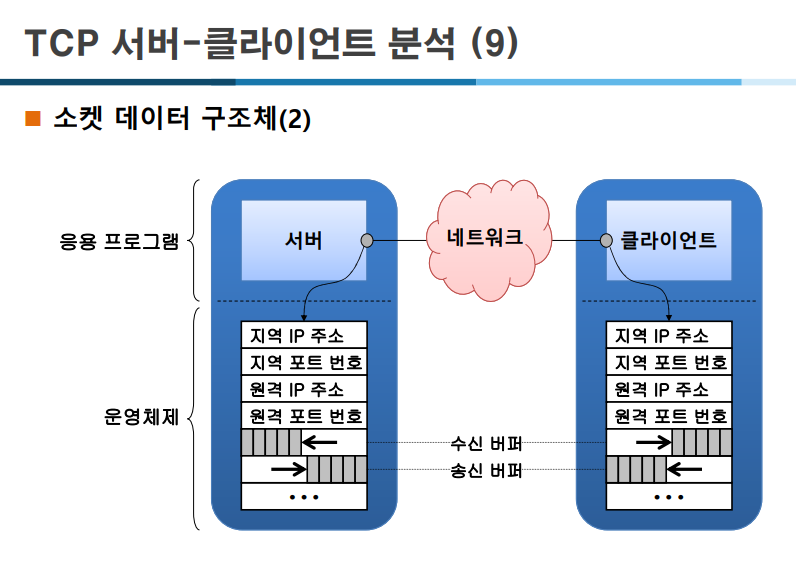

# TCP 에코 클라이언트 (Client)과 사용자 애플리케이션 버퍼 (buf)

```jsx
#include "..\Common.h"

char* SERVERIP = (char*)"127.0.0.1";
#define SERVERPORT 9000
#define BUFSIZE    512

int main(int argc, char* argv[])
{
	int retval;

	// 명령행 인수가 있으면 IP 주소로 사용
	if (argc > 1) SERVERIP = argv[1];

	// 윈속 초기화
	WSADATA wsa;
	if (WSAStartup(MAKEWORD(2, 2), &wsa) != 0)
		return 1;

	// 소켓 생성
	SOCKET sock = socket(AF_INET, SOCK_STREAM, 0);
	if (sock == INVALID_SOCKET) err_quit("socket()");

	// connect()
	struct sockaddr_in serveraddr;
	memset(&serveraddr, 0, sizeof(serveraddr));
	serveraddr.sin_family = AF_INET;
	inet_pton(AF_INET, SERVERIP, &serveraddr.sin_addr);
	serveraddr.sin_port = htons(SERVERPORT);
	retval = connect(sock, (struct sockaddr*)&serveraddr, sizeof(serveraddr));
	if (retval == SOCKET_ERROR) err_quit("connect()");

	// 데이터 통신에 사용할 변수
	char buf[BUFSIZE + 1];
	int len;

	// 서버와 데이터 통신
	while (1) {
		// 데이터 입력
		printf("\n[보낼 데이터] ");
		if (fgets(buf, BUFSIZE + 1, stdin) == NULL)
			break;

		// '\n' 문자 제거
		len = (int)strlen(buf);
		if (buf[len - 1] == '\n')
			buf[len - 1] = '\0';
		if (strlen(buf) == 0)
			break;

		// 데이터 보내기
		retval = send(sock, buf, (int)strlen(buf), 0);
		if (retval == SOCKET_ERROR) {
			err_display("send()");
			break;
		}
		printf("[TCP 클라이언트] %d바이트를 보냈습니다.\n", retval);

		// 데이터 받기
		retval = recv(sock, buf, retval, MSG_WAITALL);
		if (retval == SOCKET_ERROR) {
			err_display("recv()");
			break;
		}
		else if (retval == 0)
			break;

		// 받은 데이터 출력
		buf[retval] = '\0';
		printf("[TCP 클라이언트] %d바이트를 받았습니다.\n", retval);
		printf("[받은 데이터] %s\n", buf);
	}

	// 소켓 닫기
	closesocket(sock);

	// 윈속 종료
	WSACleanup();
	return 0;
}

```

1. **개행 제거(Windows/Unix)**
    - `fgets`는 텍스트 모드에서 `\n`만 남김 (Windows의 `\r\n` → `\n`으로 변환).
        - 견고하게 하려면 `\r`와 `\n` 둘 다 제거하는 트림이 안전
2. **빈 문자열 처리**
    - `len==0`일 때 `buf[len-1]`에 접근하면 **오류**.
3. **부분 전송(partial send)**
    - `send()`는 요청한 바이트 수보다 **적게** 보낼 수 있음.
4. **긴 입력 줄**
    - 입력이 `BUFSIZE`를 초과하면 `fgets`가 줄을 **잘라서** 읽음.
        - 남은 입력을 처리/버리거나 안내가 필요.

---

## 1. 사용자 애플리케이션의 통신 버퍼 (buf) 준비

```c
char **buf**[BUFSIZE + 1];
int len;

```

- `buf`: 데이터를 보내고 받을 때 사용할 **사용자 애플리케이션 버퍼**.
    - `+1`은 문자열 끝에 들어갈 `\0`을 위한 공간
- `len`: 입력 문자열의 길이 저장용 변수.

---

## 2. 서버와 통신 루프

```c
while (1) {

```

- 클라이언트가 계속해서 데이터를 보내고 받을 수 있도록 무한 루프.

---

## 3. 사용자 입력 받기

```c
printf("\n[보낼 데이터] ");
if (fgets(buf, BUFSIZE + 1, stdin) == NULL)
    break;

```

- 표준 입력에서 한 줄을 읽어옴.
    - `Ctrl+Z`(윈도우) 또는 `Ctrl+D`(리눅스) → `fgets`가 `NULL` 반환 → 루프 종료.

---

## 4. 개행 문자 제거 & 빈 문자열 확인

```c
len = (int)strlen(**buf**);
if (**buf**[len - 1] == '\n')
    **buf**[len - 1] = '\0';
if (strlen(buf) == 0)
    break;

```

- `fgets`는 줄 끝의 `\n`을 같이 읽기 때문에 제거
    - 만약 클라이언트 입력이 엔터(`\r\n 윈도우, \n 리눅스`) 만 있었다면, `\n`을 **buf**[len - 1] = '\0'으로  `\n`을 제거하기 때문에, 문자열 길이 (strlen(buf) == 0)가 0이 되어 루프 종료
    - 클라이언트가 TCP 연결을 종료하는 것을 의미함

---

## 5. 데이터 보내기

```c
retval = send(sock, buf, (int)strlen(buf), 0);
if (retval == SOCKET_ERROR) {
    err_display("send()");
    break;
}
printf("[TCP 클라이언트] %d바이트를 보냈습니다.\n", retval);

```

- `send()`로 서버에 입력 문자열 전송.
    - 실패하면 오류 메시지를 찍고 루프 종료.
    - 성공 시 실제 전송한 바이트 수 출력.

---

## 6. 서버 응답 받기

```c
retval = recv(sock, buf, retval, **MSG_WAITALL**);
if (retval == SOCKET_ERROR) {
    err_display("recv()");
    break;
}
else if (retval == 0)
    break;

```

- 서버에서 데이터를 수신.
    - `MSG_WAITALL` 플래그를 사용했기 때문에 **`send`한 만큼의 바이트가 다 도착할 때까지 대기**.
    - 오류(`SOCKET_ERROR`) → 종료.
    - `retval == 0` → 서버가 연결을 끊은 것 → 종료.

---

## 7. 받은 데이터 출력

```c
buf[retval] = '\0';
printf("[TCP 클라이언트] %d바이트를 받았습니다.\n", retval);
printf("[받은 데이터] %s\n", buf);

```

- 수신한 데이터의 끝에 널문자(`\0`) 추가해서 **문자열로 만듦.**
- 수신한 바이트 수와 실제 받은 문자열을 출력.

---

## 8. 종료 처리

```c
closesocket(sock);
WSACleanup();
return 0;

```

- 소켓을 닫고, Winsock 라이브러리를 종료한 후 프로그램 종료.

---

- **에코 클라이언트 예제**
    - 사용자 입력 → 서버로 전송 (`send`)
    - 서버 응답 → 클라이언트 수신 (`recv`)
    - 받은 데이터 출력
    - 빈 문자열 입력, 오류, 서버 종료 시 루프가 끝나고 자원 정리 후 종료

### 사용자 애플리케이션 :  동일 buf 사용

```jsx
retval = send(sock, buf, (int)strlen(buf), 0); 
retval = recv(sock, buf, retval, MSG_WAITALL);
```

- **같은 `buf` 로** 한 버퍼를 **전송에도 쓰고, 곧바로 수신에도 재사용**.
    - `send(sock, buf, ...)`가 **반환되면** 사용자 애플리케이션`buf` 내용은 커널의 TCP 송신버퍼로 **이미 복사**된 상태
        - 사용자 애플리케이션 공간의 `buf`는 더 이상 전송에 사용되지 않음.
        - 곧바로 재사용 가능.
    - `recv(sock, buf, ...)`를 호출하면 사용자 애플리케이션 **`buf` 위에** TCP **수신 데이터가 덮어쓰기** 됨.
        - 이전에 보낸 내용은 남지 않음
        - 수신 후 문자열로 쓰려면 널 종료 `buf[n] = '\0'` 필요



## 사용자 애플리케이션의 recv(), send()와 커널 TCP 버퍼

- 실제 데이터는 운영체제 커널 내부의 **TCP 송신 버퍼(TCP send buffer)**, **TCP** 수신 버퍼(TCP receive buffer)를 통해 이동함.
    - `send()`와 `recv()`가 같은 사용자 버퍼 주소를 쓰더라도, **커널 내부에서는 송신과 수신 버퍼가 엄격히 구분**되어 있음.

---

### 1) `send(sock, buf, len, 0)`

- `send`() 함수가 작성되고 있는 곳은 사용자 애플리케이션
    - 사용자 애플리케이션 `buf`의 내용을  TCP **송신 버퍼**로 복사 후 `sock`을 통해 데이터를 `send`
        - `buf`의 내용을 **커널의 송신 버퍼**로 복사함.
        - 복사 완료 후에는, 애플리케이션의 `buf`는 더 이상 네트워크 I/O와 관련이 없음.
        - `send()` 호출 직후 `buf`를 덮어써도, 전송에는 영향이 없음.

### 2) `recv(sock, buf, len, flags)`

- `recv`() 함수가 작성되고 있는 곳은 사용자 애플리케이션
    - `sock`을 통해 TCP **수신 버퍼**에 도착한 데이터를  사용자 애플리케이션 `buf`에 복사
        - 커널의 **수신 버퍼**에 도착해 있는 데이터를 `buf`로 복사함.
        - 커널 → 사용자 공간으로 역방향 복사가 일어남.
        - `buf`의 기존 내용은 덮어씌워지게 됨.

### 3) 사용자 애플리케이션 : 같은 버퍼를 사용

```c
retval = send(sock, buf, (int)strlen(buf), 0);
retval = recv(sock, buf, retval, MSG_WAITALL);

```

- 첫 번째 `send()`에서는 사용자 애플리케이션 `buf` → TCP  **송신 버퍼**.
- 두 번째 `recv()`에서는 TCP  **수신 버퍼** → 사용자 애플리케이션 `buf`
    - 둘 다 같은 `buf`메모리 주소를 넘겨줬지만, 각 함수는 **별도의 복사 동작**을 함.
- **커널 내부에서** TCP **송수신 버퍼는 완전히 분리되어 있고**, 애플리케이션 쪽 `buf`는 단순히 복사할 대상과원본 메모리로만 사용됨

---

- `send()`와 `recv()`에 같은 사용자 애플리케이션 버퍼 주소를 줘도 문제는 없음.
    - 실제로는 **내부 커널 송신 버퍼 / 수신 버퍼가 완전히 분리**되어 있고, 애플리케이션 버퍼는 매번 단순 복사 역할만 함.
    

### TCPServer_Variable

```jsx
#include "..\Common.h"

#define SERVERPORT 9000
#define BUFSIZE    512

// 내부 구현용 함수
int _recv_ahead(SOCKET s, char* p)
{
	__declspec(thread) static int nbytes = 0;
	__declspec(thread) static char buf[1024];
	__declspec(thread) static char* ptr;

	if (nbytes == 0 || nbytes == SOCKET_ERROR) {
		nbytes = recv(s, buf, sizeof(buf), 0);
		if (nbytes == SOCKET_ERROR) {
			return SOCKET_ERROR;
		}
		else if (nbytes == 0)
			return 0;
		ptr = buf;
	}

	--nbytes;
	*p = *ptr++;
	return 1;
}

// 사용자 정의 데이터 수신 함수
int recvline(SOCKET s, char* buf, int maxlen)
{
	int n, nbytes;
	char c, * ptr = buf;

	for (n = 1; n < maxlen; n++) {
		nbytes = _recv_ahead(s, &c);
		if (nbytes == 1) {
			*ptr++ = c;
			if (c == '\n')
				break;
		}
		else if (nbytes == 0) {
			*ptr = 0;
			return n - 1;
		}
		else
			return SOCKET_ERROR;
	}

	*ptr = 0;
	return n;
}

int main(int argc, char* argv[])
{
	int retval;

	// 윈속 초기화
	WSADATA wsa;
	if (WSAStartup(MAKEWORD(2, 2), &wsa) != 0)
		return 1;

	// 소켓 생성
	SOCKET listen_sock = socket(AF_INET, SOCK_STREAM, 0);
	if (listen_sock == INVALID_SOCKET) err_quit("socket()");

	// bind()
	struct sockaddr_in serveraddr;
	memset(&serveraddr, 0, sizeof(serveraddr));
	serveraddr.sin_family = AF_INET;
	serveraddr.sin_addr.s_addr = htonl(INADDR_ANY);
	serveraddr.sin_port = htons(SERVERPORT);
	retval = bind(listen_sock, (struct sockaddr*)&serveraddr, sizeof(serveraddr));
	if (retval == SOCKET_ERROR) err_quit("bind()");

	// listen()
	retval = listen(listen_sock, SOMAXCONN);
	if (retval == SOCKET_ERROR) err_quit("listen()");

	// 데이터 통신에 사용할 변수
	SOCKET client_sock;
	struct sockaddr_in clientaddr;
	int addrlen;
	char buf[BUFSIZE + 1];

	while (1) {
		// accept()
		addrlen = sizeof(clientaddr);
		client_sock = accept(listen_sock, (struct sockaddr*)&clientaddr, &addrlen);
		if (client_sock == INVALID_SOCKET) {
			err_display("accept()");
			break;
		}

		// 접속한 클라이언트 정보 출력
		char addr[INET_ADDRSTRLEN];
		inet_ntop(AF_INET, &clientaddr.sin_addr, addr, sizeof(addr));
		printf("\n[TCP 서버] 클라이언트 접속: IP 주소=%s, 포트 번호=%d\n",
			addr, ntohs(clientaddr.sin_port));

		// 클라이언트와 데이터 통신
		while (1) {
			// 데이터 받기
			retval = recvline(client_sock, buf, BUFSIZE + 1);
			if (retval == SOCKET_ERROR) {
				err_display("recv()");
				break;
			}
			else if (retval == 0)
				break;

			// 받은 데이터 출력
			printf("[TCP/%s:%d] %s", addr, ntohs(clientaddr.sin_port), buf);
		}

		// 소켓 닫기
		closesocket(client_sock);
		printf("[TCP 서버] 클라이언트 종료: IP 주소=%s, 포트 번호=%d\n",
			addr, ntohs(clientaddr.sin_port));
	}

	// 소켓 닫기
	closesocket(listen_sock);

	// 윈속 종료
	WSACleanup();
	return 0;
}

```
