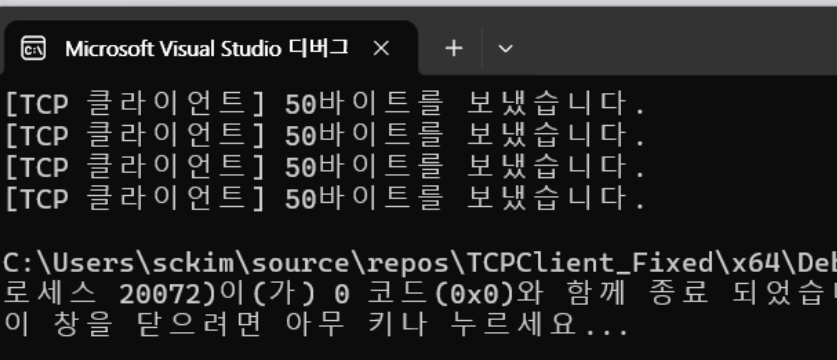

# 5장 데이터 전송하기

## 고정 길이 데이터 전송

- 클라이언트 코드

```jsx
#include "..\..\Common.h"

char* SERVERIP = (char*)"127.0.0.1";
#define SERVERPORT 9000
#define BUFSIZE    50

int main(int argc, char* argv[])
{
	int retval;

	// 명령행 인수가 있으면 IP 주소로 사용
	if (argc > 1) SERVERIP = argv[1];

	// 윈속 초기화
	WSADATA wsa;
	if (WSAStartup(MAKEWORD(2, 2), &wsa) != 0)
		return 1;

	// 소켓 생성
	SOCKET sock = socket(AF_INET, SOCK_STREAM, 0);
	if (sock == INVALID_SOCKET) err_quit("socket()");

	// connect()
	struct sockaddr_in serveraddr;
	memset(&serveraddr, 0, sizeof(serveraddr));
	serveraddr.sin_family = AF_INET;
	inet_pton(AF_INET, SERVERIP, &serveraddr.sin_addr);
	serveraddr.sin_port = htons(SERVERPORT);
	retval = connect(sock, (struct sockaddr*)&serveraddr, sizeof(serveraddr));
	if (retval == SOCKET_ERROR) err_quit("connect()");

	// 데이터 통신에 사용할 변수
	char buf[BUFSIZE];
	const char* testdata[] = {
		"안녕하세요",
		"반가워요",
		"오늘따라 할 이야기가 많을 것 같네요",
		"저도 그렇네요",
	};

	// 서버와 데이터 통신
	for (int i = 0; i < 4; i++) {
		// 데이터 입력(시뮬레이션)
		memset(buf, '#', sizeof(buf));
		strncpy(buf, testdata[i], strlen(testdata[i]));

		// 데이터 보내기
		retval = send(sock, buf, BUFSIZE, 0);
		if (retval == SOCKET_ERROR) {
			err_display("send()");
			break;
		}
		printf("[TCP 클라이언트] %d바이트를 보냈습니다.\n", retval);
	}

	// 소켓 닫기
	closesocket(sock);

	// 윈속 종료
	WSACleanup();
	return 0;
}

```

- 클라이언트 결과 화면



- 서버 코드

```jsx
#include "..\..\Common.h"

#define SERVERPORT 9000
#define BUFSIZE    50

int main(int argc, char* argv[])
{
	int retval;

	// 윈속 초기화
	WSADATA wsa;
	if (WSAStartup(MAKEWORD(2, 2), &wsa) != 0)
		return 1;

	// 소켓 생성
	SOCKET listen_sock = socket(AF_INET, SOCK_STREAM, 0);
	if (listen_sock == INVALID_SOCKET) err_quit("socket()");

	// bind()
	struct sockaddr_in serveraddr;
	memset(&serveraddr, 0, sizeof(serveraddr));
	serveraddr.sin_family = AF_INET;
	serveraddr.sin_addr.s_addr = htonl(INADDR_ANY);
	serveraddr.sin_port = htons(SERVERPORT);
	retval = bind(listen_sock, (struct sockaddr*)&serveraddr, sizeof(serveraddr));
	if (retval == SOCKET_ERROR) err_quit("bind()");

	// listen()
	retval = listen(listen_sock, SOMAXCONN);
	if (retval == SOCKET_ERROR) err_quit("listen()");

	// 데이터 통신에 사용할 변수
	SOCKET client_sock;
	struct sockaddr_in clientaddr;
	int addrlen;
	char buf[BUFSIZE + 1];

	while (1) {
		// accept()
		addrlen = sizeof(clientaddr);
		client_sock = accept(listen_sock, (struct sockaddr*)&clientaddr, &addrlen);
		if (client_sock == INVALID_SOCKET) {
			err_display("accept()");
			break;
		}

		// 접속한 클라이언트 정보 출력
		char addr[INET_ADDRSTRLEN];
		inet_ntop(AF_INET, &clientaddr.sin_addr, addr, sizeof(addr));
		printf("\n[TCP 서버] 클라이언트 접속: IP 주소=%s, 포트 번호=%d\n",
			addr, ntohs(clientaddr.sin_port));

		// 클라이언트와 데이터 통신
		while (1) {
			// 데이터 받기
			retval = recv(client_sock, buf, BUFSIZE, MSG_WAITALL);
			if (retval == SOCKET_ERROR) {
				err_display("recv()");
				break;
			}
			else if (retval == 0)
				break;

			// 받은 데이터 출력
			buf[retval] = '\0';
			printf("[TCP/%s:%d] %s\n", addr, ntohs(clientaddr.sin_port), buf);
		}

		// 소켓 닫기
		closesocket(client_sock);
		printf("[TCP 서버] 클라이언트 종료: IP 주소=%s, 포트 번호=%d\n",
			addr, ntohs(clientaddr.sin_port));
	}

	// 소켓 닫기
	closesocket(listen_sock);

	// 윈속 종료
	WSACleanup();
	return 0;
}

```

- 서버 결과 화면


### 고정길이 데이터 전송 장단점

- 장점
    - 컨트롤 오버헤드가 발생하지 않음
    - 동일한 클라이언트 소켓을 사용하므로,
        - TCP 3-Way Handshake, TCP 4-Way Handshake 컨트롤 오버헤드가 발생하지 않음
- 단점
    - 데이터 오버헤드가 발생함
    - 보낼 데이터의 바이트 개수 이상의 데이터 오버헤드가 발생함

## 가변 길이 데이터 전송 연습 (실습 5-2)

- send 함수 프로토타입


- 클라이언트 화면


- 클라이언트 코드
    - **줄바꿈(‘\n’)만 붙여 보내는 가변 길이 방식 클라이언트**

```jsx
#include "..\..\Common.h"

char* SERVERIP = (char*)"127.0.0.1";
#define SERVERPORT 9001
#define BUFSIZE    50

int main(int argc, char* argv[])
{
	int retval;

	// 명령행 인수가 있으면 IP 주소로 사용
	if (argc > 1) SERVERIP = argv[1];

	// 윈속 초기화
	WSADATA wsa;
	if (WSAStartup(MAKEWORD(2, 2), &wsa) != 0)
		return 1;

	// 소켓 생성
	SOCKET sock = socket(AF_INET, SOCK_STREAM, 0);
	if (sock == INVALID_SOCKET) err_quit("socket()");

	// connect()
	struct sockaddr_in serveraddr;
	memset(&serveraddr, 0, sizeof(serveraddr));
	serveraddr.sin_family = AF_INET;
	inet_pton(AF_INET, SERVERIP, &serveraddr.sin_addr);
	serveraddr.sin_port = htons(SERVERPORT);
	retval = connect(sock, (struct sockaddr*)&serveraddr, sizeof(serveraddr));
	if (retval == SOCKET_ERROR) err_quit("connect()");

	// 데이터 통신에 사용할 변수
	char buf[BUFSIZE];
	const char* testdata[] = {
		"안녕하세요",
		"반가워요",
		"오늘따라 할 이야기가 많을 것 같네요",
		"저도 그렇네요",
	};
	int len;

	// 서버와 데이터 통신
	for (int i = 0; i < 4; i++) {
		// 데이터 입력(시뮬레이션)
		len = (int)strlen(testdata[i]);
		strncpy(buf, testdata[i], len);
		buf[len++] = '\n';  // **줄바꿈(‘\n’)만 붙여 보내는 가변 길이 방식 클라이언트** 

		// 데이터 보내기
		retval = send(sock, buf, len, 0);
                       // send()함수의 리턴값 retval 은 보낸 바이트 수를 나타냄 
		if (retval == SOCKET_ERROR) {
			err_display("send()");
			break;
		}
		printf("[TCP 클라이언트] %d바이트를 보냈습니다.\n", retval);

	}

	// 소켓 닫기
	closesocket(sock);

	// 윈속 종료
	WSACleanup();
	return 0;
}

```

- 가변 길이 서버 코드
    - **포트 9001**에서 **개행 문자(‘\n’)로 끝나는 라인 단위 프로토콜**을 수신하는 구조
    - 클라이언트는 각 메시지 끝에 반드시 `'\n'`을 붙여서 보내야 하고, 서버는 `recvline()`으로 한 줄씩 읽어 출력.

```jsx
#include "..\Common.h"

#define SERVERPORT 9001
#define BUFSIZE    512

// 내부 구현용 함수
int _recv_ahead(SOCKET s, char* p)
{
	__declspec(thread) static int nbytes = 0;
	__declspec(thread) static char buf[1024];
	__declspec(thread) static char* ptr;

	if (nbytes == 0 || nbytes == SOCKET_ERROR) {
		nbytes = recv(s, buf, sizeof(buf), 0);
		if (nbytes == SOCKET_ERROR) {
			return SOCKET_ERROR;
		}
		else if (nbytes == 0)
			return 0;
		ptr = buf;
	}

	--nbytes;
	*p = *ptr++;
	return 1;
}

// 사용자 정의 데이터 수신 함수
int recvline(SOCKET s, char* buf, int maxlen)
{
	int n, nbytes;
	char c, * ptr = buf;

	for (n = 1; n < maxlen; n++) {
		nbytes = _recv_ahead(s, &c);
		if (nbytes == 1) {
			*ptr++ = c;
			if (c == '\n')  **// 클라이언트는 각 메시지 끝에 반드시 '\n'을 붙여서 보내야 하고, 
			서버는 recvline()으로 한 줄씩 읽어 출력.**
				break;
		}
		else if (nbytes == 0) {
			*ptr = 0;
			return n - 1;
		}
		else
			return SOCKET_ERROR;
	}

	*ptr = 0;
	return n;
}

int main(int argc, char* argv[])
{
	int retval;

	// 윈속 초기화
	WSADATA wsa;
	if (WSAStartup(MAKEWORD(2, 2), &wsa) != 0)
		return 1;

	// 소켓 생성
	SOCKET listen_sock = socket(AF_INET, SOCK_STREAM, 0);
	if (listen_sock == INVALID_SOCKET) err_quit("socket()");

	// bind()
	struct sockaddr_in serveraddr;
	memset(&serveraddr, 0, sizeof(serveraddr));
	serveraddr.sin_family = AF_INET;
	serveraddr.sin_addr.s_addr = htonl(INADDR_ANY);
	serveraddr.sin_port = htons(SERVERPORT);
	retval = bind(listen_sock, (struct sockaddr*)&serveraddr, sizeof(serveraddr));
	if (retval == SOCKET_ERROR) err_quit("bind()");

	// listen()
	retval = listen(listen_sock, SOMAXCONN);
	if (retval == SOCKET_ERROR) err_quit("listen()");

	// 데이터 통신에 사용할 변수
	SOCKET client_sock;
	struct sockaddr_in clientaddr;
	int addrlen;
	char buf[BUFSIZE + 1];

	while (1) {
		// accept()
		addrlen = sizeof(clientaddr);
		client_sock = accept(listen_sock, (struct sockaddr*)&clientaddr, &addrlen);
		if (client_sock == INVALID_SOCKET) {
			err_display("accept()");
			break;
		}

		// 접속한 클라이언트 정보 출력
		char addr[INET_ADDRSTRLEN];
		inet_ntop(AF_INET, &clientaddr.sin_addr, addr, sizeof(addr));
		printf("\n[TCP 서버] 클라이언트 접속: IP 주소=%s, 포트 번호=%d\n",
			addr, ntohs(clientaddr.sin_port));

		// 클라이언트와 데이터 통신
		while (1) {
			// 데이터 받기
			retval = recvline(client_sock, buf, BUFSIZE + 1);
			if (retval == SOCKET_ERROR) {
				err_display("recv()");
				break;
			}
			else if (retval == 0)
				break;

			// 받은 데이터 출력
			printf("[TCP/%s:%d] %s", addr, ntohs(clientaddr.sin_port), buf);
		}

		// 소켓 닫기
		closesocket(client_sock);
		printf("[TCP 서버] 클라이언트 종료: IP 주소=%s, 포트 번호=%d\n",
			addr, ntohs(clientaddr.sin_port));
	}

	// 소켓 닫기
	closesocket(listen_sock);

	// 윈속 종료
	WSACleanup();
	return 0;
}

```

- 서버 화면


### 가변길이 데이터 전송 장단점

- 장점 : 데이터 오버헤드가 발생하지 않음
    - 보낼 데이터의 바이트 개수 이상의 데이터 오버헤드가 발생하지 않음
    - 동일한 클라이언트 소켓을 사용하므로, TCP 3-Way Handshake, TCP 4-Way Handshake 컨트롤 오버헤드가 발생하지 않음
- 단점 : 데이터 오버헤드가 발생함
    - recv() API 함수의 재사용성이 떨어짐
    - recv() API 함수 이외에 수신 데이터 바이트 전송을 위한 추가적인 API 함수(recv_line()과 recv_ahead() 함수 등)를 필요로 하는 개발 비용 증가

## 고정길이+가변길이 데이터 전송  (실습 5-3)

 

- TCPServer_FixedVariable
    - 서버는 두개의 recv() 함수 사용
- 서버 코드

```jsx

#include "..\..\Common.h"

#define SERVERPORT 9002
#define BUFSIZE    512

int main(int argc, char* argv[])
{
	int retval;

	// 윈속 초기화
	WSADATA wsa;
	if (WSAStartup(MAKEWORD(2, 2), &wsa) != 0)
		return 1;

	// 소켓 생성
	SOCKET listen_sock = socket(AF_INET, SOCK_STREAM, 0);
	if (listen_sock == INVALID_SOCKET) err_quit("socket()");

	// bind()
	struct sockaddr_in serveraddr;
	memset(&serveraddr, 0, sizeof(serveraddr));
	serveraddr.sin_family = AF_INET;
	serveraddr.sin_addr.s_addr = htonl(INADDR_ANY);
	serveraddr.sin_port = htons(SERVERPORT);
	retval = bind(listen_sock, (struct sockaddr*)&serveraddr, sizeof(serveraddr));
	if (retval == SOCKET_ERROR) err_quit("bind()");

	// listen()
	retval = listen(listen_sock, SOMAXCONN);
	if (retval == SOCKET_ERROR) err_quit("listen()");

	// 데이터 통신에 사용할 변수
	SOCKET client_sock;
	struct sockaddr_in clientaddr;
	int addrlen;
	int len; // 고정 길이 데이터
	char buf[BUFSIZE + 1]; // 가변 길이 데이터

	while (1) {
		// accept()
		addrlen = sizeof(clientaddr);
		client_sock = accept(listen_sock, (struct sockaddr*)&clientaddr, &addrlen);
		if (client_sock == INVALID_SOCKET) {
			err_display("accept()");
			break;
		}

		// 접속한 클라이언트 정보 출력
		char addr[INET_ADDRSTRLEN];
		inet_ntop(AF_INET, &clientaddr.sin_addr, addr, sizeof(addr));
		printf("\n[TCP 서버] 클라이언트 접속: IP 주소=%s, 포트 번호=%d\n",
			addr, ntohs(clientaddr.sin_port));

		// 클라이언트와 데이터 통신
		while (1) {
			// 데이터 받기(고정 길이)
			retval = recv(client_sock, (char*)&len, sizeof(int), MSG_WAITALL);
			if (retval == SOCKET_ERROR) {
				err_display("recv()");
				break;
			}
			else if (retval == 0)
				break;

			// 데이터 받기(가변 길이)
			retval = recv(client_sock, buf, len, MSG_WAITALL);
			if (retval == SOCKET_ERROR) {
				err_display("recv()");
				break;
			}
			else if (retval == 0)
				break;

			// 받은 데이터 출력
			buf[retval] = '\0';
			printf("[TCP/%s:%d] %s\n", addr, ntohs(clientaddr.sin_port), buf);
		}

		// 소켓 닫기
		closesocket(client_sock);
		printf("[TCP 서버] 클라이언트 종료: IP 주소=%s, 포트 번호=%d\n",
			addr, ntohs(clientaddr.sin_port));
	}

	// 소켓 닫기
	closesocket(listen_sock);

	// 윈속 종료
	WSACleanup();
	return 0;
}

```

- 서버 화면


- TCPClient_FixedVariable
    - 클라이언트는 두 개의 send() 함수 사용

- 클라이언트 코드

```jsx
#include "..\..\Common.h"

char* SERVERIP = (char*)"127.0.0.1";
#define SERVERPORT 9002
#define BUFSIZE    50

int main(int argc, char* argv[])
{
	int retval;

	// 명령행 인수가 있으면 IP 주소로 사용
	if (argc > 1) SERVERIP = argv[1];

	// 윈속 초기화
	WSADATA wsa;
	if (WSAStartup(MAKEWORD(2, 2), &wsa) != 0)
		return 1;

	// 소켓 생성
	SOCKET sock = socket(AF_INET, SOCK_STREAM, 0);
	if (sock == INVALID_SOCKET) err_quit("socket()");

	// connect()
	struct sockaddr_in serveraddr;
	memset(&serveraddr, 0, sizeof(serveraddr));
	serveraddr.sin_family = AF_INET;
	inet_pton(AF_INET, SERVERIP, &serveraddr.sin_addr);
	serveraddr.sin_port = htons(SERVERPORT);
	retval = connect(sock, (struct sockaddr*)&serveraddr, sizeof(serveraddr));
	if (retval == SOCKET_ERROR) err_quit("connect()");

	// 데이터 통신에 사용할 변수
	char buf[BUFSIZE];
	const char* testdata[] = {
		"안녕하세요",
		"반가워요",
		"오늘따라 할 이야기가 많을 것 같네요",
		"저도 그렇네요",
	};
	int len;

	// 서버와 데이터 통신
	for (int i = 0; i < 4; i++) {
		// 데이터 입력(시뮬레이션)
		len = (int)strlen(testdata[i]);
		printf("[데이터 입력(시뮬레이션)] 내용= %s len(길이)= %d바이트 \n", testdata[i], len);
		strncpy(buf, testdata[i], len);

		// 데이터 보내기(고정 길이)
		retval = send(sock, (char*)&len, sizeof(int), 0);
                       // len 주소에 있는 내용을 sock을 통해 sizeof(int) 길이만큼 send
		// 1. sock : 통신할 대상(서버)과 연결된 소켓 
		// 2. &len : 보낼 데이터를 담고 있는 응용 프로그램의 버퍼의 주소
		// 3. len : 보낼 데이터의 크기 

		printf("retval (데이터 보내기(고정 길이))= %d 바이트 \n", (int)sizeof(int) ); //*((char*)&len)

		if (retval == SOCKET_ERROR) {
			err_display("send()");
			break;
		}

		// 데이터 보내기(가변 길이)
		retval = send(sock, buf, len, 0);
                       // buf 주소에 있는 내용을 sock을 통해 len 길이만큼 send 
		printf("retval (데이터 보내기(가변 길이))= %d 바이트 \n", len);

		if (retval == SOCKET_ERROR) {
			err_display("send()");
			break;
		}
		printf("[TCP 클라이언트] %d+%d바이트를 "
			"보냈습니다.\n", (int)sizeof(int), retval);
	}

	// 소켓 닫기
	closesocket(sock);

	// 윈속 종료
	WSACleanup();
	return 0;
}

```

- 클라이언트 화면


### 고정길이+가변길이 데이터 전송 장단점

- 장점 : 컨트롤 오버헤드가 발생하지 않음
    - send() 함수를 두 번 사용하지만,
    - 동일한 클라이언트 소켓을 사용하므로,
    - TCP 3-Way Handshake, TCP 4-Way Handshake 컨트롤 오버헤드가 발생하지 않음
- 단점 : 데이터 오버헤드가 발생함
    - 보낼 데이터의 바이트 개수 이상의 데이터 오버헤드가 발생함

## 데이터 전송 후 종료

- 클라이언트 코드 : **TCPClient_CloseOnTransfer**

```jsx
#include "..\..\Common.h"

char* SERVERIP = (char*)"127.0.0.1";
#define SERVERPORT 9003
#define BUFSIZE    50

int main(int argc, char* argv[])
{
	int retval;

	// 명령행 인수가 있으면 IP 주소로 사용
	if (argc > 1) SERVERIP = argv[1];

	// 윈속 초기화
	WSADATA wsa;
	if (WSAStartup(MAKEWORD(2, 2), &wsa) != 0)
		return 1;

	// connect() 호출에 사용할 변수
	struct sockaddr_in serveraddr;
	memset(&serveraddr, 0, sizeof(serveraddr));
	serveraddr.sin_family = AF_INET;
	inet_pton(AF_INET, SERVERIP, &serveraddr.sin_addr);
	serveraddr.sin_port = htons(SERVERPORT);

	// 데이터 통신에 사용할 변수
	char buf[BUFSIZE];
	const char* testdata[] = {
		"안녕하세요",
		"반가워요",
		"오늘따라 할 이야기가 많을 것 같네요",
		"저도 그렇네요",
	};
	int len;

	// 서버와 데이터 통신
	for (int i = 0; i < 4; i++) {
		// 소켓 생성
		SOCKET sock = socket(AF_INET, SOCK_STREAM, 0);
		if (sock == INVALID_SOCKET) err_quit("socket()");

		// connect()
		retval = connect(sock, (struct sockaddr*)&serveraddr, sizeof(serveraddr));
		if (retval == SOCKET_ERROR) err_quit("connect()");

		// 데이터 입력(시뮬레이션)
		len = (int)strlen(testdata[i]);
		strncpy(buf, testdata[i], len);

		// 데이터 보내기
		retval = send(sock, buf, len, 0);
		if (retval == SOCKET_ERROR) {
			err_display("send()");
			break;
		}
		printf("[TCP 클라이언트] %d바이트를 보냈습니다.\n", retval);

		// 소켓 닫기
		closesocket(sock);
	}

	// 윈속 종료
	WSACleanup();
	return 0;
}

```

- 서버 코드 : TCPServer_CloseOnTransfer

```jsx
#include "..\Common.h"

#define SERVERPORT 9003
#define BUFSIZE    1024

int main(int argc, char* argv[])
{
	int retval;

	// 윈속 초기화
	WSADATA wsa;
	if (WSAStartup(MAKEWORD(2, 2), &wsa) != 0)
		return 1;

	// 소켓 생성
	SOCKET listen_sock = socket(AF_INET, SOCK_STREAM, 0);
	if (listen_sock == INVALID_SOCKET) err_quit("socket()");

	// bind()
	struct sockaddr_in serveraddr;
	memset(&serveraddr, 0, sizeof(serveraddr));
	serveraddr.sin_family = AF_INET;
	serveraddr.sin_addr.s_addr = htonl(INADDR_ANY);
	serveraddr.sin_port = htons(SERVERPORT);
	retval = bind(listen_sock, (struct sockaddr*)&serveraddr, sizeof(serveraddr));
	if (retval == SOCKET_ERROR) err_quit("bind()");

	// listen()
	retval = listen(listen_sock, SOMAXCONN);
	if (retval == SOCKET_ERROR) err_quit("listen()");

	// 데이터 통신에 사용할 변수
	SOCKET client_sock;
	struct sockaddr_in clientaddr;
	int addrlen;
	char buf[BUFSIZE + 1];

	while (1) {
		// accept()
		addrlen = sizeof(clientaddr);
		client_sock = accept(listen_sock, (struct sockaddr*)&clientaddr, &addrlen);
		if (client_sock == INVALID_SOCKET) {
			err_display("accept()");
			break;
		}

		// 접속한 클라이언트 정보 출력
		char addr[INET_ADDRSTRLEN];
		inet_ntop(AF_INET, &clientaddr.sin_addr, addr, sizeof(addr));
		printf("\n[TCP 서버] 클라이언트 접속: IP 주소=%s, 포트 번호=%d\n",
			addr, ntohs(clientaddr.sin_port));

		// 클라이언트와 데이터 통신
		while (1) {
			// 데이터 받기
			retval = recv(client_sock, buf, BUFSIZE, MSG_WAITALL);
			if (retval == SOCKET_ERROR) {
				err_display("recv()");
				break;
			}
			else if (retval == 0)
				break;

			// 받은 데이터 출력
			buf[retval] = '\0';
			printf("[TCP/%s:%d] %s\n", addr, ntohs(clientaddr.sin_port), buf);
		}

		// 소켓 닫기
		closesocket(client_sock);
		printf("[TCP 서버] 클라이언트 종료: IP 주소=%s, 포트 번호=%d\n",
			addr, ntohs(clientaddr.sin_port));
	}

	// 소켓 닫기
	closesocket(listen_sock);

	// 윈속 종료
	WSACleanup();
	return 0;
}

```

- 서버  화면


- 클라이언트 화면


- 데이터 전송 후 종료 서버 코드 구성
    - 접속한 클라이언트 정보 출력
    - 클라이언트와 데이터 통신
        - 데이터 받기
        - 받은 데이터 출력
    - 클라이언트 소켓 닫기
    - 고정 길이 데이터 전송 서버 코드와 동일
    
- 고정 길이 데이터 전송 서버
    - 접속한 클라이언트 정보 출력
    - 클라이언트와 데이터 통신
        - 데이터 받기
        - 받은 데이터 출력
    - 클라이언트 소켓 닫기

### 데이터 전송 후 종료 서버의 장 단점 (TCP 구조상)

- 장점 : 데이터 오버헤드가 발생하지 않음
    - 보낼 데이터의 바이트 개수 만큼만 보내고, 더 이상의 데이터 오버헤드는 발생되지 않음
- 단점 : 컨트롤 오버헤드의 발생
    - 아래 그림과 같이 클라이언트가 서버에 접속하기 위해서는 connect() 함수를 클라이언트에서 사용해야 하고, 서버에서는 accept()함수로 응대하여야 한다.
    - connect()함수를 사용하기 전에 서버까지의 경로 파악이 우선되어야 하기 때문에 TCP 3-Way Handshake가 선행된다.
    - 그리고 connect() 가 완료되면 서버는 클라이언트의 IP 주소와 Port 번호를 알게 되며 accept() 함수를 이용하여 새로운 client_socket을 생성한다.
    - 클라이언트가 send() 함수로 데이터를 전송하고, 그 이후에 소켓이 종료 될 때, TCP 4-Way Handshake가 진행된다.
    - 따라서 데이터를 보낼 때마다 새로운 클라이언트 소켓이 생성되기 위해 필요한 TCP 3-Way Handshake 컨트롤 오버헤드가 발생하고, 데이터 전송이 끝난 후 소켓이 종료 될 때, TCP 4-Way Handshake 컨트롤 오버헤드가 발생한다.
- 보낸 데이터가 n 건이면 n*TCP 3-Way Handshake, n*TCP 4-Way Handshake 컨트롤 오버헤드가 발생한다.
- 이는 곧 라우터에 부담을 주게 되며 네트워크 자원을 낭비하게 되는 원인이 된다.


### 전송방법에 따른 장 단점 비교

| 전송 방법 | 장점 | 단점 |
| --- | --- | --- |
| 고정길이 데이터 전송 | 컨트롤 오버헤드 발생하지 않음 | 데이터 오버헤드 발생 |
| 가변길이 데이터 전송 | 데이터 오버헤드 발생하지 않음 | 프로그래밍 복잡도 상승 (recv() API 함수의 재사용성이 떨어짐） |
| 고정길이+가변길이 데이터 전송 | 컨트롤 오버헤드 발생하지 않음 | 데이터 오버헤드 발생 |
| 전송 후 종료 서버 | 데이터 오버헤드 발생하지 않음 | 컨트롤 오버헤드 발생 (동일한 클라이언트 소켓을 사용하지 않음) |

### 고정길이 데이터 전송 장단점

- 장점
    - 컨트롤 오버헤드가 발생하지 않음
    - 동일한 클라이언트 소켓을 사용하므로,
        - TCP 3-Way Handshake, TCP 4-Way Handshake 컨트롤 오버헤드가 발생하지 않음
- 단점
    - 데이터 오버헤드가 발생함
    - 보낼 데이터의 바이트 개수 이상의 데이터 오버헤드가 발생함

### 가변길이 데이터 전송 장단점

- 장점 : 데이터 오버헤드가 발생하지 않음
    - 보낼 데이터의 바이트 개수 이상의 데이터 오버헤드가 발생하지 않음
    - 동일한 클라이언트 소켓을 사용하므로, TCP 3-Way Handshake, TCP 4-Way Handshake 컨트롤 오버헤드가 발생하지 않음
- 단점 : 데이터 오버헤드가 발생함
    - recv() API 함수의 재사용성이 떨어짐
    - recv() API 함수 이외에 수신 데이터 바이트 전송을 위한 추가적인 API 함수(recv_line()과 recv_ahead() 함수 등)를 필요로 하는 개발 비용 증가

### 고정길이+가변길이 데이터 전송 장단점

- 장점 : 컨트롤 오버헤드가 발생하지 않음
    - send() 함수를 두 번 사용하지만,
    - 동일한 클라이언트 소켓을 사용하므로,
    - TCP 3-Way Handshake, TCP 4-Way Handshake 컨트롤 오버헤드가 발생하지 않음
- 단점 : 데이터 오버헤드가 발생함
    - 보낼 데이터의 바이트 개수 이상의 데이터 오버헤드가 발생함

### 데이터 전송 후 종료 서버의 장 단점 (TCP 구조상)

- 장점 : 데이터 오버헤드가 발생하지 않음
    - 보낼 데이터의 바이트 개수 만큼만 보내고, 더 이상의 데이터 오버헤드는 발생되지 않음
- 단점 : 컨트롤 오버헤드의 발생
    - 아래 그림과 같이 클라이언트가 서버에 접속하기 위해서는 connect() 함수를 클라이언트에서 사용해야 하고, 서버에서는 accept()함수로 응대하여야 한다.
    - connect()함수를 사용하기 전에 서버까지의 경로 파악이 우선되어야 하기 때문에 TCP 3-Way Handshake가 선행된다.
    - 그리고 connect() 가 완료되면 서버는 클라이언트의 IP 주소와 Port 번호를 알게 되며 accept() 함수를 이용하여 새로운 client_socket을 생성한다.
    - 클라이언트가 send() 함수로 데이터를 전송하고, 그 이후에 소켓이 종료 될 때, TCP 4-Way Handshake가 진행된다.
    - 따라서 데이터를 보낼 때마다 새로운 클라이언트 소켓이 생성되기 위해 필요한 TCP 3-Way Handshake 컨트롤 오버헤드가 발생하고, 데이터 전송이 끝난 후 소켓이 종료 될 때, TCP 4-Way Handshake 컨트롤 오버헤드가 발생한다.
- 보낸 데이터가 n 건이면 n*TCP 3-Way Handshake, n*TCP 4-Way Handshake 컨트롤 오버헤드가 발생한다.
- 이는 곧 라우터에 부담을 주게 되며 네트워크 자원을 낭비하게 되는 원인이 된다.
