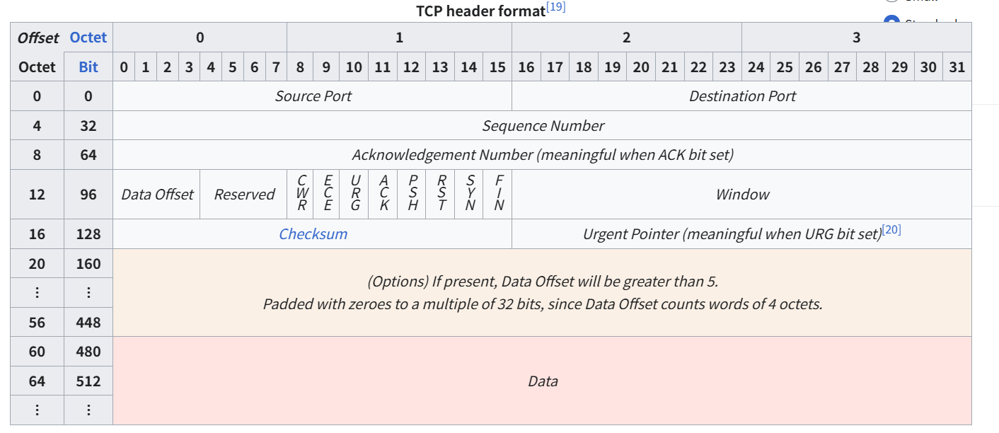

# TCP 메시지 경계 처리

## 스트림

- **연속된 바이트(byte)의 흐름**
    - TCP 소켓은 **메시지 단위**를 보존하지 않고, 단순히 바이트의 흐름만 제공
    - 송신 측에서 `send()`를 여러 번 호출해도, 수신 측에서는 그 경계(boundary)를 알 수 없음

---

```c
// 송신 측
send(sock, "Hello", 5, 0);
send(sock, "World", 5, 0);

```

- 송신자는 `"Hello"`와 `"World"`를 따로 보냄
    - 하지만 수신 측에서는 이렇게 들어올 수 있음
    - `recv(sock, buf, 10, 0)` → `"HelloWorld"` (한 번에 합쳐짐)
    - `recv(sock, buf, 3, 0)` → `"Hel"`
    - 이후 또 `recv(sock, buf, 7, 0)` → `"loWorld"`
- **TCP는 메시지 단위가 없고, 연속된 바이트의 흐름(스트림)만 전달**

---

## 스트림 특징

- **연속성**: 끊김 없는 바이트 흐름으로 간주.
- **순서 보장**: 보낸 순서대로 도착.
- **신뢰성**: 손실 시 재전송, 흐름 제어, 혼잡 제어 수행.
- **경계 없음**: `send()` 호출 단위와 `recv()` 단위가 맞지 않음.

---

## 스트림과 버퍼링

- 운영체제는 **TCP 수신 버퍼**를 관리.
- `recv()`는 이 버퍼에서 **요청한 크기만큼** 가져오되, 버퍼에 있는 양만큼만 실제 반환함
- 프로그램은 **프로토콜 레벨에서 “경계”를 직접 정의**
    - 줄바꿈(`\n`) 단위로 읽기 (`recvline()` 처럼)
    - 메시지 앞에 길이(헤더)를 붙여 보내고, 그 길이만큼 읽기

---

```
[ 송신 애플리케이션 ]
   send("Hello")
   send("World")
----------------------
[ TCP 계층 : 스트림화 ]
   바이트: H e l l o W o r l d
----------------------
[ 수신 애플리케이션 ]
   recv(10) → "HelloWorld"
   recv(3)  → "Hel"
   recv(7)  → "loWorld"

```

---

- **TCP는 스트림 기반** → 단순히 바이트 흐름을 제공.
    - `recv()`는 바이트 스트림을 원하는 크기만큼 잘라서 읽을 뿐, 메시지 경계는 없음.
    - `recvline()` 같은 함수가 필요한 이유는, 스트림 위에 우리만의 메시지 단위(프로토콜)를 정의하기 위해서

---

## 데이터그램

- 데이터그램은 **독립적인 메시지 단위**
- 한 번의 `sendto()`로 보낸 것이 **그 자체로 하나의 패킷**으로 전송되고, 수신 측은 `recvfrom()`으로 **그 단위 그대로** 받음.
- TCP처럼 바이트 흐름이 아니라, 메시지 경계(boundary)가 보존

---

## TCP 스트림과 UDP 데이터그램

| 구분 | TCP (스트림) | UDP (데이터그램) |
| --- | --- | --- |
| 단위 | 바이트 흐름 (경계 없음) | 메시지(패킷) 단위 (경계 유지) |
| 신뢰성 | 보장 (재전송, 순서 보장, 흐름/혼잡 제어) | 비보장 (손실, 순서 뒤바뀜 가능) |
| 연결 | 연결형 (connect 필요) | 비연결형 (sendto/recvfrom으로 바로 전송 가능) |
| 사용 예 | 웹, 파일전송, 메일 | DNS, 스트리밍, 게임, VoIP |

---

### UDP 송신 측

```c
sendto(sock, "Hello", 5, 0, ...);
sendto(sock, "World", 5, 0, ...);

```

### UDP 수신 측

```c
recvfrom(sock, buf, 10, 0, ...); // → "Hello"
recvfrom(sock, buf, 10, 0, ...); // → "World"

```

- UDP에서는 **보낸 단위와 받은 단위가 동일**.
    - TCP와 달리 `"HelloWorld"`로 합쳐지지 않고, 항상 **패킷 단위**로 읽힘

---

- **장점**
    - 빠름 (헤더가 작고 제어 절차가 단순)
    - 메시지 경계 유지
    - 연결 관리가 필요 없음 → 서버가 동시에 여러 클라이언트와 쉽게 통신 가능
- **단점**
    - 신뢰성 없음 (손실, 중복, 순서 뒤바뀜 가능)
    - 자체적으로 큰 데이터를 쪼개고 재조립해야 함 (MTU 제한)

---

- **TCP (스트림)**
    - 수도관으로 물이 흐르듯이, 계속 이어진 데이터 흐름
    - 컵에 따라서 나누는 건 수신 측의 몫.
- **UDP (데이터그램)**
    - 우체국 소포처럼, 한 번에 보낸 것이 하나의 봉투로 도착
    - 봉투 단위가 항상 보존됨.

---

- **스트림**
    - TCP : 경계 없는 바이트 흐름
- **데이터그램**
    - UDP : 경계가 있는 메시지 단위

---

## UDP 헤더 구조

- 매우 간단해서 **고정 길이 8바이트(64비트)**

| 필드 | 크기 (비트) | 설명 |
| --- | --- | --- |
| Source Port | 16 | 송신자 포트 번호 |
| Destination Port | 16 | 수신자 포트 번호 |
| Length | 16 | UDP 헤더 + 데이터 전체 길이 (바이트 단위) |
| Checksum | 16 | 오류 검출용 체크섬 (IPv4에서는 선택적, IPv6에서는 필수) |

---

```
0      7 8     15 16    23 24    31
+--------+--------+--------+--------+
|     Source Port     |   Destination Port  |
+--------+--------+--------+--------+
|         Length         |      Checksum     |
+--------+--------+--------+--------+
|                                     |
|            Data (Payload)           |
|                                     |
+-------------------------------------+

```

---

- **Source Port (송신 포트)**
    - 송신 측 애플리케이션의 포트 번호
    - 클라이언트가 랜덤한 임시 포트(49152~65535 범위)를 사용
- **Destination Port (수신 포트)**
    - 수신 측 애플리케이션 포트 번호
    - DNS 서버(53), DHCP 서버(67/68), TFTP(69) 등
- **Length (길이)**
    - UDP 헤더(8바이트) + 데이터(payload) 전체 길이
    - 최소 값 = 8 (데이터가 없어도 헤더는 존재)
- **Checksum (체크섬)**
    - 데이터 전송 중 오류 검출을 위한 값
    - IPv4에서는 선택적(optional) → 0으로 설정할 수도 있음
    - IPv6에서는 필수(required)

---

- 매우 단순 → TCP보다 빠름
- 제어 정보가 거의 없음 → 연결 관리 X, 순서 보장 X, 재전송 X
- 대신 **애플리케이션이 직접 프로토콜을 정의**해야 하는 경우가 많음 (예: RTP, QUIC)

---

- UDP 헤더는 **8바이트** 고정 구조로, `Source Port`, `Destination Port`, `Length`, `Checksum` 네 개 필드만 있음.
- 덕분에 오버헤드가 작고 단순해서 **실시간 스트리밍, 게임, DNS 질의** 같은 곳에서 자주 쓰임

---

# TCP(전송 제어 프로토콜) 메시지

- **헤더(Header)와 데이터(Data)로 구성된 세그먼트(Segment) 형태**
    - 데이터는 응용 계층에서 내려온 실제 메시지를 담고 있으며, 헤더는 안정적인 통신을 위해 필요한 다양한 제어 정보를 포함.
- **TCP 세그먼트 구조**
    - TCP 헤더의 최소 크기는 20바이트이며, 옵션 필드를 포함하면 최대 60바이트까지 확장될 수 있음.
- **TCP 헤더 구조 다이어그램**



 `0               15               31
+----------------+----------------+`

| Source Port | Destination Port |+----------------+----------------+

| Sequence Number |+----------------+----------------+

| Acknowledgment Number |+----------------+----------------+

|Data Offset |Rsvd | U|A|P|R|S|F| Window Size || (4bit) |(6bit)|R|C|S|S|Y|I| (16bit) || | |G|K|H|T|N|N| |+----------------+----------------+

| Checksum | Urgent Pointer |+----------------+----------------+

| Options (0-320 bits) |+----------------+----------------+

| Padding |+----------------------------------+

| Data |+----------------------------------+

1. **TCP 헤더 필드**
    - **Source Port (16비트, 2바이트)**
        - 데이터를 보내는 출발지 애플리케이션의 **포트 번호.**
    - **Destination Port (16비트, 2바이트)**
        - 데이터를 받는 목적지 애플리케이션의 **포트 번호.**
    - **Sequence Number (32비트, 4바이트)**
        - 세그먼트에 포함된 데이터의 첫 번째 바이트에 대한 순서 번호.
        - 신뢰성 있는 데이터 전송을 위해 사용.
    - **Acknowledgment Number (32비트, 4바이트)**
        - 수신자가 다음에 받기를 기대하는 바이트의 순서 번호.
        - 이 번호를 통해 패킷의 정상 수신 여부를 확인.
    - **Data Offset (4비트)**
        - TCP 헤더의 길이 표현.
        - 헤더의 끝이 어디인지를 알려주어 데이터가 시작되는 위치를 파악할 수 있게 함.
    - **Reserved (6비트)**
        - 미래 사용을 위해 남겨둔 필드로, 항상 0으로 설정.
    - **Flags (6비트, 4비트, 6비트, 전체 2 바이트)**
        - 연결 설정, 데이터 전송 제어, 연결 종료 등 통신 상태를 제어하는 데 사용되는 제어 비트들.
            - **URG (Urgent)**
                - 긴급 포인터 필드가 유효함을 표현.
            - **ACK (Acknowledgement)**
                - 확인 응답 번호 필드가 유효함을 표현.
            - **PSH (Push)**
                - 버퍼링하지 않고 가능한 한 빨리 데이터를 응용 계층으로 전달하도록 요청함.
            - **RST (Reset)**
                - 연결을 재설정하는 데 사용.
            - **SYN (Synchronize)**
                - 연결을 설정하는 데 사용.
            - **FIN (Finish)**
                - 연결을 종료하는 데 사용.
    - **Window Size (16비트,  2 바이트)**
        - 수신자가 한 번에 받을 수 있는 데이터의 양(바이트)을 나타내어 흐름 제어에 사용.
    - **Checksum (16비트,  2 바이트)**
        - 데이터 전송 중 발생한 오류를 감지하기 위해 사용되는 필드.
    - **Urgent Pointer (16비트,  2 바이트)**
        - URG 플래그가 설정된 경우, 긴급한 데이터의 끝을 표시.
    - **Options (최대 40바이트)**
        - 최대 세그먼트 크기(MSS) 협상과 같은 추가 기능을 위해 사용되며, 가변적인 길이를 가짐.
    - **Padding**
        - 옵션 필드가 있는 경우, 헤더의 총 길이가 32비트(4바이트)의 배수가 되도록 채워넣는 데 사용.
2. **데이터**
    - **Payload (데이터)**: 실제 전송하려는 애플리케이션 데이터.
    - 헤더 다음 부분에 위치.

### TCP 프로토콜 **동작**


## TCP 소켓 상태

| 상태 (State) | 주체 (Endpoint) | 설명 |
| --- | --- | --- |
| **LISTEN** | 서버 | 원격 TCP 엔드포인트로부터의 연결 요청을 기다리는 중. |
| **SYN-SENT** | 클라이언트 | 연결 요청을 보낸 뒤, 이에 대한 일치하는 연결 요청을 기다리는 중. |
| **SYN-RECEIVED** | 서버 | 연결 요청을 받고 동시에 연결 요청을 보낸 후, 이에 대한 확인 응답(ACK)을 기다리는 중. |
| **ESTABLISHED** | 서버와 클라이언트 | 연결이 열린 상태. 수신된 데이터는 사용자에게 전달될 수 있으며, 실제 데이터 전송 단계의 정상적인 상태. |
| **FIN-WAIT-1** | 서버와 클라이언트 | 연결 종료 요청(FIN)을 보낸 뒤, 상대방의 종료 요청 또는 자신이 보낸 종료 요청에 대한 확인 응답을 기다리는 중. |
| **FIN-WAIT-2** | 서버와 클라이언트 | 연결 종료 요청을 보낸 뒤, 상대방의 종료 요청을 기다리는 중. |
| **CLOSE-WAIT** | 서버와 클라이언트 | 상대방의 연결 종료 요청을 받은 후, 로컬 애플리케이션의 종료 요청을 기다리는 중. |
| **CLOSING** | 서버와 클라이언트 | 양쪽 모두 동시에 연결 종료 요청을 보낸 상태. 상대방의 종료 요청에 대한 확인 응답을 기다리는 중. |
| **LAST-ACK** | 서버와 클라이언트 | 연결 종료 요청을 보낸 후, 그 요청에 대한 최종 확인 응답을 기다리는 중. |
| **TIME-WAIT** | 서버 또는 클라이언트 | 모든 잔여 패킷이 네트워크에서 사라졌음을 보장하기 위해 일정 시간 동안 대기하는 상태. |
| **CLOSED** | 서버와 클라이언트 | 연결 상태가 전혀 없는 상태. (소켓이 닫혀 있음) |
- **연결 설정 과정**
    - LISTEN → SYN-SENT → SYN-RECEIVED → ESTABLISHED
- **연결 종료 과정**
    - FIN-WAIT-1 → FIN-WAIT-2 / CLOSE-WAIT → CLOSING / LAST-ACK → TIME-WAIT → CLOSED


_-_sequence_diagram.svg.png)

---

**TCP 에코 클라이언트 (Client)과 사용자 애플리케이션 버퍼 (buf) 내용 중** 

- 데이터 보내기

```c
retval = send(**sock**, **buf**, (int)strlen(buf), 0);
if (retval == SOCKET_ERROR) {
    err_display("send()");
    break;
}
printf("[TCP 클라이언트] %d바이트를 보냈습니다.\n", retval);

```

---


### 1) `send(sock, buf, len, 0)`

- `send`() 함수가 작성되고 있는 곳은 사용자 애플리케이션
    - 사용자 애플리케이션 `buf`의 내용을  TCP **송신 버퍼**로 복사 후 `sock`을 통해 데이터를 `send`
        - `buf`의 내용을 **커널의 송신 버퍼**로 복사함.
        - 복사 완료 후에는, 애플리케이션의 `buf`는 더 이상 네트워크 I/O와 관련이 없음.
        - `send()` 호출 직후 `buf`를 덮어써도, 전송에는 영향이 없음.

- 서버 응답 받기
    - 서버에서 데이터를 수신.
        - `MSG_WAITALL` 플래그를 사용했기 때문에 **`send`한 만큼의 바이트가 다 도착할 때까지 대기.**
        - 오류(`SOCKET_ERROR`) : 종료.
        - `retval == 0`  : 서버가 연결을 끊은 것 → 종료.

```c
retval = recv(**sock, buf**, retval, **MSG_WAITALL**);
if (retval == SOCKET_ERROR) {
    err_display("recv()");
    break;
}
else if (retval == 0)
    break;

```

### 2) `recv(sock, buf, len, flags)`

- `recv`() 함수가 작성되고 있는 곳은 사용자 애플리케이션
    - `sock`을 통해 TCP **수신 버퍼**에 도착한 데이터를  사용자 애플리케이션 `buf`에 복사
        - 커널의 **수신 버퍼**에 도착해 있는 데이터를 `buf`로 복사함.
        - 커널 → 사용자 공간으로 역방향 복사가 일어남.
        - `buf`의 기존 내용은 덮어씌워지게 됨.

## TCP 데이터 송수신

- `send()`/`recv()`만이 아니라 송신 측 혼잡 윈도우(cwnd)와 수신 측 수신 윈도우(rwnd)라는 제약 조건을 동시에 고려

---

### 송신 측

- 송신 애플리케이션 buf에서 데이터를 `send()`하면
    - OS 커널의 TCP 송신 버퍼에 저장.
    - TCP는 이 데이터를 일정 크기(세그먼트)로 나눠 전송.
        - **보낼 수 있는 양**은 두 가지 제한 조건 중 더 작은 값에 의해 결정:
    
    ```
    송신 가능 데이터 ≤ min(cwnd, rwnd)
    
    ```
    
    - **cwnd (Congestion Window)**
        - **네트워크 혼잡 제어에 의해 결정.**
        - **네트워크가 막히지 않도록 송신 속도 제한.**
    - **rwnd (Receive Window)**
        - **수신 측이 광고(advertise)하는 수신 가능 버퍼 크기.**
        - **수신 애플리케이션이 처리 가능한 만큼만 보내도록 제한.**

---

### 네트워크

- 데이터는 IP 계층을 통해 전송되고, 손실되면 TCP가 재전송.
- RTT(round-trip time)와 손실률에 따라 혼잡 제어(cwnd)가 동적으로 변동.

---

### 수신 측

- TCP 세그먼트는 **수신 버퍼**에 저장.
- 애플리케이션이 `recv()` 호출해야만 이 데이터를 사용자 공간으로 꺼낼 수 있음.
- 수신 버퍼에 **남은 공간이 줄어들면**
    - ACK 메시지 안의 **Window Size 필드(rwnd) 값 감소**.
    - **송신 측은 다음 전송 때 이 값을 참고해 더 적게 보냄.**
    - 수신 버퍼가 꽉 차면 `rwnd = 0`
        - 송신 측은 전송을 멈추고 주기적으로 **Zero Window Probe**를 보냄.

---

## 메시지 구조

- TCP 세그먼트는 데이터뿐 아니라 제어 정보를 포함함
    - 특히 **ACK 패킷**에 있는 `Window Size` 필드가 **rwnd** 역할을 함.
- **보낼 때 (송신 측)**
    
    ```
    [SEQ=100, LEN=1000, ACK=0, Win=rwnd]
    
    ```
    
    - SEQ: 시퀀스 번호
    - LEN: 보낸 데이터 길이
    - **Win: 수신 측이 광고한 윈도우 크기**
- **받을 때 (수신 측 ACK)**
    
    ```
    [SEQ=200, ACK=1100, Win=8192]
    
    ```
    
    - ACK=1100
        - 1099까지 잘 받았으니, 다음은 1100을 주길 바란다. (그리고 1099가 보낸 1000바이트 잘 받았다)
    - **Win=8192**
        - **내 버퍼에 8192바이트 여유 있다**

---

## TCP 데이터 송수신

- 송신자는 `cwnd`와 `rwnd`를 비교해 보낼 양을 결정
- 송신 데이터
    - 세그먼트로 쪼개어 전송.
- 수신자는 받은 데이터
    - 수신 버퍼에 저장, ACK 응답 전송.
    - ACK 안에 **Window Size(rwnd)** 넣어 송신자에게 알려줌.
    - 송신자는 다음 전송 시 `min(cwnd, rwnd)`를 다시 계산.

---

- TCP 메시지 송수신 구조는 단순 데이터 교환이 아니라,
    - **혼잡 제어(cwnd, 네트워크 혼잡)**
    - **흐름 제어(rwnd, 수신 버퍼 크기)** 를 동시에 고려한 **양방향 제어 구조**

---


### TCP (Transmission Control Protocol) 특징

- **스트림 지향(stream-oriented)** 프로토콜이라 **메시지 사이에 명확한 경계를 두지 않음**.
- **바이트 스트림**
    - TCP는 **데이터를 연속적인 바이트 흐름으로 다룸.**
    - 애플리케이션이 보낸 메시지가 네트워크 전송 중 쪼개지거나 합쳐질 수 있음.
- **경계 없음**
    - 첫 번째 send()에서 보낸 데이터가 첫 번째 recv()에서 그대로 들어온다는 보장이 없음
    - 여러 번 `send()`한 데이터가 하나의 `recv()` 호출에서 합쳐질 수도 있고,
    - 반대로 한 번 `send()`한 데이터가 여러 `recv()`로 나뉘어 도착할 수도 있음.
- **순서 보장**
    - TCP는 패킷이 손실되면 재전송하고, 순서가 바뀌면 재정렬하여 **최종적으로는 올바른 순서로 전달**해 줌.
    - 하지만 "메시지 단위"를 유지해 주는 건 아님.

```python
# 송신 측
sock.send(b"Hello")
sock.send(b"World")

# 수신 측
data = sock.recv(1024)
print(data)

```

- 수신 측에서는 `b"HelloWorld"`가 한 번에 들어오거나,
- `b"Hello"`와 `b"World"`가 따로 들어오거나, `b"He"` + `b"lloWo"` + `b"rld"` 식으로 잘려 들어올 수도 있음.

### 경계 구분 방법

- 애플리케이션 레벨에서 **메시지 경계**를 정의하고 직접 처리해야 함.
    - **구분자(delimiter)** 사용
        - `\n`으로 메시지 끝 표시
    - **길이(prefix)** 사용
        - 메시지 앞에 길이를 붙여 수신 측이 필요한 만큼 읽도록 함

---

### TCP는 **바이트 스트림 기반**이라서 송신 측의 `send()` 호출 단위와 수신 측의 `recv()` 호출 단위는 전혀 일치하지 않음.

---

- **TCP는 패킷이 아니라 바이트 흐름(stream)을 전달**하기 때문
    - OS 내부 TCP 스택은 여러 번의 `send()`를 합쳐서 네트워크 패킷으로 내보낼 수도 있고,
    - 큰 데이터를 잘라 여러 패킷으로 나눌 수도 있음.
- **네트워크 전송 중 재조합 과정**이 일어남.
    - 수신 측 OS는 들어오는 TCP 세그먼트를 버퍼에 쌓아 두고, 애플리케이션의 `recv()` 요청 크기만큼 꺼내줌
    - `recv()`는 **요청한 크기만큼만 반환하지, 메시지 단위를 보장하지 않음**

---

- 송신 측:

```python
sock.send(b"AAA")
sock.send(b"BBB")

```

- 수신 측
    - 3바이트씩 읽는 경우

```python
print(sock.recv(3))  # b"AAA"
print(sock.recv(3))  # b"BBB"

```

- 상황에 따라:
    - 한 번에 `sock.recv(6)` 하면
        - `b"AAABBB"` 가 들어올 수도 있고
    - `sock.recv(2)` → `b"AA"`, 그다음 `sock.recv(4)` → `b"ABBB"` 이렇게 잘려 들어올 수도 있음

---

**TCP 위에서 메시지 단위를 직접 정의해야 함**

- **구분자(Delimiter) 기반**: 줄바꿈(`\n`)으로 끝나는 텍스트 프로토콜 (HTTP 1.x, SMTP 등).
- **길이(Length Prefix) 기반**: 메시지 앞에 고정 크기의 헤더를 붙여 전체 길이를 알려주는 방식 (gRPC, TCP 바이너리 프로토콜 등).

---

- TCP는 **순서만 보장하는 바이트 스트림**이고, **메시지 경계는 애플리케이션이 직접 구현해야** 함.

### TCP에서 `send()`와 `recv()` 동작  **코드**

---

## 1. 서버 코드 (수신 측)

```python
# tcp_server.py
import socket

server = socket.socket(socket.AF_INET, socket.SOCK_STREAM)
server.bind(("127.0.0.1", 5000))
server.listen(1)
print("서버 대기 중...")

conn, addr = server.accept()
print(f"{addr}에서 연결됨")

while True:
    data = conn.recv(4)  # 4바이트씩 읽기
    if not data:
        break
    print("수신:", data)

conn.close()
server.close()

```

---

## 2. 클라이언트 코드 (송신 측)

```python
# tcp_client.py
import socket
import time

client = socket.socket(socket.AF_INET, socket.SOCK_STREAM)
client.connect(("127.0.0.1", 5000))

# 여러 번 send 호출
client.send(b"Hello")
time.sleep(1)
client.send(b"World")

client.close()

```

---

## 3. 결과

### 서버 출력:

```
서버 대기 중...
('127.0.0.1', 54321)에서 연결됨
수신: b"Hell"
수신: b"oWor"
수신: b"ld"

```

또는

```
수신: b"Hello"
수신: b"Worl"
수신: b"d"

```

혹은 심지어

```
수신: b"H"
수신: b"ello"
수신: b"World"

```

---

- `send()`의 호출 단위와 `recv()`의 호출 단위가 일치하지 않음.
    - 운영체제 TCP 스택이 버퍼링과 분할을 하기 때문에, 같은 클라이언트 코드라도 실행할 때마다 서버 수신 결과가 달라질 수 있음.

---

- **TCP는 패킷 단위가 아니라 바이트 스트림**으로 동작.
    - `send()`가 호출될 때마다 생기는 “메시지 경계”라는 개념이 없음
- 운영체제의 **TCP 버퍼**가 중간에서 데이터를 모아서 한 번에 내보내거나, 큰 데이터를 잘라 여러 번 보낼 수 있음.
    - 수신 측의 `recv()`는 단순히 버퍼에서 지금 읽을 수 있는 만큼 꺼내 올 뿐, 송신 측의 `send()` 호출 단위를 고려하지 않음
- `send()`와 `recv()`는 **호출 단위가 대응되지 않음**.
    - TCP는 **순서 보장**은 하지만 **메시지 경계 보장**은 하지 않음.
    - **애플리케이션 레벨에서 메시지 경계를 직접 정의해야 함** (구분자 방식, 길이 프리픽스 방식 등)

## `send()`의 동작 원리

1. **인자로 바이트열 필요**
    - 문자열을 보내려면 반드시 `.encode()`로 바이트로 변환해야 함.
    
    ```python
    sock.send("Hello".encode())
    
    ```
    
    또는
    
    ```python
    sock.send(b"Hello")
    
    ```
    
2. **호출 단위는 메시지 단위처럼 보이지만 실제는 바이트 스트림**
    - 예
        
        ```python
        sock.send(b"Hello")
        sock.send(b"World")
        
        ```
        
        → 송신 측에서는 "Hello"와 "World"라는 두 문장 단위로 보냈지만, TCP는 이를 합쳐서 `"HelloWorld"`로 보내거나, 쪼개서 보낼 수도 있음.
        
3. **반환 값**
    - `send()`는 실제로 전송된 **바이트 수**를 반환함.
    - 네트워크 상황이나 버퍼 상태에 따라 **요청한 크기보다 적게 보낼 수도 있음**
        - 보통 `sendall()`을 사용하는 이유가 여기에 있음.
    
    ```python
    sent = sock.send(b"Hello")
    print("보낸 바이트 수:", sent)
    
    ```
    
4. **`send()` vs `sendall()`**
    - `send()`는 일부만 보낼 수 있으므로, 루프를 돌면서 다 보냈는지 확인해야 함.
    - `sendall()`은 모든 데이터를 보장해서 보낼 때까지 내부적으로 반복 실행.

---

## 

```python
import socket

sock = socket.socket(socket.AF_INET, socket.SOCK_STREAM)
sock.connect(("127.0.0.1", 5000))

# send() 예시
bytes_sent = sock.send(b"Hello")
print("보낸 바이트:", bytes_sent)

# sendall() 예시
sock.sendall(b"World")  # 모든 데이터를 전송할 때까지 반복 실행

```

---

- `send()` = **바이트를 소켓 버퍼로 보내는 함수**
    - **호출 단위 = 문장 단위(앱 관점)**
    - **실제 전달 단위 = 바이트 스트림(TCP 관점)**

---

## `recv()`의 동작 원리

- TCP 소켓에서 **수신 버퍼에 쌓여 있는 데이터를 읽어오는 함수**
- 호출 방식:
    
    ```python
    data = sock.recv(bufsize)
    
    ```
    
    - `bufsize`: 한 번에 읽을 수 있는 **최대 바이트 수** (필수 인자)
        - 반환값: **bytes 객체**
        - 연결이 종료되면 빈 바이트열 `b""` 반환

---

## 특징

1. **바이트 단위로 읽음**
    - `recv(4)` → 버퍼에서 최대 4바이트 읽어옴
    - TCP에는 "메시지 경계" 개념이 없으므로 `send()` 단위와 무관함
2. **호출마다 다른 결과 가능**
    
    송신 측이 이렇게 보냈을 때:
    
    ```python
    sock.send(b"Hello")
    sock.send(b"World")
    
    ```
    
    수신 측에서는:
    
    ```python
    sock.recv(5)  # b"Hello"
    sock.recv(5)  # b"World"
    
    ```
    
    이 될 수도 있고,
    
    ```python
    sock.recv(10)  # b"HelloWorld"
    
    ```
    
    로 합쳐져 들어올 수도 있음. 
    
    심지어
    
    ```python
    sock.recv(3)   # b"Hel"
    sock.recv(4)   # b"loWo"
    sock.recv(3)   # b"rld"
    
    ```
    
    처럼 쪼개져 들어올 수도 있음.
    
3. **블로킹 모드**
    - 기본적으로 데이터가 도착할 때까지 대기(블로킹)함
    - 논블로킹 소켓이나 `select`/`poll` 등을 이용하면 비동기적으로도 처리 가능.

---

## 예제 (서버 측)

```python
import socket

server = socket.socket(socket.AF_INET, socket.SOCK_STREAM)
server.bind(("127.0.0.1", 5000))
server.listen(1)

conn, addr = server.accept()
print("연결됨:", addr)

while True:
    data = conn.recv(4)  # 최대 4바이트씩 읽기
    if not data:         # 연결 종료 시
        break
    print("수신:", data)

conn.close()
server.close()

```

---

- **`send()`는 애플리케이션 관점에서 문장 단위 호출**
- **`recv()`는 TCP 관점에서 바이트 단위 수신**
- `recv()` 호출 결과가 `send()` 단위와 일치하지 않음
    - 애플리케이션에서 별도의 **메시지 경계 처리** 필요

---

---

## 서버 코드 (수신 측)

```python
# tcp_server.py
import socket

server = socket.socket(socket.AF_INET, socket.SOCK_STREAM)
server.bind(("127.0.0.1", 5000))
server.listen(1)
print("서버 대기 중...")

conn, addr = server.accept()
print(f"{addr}에서 연결됨")

while True:
    data = conn.recv(4)  # 4바이트씩 읽기
    if not data:
        break
    print("수신:", data)

conn.close()
server.close()

```

---

## 클라이언트 코드 (송신 측)

```python
# tcp_client.py
import socket
import time

client = socket.socket(socket.AF_INET, socket.SOCK_STREAM)
client.connect(("127.0.0.1", 5000))

# 여러 번 send 호출
client.send(b"Hello")
time.sleep(1)
client.send(b"World")

client.close()

```

---

## 결과

### 서버 출력 (상황에 따라 다름):

```
서버 대기 중...
('127.0.0.1', 54321)에서 연결됨
수신: b"Hell"
수신: b"oWor"
수신: b"ld"

```

또는

```
수신: b"Hello"
수신: b"Worl"
수신: b"d"

```

또는 

```
수신: b"H"
수신: b"ello"
수신: b"World"

```

---

- `send()`의 호출 단위와 `recv()`의 호출 단위가 일치하지 않음.
- 운영체제 TCP 스택이 버퍼링과 분할을 하기 때문에, 같은 클라이언트 코드라도 실행할 때마다 서버 수신 결과가 달라질 수 있음.

---
