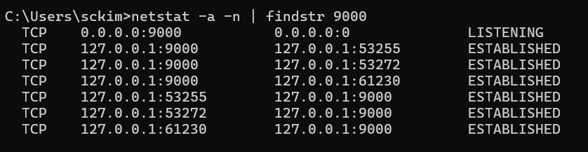
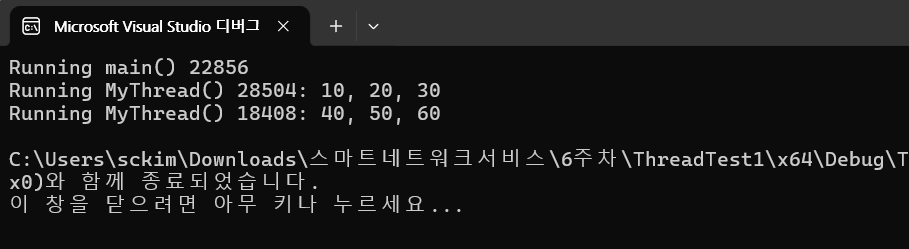
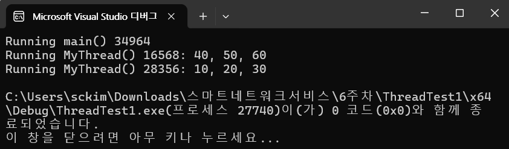
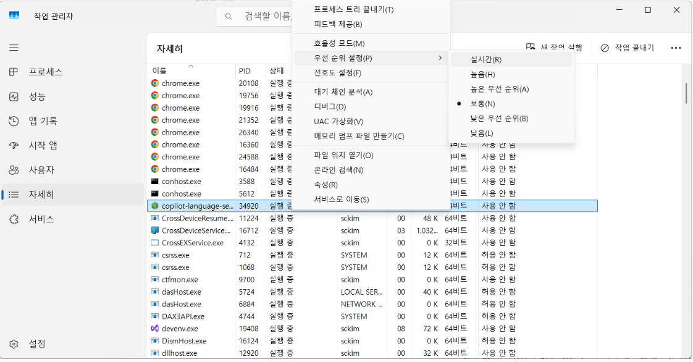
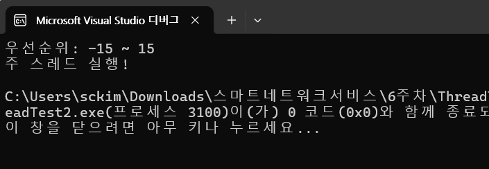
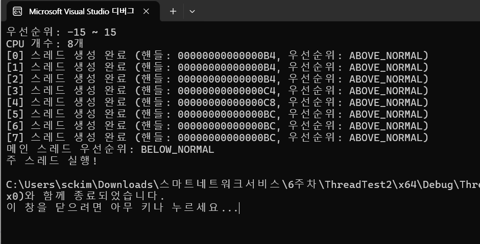
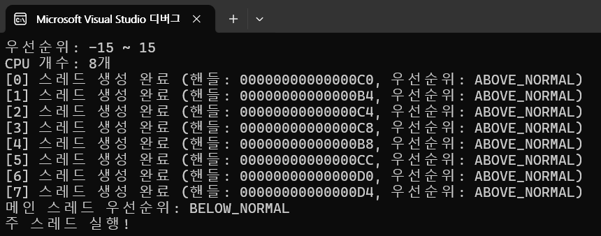

# 멀티스레드

- 두 개의 클라이언트를 동시 접속하게 하는 서버를 만들기 위한 기술, 멀티스레드를 알아보자



## 스레드란?

- **프로세스(Process)** = 실행 중인 프로그램 (메모리 공간 전체)
- **스레드(Thread)** = 그 프로세스 안에서 **실제로 실행되는 실행 단위**
    - 하나의 프로세스(main.exe)가 3개의 스레드를 가지고 있고, 각 스레드는 독립적으로 코드를 실행하고 있는 상태.

---

| 구분 | 스레드 이름 | 실행 함수 | 역할 |
| --- | --- | --- | --- |
|  main 스레드 | 자동 생성 | `main()` | 프로그램 전체 제어, 스레드 생성 |
| 스레드 1 | 사용자 생성 | `MyThread(pt1)` | (10, 20, 30) 출력 |
|  스레드 2 | 사용자 생성 | `MyThread(pt2)` | (40, 50, 60) 출력 |

---
## **ThreadTest1** 
**프로그램 안에서 동시에 실행되는 세 개의 스레드**

- main 스레드 (프로그램 시작 시 자동 생성)
- 스레드 1 (MyThread – pt1)
- 스레드 2 (MyThread – pt2)

```jsx
#include <windows.h>
#include <stdio.h>

struct Point3D
{
	int x, y, z;
};

DWORD WINAPI MyThread(LPVOID arg)
{
	Sleep(1000); **//그런데 “누가 먼저 깨어나느냐”가 매번 다를 수 있음**
	Point3D* pt = (Point3D*)arg;
	printf("Running MyThread() %d: %d, %d, %d\n",
		GetCurrentThreadId(), pt->x, pt->y, pt->z);
	return 0;
}

int main(int argc, char* argv[])
{
	**// 첫 번째 스레드 생성**
	Point3D pt1 = { 10, 20, 30 };
	HANDLE hThread1 = CreateThread(NULL, 0, MyThread, &pt1, 0, NULL);
	if (hThread1 == NULL) return 1;
	CloseHandle(hThread1);

	**// 두 번째 스레드 생성**
	Point3D pt2 = { 40, 50, 60 };
	HANDLE hThread2 = CreateThread(NULL, 0, MyThread, &pt2, 0, NULL);
	if (hThread2 == NULL) return 1;
	CloseHandle(hThread2);

	printf("Running main() %d\n", GetCurrentThreadId());
	Sleep(2000);
	return 0;
}

```

## **main 스레드 (프로그램 시작 시 자동 생성)**

- 프로그램을 실행하면 **운영체제(Windows)** 가 자동으로 **하나의 스레드**를 생성
- `main()` 함수는 이 main 스레드 위에서 실행됨

```c
int main()
{
    printf("Running main() %d\n", GetCurrentThreadId());
    ...
}

```

- `GetCurrentThreadId()`를 찍어보면 main 스레드의 고유 ID가 표시됨
- `main`은 보통 **프로그램의 전체 실행 흐름을 제어**하는 역할을 함
    - 스레드 생성
    - 스레드 종료 대기
    - 자원 정리 후 프로그램 종료
- 즉, main 스레드는 “감독관” 역할을 함

---

## **스레드 1 (MyThread – pt1)**

- `CreateThread()`를 호출하면서 **첫 번째 스레드**가 생성됨

```c
Point3D pt1 = {10, 20, 30};
HANDLE hThread1 = CreateThread(NULL, 0, MyThread, &pt1, 0, NULL);

```

- 이때 새로 만들어진 스레드는 **MyThread 함수**를 시작점으로 실행됨
- 즉, main 스레드와 **동시에 실행됨**
- `MyThread()` 내부에서는 다음을 수행함

```c
Sleep(1000);  // 1초 기다림
printf("Running MyThread() %d: %d, %d, %d\n",
    GetCurrentThreadId(), pt->x, pt->y, pt->z);

```

- `pt1`에 담긴 값 `(10, 20, 30)`을 출력
- 이 스레드의 `GetCurrentThreadId()`는 main 스레드와 **다른 숫자**를 반환함

---

## **스레드 2 (MyThread – pt2)**

- 두 번째 스레드는 이 부분에서 생성됨

```c
Point3D pt2 = {40, 50, 60};
HANDLE hThread2 = CreateThread(NULL, 0, MyThread, &pt2, 0, NULL);

```

- `MyThread()` 함수가 실행되며, `pt2`의 값 `(40, 50, 60)`을 출력함
- `스레드 1`과 `스레드 2`는 동시에 동작하므로, **어느 스레드가 먼저 출력될지는 매번 다름**

---

## 스레드 관계도

```
[프로세스: main.exe]
 ├── main 스레드  (main 함수 실행)
 │     ├── CreateThread() → 스레드 1 생성
 │     ├── CreateThread() → 스레드 2 생성
 │     └── Sleep(2000) 후 종료
 │
 ├── 스레드 1 (MyThread – pt1)
 │     └── Sleep(1000) 후 (10,20,30) 출력
 │
 └── 스레드 2 (MyThread – pt2)
       └── Sleep(1000) 후 (40,50,60) 출력

```

---

## 스레드는 동시에 실행되는 단위

- **운영체제의 스케줄러(스레드 스케줄링)** 때문
- 스레드 1과 스레드 2는 **논리적으로 동시에 실행**되지만, **CPU가 아주 빠르게 번갈아가며 실행시키기 때문에 순서가 예측 불가능**
- `CreateThread()`로 스레드를 만들면, 운영체제는 각 스레드에게 **별도의 실행 흐름**(Instruction Pointer, Stack)을 줌
    - 스레드 1 → `MyThread(pt1)` 실행
    - 스레드 2 → `MyThread(pt2)` 실행
    - 이 두 개가 **main 스레드와 병렬로** 돌아감

---

## 운영체제 스케줄러의 역할

- Windows의 **스레드 스케줄러(Thread Scheduler)** 는 CPU 자원을 어떤 스레드에 얼마나 줄지 **스스로 결정**.
- 이 결정은 다음과 같은 요인에 따라 달라짐

| 요인 | 설명 |
| --- | --- |
| CPU 코어 수 | 듀얼코어, 쿼드코어라면 실제로 여러 스레드가 동시에 실행될 수도 있음 |
| 스레드 우선순위 | `CreateThread()`로 생성 시 우선순위가 같으면 무작위로 배분 |
| 시스템 부하 | 백그라운드 프로세스가 많으면 순서가 달라짐 |
| 타이밍 요소 | `Sleep()`이 끝나는 정확한 시점이 OS 내부 타이머 해상도에 따라 달라짐 |
- **스케줄러의 결정은 매번 달라질 수 있음**
    - 실행할 때마다 결과 순서가 바뀌는 것이 자연스러운 현상

---

- **두 스레드는 모두 `Sleep(1000)` 후 `printf()`를 함**
    - **그런데 “누가 먼저 깨어나느냐”가 매번 다를 수 있음**

### 실행 1

```
Running main() 1234
Running MyThread() 5678: 10, 20, 30
Running MyThread() 9012: 40, 50, 60

```

- ThreadTest1 결과 화면



### 실행 2

```
Running main() 1234
Running MyThread() 9012: 40, 50, 60
Running MyThread() 5678: 10, 20, 30

```

- 이 차이는 **코드 문제나 버그가 아니라, 스케줄링의 비결정성(nondeterminism)** 때문
- ThreadTest1 결과 화면

---



---

## 윈도우 스레드

- ctrl+shift+esc



## ThreadTest2 : 메인 스레드의 우선순위를 낮추는 실험

- **논리 CPU 개수만큼 만들고, 그 스레드들의 우선순위를 올린 뒤** 메인 스레드의 우선순위를 낮추는 실험
    - `MyThread`는 `while (1);` 로 **영원히 바쁘게 도는** 스레드(아무런 대기·입출력 없음).
    - 각 워커 스레드의 우선순위를 `THREAD_PRIORITY_ABOVE_NORMAL`(메인보다 높음)로 올림
    - 메인 스레드는 `THREAD_PRIORITY_BELOW_NORMAL`로 낮춘 뒤 `Sleep(1000)`으로 1초 대기.
        - Windows 스케줄러는 **항상 우선순위가 높은, 실행 준비 상태(ready)의 스레드**를 먼저 돌림.
        - 워커 스레드들이 계속 ready 상태(무한 루프)이고 메인보다 **우선순위가 높기 때문에**, `Sleep(1000)`이 끝난 뒤에도 메인 스레드가 **기아(starvation)** 에 빠져서 **영영 CPU를 못 받을 수 있음.**
        - 그 결과:
            - `printf("주 스레드 실행!\n");` 가 **안 찍힐 가능성**이 큼.
            - 메인이 끝나지 않으므로 프로세스도 종료되지 않고, 워커 스레드들이 계속 CPU를 점유한 상태로 남음.
            - 메인 스레드가 `return 0;` 으로 끝나면 프로세스가 종료되며, 다른 스레드들은 강제 종료됨
            - 문제는 그 지점까지 못 가는 것
            - 왜냐면 워커 스레드는 타 voluntarily yielding(자발적 양보)을 전혀 하지 않고, 입력/대기를 하지 않으니 동적 우선순위 부스팅 같은 메커니즘의 혜택도 못 받아 메인이 깨고 나서도 CPU를 못 잡음.
- **메인 스레드를 굶기는 사례**
    - 우선순위가 높은 무한 스핀 스레드가 다수 존재하면, 낮은 우선순위 스레드는 **Sleep에서 깨어난 뒤에도** 실행 기회를 얻지 못할 수 있음.
    - **주기적 양보** 또는 **합리적 우선순위 배치/대기 기반 설계 필요**

- 코드

```jsx
#include <windows.h>
#include <stdio.h>

DWORD WINAPI MyThread(LPVOID arg)
{
	while (1);
	return 0;
}

int main()
{
	// 우선순위 값의 범위를 출력한다.
	printf("우선순위: %d ~ %d\n", THREAD_PRIORITY_IDLE,
		THREAD_PRIORITY_TIME_CRITICAL);

	// CPU 개수를 알아낸다.
	SYSTEM_INFO si;
	GetSystemInfo(&si);

	// CPU 개수만큼 스레드를 생성한다.
	for (int i = 0; i < (int)si.dwNumberOfProcessors; i++) {
		// 스레드를 생성한다.
		HANDLE hThread = CreateThread(NULL, 0, MyThread, NULL, 0, NULL);

		// 우선순위를 높게 설정한다.
		SetThreadPriority(hThread, THREAD_PRIORITY_ABOVE_NORMAL);
		CloseHandle(hThread);
	}

	// 우선순위를 낮게 설정한다.
	SetThreadPriority(GetCurrentThread(), THREAD_PRIORITY_BELOW_NORMAL);
	Sleep(1000);
	printf("주 스레드 실행!\n");
	return 0;
}

```

- 결과



## **모든 스레드의 핸들 값 출력**

```jsx
#include <windows.h>
#include <stdio.h>

DWORD WINAPI MyThread(LPVOID arg)
{
    while (1);
    return 0;
}

int main()
{
    // 우선순위 값의 범위를 출력한다.
    printf("우선순위: %d ~ %d\n", THREAD_PRIORITY_IDLE,
        THREAD_PRIORITY_TIME_CRITICAL);

    // CPU 개수를 알아낸다.
    SYSTEM_INFO si;
    GetSystemInfo(&si);
    printf("CPU 개수: %u개\n", si.dwNumberOfProcessors);

    // CPU 개수만큼 스레드를 생성한다.
    for (int i = 0; i < (int)si.dwNumberOfProcessors; i++) {
        HANDLE hThread = CreateThread(NULL, 0, MyThread, NULL, 0, NULL);
        if (hThread == NULL) {
            printf("[%d] 스레드 생성 실패! (오류 코드: %lu)\n", i, GetLastError());
            continue;
        }

        // 우선순위를 높게 설정한다.
        SetThreadPriority(hThread, THREAD_PRIORITY_ABOVE_NORMAL);

        // 스레드 생성 정보 출력
        printf("[%d] 스레드 생성 완료 (핸들: %p, 우선순위: ABOVE_NORMAL)\n", i, hThread);

        // 핸들을 닫는다.
        CloseHandle(hThread);
    }

    // 우선순위를 낮게 설정한다.
    SetThreadPriority(GetCurrentThread(), THREAD_PRIORITY_BELOW_NORMAL);
    printf("메인 스레드 우선순위: BELOW_NORMAL\n");

    Sleep(1000);
    printf("주 스레드 실행!\n");
    return 0;
}

```

- 출력



## **모든 스레드의 핸들 값이 동일하게 출력되는 이유**

---

- `HANDLE` 복사 후 `CloseHandle()` 호출
    - `CreateThread()` 는 **커널 오브젝트(스레드)** 를 생성하고, 그 스레드를 참조하는 **핸들 값(HANDLE)** 을 반환함.
    - 코드에서 이 핸들을 바로 `CloseHandle()` 로 닫고 있기 때문에, 그 시점 이후 OS는 그 핸들을 **재사용(reuse)** 할 수 있음.

```c
HANDLE hThread = CreateThread(...);
printf("핸들: %p\n", hThread);
CloseHandle(hThread); // 바로 닫음

```

- 이렇게 하면 다음 번 `CreateThread()` 가 실행될 때 운영체제가 **이전에 닫힌 핸들 값**을 재활용할 수 있음.
- `CloseHandle(hThread);` 줄을 **일시적으로 주석 처리**

```c
// CloseHandle(hThread);

```

- 다시 실행

```
[0] 스레드 생성 완료 (핸들: 00000000000000B4)
[1] 스레드 생성 완료 (핸들: 00000000000000C8)
[2] 스레드 생성 완료 (핸들: 00000000000000DC)
...

```

- 이제 핸들이 전부 다르게 나옴

---

## **스레드가 끝난 뒤에만 핸들을 닫음**

```c
HANDLE handles[MAX_THREADS];

for (int i = 0; i < (int)si.dwNumberOfProcessors; i++) {
    handles[i] = CreateThread(NULL, 0, MyThread, NULL, 0, NULL);
    printf("[%d] 스레드 생성 완료 (핸들: %p)\n", i, handles[i]);
    SetThreadPriority(handles[i], THREAD_PRIORITY_ABOVE_NORMAL);
}

// 모든 스레드가 끝나길 기다린 뒤 닫기
WaitForMultipleObjects(si.dwNumberOfProcessors, handles, TRUE, INFINITE);
for (int i = 0; i < (int)si.dwNumberOfProcessors; i++)
    CloseHandle(handles[i]);

```

---

- **핸들이 동일하게 출력되는 것은 정상적인 Windows 동작이며**, “닫힌 핸들이 재활용된 결과”

```jsx
        // 핸들을 닫는다.
        //CloseHandle(hThread);
```

- 화면


