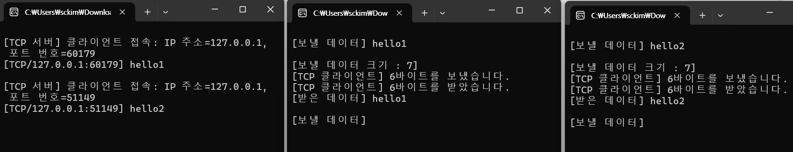
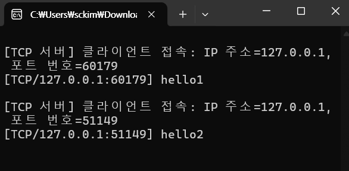

# 멀티스레드 TCP 에코 서버

- `listen` → 무한 `accept` → 접속마다 `CreateThread(ProcessClient)` → 스레드에서 `recv`/`send` 루프
- **프로토콜:** IPv4, 스트림(TCP), 포트 `9000`, 고정 버퍼 512바이트

---

**초기화**

- `WSAStartup(MAKEWORD(2,2), &wsa)`로 WinSock 초기화
- `socket(AF_INET, SOCK_STREAM, 0)`로 리스닝 소켓 생성

**바인드/리스닝**

- `serveraddr`를 `INADDR_ANY:9000`에 바인드
- `listen(listen_sock, SOMAXCONN)` 대기열 생성

**접속 수락 루프**

- `accept()` 성공 시
    - 접속 클라이언트 주소(`clientaddr`)를 `inet_ntop`으로 문자열 변환해 로그 출력
    - `CreateThread(..., ProcessClient, (LPVOID)client_sock, ...)`로 스레드 시작
    - 스레드 핸들은 즉시 `CloseHandle` (디태치 방식)

**클라이언트 처리 스레드 `ProcessClient`**

- 전달받은 소켓 핸들(`client_sock`)로 `getpeername`/`inet_ntop`하여 원격 IP/포트를 알아냄
- 무한 루프:
    - `recv()`로 데이터 수신
        - 에러면 로그 후 종료
        - 0이면 원격 종료 → 루프 탈출
    - 받은 바이트 수만큼 `buf[retval] = '\0'`로 널 종료
    - `printf("[TCP/%s:%d] %s\n", ...)`로 에코된 내용 로그
    - `send(client_sock, buf, retval, 0)`로 그대로 에코
- 루프 종료 시 `closesocket(client_sock)` 및 종료 로그
- 메인 루프가 깨지면 리스닝 소켓 닫고 `WSACleanup()` 호출

```jsx
#include "..\Common.h"

#define SERVERPORT 9000
#define BUFSIZE    512

// 클라이언트와 데이터 통신
DWORD WINAPI ProcessClient(LPVOID arg)
{
	int retval;
	SOCKET client_sock = (SOCKET)arg;
	struct sockaddr_in clientaddr;
	char addr[INET_ADDRSTRLEN];
	int addrlen;
	char buf[BUFSIZE + 1];

	// 클라이언트 정보 얻기
	addrlen = sizeof(clientaddr);
	getpeername(client_sock, (struct sockaddr *)&clientaddr, &addrlen);
	inet_ntop(AF_INET, &clientaddr.sin_addr, addr, sizeof(addr));

	while (1) {
		// 데이터 받기
		retval = recv(client_sock, buf, BUFSIZE, 0);
		if (retval == SOCKET_ERROR) {
			err_display("recv()");
			break;
		}
		else if (retval == 0)
			break;

		// 받은 데이터 출력
		buf[retval] = '\0';
		printf("[TCP/%s:%d] %s\n", addr, ntohs(clientaddr.sin_port), buf);

		// 데이터 보내기
		retval = send(client_sock, buf, retval, 0);
		if (retval == SOCKET_ERROR) {
			err_display("send()");
			break;
		}
	}

	// 소켓 닫기
	closesocket(client_sock);
	printf("[TCP 서버] 클라이언트 종료: IP 주소=%s, 포트 번호=%d\n",
		addr, ntohs(clientaddr.sin_port));
	return 0;
}

int main(int argc, char *argv[])
{
	int retval;

	// 윈속 초기화
	WSADATA wsa;
	if (WSAStartup(MAKEWORD(2, 2), &wsa) != 0)
		return 1;

	// 소켓 생성
	SOCKET listen_sock = socket(AF_INET, SOCK_STREAM, 0);
	if (listen_sock == INVALID_SOCKET) err_quit("socket()");

	// bind()
	struct sockaddr_in serveraddr;
	memset(&serveraddr, 0, sizeof(serveraddr));
	serveraddr.sin_family = AF_INET;
	serveraddr.sin_addr.s_addr = htonl(INADDR_ANY);
	serveraddr.sin_port = htons(SERVERPORT);
	retval = bind(listen_sock, (struct sockaddr *)&serveraddr, sizeof(serveraddr));
	if (retval == SOCKET_ERROR) err_quit("bind()");

	// listen()
	retval = listen(listen_sock, SOMAXCONN);
	if (retval == SOCKET_ERROR) err_quit("listen()");

	// 데이터 통신에 사용할 변수
	SOCKET client_sock;
	struct sockaddr_in clientaddr;
	int addrlen;
	HANDLE hThread;

	while (1) {
		// accept()
		addrlen = sizeof(clientaddr);
		client_sock = accept(listen_sock, (struct sockaddr *)&clientaddr, &addrlen);
		if (client_sock == INVALID_SOCKET) {
			err_display("accept()");
			break;
		}

		// 접속한 클라이언트 정보 출력
		char addr[INET_ADDRSTRLEN];
		inet_ntop(AF_INET, &clientaddr.sin_addr, addr, sizeof(addr));
		printf("\n[TCP 서버] 클라이언트 접속: IP 주소=%s, 포트 번호=%d\n",
			addr, ntohs(clientaddr.sin_port));

		// 스레드 생성
		hThread = CreateThread(NULL, 0, ProcessClient,
			(LPVOID)client_sock, 0, NULL);
		if (hThread == NULL) { closesocket(client_sock); }
		else { CloseHandle(hThread); }
	}

	// 소켓 닫기
	closesocket(listen_sock);

	// 윈속 종료
	WSACleanup();
	return 0;
}

```

- 실행결과



- 서버 화면



---
