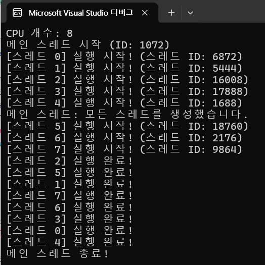
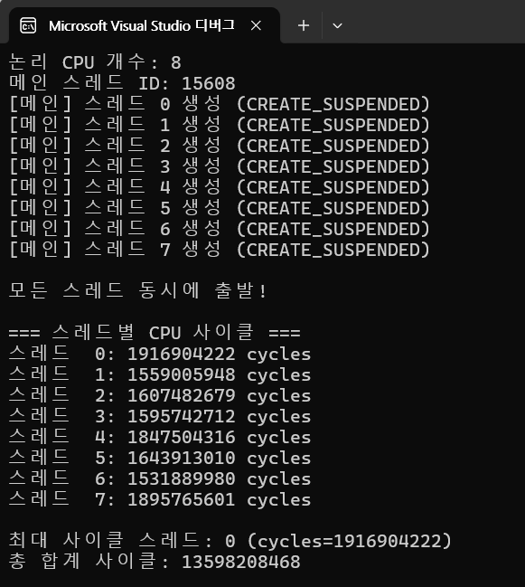
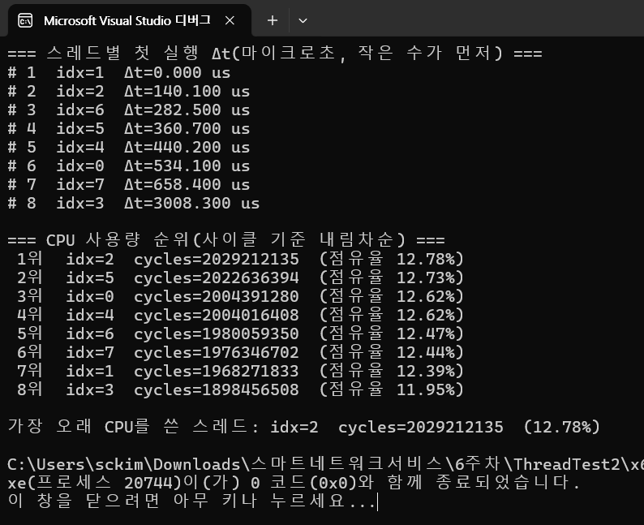
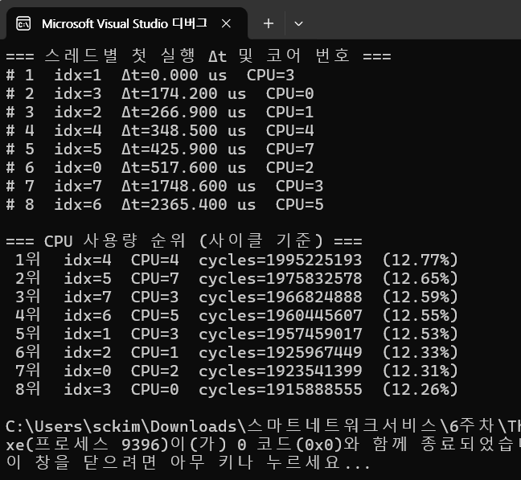

# 스케줄러 선점 (Scheduler Preemption)


---

| 구분 | 용어 | 설명 |
| --- | --- | --- |
| **CPU 스케줄링 관점** | **스케줄러 선점 (Scheduler Preemption)** | OS 스케줄러가 기존 실행 중인 스레드(메인 스레드)보다 다른 스레드(워커 스레드)를 먼저 실행하도록 **CPU를 선점시킨 것** |
| **실행 시점 관점** | **우선 스케줄링 (Priority Scheduling)** | 동일한 시점에 여러 스레드가 실행 가능 상태(Runnable)가 되면, OS는 스케줄링 정책에 따라 **우선순위가 높은 스레드**를 먼저 CPU에 배정. |
| **결과 상태 관점** | **컨텍스트 스위치 (Context Switch)** | CPU가 **메인 스레드에서 워커 스레드로 실행 문맥을 교체**한 것. 스레드가 먼저 CPU를 잡았다는 것은 컨텍스트 스위치가 일어난 결과. |
| **시스템 현상** | **스레드 선점 실행 (Thread Preemption)** | 스케줄러가 현재 실행 중이던 스레드를 중단(preempt)하고, 새 스레드를 실행시킨 현상. |
| **일반적 기술 용어** | **스케줄러에 의해 우선 배정 (scheduled before main thread)** | OS 스케줄러가 워커 스레드를 먼저 스케줄했다고 표현. |

---

- `CreateThread` 이후 `ResumeThread`를 호출하면서 여러 스레드가 **READY 상태**로 진입.
    - Windows 스케줄러는 각 스레드의 **우선순위, CPU 가용 상태, 캐시 로컬리티** 등을 고려해 어떤 스레드부터 CPU에 올릴지 결정.
    - **메인 스레드보다 워커 스레드가 먼저 실행 상태(RUNNING)** 가 되면 워커 스레드가 CPU를 선점했다(Preempted the main thread)고 함
    - 스레드가 메인 스레드보다 먼저 CPU를 잡았다는 것은 **OS 스케줄러에 의해 워커 스레드가 메인 스레드보다 먼저 스케줄(scheduled)되어 실행 상태로 전환되었다** 또는 **워커 스레드가 메인 스레드를 선점(preempt)했다고 함**

---

## 코드

```c
#include <windows.h>
#include <stdio.h>

DWORD WINAPI MyThread(LPVOID arg)
{
    int index = (int)(ULONG_PTR)arg;

    printf("[스레드 %d] 실행 시작! (스레드 ID: %lu)\n",
           index, GetCurrentThreadId());

    Sleep(500); // 약간의 지연 (실행 순서 관찰용)

    printf("[스레드 %d] 실행 완료!\n", index);
    return 0;
}

int main(void)
{
    SYSTEM_INFO si;
    GetSystemInfo(&si);

    int cpuCount = (int)si.dwNumberOfProcessors;
    printf("CPU 개수: %d\n", cpuCount);
    printf("메인 스레드 시작 (ID: %lu)\n", GetCurrentThreadId());

    HANDLE* hThreads = (HANDLE*)malloc(sizeof(HANDLE) * cpuCount);
    if (!hThreads) return 1;

    // CPU 개수만큼 스레드 생성
    for (int i = 0; i < cpuCount; i++) {
        hThreads[i] = CreateThread(NULL, 0, MyThread, (LPVOID)(ULONG_PTR)i, 0, NULL);
        if (hThreads[i] == NULL) {
            printf("스레드 %d 생성 실패!\n", i);
            return 1;
        }
    }

    printf("메인 스레드: 모든 스레드를 생성했습니다.\n");

    // 모든 스레드 종료 대기
    WaitForMultipleObjects(cpuCount, hThreads, TRUE, INFINITE);

    for (int i = 0; i < cpuCount; i++)
        CloseHandle(hThreads[i]);
    free(hThreads);

    printf("메인 스레드 종료!\n");
    return 0;
}

```

- 결과
    - **CPU 개수만큼 스레드를 생성하고**, 각 스레드가  **메인보다** 먼저 실행되었다는 것을 직접 출력
    - 즉, **스레드들이 실제로 메인보다 먼저 CPU를 잡음**



- 분석

```
CPU 개수: 8
메인 스레드 시작 (ID: 2068)
메인 스레드: 모든 스레드를 생성했습니다.
[스레드 0] 실행 시작! (스레드 ID: 2096)
[스레드 1] 실행 시작! (스레드 ID: 3100)
[스레드 2] 실행 시작! (스레드 ID: 2928)
[스레드 3] 실행 시작! (스레드 ID: 1360)
[스레드 4] 실행 시작! (스레드 ID: 3492)
[스레드 5] 실행 시작! (스레드 ID: 2784)
[스레드 6] 실행 시작! (스레드 ID: 2972)
[스레드 7] 실행 시작! (스레드 ID: 3136)
[스레드 0] 실행 완료!
[스레드 1] 실행 완료!
...
메인 스레드 종료!

```

---

- `GetSystemInfo()`
    - 시스템의 CPU(논리 코어) 개수를 얻음
- 각 스레드는 `CreateThread()`로 생성 즉시 실행 대기 상태가 되며, OS 스케줄러가 **즉시 실행시킬 수도 있고, 잠시 후 실행시킬 수도 있음**
- `MyThread()` 함수가 시작되자마자 `"[스레드 N] 실행 시작!"`을 출력하므로, **스레드가 실제로 먼저 실행되었는지** 콘솔에서 확인 가능
    - 여러 CPU가 있다면, 여러 스레드가 **거의 동시에 실행**되므로 `"메인 스레드: 모든 스레드를 생성했습니다."`보다 먼저 찍히는 스레드 메시지도 나옴

---

# 스레드 스케줄링 순서(scheduling order) 관찰

- 스레드들이 동시에 깨어났을 때 어떤 순서로 실행되는지 확인
- `CREATE_SUSPENDED` + `ResumeThread`
- **CPU 개수만큼 스레드를 `CREATE_SUSPENDED` 상태로 먼저 생성해 두었다가**, `ResumeThread()`를 사용해 **모든 스레드를 동시에 출발**.

---

```c
#include <windows.h>
#include <stdio.h>
#include <stdlib.h>

DWORD WINAPI MyThread(LPVOID arg)
{
    int index = (int)(ULONG_PTR)arg;

    // 스레드가 깨어나자마자 출력
    printf("[스레드 %d] 실행 시작! (스레드 ID: %lu)\n",
           index, GetCurrentThreadId());

    Sleep(500); // 간단한 작업 시뮬레이션

    printf("[스레드 %d] 실행 완료!\n", index);
    return 0;
}

int main(void)
{
    SYSTEM_INFO si;
    GetSystemInfo(&si);
    int cpuCount = (int)si.dwNumberOfProcessors;

    printf("CPU 개수: %d\n", cpuCount);
    printf("메인 스레드 시작 (ID: %lu)\n", GetCurrentThreadId());

    HANDLE* hThreads = (HANDLE*)malloc(sizeof(HANDLE) * cpuCount);
    if (!hThreads) return 1;

    // CPU 개수만큼 스레드를 "일시 중단(CREATE_SUSPENDED)" 상태로 생성
    for (int i = 0; i < cpuCount; i++) {
        hThreads[i] = CreateThread(
            NULL,               // 기본 보안 속성
            0,                  // 기본 스택 크기
            MyThread,           // 실행 함수
            (LPVOID)(ULONG_PTR)i, // 인자
            CREATE_SUSPENDED,   // ★ 일시 중단 상태로 생성
            NULL
        );

        if (hThreads[i] == NULL) {
            printf("스레드 %d 생성 실패!\n", i);
            return 1;
        }
        printf("[메인] 스레드 %d 생성 완료 (일시 중단 상태)\n", i);
    }

    printf("\n모든 스레드가 CREATE_SUSPENDED 상태로 생성되었습니다.\n");
    printf("3초 후 모든 스레드를 ResumeThread()로 동시에 실행시킵니다...\n\n");

    Sleep(3000); // 준비 시간 (3초 대기)

    // 모든 스레드를 동시에 재개 (ResumeThread)
    for (int i = 0; i < cpuCount; i++) {
        ResumeThread(hThreads[i]);
    }

    // 모든 스레드 종료 대기
    WaitForMultipleObjects(cpuCount, hThreads, TRUE, INFINITE);

    // 핸들 닫기
    for (int i = 0; i < cpuCount; i++) {
        CloseHandle(hThreads[i]);
    }
    free(hThreads);

    printf("\n메인 스레드 종료!\n");
    return 0;
}

```

---

```
CPU 개수: 8
메인 스레드 시작 (ID: 2096)
[메인] 스레드 0 생성 완료 (일시 중단 상태)
[메인] 스레드 1 생성 완료 (일시 중단 상태)
[메인] 스레드 2 생성 완료 (일시 중단 상태)
[메인] 스레드 3 생성 완료 (일시 중단 상태)
[메인] 스레드 4 생성 완료 (일시 중단 상태)
[메인] 스레드 5 생성 완료 (일시 중단 상태)
[메인] 스레드 6 생성 완료 (일시 중단 상태)
[메인] 스레드 7 생성 완료 (일시 중단 상태)

모든 스레드가 CREATE_SUSPENDED 상태로 생성되었습니다.
3초 후 모든 스레드를 ResumeThread()로 동시에 실행시킵니다...

[스레드 3] 실행 시작! (스레드 ID: 2668)
[스레드 0] 실행 시작! (스레드 ID: 3620)
[스레드 4] 실행 시작! (스레드 ID: 3028)
[스레드 1] 실행 시작! (스레드 ID: 2760)
[스레드 2] 실행 시작! (스레드 ID: 2500)
[스레드 7] 실행 시작! (스레드 ID: 3624)
[스레드 6] 실행 시작! (스레드 ID: 3328)
[스레드 5] 실행 시작! (스레드 ID: 3192)
[스레드 0] 실행 완료!
[스레드 1] 실행 완료!
[스레드 2] 실행 완료!
...
메인 스레드 종료!

```

---

- **스레드 상태 전이(READY → RUNNING → TERMINATED)**

| 단계 | 내용 |
| --- | --- |
|  **CREATE_SUSPENDED** | 스레드를 생성만 하고” 실행시키지 않음. CPU 점유 X |
|  **ResumeThread()** | 일시 중단된 스레드를 **즉시 실행 가능 상태로 전환** |
|  **WaitForMultipleObjects()** | 모든 스레드가 종료될 때까지 메인 스레드가 대기 |
| **printf() 출력 순서** | 스레드들이 동시에 깨어나 실행되므로 순서는 매번 달라짐 |
- CPU 개수만큼 생성된 스레드가 동시에 ResumeThread()로 깨어나, 각각 스레드 실행 시작을 출력하며 거의 동시에 실행됨
- 모든 스레드가 `CreateThread`로 생성된 후 **동시에 출발 신호(이벤트, ResumeThread 등)** 를 받아
    
    **READY 상태**로 진입.
    
    - 하지만 동시에 깨어났다고 해서 **동시에 CPU에서 실행되는 것**은 아님.
    - 운영체제의 **스케줄러(scheduler)** 가 CPU 코어별로 하나씩 **실행 상태(RUNNING)** 로 배정함
    - 이때 각 스레드가 실제로 CPU에서 **실행을 시작하는 시점의 순서**는 매번 달라짐.

---

| 구분 | 용어 |  |
| --- | --- | --- |
| **스케줄링(scheduling)** | OS가 어떤 스레드가 언제 CPU를 쓸지를 결정하는 과정. |  |
| **디스패치(dispatch)** | READY 상태의 스레드를 실제로 CPU에 올려 실행시키는 동작. |  |
| **컨텍스트 스위칭(context switching)** | CPU가 한 스레드에서 다른 스레드로 전환될 때 발생하는 문맥 교체. |  |
| **선점(preemption)** | 이미 실행 중인 스레드를 중단시키고 다른 스레드가 CPU를 차지하는 것. |  |
| **비결정적 실행 순서(nondeterministic execution order)** | 스케줄러 정책과 시스템 상태에 따라 실행 순서가 매번 달라지는 특성. |  |

---

- 분석
    - [스레드 3] 실행 시작! (스레드 ID: 2668)
    [스레드 0] 실행 시작! (스레드 ID: 3620)
    [스레드 4] 실행 시작! (스레드 ID: 3028)
    ...
    - 스레드들은 모두 거의 동시에 READY 상태가 되었지만 Windows 스케줄러가 CPU를 배정할 때 **스레드 3을 가장 먼저 디스패치(dispatch)** 했다는 뜻
    - 이후 CPU 코어 여건, 스레드 우선순위, 내부 타이밍에 따라 **스레드 0, 4, 1, 2 … 순으로 스케줄링되어 실행을 시작**

---

### - **스레드들이 동시에 깨어났지만 순서가 달라지는 이유**

- Windows는 **선점형 멀티태스킹(preemptive multitasking)** 사용.
    - READY 상태의 스레드가 여러 개 있으면 **스케줄러의 정책(우선순위, 최근 사용, 코어 로드 등)** 에 따라 어떤 스레드부터 **디스패치(dispatch)** 할지 결정.
- 이 과정이 매우 짧은 시간(μs 단위) 안에서 이뤄지므로, 같은 프로그램을 여러 번 실행해도 실행 순서는 매번 달라짐
- 스레드들이 동시에 준비 상태(READY)로 전이되었으나, OS 스케줄러의 **디스패치 순서(dispatch order)** 에 따라 서로 다른 스레드가 먼저 **실행 상태(RUNNING)** 로 진입함. 따라서 출력 순서는 **비결정적(nondeterministic)** 임

---

## 각 스레드가 사용한 **CPU 사이클 수** 출력

- **CPU 개수만큼 스레드를 `CREATE_SUSPENDED`로 생성**해 두었다가,`ResumeThread` + `SetEvent`로 **동시에 출발**시키고, 종료 후 `QueryThreadCycleTime`으로 각 스레드가 사용한 **CPU 사이클 수**를 출력
- 사이클 수가 더 크면 더 오래/먼저 CPU를 잡았을 가능성이 높음

```c
// build: cl /W4 /EHsc /O2 cycles_demo.c
#define _CRT_SECURE_NO_WARNINGS
#include <windows.h>
#include <stdio.h>
#include <stdlib.h>

typedef struct {
    int index;
    HANDLE start_evt;   // 시작 게이트
    HANDLE stop_evt;    // 종료 신호
} ThreadArg;

DWORD WINAPI Worker(LPVOID lpParam)
{
    ThreadArg* arg = (ThreadArg*)lpParam;

    // 모든 스레드가 동시에 출발할 수 있도록 대기
    WaitForSingleObject(arg->start_evt, INFINITE);

    // 바쁜 작업 시뮬레이션: 종료 신호가 올 때까지 spin
    // (가끔 양보를 넣어도 되지만, 여기선 사이클 측정을 위해 순수 스핀)
    for (;;) {
        if (WaitForSingleObject(arg->stop_evt, 0) == WAIT_OBJECT_0) break;

        // 아주 가벼운 연산으로 스핀(컴파일러 최적화 방지용)
        for (volatile int k = 0; k < 1000; ++k) { /* spin */ }
        // 필요 시 전력/발열 완화를 위해 YieldProcessor() 등을 섞어도 됩니다.
        // YieldProcessor();
    }
    return 0;
}

int main(void)
{
    SYSTEM_INFO si;
    GetSystemInfo(&si);
    int cpuCount = (int)si.dwNumberOfProcessors;
    if (cpuCount <= 0) cpuCount = 1;

    printf("논리 CPU 개수: %d\n", cpuCount);
    printf("메인 스레드 ID: %lu\n", GetCurrentThreadId());

    // 시작/종료 이벤트
    HANDLE start_evt = CreateEvent(NULL, TRUE, FALSE, NULL); // manual-reset, nonsignaled
    HANDLE stop_evt  = CreateEvent(NULL, TRUE, FALSE, NULL);
    if (!start_evt || !stop_evt) {
        fprintf(stderr, "이벤트 생성 실패: %lu\n", GetLastError());
        return 1;
    }

    HANDLE* threads = (HANDLE*)malloc(sizeof(HANDLE) * cpuCount);
    ThreadArg* args = (ThreadArg*)malloc(sizeof(ThreadArg) * cpuCount);
    if (!threads || !args) return 1;

    // 1) 스레드를 일시중단 상태로 생성
    for (int i = 0; i < cpuCount; ++i) {
        args[i].index = i;
        args[i].start_evt = start_evt;
        args[i].stop_evt = stop_evt;

        threads[i] = CreateThread(
            NULL, 0, Worker, &args[i],
            CREATE_SUSPENDED, NULL
        );
        if (!threads[i]) {
            fprintf(stderr, "스레드 %d 생성 실패: %lu\n", i, GetLastError());
            return 1;
        }
        printf("[메인] 스레드 %d 생성 (CREATE_SUSPENDED)\n", i);
    }

    // 2) 모든 스레드를 재개(실행 가능 상태로) → 아직 start_evt는 비신호 상태
    for (int i = 0; i < cpuCount; ++i) {
        ResumeThread(threads[i]);
    }

    // 3) 동시에 출발
    printf("\n모든 스레드 동시에 출발!\n\n");
    SetEvent(start_evt);

    // 4) 러닝 시간
    const DWORD run_ms = 1000; // 1초 정도 실행
    Sleep(run_ms);

    // 5) 종료 신호
    SetEvent(stop_evt);

    // 6) 종료 대기
    WaitForMultipleObjects(cpuCount, threads, TRUE, INFINITE);

    // 7) 각 스레드별 CPU 사이클 측정
    //    QueryThreadCycleTime: 스레드가 실제로 사용한 CPU 클록 사이클 수(누적)를 반환
    ULONG64* cycles = (ULONG64*)malloc(sizeof(ULONG64) * cpuCount);
    if (!cycles) return 1;

    ULONG64 total = 0, maxc = 0;
    int max_idx = 0;

    for (int i = 0; i < cpuCount; ++i) {
        ULONG64 c = 0;
        if (!QueryThreadCycleTime(threads[i], &c)) {
            fprintf(stderr, "스레드 %d 사이클 조회 실패: %lu\n", i, GetLastError());
            c = 0;
        }
        cycles[i] = c;
        if (c > maxc) { maxc = c; max_idx = i; }
        total += c;
    }

    printf("=== 스레드별 CPU 사이클 ===\n");
    for (int i = 0; i < cpuCount; ++i) {
        printf("스레드 %2d: %llu cycles\n", i, (unsigned long long)cycles[i]);
    }

    printf("\n최대 사이클 스레드: %d (cycles=%llu)\n",
           max_idx, (unsigned long long)maxc);
    printf("총 합계 사이클: %llu\n", (unsigned long long)total);

    // 정리
    for (int i = 0; i < cpuCount; ++i) CloseHandle(threads[i]);
    CloseHandle(start_evt);
    CloseHandle(stop_evt);
    free(cycles);
    free(threads);
    free(args);

    return 0;
}

```

- **동시 출발**: `CREATE_SUSPENDED`로 만들어 `ResumeThread` 후 `SetEvent(start_evt)`로 한 번에 실행 시작.
- **CPU 사이클 측정**: `QueryThreadCycleTime(hThread, &cycles)`는 *각 스레드가 실제 CPU를 사용한 양*
    - **누가 먼저의 근사**: 먼저시점을 API로 직접 찍지는 않았지만, **동일 시간 구간** 동안 더 많은 사이클을 썼다면 더 일찍/더 오래 CPU를 잡았을 가능성이 있음



---

## 누가 더 오래 CPU를 썼는가(사이클 기준 내림차순) 표시

- **동시에 출발 + 첫 실행 시각(QPC) 기록 + CPU 사이클(QueryThreadCycleTime) 측정**

```jsx
// build: cl /W4 /EHsc /O2 cpu_usage_with_core.c
#define _CRT_SECURE_NO_WARNINGS
#include <windows.h>
#include <stdio.h>
#include <stdlib.h>

typedef struct {
    int index;
    HANDLE start_evt;
    HANDLE stop_evt;
    LARGE_INTEGER* starts;
    DWORD* cores; // 스레드가 깨어날 때 실행된 CPU 번호 기록
} ThreadArg;

typedef struct {
    int idx;
    DWORD core;
    LARGE_INTEGER start;
    ULONG64 cycle;
} Row;

DWORD WINAPI Worker(LPVOID lpParam)
{
    ThreadArg* arg = (ThreadArg*)lpParam;

    // 출발 신호 대기
    WaitForSingleObject(arg->start_evt, INFINITE);

    // 깨어난 순간의 시각 및 코어 번호 기록
    LARGE_INTEGER now;
    QueryPerformanceCounter(&now);
    arg->starts[arg->index] = now;
    arg->cores[arg->index] = GetCurrentProcessorNumber(); // ✅ CPU 번호 저장

    // 종료 신호가 올 때까지 spin
    for (;;) {
        if (WaitForSingleObject(arg->stop_evt, 0) == WAIT_OBJECT_0) break;
        for (volatile int k = 0; k < 1000; ++k) {}
    }
    return 0;
}

static int __cdecl RowStartCompare(const void* a, const void* b)
{
    const Row* ra = (const Row*)a, * rb = (const Row*)b;
    if (ra->start.QuadPart < rb->start.QuadPart) return -1;
    if (ra->start.QuadPart > rb->start.QuadPart) return 1;
    return 0;
}

static int __cdecl RowCycleDesc(const void* a, const void* b)
{
    const Row* ra = (const Row*)a, * rb = (const Row*)b;
    if (ra->cycle < rb->cycle) return 1;
    if (ra->cycle > rb->cycle) return -1;
    return 0;
}

int main(void)
{
    SYSTEM_INFO si; GetSystemInfo(&si);
    int cpuCount = (int)si.dwNumberOfProcessors;
    LARGE_INTEGER freq; QueryPerformanceFrequency(&freq);

    HANDLE start_evt = CreateEvent(NULL, TRUE, FALSE, NULL);
    HANDLE stop_evt = CreateEvent(NULL, TRUE, FALSE, NULL);

    HANDLE* threads = (HANDLE*)malloc(sizeof(HANDLE) * cpuCount);
    ThreadArg* args = (ThreadArg*)malloc(sizeof(ThreadArg) * cpuCount);
    LARGE_INTEGER* starts = (LARGE_INTEGER*)calloc(cpuCount, sizeof(LARGE_INTEGER));
    ULONG64* cycles = (ULONG64*)malloc(sizeof(ULONG64) * cpuCount);
    DWORD* cores = (DWORD*)malloc(sizeof(DWORD) * cpuCount);

    for (int i = 0; i < cpuCount; ++i) {
        args[i].index = i;
        args[i].start_evt = start_evt;
        args[i].stop_evt = stop_evt;
        args[i].starts = starts;
        args[i].cores = cores;

        threads[i] = CreateThread(NULL, 0, Worker, &args[i], CREATE_SUSPENDED, NULL);
    }

    for (int i = 0; i < cpuCount; ++i) ResumeThread(threads[i]);
    SetEvent(start_evt);

    Sleep(1000);
    SetEvent(stop_evt);
    WaitForMultipleObjects(cpuCount, threads, TRUE, INFINITE);

    ULONG64 total_cycles = 0;
    Row* rows = (Row*)malloc(sizeof(Row) * cpuCount);

    for (int i = 0; i < cpuCount; ++i) {
        ULONG64 c = 0;
        QueryThreadCycleTime(threads[i], &c);
        cycles[i] = c;
        total_cycles += c;

        rows[i].idx = i;
        rows[i].start = starts[i];
        rows[i].cycle = c;
        rows[i].core = cores[i];
    }

    // 첫 실행 시각 순
    qsort(rows, cpuCount, sizeof(Row), RowStartCompare);
    LARGE_INTEGER base = rows[0].start;
    printf("=== 스레드별 첫 실행 Δt 및 코어 번호 ===\n");
    for (int i = 0; i < cpuCount; ++i) {
        double us = (rows[i].start.QuadPart - base.QuadPart) * 1e6 / (double)freq.QuadPart;
        printf("#%2d  idx=%d  Δt=%.3f us  CPU=%lu\n", i + 1, rows[i].idx, us, rows[i].core);
    }

    // CPU 사용량 순
    qsort(rows, cpuCount, sizeof(Row), RowCycleDesc);
    printf("\n=== CPU 사용량 순위 (사이클 기준) ===\n");
    for (int i = 0; i < cpuCount; ++i) {
        double pct = total_cycles ? (100.0 * (double)rows[i].cycle / (double)total_cycles) : 0.0;
        printf("%2d위  idx=%d  CPU=%lu  cycles=%llu  (%.2f%%)\n",
            i + 1, rows[i].idx, rows[i].core,
            (unsigned long long)rows[i].cycle, pct);
    }

    for (int i = 0; i < cpuCount; ++i) CloseHandle(threads[i]);
    CloseHandle(start_evt); CloseHandle(stop_evt);
    free(threads); free(args); free(starts); free(cycles); free(cores); free(rows);
    return 0;
}

```

- `QueryThreadCycleTime`
    - **실행된 클록 사이클 누적**이므로 동일 시간에 더 많은 사이클 → 더 오래/자주 CPU를 쓴 것으로 해석
- 논리 CPU 개수만큼 스레드를 만들어 **동시에 출발**,
- 각 스레드의 **첫 실행 시각(QPC)** 과 **CPU 사용량(사이클 수)** 를 수집
    - 누가 먼저 실행되었나
    - 누가 더 오래 CPU를 썼나 확인
- `ThreadArg`: 스레드 인덱스, 시작/종료 이벤트, 첫 실행 시각을 기록할 배열 포인터.
- `Row`: 출력/정렬용 레코드(스레드 인덱스, 첫 실행 QPC, CPU 사이클).
- 이벤트 2개:
    - `start_evt`(수동리셋, 초기 비신호): **동시 출발 게이트**
    - `stop_evt`(수동리셋, 초기 비신호): **종료 신호**

**준비**

- `GetSystemInfo` → 논리 CPU 수.
- `QueryPerformanceFrequency` → QPC 주파수(시간 환산용).
- 시작/종료 이벤트 생성, 배열/스레드 핸들 동적 할당.

**스레드 생성 (일시중단)**

- `CreateThread(..., CREATE_SUSPENDED, ...)`로 CPU 수만큼 생성.
- 각 스레드에 자기 `ThreadArg` 전달.

**동시 출발**

- `ResumeThread`로 모두 실행 가능 상태로 전환(아직 `start_evt` 미신호).
- `SetEvent(start_evt)` 호출 순간, **모든 스레드가 동시에 깨어남**.

**스레드 본문 `Worker`**

- `WaitForSingleObject(start_evt)`로 출발 신호 대기.
- 깨어난 “즉시” `QueryPerformanceCounter`로 **첫 실행 시각**을
    
    `starts[index]`에 기록
    
- 그 다음엔 `stop_evt`가 신호될 때까지 가벼운 **스핀**으로 부하 생성.

**실행 종료**

- 메인 스레드가 `Sleep(1000)`으로 1초 동안 돌게 둔 뒤 `SetEvent(stop_evt)`.
- `WaitForMultipleObjects`로 모든 스레드 종료 대기.

**측정값 수집**

- `QueryThreadCycleTime(hThread, &c)`로 각 스레드 **CPU 사이클** 누적치 수집.
- `Row{ idx, start, cycle }` 배열 구성.

**정렬/출력**

- (A) `RowStartCompare`로 **첫 실행 시각 오름차순** 정렬 → 가장 먼저 스케줄된 스레드부터.
    - 가장 이른 시각을 0 기준으로 **Δt(마이크로초)** 출력.
- (B) `RowCycleDesc`로 **사이클 내림차순** 정렬 → **누가 더 오래 CPU를 썼는지** 순위와 점유율(%) 출력.
- 최상위(1위) 스레드 강조 출력.

# API

- `CREATE_SUSPENDED` + `ResumeThread` + `SetEvent`: 스레드 **동시 출발** 제어.
- `QueryPerformanceCounter/Frequency`: 매우 정밀한 **타임스탬프**.
- `QueryThreadCycleTime`: 스레드가 **실제로 CPU에서 실행한 클록 사이클 수**(wall time 아님).
- `qsort` + 비교함수: 측정값 기준 **정렬**.

# 출력

- **첫 실행 Δt**: 0.000 μs에 가까울수록 **가장 먼저 스케줄**됨.
- **cycles/점유율**: 값이 클수록 **더 오래/자주 CPU를 사용**함(동일 기간 기준).



## 스레드별 첫 실행 시각 (Δt)

```
=== 스레드별 첫 실행 Δt(마이크로초, 작은 수가 먼저) ===
#1  idx=1  Δt=0.000 us
#2  idx=2  Δt=140.100 us
#3  idx=6  Δt=282.500 us
#4  idx=5  Δt=360.700 us
#5  idx=4  Δt=440.200 us
#6  idx=0  Δt=534.100 us
#7  idx=7  Δt=658.400 us
#8  idx=3  Δt=3008.300 us

```

- **의미:** 스레드들이 `SetEvent(start_evt)`로 동시에 출발했지만, OS 스케줄러가 실제로 **CPU를 배정한 순서**는 위처럼 달랐다는 뜻.
    - `idx=1` 스레드가 **가장 먼저 실행**되었고,
    - `idx=3` 스레드는 약 **3ms 뒤에야 실행**되었습니다.
- Windows 스케줄러는 여러 요인(코어 상태, 인터럽트, 캐시 등)에 따라 실행 순서가 달라짐
    - 즉, 매번 실행할 때마다 이 순서는 약간씩 바뀔 수 있음.

---

## CPU 사용량 순위 (사이클 기준)

```
=== CPU 사용량 순위(사이클 기준 내림차순) ===
1위  idx=2  cycles=2029212135  (점유율 12.78%)
2위  idx=5  cycles=2022636394  (점유율 12.73%)
3위  idx=0  cycles=2004391280  (점유율 12.62%)
...
8위  idx=3  cycles=1898456508  (점유율 11.95%)

```

- `QueryThreadCycleTime`으로 각 스레드가 실제 CPU 위에서 소비한 클록 사이클 수를 가져온 결과.
    - 사이클이 **크면 더 오래 CPU를 사용한 것**을 의미.
    - `idx=2` 스레드가 **가장 오래 CPU를 점유**했으며, 전체의 약 **12.78%**를 차지함.
- 8개의 스레드 합이 100%가 아닌 이유는:
    - OS 스케줄러의 부하, 메인 스레드 실행, 커널 시간 등이 일부 포함되지 않기 때문.

---

| 구분 | idx | 의미 |
| --- | --- | --- |
| **가장 먼저 실행된 스레드** | 1번 | Δt=0.0us (가장 먼저 CPU를 배정받음) |
| **가장 오래 CPU를 쓴 스레드** | 2번 | 사이클 2,029,212,135 (12.78%) |
- `idx=1` 스레드는 **가장 빨리 시작했지만**, CPU 점유시간은 상대적으로 적었고,
- `idx=2` 스레드는 **조금 늦게 시작했지만**, CPU를 가장 오래 사용함.
- 이런 차이는 **스케줄러가 코어마다 작업을 배분하는 방식**, 즉 **“언제 깨어났는가” ≠ “얼마나 오래 돌았는가”** 라는 점을 보여주는 예.

---

| 항목 | 사용된 함수 | 설명 |
| --- | --- | --- |
| 스레드 최초 실행 시각 | `QueryPerformanceCounter()` | 실제 깨어난 순간 기록 (μs 단위) |
| CPU 사용량 | `QueryThreadCycleTime()` | 실제 CPU에서 돌아간 클록 수 (상대적 실행 시간) |

---

- GetCurrentProcessorNumber()
    - 스레드가 실행된 CPU 코어 번호 함께 출력
    - 스레드가 **현재 어떤 논리 프로세서(코어)** 위에서 실행 중인지 알 수 있음


