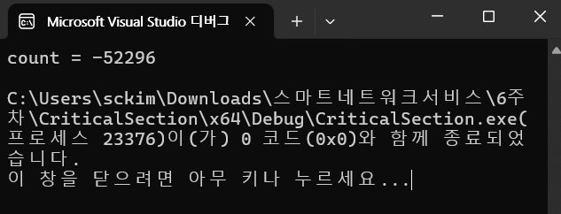

# 스레드 임계 영역 (Critical Section)

- R-M-W(Read–Modify–Write) 연산의 문제
    - 스레드가 공유 변수 `count`를 사용할 때 흔히 이런 연산을 함:

```c
count = count + 1;

```

- 이 한 줄은 실제로 CPU 수준에서 보면 세 단계로 구성됨
    1. **읽기(Read)**: 메모리에서 `count` 값을 레지스터로 가져옴.
    2. **계산(Modify)**: 레지스터 값에 +1 수행.
    3. **쓰기(Write)**: 결과를 다시 메모리에 저장.
- 한 스레드가 중간에 끼어들 수 있음.
- 두 스레드가 보호 없이 동시에 실행되면 **쓰기가 서로 덮어써져(업데이트 유실)** 최종값이 0이 아닐 수 있음.
    - Mythread1은 전역변수 count에 2를 더하는 함수이고, Mythread2는 전역변수 count에 2를 제하는 함수임으로 같은 MAXCNT로 count에 2를 축적하고, 같은 MAXCNT로 count에 -2를 축적하면 결과는 0이 나와야 한다.
    - 그러나, 스레드를 제어하는 운영체제에서 Mythread1 수행 중에 count=0으로 읽고(**읽기)**, count+=2를 더해서(**계산)** count가 2가 된 상황에서 **count에 2**를 assign(**쓰기)하는** 나머지 과정을 수행하지 않고,
        - 운영체제가 Mythread2를 수행하게 되면,
        - Mythread2에서 제일 먼저 count=0으로 읽고(**읽기)** count-=2를 제해서(**계산)**  count가 -2가 된 상황에서 count에 -2를 assign(**쓰기)**하는 나머지 과정을 수행한다
        - 그러면 현재 전역변수 **count에는 -2가 할당되어 있다.**
    - 이 때 제어권이  Mythread1로 넘어가고, Context Switching을 통해서 즉, Mythread1은 이전의 **count에 2**가 있는 것을 확인하고,
        - 전역변수 **count에 2**를 assign(**쓰기)** 하게 되면,
        - Mythread2에서 -2로 **쓰여졌던** count(=-2)가 **원래는 count=0으로 되어야 되는 데 count=2가 되는 오류 상황이 발생하게 된다.**
            - 두 스레드가 보호 없이 동시에 실행되면 **쓰기가 서로 덮어써져(업데이트 유실)** 최종값이 0이 아닐 수 있음.
- 따라서, 스레드를 제어하는 운영체제에서 Mythread1 수행 중일 때는 count를  Enter Critical Section 으로 **진입시키**고, Mythread1 의 세 단계 연산 (**읽기 → 계산 → 쓰기(R-M-W))을**  **연속적으로 수행한다.** (이전에는 연속수행하지 않고, 간헐 수행했다)
    - 즉, 첫 번째 단계, count 값 읽기, count=0,
    - 다음 단계, count+=2 수행하기,
    - 세 번째 단계 count에 2 할당하기의 세 단계를 모두 수행하고 난 후에,
    - Leave Critical Section을 **이탈**한다.
        - 즉 count 제어권을 다음 스레드에 넘긴다,
    - 그러면 Mythread2가 count를  Enter Critical Section 으로 **진입**하고,  Mythread2 의 세 단계를 흔들림 없이 수행한다.
        - 즉, 첫 번째 단계, count 값 읽기, count=2,
        - 다음 단계, count-=2 수행하기,
        - 세 번째 단계 count에 0 할당하기의 세 단계를 모두 수행하고 난 후에, Leave Critical Section을 **이탈**한다.
    - 그러면, 한 번 2를 더하고 한 번 2를 빼는 공정한 스레드 수행을 하기 때문에 n 번 2를 더하고, n번 2를 빼는 단계를 공정하게 하게 된다.
        - 결국에는 count는 0이 된다.
- 이것이 Enter Critical Section , Leave Critical Section **진입/이탈**의 효과가 된다.
- **읽기 → 계산 → 쓰기(R-M-W)** 의 3단계 연산
    - `count += 2`/`count -= 2`
    - `EnterCriticalSection(&cs)`/`LeaveCriticalSection(&cs)`는 **임계 구역에 진입/이탈**하는 동작이며, 선언이 아니라 **해당 구간을 상호 배제(Mutual Exclusion)** 로 보호한다는 뜻.
    - 임계 구역으로 보호하면 한 번에 한 스레드만 R-M-W 3단계를 **원자적으로** 끝낼 수 있어 **경쟁 조건이 사라지고** 최종 결과가 의도대로 0이 됨.
        - **이전에는** 운영체제가 스케줄링을 자유롭게 해서, `MyThread1`이 `count`를 읽고 계산하는 도중에 **`MyThread2`가 끼어들어** `count`를 바꿀 수 있었음.
            - race condition 발생 가능
        - **지금은** `EnterCriticalSection()`으로 보호하므로, `MyThread1`이 임계 구역에 들어간 동안 다른 스레드는 `LeaveCriticalSection()`이 호출될 때까지 **진입 금지**.
            - 따라서 **R–M–W 세 단계가 연속적으로** 실행됨


- 코드

```jsx
#include <windows.h>
#include <stdio.h>

#define MAXCNT 100000 //100000 
int count = 0;
//CRITICAL_SECTION cs;

DWORD WINAPI MyThread1(LPVOID arg)
{
	for (int i = 0; i < MAXCNT; i++) {
		//EnterCriticalSection(&cs);
		count += 2;
		//LeaveCriticalSection(&cs);
	}
	return 0;
}

DWORD WINAPI MyThread2(LPVOID arg)
{
	for (int i = 0; i < MAXCNT; i++) {
		//EnterCriticalSection(&cs);
		count -= 2;
		//LeaveCriticalSection(&cs);
	}
	return 0;
}

int main(int argc, char* argv[])
{
	// 임계 영역 초기화
	//InitializeCriticalSection(&cs);

	// 스레드 두 개 생성
	HANDLE hThread[2];
	hThread[0] = CreateThread(NULL, 0, MyThread1, NULL, 0, NULL);
	hThread[1] = CreateThread(NULL, 0, MyThread2, NULL, 0, NULL);

	// 스레드 두 개 종료 대기
	WaitForMultipleObjects(2, hThread, TRUE, INFINITE);

	// 임계 영역 삭제
	//DeleteCriticalSection(&cs);

	// 결과 출력
	printf("count = %d\n", count);
	return 0;
}
```

- 결과
    - **임계 구역을 사용하지 않을 때, 두 스레드 race condition으로 읽기 → 계산 → 쓰기(R-M-W)** 의 3단계 연산이 서로 **엉켜서** 첫 번째에도 0이 나오지 않음


- **임계 구역을 사용하지 않을 때, 두 스레드 race condition으로 읽기 → 계산 → 쓰기(R-M-W)** 의 3단계 연산이 서로 **엉켜서 두** 번째에도 0이 나오지 않음



- **임계 구역을 사용하지 않을 때, 두 스레드 race condition으로 읽기 → 계산 → 쓰기(R-M-W)** 의 3단계 연산이 서로 **엉켜서 세** 번째에도 0이 나오지 않음


- **임계 영역을 완전히 뺀 상태**
    - `count += 2` / `count -= 2`가 서로 **경쟁 조건(race condition)** 으로 엉키며 최종값이  0이 아닐 수 있음
    - `count += 2` 는 **읽기 → 더하기 → 쓰기**의 3단계(RMW) 임.
    - 두 스레드가 동시에 실행하면:
        - 두 스레드가 같은 `count` 값을 읽고
        - 각각 계산한 뒤
        - 서로 덮어써서 **한 쪽 업데이트가 유실됨** → 최종값이 들쭉날쭉.

## Critical Section 사용

- **윈도우 스레드와 임계 영역(Critical Section)** 을 이용해서 두 개의 스레드가 하나의 전역 변수 `count`를 동시에 수정
    - 첫 번째 스레드(`MyThread1`)는 `count`에 **2를 더함**
    - 두 번째 스레드(`MyThread2`)는 `count`에서 **2를 뺌**
    - 두 스레드는 각각 `MAXCNT`(1억) 번 반복 실행
        - `EnterCriticalSection()` / `LeaveCriticalSection()` 으로 임계 구역을 보호하므로,  한 번에 한 스레드만 `count`를 수정할 수 있음
        - 따라서 경쟁 조건(race condition)이 발생하지 않으며 **최종 결과는 항상 `0`** 이 됨

---

## 임계영역 유지

```c
#include <windows.h>
#include <stdio.h>

#define MAXCNT 100000000
volatile LONG count = 0;
CRITICAL_SECTION cs;

DWORD WINAPI MyThread1(LPVOID) {
    for (int i = 0; i < MAXCNT; ++i) {
        EnterCriticalSection(&cs);
        count += 2;
        LeaveCriticalSection(&cs);
    }
    return 0;
}

DWORD WINAPI MyThread2(LPVOID) {
    for (int i = 0; i < MAXCNT; ++i) {
        EnterCriticalSection(&cs);
        count -= 2;
        LeaveCriticalSection(&cs);
    }
    return 0;
}

int main(void) {
    InitializeCriticalSection(&cs);
#include <windows.h>
#include <stdio.h>

#define MAXCNT 100 //100000 
int count = 0;
CRITICAL_SECTION cs;

DWORD WINAPI MyThread1(LPVOID arg)
{
	for (int i = 0; i < MAXCNT; i++) {
		EnterCriticalSection(&cs);
		count += 2;
		printf("i, count (MyThread1) = %d, %d\n", i, count);
		LeaveCriticalSection(&cs);
	}
	return 0;
}

DWORD WINAPI MyThread2(LPVOID arg)
{
	for (int i = 0; i < MAXCNT; i++) {
		EnterCriticalSection(&cs);
		count -= 2;
		printf("i, count (MyThread2) = %d, %d\n", i, count);
		LeaveCriticalSection(&cs);
	}
	return 0;
}

int main(int argc, char* argv[])
{
	// 임계 영역 초기화
	InitializeCriticalSection(&cs);

	// 스레드 두 개 생성
	HANDLE hThread[2];
	hThread[0] = CreateThread(NULL, 0, MyThread1, NULL, 0, NULL);
	hThread[1] = CreateThread(NULL, 0, MyThread2, NULL, 0, NULL);

	// 스레드 두 개 종료 대기
	WaitForMultipleObjects(2, hThread, TRUE, INFINITE);

	// 임계 영역 삭제
	DeleteCriticalSection(&cs);

	// 결과 출력
	printf("count = %d\n", count);
	return 0;
}
    HANDLE hThread[2];
    hThread[0] = CreateThread(NULL, 0, MyThread1, NULL, 0, NULL);
    hThread[1] = CreateThread(NULL, 0, MyThread2, NULL, 0, NULL);

    WaitForMultipleObjects(2, hThread, TRUE, INFINITE);

    CloseHandle(hThread[0]);
    CloseHandle(hThread[1]);
    DeleteCriticalSection(&cs);

    printf("count = %ld\n", count);
    return 0;
}

```

---

- 두 스레드가 각각 100번씩 `+2`와 `2`를 수행하면 **이상적으로는** 합이 0이어야 함.
- 실제 실행 순서(기회 수 또는 타임 슬라이스)는 **운영체제 스케줄러의 재량임**
    - 따라서 `i=0~83 → 스위칭 → i=2~47 …` 같은 **덩어리(chunk)** 로 실행되는 것은 충분히 가능한 시나리오
    - 스케줄링이 이렇게 들쑥날쑥해도, 각 증가/감소가 이상적이라면 최종값은 0이 됨
- i=100으로 MyThread1이 count+=2를 100번 수행하고, 또한 i=100으로 MyThread2도 count-=2를 100번  수행한다.
- MyThread1 이 i=0,1,을 수행하고, (두 번 기회를 받음)
    - 다음은 2를 수행해야 함.
        - 루프 변수 `i`는 **스레드의 레지스터/스택**에 존재하고, 문맥 교환 시 레지스터 집합(프로그램 카운터 포함)과 스택 포인터 등이 **스레드 컨텍스트로 저장/복원됨**.
        - OS가 관리하는 **스레드 컨텍스트**에 포함된 상태가 보존됨
- MyThread2 가 i=0~83을 수행
    - 84 : **연속으로 실행된 반복 구간의 길이**(= 스케줄러가 연속으로 준 CPU 점유 시간의 결과)
- MyThread1 이 i=2~47을 수행
    - 46 : **연속으로 실행된 반복 구간의 길이**(= 스케줄러가 연속으로 준 CPU 점유 시간의 결과)
- MyThread2 가 i=84~99을 수행하고 끝남
    - 16: **연속으로 실행된 반복 구간의 길이**(= 스케줄러가 연속으로 준 CPU 점유 시간의 결과)
    - 84+16=100, CPU 점유 시간의 결과
    - `for (int i = 0; i < MAXCNT; ++i)`, 100번 반복이면 **마지막 i 값은 99임** (총 0~99).
    - 반복 횟수는 100번
- MyThread1 이 i=48~99을 수행하고 끝남
    - 52: **연속으로 실행된 반복 구간의 길이**(= 스케줄러가 연속으로 준 CPU 점유 시간의 결과)
    - 52+ 46+2 = 100, CPU 점유 시간의 결과
- MyThread1
    - 2, 46, 52 : **연속으로 실행된 반복 구간의 길이**(= 스케줄러가 연속으로 준 CPU 점유 시간의 결과)
- MyThread2
    - 84, 16 : **연속으로 실행된 반복 구간의 길이**(= 스케줄러가 연속으로 준 CPU 점유 시간의 결과)
- 여기서  2, 46, 52의 **연속으로 실행된 반복 구간의 길이,**  84, 16의 **연속으로 실행된 반복 구간의 길이배정은** 운영체제 고유의 권한임
    - **레이스의 본질과 스케줄링**
        - `count += 2` / `count -= 2`는 **읽기 → 계산 → 쓰기(RMW)** 3단계를 포함. 보호 없이 두 스레드가 섞이면 **업데이트 유실**이 생겨 최종값이 0이 아닐 수 있음.
        - 이때 **어떤 구간에서 몇 번 실행했는지(기회 수)** 보다 **RMW가 서로 끼어드는지**가 관건임. 즉, 같은 100번 vs 100번이라도 **섞이는 방식**에 따라 오차(±2의 배수)가 생길 수 있음.
    - **공정성 vs 정확성**
        - 임계 구역은 교대로 정확히 같은 양을 실행하는 **공정성**까지 보장하진 않음(스케줄링 정책에 따라 순서/빈도는 달라짐).
        - 하지만 한 번에 한 스레드만 RMW 3단계를 끝내게 하므로 **정확성(레이스 제거)** 은 보장됨


