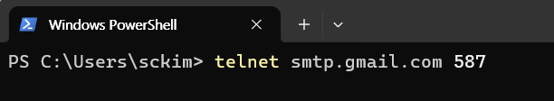

# GUI 응용 프로그램_Class

## **[1] 하얀색 배경의 빈 윈도우** 프로젝트

- 프로젝트명 : SimpleWindow
    - Windows API를 이용해 **가장 기본적인 윈도우 프로그램**을 만드는 예제

```jsx
#include <windows.h>
#include <tchar.h>

LRESULT CALLBACK WndProc(HWND, UINT, WPARAM, LPARAM);

// Unicode: wWinMain 사용
int APIENTRY wWinMain(HINSTANCE hInstance, HINSTANCE, PWSTR, int nCmdShow)
{
    WNDCLASS wc = {};
    wc.style = CS_HREDRAW | CS_VREDRAW;
    wc.lpfnWndProc = WndProc;
    wc.hInstance = hInstance;
    wc.hIcon = LoadIcon(NULL, IDI_APPLICATION);
    wc.hCursor = LoadCursor(NULL, IDC_ARROW);
    wc.hbrBackground = (HBRUSH)GetStockObject(WHITE_BRUSH);
    wc.lpszClassName = L"MyWndClass";
    if (!RegisterClass(&wc)) return 1;

    HWND hWnd = CreateWindow(L"MyWndClass", L"Simple Window",
        WS_OVERLAPPEDWINDOW, 0, 0, 500, 220, NULL, NULL, hInstance, NULL);
    if (!hWnd) return 1;

    ShowWindow(hWnd, nCmdShow);
    UpdateWindow(hWnd);

    MSG msg;
    while (GetMessage(&msg, NULL, 0, 0) > 0) {
        TranslateMessage(&msg);
        DispatchMessage(&msg);
    }
    return (int)msg.wParam;
}

LRESULT CALLBACK WndProc(HWND hWnd, UINT uMsg, WPARAM wParam, LPARAM lParam)
{
    switch (uMsg) {
    case WM_DESTROY: PostQuitMessage(0); return 0;
    }
    return DefWindowProc(hWnd, uMsg, wParam, lParam);
}

```

- 구조

```markdown
WinMain → 윈도우 등록(RegisterClass)
        → 윈도우 생성(CreateWindow)
        → 메시지 루프(GetMessage/DispatchMessage)
        → WndProc(메시지 처리)

```

---

## 2. WinMain

- 프로그램의 시작점

```cpp
int APIENTRY wWinMain(HINSTANCE hInstance, HINSTANCE, PWSTR, int nCmdShow)

```

- `wWinMain()`
    - **Windows GUI 프로그램의 진입점(Entry Point)** 함수
    - 콘솔 프로그램의 `main()`과 같은 역할
    - Windows에서는 화면창(윈도우)을 띄우기 위한 초기화가 필요
    - `WinMain` 또는 `wWinMain`을 사용
    
    | 인자 | 의미 |
    | --- | --- |
    | `hInstance` | 현재 실행 중인 프로그램의 인스턴스 핸들 |
    | `hPrevInstance` | 과거 Windows에서 쓰던 값 (항상 `NULL`) |
    | `lpCmdLine` / `PWSTR` | 명령행 인수 |
    | `nCmdShow` | 윈도우 표시 상태(보이기, 최소화 등) |

---

- `WinMain`과 `wWinMain`
    - **Windows GUI 프로그램의 시작점(entry point)**
    - 둘 다 같은 역할을 하지만 **문자 인코딩(문자열 처리 방식)** 에 차이가 있음

---

| 항목 | **WinMain** | **wWinMain** |
| --- | --- | --- |
| 문자 타입 | 멀티바이트(MBCS, ANSI) | 유니코드(UTF-16, wide char) |
| 문자열 리터럴 | `"문자열"` (char*) | `L"문자열"` (wchar_t*) |
| 명령줄 인자 | `LPSTR` | `LPWSTR` |
| 사용 API | `CreateWindowA`, `MessageBoxA` 등 ANSI 버전 | `CreateWindowW`, `MessageBoxW` 등 유니코드 버전 |
| 현재 권장 여부 | 과거 방식 | Windows 기본 표준 |

## 함수 시그니처

```c
// ANSI (WinMain)
int WINAPI WinMain(
    HINSTANCE hInstance,
    HINSTANCE hPrevInstance,
    LPSTR lpCmdLine,
    int nCmdShow
);

```

```c
// Unicode (wWinMain)
int WINAPI wWinMain(
    HINSTANCE hInstance,
    HINSTANCE hPrevInstance,
    LPWSTR lpCmdLine,
    int nCmdShow
);

```

---

### WinMain (ANSI)

```c
#include <windows.h>

int WINAPI WinMain(HINSTANCE hInstance, HINSTANCE hPrevInstance,
                   LPSTR lpCmdLine, int nCmdShow)
{
    MessageBoxA(NULL, "안녕하세요!", "WinMain", MB_OK);
    return 0;
}

```

### wWinMain (Unicode)

```c
#include <windows.h>

int WINAPI wWinMain(HINSTANCE hInstance, HINSTANCE hPrevInstance,
                    LPWSTR lpCmdLine, int nCmdShow)
{
    MessageBoxW(NULL, L"안녕하세요!", L"wWinMain", MB_OK);
    return 0;
}

```

---

## 유니코드(`wWinMain`) 권장

1. **전 세계 언어 지원**
    - 한글, 일본어, 중국어 등 비영어권 문자를 안정적으로 처리할 수 있음.
2. **Windows 내부는 유니코드 기반**
    - OS 내부 API 대부분이 유니코드 버전(`...W`)으로 작동.
    - `WinMain`은 결국 내부적으로 ANSI → Unicode 변환이 일어남 (비효율적).
3. **Visual Studio 기본 설정**
    - 새 프로젝트를 만들면 `_UNICODE`와 `UNICODE` 매크로가 기본으로 정의되어 `WinMain` 대신 `wWinMain`이 자동으로 사용.

---

## 3. RegisterClass : WNDCLASS 구조체 등록

- 윈도우를 만들기 전에 이 윈도우는 어떤 특징을 가진다를 **등록하는 과정**.
    - `RegisterClass`는 시스템에 “이런 창을 만들겠다”라고 알려주는 역할

```cpp
WNDCLASS **wc** = {};
wc.style = CS_HREDRAW | CS_VREDRAW;
wc.lpfnWndProc = WndProc;
wc.hInstance = hInstance;
wc.hIcon = LoadIcon(NULL, IDI_APPLICATION);
wc.hCursor = LoadCursor(NULL, IDC_ARROW);
wc.**hbrBackground** = (HBRUSH)GetStockObject(**WHITE_BRUSH**);
wc.lpszClassName = L"MyWndClass";
RegisterClass(&**wc**);

```

| 멤버 | 의미 |
| --- | --- |
| `lpfnWndProc` | 메시지를 처리할 함수(= `WndProc`) |
| `hIcon`, `hCursor` | 아이콘, 커서 모양 |
| `hbrBackground` | 배경색 |
| `lpszClassName` | 윈도우 클래스 이름 |

---

## 4. CreateWindow : 윈도우 생성

- 실제 눈에 보이는 창(Window) 생성

```cpp
HWND hWnd = CreateWindow(L"MyWndClass", L"Simple Window",
    WS_OVERLAPPEDWINDOW, 0, 0, 500, 220, NULL, NULL, hInstance, NULL);

```

| 인자 | 의미 |
| --- | --- |
| `"MyWndClass"` | 방금 등록한 클래스 이름 |
| `"Simple Window"` | 윈도우 제목 표시줄에 보이는 텍스트 |
| `WS_OVERLAPPEDWINDOW` | 표준 윈도우 스타일(닫기, 최소화 등 포함) |
| `0,0,500,220` | 위치(x,y)와 크기(width,height) |
- 반환값 `hWnd`는 이 창을 가리키는 핸들

---

## 5. GetMessage/DispatchMessage : 메시지 루프

```cpp
MSG msg;
while (GetMessage(&msg, NULL, 0, 0) > 0) {
    TranslateMessage(&msg);
    DispatchMessage(&msg);
}

```

- Windows 프로그램은 **이벤트 기반 구조**
    - 예: 마우스 클릭, 창 크기 변경, 종료 등
- `GetMessage`로 메시지를 받으면,
    - `TranslateMessage`
        - 키 입력 등 보조 처리
    - `DispatchMessage`
        - 등록된 `WndProc`으로 전달
- 이 루프가 종료되면 프로그램이 끝남

---

## 6. WndProc : 윈도우 프로시저

- **운영체제가 보내는 모든 이벤트를 이 함수에서 처리**

```cpp
LRESULT CALLBACK WndProc(HWND hWnd, UINT uMsg, WPARAM wParam, LPARAM lParam)
{
    switch (uMsg) {
    case WM_DESTROY:
        PostQuitMessage(0);
        return 0;
    }
    return DefWindowProc(hWnd, uMsg, wParam, lParam);
}

```

| 메시지 | 의미 |
| --- | --- |
| `WM_CREATE` | 창이 처음 만들어질 때 |
| `WM_PAINT` | 화면을 다시 그릴 때 |
| `WM_SIZE` | 창 크기 변경 시 |
| `WM_DESTROY` | 창이 닫힐 때 |
- `PostQuitMessage(0)`은 메시지 루프를 종료시키는 역할

---

- 이 코드를 빌드하면 단순히 **하얀색 배경의 빈 윈도우**가 나옴
- 닫기 버튼을 누르면 `WM_DESTROY` → `PostQuitMessage` → 프로그램 종료 순서로 종료

---

| 단계 | 역할 |
| --- | --- |
| `WinMain` | 프로그램 시작점 |
| `RegisterClass` | 윈도우 형태 등록 |
| `CreateWindow` | 실제 윈도우 생성 |
| `ShowWindow` / `UpdateWindow` | 윈도우 표시 |
| `GetMessage` 루프 | 메시지 처리 |
| `WndProc` | 각종 이벤트 처리 |

---

- 결과 화면



## **[2]** 버튼 클릭 횟수, 마우스 클릭 위치 GUI 프로젝트

- 프로젝트명 : WindowsProject1

```cpp
#include <windows.h>
#include <tchar.h>
#include <windowsx.h>  // ← 이 줄 추가!

LRESULT CALLBACK WndProc(HWND, UINT, WPARAM, LPARAM);

// ── 전역 상태 ─────────────────────────────────────────────
static WCHAR g_msg[256] = L"안녕하세요! 버튼을 눌러보거나 창을 클릭해보세요.";
static int   g_clicks = 0;       // 버튼 클릭 횟수
static HWND  g_hButton = nullptr;

// ── 진입점 ────────────────────────────────────────────────
int APIENTRY wWinMain(_In_ HINSTANCE hInstance,
    _In_opt_ HINSTANCE,
    _In_     PWSTR,
    _In_     int nCmdShow)
{
    // 1) 윈도우 클래스 등록
    WNDCLASS wc = {};
    wc.style = CS_HREDRAW | CS_VREDRAW;
    wc.lpfnWndProc = WndProc;
    wc.hInstance = hInstance;
    wc.hIcon = LoadIcon(NULL, IDI_APPLICATION);
    wc.hCursor = LoadCursor(NULL, IDC_ARROW);
    wc.hbrBackground = (HBRUSH)GetStockObject(WHITE_BRUSH);
    wc.lpszClassName = L"MyWndClass";
    if (!RegisterClass(&wc)) return 1;

    // 2) 윈도우 생성
    HWND hWnd = CreateWindow(
        L"MyWndClass", L"Simple Window - Button/Mouse Demo",
        WS_OVERLAPPEDWINDOW, CW_USEDEFAULT, CW_USEDEFAULT, 600, 350,
        NULL, NULL, hInstance, NULL);
    if (!hWnd) return 1;

    ShowWindow(hWnd, nCmdShow);
    UpdateWindow(hWnd);

    // 3) 메시지 루프
    MSG msg;
    while (GetMessage(&msg, NULL, 0, 0) > 0) {
        TranslateMessage(&msg);
        DispatchMessage(&msg);
    }
    return (int)msg.wParam;
}

// ── 윈도우 프로시저 ───────────────────────────────────────
LRESULT CALLBACK WndProc(HWND hWnd, UINT uMsg, WPARAM wParam, LPARAM lParam)
{
    switch (uMsg) {
    case WM_CREATE:
    {
        // 버튼 만들기
        g_hButton = CreateWindowEx(
            0, L"BUTTON", L"눌러주세요",
            WS_CHILD | WS_VISIBLE | BS_PUSHBUTTON,
            20, 20, 120, 32,               // x, y, width, height
            hWnd, (HMENU)1001,
            ((LPCREATESTRUCT)lParam)->hInstance, NULL);
        return 0;
    }

    case WM_COMMAND:
        // 버튼 클릭 처리
        if (LOWORD(wParam) == 1001 && HIWORD(wParam) == BN_CLICKED) {
            ++g_clicks;
            swprintf_s(g_msg, L"버튼 클릭: %d회", g_clicks);
            InvalidateRect(hWnd, NULL, TRUE);   // 다시 그리기 요청
        }
        return 0;

    case WM_LBUTTONDOWN:
    {
        // 마우스 좌클릭 좌표 표시
        const int x = GET_X_LPARAM(lParam);
        const int y = GET_Y_LPARAM(lParam);
        swprintf_s(g_msg, L"마우스 클릭 좌표: (%d, %d)", x, y);
        InvalidateRect(hWnd, NULL, TRUE);
        return 0;
    }

    case WM_PAINT:
    {
        // 텍스트 출력
        PAINTSTRUCT ps;
        HDC hdc = BeginPaint(hWnd, &ps);
        RECT rc; GetClientRect(hWnd, &rc);
        rc.top = 70; // 버튼 아래쪽에 텍스트 보이도록
        DrawText(hdc, g_msg, -1, &rc, DT_LEFT | DT_TOP | DT_SINGLELINE);
        EndPaint(hWnd, &ps);
        return 0;
    }

    case WM_DESTROY:
        PostQuitMessage(0);
        return 0;
    }

    return DefWindowProc(hWnd, uMsg, wParam, lParam);
}

```

- **Win32 API로 만든 간단한 윈도우 프로그램**
    - **버튼을 누르면 클릭 횟수 표시**
    - **창을 마우스로 클릭하면 클릭 좌표를 표시**

---

1. **윈도우 클래스 등록 :**`RegisterClass`
2. **윈도우 생성** : `CreateWindow`
3. **메시지 루프** : 이벤트 처리 대기
4. **윈도우 프로시저(WndProc)** : 버튼 클릭, 마우스 클릭, 그리기 등 이벤트 처리

---

## 전역 변수 부분

```c
static WCHAR g_msg[256] = L"안녕하세요! 버튼을 눌러보거나 창을 클릭해보세요.";
static int   g_clicks = 0;
static HWND  g_hButton = nullptr;

```

| 변수 | 설명 |
| --- | --- |
| `g_msg` | 화면에 출력할 텍스트(메시지)를 저장하는 버퍼 |
| `g_clicks` | 버튼 클릭 횟수를 저장 |
| `g_hButton` | 버튼 컨트롤의 윈도우 핸들(HWND) 저장용 |

---

## wWinMain — 프로그램 진입점

- Windows GUI 프로그램은 `main()` 대신 `wWinMain()`에서 시작
    - `hInstance` : 현재 실행 중인 프로그램의 인스턴스 핸들
    - `nCmdShow` : 창을 처음 어떻게 표시할지 (`SW_SHOW`, `SW_MINIMIZE` 등)

```c
int APIENTRY wWinMain(HINSTANCE hInstance,
    HINSTANCE, PWSTR, int nCmdShow)

```

---

### 윈도우 클래스 등록 :  **윈도우의 성격 등록**

```c
WNDCLASS wc = {};
wc.style = CS_HREDRAW | CS_VREDRAW;
wc.lpfnWndProc = WndProc;
wc.hInstance = hInstance;
wc.hIcon = LoadIcon(NULL, IDI_APPLICATION);
wc.hCursor = LoadCursor(NULL, IDC_ARROW);
wc.hbrBackground = (HBRUSH)GetStockObject(WHITE_BRUSH);
wc.lpszClassName = L"MyWndClass";
RegisterClass(&wc);

```

| 항목 | 설명 |
| --- | --- |
| `lpfnWndProc` | 윈도우 프로시저 함수 이름 (메시지 처리 담당) |
| `hIcon`, `hCursor` | 아이콘, 커서 설정 |
| `hbrBackground` | 배경색 (흰색 브러시 사용) |
| `lpszClassName` | 클래스 이름 (CreateWindow에서 사용) |

---

### 윈도우 생성

```c
HWND hWnd = CreateWindow(
    L"MyWndClass", L"Simple Window - Button/Mouse Demo",
    WS_OVERLAPPEDWINDOW,
    CW_USEDEFAULT, CW_USEDEFAULT, 600, 350,
    NULL, NULL, hInstance, NULL);

```

| 매개변수 | 의미 |
| --- | --- |
| `"MyWndClass"` | 위에서 등록한 클래스 이름 |
| `"Simple Window..."` | 윈도우 제목 |
| `WS_OVERLAPPEDWINDOW` | 일반적인 윈도우 스타일 (제목줄, 닫기버튼 등 포함) |
| `CW_USEDEFAULT` | 기본 위치/크기 자동 지정 |
| `hInstance` | 현재 인스턴스 핸들 |
| 마지막 `NULL` | 추가 데이터 없음 |

---

### 메시지 루프

- 운영체제가 보내는 이벤트(메시지) 를 받아서`WndProc()` 함수로 전달하는 핵심 부분
    - `GetMessage()`
        - 메시지 큐에서 메시지 꺼내기
    - `TranslateMessage()`
        - 키보드 입력 보조 처리
    - `DispatchMessage()`
        - WndProc()으로 메시지 전달

```c
MSG msg;
while (GetMessage(&msg, NULL, 0, 0) > 0) {
    TranslateMessage(&msg);
    DispatchMessage(&msg);
}

```

---

## WndProc — 윈도우 프로시저

- 모든 이벤트(버튼 클릭, 마우스 클릭, 창 닫기 등)는 여기서 처리됨

```c
LRESULT CALLBACK WndProc(HWND hWnd, UINT uMsg, WPARAM wParam, LPARAM lParam)

```

---

### 1. WM_CREATE — 창이 처음 만들어질 때

- 자식 윈도우(Button 컨트롤) 생성
    - 위치: (20, 20)
    - 크기: (120×32)
    - ID: 1001 (버튼 구분용)
    - `WS_CHILD | WS_VISIBLE`: 부모 창 안에서 보이는 컨트롤

```c
g_hButton = CreateWindowEx(
    0, L"BUTTON", L"눌러주세요",
    WS_CHILD | WS_VISIBLE | BS_PUSHBUTTON,
    20, 20, 120, 32,
    hWnd, (HMENU)1001,
    ((LPCREATESTRUCT)lParam)->hInstance, NULL);

```

---

### 2. WM_COMMAND — 버튼 클릭 시 호출

- `LOWORD(wParam)` → 어떤 컨트롤(ID 1001)이 눌렸는지
- `HIWORD(wParam)` → 어떤 이벤트인지 (`BN_CLICKED` = 버튼 클릭)
- `swprintf_s` → 클릭 횟수를 문자열로 만듦
- `InvalidateRect()` → “화면 다시 그려주세요” 요청 → `WM_PAINT` 발생

```c
if (LOWORD(wParam) == 1001 && HIWORD(wParam) == BN_CLICKED) {
    ++g_clicks;
    swprintf_s(g_msg, L"버튼 클릭: %d회", g_clicks);
    InvalidateRect(hWnd, NULL, TRUE);
}

```

---

### 3. WM_LBUTTONDOWN — 마우스 왼쪽 버튼 클릭 시

- 마우스 클릭 좌표 (x, y)를 얻어서 문자열에 저장
- 다시 그리기 요청 (`WM_PAINT` 호출됨)

```c
const int x = GET_X_LPARAM(lParam);
const int y = GET_Y_LPARAM(lParam);
swprintf_s(g_msg, L"마우스 클릭 좌표: (%d, %d)", x, y);
InvalidateRect(hWnd, NULL, TRUE);

```

## 좌표 표시

- **마우스 좌클릭 시 좌표 표시 기능**

```c
case WM_LBUTTONDOWN:
{
    // 마우스 좌클릭 좌표 표시
    const int x = GET_X_LPARAM(lParam);
    const int y = GET_Y_LPARAM(lParam);
    swprintf_s(g_msg, L"마우스 클릭 좌표: (%d, %d)", x, y);
    InvalidateRect(hWnd, NULL, TRUE);
    return 0;
}

```

- `WM_LBUTTONDOWN`
    - 마우스 왼쪽 버튼이 눌렸을 때 발생하는 메시지
- `lParam`
    - 클릭 위치 정보가 들어있는 32비트 값
        - 하위 16비트 → x 좌표
        - 상위 16비트 → y 좌표
- `GET_X_LPARAM`, `GET_Y_LPARAM`
    - 이 값을 각각 정수형으로 꺼내주는 매크로 (`windowsx.h`에 정의)
- `swprintf_s`
    - 문자열 버퍼 `g_msg`에 좌표 정보를 저장
- `InvalidateRect`
    - 윈도우 전체를 다시 그리도록 요청 → `WM_PAINT` 호출 유도
    - 이후 `WM_PAINT`에서 `DrawText()`가 호출되어 `g_msg` 문자열(즉, “마우스 클릭 좌표: (x, y)”)이 화면에 표시됨

---

### 4. WM_PAINT — 화면 다시 그리기

- `BeginPaint()` → 그리기 시작 (HDC 얻기)
- `DrawText()` → `g_msg`의 내용을 창에 출력
- `EndPaint()` → 그리기 종료, 즉, 화면에 표시되는 문장은 **g_msg** 변수에 들어있는 문자열임

```c
PAINTSTRUCT ps;
HDC hdc = BeginPaint(hWnd, &ps);
RECT rc; GetClientRect(hWnd, &rc);
rc.top = 70;
DrawText(hdc, g_msg, -1, &rc, DT_LEFT | DT_TOP | DT_SINGLELINE);
EndPaint(hWnd, &ps);

```

---

### 5. WM_DESTROY — 창 닫기

- 메시지 루프의 `GetMessage()`가 0을 반환하도록 해서 프로그램 종료

```c
PostQuitMessage(0);

```

---

- 프로그램 시작 → 윈도우 생성 (`WM_CREATE`) → 버튼 생성
- 화면에 “안녕하세요! …” 문장 표시
- 버튼 클릭 → `WM_COMMAND` → 클릭 횟수 출력
- 마우스 클릭 → `WM_LBUTTONDOWN` → 클릭 좌표 출력
- 창 닫기 → `WM_DESTROY` → 프로그램 종료

---

| 기능 | 메시지 | 동작 |
| --- | --- | --- |
| 버튼 생성 | `WM_CREATE` | `CreateWindowEx()`로 버튼 만들기 |
| 버튼 클릭 | `WM_COMMAND` | 클릭 횟수 증가 후 다시 그리기 |
| 마우스 클릭 | `WM_LBUTTONDOWN` | 클릭 좌표 표시 |
| 화면 다시 그림 | `WM_PAINT` | `g_msg`를 화면에 출력 |
| 종료 | `WM_DESTROY` | 프로그램 끝 |

---

- 프로그램을 실행하면 “Simple Window - Button/Mouse Demo” 창이 열림
    - 윈도우 왼쪽 위에 **“눌러주세요”** 버튼이 보림
    - 버튼을 누르면 `"버튼 클릭: N회"`가 표시됨
    - 창의 빈 공간을 **마우스로 클릭하면**, `"마우스 클릭 좌표: (x, y)"` 가 화면에 출력

| 동작 | 결과 |
| --- | --- |
| 처음 실행 | “안녕하세요! 버튼을 눌러보거나 창을 클릭해보세요.” |
| 버튼 클릭 | “버튼 클릭: 1회” |
| 창 빈 공간 클릭 (예: x=230, y=150) | “마우스 클릭 좌표: (230, 150)” |

- 눌러주세요 버튼 클릭  화면 캡쳐


- 빈 공간에서 마우스 클릭 화면 캡쳐


## **디바이스 컨텍스트 (Device Context)**

- `HDC`는 **Windows GDI(Graphics Device Interface)** 에서 **디바이스 컨텍스트(Device Context)**를 가리키는 **핸들(Handle)**
- HDC (Handle to Device Context)
    - 윈도우에 그림(텍스트, 선, 이미지 등)을 그리기 위한 도화지 역할의 핸들
    - Windows에서 화면에 글씨를 쓰거나 그림을 그리려면 “어디에, 어떤 도구로, 무엇을 그릴지” 알려줘야 함.
    - 그때 사용하는 게 바로 디바이스 컨텍스트 (DC)이고, 그걸 가리키는 타입이 `HDC`

### 얻기

- 그릴 대상에 따라 다름

| 함수 | 설명 |
| --- | --- |
| `BeginPaint(hWnd, &ps)` | `WM_PAINT` 처리 중에만 사용 (자동 클리핑 처리) |
| `GetDC(hWnd)` | 임시로 DC를 얻음 (그릴 수 있음, 직접 해제 필요) |
| `CreateCompatibleDC(hdc)` | 메모리용 DC 생성 (화면에 바로 안 그림, 오프스크린 작업용) |

### 그리기

```c
TextOut(hdc, 20, 20, L"Hello GDI", 9);       // 텍스트 출력
MoveToEx(hdc, 10, 10, NULL); LineTo(hdc, 100, 100); // 선 그리기
Rectangle(hdc, 50, 50, 150, 150);            // 사각형
Ellipse(hdc, 100, 100, 200, 200);            // 원

```

### 해제

- 그리기 끝나면 OS에 반환해야 합니다.

| 함수 | 설명 |
| --- | --- |
| `EndPaint(hWnd, &ps)` | `BeginPaint()`의 짝 (WM_PAINT 안에서) |
| `ReleaseDC(hWnd, hdc)` | `GetDC()`의 짝 |

---

## WM_PAINT 안에서 사용

```c
case WM_PAINT:
{
    PAINTSTRUCT ps;
    HDC hdc = BeginPaint(hWnd, &ps);   // ① 그릴 도화지 얻기

    TextOut(hdc, 20, 20, L"Hello, Windows!", 15);  // ② 그리기

    EndPaint(hWnd, &ps);               // ③ DC 반환
    return 0;
}

```

- 윈도우가 다시 그리기 요청(`InvalidateRect`)을 받았을 때 화면에 텍스트나 그래픽이 정확히 그려짐

---

## 다양한 DC 종류

| 종류 | 설명 |
| --- | --- |
| 화면 DC | 기본 — `GetDC(hWnd)`로 얻음 |
| 메모리 DC | 이미지 처리, 더블버퍼링용 — `CreateCompatibleDC()` |
| 프린터 DC | 프린터 출력용 |
| 비트맵 DC | `CreateCompatibleBitmap()`과 함께 사용 |

## [3] 메시지 Instance 핸들값 출력 GUI 프로젝트

- 프로젝트명 : WinApp_Instance
- 코드

```jsx
#define _CRT_SECURE_NO_WARNINGS // 구형 C 함수 사용 시 경고 끄기
#include <windows.h>
#include <tchar.h>
#include <stdio.h>

// 윈도우 프로시저
LRESULT CALLBACK WndProc(HWND, UINT, WPARAM, LPARAM);
// 에디트 컨트롤 출력 함수
void DisplayText(const char* fmt, ...);

HINSTANCE hInst; // 인스턴스 핸들
HWND hEdit; // 에디트 컨트롤

int WINAPI WinMain(HINSTANCE hInstance, HINSTANCE hPrevInstance,
	LPSTR lpCmdLine, int nCmdShow)
{
	hInst = hInstance;

	// 윈도우 클래스 등록
	WNDCLASS wndclass;
	wndclass.style = CS_HREDRAW | CS_VREDRAW;
	wndclass.lpfnWndProc = WndProc;
	wndclass.cbClsExtra = 0;
	wndclass.cbWndExtra = 0;
	wndclass.hInstance = hInstance;
	wndclass.hIcon = LoadIcon(NULL, IDI_APPLICATION);
	wndclass.hCursor = LoadCursor(NULL, IDC_ARROW);
	wndclass.hbrBackground = (HBRUSH)GetStockObject(WHITE_BRUSH);
	wndclass.lpszMenuName = NULL;
	wndclass.lpszClassName = _T("MyWndClass");
	if (!RegisterClass(&wndclass)) return 1;

	// 윈도우 생성
	HWND hWnd = CreateWindow(_T("MyWndClass"), _T("WinApp"),
		WS_OVERLAPPEDWINDOW, 0, 0, 500, 220,
		NULL, NULL, hInstance, NULL);
	if (hWnd == NULL) return 1;
	ShowWindow(hWnd, nCmdShow);
	UpdateWindow(hWnd);

	// 메시지 루프
	MSG msg;
	while (GetMessage(&msg, 0, 0, 0) > 0) {
		TranslateMessage(&msg);
		DispatchMessage(&msg);
	}
	return (int)msg.wParam;
}

// 윈도우 프로시저
LRESULT CALLBACK WndProc(HWND hWnd, UINT uMsg, WPARAM wParam, LPARAM lParam)
{
	switch (uMsg) {
	case WM_CREATE:
		hEdit = CreateWindow(_T("edit"), NULL,
			WS_CHILD | WS_VISIBLE | WS_HSCROLL |
			WS_VSCROLL | ES_AUTOHSCROLL |
			ES_AUTOVSCROLL | ES_MULTILINE,
			0, 0, 0, 0, hWnd, (HMENU)100, hInst, NULL);
		DisplayText("간단한 GUI 응용 프로그램입니다.\r\n");
		DisplayText("인스턴스 핸들값은 %#x입니다.\r\n", hInst);
		return 0;
	case WM_SIZE:
		MoveWindow(hEdit, 0, 0, LOWORD(lParam), HIWORD(lParam), TRUE);
		return 0;
	case WM_SETFOCUS:
		SetFocus(hEdit);
		return 0;
	case WM_DESTROY:
		PostQuitMessage(0);
		return 0;
	}
	return DefWindowProc(hWnd, uMsg, wParam, lParam);
}

// 에디트 컨트롤 출력 함수
void DisplayText(const char* fmt, ...)
{
	va_list arg;
	va_start(arg, fmt);
	char cbuf[1024];
	vsprintf(cbuf, fmt, arg);
	va_end(arg);

	int nLength = GetWindowTextLength(hEdit);
	SendMessage(hEdit, EM_SETSEL, nLength, nLength);
	SendMessageA(hEdit, EM_REPLACESEL, FALSE, (LPARAM)cbuf);
}
```

- **Win32 API로 만든 간단한 GUI 앱**
    - 에디트 컨트롤(멀티라인 텍스트 박스)을 창에 깔아 놓고 거기에 문자열을 계속 붙여 넣는 예제
- `WinMain`
    - **윈도우 클래스 등록 → 창 생성 → 메시지 루프**.
- `WM_CREATE`
    - **에디트 컨트롤 생성**하고 `DisplayText`로 텍스트 출력.
- `WM_SIZE`
    - **에디트 컨트롤을 창 크기에 맞춰 리사이즈**.
- `WM_SETFOCUS`
    - **포커스를 에디트로 이동**.
- `WM_DESTROY`
    - **프로그램 종료**.

---

### 전역 변수

- `hInst`
    - 현재 프로세스의 인스턴스 핸들(리소스/창 생성 시 필요)
- `hEdit`
    - 생성한 에디트 컨트롤의 핸들. 이후 텍스트 조작에 사용.

### WinMain

- `WNDCLASS` 채우고 `RegisterClass`
    - 이 앱 창의 **모양과 동작 규칙** 등록.
- `CreateWindow`
    - 실제 **최상위 창** 생성.
- `ShowWindow`, `UpdateWindow`
    - 창 표시/초기 그리기.
- 메시지 루프
    - `GetMessage` → `TranslateMessage` → `DispatchMessage`로 **이벤트 처리**.

### WndProc (윈도우 프로시저)

- `WM_CREATE`
    - 에디트 컨트롤 생성
        
        ```cpp
        WS_CHILD | WS_VISIBLE            // 자식/보이기
        | WS_HSCROLL | WS_VSCROLL        // 스크롤바
        | ES_AUTOHSCROLL | ES_AUTOVSCROLL| ES_MULTILINE  // 자동 스크롤 + 다중행
        
        ```
        
    - `DisplayText(...)`로 텍스트 두 줄 출력.
- `WM_SIZE`
    - `MoveWindow(hEdit, 0,0, cx, cy, TRUE);`
        - 창 크기 변경 시 **에디트를 전체 영역으로 확대**.
- `WM_SETFOCUS`
    - 메인 창이 포커스를 얻으면 실제 입력은 에디트가 받도록 **포커스 위임**.
- `WM_DESTROY`
    - `PostQuitMessage(0);`
        - 메시지 루프 종료 → 프로그램 종료.

### DisplayText (가변 인자 출력 도우미)

- `printf` 스타일 포맷 문자열을 받아 **버퍼에 포맷팅** 후 에디트 끝에 붙임.
    1. `GetWindowTextLength(hEdit)` 
        1. 현재 텍스트 길이(끝 위치)
    2. `EM_SETSEL`로 **캐럿을 끝으로 이동**
    3. `EM_REPLACESEL`로 **선택 영역을 새 문자열로 교체** 
        1. 결과적으로 뒤에 덧붙이기

---

- `printf` 스타일 포맷 문자열을 받아 버퍼에 채우고 → 에디트 컨트롤의 **커서를 맨 끝으로 이동** → 그 위치에 **새 문자열로 교체(=붙여 넣기)**

---

```cpp
void DisplayText(const char* fmt, ...)
{
    va_list arg;
    va_start(arg, fmt);

```

- `...`
    - 세 개의 점은 C/C++에서 **가변 인자(variadic arguments)**를 뜻함
    - **함수에 전달할 인자의 개수가 고정되어 있지 않을 때** 사용하는 문법
    
    ```
    ...
    ```
    
- `va_list/va_start`
    - 가변 인자 접근 시작 (`fmt` 뒤의 인자들을 순회할 준비)

```cpp
    char cbuf[1024];
    vsprintf(cbuf, fmt, arg);
    va_end(arg);

```

- `cbuf`
    - 출력할 문자열을 임시 저장할 **ANSI 버퍼**
    - 최대 1023문자 + NULL
- `vsprintf`
    - `printf` 계열 포맷 함수
    - `fmt`와 가변 인자(`arg`)를 사용해 `cbuf`에 결과를 기록
- `va_end`
    - 가변 인자 사용 종료.

```cpp
    int nLength = GetWindowTextLength(hEdit);

```

- 에디트 컨트롤의 **현재 텍스트 길이**를 가져옴
- 반환값은 문자 수(ANSI면 바이트 수와 동일, 유니코드면 UTF-16 문자수
    - 프로젝트가 ANSI인지 Unicode인지에 따라 `GetWindowTextLength` 는 `GetWindowTextLengthA/W` 로 매핑됨.

```cpp
    SendMessage(hEdit, EM_SETSEL, nLength, nLength);

```

- **선택 영역 (Selection)**
    - `[nLength, nLength]` 로 설정 → 즉, **문자열 끝**으로 커서를 이동
    - 이렇게 하면 다음에 입력되는 문자는 끝에 들어간다 상태가 됨

```cpp
    SendMessageA(hEdit, EM_REPLACESEL, FALSE, (LPARAM)cbuf);
}

```

- 현재 선택 영역을 `cbuf`의 텍스트로 **교체**
    - 선택 길이가 0이므로 사실상 끝에 붙이기가 됨
- `wParam = FALSE`
    - **되돌리기(Undo) 버퍼에 기록하지 않음**
    - 사용자가 `Ctrl+Z` 로 되돌리길 원하면 `TRUE` 로 진행함
- `SendMessageA`
    - **ANSI 고정**
    - Unicode라면 `SendMessage`(TCHAR 버전)로 바꾸거나 `SendMessageW`  사용
    - 같은 일을 하는 것 같지만, **미묘하게 다른 목적**을 가지고 있고, **ANSI/유니코드 호환성** 때문

---

```cpp
SendMessage(hEdit, EM_SETSEL, nLength, nLength);
SendMessageA(hEdit, EM_REPLACESEL, FALSE, (LPARAM)cbuf);

```

---

| 함수 | 의미 | 문자 인코딩 | 이유 |
| --- | --- | --- | --- |
| `SendMessage` | 유니코드/ANSI 자동 선택 | `UNICODE` 매크로에 따라 `SendMessageW` 또는 `SendMessageA`로 컴파일 | 표준 메시지 전송 |
| `SendMessageA` | ANSI 전용 버전 | 항상 ANSI(`char*`) | `cbuf`가 `char[]` (ANSI) 문자열이라 명시적으로 ANSI 버전 사용 |

### `SendMessage(hEdit, EM_SETSEL, ...)`

- 이 메시지는 **에디트 컨트롤의 커서 위치(선택 영역)**를 지정하는 기능
    - 문자열을 다루지 않기 때문에 **ANSI/유니코드 버전 구분이 필요 없음**

---

### `SendMessageA(hEdit, EM_REPLACESEL, FALSE, (LPARAM)cbuf)`

- 이 메시지는 실제 **문자열을 다룸**
    - `lParam`에 들어가는 `cbuf`는 `char*` — 즉 **ANSI 문자열**
    - 유니코드 프로젝트에서도 ANSI 문자열(char*)을 그대로 출력하기 위해 SendMessageA를 명시적으로 사용

| 항목 | 이유 |
| --- | --- |
| `SendMessage()` | 커서 조작 등, 문자열이 필요 없는 메시지에 사용 |
| `SendMessageA()` | `char*`(ANSI) 문자열을 다룰 때 강제로 ANSI 버전 호출 |
| **혼용**  | 프로젝트 전체는 유니코드 기반이지만, 출력 문자열은 `char*`로 작성되어 있기 때문 |

---

- 출력


## [4] 메시지 루프 지연 : Sleep(3000) GUI 프로젝트

- 프로젝트명 : WinApp_Instance
    - 윈도우 크기를 변경할 때, 3초간 지연 발생
    - 스레드 필요 이유가 됨


- 윈도우 메시지 처리와 소켓 통신, 데이터 처리를 동시에 하는 스레드 필요


## [5] TCPServer GUI 프로젝트

- 프로젝트명 : GUITCPServer

```jsx
#include "..\Common.h"

#define SERVERPORT 9000
#define BUFSIZE    512

// 윈도우 프로시저
LRESULT CALLBACK WndProc(HWND, UINT, WPARAM, LPARAM);
// 에디트 컨트롤 출력 함수
void DisplayText(const char* fmt, ...);
// 소켓 함수 오류 출력
void DisplayError(const char* msg);
// 소켓 통신 스레드 함수
DWORD WINAPI ServerMain(LPVOID arg);
DWORD WINAPI ProcessClient(LPVOID arg);

HINSTANCE hInst; // 인스턴스 핸들
HWND hEdit; // 에디트 컨트롤
CRITICAL_SECTION cs; // 임계 영역

int WINAPI WinMain(HINSTANCE hInstance, HINSTANCE hPrevInstance,
	LPSTR lpCmdLine, int nCmdShow)
{
	hInst = hInstance;
	InitializeCriticalSection(&cs);

	// 윈도우 클래스 등록
	WNDCLASS wndclass;
	wndclass.style = CS_HREDRAW | CS_VREDRAW;
	wndclass.lpfnWndProc = WndProc;
	wndclass.cbClsExtra = 0;
	wndclass.cbWndExtra = 0;
	wndclass.hInstance = hInstance;
	wndclass.hIcon = LoadIcon(NULL, IDI_APPLICATION);
	wndclass.hCursor = LoadCursor(NULL, IDC_ARROW);
	wndclass.hbrBackground = (HBRUSH)GetStockObject(WHITE_BRUSH);
	wndclass.lpszMenuName = NULL;
	wndclass.lpszClassName = _T("MyWndClass");
	if (!RegisterClass(&wndclass)) return 1;

	// 윈도우 생성
	HWND hWnd = CreateWindow(_T("MyWndClass"), _T("TCP 서버"),
		WS_OVERLAPPEDWINDOW, 0, 0, 500, 220,
		NULL, NULL, hInstance, NULL);
	if (hWnd == NULL) return 1;
	ShowWindow(hWnd, nCmdShow);
	UpdateWindow(hWnd);

	// 소켓 통신 스레드 생성
	CreateThread(NULL, 0, ServerMain, NULL, 0, NULL);

	// 메시지 루프
	MSG msg;
	while (GetMessage(&msg, 0, 0, 0) > 0) {
		TranslateMessage(&msg);
		DispatchMessage(&msg);
	}

	DeleteCriticalSection(&cs);
	return (int)msg.wParam;
}

// 윈도우 프로시저
LRESULT CALLBACK WndProc(HWND hWnd, UINT uMsg, WPARAM wParam, LPARAM lParam)
{
	switch (uMsg) {
	case WM_CREATE:
		hEdit = CreateWindow(_T("edit"), NULL,
			WS_CHILD | WS_VISIBLE | WS_HSCROLL |
			WS_VSCROLL | ES_AUTOHSCROLL |
			ES_AUTOVSCROLL | ES_MULTILINE | ES_READONLY,
			0, 0, 0, 0, hWnd, (HMENU)100, hInst, NULL);
		return 0;
	case WM_SIZE:
		MoveWindow(hEdit, 0, 0, LOWORD(lParam), HIWORD(lParam), TRUE);
		return 0;
	case WM_SETFOCUS:
		SetFocus(hEdit);
		return 0;
	case WM_DESTROY:
		PostQuitMessage(0);
		return 0;
	}
	return DefWindowProc(hWnd, uMsg, wParam, lParam);
}

// 에디트 컨트롤 출력 함수
void DisplayText(const char* fmt, ...)
{
	va_list arg;
	va_start(arg, fmt);
	char cbuf[BUFSIZE * 2];
	vsprintf(cbuf, fmt, arg);
	va_end(arg);

	EnterCriticalSection(&cs);
	int nLength = GetWindowTextLength(hEdit);
	SendMessage(hEdit, EM_SETSEL, nLength, nLength);
	SendMessageA(hEdit, EM_REPLACESEL, FALSE, (LPARAM)cbuf);
	LeaveCriticalSection(&cs);
}

// 소켓 함수 오류 출력
void DisplayError(const char* msg)
{
	LPVOID lpMsgBuf;
	FormatMessageA(
		FORMAT_MESSAGE_ALLOCATE_BUFFER | FORMAT_MESSAGE_FROM_SYSTEM,
		NULL, WSAGetLastError(),
		MAKELANGID(LANG_NEUTRAL, SUBLANG_DEFAULT),
		(char*)&lpMsgBuf, 0, NULL);
	DisplayText("[%s] %s\r\n", msg, (char*)lpMsgBuf);
	LocalFree(lpMsgBuf);
}

// TCP 서버 시작 부분
DWORD WINAPI ServerMain(LPVOID arg)
{
	int retval;

	// 윈속 초기화
	WSADATA wsa;
	if (WSAStartup(MAKEWORD(2, 2), &wsa) != 0)
		return 1;

	// 소켓 생성
	SOCKET listen_sock = socket(AF_INET, SOCK_STREAM, 0);
	if (listen_sock == INVALID_SOCKET) err_quit("socket()");

	// bind()
	struct sockaddr_in serveraddr;
	memset(&serveraddr, 0, sizeof(serveraddr));
	serveraddr.sin_family = AF_INET;
	serveraddr.sin_addr.s_addr = htonl(INADDR_ANY);
	serveraddr.sin_port = htons(SERVERPORT);
	retval = bind(listen_sock, (struct sockaddr*)&serveraddr, sizeof(serveraddr));
	if (retval == SOCKET_ERROR) err_quit("bind()");

	// listen()
	retval = listen(listen_sock, SOMAXCONN);
	if (retval == SOCKET_ERROR) err_quit("listen()");

	// 데이터 통신에 사용할 변수
	SOCKET client_sock;
	struct sockaddr_in clientaddr;
	int addrlen;
	HANDLE hThread;

	while (1) {
		// accept()
		addrlen = sizeof(clientaddr);
		client_sock = accept(listen_sock, (struct sockaddr*)&clientaddr, &addrlen);
		if (client_sock == INVALID_SOCKET) {
			DisplayError("accept()");
			break;
		}

		// 접속한 클라이언트 정보 출력
		char addr[INET_ADDRSTRLEN];
		inet_ntop(AF_INET, &clientaddr.sin_addr, addr, sizeof(addr));
		DisplayText("\r\n[TCP 서버] 클라이언트 접속: IP 주소=%s, 포트 번호=%d\r\n",
			addr, ntohs(clientaddr.sin_port));

		// 스레드 생성
		hThread = CreateThread(NULL, 0, ProcessClient,
			(LPVOID)client_sock, 0, NULL);
		if (hThread == NULL) { closesocket(client_sock); }
		else { CloseHandle(hThread); }
	}

	// 소켓 닫기
	closesocket(listen_sock);

	// 윈속 종료
	WSACleanup();
	return 0;
}

// 클라이언트와 데이터 통신
DWORD WINAPI ProcessClient(LPVOID arg)
{
	int retval;
	SOCKET client_sock = (SOCKET)arg;
	struct sockaddr_in clientaddr;
	char addr[INET_ADDRSTRLEN];
	int addrlen;
	char buf[BUFSIZE + 1];

	// 클라이언트 정보 얻기
	addrlen = sizeof(clientaddr);
	getpeername(client_sock, (struct sockaddr*)&clientaddr, &addrlen);
	inet_ntop(AF_INET, &clientaddr.sin_addr, addr, sizeof(addr));

	while (1) {
		// 데이터 받기
		retval = recv(client_sock, buf, BUFSIZE, 0);
		if (retval == SOCKET_ERROR) {
			DisplayError("recv()");
			break;
		}
		else if (retval == 0)
			break;

		// 받은 데이터 출력
		buf[retval] = '\0';
		DisplayText("[TCP/%s:%d] %s\r\n", addr, ntohs(clientaddr.sin_port), buf);

		// 데이터 보내기
		retval = send(client_sock, buf, retval, 0);
		if (retval == SOCKET_ERROR) {
			DisplayError("send()");
			break;
		}
	}

	// 소켓 닫기
	closesocket(client_sock);
	DisplayText("[TCP 서버] 클라이언트 종료: IP 주소=%s, 포트 번호=%d\r\n",
		addr, ntohs(clientaddr.sin_port));
	return 0;
}
```

- 결과


- **Win32 GUI 기반의 TCP 서버 프로그램**
    - 윈도우 창 안에서 로그를 실시간으로 표시하는 다중 클라이언트 TCP 서버
- **UI**
    - `WinMain` + `WndProc`로 만든 윈도우 프로그램
- **서버 기능**
    - `ServerMain` 스레드에서 `bind` / `listen` / `accept` 처리
- **클라이언트 처리**
    - `ProcessClient` 스레드가 각각의 클라이언트와 데이터 송수신
- **출력**
    - `DisplayText()`로 로그를 에디트 컨트롤(hEdit)에 출력
- **동기화**
    - 여러 스레드가 동시에 UI에 접근하므로 `CRITICAL_SECTION`으로 보호

---

## 전역 변수

| 변수 | 설명 |
| --- | --- |
| `hInst` | 프로그램 인스턴스 핸들 |
| `hEdit` | 로그를 출력할 에디트 컨트롤 핸들 |
| `cs` | `DisplayText`에서 로그 출력 시 동기화용 임계영역 |

---

## `WinMain` – 프로그램의 진입점

### 1. 윈도우 클래스 등록

- 윈도우 프로시저(`WndProc`)를 지정하고, 기본 아이콘·커서·배경 브러시 설정 후 `RegisterClass`.

### 2. 윈도우 생성

```cpp
HWND hWnd = CreateWindow(_T("MyWndClass"), _T("TCP 서버"), ...);

```

- 창을 띄워서 에디트 컨트롤을 내부에 표시할 준비

### 3. 서버 스레드 생성

```cpp
CreateThread(NULL, 0, ServerMain, NULL, 0, NULL);

```

- `ServerMain()`을 별도의 백그라운드 스레드에서 실행 (UI 멈추지 않도록).

### 4. 메시지 루프

- 표준 Win32 메시지 루프:

```cpp
while (GetMessage(&msg, 0, 0, 0) > 0) { ... }

```

### 5. 종료 시

- `DeleteCriticalSection` 으로 동기화 객체 해제.

---

## `WndProc` – 윈도우 프로시저

| 메시지 | 동작 |
| --- | --- |
| **WM_CREATE** | 에디트 컨트롤 생성 (`ES_READONLY`로 사용자 입력 차단) |
| **WM_SIZE** | 창 크기 바뀌면 `MoveWindow()`로 에디트 컨트롤 크기 조정 |
| **WM_SETFOCUS** | 에디트 컨트롤에 포커스 이동 |
| **WM_DESTROY** | 프로그램 종료 (`PostQuitMessage`) |
- UI는 오직 로그 표시용 에디트 컨트롤 하나만 포함

---

## `DisplayText()` – 에디트 컨트롤에 로그 출력

### 

```cpp
va_start → vsprintf → GetWindowTextLength → EM_SETSEL → EM_REPLACESEL

```

1. **가변 인자 포맷팅**
    - `vsprintf(cbuf, fmt, arg)` 로 로그 문자열 구성
    - `printf`처럼 `%s`, `%d` 등 사용 가능
2. **임계영역 보호**
    - 여러 스레드가 동시에 로그를 쓸 수 있으므로 `EnterCriticalSection` ~ `LeaveCriticalSection`으로 보호
3. **에디트 컨트롤 끝으로 이동**
    - `EM_SETSEL, nLength, nLength`
4. **문자열 삽입**
    - `EM_REPLACESEL`로 기존 텍스트 끝에 추가
- 서버 상태나 수신 메시지가 실시간으로 창에 누적되어 표시

---

## `DisplayError()` – 소켓 오류 출력

- `FormatMessageA()`로 `WSAGetLastError()`의 메시지를 문자열로 변환
- `DisplayText("[%s] %s\r\n", msg, (char*)lpMsgBuf);` 로 로그에 표시

```
[recv()] An existing connection was forcibly closed by the remote host.

```

---

## `ServerMain()` – 서버 초기화 및 클라이언트 접속 대기

### 1. 윈속 초기화

```cpp
WSAStartup(MAKEWORD(2,2), &wsa);

```

### 2. 서버 소켓 생성 및 바인드

```cpp
listen_sock = socket(AF_INET, SOCK_STREAM, 0);
bind(listen_sock, (struct sockaddr*)&serveraddr, sizeof(serveraddr));

```

### 3. 연결 대기

```cpp
listen(listen_sock, SOMAXCONN);

```

### 4. 클라이언트 수락 루프

```cpp
client_sock = accept(listen_sock, ...);

```

- 새 클라이언트가 들어오면 IP/포트를 로그로 출력
- `CreateThread()`로 `ProcessClient()` 실행
    - 클라이언트마다 스레드 1개

---

## `ProcessClient()` – 클라이언트별 통신 처리

| 단계 | 내용 |
| --- | --- |
| `recv()` | 클라이언트로부터 데이터 수신 |
| `DisplayText()` | 수신한 데이터를 로그창에 표시 |
| `send()` | 받은 데이터를 그대로 다시 전송 (에코 서버 역할) |
| `closesocket()` | 연결 종료 후 로그 출력 |

### 반복 구조

```cpp
while (1) {
    retval = recv(...);
    if (retval <= 0) break;
    send(client_sock, buf, retval, 0);
}

```

- 클라이언트가 연결을 끊으면 루프 탈출 후 정리.

---

## 임계 영역 (Critical Section)

- `DisplayText()`는 여러 스레드(서버 스레드, 클라이언트 스레드)가 동시에 호출할 수 있음.
    
    → `EnterCriticalSection(&cs)` 로 UI 접근을 보호.
    
- `InitializeCriticalSection()` → `DeleteCriticalSection()`으로 생명주기 관리.

---

1. 프로그램 실행 → 윈도우 창 열림 (에디트 박스 표시)
2. 백그라운드 스레드(ServerMain)에서 서버 소켓 listen 시작
3. 클라이언트가 접속하면:
    - 접속 정보 로그 출력
    - 스레드 생성 → ProcessClient
4. 클라이언트가 보낸 데이터:
    - 서버가 수신 → 창에 로그 출력 → 클라이언트에 다시 전송
5. 클라이언트 종료 → 로그 출력

---

## 로그

```
[TCP 서버] 클라이언트 접속: IP 주소=127.0.0.1, 포트 번호=50234
[TCP/127.0.0.1:50234] Hello Server!
[TCP/127.0.0.1:50234] How are you?
[TCP 서버] 클라이언트 종료: IP 주소=127.0.0.1, 포트 번호=50234

```

---

- TCPClient code

```jsx
#include "..\Common.h"

char* SERVERIP = (char*)"127.0.0.1";
#define SERVERPORT 9000
#define BUFSIZE    512

int main(int argc, char* argv[])
{
	int retval;

	// 명령행 인수가 있으면 IP 주소로 사용
	if (argc > 1) SERVERIP = argv[1];

	// 윈속 초기화
	WSADATA wsa;
	if (WSAStartup(MAKEWORD(2, 2), &wsa) != 0)
		return 1;

	// 소켓 생성
	SOCKET sock = socket(AF_INET, SOCK_STREAM, 0);
	if (sock == INVALID_SOCKET) err_quit("socket()");

	// connect()
	struct sockaddr_in serveraddr;
	memset(&serveraddr, 0, sizeof(serveraddr));
	serveraddr.sin_family = AF_INET;
	inet_pton(AF_INET, SERVERIP, &serveraddr.sin_addr);
	serveraddr.sin_port = htons(SERVERPORT);
	retval = connect(sock, (struct sockaddr*)&serveraddr, sizeof(serveraddr));
	if (retval == SOCKET_ERROR) err_quit("connect()");

	// 데이터 통신에 사용할 변수
	char buf[BUFSIZE + 1];
	int len;

	// 서버와 데이터 통신
	while (1) {
		// 데이터 입력
		printf("\n[보낼 데이터] ");
		if (fgets(buf, BUFSIZE + 1, stdin) == NULL)
			break;

		// '\n' 문자 제거
		len = (int)strlen(buf);
		if (buf[len - 1] == '\n')
			buf[len - 1] = '\0';
		if (strlen(buf) == 0)
			break;

		// 데이터 보내기
		retval = send(sock, buf, (int)strlen(buf), 0);
		if (retval == SOCKET_ERROR) {
			err_display("send()");
			break;
		}
		printf("[TCP 클라이언트] %d바이트를 보냈습니다.\n", retval);

		// 데이터 받기
		retval = recv(sock, buf, retval, MSG_WAITALL);
		if (retval == SOCKET_ERROR) {
			err_display("recv()");
			break;
		}
		else if (retval == 0)
			break;

		// 받은 데이터 출력
		buf[retval] = '\0';
		printf("[TCP 클라이언트] %d바이트를 받았습니다.\n", retval);
		printf("[받은 데이터] %s\n", buf);
	}

	// 소켓 닫기
	closesocket(sock);

	// 윈속 종료
	WSACleanup();
	return 0;
}
```

- 출력화면 캡쳐


##
