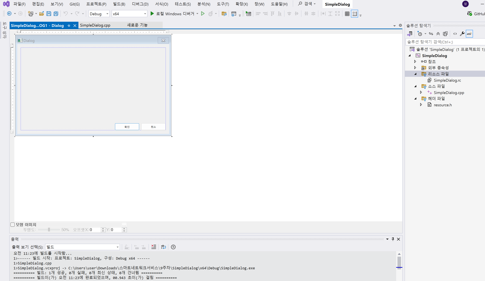
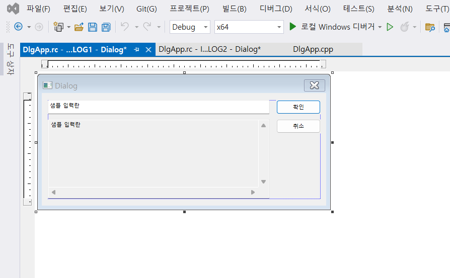
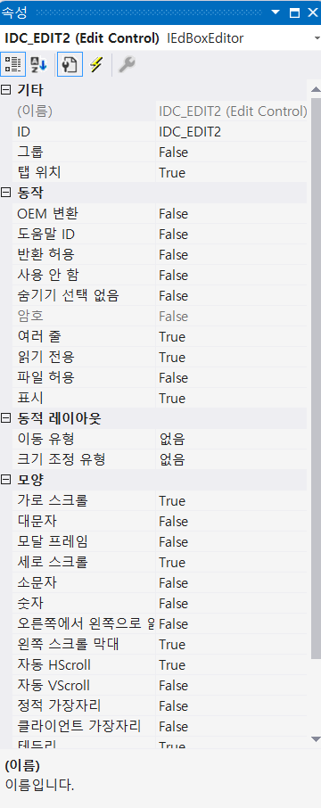
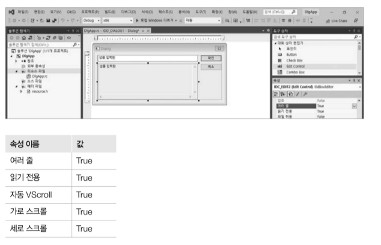
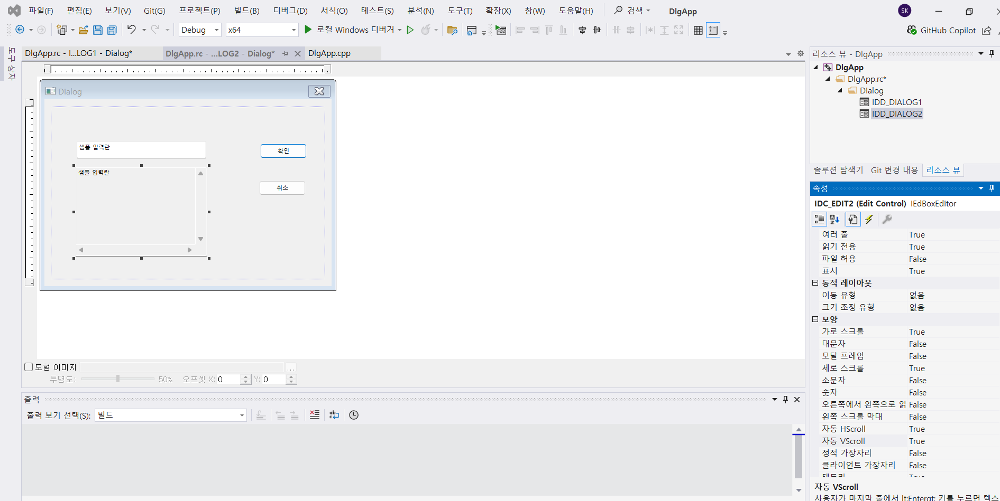
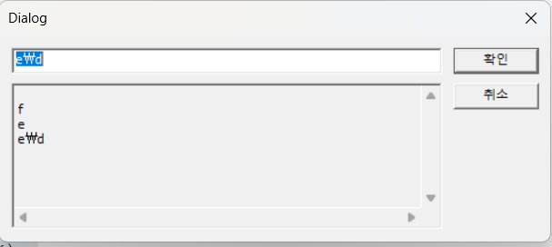
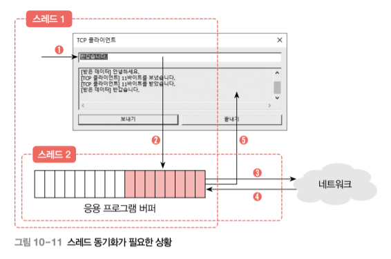
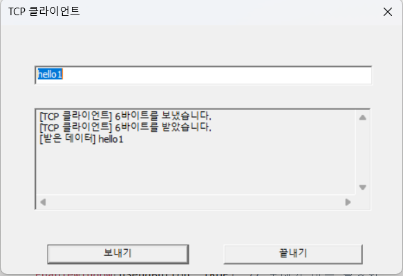
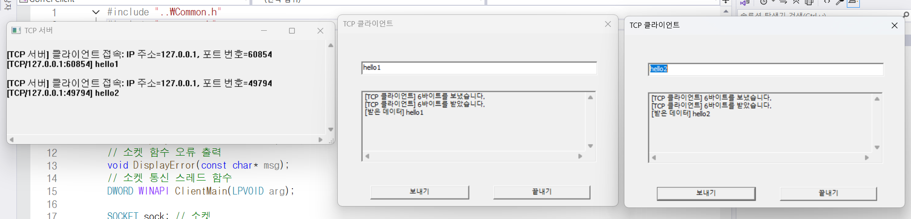

# GUI 응용 프로그램_Class 2

## 대화상자(Dialog Box)

- 사용자가 프로그램과 상호작용할 수 있도록 만들어진 특수한 형태의 윈도우(Window)
    - 주로 간단한 입력, 설정, 확인 등을 수행할 때 사용
        - “파일 열기”, “저장”, “설정”, “확인 / 취소” 창 등
        - 사용자 입력용 **에디트 컨트롤(Edit)**, **버튼(Button)**, **체크박스(CheckBox)** 등을 포함

---

| 항목 | 설명 |
| --- | --- |
| **기능 목적** | 사용자에게 정보를 보여주거나 입력을 받음 |
| **생성 방식** | 리소스(.rc 파일)로 정의하거나 코드로 동적으로 생성 |
| **종류** | 모달(Modal), 모델리스(Modeless) 두 가지 |
| **윈도우 클래스** | 일반 윈도우와 달리, `DialogBox()` 또는 `CreateDialog()`로 생성 |
| **핵심 함수** | `DialogBox`, `DialogBoxParam`, `CreateDialog`, `EndDialog` 등 |

---

## 종류

### **모달 대화상자 (Modal Dialog)**

- 현재 대화상자가 닫히기 전까지 **다른 창과 상호작용 불가**
- “확인/취소” 메시지 박스

```c
DialogBox(hInstance, MAKEINTRESOURCE(IDD_DIALOG1), hWndParent, DlgProc);

```

### **모달리스 대화상자 (Modaless Dialog)**

- 동시에 다른 윈도우와도 상호작용 가능
- "찾기" 창 등

```c
HWND hDlg = CreateDialog(hInstance, MAKEINTRESOURCE(IDD_DIALOG1), hWndParent, DlgProc);
ShowWindow(hDlg, SW_SHOW);

```

---

## 대화상자 프로시저(Dialog Procedure)

- 모든 대화상자는 메시지를 처리하기 위해 **대화상자 프로시저(DlgProc)**가 필요

```c
INT_PTR CALLBACK DlgProc(HWND hDlg, UINT uMsg, WPARAM wParam, LPARAM lParam)
{
    switch (uMsg) {
    case WM_INITDIALOG:
        // 초기화 코드 (컨트롤 핸들 얻기 등)
        return TRUE;

    case WM_COMMAND:
        switch (LOWORD(wParam)) {
        case IDOK:
            // OK 버튼 처리
            EndDialog(hDlg, IDOK);
            return TRUE;
        case IDCANCEL:
            EndDialog(hDlg, IDCANCEL);
            return TRUE;
        }
        return FALSE;
    }
    return FALSE;
}

```

---

## 구성 요소

| 구성 요소 | 설명 |
| --- | --- |
| **에디트 컨트롤 (Edit)** | 사용자로부터 텍스트 입력 받기 |
| **버튼 (Button)** | 명령 실행 (OK, Cancel 등) |
| **정적 텍스트 (Static Text)** | 설명 또는 안내 표시 |
| **체크박스/라디오버튼** | 다중 또는 단일 선택 기능 |
| **리스트박스 / 콤보박스** | 여러 선택지 중에서 선택 가능 |

---

## 대화상자 리소스 예시 (.rc 파일)

```
IDD_DIALOG1 DIALOGEX 0, 0, 200, 120
STYLE WS_POPUP | WS_VISIBLE | WS_CAPTION | WS_SYSMENU
CAPTION "사용자 입력"
FONT 10, "굴림"
BEGIN
    LTEXT           "이름:", -1, 10, 10, 30, 10
    EDITTEXT        IDC_EDIT1, 50, 10, 120, 14, ES_AUTOHSCROLL
    PUSHBUTTON      "확인", IDOK, 50, 40, 50, 14
    PUSHBUTTON      "취소", IDCANCEL, 110, 40, 50, 14
END

```

---

## 일반 윈도우(WinMain)와의 차이점

| 구분 | 일반 윈도우 | 대화상자 |
| --- | --- | --- |
| 생성 함수 | `CreateWindow()` | `DialogBox()`, `CreateDialog()` |
| 메시지 루프 | 직접 작성 (`GetMessage`) | 자동 처리됨 (`DialogBox` 내부에 존재) |
| 메시지 처리 함수 | `WndProc()` | `DlgProc()` |
| UI 정의 | 코드로 작성 | 주로 리소스(.rc) 파일에서 정의 |

---

## **[1]  간단한 대화상자 (Dialog) GUI** 프로젝트

- 프로젝트명 : SimpleDialog
- 구성화면



- 코드

```cpp
#include <windows.h>
#include "resource.h"

INT_PTR CALLBACK DlgProc(HWND, UINT, WPARAM, LPARAM);

int WINAPI WinMain(HINSTANCE hInstance, HINSTANCE hPrevInstance,
	LPSTR lpCmdLine, int nCmdShow)
{
	DialogBox(hInstance, MAKEINTRESOURCE(IDD_DIALOG1), NULL, DlgProc);
	return 0;
}

INT_PTR CALLBACK DlgProc(HWND hDlg, UINT uMsg, WPARAM wParam, LPARAM lParam)
{
	switch (uMsg) {
	case WM_INITDIALOG:
		return TRUE;
	case WM_COMMAND:
		switch (LOWORD(wParam)) {
		case IDOK:
			EndDialog(hDlg, IDOK);
			return TRUE;
		case IDCANCEL:
			EndDialog(hDlg, IDCANCEL);
			return TRUE;
		}
		return FALSE;
	}
	return FALSE;
}
```

- 결과



- **`resource.h`와 리소스 파일(.rc)** 에 정의된 **IDD_DIALOG1** 대화상자를 실행하고, 그 안의 **확인(IDOK)** / **취소(IDCANCEL)** 버튼을 처리하는 예제

---

### 헤더 포함

- `windows.h`: Win32 API 기본 헤더
- `resource.h`: 리소스(대화상자, 컨트롤 ID 등) 식별자를 정의한 헤더

```c
#include <windows.h>
#include "resource.h"

```

---

### 대화상자 프로시저 선언

- 대화상자에서 발생하는 메시지를 처리하는 콜백 함수
    - 일반 윈도우의 `WndProc()`과 비슷한 역할

```c
INT_PTR CALLBACK DlgProc(HWND, UINT, WPARAM, LPARAM);

```

---

### 프로그램 진입점 — `WinMain`

```c
int WINAPI WinMain(HINSTANCE hInstance, HINSTANCE hPrevInstance,
	LPSTR lpCmdLine, int nCmdShow)
{
	DialogBox(hInstance, MAKEINTRESOURCE(IDD_DIALOG1), NULL, DlgProc);
	return 0;
}

```

- `DialogBox()` 함수로 **모달 대화상자**를 실행

| 인자 | 의미 |
| --- | --- |
| `hInstance` | 실행 중인 프로그램의 인스턴스 핸들 |
| `MAKEINTRESOURCE(IDD_DIALOG1)` | 대화상자 리소스 ID |
| `NULL` | 부모 윈도우 없음 |
| `DlgProc` | 메시지를 처리할 함수 포인터 |
- 실행 시 대화상자가 나타나고, 대화상자가 닫히면 프로그램이 종료됩니다.

---

### 대화상자 프로시저 — `DlgProc`

```c
INT_PTR CALLBACK DlgProc(HWND hDlg, UINT uMsg, WPARAM wParam, LPARAM lParam)
{
	switch (uMsg) {
	case WM_INITDIALOG:
		return TRUE;
	case WM_COMMAND:
		switch (LOWORD(wParam)) {
		case IDOK:
			EndDialog(hDlg, IDOK);
			return TRUE;
		case IDCANCEL:
			EndDialog(hDlg, IDCANCEL);
			return TRUE;
		}
		return FALSE;
	}
	return FALSE;
}

```

### 메시지 처리

| 메시지 | 역할 |
| --- | --- |
| `WM_INITDIALOG` | 대화상자가 처음 생성될 때 1회 호출초기화 코드 작성 위치 |
| `WM_COMMAND` | 버튼 등 컨트롤의 명령 처리 |
| `IDOK` | “확인” 버튼 클릭 시 대화상자 종료 |
| `IDCANCEL` | “취소” 버튼 클릭 시 대화상자 종료 |

### `EndDialog(hDlg, IDOK)`

- 대화상자를 닫고, `DialogBox()`의 반환값을 `IDOK`로 설정

---

## 리소스 파일 (resource.rc)

```
#include "resource.h"

IDD_DIALOG1 DIALOGEX 0, 0, 180, 100
STYLE WS_CAPTION | WS_SYSMENU
CAPTION "기본 대화상자"
FONT 9, "굴림"
BEGIN
    DEFPUSHBUTTON "확인", IDOK, 50, 70, 40, 14
    PUSHBUTTON    "취소", IDCANCEL, 100, 70, 40, 14
END

```

---

1. `WinMain()` → `DialogBox()` 호출
2. 대화상자 표시 → 내부적으로 메시지 루프 자동 처리
3. 사용자가 버튼 클릭 → `WM_COMMAND` 메시지 발생
4. `DlgProc()`이 메시지 처리 후 `EndDialog()`로 종료
5. `DialogBox()` 반환 → 프로그램 종료

---

## 모달 vs 모델리스

| 구분 | 함수 | 특징 |
| --- | --- | --- |
| **모달 대화상자** | `DialogBox()` | 대화상자가 닫히기 전엔 다른 창 조작 불가 |
| **모델리스 대화상자** | `CreateDialog()` | 동시에 다른 창 조작 가능 |

---

- 이 코드는 모달 대화상자(DialogBox) 를 띄우고,  **OK / Cancel 버튼으로 종료하는 가장 기본적인 Win32 대화상자 예제**

## **[2]  대화상자(Dialog) GUI** 프로젝트

- 프로젝트명 : DlgApp
- **Win32 API를 이용한 간단한 대화상자(Dialog) 프로그램**
    - 사용자가 에디트 컨트롤(Edit Control)에 입력한 문자열을 확인(OK)버튼을 누르면 **다른 에디트 컨트롤에 출력**

---

- 코드

```jsx
#define _CRT_SECURE_NO_WARNINGS // 구형 C 함수 사용 시 경고 끄기
#include <windows.h>
#include <tchar.h>
#include <stdio.h>
#include "resource.h"

#define BUFSIZE 25

// 대화상자 프로시저
INT_PTR CALLBACK DlgProc(HWND, UINT, WPARAM, LPARAM);
// 에디트 컨트롤 출력 함수
void DisplayText(const char* fmt, ...);

HWND hEdit1, hEdit2; // 에디트 컨트롤

int WINAPI WinMain(HINSTANCE hInstance, HINSTANCE hPrevInstance,
	LPSTR lpCmdLine, int nCmdShow)
{
	// 대화상자 생성
	DialogBox(hInstance, MAKEINTRESOURCE(IDD_DIALOG1), NULL, DlgProc);
	return 0;
}

// 대화상자 프로시저
INT_PTR CALLBACK DlgProc(HWND hDlg, UINT uMsg, WPARAM wParam, LPARAM lParam)
{
	static char buf[BUFSIZE + 1];
	switch (uMsg) {
	case WM_INITDIALOG:
		hEdit1 = GetDlgItem(hDlg, IDC_EDIT1);
		hEdit2 = GetDlgItem(hDlg, IDC_EDIT2);
		SendMessage(hEdit1, EM_SETLIMITTEXT, BUFSIZE, 0);
		return TRUE;
	case WM_COMMAND:
		switch (LOWORD(wParam)) {
		case IDOK:
			GetDlgItemTextA(hDlg, IDC_EDIT1, buf, BUFSIZE + 1);
			DisplayText("%s\r\n", buf);
			SetFocus(hEdit1);
			SendMessage(hEdit1, EM_SETSEL, 0, -1);
			return TRUE;
		case IDCANCEL:
			EndDialog(hDlg, IDCANCEL);
			return TRUE;
		}
		return FALSE;
	}
	return FALSE;
}

// 에디트 컨트롤 출력 함수
void DisplayText(const char* fmt, ...)
{
	va_list arg;
	va_start(arg, fmt);
	char cbuf[BUFSIZE * 2];
	vsprintf(cbuf, fmt, arg);
	va_end(arg);

	int nLength = GetWindowTextLength(hEdit2);
	SendMessage(hEdit2, EM_SETSEL, nLength, nLength);
	SendMessageA(hEdit2, EM_REPLACESEL, FALSE, (LPARAM)cbuf);
}
```

### 1. `WinMain`

- 프로그램 시작점
- `DialogBox()` 함수를 호출하여 대화상자 실행

```c
DialogBox(hInstance, MAKEINTRESOURCE(IDD_DIALOG1), NULL, DlgProc);

```

- `DlgProc`
    - 대화상자 프로시저 함수로, 대화상자의 동작 제어

---

### 2. `DlgProc` (대화상자 프로시저)

- 윈도우 메시지를 처리하는 함수
    - 다음 메시지들을 처리함

| 메시지 | 설명 |
| --- | --- |
| `WM_INITDIALOG` | 대화상자가 처음 생성될 때 실행. 에디트 컨트롤의 핸들을 얻고, 입력 길이 제한을 설정. |
| `WM_COMMAND` | 버튼 클릭 등의 명령이 들어올 때 실행. OK / CANCEL 버튼을 처리. |

### `WM_INITDIALOG`

```c
hEdit1 = GetDlgItem(hDlg, IDC_EDIT1);
hEdit2 = GetDlgItem(hDlg, IDC_EDIT2);
SendMessage(hEdit1, EM_SETLIMITTEXT, BUFSIZE, 0);

```

- `IDC_EDIT1`, `IDC_EDIT2`
    - 에디트 컨트롤의 ID
- `EM_SETLIMITTEXT`
    - 메시지로 입력 길이를 25자로 제한

### `WM_COMMAND`

```c
case IDOK:
    GetDlgItemTextA(hDlg, IDC_EDIT1, buf, BUFSIZE + 1);
    DisplayText("%s\r\n", buf);
    SetFocus(hEdit1);
    SendMessage(hEdit1, EM_SETSEL, 0, -1);
    return TRUE;

```

- OK 버튼 클릭 시:
    - `IDC_EDIT1`의 텍스트를 읽어 `buf`에 저장하고,
    - `DisplayText()` 함수를 호출해 `IDC_EDIT2`에 출력
    - 포커스를 다시 `IDC_EDIT1`로 옮기고 전체 선택 상태로 만듦

---

### 3. `DisplayText()` (출력 함수)

- `printf`처럼 서식을 지정해 문자열을 만든 뒤,
- 두 번째 에디트 컨트롤(`hEdit2`)의 **끝 부분에 이어붙이는 방식**으로 출력

```c
va_list arg;
va_start(arg, fmt);
char cbuf[BUFSIZE * 2];
vsprintf(cbuf, fmt, arg);
va_end(arg);

int nLength = GetWindowTextLength(hEdit2);
SendMessage(hEdit2, EM_SETSEL, nLength, nLength);
SendMessageA(hEdit2, EM_REPLACESEL, FALSE, (LPARAM)cbuf);

```

---

- 대화상자 리소스 디자인


- IDC_EDIT2 속성 변경
    
    
    

- 속성 설정



- IDC_EDIT2 속성 변경



- 출력 화면



- **Windows API 기반의 간단한 대화상자(Dialog) 프로그램**
    - 사용자가 첫 번째 에디트 박스(Edit Control)에 입력한 문자열을, 두 번째 에디트 박스로 출력해주는 구조.
    - 이 프로그램은 `WinMain()`에서 대화상자를 띄우고(`DialogBox`), 입력·출력·버튼 동작을 **대화상자 프로시저(DlgProc)** 안에서 처리

---

---

## 전역 변수

```c
HWND hEdit1, hEdit2;

```

- `hEdit1`: 입력용 에디트 컨트롤 핸들 (`IDC_EDIT1`)
- `hEdit2`: 출력용 에디트 컨트롤 핸들 (`IDC_EDIT2`)

---

### `1. WinMain`

```c
DialogBox(hInstance, MAKEINTRESOURCE(IDD_DIALOG1), NULL, DlgProc);

```

- `resource.h`와 `.rc` 파일에서 정의된 `IDD_DIALOG1` 대화상자를 생성.
- 대화상자의 메시지를 처리하는 함수로 `DlgProc`을 등록.

---

### 2. 대화상자 프로시저 (`DlgProc`)

이 함수가 대화상자에서 발생하는 모든 이벤트를 처리

```c
INT_PTR CALLBACK DlgProc(HWND hDlg, UINT uMsg, WPARAM wParam, LPARAM lParam)

```

### WM_INITDIALOG

```c
hEdit1 = GetDlgItem(hDlg, IDC_EDIT1);
hEdit2 = GetDlgItem(hDlg, IDC_EDIT2);
SendMessage(hEdit1, EM_SETLIMITTEXT, BUFSIZE, 0);

```

- 에디트 컨트롤 핸들을 저장.
- 입력창의 최대 글자 수를 25자로 제한.

### WM_COMMAND

- 버튼 클릭 시 동작을 처리
    - **IDOK (확인 버튼) :** 입력창의 내용을 읽어서 출력창에 표시.
    
    ```c
    GetDlgItemTextA(hDlg, IDC_EDIT1, buf, BUFSIZE + 1);
    DisplayText("%s\r\n", buf);
    
    ```
    
    - 입력창에 포커스를 다시 주고, 전체 선택 상태로 만듦.
- **IDCANCEL (취소 버튼)**
    - 대화상자를 종료.

---

### `3. DisplayText` 함수

```c
void DisplayText(const char* fmt, ...)

```

- 가변 인자를 받아 문자열 포맷(`printf` 스타일)으로 처리한 뒤, 출력 에디트 박스(`hEdit2`)의 끝에 이어붙이는 함수.

```c
int nLength = GetWindowTextLength(hEdit2);
SendMessage(hEdit2, EM_SETSEL, nLength, nLength);
SendMessageA(hEdit2, EM_REPLACESEL, FALSE, (LPARAM)cbuf);

```

- `printf` 결과를 **출력창 끝부분에 붙이는 역할**

---

## **[3] GUI TCP 클라이언트**

- 프로젝트 명 : GUITCPClient
- 대화상자(채팅창 같은 UI)를 띄워서 사용자가 입력한 문자열을 서버로 보내고, 서버의 응답을 받아 출력하는 구조



- 코드

```cpp
#include "..\Common.h"
#include "resource.h"

#define SERVERIP   "127.0.0.1"
#define SERVERPORT 9000
#define BUFSIZE    512

// 대화상자 프로시저
INT_PTR CALLBACK DlgProc(HWND, UINT, WPARAM, LPARAM);
// 에디트 컨트롤 출력 함수
void DisplayText(const char* fmt, ...);
// 소켓 함수 오류 출력
void DisplayError(const char* msg);
// 소켓 통신 스레드 함수
DWORD WINAPI ClientMain(LPVOID arg);

SOCKET sock; // 소켓
char buf[BUFSIZE + 1]; // 데이터 송수신 버퍼
HANDLE hReadEvent, hWriteEvent; // 이벤트
HWND hSendButton; // 보내기 버튼
HWND hEdit1, hEdit2; // 에디트 컨트롤

int WINAPI WinMain(HINSTANCE hInstance, HINSTANCE hPrevInstance,
	LPSTR lpCmdLine, int nCmdShow)
{
	// 윈속 초기화
	WSADATA wsa;
	if (WSAStartup(MAKEWORD(2, 2), &wsa) != 0)
		return 1;

	// 이벤트 생성
	hReadEvent = CreateEvent(NULL, FALSE, TRUE, NULL);
	hWriteEvent = CreateEvent(NULL, FALSE, FALSE, NULL);

	// 소켓 통신 스레드 생성
	CreateThread(NULL, 0, ClientMain, NULL, 0, NULL);

	// 대화상자 생성
	DialogBox(hInstance, MAKEINTRESOURCE(IDD_DIALOG1), NULL, DlgProc);

	// 이벤트 제거
	CloseHandle(hReadEvent);
	CloseHandle(hWriteEvent);

	// 윈속 종료
	WSACleanup();
	return 0;
}

// 대화상자 프로시저
INT_PTR CALLBACK DlgProc(HWND hDlg, UINT uMsg, WPARAM wParam, LPARAM lParam)
{
	switch (uMsg) {
	case WM_INITDIALOG:
		hEdit1 = GetDlgItem(hDlg, IDC_EDIT1);
		hEdit2 = GetDlgItem(hDlg, IDC_EDIT2);
		hSendButton = GetDlgItem(hDlg, IDOK);
		SendMessage(hEdit1, EM_SETLIMITTEXT, BUFSIZE, 0);
		return TRUE;
	case WM_COMMAND:
		switch (LOWORD(wParam)) {
		case IDOK:
			EnableWindow(hSendButton, FALSE); // 보내기 버튼 비활성화
			WaitForSingleObject(hReadEvent, INFINITE); // 읽기 완료 대기
			GetDlgItemTextA(hDlg, IDC_EDIT1, buf, BUFSIZE + 1);
			SetEvent(hWriteEvent); // 쓰기 완료 알림
			SetFocus(hEdit1); // 키보드 포커스 전환
			SendMessage(hEdit1, EM_SETSEL, 0, -1); // 텍스트 전체 선택
			return TRUE;
		case IDCANCEL:
			EndDialog(hDlg, IDCANCEL); // 대화상자 닫기
			closesocket(sock); // 소켓 닫기
			return TRUE;
		}
		return FALSE;
	}
	return FALSE;
}

// 에디트 컨트롤 출력 함수
void DisplayText(const char* fmt, ...)
{
	va_list arg;
	va_start(arg, fmt);
	char cbuf[BUFSIZE * 2];
	vsprintf(cbuf, fmt, arg);
	va_end(arg);

	int nLength = GetWindowTextLength(hEdit2);
	SendMessage(hEdit2, EM_SETSEL, nLength, nLength);
	SendMessageA(hEdit2, EM_REPLACESEL, FALSE, (LPARAM)cbuf);
}

// 소켓 함수 오류 출력
void DisplayError(const char* msg)
{
	LPVOID lpMsgBuf;
	FormatMessageA(
		FORMAT_MESSAGE_ALLOCATE_BUFFER | FORMAT_MESSAGE_FROM_SYSTEM,
		NULL, WSAGetLastError(),
		MAKELANGID(LANG_NEUTRAL, SUBLANG_DEFAULT),
		(char*)&lpMsgBuf, 0, NULL);
	DisplayText("[%s] %s\r\n", msg, (char*)lpMsgBuf);
	LocalFree(lpMsgBuf);
}

// TCP 클라이언트 시작 부분
DWORD WINAPI ClientMain(LPVOID arg)
{
	int retval;

	// 소켓 생성
	sock = socket(AF_INET, SOCK_STREAM, 0);
	if (sock == INVALID_SOCKET) err_quit("socket()");

	// connect()
	struct sockaddr_in serveraddr;
	memset(&serveraddr, 0, sizeof(serveraddr));
	serveraddr.sin_family = AF_INET;
	serveraddr.sin_addr.s_addr = inet_addr(SERVERIP);
	serveraddr.sin_port = htons(SERVERPORT);
	retval = connect(sock, (struct sockaddr*)&serveraddr, sizeof(serveraddr));
	if (retval == SOCKET_ERROR) err_quit("connect()");

	// 서버와 데이터 통신
	while (1) {
		WaitForSingleObject(hWriteEvent, INFINITE); // 쓰기 완료 대기

		// 문자열 길이가 0이면 보내지 않음
		if (strlen(buf) == 0) {
			EnableWindow(hSendButton, TRUE); // 보내기 버튼 활성화
			SetEvent(hReadEvent); // 읽기 완료 알림
			continue;
		}

		// 데이터 보내기
		retval = send(sock, buf, (int)strlen(buf), 0);
		if (retval == SOCKET_ERROR) {
			DisplayError("send()");
			break;
		}
		DisplayText("[TCP 클라이언트] %d바이트를 보냈습니다.\r\n", retval);

		// 데이터 받기
		retval = recv(sock, buf, retval, MSG_WAITALL);
		if (retval == SOCKET_ERROR) {
			DisplayError("recv()");
			break;
		}
		else if (retval == 0)
			break;

		// 받은 데이터 출력
		buf[retval] = '\0';
		DisplayText("[TCP 클라이언트] %d바이트를 받았습니다.\r\n", retval);
		DisplayText("[받은 데이터] %s\r\n", buf);

		EnableWindow(hSendButton, TRUE); // 보내기 버튼 활성화
		SetEvent(hReadEvent); // 읽기 완료 알림
	}

	return 0;
}
```

## 프로그램 구조

```
WinMain → ClientMain(소켓 스레드)
        → DlgProc(대화상자 메시지 처리)

```

- **WinMain**
    - 프로그램 시작점
- **DlgProc**
    - 대화상자(UI) 처리 (입력/버튼 클릭 등)
- **ClientMain**
    - 백그라운드에서 소켓 통신 (서버와 send/recv)
- **DisplayText / DisplayError**
    - 화면 출력과 오류 표시 보조 함수

---

## WinMain — 프로그램 시작과 초기화

- 윈속 초기화. TCP/IP를 쓰기 위한 필수 준비

```c
WSAStartup(MAKEWORD(2, 2), &wsa);

```

- **이벤트 객체 두 개 생성**
    - `hReadEvent`
        - UI 쪽에서 읽기 가능 상태 알림
    - `hWriteEvent`
        - 소켓 스레드 쪽에서 전송 준비 완료 신호를 기다릴 때 사용

```c
hReadEvent = CreateEvent(NULL, FALSE, TRUE, NULL);
hWriteEvent = CreateEvent(NULL, FALSE, FALSE, NULL);

```

- **통신 전용 스레드 생성**
    - 서버 연결 및 send/recv 수행

```c
CreateThread(NULL, 0, ClientMain, NULL, 0, NULL);

```

- **대화상자 실행**
    - 여기서 `DlgProc()`이 계속 메시지를 처리(UI 루프 역할).

```c
DialogBox(hInstance, MAKEINTRESOURCE(IDD_DIALOG1), NULL, DlgProc);

```

---

## DlgProc — 사용자 입력 처리

- 대화상자의 **메시지 처리 함수**
- `WM_INITDIALOG`
    - 처음 실행 시 컨트롤 핸들 저장
    
    ```c
    hEdit1 = GetDlgItem(hDlg, IDC_EDIT1);  // 입력창
    hEdit2 = GetDlgItem(hDlg, IDC_EDIT2);  // 출력창
    hSendButton = GetDlgItem(hDlg, IDOK);  // "보내기" 버튼
    
    ```
    
- `WM_COMMAND`: 버튼이 눌릴 때 처리
    - `IDOK` : "보내기" 버튼 클릭 시
    - **입력 내용을 전역 변수 buf에 복사**하고, **통신 스레드(ClientMain)가 send() 하도록 이벤트로 신호**를 보냄
    
    ```c
    EnableWindow(**hSendButton**, FALSE);       **// 버튼 잠금**
    WaitForSingleObject(**hReadEvent**, INFINITE); **// 읽기 가능 대기**
    GetDlgItemTextA(hDlg, IDC_EDIT1, buf, BUFSIZE + 1); // 입력 내용 가져옴
    SetEvent(**hWriteEvent**);                  **// 스레드에게 "보낼 데이터 있음" 신호**
    
    ```
    
    - `IDCANCEL`
        - "닫기" 버튼 → 소켓 닫고 종료
        
        ```c
        closesocket(sock);
        EndDialog(hDlg, IDCANCEL);
        
        ```
        

---

## ClientMain — 서버와의 TCP 통신 스레드

- 별도 스레드에서 실행
1. **소켓 생성**
    
    ```c
    sock = socket(AF_INET, SOCK_STREAM, 0);
    
    ```
    
2. **서버 접속**
    
    ```c
    connect(sock, (struct sockaddr*)&serveraddr, sizeof(serveraddr));
    
    ```
    
3. **통신 루프**
- UI에서 **보내기 버튼 누르면 → hWriteEvent 신호 발생 → send()**
- → 서버 응답 받으면 **출력창에 표시 후 hReadEvent 설정 → UI 입력 가능 상태로 복귀**

```c
while (1) {
    WaitForSingleObject(hWriteEvent, INFINITE); // 전송 신호 대기

    if (strlen(buf) == 0) { ... continue; }

    send(sock, buf, strlen(buf), 0);  // 서버로 전송
    recv(sock, buf, retval, MSG_WAITALL);  // 서버 응답 수신
    DisplayText("[받은 데이터] %s\r\n", buf);
    SetEvent(hReadEvent); // 다시 입력 가능 신호
}

```

---

## DisplayText — 출력창에 로그 남기기

- 출력창(`hEdit2`)에 문자열 추가
    - 주로 통신 로그나 서버 응답 표시용.

```c
SendMessage(hEdit2, EM_REPLACESEL, FALSE, (LPARAM)cbuf);

```

---

## DisplayError — 소켓 오류 메시지 표시

- `WSAGetLastError()`
    - 코드로 시스템 오류 메시지를 얻어 출력창에 표시.

---

## 동작

- **UI 스레드와 통신 스레드가 이벤트로 동기화**되는 구조

```
[사용자 입력] → [보내기 버튼 클릭]
             ↓
(UI) buf에 저장, hWriteEvent 신호
             ↓
[ClientMain] send() → recv()
             ↓
DisplayText()로 결과 출력
             ↓
(UI) hReadEvent 신호 → 버튼 활성화

```

---

| 항목 | 설명 |
| --- | --- |
| **멀티스레드 구조** | 대화상자(UI)와 네트워크 통신을 분리 |
| **이벤트 동기화** | hReadEvent/hWriteEvent로 send/recv 시점 제어 |
| **버퍼 공유** | buf[]를 전역으로 공유 (단일 스레드만 접근) |
| **WSAStartup/WSACleanup** | Winsock 초기화 및 종료 필수 |
| **DisplayText()** | 로그를 UI에 출력 (멀티스레드 간 안전한 표시) |

---

- GUITCPClient 화면



- 결과
    - GUITCPServer 실행 후 GUITCPClient 실행



---

## GUITCPClient의 스레드 제어 규칙

### 스레드 구성

- **윈도우 스레드(UI 스레드)**
    - 사용자의 입력을 받아 `buf`에 쓰는 역할
    - `GetDlgItemTextA()`로 입력 문자열을 버퍼에 저장
- **소켓 스레드(ClientMain)**
    - `buf`의 내용을 읽어 서버로 전송(`send()`), 그리고 수신(`recv()`)

---

## 공유 자원: 송수신 버퍼(buf)

- 두 스레드가 같은 메모리(`buf`)를 **공유**
- 동시에 접근하면 **데이터 손상·중복 전송·부분 송신** 오류 발생
    - 동기화 필요

---

## 이벤트 객체를 이용한 스레드 동기화

| 이벤트 | 생성 시점 | 역할 | 신호 상태의 의미 |
| --- | --- | --- | --- |
| `hReadEvent` | 초기 신호(TRUE) | **읽기 완료 알림** | 소켓 스레드가 `buf`를 다 읽고 나면 SetEvent() 호출 |
| `hWriteEvent` | 초기 비신호(FALSE) | **쓰기 완료 알림** | 윈도우 스레드가 `buf`에 데이터를 다 쓴 뒤 SetEvent() 호출 |

---

## 윈도우 스레드 규칙

1. **보내기 버튼 클릭 시**
    - `WaitForSingleObject(hReadEvent, INFINITE)`
        - **소켓 스레드**가 이전 데이터를 다 읽을 때까지 대기
    - `GetDlgItemTextA()`
        - `buf`에 새 문자열 저장
    - `SetEvent(hWriteEvent)`
        - 쓰기 완료 신호 → **소켓 스레드** 동작 시작
    - `EnableWindow(hSendButton, FALSE)`
        - 중복 전송 방지 (버튼 잠금)
2. **빈 문자열일 경우**
    - `strlen(buf)==0`이면 전송하지 않음
        - 대신 `EnableWindow(hSendButton, TRUE)` + `SetEvent(hReadEvent)`
            - UI는 다시 입력 가능

---

## 소켓 스레드 규칙

1. `WaitForSingleObject(hWriteEvent, INFINITE)`
    1. **윈도우 스레드**가 쓰기 완료 신호를 보낼 때까지 대기
2. `send(sock, buf, strlen(buf), 0)`
    1. 버퍼 내용을 서버로 전송
3. `recv(sock, buf, ...)`
    1. 서버로부터 응답 수신
4. `SetEvent(hReadEvent)`
    1. 읽기 완료 신호 → **윈도우 스레드**가 다음 입력 가능
5. `EnableWindow(hSendButton, TRUE)`
    1. 보내기 버튼 재활성화

---

## 이벤트 시퀀스

| 동작 주체 | 이벤트/함수 | 의미 |
| --- | --- | --- |
| 윈도우 스레드 | `WaitForSingleObject(hReadEvent)` | 이전 전송 완료 대기 |
| 윈도우 스레드 | `GetDlgItemTextA()` | 입력 문자열을 `buf`에 저장 |
| 윈도우 스레드 | `SetEvent(hWriteEvent)` | 쓰기 완료 알림 |
| 소켓 스레드 | `WaitForSingleObject(hWriteEvent)` | 데이터 준비될 때까지 대기 |
| 소켓 스레드 | `send()` / `recv()` | 데이터 송수신 수행 |
| 소켓 스레드 | `SetEvent(hReadEvent)` | 읽기 완료 알림 |
| 윈도우 스레드 | `EnableWindow(hSendButton, TRUE)` | 다음 입력 가능 |

---

## 규칙

| 구분 | 규칙 | 목적 |
| --- | --- | --- |
| **이벤트 기반 제어** | `hWriteEvent`: 쓰기 완료 / `hReadEvent`: 읽기 완료 | 스레드 간 순서 보장 |
| **버튼 제어** | 전송 중엔 비활성(`FALSE`), 완료 후 활성(`TRUE`) | 중복 전송 방지 |
| **순서 보장** | 쓰기 → 읽기 → 쓰기 → … 순환 | 버퍼 충돌 방지 |
| **빈 문자열 예외 처리** | 전송 생략하되 `hReadEvent`는 Set | UI 정지 방지 |
| **UI 스레드에서만 윈도우 조작** | PostMessage로 전달 권장 | GUI 안정성 확보 |

---

- `buf`를 공유하는 두 스레드 간에 **이벤트 객체를 사용한 동기화(Event-based Synchronization)**
    - 중복 전송, 데이터 섞임, UI 멈춤 문제를 모두 예방
