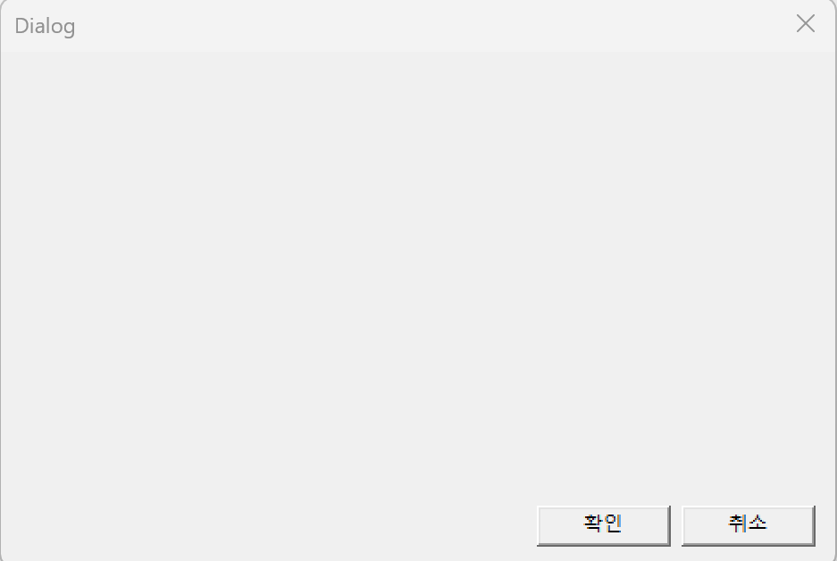

# GUI 응용 프로그램_Class 2

## **[1]  대화상자(Dialog) GUI** 프로젝트

- 프로젝트명 : DlgApp
- **Win32 API를 이용한 간단한 대화상자(Dialog) 프로그램**
    - 사용자가 에디트 컨트롤(Edit Control)에 입력한 문자열을 확인(OK)버튼을 누르면 **다른 에디트 컨트롤에 출력**

---

- 코드

```jsx
#define _CRT_SECURE_NO_WARNINGS // 구형 C 함수 사용 시 경고 끄기
#include <windows.h>
#include <tchar.h>
#include <stdio.h>
#include "resource.h"

#define BUFSIZE 25

// 대화상자 프로시저
INT_PTR CALLBACK DlgProc(HWND, UINT, WPARAM, LPARAM);
// 에디트 컨트롤 출력 함수
void DisplayText(const char* fmt, ...);

HWND hEdit1, hEdit2; // 에디트 컨트롤

int WINAPI WinMain(HINSTANCE hInstance, HINSTANCE hPrevInstance,
	LPSTR lpCmdLine, int nCmdShow)
{
	// 대화상자 생성
	DialogBox(hInstance, MAKEINTRESOURCE(IDD_DIALOG1), NULL, DlgProc);
	return 0;
}

// 대화상자 프로시저
INT_PTR CALLBACK DlgProc(HWND hDlg, UINT uMsg, WPARAM wParam, LPARAM lParam)
{
	static char buf[BUFSIZE + 1];
	switch (uMsg) {
	case WM_INITDIALOG:
		hEdit1 = GetDlgItem(hDlg, IDC_EDIT1);
		hEdit2 = GetDlgItem(hDlg, IDC_EDIT2);
		SendMessage(hEdit1, EM_SETLIMITTEXT, BUFSIZE, 0);
		return TRUE;
	case WM_COMMAND:
		switch (LOWORD(wParam)) {
		case IDOK:
			GetDlgItemTextA(hDlg, IDC_EDIT1, buf, BUFSIZE + 1);
			DisplayText("%s\r\n", buf);
			SetFocus(hEdit1);
			SendMessage(hEdit1, EM_SETSEL, 0, -1);
			return TRUE;
		case IDCANCEL:
			EndDialog(hDlg, IDCANCEL);
			return TRUE;
		}
		return FALSE;
	}
	return FALSE;
}

// 에디트 컨트롤 출력 함수
void DisplayText(const char* fmt, ...)
{
	va_list arg;
	va_start(arg, fmt);
	char cbuf[BUFSIZE * 2];
	vsprintf(cbuf, fmt, arg);
	va_end(arg);

	int nLength = GetWindowTextLength(hEdit2);
	SendMessage(hEdit2, EM_SETSEL, nLength, nLength);
	SendMessageA(hEdit2, EM_REPLACESEL, FALSE, (LPARAM)cbuf);
}
```

### 1. `WinMain`

- 프로그램 시작점
- `DialogBox()` 함수를 호출하여 대화상자 실행

```c
DialogBox(hInstance, MAKEINTRESOURCE(IDD_DIALOG1), NULL, DlgProc);

```

- `DlgProc`
    - 대화상자 프로시저 함수로, 대화상자의 동작 제어

---

### 2. `DlgProc` (대화상자 프로시저)

- 윈도우 메시지를 처리하는 함수
    - 다음 메시지들을 처리함

| 메시지 | 설명 |
| --- | --- |
| `WM_INITDIALOG` | 대화상자가 처음 생성될 때 실행. 에디트 컨트롤의 핸들을 얻고, 입력 길이 제한을 설정. |
| `WM_COMMAND` | 버튼 클릭 등의 명령이 들어올 때 실행. OK / CANCEL 버튼을 처리. |

### `WM_INITDIALOG`

```c
hEdit1 = GetDlgItem(hDlg, IDC_EDIT1);
hEdit2 = GetDlgItem(hDlg, IDC_EDIT2);
SendMessage(hEdit1, EM_SETLIMITTEXT, BUFSIZE, 0);

```

- `IDC_EDIT1`, `IDC_EDIT2`
    - 에디트 컨트롤의 ID
- `EM_SETLIMITTEXT`
    - 메시지로 입력 길이를 25자로 제한

### `WM_COMMAND`

```c
case IDOK:
    GetDlgItemTextA(hDlg, IDC_EDIT1, buf, BUFSIZE + 1);
    DisplayText("%s\r\n", buf);
    SetFocus(hEdit1);
    SendMessage(hEdit1, EM_SETSEL, 0, -1);
    return TRUE;

```

- OK 버튼 클릭 시:
    - `IDC_EDIT1`의 텍스트를 읽어 `buf`에 저장하고,
    - `DisplayText()` 함수를 호출해 `IDC_EDIT2`에 출력
    - 포커스를 다시 `IDC_EDIT1`로 옮기고 전체 선택 상태로 만듦

---

### 3. `DisplayText()` (출력 함수)

- `printf`처럼 서식을 지정해 문자열을 만든 뒤,
- 두 번째 에디트 컨트롤(`hEdit2`)의 **끝 부분에 이어붙이는 방식**으로 출력

```c
va_list arg;
va_start(arg, fmt);
char cbuf[BUFSIZE * 2];
vsprintf(cbuf, fmt, arg);
va_end(arg);

int nLength = GetWindowTextLength(hEdit2);
SendMessage(hEdit2, EM_SETSEL, nLength, nLength);
SendMessageA(hEdit2, EM_REPLACESEL, FALSE, (LPARAM)cbuf);

```

---

- 출력 화면


- 다이얼로그



- 속성


- **Windows API 기반의 간단한 대화상자(Dialog) 프로그램**
    - 사용자가 첫 번째 에디트 박스(Edit Control)에 입력한 문자열을, 두 번째 에디트 박스로 출력해주는 구조.
    - 이 프로그램은 `WinMain()`에서 대화상자를 띄우고(`DialogBox`), 입력·출력·버튼 동작을 **대화상자 프로시저(DlgProc)** 안에서 처리

---

---

## 전역 변수

```c
HWND hEdit1, hEdit2;

```

- `hEdit1`: 입력용 에디트 컨트롤 핸들 (`IDC_EDIT1`)
- `hEdit2`: 출력용 에디트 컨트롤 핸들 (`IDC_EDIT2`)

---

### `1. WinMain`

```c
DialogBox(hInstance, MAKEINTRESOURCE(IDD_DIALOG1), NULL, DlgProc);

```

- `resource.h`와 `.rc` 파일에서 정의된 `IDD_DIALOG1` 대화상자를 생성.
- 대화상자의 메시지를 처리하는 함수로 `DlgProc`을 등록.

---

### 2. 대화상자 프로시저 (`DlgProc`)

이 함수가 대화상자에서 발생하는 모든 이벤트를 처리

```c
INT_PTR CALLBACK DlgProc(HWND hDlg, UINT uMsg, WPARAM wParam, LPARAM lParam)

```

### WM_INITDIALOG

```c
hEdit1 = GetDlgItem(hDlg, IDC_EDIT1);
hEdit2 = GetDlgItem(hDlg, IDC_EDIT2);
SendMessage(hEdit1, EM_SETLIMITTEXT, BUFSIZE, 0);

```

- 에디트 컨트롤 핸들을 저장.
- 입력창의 최대 글자 수를 25자로 제한.

### WM_COMMAND

- 버튼 클릭 시 동작을 처리
    - **IDOK (확인 버튼) :** 입력창의 내용을 읽어서 출력창에 표시.
    
    ```c
    GetDlgItemTextA(hDlg, IDC_EDIT1, buf, BUFSIZE + 1);
    DisplayText("%s\r\n", buf);
    
    ```
    
    - 입력창에 포커스를 다시 주고, 전체 선택 상태로 만듦.
- **IDCANCEL (취소 버튼)**
    - 대화상자를 종료.

---

### `3. DisplayText` 함수

```c
void DisplayText(const char* fmt, ...)

```

- 가변 인자를 받아 문자열 포맷(`printf` 스타일)으로 처리한 뒤, 출력 에디트 박스(`hEdit2`)의 끝에 이어붙이는 함수.

```c
int nLength = GetWindowTextLength(hEdit2);
SendMessage(hEdit2, EM_SETSEL, nLength, nLength);
SendMessageA(hEdit2, EM_REPLACESEL, FALSE, (LPARAM)cbuf);

```

- `printf` 결과를 **출력창 끝부분에 붙이는 역할**

---

##
