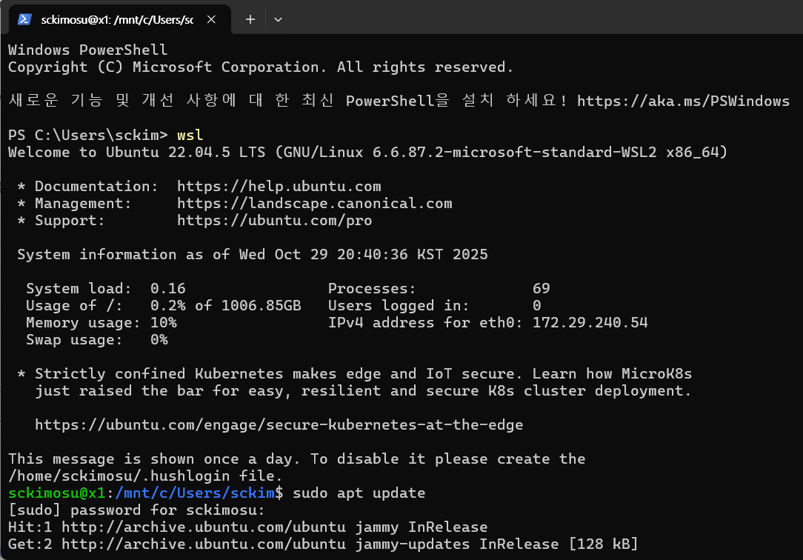
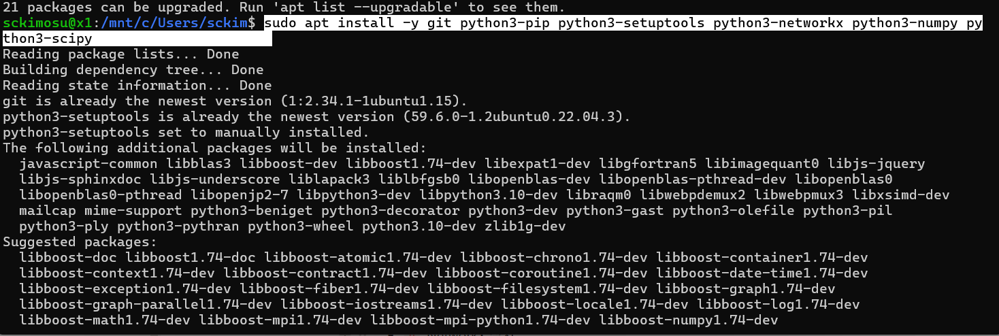
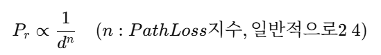
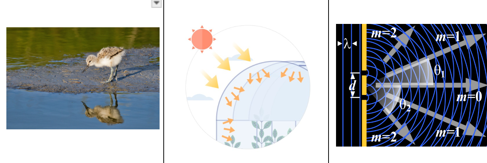
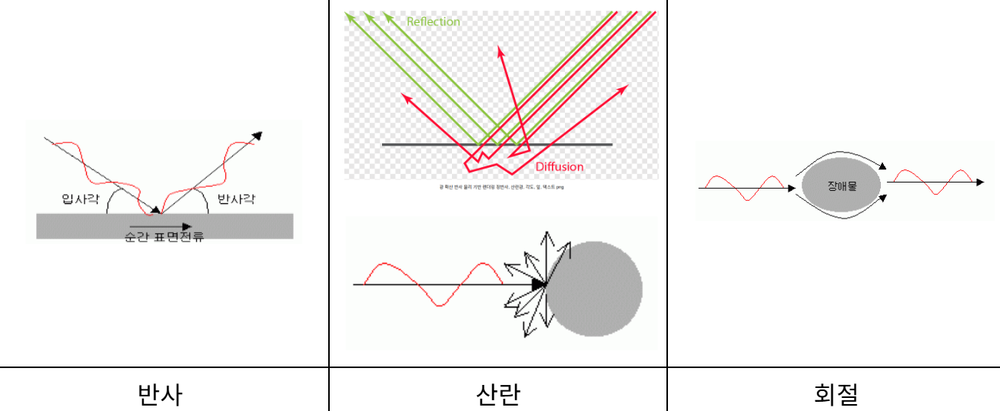

# SDN과 경로 손실(Path Loss)

- 무선 통신(Wireless Communications)의 기본 중 하나인 **경로 손실(Path Loss)** 세부 현상
    - 감쇄, 장기 페이딩, 단기 페이딩

---

## 1. Mininet-WiFi 설치 방법

### (1) 환경 준비

- **운영체제:** Ubuntu 20.04 또는 22.04 (WSL2도 가능)
- **필수 패키지 설치**

```bash
sudo apt update
sudo apt install -y git python3-pip python3-setuptools python3-networkx python3-numpy python3-scipy

```

- 설치 화면



- 설치 화면




- Mininet을 WSL2 (Windows Subsystem for Linux 2) 위에 설치

---

## 설치 단계

### 1. 패키지 업데이트

```bash
sudo apt update && sudo apt upgrade -y

```

### 2. 필수 툴 설치

```bash
sudo apt install -y git build-essential python3 python3-pip

```

### 3. Mininet 소스 클론

```bash
git clone https://github.com/mininet/mininet
cd mininet

```

### 4. 설치 스크립트 실행

```bash
# python3 환경에서 설치
sudo PYTHON=python3 util/install.sh -a

```

- 이 명령으로 자동으로 필요한 종속성, Open vSwitch 등 설치가 진행

---

### (2) Mininet-WiFi 설치

```bash
git clone https://github.com/intrig-unicamp/mininet-wifi.git
cd mininet-wifi
sudo util/install.sh -Wlnfv

```

- `W`: WiFi 지원 포함
- `l`: Link configuration
- `n`: NetworkX 설치
- `f`: OpenFlow 관련 모듈
- `v`: Verbose 모드

### (3) 테스트

- WiFi가 포함된 단일 AP와 3개의 호스트를 자동 구성함.

```bash
sudo mn --wifi --topo single,3

```

---

## 2. 무선 통신 기본 — Path Loss (경로 손실)

- Path Loss는 **무선 신호가 전파되는 동안 세기가 감소하는 현상**
    - 주요 원인은 **거리 증가**, **장애물**, **환경 요인**

---

### a. **Attenuation (신호 감쇄)**

- 송신자와 수신자 사이의 **거리 증가**로 인해 전파 세기가 점점 약해짐.
- 거리 (d)에 따라 신호 세기 (P_r)는 대략적으로



- n: Path Loss 지수, 일반적으로 2~4로 감소

---

### b. **Long-Term Fading (장기 페이딩)**

- **시간적으로 평균적인 신호 감쇠**를 의미.
    - 건물, 지형 등의 **큰 장애물에 의한 신호 차단 또는 반사**가 주요 원인.
    - 예: 도시 빌딩 사이 골목에서 Wi-Fi 세기가 약한 현상.

---

### c. **Short-Term Fading (단기 페이딩)**

- 짧은 시간 또는 작은 거리 이동에서도 생기는 **신호 세기 변동**.
    - 주로 다중 경로(Multipath) 전파로 인한 간섭 때문에 발생.
- 주요 현상
1. **Reflection (반사)**
    - 신호가 매끄러운 표면(건물, 벽 등)을 만나 반사됨.
    - 입사각 = 반사각 ( **스넬의 법칙** 적용).
2. **Scattering (산란)**
    - 표면이 거칠거나 물체 크기가 **파장과 비슷할 때** 신호가 여러 방향으로 흩어짐
    - 약한 신호들이 여러 경로로 수신기에 도달.
3. **Diffraction (회절)**
    - 신호가 **장애물의 모서리**를 돌아 전달되는 현상.
    - 전파가 투과 불가능한 물체를 만나도 일정 부분은 휘어져서 뒤쪽으로 전달됨.

---

| 구분 | 주요 원인 | 시간/공간 특성 | 대표 현상 |
| --- | --- | --- | --- |
| 감쇄 (Attenuation) | 거리 증가 | 거리 의존 | 신호 세기 감소 |
| 장기 페이딩 (Long-Term) | 큰 장애물, 지형 | 느린 변화 | 평균 신호 약화 |
| 단기 페이딩 (Short-Term) | 다중 경로, 반사/산란 | 빠른 변화 | 순간적 세기 변화 |

---





- 다양한 연구

[https://github.com/a9khan/trafficclassifier/blob/master/NetSoft_project.ipynb](https://github.com/a9khan/trafficclassifier/blob/master/NetSoft_project.ipynb)

## Mininet-WiFi에서 Path Loss 모델 실험하기

```python
sudo mn --wifi --topo=single,3 --propagation_model logDistance,exp=3.5

```

- `-propagation_model logDistance,exp=3.5`
    - 로그 거리 모델 기반 신호 감쇠 적용
- `exp`는 Path Loss 지수 (실내 2~3, 실외 3~5 정도)

---
